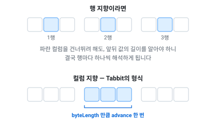

# 바이너리 형식 — 컬럼 지향과 스키마 진화

> [문서 목록으로](readme.md)

런타임 데이터 파일(`.tcb`)의 형식과, 스키마가 바뀌었을 때 무엇이 보장되는지를 적습니다. 이 형식을 쓰는 이유(파싱이 없다·인코딩이 값 크기에 맞는다·값이 변하지 않는다)는 [내보내기](exports.md#바이너리를-쓰는-이유)에 있습니다.

**확장자는 `.tcb` — Tabbit Compiled Binary의 약자입니다.** 이 도구가 빌드해 낸 런타임 데이터라는 뜻이고, 무엇에서 빌드했는지는 이름에 없습니다 — 엑셀이든 다른 소스든 나오는 파일은 같습니다. 안에 든 것은 행이 아니라 컬럼별로 모인 값 블록, 그리고 그 앞에서 각 블록의 길이를 먼저 적어 두는 디스크립터입니다.

확장자는 익스포터와 테이블 리더 양쪽에서 recipe로 바꿀 수 있습니다.
`FileExtension`과 `BinaryTableFileExtension`이고, [설정](recipe.md#내보내기)에 있습니다.

유니티처럼 확장자를 가리는 곳에서는 `.bytes`로 둡니다.
안에 든 바이트는 파일 이름과 무관하게 같습니다.

**바이트 순서는 리틀엔디안입니다.** 고정폭 값(`fixed32`, `fixed64`)은 항상 리틀엔디안으로 기록되고, 테이블 리더는 호스트의 순서가 아니라 그 순서로 해독합니다 — 빅엔디안 기기에서 읽어도 같은 값이 나옵니다. varint는 낮은 7비트부터 나가므로 정의상 리틀엔디안이고, `uuid`만 예외적으로 .NET `Guid` 배치(앞 세 구성요소는 리틀엔디안, 뒤 8바이트는 그대로)를 따릅니다.

**형식 버전은 하나뿐입니다.** 파일 헤더의 버전 정수가 테이블 리더가 아는 값과 다르면 그 자리에서 멈춥니다. 옛 배치로 가는 호환 경로는 없고 만들 계획도 없습니다 — 이 빌드가 못 읽는 파일은 해석할 파일이 아니라 다시 뽑을 파일입니다. 지금 버전은 **107**입니다. 102가 101을 대체한 것은 디스크립터가 인코딩 바이트를 갖게 되면서였고, 103이 102를 대체한 것은 컬럼이 「로우마다 값이 있는지 없는지」를 담을 수 있게 되면서입니다 — 그 비트를 검사하지 않는 리더는 presence 비트맵을 값으로 읽으므로, 버전으로 거부하는 편이 낫습니다. 104가 103을 대체한 것은 인코딩이 4종 늘면서입니다 — 모르는 인코딩 번호를 만난 리더는 그 자리에서 멈추므로 감지되지 않는 읽기 오류는 아니지만, 블록에 닿기 전에 버전에서 멈추는 편이 낫습니다. 105가 104를 대체한 것은 인코딩이 하나 늘고 **presence 비트맵이 인코딩 바이트를 갖게** 되면서입니다 — 그 바이트를 모르는 리더는 비트맵의 첫 바이트로 읽으므로, 이쪽은 에러 없이 잘못 읽는 경우입니다. 106이 105를 대체한 것은 컬럼이 「배열의 어느 원소에 값이 있는지」를 담을 수 있게 되면서입니다 — 와이어 바이트의 마지막 예약 비트인 **비트 7**이 그것을 선언하고, 그 비트를 모르는 리더는 원소 비트맵을 값 블록의 앞부분으로 읽습니다. 107이 106을 대체한 것은 **고정 길이 배열 종류를 없애면서**입니다 — 배열은 하나가 되었고, 디스크립터의 원소 개수 필드도 함께 빠졌습니다. 길이를 파일이 한 번만 말하면 그 길이가 생성 코드에 상수로 굳고, 그러면 컬럼을 하나 더하는 것이 데이터 패치가 아니라 코드 배포가 됩니다. 버전별 결정은 [TCB v102](../spec/wire/tcb-v102-column-encoding.md) · [TCB v103](../spec/wire/tcb-v103-presence-bitmap.md) · [TCB v104](../spec/wire/tcb-v104-composed-encodings.md) · [TCB v105](../spec/wire/tcb-v105-bit-width-packing.md) · [TCB v106](../spec/wire/tcb-v106-element-presence.md) · [TCB v107](../spec/wire/tcb-v107-dynamic-arrays.md)에 있습니다.

## 설계의 출처

**구글 프로토콜 버퍼의 와이어 포맷입니다.** 값 인코딩은 거의 그대로 가져왔습니다.

|가져온 것|프로토버프에서|
|--|--|
|바이트당 7비트를 낮은 자리부터 쓰고, 더 있으면 최상위 비트를 세우는 varint|[Base 128 Varints](https://protobuf.dev/programming-guides/encoding/#varints)|
|부호를 접어 작은 음수도 짧게 만드는 지그재그|[Signed Integers](https://protobuf.dev/programming-guides/encoding/#signed-ints)|
|varint로 손해인 값은 고정폭으로 쓴다는 구분(`fixed32`·`fixed64`)|[Non-varint Numbers](https://protobuf.dev/programming-guides/encoding/#non-varints)|
|길이를 앞에 적어 내용은 몰라도 건너뛸 수 있게 하는 방식|[Length-Delimited Records](https://protobuf.dev/programming-guides/encoding/#length-types)|
|**모르는 필드를 건너뛸 수 있으면 스키마가 바뀌어도 읽을 수 있다**는 wire type 개념 자체|[Message Structure](https://protobuf.dev/programming-guides/encoding/#structure)|

바꾼 것은 그 태그를 어디에 붙이느냐 하나입니다.

프로토콜 버퍼는 값마다 붙이고, 이 형식은 컬럼마다 한 번 붙입니다.
정적 테이블의 행은 동종이라 스키마를 행 수만큼 반복할 이유가 없기 때문입니다.

그 차이를 [레이아웃](#레이아웃)에 적었습니다.

프로토콜 버퍼가 주는 것 중 정적 테이블에 필요 없는 것은 아예 넣지 않았습니다.
임의 깊이의 중첩 메시지, `oneof`, 맵입니다.

전체 인코딩 규격은 [Protocol Buffers — Encoding](https://protobuf.dev/programming-guides/encoding/)에 있습니다. 이 문서의 「[값 인코딩](#값-인코딩)」과 나란히 읽으면 무엇이 같고 무엇이 다른지 바로 보입니다.

---

## 이 형식이 해결하는 문제

행 지향이고 스키마가 파일에 없으면, 테이블 리더는 **생성 시점에 알던 순서 그대로** 읽는 수밖에 없습니다. 그러면 컬럼을 추가하든 지우든 순서를 바꾸든 테이블 리더는 한 칸 밀리고 그 뒤 전부가 어긋납니다 — 실패가 아니라 **조용히 다른 값**입니다.

클라이언트와 데이터를 **항상 함께** 배포한다면 문제가 없습니다. 문제는 그렇게 못 하는 흐름입니다.

- CDN에 데이터만 올려 패치하는 경우
- 스토어 심사 중이거나 업데이트를 미룬 **구버전 클라이언트**가 새 데이터를 받는 경우
- 데이터만 롤백해서 **신버전 클라이언트**가 옛 데이터를 받는 경우

이 형식의 불변식은 하나입니다: **어떤 스키마 변경도 감지되지 않는 읽기 오류가 되지 않습니다.** 읽을 수 있으면 정확히 읽고, 읽을 수 없으면 필드 이름과 양쪽 타입과 함께 멈춥니다.

## 레이아웃

핵심 결정은 행 지향이 아니라 컬럼 지향입니다.

그 선택으로 무엇을 얻고 무엇을 포기했는지, 어떤 상황에 적합하고 어떤 상황에 그렇지 않은지는
[왜 컬럼 지향인가](../spec/wire/tcb-column-oriented-rationale.md)에 따로 적었습니다.

컬럼마다 값이 연속 블록이고 그 블록의 바이트 길이가 헤더에 있으므로, 모르는 컬럼을 건너뛰는 것은
`advance(길이)` 한 번입니다.

타입별 스킵 로직이 없으니 테이블 리더가 각자 다르게 잘못 구현할 지점도 없습니다.



이게 왜 중요하냐면, 테이블 리더가 **자기가 만들어진 뒤에 추가된 컬럼**을 만나는 일이 실제로 생기기 때문입니다. 그때 할 일이 「길이만큼 건너뛴다」 하나로 끝나야 합니다.

프로토버프처럼 값마다 태그를 달면 스키마 정보가 행 수만큼 반복됩니다. 정적 테이블의 행은 동종이라 그럴 이유가 없습니다 — 로컬라이제이션 20,000행 × 8칸이면 값별 태그는 **156 KB**, 테이블 디스크립터는 **56 B**입니다.

```
bytes4     magic          = 54 43 42 00  "TCB\0" — 파일 시그니처
fixed32    version        = 107
fixed8     flags                     bit0 = 암호화(아래 「파일 암호화」), bit1 = 압축(예약, 아직 0)
fixed8     cipher                    0 = 없음, 1 = ChaCha20
bytes12    nonce                     암호화가 아니면 0
bytes16    mac                       MAC이 없으면 0(아래 「변조 검출」)
bytes4     keyCheck       = 54 43 42 00  암호화되면 암호문
counter32  rowCount
counter32  columnCount
columnCount ×:                        ── 디스크립터 ──
  counter32  tag                      1 이상, 테이블 내 유일
  fixed8     wire                     하위 4비트 = 원소 타입, 5~6비트 = 종류,
                                       7비트 = 옵셔널(로우별 presence 비트맵 있음),
                                       8비트 = 원소 옵셔널(원소별 비트맵 있음)
  fixed8     encoding                 블록의 배치. 아래 「컬럼 인코딩」
  fixed32    byteLength               인코딩된 이 컬럼 블록의 총 바이트
columnCount ×:                        ── 데이터 ──
  블록: [옵셔널이면 fixed8 presenceEncoding + 그 인코딩대로 담긴 presence 비트맵]
        (비트맵은 로우당 1비트, 하위 비트부터, 바이트 단위 패딩 — 곧 폭 1 비트팩)
        encoding이 정한 배치로 담긴 rowCount개의 값
```

**헤더는 42바이트 고정입니다** — 암호화 여부·MAC 여부와 무관하게 모든 필드가 같은 자리에 있습니다. 쓰지 않는 필드는 0으로 남습니다. 평문 파일이 치르는 대가는 파일당 37바이트이고(`rescue` 74개 테이블 기준 2.7 KB), 얻는 것은 모든 리더에서 오프셋 계산이 사라지는 것입니다. 근거는 [MAC과 파일 시그니처](../spec/wire/tcb-mac-and-signature.md#42바이트-고정의-근거)에 있습니다.

디스크립터는 컬럼당 **7바이트**(태그가 1바이트로 끝나는 보통의 경우)이고, **테이블당 한 번**입니다. 행이 늘어도 늘지 않습니다.

`byteLength`만 `counter32`가 아니라 `fixed32`입니다. writer가 블록을 다 쓴 뒤 그 자리로 돌아가 값을 채우는데(backpatch), varint는 길이가 값에 따라 달라져서 되채울 수 없기 때문입니다.

### 실제 파일 한 개, 전부

`SecondTable`(1행 3컬럼, 76바이트)입니다. 이 바이트열은 테스트에 그대로 적혀 있습니다 — [검증 게이트](#검증-게이트)의 형식 고정 항목.

```
54 43 42 00   magic "TCB\0"  ── 헤더 42바이트, 여기부터 ──
6b 00 00 00   version 107
00            flags         암호화도 압축도 아님
00            cipher        암호화가 아니므로 0
00 × 12       nonce         암호화가 아니므로 0
00 × 16       mac           MAC이 없으므로 0
54 43 42 00   keyCheck      암호화되면 이 4바이트가 암호문
              ── 여기까지가 헤더, 아래가 본문 ──
02            rowCount    counter32, 지그재그 2 → 1
06            columnCount counter32, 지그재그 6 → 3

02            tag 1
02            wire: 원소 i32(2), 종류 스칼라(0)
01            encoding: VARINT — 값 1은 1바이트, 고정폭이면 4바이트
02            count 1
01 00 00 00   byteLength 1

04            tag 2
06            wire: 원소 string(6), 종류 스칼라(0)
00            encoding: RAW — 1행짜리 컬럼은 사전이 문자열보다 큼
02            count 1
06 00 00 00   byteLength 6

06            tag 3
02            wire: 원소 i32(2), 종류 스칼라(0)
01            encoding: VARINT
02            count 1
01 00 00 00   byteLength 1

02                        index 블록: 지그재그 2 → 1
0a 67 61 6d 6d 61         label 블록: 길이 5 + "gamma"
3c                        amount 블록: 지그재그 60 → 30
```

한 행짜리 테이블에서도 인코딩 선택이 그대로 돕니다 — 정수 두 컬럼은 varint가 고정폭보다 작고, 문자열 컬럼은 사전을 만들어 봐야 원문보다 커지므로 RAW가 남습니다.

### 원소 타입 (wire 하위 4비트)

|값|원소|시트 타입|
|--|--|--|
|0|varint (지그재그)|`enum`|
|1|fixed8|`bool`|
|2|i32 (fixed32)|`int`, `foreign` 인덱스|
|3|i64 (fixed64)|`bigint`, `datetime`, `timespan`|
|4|f32 (fixed32)|`float`|
|5|f64 (fixed64)|`double`|
|6|string (counter32 길이 + UTF-8)|`string`|
|7|bytes16|`uuid`|
|8~15|예약||

i32와 f32는 크기가 같지만 **의미가 다르므로 구분**합니다. 구분하지 않으면 int→double 승격에서 비트 패턴을 잘못 해석합니다.

### 종류 (wire 5~6비트)

|값|종류|블록 내용|
|--|--|--|
|0|스칼라|rowCount개의 원소|
|1|배열|행마다 `counter32 n` + n개의 원소|

**배열은 한 종류입니다.** 고정 길이 종류가 v106까지 값 1에 있었고, 개수를 디스크립터에 한 번만
적었습니다. 없앤 이유와 그 비용은 [TCB v107](../spec/wire/tcb-v107-dynamic-arrays.md)에 있습니다 —
요약하면, 모든 행의 길이가 같은 컬럼의 길이 스트림은 **런 하나**입니다.

**원소 옵셔널(비트 7)이 켜진 컬럼**은 값 앞에 비트맵이 하나 더 붙습니다 — 로우별 비트맵 다음, 값 앞입니다. 배치는 `counter32 원소 총수` + `인코딩 1바이트` + 비트맵이고, 총수를 앞에 적는 것은 가변 배열의 총수가 행 길이의 합이라 **그 길이들이 값 블록 안에** 있기 때문입니다 — 비트맵을 먼저 만난 리더에게는 크기를 잴 것이 없습니다. 배치는 [TCB v106](../spec/wire/tcb-v106-element-presence.md)에, 시트 표기와 설계는 [원소가 없을 수 있는 배열](../spec/types/nullable-array-elements.md)에 있습니다.

가변 배열의 행별 길이도 블록 안이므로 `byteLength`가 전부 덮습니다.
건너뛰기는 여전히 `advance` 하나입니다.

위 표는 RAW일 때의 배치입니다.
인코딩이 걸리면(아래 9번) 길이들이 행 사이에 흩어지는 대신 자기 스트림으로 모입니다.
그것도 같은 블록 안입니다.

### 값 인코딩

|이름|인코딩|
|--|--|
|`fixed8`|1바이트|
|`fixed32`|4바이트, **리틀엔디안**|
|`fixed64`|8바이트, **리틀엔디안**|
|`varint32`|바이트당 7비트, 낮은 자리부터. 더 있으면 최상위 비트를 세움. 최대 5바이트|
|`counter32`|지그재그로 부호를 접은 뒤 `varint32`|
|`string`|`counter32` 바이트 길이, 그다음 그만큼의 UTF-8 바이트|
|`uuid`|16바이트, .NET `Guid` 배치|

`float`와 `double`은 IEEE-754 비트 패턴을 각각 `fixed32`와 `fixed64`로 씁니다.
`datetime`과 `timespan`은 .NET 틱(100ns)을 `fixed64`로 씁니다.

어디에 varint를 쓰고 어디에 고정폭을 쓰는지와 그 이유는
[내보내기](exports.md#값-크기에-맞춘-인코딩)에 있습니다.

## 컬럼 인코딩

위까지가 값 하나를 어떻게 적느냐이고, 여기부터는 한 컬럼의 값들을 어떻게 적느냐입니다.

값마다 조밀하게 적어도 값 사이의 중복은 그대로 남습니다.
정적 기획 데이터에서는 그 중복이 파일의 대부분입니다.

같은 문자열이 수만 번 나오고, id는 1씩 증가하고, enum 컬럼은 유니크 값이 셋뿐입니다.

컬럼 지향 배치가 이미 같은 성질의 값을 한 블록에 모아 두었으므로, 인코딩은 그 블록 안에서만 닫히면 됩니다. 디스크립터의 `encoding` 바이트가 어느 배치인지 나타냅니다.

|번호|이름|블록 배치|어느 원소에|
|--|--|--|--|
|0|RAW|위 「값 인코딩」 그대로|전부|
|1|VARINT|행마다 `counter32` 값|i32|
|2|DELTA|첫 값, 그다음 `counter32` 차이들|i32|
|3|RLE|`counter32` 런 길이 + `counter32` 값의 반복|i32, varint(enum), bool|
|4|DELTA_RLE|첫 값, 그다음 차이 스트림의 RLE|i32|
|5|DICT|`counter32` 사전 크기 + 사전 + 행마다 `counter32` 인덱스|string, i64, f32, f64|
|6|DICT_RLE|사전 + 인덱스 스트림의 RLE|string, i64, f32, f64|
|7|DICT_FRONT|정렬된 사전을 접두사 공유로 접음 + 인덱스|string|
|8|DICT_FRONT_RLE|접힌 사전 + 인덱스 스트림의 RLE|string|
|9|ARRAY|원소용 인코딩 + (가변이면) 길이용 인코딩 + 두 스트림|배열 (uuid 원소 제외)|
|10|WHOLE|정수 인코딩 하나 + 그 인코딩으로 담은 정수 스트림|f32, f64|
|11|DICT_SEG|조각 표 + 조각 참조로 조립하는 사전 + 인덱스|string|
|12|DICT_SEG_RLE|같은 사전 + 인덱스 스트림의 RLE|string|
|13|BITPACK|폭 + base + 내부 인코딩 + 그 폭으로 묶은 비트 스트림|bool, varint, i32, i64|

**사전은 원소로 매개변수화됩니다.** 항목은 그 컬럼 원소의 RAW 형식 그대로입니다 — string은 길이 + UTF-8, f32는 `fixed32`, i64·f64는 `fixed64`. 그래서 인코딩 번호를 늘리지 않고 사전이 문자열 밖으로 나갑니다. 「실수는 압축이 안 된다」는 것은 값 하나를 볼 때의 이야기이고, 컬럼으로 보면 기획 데이터의 실수는 몇 개의 값이 반복됩니다 — 측정한 데이터셋의 f32 18,718개 중 유니크는 1,065개(5.7%)였고 `0.0` 하나가 2,450번이었습니다.

**7·8번이 있는 이유는 기획 데이터의 문자열이 중복이 아니라 접두사를 공유하기 때문입니다.** `02_CRI_DAMAGE_FLOAT` 옆에 `02_CRI_INT`, `N등급 근거리 0성급` 옆에 `N등급 근거리 10성급` — 서로 다른 값이라 사전은 전부 보관해야 하지만 앞부분이 계속 겹칩니다. 사전을 바이트 오름차순으로 정렬한 뒤 항목마다 「앞 항목과 공유하는 바이트 수 + 나머지」만 적으면, 실측에서 문자열 바이트의 **62%가** 사라집니다.

- **배열도 인코딩합니다.** 예전에는 스칼라만 인코딩하고 배열은 항상 RAW였는데, 그 판단의 근거는 「배열이 실측에서 바이트의 1.8%」였습니다. 그 숫자는 형식의 성질이 아니라 시트의 성질이라서, 다른 데이터셋에서는 배열이 바이트의 **60.3%입니다**. 9번이 그 자리를 엽니다.
- **uuid는 RAW**입니다. 16바이트 항목은 아주 심하게 반복되지 않으면 사전이 손해이고, 그래서 uuid **배열**도 9번의 후보가 되지 않습니다 — 원소에 적용될 인코딩이 없으면 얻는 것이 행 길이의 압축뿐입니다.
- 델타의 뺄셈과 복원의 덧셈은 **32비트에서 순환**합니다. int32 두 값의 차는 int32를 넘칠 수 있지만, 2의 보수에서 순환 연산은 모든 쌍을 정확히 왕복시킵니다. 64비트 정수가 기본인 언어는 더한 뒤 하위 32비트로 자르고 부호를 확장합니다.
- 사전 순서는 인코딩이 정합니다 — 5·6번은 **첫 등장 순서**(정렬 없이 한 번의 순회로 만들 수 있음), 7·8번은 **바이트 오름차순**(그래야 접두사가 겹침). 어느 쪽이든 **런 구조는 같습니다**: 어느 행끼리 값이 같은지는 사전의 번호 매김과 무관합니다.
- 리더는 표에 없는 (원소, 인코딩) 조합을 만나면 — string 컬럼에 DELTA, uuid 컬럼에 DICT 같은 — 필드 이름과 함께 멈춥니다. 모르는 번호도 같습니다. **모르는 컬럼은 여전히 `advance(byteLength)` 하나**입니다: 인코딩을 몰라도 건너뛰기는 성립합니다.

### 9~12번 — 새로 더해진 넷

**새 배치는 11번 하나이고, 나머지 셋은 조합입니다.** 9·10번은 블록 헤더에 인코딩 바이트를 하나 더 적고 그 뒤의 스트림을 이미 있는 커서로 풀며, 12번은 11번의 사전에 RLE 인덱스를 붙인 것입니다. 그래서 디코드 단계가 어디에도 늘지 않고, **그 인코딩 바이트도 길이 스트림도 전부 컬럼 블록 안**이라 건너뛰기는 여전히 `advance(byteLength)` 한 번입니다.

**9 — ARRAY.** 배열 블록이 원소용 인코딩 하나와, 행마다 길이가 다르면 길이용 인코딩 하나를 지목합니다.

```
fixed8    elementEncoding
fixed8    lengthEncoding          가변 배열일 때만
[길이 스트림]                      가변 배열일 때만. rowCount개
[원소 스트림]                      totalElements개
```

- `elementEncoding`으로 올 수 있는 것은 **그 원소 타입의 스칼라 컬럼에 올 수 있는 것과 같습니다.** 문자열 배열은 사전까지, 실수 배열은 10번까지 닿습니다.
- 길이는 varint 값들이므로 `lengthEncoding`은 varint 컬럼에 허용되는 것 — RAW 또는 RLE — 입니다. 행마다 길이가 같은 컬럼이 대다수이고, 그것은 런 하나가 됩니다.
- 리더는 길이를 전부 먼저 풀고 그 자리에서 원소 커서를 만듭니다. 그래서 원소 스트림의 시작 위치가 저절로 맞습니다.

**10 — WHOLE.** f32·f64 컬럼의 값이 전부 정수이면 int32로 싣고, 그 정수 스트림에 정수 인코딩(VARINT·DELTA·RLE·DELTA_RLE 중 하나)을 겁니다. 스프레드시트에는 수 종류가 하나뿐이라 개수·등급·식별자가 부동소수점으로 도착해 값마다 8바이트를 쓰는데, 정수로 적으면 1씩 증가하는 컬럼이 런이 됩니다.

**판정은 「소수부가 없다」가 아닙니다.** 정수로 바꿔 다시 쓴 바이트가 RAW 블록이 담았을 바이트와 같아야 합니다 — 음의 0(비트 패턴이 다릅니다), f32가 정확히 담지 못하는 큰 정수, NaN·무한대가 이 검사에서 걸립니다. 가정하지 않고 재는 이유는 그 실패가 드러나지 않기 때문입니다.

**11·12 — DICT_SEG · DICT_SEG_RLE.** 사전 항목을, 항목들이 공유하는 **조각 표에 대한 참조 목록**으로 싣습니다.

```
counter32 segmentCount
segmentCount ×:                   바이트 오름차순, front coding
  counter32 shared
  counter32 restLength
  restLength 바이트
counter32 dictCount
dictCount ×:
  counter32 pieceCount
  pieceCount ×: counter32 segmentIndex
[인덱스 스트림]                     rowCount개. 11은 평문, 12는 RLE
```

7번과 8번의 front coding이 접을 수 있는 것은 이웃한 두 항목이 앞에서 공유하는 부분뿐입니다.

조각으로 조립된 값은 가운데와 끝에서도 같은 조각을 반복합니다.
경로, 단어로 만든 이름, 구획이 있는 식별자가 그렇습니다.

front coding은 그 부분을 항목마다 다시 적습니다.

조각은 탐색으로 찾지 않고 값의 성격이 바뀌는 자리에서 자릅니다.

구분자(`_ - / . \ : (공백) |`) 다음, 그리고 숫자와 글자가 만나는 자리입니다.
결정적이고 한 번의 순회로 끝납니다.

자를 자리를 ASCII에서만 보므로 멀티바이트 문자가 조각 경계에서 쪼개지는 일은 없습니다.

**11·12번이 7·8번을 대체하지 않습니다.** 계층적인 값에서는 front coding이 여전히 더 작습니다. 둘 다 후보로 내고 재는 것이 처음부터 이 형식의 선택 방식입니다.

### 고르는 방법: 전부 해보고 가장 작은 것

변환기는 통계로 추측하지 않습니다. **적용 가능한 인코딩을 전부 인코딩해 보고 가장 작은 것을 고릅니다.** 크기가 같으면 낮은 번호를 고릅니다.

인코딩 시간은 이 형식이 신경 쓰지 않는 유일한 자원이고(읽는 쪽만 빠르면 됩니다), 실제로 측정한 바이트 수는 틀리는 법이 없는 유일한 선택 기준입니다. 선택이 결정적이므로 같은 입력은 같은 바이트를 내고, 골든 트리와 형식 고정 테스트가 그 성질에 기댑니다.

### 읽는 쪽: 컬럼 커서

생성된 테이블 리더의 행 루프는 그대로 행 루프이고, **값을 꺼내는 자리만** 커서를 거칩니다. 델타가 어떻게 누적되는지, 런이 얼마나 남았는지, 사전 인덱스가 무엇을 가리키는지 아는 곳은 언어마다 그 커서 하나입니다.

사전 인코딩은 파일 크기와 별개의 이득을 하나 더 줍니다.
문자열 객체가 유니크 개수만큼만 생깁니다.

유니크 값 3개짜리 컬럼이 103,395행이면 문자열 셋을 만들고 행마다 그 참조를 나눠 줍니다.
그래서 줄어드는 것이 로드 비용만이 아니라 [상주 메모리](benchmark.md)입니다.

접두사로 접힌 사전도 커서가 열릴 때 온전한 문자열로 펴집니다.
접은 것은 디스크의 바이트였지 행이 받는 값이 아닙니다.

고정폭 원소의 사전은 **항목을 바이트 그대로** 들고 있다가 행이 요청할 때 값으로 만듭니다. 실수의 비트 패턴이 RAW로 읽었을 때와 정확히 같아야 하기 때문이고, 그래서 NaN도 음의 0도 왕복합니다.

## 파일 암호화

`flags`의 bit0이 서면 `keyCheck`부터 파일 끝까지가 암호문입니다. 헤더의 나머지 — 시그니처·버전·flags·cipher·nonce·mac — 는 평문으로 남습니다. **필드의 자리는 암호화 여부와 무관하게 같습니다.**

- **암호는 ChaCha20**(RFC 8439, 256비트 키, 블록 카운터 0)입니다. 모든 언어에 외부 의존성 없이 들어가고, 하드웨어 가속이 없는 기기에서도 빠르며, **스트림 XOR이라 길이가 변하지 않습니다** — `byteLength` 합계 검증을 비롯한 구조 검사가 평문 기준 그대로 성립합니다.
- **nonce는 난수가 아니라 평문의 SHA-256 앞 12바이트**입니다. 난수 nonce는 같은 입력에서 다른 파일을 만들어 결정적 출력과 골든 트리를 깨뜨립니다. 같은 키에서 내용이 다르면 nonce도 다르므로 keystream 재사용은 없습니다.
- **`keyCheck`가 「키가 다르다」와 「파일이 손상됐다」를 구분합니다.** 복호한 4바이트가 `54 43 42 00`이 아니면 그 자리에서 멈춥니다. 파일 앞의 시그니처와 같은 값이지만 역할이 다릅니다 — 시그니처는 도구가 파일 종류를 알아보는 것이고, 이쪽은 키가 맞는지 보는 것입니다.
- **`layer` 순서는 인코딩 → (압축, 예약) → 암호화 → MAC**입니다. 압축은 반복이 있어야 일하므로 암호문 위에서는 무의미하고, MAC은 저장되는 바이트에 대해 계산하므로 가장 바깥입니다.

### 암호화가 하지 않는 것 — 스트림 XOR의 가단성

**암호화는 변조를 막지 않습니다.** ChaCha20은 keystream XOR이므로 암호문의 비트를 뒤집으면 평문의 같은 자리 비트가 뒤집힙니다 — 키가 없어도 그렇습니다. 어느 오프셋이 어느 값인지 알아낸 공격자는 그 자리를 원하는 대로 밀 수 있고, 복호는 성공하며, `keyCheck`도 맞고, 구조 검사도 통과합니다.

그래서 「값을 바꿔 넣어도 그대로 로드된다」를 실제로 없애는 것은 아래의 MAC입니다.

## 변조 검출 — MAC

`mac` 16바이트가 0이 아니면, 그것은 **파일 자신의 바이트에서 계산된 태그**입니다.

- **HMAC-SHA-256의 앞 16바이트**입니다. 덮는 범위는 `mac` 필드 자신을 뺀 파일 전부 — `[0, 22)`와 `[38, 끝)`입니다.
- **암호화 뒤에 계산합니다**(encrypt-then-MAC). 그래서 리더가 **복호 전에** 검증할 수 있고, `nonce`·`flags`·`version`을 바꾸는 것도 함께 검출됩니다.
- **키는 암호화 키와 별개**입니다. 암호화와 MAC은 각각 켤 수 있고, 4개 조합이 전부 유효합니다.
- 파일 바이트의 함수이므로 **같은 입력은 같은 태그**를 냅니다 — 결정적 출력이 유지됩니다.

### 검출되는 변조와 검출되지 않는 변조

구조 검증이 검출하는 것은 파일의 **구조**가 어긋난 경우뿐입니다. 고정폭 원소는 어떤 비트 패턴도 유효한 값이므로, 값 하나를 바꾸는 변조는 구조를 어긋나게 하지 않습니다.

|변조|구조 검증만|MAC이 있으면|
|--|--|--|
|`f32`·`i32`의 4바이트를 다른 값으로|**통과합니다** — 바뀐 값이 그대로 읽힙니다|거부|
|`bool` 1바이트를 0↔1|**통과합니다**|거부|
|암호문의 비트 뒤집기(키 없이)|**통과합니다** — 평문의 같은 비트가 뒤집힙니다|거부|
|길이 접두어·런 길이 변경|거부|거부|
|파일 절단·바이트 삽입|거부|거부|

첫 세 줄이 이 기능의 존재 이유이고, [검증 게이트](#검증-게이트)에서 **①과 ②를 같은 테스트로** 확인합니다 — MAC이 없으면 통과한다는 것까지 단정하지 않으면 근거가 기록되지 않기 때문입니다.

**MAC 키도 클라이언트에 실립니다.** 바이너리에서 키를 꺼낼 수 있는 공격자는 태그를 다시 계산할 수 있습니다. 이 층이 바꾸는 것은 변조의 **난이도**입니다 — 헥스 에디터로 파일을 고치는 수준에서, 클라이언트를 분석해 키를 꺼내야 하는 수준으로 올라갑니다.

### 리더가 하는 일

리더는 바이트를 받으면 **먼저 `open`을 부릅니다.** 암호화도 MAC도 없는 파일은 그 호출에서 **그대로 돌아옵니다** — 그래서 이 호출은 프로젝트가 키를 쓰든 안 쓰든 로드 경로에 들어갑니다.

순서는 시그니처 확인, MAC 검증, 복호입니다.

복호는 제자리에서 일어나고, 돌아오는 것은 같은 배열에 대한 창이지 사본이 아닙니다.

헤더의 자리가 고정이므로 창은 파일 전체이고, 리더는 소비한 필드(flags의 bit0, cipher, nonce)를
평문 파일이 갖는 값으로 되돌립니다.

같은 버퍼에 `open`을 두 번 호출해도 결과가 같습니다.

|파일의 `mac`|리더의 MAC 키|결과|
|--|--|--|
|0|없음|검사하지 않고 읽습니다 — MAC을 쓰지 않는 프로젝트|
|0|**있음**|**거부**. 16바이트를 0으로 덮는 것으로 검사가 없어지면 이 기능은 아무것도 지키지 않습니다|
|비영|있음|검증하고, 어긋나면 거부|
|비영|없음|검사하지 않고 읽습니다 — 검증할 수단이 없고, 구버전 클라이언트가 새 데이터를 못 읽게 되는 편이 나쁩니다|

**그러므로 켜는 순서가 있습니다 — 데이터가 먼저, 클라이언트의 키가 나중입니다.** 반대로 하면 아직 MAC이 없는 데이터를 클라이언트가 거부합니다.

리더 옵션 `VerifyMac`(언어별 표기는 다릅니다)을 거짓으로 두면 검사를 건너뜁니다. 기본은 검사입니다. 이 스위치가 클라이언트 안의 불 변수라는 것은 그대로 적어 둡니다 — 뒤집을 수 있는 공격자는 이미 키도 꺼낼 수 있습니다.

- 키 없이(또는 32바이트가 아닌 키로) 암호화된 파일을 열면 그 사실을 출력하고 멈춥니다.
- 틀린 키로 열면 `keyCheck`가 나오지 않으므로 「**이 파일이 쓰인 키가 아니다**」를 출력하고 멈춥니다. 값을 하나도 읽기 전입니다. **MAC이 통과해도 이 검사는 따로 합니다** — 두 키는 다른 키이므로, MAC 통과는 「변조되지 않았다」이지 「복호 키가 맞다」가 아닙니다.
- `open`을 부르지 않고 바이트를 그대로 넘기면, 헤더 검사가 flags의 bit0을 보고 **복호되지 않았다**고 보고합니다.

### 이 두 `layer`가 하는 일과 하지 않는 일

대칭키도 MAC 키도 파일을 읽는 클라이언트 안에 실립니다.

바이너리에서 키를 꺼낼 수 있는 공격자에게 이것은 장벽이 아니고, 그런 공격자를 막는 형식은
존재하지 않습니다.

두 층이 없애는 것은 둘입니다.
「데이터 파일을 에디터로 열면 다 보인다」가 암호화로, 「값을 바꿔 넣어도 그대로 로드된다」가
MAC으로 없어집니다.

그러므로 지켜야 할 것은 키를 클라이언트에서 숨기는 것이 아니라, 키가 저장소와 빌드 로그와 이슈
트래커에 남지 않는 것입니다.

키를 만드는 방법, recipe가 키의 위치만 받는 이유, 서버와 클라이언트에서 각각 무엇을 지킬 수
있는지는 [TCB v104 §4](../spec/wire/tcb-v104-composed-encodings.md#4-암호화--구현)와
[MAC과 파일 시그니처](../spec/wire/tcb-mac-and-signature.md)에 있습니다.

켜는 방법은 [내보내기](exports.md#바이너리-익스포트의-recipe-옵션)에 있습니다.

**키 회전도 비대칭 서명도 없습니다.** 키가 샜다고 판단되면 할 일은 하나입니다 — 새 키를 만들고, 데이터를 다시 내보내고, 클라이언트를 다시 배포합니다.

### 매니페스트 해시와의 관계

업데이터가 검사하는 매니페스트의 파일 해시는 **전송 중 손상**을 검출합니다. 키가 없는 해시이고 매니페스트 자신도 함께 내려받는 파일이므로, 파일을 고친 사람이 해시도 고칠 수 있습니다. MAC은 파일이 어디서 왔든 그 파일에 대해 성립합니다. 둘은 대체 관계가 아닙니다.

## 테이블 리더의 동작

로드 시작에 한 번 계획을 세우고, 그다음 행 루프는 값을 읽는 것 외에 아무 판단도 하지 않습니다.

1. **`open`을 부른다.** 시그니처를 확인하고, MAC이 있으면 검증하고, 암호화되어 있으면 복호합니다. 아무것도 걸리지 않은 파일은 그대로 돌아오므로 이 단계는 조건이 아니라 경로의 일부입니다.
2. **헤더와 디스크립터를 읽고, 파일 자신과 대조한다.** 블록은 헤더 뒤에 오는 전부이므로 `byteLength`의 합이 남은 바이트와 **정확히 같아야** 합니다. RAW 블록은 행 수보다 짧을 수 없습니다 — 어느 컬럼이든 한 행이 최소 1바이트입니다. 인코딩된 블록에는 그 하한이 없으므로 — 런 하나가 10만 행을 덮습니다 — 대신 디코드가 런 길이의 합과 사전 인덱스 범위를 검사합니다. 어긋나면 행을 할당하기 **전에** 멈춥니다 — 손상된 행 수가 20억 행 할당이 되는 경로가 여기서 끊깁니다.
3. **디스크립터마다 태그로 자기 멤버를 찾는다.**
   - **모르는 태그** → `advance(byteLength)`. 신 데이터의 새 컬럼, 또는 코드에서 지운 컬럼.
   - **아는 태그, 종류 불일치** → 필드 이름을 적고 실패.
   - **아는 태그, `count` 불일치** → 그 길이를 **주장하는 멤버만** 실패합니다. 컬럼 하나가 배열 하나를 갖는 경우에는 생성 코드가 길이를 주장하지 않고(호출에 `-1`이 적힙니다) 파일이 적은 수로 읽습니다. 컬럼 여럿이 배열 하나를 채우는 레코드 그룹은 그 수가 생성된 코드의 일부이므로 대조합니다 ([설계](../spec/types/nullable-array-elements.md#12-딸린-정리--생성-코드의-고정-길이)).
   - **아는 태그, 원소가 자기 것이거나 승격 가능** → 그 멤버로 읽는다.
   - **아는 태그, 그 외** → 필드 이름과 양쪽 타입을 적고 실패.
4. **블록을 다 읽었으면 소비량이 `byteLength`와 같은지 확인한다.** 다르면 형식 불일치이므로, 다음 컬럼을 엉뚱한 바이트에서 읽기 전에 그 컬럼과 함께 멈춥니다.
5. **파일에 없던 멤버는 기본값 그대로**입니다. 그 기본값은 어느 언어에서도 **널이 아닙니다** — 문자열은 빈 문자열, 배열은 빈 배열, 숫자는 0입니다. 지운 컬럼이 널로 남아 한 필드 뒤에서 크래시하는 것은 답이 아니라 다른 실패입니다.
6. 상호참조 해석은 모든 테이블을 읽은 뒤 한 번에 이뤄집니다.

컬럼 순서는 계약이 아닙니다 — 태그가 식별합니다.

## 타입 변경: 두 지점에서 검사

“wire가 다르면 무조건 실패”는 위험을 테이블 리더에게, 즉 이미 배포된 클라이언트에게 미루는 것입니다. 그래서 두 군데서 봅니다.

### 1. 테이블 리더의 승격 표 — 안전한 변환의 수용

수학적으로 무손실인 방향만, 모든 언어가 같은 표 하나를 씁니다.

|파일의 원소|멤버의 원소|판정|근거|
|--|--|--|--|
|varint|i32|**읽음**|지그재그 해독이 곧 int32|
|varint|i64|**읽음**|위와 같음, 더 넓게|
|i32|i64|**읽음**|무손실 확장|
|f32|f64|**읽음**|무손실 확장|
|i32|f64|**읽음**|i32 전 범위가 f64에서 정확|
|그 외 전부|—|**이름과 함께 실패**|손실 가능성이 있으면 읽지 않음|

역방향(i64 파일 → i32 멤버 등)은 **절대 읽지 않습니다.** 잘릴 수 있는 값을 “대개는 맞겠지”로 읽는 것이 이 도구가 계속 없애온 실패 방식입니다.

`datetime`과 `timespan`은 i64지만 **i64만** 받습니다. int 컬럼을 datetime 멤버로 읽는 것은 비트로는 무손실이고 의미로는 틀린 값이므로 승격에서 빠집니다.

이 표가 뜻하는 것: **타입을 넓히는 변경(int→bigint, float→double, enum→int)을 하면 신 코드가 구 데이터를 그대로 읽습니다.** 데이터 롤백과 “클라이언트 먼저 업데이트” 순서가 안전해집니다.

### 2. 변환기의 베이스라인 검사 — 배포 전 검출

승격 표가 못 지키는 방향이 남습니다: **구 클라이언트가 넓어진 새 데이터를 받는 경우**(i64 파일 → i32 멤버). 테이블 리더는 깨끗하게 실패하지만, 라이브에서는 그 깨끗한 실패도 장애입니다. 그래서 **변환 시점에** 검출합니다.

recipe의 `binary` 타깃 항목에 베이스라인 경로를 적으면 켜집니다. 그 파일은 **커밋하세요** — 지난 스키마의 기록이 비교 대상입니다.

```jsonc
"Binary": [
  {
    "Path": "./build/data",
    "SchemaBaseline": "./schema-baseline.json",
    "AcceptSchemaChanges": []
  }
]
```

매 실행이 스키마를 그 파일과 비교하고, 이미 배포된 테이블 리더가 읽지 못할 변경이면 **아무것도 쓰기 전에** 컬럼 이름과 할 일을 적고 멈춥니다.

|변경|판정|
|--|--|
|컬럼 추가 (새 태그)|통과. 모르는 테이블 리더는 건너뜁니다|
|이름 변경|통과. 식별자는 태그입니다|
|순서 변경|통과. 파일에서 위치는 의미가 없습니다|
|컬럼 삭제, 시트에 `#이름@태그` tombstone 있음|통과|
|컬럼 삭제, tombstone 없음|**오류.** 태그가 비어 다른 컬럼이 가져가면, 삭제 전에 만들어진 테이블 리더가 새 컬럼을 옛 필드로 읽습니다. 시트에 tombstone을 남기거나 `AcceptSchemaChanges`로 승인|
|타입 변경 (승격 방향 포함)|**오류, 승인 시 통과.** 넓히는 변경조차 구 테이블 리더는 설계상 거절하므로, 재생성된 코드와 함께 나가야 하는 변경입니다|
|고정배열 count 변경|**오류, 승인 시 통과.** 이 변경 이후에 생성된 테이블 리더는 파일이 적은 수로 읽지만, 그 전에 생성된 것은 구조 불일치로 거절하고 소비하는 쪽에서는 배열의 길이가 달라집니다|
|**태그 재사용** (한 번 쓰이고 버려진 태그가 재등장)|**오류, 우회 없음.** 다른 변경은 구 테이블 리더가 맞게 읽거나 거절하지만, 이것만은 **틀린 컬럼을 성공적으로** 읽습니다|
|태그가 없는 테이블에서 컬럼이 밀림|**오류, 승인 시 통과.** 아래 「태그」 참고|

- 베이스라인이 없으면(첫 실행) 만들기만 하고 검사하지 않습니다. 비교 대상이 없는 것이지 위험이 아닙니다 — 새 파일이니 리뷰하고 커밋하세요.
- 읽을 수 없는 베이스라인은 **멈춤**입니다. 누가 파일을 깨뜨린 바로 그 순간에 말없이 새로 쓰는 것은 검사를 건너뛰는 것입니다.
- 승인은 `AcceptSchemaChanges: ["Item.Price"]`처럼 **컬럼 단위**입니다. 한 번 통과하면 베이스라인이 새 스키마로 갱신되므로 목록에서 빼도 됩니다.
- 지워진 태그는 베이스라인에 **retired로 남습니다.** 삭제를 승인해도 남습니다 — 남기는 것이 목적이기 때문입니다. 한 번 데이터를 실은 태그는 다시 쓸 수 없습니다.
- 모델에서 사라진 **테이블**의 기록도 남습니다. 그 테이블이 쓴 파일은 여전히 밖에 있습니다.

## 태그 — 시트가 결정하는 것

필드 이름 뒤에 `@N`을 붙입니다. 기존 문법(`*` 보조 인덱스, `#` 제외)과 합성됩니다.

```
index@1    Name@2    Price@3    #OldColor@4    *Grade@5    FutureUse@6
```

- 테이블 안에서 **전부 달거나 전부 안 달거나**입니다. 섞이면 오류 — 반쯤 단 표는 어느 쪽 보장도 못 합니다.
- `#이름@태그`는 모델에서 빠지지만 **태그는 예약**됩니다. 지운 컬럼의 tombstone이자, 미래를 위해 미리 잡아두는 자리이기도 합니다.
- serial field(`Slot1`, `Slot2` …)는 파일에서 컬럼 하나이므로 태그는 **첫 멤버에만** 답니다. 나머지에 달면 오류입니다.
- 태그를 안 달면 서수(1..N)가 태그가 됩니다. **끝에 추가하는 것만 안전**합니다 — 중간 삭제·삽입은 그 뒤 컬럼 전부의 태그를 밀어버리고, 타입이 우연히 맞으면 구 테이블 리더가 **엉뚱한 컬럼을 성공적으로** 읽습니다. 베이스라인 검사는 이 모드에서 “태그 2가 `A`였는데 `B`”를 그 증상으로 보고 거절합니다.
- 중복 태그, 0 이하는 오류입니다.

진화시킬 생각이 있는 테이블에는 `@N`을 다세요. 안 다는 것은 “끝에만 추가한다”는 약속입니다.

## 라이브 서비스 시나리오 — 보장 요약

|시나리오|구 클라이언트 + 신 데이터|신 클라이언트 + 구 데이터|
|--|--|--|
|컬럼 추가|건너뜀, 정상 동작|기본값(널 아님), 정상 동작|
|컬럼 삭제 (tombstone)|기본값, 정상 동작|건너뜀, 정상 동작|
|순서 변경 · 이름 변경|무관 (태그가 식별)|무관|
|타입 넓힘 (int→bigint 등)|**이름과 함께 실패** — 변환기가 배포 전에 승인을 요구|**그대로 읽음** (승격 표)|
|그 외 타입 변경|이름과 함께 실패 — 변환기가 승인을 요구|이름과 함께 실패|
|태그 재사용|**변환기가 원천 차단**|—|

어느 칸에도 “드러나지 않는 다른 값”이 없습니다.

**이 표는 테이블 컬럼에 대한 것입니다.** enum의 레이블과 상수 세트는 이 파일이 아니라 생성된 코드에 적히므로, 그것을 바꾸는 변경은 데이터만 올려서는 반영되지 않습니다 — 무엇이 데이터만으로 끝나고 무엇이 코드와 함께 나가야 하는지는 [언어별 가이드](languages/readme.md#데이터만-나가도-되는-변경과-코드가-함께-나가야-하는-변경)에 정리해 두었습니다.

그중 하나는 이 형식이 차단하지 못합니다.

컬럼에 태그 재사용이 있듯 enum에는 레이블 값의 재사용이 있습니다.
레이블을 중간에 끼워 넣어 뒤의 값이 밀리면, 옛 데이터의 `3`이 어제와 다른 레이블을 가리킵니다.

파일에 실리는 것은 숫자뿐이라 컬럼 쪽처럼 거절할 근거가 없고, 베이스라인도 컬럼만 기록합니다.

태그 재사용을 도구가 원천 차단하는 것과 달리 이쪽은 규율로 막아야 합니다.

## 디스크립터가 차지하는 몫

컬럼당 8바이트, **테이블당 한 번**입니다. 3행짜리 픽스처에서는 그게 눈에 띄고(`TestFieldTypes`는 11컬럼이라 88바이트), 행이 늘면 비율이 0으로 갑니다. 이 표를 절대 크기로 읽지 마세요 — 실제 테이블은 수천~수만 행입니다.

인코딩이 들어온 뒤로는 오히려 반대쪽이 눈에 띕니다.

잘 압축되는 큰 테이블에서는 디스크립터가 파일의 상당 부분이 됩니다.
103,395행 곱하기 9컬럼짜리 `StatGrowth`가 4,467바이트이고 그중 헤더와 디스크립터가
81바이트입니다.

그래도 테이블당 한 번인 것은 그대로이고, 그 81바이트가 아까워지는 지점은 없습니다.

## 검증 게이트

|게이트|무엇을 증명하나|
|--|--|
|적합성 코퍼스 ×13|같은 스키마의 왕복. 모든 타입·경계값을 writer가 쓰고 각 언어의 테이블 리더가 읽어 익스포터 JSON과 대조|
|**스큐 코퍼스** (C#)|`evolution-v1 / v2` 워크북 — 한쪽 세대의 코드로 다른 세대의 데이터를 읽습니다. 추가·삭제·이름·순서·승격·좁힘·비호환 변경 각각의 결과를 단정|
|**형식 고정**|가장 작은 테이블 76바이트를 **스펙에서** 적어 테스트 소스에 적어 둠. 골든 트리는 변환기 출력에서 기록되므로 형식이 움직이면 함께 움직이지만, 이쪽은 사람이 고쳐야 움직입니다|
|**인코딩 선택 고정**|적합성 코퍼스의 컬럼마다 어느 인코딩이 선택되는지를 이름으로 단정. 코퍼스 데이터는 **13종의 인코딩**이 각각 어딘가에서 선택되도록 구성되어 있고, 이 단정이 그 커버리지가 모르는 사이에 좁아지지 않게 고정합니다|
|**모르는 인코딩 거절**|(원소, 인코딩) 표에 없는 조합과 모르는 번호를 리더가 필드 이름과 함께 거절하는지. 조합 인코딩의 **안쪽** 인코딩도 같습니다 — 디스크립터가 담는 것은 바깥 인코딩뿐이라 안쪽은 읽는 자리에서 검사됩니다|
|**암호화 왕복**|변환기의 봉인과 리더의 열기를 서로에 대해 단정하고, ChaCha20은 RFC 8439의 공표된 시험 벡터로 따로 확인합니다. 평문·암호화만·MAC만·둘 다 **4개 조합 전부**|
|**변조 검출**|내보낸 파일의 값 4바이트를 바꾸고 ① MAC이 없으면 **바뀐 값이 그대로 읽히는 것**과 ② MAC이 있으면 거부되는 것을 함께 단정합니다. ①이 없으면 이 기능의 근거가 기록되지 않습니다. 벗기기(`mac`을 0으로 덮기)와 헤더 변조(`nonce`·`flags`·`version`)도 각각|
|**MAC 시험 벡터**|고정된 파일과 고정된 키가 내는 16바이트를 상수로 단정합니다 — 알고리즘·덮는 범위·절단 위치가 한 번에 고정됩니다|
|**언어별 변조 거부 **|적합성 코퍼스가 **서명되어** 나오고, 값 4바이트를 바꾼 사본을 모든 언어가 각각 **MAC을 이유로** 거부합니다. 검사를 건너뛰는 리더는 여기서 걸립니다|
|디스크립터 정합성|커밋된 모든 `.tcb`의 블록 길이 합과 행 수 하한 검사|
|베이스라인 검사 테스트|위 판정 표의 각 항목 + 태그 재사용 차단 + 손상된 베이스라인 + 검사가 꺼진 경우|
|태그 검증 테스트|중복·혼용·`#` 예약·serial field 규칙|

**모르는 컬럼 건너뛰기는 모든 언어에서 확인합니다** — 적합성 코퍼스의 드라이버들을 컬럼이 하나 더 붙은 다음 세대의 데이터에 물려서, 나오는 값이 자기 세대에서 읽은 것과 한 글자도 다르지 않은지 봅니다. 다만 **삭제·이름 변경·타입 승격·거부**는 여전히 C#만 확인합니다.

## 현시점에서 남는 한계

- **옵셔널 컬럼의 값은 모든 로우에 대해 쓰입니다.** 없는 로우는 타입의 빈 값을 차지합니다. 그래서 presence 비트맵이 들어올 때 **인코딩들의 디코드 경로가 하나도 바뀌지 않았습니다** — 비트맵은 블록 앞에 붙을 뿐이고, 그 뒤는 예전과 같은 스트림입니다. 값을 압축해 담는 편이 바이트는 적지만, 그러려면 인코딩 × 종류의 디코드를 전부 「present인 로우만 세면서」 다시 쓰게 됩니다. 로우당 1비트를 내고 그것을 사지 않았습니다. **v105부터 그 1비트도 인코딩됩니다** — 비트맵은 폭 1 비트팩이라 값 블록과 같은 선택을 받고, 옵셔널 컬럼은 대개 거의 전부 있거나 거의 전부 없어서 런 하나가 됩니다.

- **`flags`의 bit1(압축)은 여전히 자리로만 있습니다.** bit0(암호화)은 이제 쓰이고 읽힙니다. 범용 압축은 컬럼 인코딩 뒤에도 더 줄일 것이 남아 있다고 계측에 나타나지만, 그것은 모든 런타임에 압축 해제기를 들이는 값입니다 — 자리를 미리 정해 둔 덕분에 그 판단을 나중으로 미뤄도 형식 버전이 다시 오르지 않습니다.
- **베이스라인은 옵션**입니다. 경로를 적지 않으면 검사가 없고, 그러면 테이블 리더의 거절만 남습니다 — 그것은 클라이언트에서 문제를 일으킵니다.
- **서수 모드는 여전히 append-only**입니다. 형식이 차단하는 것이 아니라 규율입니다. 베이스라인 검사가 증상을 검출하지만, 검사를 켜야 검출습니다.
- **깊은 스큐는 C# 하나**입니다. 나머지 12개는 모르는 컬럼을 건너뛰는 것까지 확인하였고, 승격·거부·삭제는 아직 C#만입니다. 그리고 그 검사의 모르는 컬럼은 **파일의 마지막**에 있습니다 — 첫 모르는 태그에서 멈추는 리더는 통과합니다.
- **`TargetSide` 스큐**는 구조적으로 견딥니다(클라 테이블 리더가 서버 컷 파일의 서버 전용 컬럼을 건너뜀). 의도한 기능이 아니라 태그의 자연스러운 결과이므로, 그것에 기대어 설계하지는 마세요.
