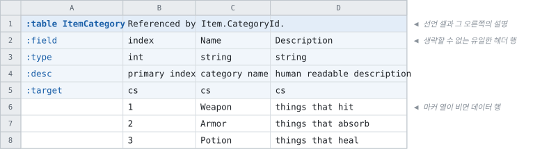
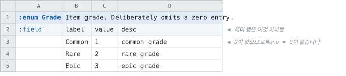

# 시트에 무엇을 적을 수 있나

Tabbit이 읽는 세 가지 엔티티와, 그것이 각각 무엇으로 생성되는지 설명합니다.

실제 시트 하나를 처음부터 끝까지 따라갑니다.

> [문서 목록으로](readme.md)

---

여기 나오는 시트, 명령, 생성된 코드는 모두 이 저장소의
[`core` 픽스처](../test/fixtures/tools/FixtureGen)에서 그대로 가져온 것입니다.

지어낸 예제가 아닙니다.
회귀 테스트가 매번 변환해서 [골든 트리](../test/fixtures/golden/core)와 바이트 단위로 비교하는
바로 그 시트입니다.

## 1. 시트

셀에 `:table`·`:enum`·`:const`로 시작하는 **선언 셀**을 적으면 그 자리가 엔티티가 됩니다.

어느 시트, 어느 위치든 상관없고 한 시트에 여러 개를 놓아도 됩니다.

선언 셀이 놓인 열이 그 엔티티의 **마커 열**이고, 본문은 그 오른쪽부터입니다.
마커 열의 아래 칸에는 **행 키**를 적습니다 — 그 줄이 무엇인지를 이름이 정하므로 **순서가
자유롭고, 필요 없는 줄은 아예 두지 않아도 됩니다.**

|행 키|그 줄에 적는 것|
|--|--|
|`:field`|컬럼의 이름. **언제나 필수입니다**|
|`:type`|타입. 테이블에서는 필수이고, enum · 상수셋은 컬럼이 정해져 있어 이 줄이 없습니다|
|`:desc`|컬럼 설명. 생성 코드의 doc comment가 됩니다|
|`:target`|`c`(클라이언트) · `s`(서버) · `cs`(양쪽, 기본)|
|`:variant`|한 필드의 값 컬럼을 여러 벌 적었을 때 그것들을 구분하는 이름. 빌드가 하나를 고릅니다|

행 키 줄이 끝나면 그다음부터 데이터입니다.
`:field` 칸에 `#` 하나만 적은 컬럼은 **메모 컬럼**이고, 무엇을 적어도 읽지 않습니다.

### 테이블 `ItemCategory`

아이템이 가리킬 분류입니다.



### enum `Grade`

이름이 붙은 정수 값입니다. 테이블 컬럼의 타입으로 사용합니다.

enum과 상수셋은 컬럼이 정해져 있으므로 `:field` 줄 하나로 끝납니다.



0 항목이 없습니다. 이런 경우 `None = 0`이 자동으로 추가됩니다.

enum 필드는 값이 대입되기 전에도 무언가를 들고 있는데, 그것이 이름 없는 0이면 디버거에서도
로그에서도 읽을 수 없기 때문입니다.

시트가 0에 이미 값을 두었다면 손대지 않으며, `AutoInsertEnumNoneLabel`로 끌 수도 있습니다.

### 테이블 `Item`

위의 둘을 모두 사용합니다. 폭 때문에 컬럼 다섯만 옮겼습니다. 실제로는 일곱입니다.


여기서 셋만 봐 두면 나머지는 [시트 작성](sheets.md)이 자세히 설명합니다.

| 적은 것 | 뜻 |
| --- | --- |
| `:type` 칸의 `foreign ItemCategory` | 이 값은 저 테이블의 행이라는 뜻입니다. 숫자가 아니라 행이며, 그 차이는 아래에서 확인할 수 있습니다 |
| `:type` 칸의 `Grade` | enum 이름을 그대로 적습니다. 셀에는 `Common`이라고 적으므로 숫자를 외울 필요가 없고, 오타는 빌드에서 검출됩니다 |
| `Price`의 `:target` 칸에 적은 `s` | 서버 빌드에만 포함합니다. 클라이언트가 받는 파일에는 이 컬럼이 아예 없습니다 |

**타입은 한 칸에 하나씩 적습니다.** `foreign`도 enum도 이름을 함께 적으므로, 타입과 세부
타입을 두 줄에 나눠 적던 자리가 없습니다.

여기서 뺀 컬럼 중 하나가 `SkillField`입니다.

그 셀에는 `fire_ball`처럼 선언된 철자 그대로 적습니다.
생성되는 타입 이름은 언어 관례를 따르지만, 시트는 시트의 표기를 지킵니다.

## 2. recipe와 실행

무엇을 어디서 읽어 어디로 출력할지는 recipe에 정의합니다.

백지에서 시작할 필요는 없습니다.

```bash
tabbit --new-recipe my-recipe.json --template unity
tabbit --recipe my-recipe.json
```

## 3. 생성된 코드

`Item` 하나에서 생성되는 C#입니다. 골든에서 가져왔고, 네임스페이스 수식만 줄였습니다.

```csharp
public int Index => _index;
public string Name => _name;
public int CategoryId => ...;                                // 셀에 적힌 키
public ItemCategoryTable.Record ItemCategoryByCategoryId => ...;  // 그것이 가리키는 행
public Grade GradeField => _gradeField;
public SkillType SkillField => _skillField;
public string Description => _description;
public int Price => _price;                                  // 서버 빌드에만
```

`CategoryId`는 셀에 적힌 키 그대로이고, 그것이 가리키는 행은 이름이 따로 있습니다 —
`<대상>By<컬럼>`입니다 ([참조가 내는 이름](../spec/references/reference-surface-naming.md)).

파일에는 인덱스로 저장되고, `ReadAllAsync`가 모든 테이블을 읽은 뒤 실제 레코드로 연결합니다.

그래서 이렇게 사용합니다.

```csharp
await GameData.ReadAllAsync("./data");

var sword = GameData.Item.FindByIndex(1);
Console.WriteLine(sword.Name);                  // Short Sword
Console.WriteLine(sword.ItemCategoryByCategoryId.Name);  // Weapon   ← 조회를 한 번 더 하지 않습니다
Console.WriteLine(sword.GradeField);            // Common
```

조회 함수는 인덱스마다 셋이 생성되고, **이름은 그 인덱스의 컬럼에서 만들어집니다.**

| 함수 | 없을 때 |
| --- | --- |
| `FindByIndex` | 널을 반환합니다 |
| `GetByIndexOrThrow` | 예외를 발생시킵니다 |
| `ContainsIndex` | 존재 여부만 확인합니다 |

이름이 동작을 설명하므로, 검사를 빠뜨린 자리가 코드를 읽는 것만으로 드러납니다.

컬럼 이름이 `Code`인 보조 인덱스라면 `FindByCode`이고, **성분이 둘인 복합 키**라면
`FindByFromAndTo(from, to)`처럼 인자가 성분마다 하나씩 생깁니다.

같은 시트에서 지원하는 모든 언어의 코드가 생성되고, 표기는 각 언어의 관례를 따릅니다.
TypeScript는 `tables.item.findByIndex(1)`, Python은 `tables.item.find_by_index(1)`입니다.

자세한 내용은 [언어별 가이드](languages/readme.md)에 있습니다.

## 세 가지 엔티티

| 엔티티 | 선언 셀 | 생성되는 것 |
| --- | --- | --- |
| **테이블** | `:table Item` | 레코드 타입, 인덱스별 조회 함수, 데이터 파일 |
| **enum** | `:enum Grade` | 언어별 열거형 타입 |
| **상수셋** | `:const Limits` | 언어별 상수 선언 |

선언 셀의 괄호에 설정을 적습니다 — `:table Item(side=s)`가 그 테이블 전체를 서버 빌드로
한정하고, `:table Loadout(key="stage,slot")`이 복합 인덱스를 선언합니다.

상수셋은 행이 아니라 이름, 타입, 값의 목록입니다.

한 줄짜리 설정값들이 테이블 흉내를 내지 않아도 되는 자리입니다.

### 엔티티에 따라 갈리는 배포 경로

| 엔티티 | 배포 |
| --- | --- |
| 테이블 | 데이터 파일로 나갑니다. 대개 데이터만 올려도 반영됩니다 |
| enum · 상수셋 | 코드로 나갑니다. 코드 배포가 함께 필요합니다 |

특히 상수셋은 데이터 파일에 흔적이 전혀 없습니다.
값을 고쳐도 코드를 다시 배포하기 전에는 아무것도 달라지지 않습니다.

이 판정은 직접 하지 않아도 됩니다. 히스토리가 커밋마다
[어느 쪽이 나가야 하는지](languages/readme.md#데이터만-나가도-되는-변경과-코드가-함께-나가야-하는-변경)
보고합니다.

## 다른 규칙으로 쓰인 시트 읽기

위의 선언 셀 방식이 기본(`tabbit` 레이아웃)입니다.

다른 규칙으로 작성된 시트도 그대로 읽을 수 있으므로, 시트를 먼저 고칠 필요가 없습니다.

```jsonc
"Xlsx": [
  { "Path": "./sheets",       "Layout": "tabbit" },
  { "Path": "./other-sheets", "Layout": "sheet-per-table" }
]
```

레이아웃은 소스마다 지정하므로 한 recipe에서 섞어 읽을 수 있습니다.
한쪽에서 선언한 enum을 다른 쪽 테이블이 타입으로 사용해도 됩니다.

규모가 있는 시트 두 벌을 손대지 않고 한 모델로 읽습니다 —
[`sprout`](../samples/sprout)이 워크북 17개·테이블 71개·109,218행이고,
[`canopy`](../samples/canopy)가 워크북 42개·정의된 이름 549개·셀 873만입니다.

- recipe 설정은 [Recipe 파일 — Layout](recipe/sources.md#layout--시트를-읽는-방식)에 있습니다.
- 두 레이아웃이 무엇을 어떻게 읽는지는 각 샘플의 readme에 있습니다.
- 레이아웃을 새로 만드는 방법은
  [아키텍처와 개발](architecture.md#설계-원칙--코어에-프로젝트-이름-금지)에 있습니다.

## 다음

| 무엇이 궁금한가 | 어디 |
| --- | --- |
| 시트에 적을 수 있는 것 전부 — 타입, 인덱스, 배열, 중첩, 제약 | [시트 작성](sheets.md) |
| recipe에 적을 수 있는 것 전부 | [Recipe 파일](recipe.md) |
| 생성된 코드를 프로젝트에 적용하는 방법 | [언어별 가이드](languages/readme.md) |
| 시트로 표현할 수 없는 규칙 검사 | [검증](validation.md) |
