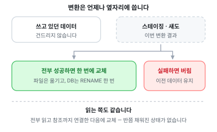

# 내보내기

바이너리와 JSON 파일, 그리고 데이터베이스 적재입니다.

> [문서 목록으로](readme.md)

---

## 내보낼 수 있는 대상

읽어서 가공한 데이터를 아래 대상으로 내보냅니다. 여러 개를 한 번에 지정해도 됩니다.

| 대상 | 설명 |
| --- | --- |
| Binary | 자체 형식(TCB) 바이너리 파일. 확장자는 `.tcb`입니다 |
| Json | `.json` 파일. 이름 있는 형식과 배열만 담는 compact 형식을 선택할 수 있습니다 |
| MySql | MySQL로 직접 적재합니다 |
| PostgreSql | PostgreSQL로 직접 적재합니다 |
| MongoDB | MongoDB로 직접 적재합니다. 테이블당 컬렉션 하나, 행당 도큐먼트 하나입니다 |
| Redis | Redis로 직접 적재합니다. 행당 해시 하나에 테이블당 인덱스 셋 하나입니다 |

### 빌드가 실패해도 기존 데이터는 남습니다

어느 대상이든 결과를 옆자리에 먼저 씁니다.

전부 성공했을 때만 한 번에 교체하고, 도중에 실패하면 옆자리를 버립니다.
그래서 빌드가 깨진 상태로 끝나는 일이 없습니다. 최악이라도 어제 데이터로 계속 동작합니다.



교체 방식은 대상마다 다르지만 성질은 같습니다.

파일은 스테이징 폴더에서 옮기고, 데이터베이스는 [아래](exports/database.md)처럼 섀도 테이블에
쓴 뒤 이름을 바꿉니다.

> 원자성은 저장소 하나 단위입니다.
> 파일과 데이터베이스 여러 개를 한 트랜잭션으로 묶는 것은 분산 트랜잭션 없이는 되지 않으므로,
> 각각이 따로 안전하게 교체됩니다.

### JSON의 64비트 정수

`bigint` 값은 문자열로 기록됩니다.

```json
{ "index": 1, "startGold": "9007199254740993" }
```

JSON에는 숫자 타입이 하나뿐이고 대부분의 테이블 리더가 그것을 double로 다룹니다.

`9007199254740993`을 그대로 쓰면 JavaScript는 `JSON.parse` 시점에 `9007199254740992`로
알리지 않고 바꿔 놓습니다.

더 나쁜 것은 이 오류가 잘 드러나지 않는다는 점입니다.
리터럴과 비교해 봐도 그 리터럴 역시 같은 값으로 파싱되므로 양쪽이 「일치」합니다.

문자열로 기록하면 정확히 복원할 수 있고, 생성된 TypeScript는 이를 `BigInt`로 되살립니다.
Protocol Buffers의 JSON 매핑이 int64에 대해 같은 선택을 하는 것과 같은 이유입니다.

`float` 값은 JSON에 왕복 가능한 최단 십진수로 기록됩니다.

다만 JavaScript에는 32비트 부동소수점 타입이 없어 double로 넓어지므로, 생성된 TypeScript가
`Math.fround`로 다시 32비트 정밀도에 맞춥니다. JSON 경로와 바이너리 경로가 같은 값을 냅니다.

## 이 문서의 나머지

|무엇|어디|
|--|--|
|[바이너리 — `.tcb`](exports/binary.md)|왜 바이너리인지 · 크기 · 매니페스트 · recipe 옵션 · 그 대가|
|[수집된 텍스트 — `text` 타깃](exports/text.md)|번역 대상 문자열을 모아 내는 것|
|[데이터베이스 적재](exports/database.md)|MySQL · PostgreSQL · MongoDB · Redis 로 직접|
