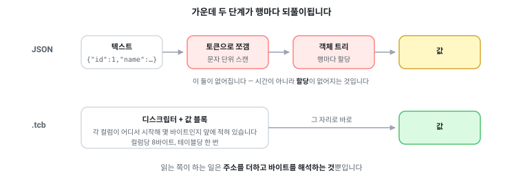
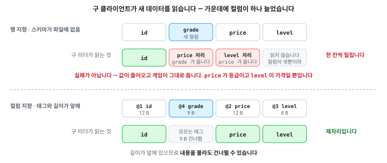
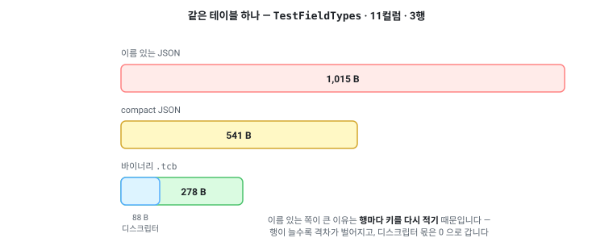

# 바이너리 — `.tcb`

> [「내보내기」로 돌아가기](../exports.md)

---

## 바이너리를 쓰는 이유

런타임에 데이터를 싣는 형식은 바이너리이고, 생성되는 테이블 리더는 이것만 읽습니다.

이유는 넷입니다.

1. 파싱 단계가 없습니다.
2. 인코딩이 값의 크기에 맞춰집니다.
3. 텍스트를 거치지 않으므로 값이 변하지 않습니다.
4. 스키마가 바뀌어도 드러나지 않은 채 어긋나지 않습니다.

### 파싱 단계가 없습니다



JSON을 읽는 쪽은 이런 일을 합니다.

1. 바이트를 토큰으로 나눕니다. 따옴표, 콜론, 쉼표, 중괄호를 찾아가며 진행합니다.
2. 키 문자열을 만들고, 그 키가 어느 필드인지 찾습니다. 대개 해시 조회입니다.
3. `"1024"`라는 문자 네 개를 숫자 1024로 바꿉니다.
4. 값마다 객체를 하나씩 만듭니다.

바이너리 리더는 넷 다 하지 않습니다.

**이름이 파일에 없습니다.**

컬럼은 이름이 아니라 번호(태그)로 식별되고, 그 번호는 테이블마다 한 번 헤더의 디스크립터에
적힙니다. 행마다 다시 적지 않으므로 키 문자열도 없고 해시 조회도 없습니다.

```
헤더:  컬럼 3개 — 태그 1(i32), 태그 2(string), 태그 3(i32)
데이터: [태그 1의 모든 행][태그 2의 모든 행][태그 3의 모든 행]
```

행 지향이 아니라 컬럼 지향이라는 점도 여기에 걸려 있습니다.

컬럼마다 값이 연속 블록이고 블록의 바이트 길이가 헤더에 있으므로, 테이블 리더가 모르는 컬럼은
한 번의 포인터 이동으로 지나갑니다.

이것이 스키마가 바뀌어도 감지되지 않는 읽기 오류가 없는 이유입니다.
[바이너리 형식](../binary-format.md)에 전부 적혀 있습니다.

**숫자는 이미 숫자입니다.**

`1024`는 네 바이트이고, 읽는 것은 그 네 바이트를 정수로 보는 일입니다.
`float`와 `double`은 IEEE-754 비트 패턴 그대로라 십진 표기를 거치지 않습니다.

**값마다 할당하지 않습니다.**

문자열과 배열처럼 레코드가 실제로 보유하는 것 외에는 테이블 리더가 만드는 임시 객체가 없습니다.

쓰는 쪽도 같습니다. 문자열은 버퍼로 직접 인코딩되고, uuid는 제자리에 기록되며, 테이블 바이트는
파일 쓰기로 복사 없이 넘어갑니다.

로컬라이제이션 테이블 하나가 수만 행에 수십 칸입니다.
값마다 임시 객체를 하나씩 만드는 방식은 그 수만큼 가비지를 만들고, 모바일에서는 그것이 로딩 중
프레임 끊김으로 나타납니다.

### 값 크기에 맞춘 인코딩

값 인코딩 전체를 여기 적을 수 있을 만큼 작습니다.

이것들이 어떻게 배치되는지(헤더, 디스크립터, 컬럼 블록)는
[바이너리 형식](../binary-format/layout.md#레이아웃)에 있습니다.

바이트 순서는 리틀엔디안으로 고정입니다.
호스트의 순서를 따르지 않으므로, 빅엔디안 기기에서 읽어도 같은 값이 나옵니다.

| 이름 | 인코딩 |
| --- | --- |
| `fixed8` | 1바이트 |
| `fixed32` | 4바이트, 리틀엔디안 |
| `fixed64` | 8바이트, 리틀엔디안 |
| `varint32` | 바이트당 7비트를 낮은 자리부터. 더 있으면 최상위 비트를 세웁니다. 최대 5바이트 |
| `counter32` | 지그재그로 부호를 접은 뒤 `varint32` |
| `string` | `counter32` 바이트 길이, 그다음 그만큼의 UTF-8 바이트 |
| `uuid` | 16바이트, .NET `Guid` 배치 (앞 세 구성요소만 리틀엔디안) |

`varint32`는 프로토콜 버퍼의
[base-128 varint](https://protobuf.dev/programming-guides/encoding/#varints)와 같은 것입니다.

값을 7비트씩 나눠 담고, 뒤에 더 있으면 각 바이트의 최상위 비트를 세웁니다.
그래서 작은 수는 작게 듭니다.

| 값 | varint32 바이트 수 |
| --- | --- |
| 0 ~ 127 | 1 |
| 128 ~ 16,383 | 2 |
| 16,384 ~ 2,097,151 | 3 |
| … | … |
| 최대 | 5 |

이 형식이 프로토콜 버퍼에서 무엇을 가져오고 무엇을 바꿨는지는
[바이너리 형식](../binary-format.md#값-인코딩이-받은-영향)에 있습니다.

**지그재그는 음수를 위한 것입니다.**

2의 보수에서 `-1`은 `0xFFFFFFFF`라 varint로 쓰면 5바이트를 다 씁니다.

지그재그는 부호를 최하위 비트로 접어 `0, -1, 1, -2, 2`를 `0, 1, 2, 3, 4`로 만들므로 작은 음수도
1바이트입니다.

```
 0 → 0        -1 → 1        1 → 2        -2 → 3        2 → 4
```

어디에 쓰이는지가 중요합니다.

`int` 필드는 `fixed32`입니다.
게임 데이터의 정수는 인덱스와 수치라 작은 값이 몰려 있으리라는 보장이 없고, 고정 폭이 읽기가 더
쌉니다.

varint는 거의 항상 작은 값인 곳에만 사용합니다.

| 쓰이는 곳 | 왜 |
| --- | --- |
| 행 수 | 테이블 하나에 수만 행이라도 varint로 3바이트입니다 |
| 배열 길이 | 대개 한 자리 수입니다 |
| 문자열 바이트 길이 | 대개 수십 바이트입니다 |
| `enum` 값 | 레이블 값은 보통 0에서 수십입니다. 음수도 흔해서 지그재그가 붙습니다 |

빈 문자열과 빈 배열은 길이 1바이트가 전부입니다.
JSON에서 `"name":""`가 10바이트인 것과 대비됩니다.

### 텍스트를 경유하지 않는 값 보존

JSON으로 나갔다 돌아오는 값은 텍스트 표현을 한 번 통과합니다. 세 군데가 어긋납니다.

| 타입 | JSON 표기 | 되읽을 때 |
| --- | --- | --- |
| `bigint` | 숫자로 쓰면 `9007199254740993` | JavaScript는 `JSON.parse`에서 `...992`로 알리지 않고 바꿉니다 |
| `double` | 십진 문자열 | 자릿수가 모자라면 다른 값이 됩니다 |
| `datetime` · `timespan` | `"2022-03-01T09:00:00"`, `"10675199.02:48:05"` | .NET의 그 형식을 언어마다 손으로 파싱해야 합니다 |

바이너리에는 이 문제가 없습니다.

`double`은 비트 패턴 그대로, `datetime`과 `timespan`은 100나노초 틱의 `fixed64`, `uuid`는
16바이트 그대로입니다. 변환이 없으니 어긋날 자리도 없습니다.

> 그래서 JSON 내보내기는 `bigint`를 문자열로 씁니다.
> 바이너리에는 그런 우회가 필요 없습니다.

### 스키마가 바뀌어도 조용히 어긋나지 않습니다



파일에 이름은 없지만 번호는 있습니다.

컬럼마다 태그와 타입과 길이가 헤더에 한 번 적히고, 테이블 리더는 위치가 아니라 그 태그로 자기
멤버를 찾습니다.

| 하는 일 | 이미 배포된 테이블 리더가 새 데이터를 읽으면 | 새로 생성한 테이블 리더가 옛 데이터를 읽으면 |
| --- | --- | --- |
| 컬럼 추가 | 모르는 태그이므로 건너뜁니다 | 파일에 없으므로 빈 값(널이 아님) |
| 컬럼 삭제 | 파일에 없으므로 빈 값 | 모르는 태그이므로 건너뜁니다 |
| 이름 변경 · 순서 변경 | 무관합니다. 태그가 식별합니다 | 무관합니다 |
| 타입 넓힘 (`int`→`bigint`) | 필드 이름과 함께 실패합니다. 잘릴 값을 읽지 않습니다 | 그대로 읽습니다 (무손실 승격) |
| 그 외 타입 변경 | 필드 이름과 함께 실패합니다 | 필드 이름과 함께 실패합니다 |

어느 칸에도 「드러나지 않는 다른 값」이 없습니다.

이것이 CDN에 데이터만 올리는 패치, 스토어 심사 중인 구버전 클라이언트, 데이터만 되돌리는
롤백이 성립하는 조건입니다.

태그는 시트가 정합니다. 필드 이름 뒤에 `@N`을 붙입니다.

```
index@1    Name@2    Price@3    #OldColor@4
```

`#이름@N`은 지운 컬럼의 Tombstone입니다.

태그를 비워 두면 다음 컬럼이 그것을 가져가고, 그러면 삭제 전에 만들어진 테이블 리더가 새 컬럼을
옛 필드로 읽습니다. 태그 방식이 유일하게 견디지 못하는 변경입니다.

태그를 아예 달지 않으면 위치대로 번호가 붙고, 그때는 끝에 추가하는 것만 안전합니다.

그리고 이 판정을 배포 전에 받아볼 수 있습니다.

recipe의 `SchemaBaseline`에 경로를 적으면 지난 스키마의 기록과 비교해서, 이미 배포된 테이블
리더가 읽지 못할 변경이면 데이터를 쓰기 전에 컬럼 이름과 함께 멈춥니다.

레이아웃과 승격 표와 검사 규칙 전부는 [바이너리 형식](../binary-format.md)에 있습니다.
시트에 태그를 적는 규칙은 [시트 작성](../sheets/naming.md#와이어-태그-n)에 있습니다.

> 이 표는 테이블 컬럼에 대한 것입니다.
> enum의 레이블과 상수 세트는 데이터 파일이 아니라 생성된 코드에 적히므로 데이터만 패치해서는
> 반영되지 않습니다.
> 어느 변경이 어느 쪽인지는
> [언어별 가이드](../languages/readme.md#데이터만-나가도-되는-변경과-코드가-함께-나가야-하는-변경)에
> 표로 있습니다.

## 크기



적합성 픽스처와 core 픽스처를 실제로 측정한 값입니다.

작은 테이블이므로 절대 크기보다 비율을 보세요.

| 테이블 | 바이너리 | JSON (이름 있는) | JSON (compact) |
| --- | --- | --- | --- |
| `TestFieldTypes` | 278 B | 1,015 B | 541 B |
| `Item` | 214 B | 564 B | 315 B |
| `Localization` | 129 B | 347 B | 191 B |
| `Vectors` (경계값, 36행) | 1,677 B | 15,235 B | — |

이름 있는 JSON의 3분의 1 안팎, compact JSON의 절반 안팎입니다.

이름 있는 쪽과 차이가 큰 이유는 JSON이 행마다 키를 다시 적기 때문입니다.
행이 늘수록 그 비용도 함께 늡니다.

바이너리 쪽 수치에는 컬럼 디스크립터가 컬럼당 8바이트씩 들어 있습니다.

3행짜리 픽스처에서는 그것이 눈에 띕니다. `TestFieldTypes`는 11컬럼이라 88바이트입니다.
디스크립터는 테이블당 한 번이므로 행이 늘면 비율이 0으로 갑니다.
이 표를 절대 크기로 읽지 말라는 것이 그 뜻입니다.

그리고 이 표는 인코딩이 일하기 전의 상태입니다.

세 행짜리 픽스처에는 압축할 반복이 없어서 대부분의 컬럼이 RAW로 남습니다.
[컬럼 인코딩](../binary-format/encoding.md)이 무엇을 하는지는 행이 많아야 보이고, 그것을
[벤치마크](../benchmark.md)가 측정합니다. 같은 데이터가 JSON의 126분의 1입니다.

실제 규모에서 측정한 것은 [벤치마크](../benchmark.md)에 있습니다.
[`sprout`](../../samples/sprout)의 71개 테이블 109,218행에서 크기만이 아니라 로드 시간, CPU, 메모리까지 세 형식을
같은 조건으로 측정했습니다.

## 매니페스트

내보낼 때마다 출력 폴더에 매니페스트가 함께 생성됩니다.

바이너리는 `manifest-binary.json`, JSON은 `manifest-json.json`입니다.

```json
{
  "LastUpdatedDate": "...",
  "MasterHash": "117f8189875ff7e11d813749b3d0da46",
  "TotalSize": 1082,
  "Items": [
    { "Name": "Item.tcb", "Size": 232, "Hash": "f76019ff...", "LastUpdatedDate": "..." }
  ]
}
```

용도는 두 가지입니다.

**무엇이 바뀌었는지**를 파일 단위로 알 수 있습니다.
`MasterHash` 하나로 「이번 빌드와 지난 빌드가 같은 데이터인가」를 판정합니다.

**데이터만 패치하는 흐름의 입력**이 됩니다.
생성된 업데이터가 원격 매니페스트와 로컬 사본을 비교해서 바뀐 파일만 받고, 받은 바이트를 여기
적힌 MD5로 검증합니다.

서버에는 내보낸 결과를 그대로 올리면 되고, 따로 만들 것이 없습니다.
[C# 가이드](../languages/csharp.md#데이터만-갱신하기-writeupdater)

## 바이너리 익스포트의 recipe 옵션

`binary` 타깃 항목이 받는 것은 경로만이 아닙니다.

전체 목록은 [설정](../recipe/settings.md#내보내기)에 있고, 여기서는 설명이 필요한 셋을 적습니다.

```jsonc
"Targets": [
  {
    "Type": "binary",
    "Path": "./build/data",
    "SchemaBaseline": "./schema-baseline.json",
    "EncodingReport": "./build/encoding-report.txt",
    "EncryptionKeyVariable": "TABBIT_TCB_KEY",
    "MacKeyVariable": "TABBIT_TCB_MAC_KEY"
  }
]
```

### `EncodingReport`

컬럼마다 무엇을 측정해 그 인코딩을 골랐는지 적을 경로입니다. 비워 두면 쓰지 않습니다.

변환기는
[적용 가능한 후보를 전부 인코딩해 보고 가장 작은 것을 고르므로](../binary-format/encoding.md#고르는-방법-전부-해보고-가장-작은-것),
여기 적히는 크기는 추정이 아니라 선택이 실제로 근거한 숫자입니다.

원본 크기, 선택된 인코딩, 후보별 실측 크기, 사전과 인덱스의 분해, 그리고 형식에 없는
레이아웃들이 같은 컬럼에서 얼마가 되었을지까지 적습니다.

「인코딩은 자동으로 골라집니다」가 값을 가지려면 그 선택을 들여다볼 수 있어야 합니다.
이것이 없으면 RAW로 남은 컬럼과 90%를 줄인 컬럼이 밖에서 똑같이 보입니다.

큰 내보내기에서는 시간이 듭니다. 형식에 없는 레이아웃까지 측정하기 때문이고, 그래서 경로를
적었을 때만 수행합니다.

산출물이 아니라 판단 자료이므로 적은 자리에 그대로 쓰고 스테이징을 거치지 않습니다.

### `EncryptionKeyVariable` · `EncryptionKeyFile`

[파일 암호화](../binary-format/security.md#파일-암호화)를 켭니다. 둘 다 비어 있으면 파일은 평문입니다.

### `MacKeyVariable` · `MacKeyFile`

[변조 검출](../binary-format/security.md#변조-검출--mac)을 켭니다.

둘 다 비어 있으면 `mac` 필드가 0으로 남고 리더도 검사하지 않습니다.

### recipe에는 키를 적지 않습니다

recipe는 커밋되고 돌아다니는 파일이며, 거기 적힌 키는 그때부터 저장소의 이력에 남습니다.

recipe가 받는 것은 키가 있는 자리의 이름입니다. 환경 변수의 이름이거나 키 파일의 경로입니다.
키 자체는 64자리 16진수입니다.

- 둘을 함께 적으면 거부합니다. 어느 키로 쓰였는지에 의문이 남지 않게 합니다.
- 키가 없거나 형식이 틀리면 첫 테이블을 쓰기 전에 멈춥니다. 디렉터리가 절반은 평문, 절반은
  암호문으로 남는 상태를 만들지 않습니다.
- 키는 손으로 짓지 않습니다. `tabbit --new-encryption-key`가 운영체제의 난수원에서 뽑아 표준
  출력으로 한 줄만 내보내므로 시크릿 저장소로 그대로 파이프할 수 있고, `--out`으로 파일에 쓸
  수도 있습니다.
- 이미 있는 파일은 덮어쓰지 않습니다. 말없이 갈아치우면 그 키로 내보낸 파일 전부가 읽히지 않게
  되고, 증상은 「클라이언트가 데이터를 로드하지 못한다」뿐입니다.
- CI에서는 환경 변수 쪽이 보통 맞습니다. 다만 로그에 찍히지 않게 하세요. 빌드 스크립트의
  `set -x`, 환경 덤프, 실패 시 진단 출력이 흔한 경로입니다.

두 키는 서로 달라야 합니다.

같은 값을 두 자리에 적으면 첫 테이블을 쓰기 전에 거부합니다.
하나의 비밀을 두 원시 함수에 쓰는 것은 알려진 취약점은 아니지만, 피하는 비용이 변수 하나이기
때문입니다.

MAC 키도 형식이 같으므로 `tabbit --new-encryption-key`로 만듭니다.

### MAC을 켜는 순서

데이터가 먼저, 클라이언트가 나중입니다.

MAC 키를 가진 리더는 MAC이 없는 파일을 거부합니다.
그렇지 않으면 16바이트를 0으로 덮는 것만으로 검사가 없어지기 때문입니다.

그래서 클라이언트에 키를 먼저 넣으면 아직 MAC이 없는 데이터를 읽지 못합니다.

반대 방향은 안전합니다. 키가 없는 구버전 클라이언트는 MAC이 있는 파일을 검사하지 않고 읽습니다.

키를 서버와 클라이언트에서 각각 어떻게 다루는지, 무엇이 실제로 지킬 수 있는 것이고 무엇이 비용만
드는 일인지는 [TCB v104 §4](../../spec/wire/tcb-v104-composed-encodings.md#4-암호화--구현)와
[MAC과 파일 시그니처](../../spec/wire/tcb-mac-and-signature.md)에 있습니다.

## 바이너리라서 보지 못하는 것, 그리고 그 대신

바이너리의 단 하나의 대가는 열어봐도 보이지 않는다는 것입니다.

`.tcb`를 텍스트 편집기로 열면 읽을 수 없고 `grep`도 되지 않습니다.

그래서 열어볼 필요가 없도록 다른 수단을 함께 냅니다.
데이터의 육안 확인은 바이너리 판독이 아니라 다른 네 가지 질문입니다.

| 알고 싶은 것 | 보아야 할 것 |
| --- | --- |
| 이 테이블에 무엇이 들어 있나 | [HTML 문서](../languages/html.md). 스키마와 값 전부, 원본 셀로 가는 링크와 함께 |
| 다른 도구로 가져다 쓰고 싶다 | JSON 내보내기. 같은 데이터를 텍스트로 |
| 무엇이 언제 바뀌었나 | [히스토리](../history.md). 셀 단위 변경 로그를 브라우저에서 |
| 이번 빌드가 무엇을 만들었나 | `summary` 타깃. 테이블, 행, 필드 수와 지문 |

**HTML 문서**가 「데이터를 본다」에 대한 답입니다.

테이블마다 스키마와 모든 행이 나오고, enum 값은 그 선언으로, 참조는 가리키는 테이블로
링크됩니다.

무엇보다 각 테이블 제목이 원본 시트의 셀을 가리키므로, 이상한 값을 발견하면 거기서 바로 고칠
곳으로 갈 수 있습니다. 네트워크에 아무것도 요청하지 않아 폐쇄망에서도 그대로 열립니다.

**JSON 내보내기**는 같은 빌드에서 함께 생성됩니다.

바이너리 대신이 아니라 함께 두는 것이 정상입니다.
런타임은 바이너리를 싣고, 사람과 다른 도구는 JSON을 봅니다.
두 형식이 같은 모델에서 같은 실행에 나오므로 어긋나지 않습니다.

**히스토리**가 「지난주엔 이 값이 아니었는데」를 확인하는 수단입니다.

xlsx는 바이너리라 `git diff`가 되지 않는데, 히스토리는 셀 단위로 누가 언제 무엇을 바꿨는지
기록하고 `--serve`로 브라우저에서 보여줍니다.

즉 바이너리를 열어보고 싶어지는 상황은 대부분 더 나은 답이 이미 있는 질문입니다.

### 그래도 남는 것

**형식 버전이 맞아야 합니다.**

파일 헤더에 버전이 있고, 테이블 리더가 모르는 버전이면 읽지 않고 그 사실을 출력합니다.

버전이 같으면 스키마가 달라도 됩니다. 컬럼을 추가, 삭제, 이름 변경, 순서 변경한 데이터를 옛
코드가 읽습니다.

무엇이 보장되고 무엇이 거부되는지는
[바이너리 형식](../binary-format/evolution.md#라이브-서비스-시나리오--보장-요약)에 표로 있습니다.
데이터만 따로 배포하는 파이프라인이라면 `SchemaBaseline`을 켜세요.

**생성된 테이블 리더가 있어야 합니다.**

지원하지 않는 언어에서 데이터를 읽어야 한다면 JSON 내보내기를 사용하세요.

**부분 로드가 없습니다.**

테이블 단위로 전부 읽습니다. 행 하나만 꺼내 오는 형식이 아닙니다.
