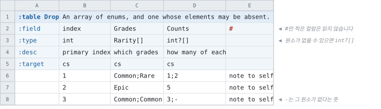

# 값이 여러 개일 때

<!-- 이 파일은 `doc/figures/showcase.py` 가 생성합니다. 손으로 고치지 마십시오 - 다음 실행이 덮어씁니다. -->

> [시트가 코드가 되는 모습으로](../generated-code.md)

---

배열이 오는 자리는 셋입니다 — **셀 하나 안**, **컬럼 여럿**, 그리고
**행 여럿**입니다. 앞의 둘이 여기 있고, 셋째는 [행으로 쌓는 배열](multirow.md)에 있습니다.

- **셀 하나 안에 여러 값** — 타입을 `string[]` 으로 적고 셀에
  `potion;cheap` 처럼 적습니다
- **컬럼 여러 개가 한 배열** — `Weight[0]` · `Weight[1]` 처럼 번호를 붙입니다

시트에서 쓰기 편한 쪽을 고르면 됩니다.

<!-- tabbit:pair -->


<!-- tabbit:tabs lang -->
<details data-lang="csharp" open>
<summary>C#</summary>

```csharp
[System.Serializable]
public partial class LootRecord
{
    #region Values
    /// <summary>
    /// primary index
    /// </summary>
    public int Index => _index;

    /// <summary>
    /// search tags
    /// </summary>
    public string[] Tags => _tags;

    /// <summary>
    /// weight 1
    /// </summary>
    public int[] Weight => _weight;
    #endregion

    #region Storage
    internal int _index;
    internal string[] _tags = System.Array.Empty<string>();
    internal int[] _weight = System.Array.Empty<int>();
    #endregion

    #region ToString
    public override string ToString()
    {
        var sb = new StringBuilder("{");
        sb.Append("\"Index\":"); ToStringHelper.ToString(Index, sb);
        sb.Append(",\"Tags\":"); ToStringHelper.ToString(Tags, sb);
        sb.Append(",\"Weight\":"); ToStringHelper.ToString(Weight, sb);
        sb.Append("}");
        return sb.ToString();
    }
    #endregion
}
```

[LootTable.cs](../../test/fixtures/golden/doc-showcase/csharp/tables/LootTable.cs)

</details>
<details data-lang="typescript">
<summary>TypeScript</summary>

```typescript
// Generated from test/fixtures/xlsx/doc-showcase/doc-showcase.xlsx : Loot : B2
/** Two ways to write an array. */
export class LootRecord {
  /** Default constructor */
  constructor() {
  }

  /** primary index */
  public get index(): number { return this._index }

  /** search tags */
  public get tags(): string[] { return this._tags }

  /** weight 1 */
  public get weight(): number[] { return this._weight }

  public _index: number = 0
  public _tags: string[] = []
  public _weight: number[] = []

  /** Populate field values. */
  public populateFieldValues(dataRow: IDataRow): void {
    this._index = dataRow.index
    this._tags = dataRow.tags
    this._weight = dataRow.weight
  }

  /** Populate field values. */
  public populateFieldValuesCompact(dataRow: any[]): void {
    let offset = 0
    this._index = dataRow[offset++]
    this._tags = dataRow[offset++]
    this._weight = dataRow.slice(offset, offset + 2)
    offset += 2
  }
}
```

[loot.ts](../../test/fixtures/golden/doc-showcase/typescript/tables/loot.ts)

</details>
<details data-lang="cpp">
<summary>C++</summary>

```cpp
// Generated from test/fixtures/xlsx/doc-showcase/doc-showcase.xlsx : Loot : B2
/// Two ways to write an array.
struct LootRecord {
  /// primary index
  std::int32_t index = 0;
  /// search tags
  std::vector<std::string> tags;
  /// weight 1
  std::vector<std::int32_t> weight;
};
```

[DocShowcaseAccessor_loot.h](../../test/fixtures/golden/doc-showcase/cpp/tables/DocShowcaseAccessor_loot.h)

</details>
<details data-lang="python">
<summary>Python</summary>

```python
class LootRecord:
    """Generated from test/fixtures/xlsx/doc-showcase/doc-showcase.xlsx : Loot : B2.

    Two ways to write an array.
    """

    __slots__ = ("index", "tags", "weight")

    def __init__(self):
        self.index = 0
        self.tags = []
        self.weight = []

    def __repr__(self):
        return "LootRecord(index=%r, tags=%r, weight=%r)" % (self.index, self.tags, self.weight)
```

[loot_table.py](../../test/fixtures/golden/doc-showcase/python/doc_showcase_data/loot_table.py)

</details>
<details data-lang="c">
<summary>C</summary>

```c
/* Generated from test/fixtures/xlsx/doc-showcase/doc-showcase.xlsx : Loot : B2
 *
 * Two ways to write an array.
 */
struct DocShowcase_LootRecord_t {
  /* primary index */
  int32_t index;
  /* search tags */
  const char** tags;
  int32_t tags_count;
  /* weight 1 */
  int32_t* weight;
  int32_t weight_count;
};
```

[DocShowcase_Loot.h](../../test/fixtures/golden/doc-showcase/c/tables/DocShowcase_Loot.h)

</details>
<details data-lang="dart">
<summary>Dart</summary>

```dart
// Generated from test/fixtures/xlsx/doc-showcase/doc-showcase.xlsx : Loot : B2
/// Two ways to write an array.
class LootRecord {
  /// primary index
  int index = 0;
  /// search tags
  List<String> tags = [];
  /// weight 1
  List<int> weight = [];

}
```

[loot_table.dart](../../test/fixtures/golden/doc-showcase/dart/tables/loot_table.dart)

</details>
<details data-lang="go">
<summary>Go</summary>

```go
// LootRecord was generated from test/fixtures/xlsx/doc-showcase/doc-showcase.xlsx : Loot : B2.
// Two ways to write an array.
type LootRecord struct {
	// primary index
	Index int32
	// search tags
	Tags []string
	// weight 1
	Weight []int32
}
```

[loot_table.go](../../test/fixtures/golden/doc-showcase/go/loot_table.go)

</details>
<details data-lang="java">
<summary>Java</summary>

```java
// Generated from test/fixtures/xlsx/doc-showcase/doc-showcase.xlsx : Loot : B2
/** Two ways to write an array. */
public final class LootRecord {
    /** primary index */
    public int index;
    /** search tags */
    public String[] tags = new String[0];
    /** weight 1 */
    public int[] weight = new int[0];

}
```

[LootRecord.java](../../test/fixtures/golden/doc-showcase/java/tabbit/fixtures/docshowcase/LootRecord.java)

</details>
<details data-lang="kotlin">
<summary>Kotlin</summary>

```kotlin
// Generated from test/fixtures/xlsx/doc-showcase/doc-showcase.xlsx : Loot : B2
/** Two ways to write an array. */
class LootRecord {
    /** primary index */
    var index: Int = 0
    /** search tags */
    var tags: MutableList<String> = ArrayList()
    /** weight 1 */
    var weight: MutableList<Int> = ArrayList()

}
```

[LootTable.kt](../../test/fixtures/golden/doc-showcase/kotlin/tabbit/fixtures/docshowcase/tables/LootTable.kt)

</details>
<details data-lang="lua">
<summary>Lua</summary>

```lua
-- Generated from test/fixtures/xlsx/doc-showcase/doc-showcase.xlsx : Loot : B2.
-- Two ways to write an array.
---@class LootRecord
---@field index integer
---@field tags string[]
---@field weight integer[]
local LootRecordMeta = tcb.strictType("a `Loot` row", { "index", "tags", "weight" })
```

[loot_table.lua](../../test/fixtures/golden/doc-showcase/lua/tables/loot_table.lua)

</details>
<details data-lang="php">
<summary>PHP</summary>

```php
/**
 * Generated from test/fixtures/xlsx/doc-showcase/doc-showcase.xlsx : Loot : B2
 *
 * Two ways to write an array.
 */
final class LootRecord
{
    /** primary index */
    public int $index = 0;
    /** search tags */
    /** @var list<string> */
    public array $tags = [];
    /** weight 1 */
    /** @var list<int> */
    public array $weight = [];
}
```

[LootTable.php](../../test/fixtures/golden/doc-showcase/php/tables/LootTable.php)

</details>
<details data-lang="ruby">
<summary>Ruby</summary>

```ruby
# Generated from test/fixtures/xlsx/doc-showcase/doc-showcase.xlsx : Loot : B2
# Two ways to write an array.
class LootRecord
  attr_accessor :index, :tags, :weight

  def initialize
    @index = 0
    @tags = []
    @weight = []
  end
```

[loot_table.rb](../../test/fixtures/golden/doc-showcase/ruby/tables/loot_table.rb)

</details>
<details data-lang="rust">
<summary>Rust</summary>

```rust
// Generated from test/fixtures/xlsx/doc-showcase/doc-showcase.xlsx : Loot : B2
/// Two ways to write an array.
#[derive(Clone, Debug, Default)]
pub struct LootRecord {
    /// primary index
    pub index: i32,
    /// search tags
    pub tags: Vec<String>,
    /// weight 1
    pub weight: Vec<i32>,
}
```

[loot_table.rs](../../test/fixtures/golden/doc-showcase/rust/src/loot_table.rs)

</details>
<details data-lang="swift">
<summary>Swift</summary>

```swift
// Generated from test/fixtures/xlsx/doc-showcase/doc-showcase.xlsx : Loot : B2
/// Two ways to write an array.
public final class LootRecord {

    public init() {}

    /// primary index
    public var index: Int32 = 0

    /// search tags
    public var tags: [String] = []

    /// weight 1
    public var weight: [Int32] = []
}
```

[LootTable.swift](../../test/fixtures/golden/doc-showcase/swift/tables/LootTable.swift)

</details>
<details data-lang="unreal">
<summary>Unreal</summary>

```cpp
// Generated from test/fixtures/xlsx/doc-showcase/doc-showcase.xlsx : Loot : B2
/** Two ways to write an array. */
USTRUCT(BlueprintType)
struct DOCSHOWCASE_API FLootRow
{
    GENERATED_BODY()

    /** primary index */
    UPROPERTY(EditAnywhere, BlueprintReadOnly, Category = "Loot")
    int32 Index = 0;

    /** search tags */
    UPROPERTY(EditAnywhere, BlueprintReadOnly, Category = "Loot")
    TArray<FString> Tags;

    /** weight 1 */
    UPROPERTY(EditAnywhere, BlueprintReadOnly, Category = "Loot")
    TArray<int32> Weight;

};
```

[FDocShowcase.h](../../test/fixtures/golden/doc-showcase/unreal/Source/DocShowcase/Public/FDocShowcase.h)

</details>
<!-- /tabbit:tabs -->

<!-- /tabbit:pair -->

**생성된 코드에서는 둘이 구별되지 않습니다.** 둘 다 그냥
배열입니다 — 어느 쪽으로 적었는지는 시트의 사정이고, 코드는 그것을 알 필요가 없습니다.

`Weight` 는 컬럼이 둘이므로 길이가 언제나 2이고, `Tags` 는 행마다 다릅니다.

---

enum도 배열이 됩니다. 그리고 **`?` 를 어디에 붙이느냐로 「배열이
없는 것」과 「원소가 없는 것」이 갈립니다** — `int?[]` 는 원소가 없을 수 있고,
`int[]?` 는 배열 자체가 없을 수 있습니다.

오른쪽 끝의 컬럼은 `:field` 칸에 `#` 만 적은 **메모 컬럼**입니다.

<!-- tabbit:pair -->



<!-- tabbit:tabs lang -->
<details data-lang="csharp" open>
<summary>C#</summary>

```csharp
[System.Serializable]
public partial class DropRecord
{
    #region Values
    /// <summary>
    /// primary index
    /// </summary>
    public int Index => _index;

    /// <summary>
    /// which grades
    /// </summary>
    public global::Tabbit.Fixtures.DocShowcase.Rarity[] Grades => _grades;

    /// <summary>
    /// how many of each
    /// </summary>
    public int[] Counts => _counts;
    /// <summary>Whether element <paramref name="index"/> of <see cref="Counts"/> has a value.</summary>
    public bool HasCountsAt(int index)
        => _countsHasValueAt == null
            || index < 0 || index >= _countsHasValueAt.Length
            || _countsHasValueAt[index];
    #endregion

    #region Storage
    internal int _index;
    internal global::Tabbit.Fixtures.DocShowcase.Rarity[] _grades = System.Array.Empty<global::Tabbit.Fixtures.DocShowcase.Rarity>();
    internal int[] _counts = System.Array.Empty<int>();
    internal bool[] _countsHasValueAt;
    #endregion

    #region ToString
    public override string ToString()
    {
        var sb = new StringBuilder("{");
        sb.Append("\"Index\":"); ToStringHelper.ToString(Index, sb);
        sb.Append(",\"Grades\":"); ToStringHelper.ToString(Grades, sb);
        sb.Append(",\"Counts\":"); ToStringHelper.ToString(Counts, sb);
        sb.Append("}");
        return sb.ToString();
    }
    #endregion
}
```

[DropTable.cs](../../test/fixtures/golden/doc-showcase/csharp/tables/DropTable.cs)

</details>
<details data-lang="typescript">
<summary>TypeScript</summary>

```typescript
// Generated from test/fixtures/xlsx/doc-showcase/doc-showcase.xlsx : Loot : G2
/** An array of enums, and one whose elements may be absent. */
export class DropRecord {
  /** Default constructor */
  constructor() {
  }

  /** primary index */
  public get index(): number { return this._index }

  /** which grades */
  public get grades(): Rarity[] { return this._grades }

  /** how many of each */
  public get counts(): number[] { return this._counts }
  /** Whether element `index` of `counts` has a value. */
  public hasCountsAt(index: number): boolean {
    return this._countsHasValueAt === null
      || index < 0 || index >= this._countsHasValueAt.length
      || this._countsHasValueAt[index]
  }

  public _index: number = 0
  public _grades: Rarity[] = []
  public _counts: number[] = []
  public _countsHasValueAt: boolean[] | null = null

  /** Populate field values. */
  public populateFieldValues(dataRow: IDataRow): void {
    this._index = dataRow.index
    this._grades = dataRow.grades
    this._counts = dataRow.counts
  }

  /** Populate field values. */
  public populateFieldValuesCompact(dataRow: any[]): void {
    let offset = 0
    this._index = dataRow[offset++]
    this._grades = dataRow[offset++]
    this._counts = dataRow[offset++]
  }
}
```

[drop.ts](../../test/fixtures/golden/doc-showcase/typescript/tables/drop.ts)

</details>
<details data-lang="cpp">
<summary>C++</summary>

```cpp
// Generated from test/fixtures/xlsx/doc-showcase/doc-showcase.xlsx : Loot : G2
/// An array of enums, and one whose elements may be absent.
struct DropRecord {
  /// primary index
  std::int32_t index = 0;
  /// which grades
  std::vector<Rarity> grades;
  /// how many of each
  std::vector<std::int32_t> counts;
  std::vector<bool> has_counts_at_;

  /// Whether element `index` of `counts` has a value.
  bool has_counts_at(std::size_t index) const {
    return index >= has_counts_at_.size()
        || has_counts_at_[index];
  }
};
```

[DocShowcaseAccessor_drop.h](../../test/fixtures/golden/doc-showcase/cpp/tables/DocShowcaseAccessor_drop.h)

</details>
<details data-lang="python">
<summary>Python</summary>

```python
class DropRecord:
    """Generated from test/fixtures/xlsx/doc-showcase/doc-showcase.xlsx : Loot : G2.

    An array of enums, and one whose elements may be absent.
    """

    __slots__ = ("index", "grades", "counts", "has_counts_at")

    def __init__(self):
        self.index = 0
        self.grades = []
        self.counts = []
        self.has_counts_at = []

    def __repr__(self):
        return "DropRecord(index=%r, grades=%r, counts=%r)" % (self.index, self.grades, self.counts)
```

[drop_table.py](../../test/fixtures/golden/doc-showcase/python/doc_showcase_data/drop_table.py)

</details>
<details data-lang="c">
<summary>C</summary>

```c
/* Generated from test/fixtures/xlsx/doc-showcase/doc-showcase.xlsx : Loot : G2
 *
 * An array of enums, and one whose elements may be absent.
 */
struct DocShowcase_DropRecord_t {
  /* primary index */
  int32_t index;
  /* which grades */
  DocShowcase_Rarity_t* grades;
  int32_t grades_count;
  /* how many of each */
  int32_t* counts;
  int32_t counts_count;
  /* Which of counts's elements have a value, one bool per element, or NULL where
   * the file did not carry the column. spec/types/nullable-array-elements.md. */
  const bool* has_counts_at;
};
```

[DocShowcase_Drop.h](../../test/fixtures/golden/doc-showcase/c/tables/DocShowcase_Drop.h)

</details>
<details data-lang="dart">
<summary>Dart</summary>

```dart
// Generated from test/fixtures/xlsx/doc-showcase/doc-showcase.xlsx : Loot : G2
/// An array of enums, and one whose elements may be absent.
class DropRecord {
  /// primary index
  int index = 0;
  /// which grades
  List<Rarity> grades = [];
  /// how many of each
  List<int> counts = [];
  List<bool> hasCountsAt = const <bool>[];

}
```

[drop_table.dart](../../test/fixtures/golden/doc-showcase/dart/tables/drop_table.dart)

</details>
<details data-lang="go">
<summary>Go</summary>

```go
// DropRecord was generated from test/fixtures/xlsx/doc-showcase/doc-showcase.xlsx : Loot : G2.
// An array of enums, and one whose elements may be absent.
type DropRecord struct {
	// primary index
	Index int32
	// which grades
	Grades []Rarity
	// how many of each
	Counts []int32
	// Which of Counts's elements have a value. Empty where the file did not carry
	// the column, and then every index is out of range anyway.
	HasCountsAt []bool
}
```

[drop_table.go](../../test/fixtures/golden/doc-showcase/go/drop_table.go)

</details>
<details data-lang="java">
<summary>Java</summary>

```java
// Generated from test/fixtures/xlsx/doc-showcase/doc-showcase.xlsx : Loot : G2
/** An array of enums, and one whose elements may be absent. */
public final class DropRecord {
    /** primary index */
    public int index;
    /** which grades */
    public Rarity[] grades = new Rarity[0];
    /** how many of each */
    public int[] counts = new int[0];
    /**
     * Which of counts's elements have a value. Empty where the file did not carry
     * the column, and then every index is out of range anyway.
     */
    public boolean[] hasCountsAt = new boolean[0];

}
```

[DropRecord.java](../../test/fixtures/golden/doc-showcase/java/tabbit/fixtures/docshowcase/DropRecord.java)

</details>
<details data-lang="kotlin">
<summary>Kotlin</summary>

```kotlin
// Generated from test/fixtures/xlsx/doc-showcase/doc-showcase.xlsx : Loot : G2
/** An array of enums, and one whose elements may be absent. */
class DropRecord {
    /** primary index */
    var index: Int = 0
    /** which grades */
    var grades: MutableList<Rarity> = ArrayList()
    /** how many of each */
    var counts: MutableList<Int> = ArrayList()
    /**
     * Which of counts's elements have a value. Empty where the file did not carry
     * the column, and then every index is out of range anyway.
     */
    var hasCountsAt: MutableList<Boolean> = mutableListOf()

}
```

[DropTable.kt](../../test/fixtures/golden/doc-showcase/kotlin/tabbit/fixtures/docshowcase/tables/DropTable.kt)

</details>
<details data-lang="lua">
<summary>Lua</summary>

```lua
-- Generated from test/fixtures/xlsx/doc-showcase/doc-showcase.xlsx : Loot : G2.
-- An array of enums, and one whose elements may be absent.
---@class DropRecord
---@field index integer
---@field grades integer[]
---@field counts integer[]
---@field hasCountsAt boolean[]
local DropRecordMeta = tcb.strictType("a `Drop` row", { "index", "grades", "counts", "hasCountsAt" })
```

[drop_table.lua](../../test/fixtures/golden/doc-showcase/lua/tables/drop_table.lua)

</details>
<details data-lang="php">
<summary>PHP</summary>

```php
/**
 * Generated from test/fixtures/xlsx/doc-showcase/doc-showcase.xlsx : Loot : G2
 *
 * An array of enums, and one whose elements may be absent.
 */
final class DropRecord
{
    /** primary index */
    public int $index = 0;
    /** which grades */
    /** @var list<Rarity> */
    public array $grades = [];
    /** how many of each */
    /** @var list<int> */
    public array $counts = [];

    public array $hasCountsAt = [];
}
```

[DropTable.php](../../test/fixtures/golden/doc-showcase/php/tables/DropTable.php)

</details>
<details data-lang="ruby">
<summary>Ruby</summary>

```ruby
# Generated from test/fixtures/xlsx/doc-showcase/doc-showcase.xlsx : Loot : G2
# An array of enums, and one whose elements may be absent.
class DropRecord
  attr_accessor :index, :grades, :counts, :has_counts_at

  def initialize
    @index = 0
    @grades = []
    @counts = []
    @has_counts_at = []
  end
```

[drop_table.rb](../../test/fixtures/golden/doc-showcase/ruby/tables/drop_table.rb)

</details>
<details data-lang="rust">
<summary>Rust</summary>

```rust
// Generated from test/fixtures/xlsx/doc-showcase/doc-showcase.xlsx : Loot : G2
/// An array of enums, and one whose elements may be absent.
#[derive(Clone, Debug, Default)]
pub struct DropRecord {
    /// primary index
    pub index: i32,
    /// which grades
    pub grades: Vec<Rarity>,
    /// how many of each
    pub counts: Vec<i32>,
    /// Which of `counts`'s elements have a value. Empty where the file did not
    /// carry the column, and then every index is out of range anyway.
    pub has_counts_at: Vec<bool>,
}
```

[drop_table.rs](../../test/fixtures/golden/doc-showcase/rust/src/drop_table.rs)

</details>
<details data-lang="swift">
<summary>Swift</summary>

```swift
// Generated from test/fixtures/xlsx/doc-showcase/doc-showcase.xlsx : Loot : G2
/// An array of enums, and one whose elements may be absent.
public final class DropRecord {

    public init() {}

    /// primary index
    public var index: Int32 = 0

    /// which grades
    public var grades: [Rarity] = []

    /// how many of each
    public var counts: [Int32] = []
    /// Which of counts's elements have a value. Empty where the file did not carry
    /// the column, and then every index is out of range anyway.
    public var hasCountsAt: [Bool] = []
}
```

[DropTable.swift](../../test/fixtures/golden/doc-showcase/swift/tables/DropTable.swift)

</details>
<details data-lang="unreal">
<summary>Unreal</summary>

```cpp
// Generated from test/fixtures/xlsx/doc-showcase/doc-showcase.xlsx : Loot : G2
/** An array of enums, and one whose elements may be absent. */
USTRUCT(BlueprintType)
struct DOCSHOWCASE_API FDropRow
{
    GENERATED_BODY()

    /** primary index */
    UPROPERTY(EditAnywhere, BlueprintReadOnly, Category = "Drop")
    int32 Index = 0;

    /** which grades */
    UPROPERTY(EditAnywhere, BlueprintReadOnly, Category = "Drop")
    TArray<ERarity> Grades;

    /** how many of each */
    UPROPERTY(EditAnywhere, BlueprintReadOnly, Category = "Drop")
    TArray<int32> Counts;

    /** Which of Counts's elements have a value. Empty where the file did not carry
     * the column, and then every index is out of range anyway.
     * spec/types/nullable-array-elements.md. */
    TArray<bool> bHasCountsAt;

};
```

[FDocShowcase.h](../../test/fixtures/golden/doc-showcase/unreal/Source/DocShowcase/Public/FDocShowcase.h)

</details>
<!-- /tabbit:tabs -->

<!-- /tabbit:pair -->

**메모 컬럼은 생성된 코드에 없습니다.** 시트를 쓰는 사람의 자리이고,
무엇을 적어도 모델에 들어가지 않습니다.

`Counts` 의 원소 타입이 「없을 수 있는 정수」인 것도 코드에 그대로 나타납니다 — 그 언어에
옵셔널이 있으면 그것으로, 없으면 그 언어가 없음을 나타내는 방법으로 나옵니다.
