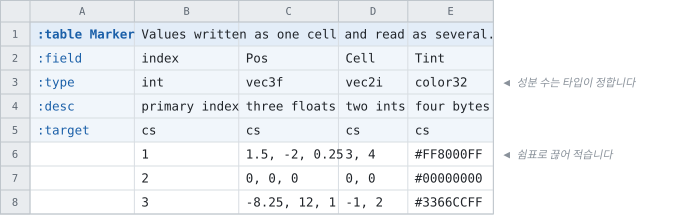
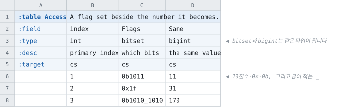

# 한 칸에 여러 값 — 합성 값과 비트셋

<!-- 이 파일은 `doc/figures/showcase.py` 가 생성합니다. 손으로 고치지 마십시오 - 다음 실행이 덮어씁니다. -->

> [시트가 코드가 되는 모습으로](../generated-code.md)

---

셀 하나에 적지만 값이 여럿인 타입이 둘 있습니다. **하나는 레코드가 되고,
하나는 정수가 됩니다.**

벡터 · 회전 · 색입니다. 컬럼 하나에 적고, 코드에서는 성분을 가진
타입으로 받습니다.

<!-- tabbit:pair -->



<!-- tabbit:tabs lang -->
<details data-lang="csharp" open>
<summary>C#</summary>

```csharp
[System.Serializable]
public partial class MarkerRecord
{
    #region Values
    /// <summary>
    /// primary index
    /// </summary>
    public int Index => _index;

    /// <summary>
    /// three floats
    /// </summary>
    public PosEntry Pos => _pos;

    /// <summary>
    /// two ints
    /// </summary>
    public CellEntry Cell => _cell;

    /// <summary>
    /// four bytes
    /// </summary>
    public TintEntry Tint => _tint;
    #endregion

    /// <summary>One element of <see cref="Pos"/>.</summary>
    [System.Serializable]
    public struct PosEntry
    {
        /// three floats
        public float X;
        /// three floats
        public float Y;
        /// three floats
        public float Z;

        public override string ToString()
        {
            var sb = new StringBuilder("{");
            sb.Append("\"X\":"); ToStringHelper.ToString(X, sb);
            sb.Append(",\"Y\":"); ToStringHelper.ToString(Y, sb);
            sb.Append(",\"Z\":"); ToStringHelper.ToString(Z, sb);
            sb.Append("}");
            return sb.ToString();
        }
    }

    /// <summary>One element of <see cref="Cell"/>.</summary>
    [System.Serializable]
    public struct CellEntry
    {
        /// two ints
        public int X;
        /// two ints
        public int Y;

        public override string ToString()
        {
            var sb = new StringBuilder("{");
            sb.Append("\"X\":"); ToStringHelper.ToString(X, sb);
            sb.Append(",\"Y\":"); ToStringHelper.ToString(Y, sb);
            sb.Append("}");
            return sb.ToString();
        }
    }

    /// <summary>One element of <see cref="Tint"/>.</summary>
    [System.Serializable]
    public struct TintEntry
    {
        /// four bytes
        public int R;
        /// four bytes
        public int G;
        /// four bytes
        public int B;
        /// four bytes
        public int A;

        public override string ToString()
        {
            var sb = new StringBuilder("{");
            sb.Append("\"R\":"); ToStringHelper.ToString(R, sb);
            sb.Append(",\"G\":"); ToStringHelper.ToString(G, sb);
            sb.Append(",\"B\":"); ToStringHelper.ToString(B, sb);
            sb.Append(",\"A\":"); ToStringHelper.ToString(A, sb);
            sb.Append("}");
            return sb.ToString();
        }
    }

    #region Storage
    internal int _index;
    internal PosEntry _pos;
    internal CellEntry _cell;
    internal TintEntry _tint;
    #endregion

    #region ToString
    public override string ToString()
    {
        var sb = new StringBuilder("{");
        sb.Append("\"Index\":"); ToStringHelper.ToString(Index, sb);
        sb.Append(",\"Pos\":"); ToStringHelper.ToString(Pos, sb);
        sb.Append(",\"Cell\":"); ToStringHelper.ToString(Cell, sb);
        sb.Append(",\"Tint\":"); ToStringHelper.ToString(Tint, sb);
        sb.Append("}");
        return sb.ToString();
    }
    #endregion
}
```

[MarkerTable.cs](../../test/fixtures/golden/doc-showcase/csharp/tables/MarkerTable.cs)

</details>
<details data-lang="typescript">
<summary>TypeScript</summary>

```typescript
// Generated from test/fixtures/xlsx/doc-showcase/doc-showcase.xlsx : Types : M2
/** Values written as one cell and read as several. */
export class MarkerRecord {
  /** Default constructor */
  constructor() {
  }

  /** primary index */
  public get index(): number { return this._index }

  /** three floats */
  public get pos(): PosEntry { return this._pos }

  /** two ints */
  public get cell(): CellEntry { return this._cell }

  /** four bytes */
  public get tint(): TintEntry { return this._tint }

  public _index: number = 0
  public _pos: PosEntry = { x: 0, y: 0, z: 0 }
  public _cell: CellEntry = { x: 0, y: 0 }
  public _tint: TintEntry = { r: 0, g: 0, b: 0, a: 0 }

  /** Populate field values. */
  public populateFieldValues(dataRow: IDataRow): void {
    this._index = dataRow.index
    this._pos = ((e: any) => ({ x: Math.fround(e.x), y: Math.fround(e.y), z: Math.fround(e.z) }))(dataRow.pos)
    this._cell = ((e: any) => ({ x: e.x, y: e.y }))(dataRow.cell)
    this._tint = ((e: any) => ({ r: e.r, g: e.g, b: e.b, a: e.a }))(dataRow.tint)
  }

  /** Populate field values. */
  public populateFieldValuesCompact(dataRow: any[]): void {
    let offset = 0
    this._index = dataRow[offset++]
    this._pos = { x: Math.fround(dataRow[offset++]), y: Math.fround(dataRow[offset++]), z: Math.fround(dataRow[offset++]) }
    this._cell = { x: dataRow[offset++], y: dataRow[offset++] }
    this._tint = { r: dataRow[offset++], g: dataRow[offset++], b: dataRow[offset++], a: dataRow[offset++] }
  }
}
```

[marker.ts](../../test/fixtures/golden/doc-showcase/typescript/tables/marker.ts)

</details>
<details data-lang="cpp">
<summary>C++</summary>

```cpp
/// Values written as one cell and read as several.
struct MarkerRecord {
  /// primary index
  std::int32_t index = 0;
  /// three floats
  MarkerRecord_pos_entry pos;
  /// two ints
  MarkerRecord_cell_entry cell;
  /// four bytes
  MarkerRecord_tint_entry tint;
};
```

[DocShowcaseAccessor_marker.h](../../test/fixtures/golden/doc-showcase/cpp/tables/DocShowcaseAccessor_marker.h)

</details>
<details data-lang="python">
<summary>Python</summary>

```python
class MarkerRecord:
    """Generated from test/fixtures/xlsx/doc-showcase/doc-showcase.xlsx : Types : M2.

    Values written as one cell and read as several.
    """

    __slots__ = ("index", "pos", "cell", "tint")

    def __init__(self):
        self.index = 0
        self.pos = MarkerPosEntry()
        self.cell = MarkerCellEntry()
        self.tint = MarkerTintEntry()

    def __repr__(self):
        return "MarkerRecord(index=%r, pos=%r, cell=%r, tint=%r)" % (self.index, self.pos, self.cell, self.tint)
```

[marker_table.py](../../test/fixtures/golden/doc-showcase/python/doc_showcase_data/marker_table.py)

</details>
<details data-lang="c">
<summary>C</summary>

```c
struct DocShowcase_MarkerRecord_t {
  /* primary index */
  int32_t index;
  /* three floats */
  struct DocShowcase_MarkerRecord_t_pos_entry pos;
  /* two ints */
  struct DocShowcase_MarkerRecord_t_cell_entry cell;
  /* four bytes */
  struct DocShowcase_MarkerRecord_t_tint_entry tint;
};
```

[DocShowcase_Marker.h](../../test/fixtures/golden/doc-showcase/c/tables/DocShowcase_Marker.h)

</details>
<details data-lang="dart">
<summary>Dart</summary>

```dart
// Generated from test/fixtures/xlsx/doc-showcase/doc-showcase.xlsx : Types : M2
/// Values written as one cell and read as several.
class MarkerRecord {
  /// primary index
  int index = 0;
  /// three floats
  MarkerPosEntry pos = MarkerPosEntry();
  /// two ints
  MarkerCellEntry cell = MarkerCellEntry();
  /// four bytes
  MarkerTintEntry tint = MarkerTintEntry();

}
```

[marker_table.dart](../../test/fixtures/golden/doc-showcase/dart/tables/marker_table.dart)

</details>
<details data-lang="go">
<summary>Go</summary>

```go
// MarkerRecord was generated from test/fixtures/xlsx/doc-showcase/doc-showcase.xlsx : Types : M2.
// Values written as one cell and read as several.
type MarkerRecord struct {
	// primary index
	Index int32
	// three floats
	Pos MarkerPosEntry
	// two ints
	Cell MarkerCellEntry
	// four bytes
	Tint MarkerTintEntry
}
```

[marker_table.go](../../test/fixtures/golden/doc-showcase/go/marker_table.go)

</details>
<details data-lang="java">
<summary>Java</summary>

```java
// Generated from test/fixtures/xlsx/doc-showcase/doc-showcase.xlsx : Types : M2
/** Values written as one cell and read as several. */
public final class MarkerRecord {
    /** primary index */
    public int index;
    /** three floats */
    public PosEntry pos = new PosEntry();
    /** two ints */
    public CellEntry cell = new CellEntry();
    /** four bytes */
    public TintEntry tint = new TintEntry();

    /** One element of pos. */
    public static final class PosEntry {
        /** three floats */
        public float x;
        /** three floats */
        public float y;
        /** three floats */
        public float z;
    }

    /** One element of cell. */
    public static final class CellEntry {
        /** two ints */
        public int x;
        /** two ints */
        public int y;
    }

    /** One element of tint. */
    public static final class TintEntry {
        /** four bytes */
        public int r;
        /** four bytes */
        public int g;
        /** four bytes */
        public int b;
        /** four bytes */
        public int a;
    }

}
```

[MarkerRecord.java](../../test/fixtures/golden/doc-showcase/java/tabbit/fixtures/docshowcase/MarkerRecord.java)

</details>
<details data-lang="kotlin">
<summary>Kotlin</summary>

```kotlin
// Generated from test/fixtures/xlsx/doc-showcase/doc-showcase.xlsx : Types : M2
/** Values written as one cell and read as several. */
class MarkerRecord {
    /** primary index */
    var index: Int = 0
    /** three floats */
    var pos: PosEntry = PosEntry()
    /** two ints */
    var cell: CellEntry = CellEntry()
    /** four bytes */
    var tint: TintEntry = TintEntry()

    /** One element of pos. */
    class PosEntry {
        /** three floats */
        var x: Float = 0.0f
        /** three floats */
        var y: Float = 0.0f
        /** three floats */
        var z: Float = 0.0f
    }

    /** One element of cell. */
    class CellEntry {
        /** two ints */
        var x: Int = 0
        /** two ints */
        var y: Int = 0
    }

    /** One element of tint. */
    class TintEntry {
        /** four bytes */
        var r: Int = 0
        /** four bytes */
        var g: Int = 0
        /** four bytes */
        var b: Int = 0
        /** four bytes */
        var a: Int = 0
    }

}
```

[MarkerTable.kt](../../test/fixtures/golden/doc-showcase/kotlin/tabbit/fixtures/docshowcase/tables/MarkerTable.kt)

</details>
<details data-lang="lua">
<summary>Lua</summary>

```lua
-- Generated from test/fixtures/xlsx/doc-showcase/doc-showcase.xlsx : Types : M2.
-- Values written as one cell and read as several.
---@class MarkerRecord
---@field index integer
---@field pos MarkerPosEntry
---@field cell MarkerCellEntry
---@field tint MarkerTintEntry
local MarkerRecordMeta = tcb.strictType("a `Marker` row", { "index", "pos", "cell", "tint" })
```

[marker_table.lua](../../test/fixtures/golden/doc-showcase/lua/tables/marker_table.lua)

</details>
<details data-lang="php">
<summary>PHP</summary>

```php
/**
 * Generated from test/fixtures/xlsx/doc-showcase/doc-showcase.xlsx : Types : M2
 *
 * Values written as one cell and read as several.
 */
final class MarkerRecord
{
    /** primary index */
    public int $index = 0;
    /** three floats */
    public MarkerPosEntry $pos;
    /** two ints */
    public MarkerCellEntry $cell;
    /** four bytes */
    public MarkerTintEntry $tint;


    /**
     * A row with its record groups built.
     *
     * They cannot be built at the declaration: a PHP property initializer has to be a
     * constant expression, and `new SlotEntry()` is not one.
     */
    public function __construct()
    {
        $this->pos = new MarkerPosEntry();
        $this->cell = new MarkerCellEntry();
        $this->tint = new MarkerTintEntry();
    }
}
```

[MarkerTable.php](../../test/fixtures/golden/doc-showcase/php/tables/MarkerTable.php)

</details>
<details data-lang="ruby">
<summary>Ruby</summary>

```ruby
# Generated from test/fixtures/xlsx/doc-showcase/doc-showcase.xlsx : Types : M2
# Values written as one cell and read as several.
class MarkerRecord
  attr_accessor :index, :pos, :cell, :tint

  def initialize
    @index = 0
    @pos = MarkerPosEntry.new
    @cell = MarkerCellEntry.new
    @tint = MarkerTintEntry.new
  end
```

[marker_table.rb](../../test/fixtures/golden/doc-showcase/ruby/tables/marker_table.rb)

</details>
<details data-lang="rust">
<summary>Rust</summary>

```rust
// Generated from test/fixtures/xlsx/doc-showcase/doc-showcase.xlsx : Types : M2
/// Values written as one cell and read as several.
#[derive(Clone, Debug, Default)]
pub struct MarkerRecord {
    /// primary index
    pub index: i32,
    /// three floats
    pub pos: MarkerPosEntry,
    /// two ints
    pub cell: MarkerCellEntry,
    /// four bytes
    pub tint: MarkerTintEntry,
}
```

[marker_table.rs](../../test/fixtures/golden/doc-showcase/rust/src/marker_table.rs)

</details>
<details data-lang="swift">
<summary>Swift</summary>

```swift
// Generated from test/fixtures/xlsx/doc-showcase/doc-showcase.xlsx : Types : M2
/// Values written as one cell and read as several.
public final class MarkerRecord {

    public init() {}

    /// primary index
    public var index: Int32 = 0

    /// three floats
    public var pos: PosEntry = PosEntry()

    /// two ints
    public var cell: CellEntry = CellEntry()

    /// four bytes
    public var tint: TintEntry = TintEntry()

    /// One element of pos.
    public struct PosEntry {

        public init() {}

        /// three floats
        public var x: Float = 0

        /// three floats
        public var y: Float = 0

        /// three floats
        public var z: Float = 0
    }

    /// One element of cell.
    public struct CellEntry {

        public init() {}

        /// two ints
        public var x: Int32 = 0

        /// two ints
        public var y: Int32 = 0
    }

    /// One element of tint.
    public struct TintEntry {

        public init() {}

        /// four bytes
        public var r: Int32 = 0

        /// four bytes
        public var g: Int32 = 0

        /// four bytes
        public var b: Int32 = 0

        /// four bytes
        public var a: Int32 = 0
    }
}
```

[MarkerTable.swift](../../test/fixtures/golden/doc-showcase/swift/tables/MarkerTable.swift)

</details>
<details data-lang="unreal">
<summary>Unreal</summary>

```cpp
/** Values written as one cell and read as several. */
USTRUCT(BlueprintType)
struct DOCSHOWCASE_API FMarkerRow
{
    GENERATED_BODY()

    /** primary index */
    UPROPERTY(EditAnywhere, BlueprintReadOnly, Category = "Marker")
    int32 Index = 0;

    /** three floats */
    UPROPERTY(EditAnywhere, BlueprintReadOnly, Category = "Marker")
    FMarkerPosEntry Pos;

    /** two ints */
    UPROPERTY(EditAnywhere, BlueprintReadOnly, Category = "Marker")
    FMarkerCellEntry Cell;

    /** four bytes */
    UPROPERTY(EditAnywhere, BlueprintReadOnly, Category = "Marker")
    FMarkerTintEntry Tint;

};
```

[FDocShowcase.h](../../test/fixtures/golden/doc-showcase/unreal/Source/DocShowcase/Public/FDocShowcase.h)

</details>
<!-- /tabbit:tabs -->

<!-- /tabbit:pair -->

**파일에는 성분마다 컬럼 하나로 저장됩니다.** `Pos.X` · `Pos.Y` ·
`Pos.Z` 를 따로 적었을 때와 바이트가 같습니다 — 달라지는 것은 시트에 적는 품과 코드에서
읽는 모습뿐입니다.

---

`bitset` 은 플래그 최대 64개입니다. **생성된 코드에서 `bigint` 와
구별되지 않습니다** — 다른 것은 담는 값이 아니라 셀에서 받아들이는 표기입니다.

<!-- tabbit:pair -->



<!-- tabbit:tabs lang -->
<details data-lang="csharp" open>
<summary>C#</summary>

```csharp
[System.Serializable]
public partial class AccessRecord
{
    #region Values
    /// <summary>
    /// primary index
    /// </summary>
    public int Index => _index;

    /// <summary>
    /// which bits
    /// </summary>
    public long Flags => _flags;

    /// <summary>
    /// the same value
    /// </summary>
    public long Same => _same;
    #endregion

    #region Storage
    internal int _index;
    internal long _flags;
    internal long _same;
    #endregion

    #region ToString
    public override string ToString()
    {
        var sb = new StringBuilder("{");
        sb.Append("\"Index\":"); ToStringHelper.ToString(Index, sb);
        sb.Append(",\"Flags\":"); ToStringHelper.ToString(Flags, sb);
        sb.Append(",\"Same\":"); ToStringHelper.ToString(Same, sb);
        sb.Append("}");
        return sb.ToString();
    }
    #endregion
}
```

[AccessTable.cs](../../test/fixtures/golden/doc-showcase/csharp/tables/AccessTable.cs)

</details>
<details data-lang="typescript">
<summary>TypeScript</summary>

```typescript
// Generated from test/fixtures/xlsx/doc-showcase/doc-showcase.xlsx : Types : S2
/** A flag set beside the number it becomes. */
export class AccessRecord {
  /** Default constructor */
  constructor() {
  }

  /** primary index */
  public get index(): number { return this._index }

  /** which bits */
  public get flags(): bigint { return this._flags }

  /** the same value */
  public get same(): bigint { return this._same }

  public _index: number = 0
  public _flags: bigint = 0n
  public _same: bigint = 0n

  /** Populate field values. */
  public populateFieldValues(dataRow: IDataRow): void {
    this._index = dataRow.index
    this._flags = BigInt(dataRow.flags)
    this._same = BigInt(dataRow.same)
  }

  /** Populate field values. */
  public populateFieldValuesCompact(dataRow: any[]): void {
    let offset = 0
    this._index = dataRow[offset++]
    this._flags = BigInt(dataRow[offset++])
    this._same = BigInt(dataRow[offset++])
  }
}
```

[access.ts](../../test/fixtures/golden/doc-showcase/typescript/tables/access.ts)

</details>
<details data-lang="cpp">
<summary>C++</summary>

```cpp
// Generated from test/fixtures/xlsx/doc-showcase/doc-showcase.xlsx : Types : S2
/// A flag set beside the number it becomes.
struct AccessRecord {
  /// primary index
  std::int32_t index = 0;
  /// which bits
  std::int64_t flags = 0;
  /// the same value
  std::int64_t same = 0;
};
```

[DocShowcaseAccessor_access.h](../../test/fixtures/golden/doc-showcase/cpp/tables/DocShowcaseAccessor_access.h)

</details>
<details data-lang="python">
<summary>Python</summary>

```python
class AccessRecord:
    """Generated from test/fixtures/xlsx/doc-showcase/doc-showcase.xlsx : Types : S2.

    A flag set beside the number it becomes.
    """

    __slots__ = ("index", "flags", "same")

    def __init__(self):
        self.index = 0
        self.flags = 0
        self.same = 0

    def __repr__(self):
        return "AccessRecord(index=%r, flags=%r, same=%r)" % (self.index, self.flags, self.same)
```

[access_table.py](../../test/fixtures/golden/doc-showcase/python/doc_showcase_data/access_table.py)

</details>
<details data-lang="c">
<summary>C</summary>

```c
/* Generated from test/fixtures/xlsx/doc-showcase/doc-showcase.xlsx : Types : S2
 *
 * A flag set beside the number it becomes.
 */
struct DocShowcase_AccessRecord_t {
  /* primary index */
  int32_t index;
  /* which bits */
  int64_t flags;
  /* the same value */
  int64_t same;
};
```

[DocShowcase_Access.h](../../test/fixtures/golden/doc-showcase/c/tables/DocShowcase_Access.h)

</details>
<details data-lang="dart">
<summary>Dart</summary>

```dart
// Generated from test/fixtures/xlsx/doc-showcase/doc-showcase.xlsx : Types : S2
/// A flag set beside the number it becomes.
class AccessRecord {
  /// primary index
  int index = 0;
  /// which bits
  BigInt flags = BigInt.zero;
  /// the same value
  BigInt same = BigInt.zero;

}
```

[access_table.dart](../../test/fixtures/golden/doc-showcase/dart/tables/access_table.dart)

</details>
<details data-lang="go">
<summary>Go</summary>

```go
// AccessRecord was generated from test/fixtures/xlsx/doc-showcase/doc-showcase.xlsx : Types : S2.
// A flag set beside the number it becomes.
type AccessRecord struct {
	// primary index
	Index int32
	// which bits
	Flags int64
	// the same value
	Same int64
}
```

[access_table.go](../../test/fixtures/golden/doc-showcase/go/access_table.go)

</details>
<details data-lang="java">
<summary>Java</summary>

```java
// Generated from test/fixtures/xlsx/doc-showcase/doc-showcase.xlsx : Types : S2
/** A flag set beside the number it becomes. */
public final class AccessRecord {
    /** primary index */
    public int index;
    /** which bits */
    public long flags;
    /** the same value */
    public long same;

}
```

[AccessRecord.java](../../test/fixtures/golden/doc-showcase/java/tabbit/fixtures/docshowcase/AccessRecord.java)

</details>
<details data-lang="kotlin">
<summary>Kotlin</summary>

```kotlin
// Generated from test/fixtures/xlsx/doc-showcase/doc-showcase.xlsx : Types : S2
/** A flag set beside the number it becomes. */
class AccessRecord {
    /** primary index */
    var index: Int = 0
    /** which bits */
    var flags: Long = 0L
    /** the same value */
    var same: Long = 0L

}
```

[AccessTable.kt](../../test/fixtures/golden/doc-showcase/kotlin/tabbit/fixtures/docshowcase/tables/AccessTable.kt)

</details>
<details data-lang="lua">
<summary>Lua</summary>

```lua
-- Generated from test/fixtures/xlsx/doc-showcase/doc-showcase.xlsx : Types : S2.
-- A flag set beside the number it becomes.
---@class AccessRecord
---@field index integer
---@field flags integer
---@field same integer
local AccessRecordMeta = tcb.strictType("a `Access` row", { "index", "flags", "same" })
```

[access_table.lua](../../test/fixtures/golden/doc-showcase/lua/tables/access_table.lua)

</details>
<details data-lang="php">
<summary>PHP</summary>

```php
/**
 * Generated from test/fixtures/xlsx/doc-showcase/doc-showcase.xlsx : Types : S2
 *
 * A flag set beside the number it becomes.
 */
final class AccessRecord
{
    /** primary index */
    public int $index = 0;
    /** which bits */
    public int $flags = 0;
    /** the same value */
    public int $same = 0;
}
```

[AccessTable.php](../../test/fixtures/golden/doc-showcase/php/tables/AccessTable.php)

</details>
<details data-lang="ruby">
<summary>Ruby</summary>

```ruby
# Generated from test/fixtures/xlsx/doc-showcase/doc-showcase.xlsx : Types : S2
# A flag set beside the number it becomes.
class AccessRecord
  attr_accessor :index, :flags, :same

  def initialize
    @index = 0
    @flags = 0
    @same = 0
  end
```

[access_table.rb](../../test/fixtures/golden/doc-showcase/ruby/tables/access_table.rb)

</details>
<details data-lang="rust">
<summary>Rust</summary>

```rust
// Generated from test/fixtures/xlsx/doc-showcase/doc-showcase.xlsx : Types : S2
/// A flag set beside the number it becomes.
#[derive(Clone, Debug, Default)]
pub struct AccessRecord {
    /// primary index
    pub index: i32,
    /// which bits
    pub flags: i64,
    /// the same value
    pub same: i64,
}
```

[access_table.rs](../../test/fixtures/golden/doc-showcase/rust/src/access_table.rs)

</details>
<details data-lang="swift">
<summary>Swift</summary>

```swift
// Generated from test/fixtures/xlsx/doc-showcase/doc-showcase.xlsx : Types : S2
/// A flag set beside the number it becomes.
public final class AccessRecord {

    public init() {}

    /// primary index
    public var index: Int32 = 0

    /// which bits
    public var flags: Int64 = 0

    /// the same value
    public var same: Int64 = 0
}
```

[AccessTable.swift](../../test/fixtures/golden/doc-showcase/swift/tables/AccessTable.swift)

</details>
<details data-lang="unreal">
<summary>Unreal</summary>

```cpp
// Generated from test/fixtures/xlsx/doc-showcase/doc-showcase.xlsx : Types : S2
/** A flag set beside the number it becomes. */
USTRUCT(BlueprintType)
struct DOCSHOWCASE_API FAccessRow
{
    GENERATED_BODY()

    /** primary index */
    UPROPERTY(EditAnywhere, BlueprintReadOnly, Category = "Access")
    int32 Index = 0;

    /** which bits */
    UPROPERTY(EditAnywhere, BlueprintReadOnly, Category = "Access")
    int64 Flags = 0;

    /** the same value */
    UPROPERTY(EditAnywhere, BlueprintReadOnly, Category = "Access")
    int64 Same = 0;

};
```

[FDocShowcase.h](../../test/fixtures/golden/doc-showcase/unreal/Source/DocShowcase/Public/FDocShowcase.h)

</details>
<!-- /tabbit:tabs -->

<!-- /tabbit:pair -->

`Flags` 와 `Same` 이 같은 타입입니다. 시트에서 `0b1011` 이라고 적을
수 있는 쪽이 `bitset` 이고, **빈 칸은 오류입니다** — 비트 패턴에 빈 칸이 뜻할 것이 없기
때문입니다.
