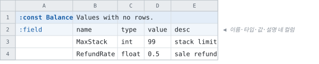

# 상수셋

<!-- 이 파일은 `doc/figures/showcase.py` 가 생성합니다. 손으로 고치지 마십시오 - 다음 실행이 덮어씁니다. -->

> [시트가 코드가 되는 모습으로](../generated-code.md)

---

행이 아니라 이름과 타입과 값의 목록입니다. 한 줄짜리 설정값들이 테이블
흉내를 내지 않아도 되는 자리입니다.

`:field` 줄 하나에 `name` · `type` · `value` · `desc` 입니다.

<!-- tabbit:pair -->



<!-- tabbit:tabs lang -->
<details data-lang="csharp" open>
<summary>C#</summary>

```csharp
namespace Tabbit.Fixtures.DocShowcase
{
    // Generated from test/fixtures/xlsx/doc-showcase/doc-showcase.xlsx : Basics : L2
    /// <summary>
    /// Values with no rows.
    /// </summary>
    public static class Balance
    {
        /// <summary>
        /// stack limit
        /// </summary>
        public static int MaxStack { get; }
        /// <summary>
        /// sale refund
        /// </summary>
        public static float RefundRate { get; }

        /// <summary>
        /// Static constructor for initialize static variables.
        /// </summary>
        static Balance()
        {
            MaxStack = 99;
            RefundRate = 0.5f;
        }
    }
} // namespace Tabbit.Fixtures.DocShowcase
```

[Balance.cs](../../test/fixtures/golden/doc-showcase/csharp/constants/Balance.cs)

</details>
<details data-lang="typescript">
<summary>TypeScript</summary>

```typescript
/** Values with no rows. */
export class Balance {
  /** stack limit */
  public static readonly maxStack: number = 99

  /** sale refund */
  public static readonly refundRate: number = 0.5
}
```

[balance.ts](../../test/fixtures/golden/doc-showcase/typescript/constants/balance.ts)

</details>
<details data-lang="cpp">
<summary>C++</summary>

```cpp
#ifndef TABBIT_GENERATED_DOCSHOWCASEACCESSOR_CONST_BALANCE_H
#define TABBIT_GENERATED_DOCSHOWCASEACCESSOR_CONST_BALANCE_H

#include <cstdint>
// Generated from test/fixtures/xlsx/doc-showcase/doc-showcase.xlsx : Basics : L2
/// Values with no rows.
struct Balance {
  /// stack limit
  static inline const std::int32_t MaxStack = 99;
  /// sale refund
  static inline const float RefundRate = 0.5f;
};

#endif  // TABBIT_GENERATED_DOCSHOWCASEACCESSOR_CONST_BALANCE_H
```

[DocShowcaseAccessor_const_balance.h](../../test/fixtures/golden/doc-showcase/cpp/constants/DocShowcaseAccessor_const_balance.h)

</details>
<details data-lang="python">
<summary>Python</summary>

```python
import enum
import os

from . import tabbit


class Balance:
    """Generated from test/fixtures/xlsx/doc-showcase/doc-showcase.xlsx : Basics : L2.

    Values with no rows.
    """
    # stack limit
    MAX_STACK = 99
    # sale refund
    REFUND_RATE = 0.5
```

[const_balance.py](../../test/fixtures/golden/doc-showcase/python/doc_showcase_data/const_balance.py)

</details>
<details data-lang="c">
<summary>C</summary>

```c
/* ------------------------------------------------------------------------------
 * Generated by Tabbit. DO NOT EDIT.
 *
 * Changes to this file may cause incorrect behavior and will be lost if the code is
 * regenerated.
 * ------------------------------------------------------------------------------
 */

#ifndef DOC_SHOWCASE_CONST_BALANCE_H
#define DOC_SHOWCASE_CONST_BALANCE_H

/* Generated from test/fixtures/xlsx/doc-showcase/doc-showcase.xlsx : Basics : L2
 *
 * Values with no rows.
 */
/* stack limit */
#define DOC_SHOWCASE_BALANCE_MAX_STACK 99
/* sale refund */
#define DOC_SHOWCASE_BALANCE_REFUND_RATE 0.5f

#endif /* DOC_SHOWCASE_CONST_BALANCE_H */
```

[DocShowcase_ConstBalance.h](../../test/fixtures/golden/doc-showcase/c/constants/DocShowcase_ConstBalance.h)

</details>
<details data-lang="dart">
<summary>Dart</summary>

```dart
part of '../tables.dart';
// Generated from test/fixtures/xlsx/doc-showcase/doc-showcase.xlsx : Basics : L2
/// Values with no rows.
class Balance {
  Balance._();
  /// stack limit
  static final int maxStack = 99;
  /// sale refund
  static final double refundRate = 0.5;
}
```

[balance.dart](../../test/fixtures/golden/doc-showcase/dart/constants/balance.dart)

</details>
<details data-lang="go">
<summary>Go</summary>

```go
package docshowcase

// Balance was generated from test/fixtures/xlsx/doc-showcase/doc-showcase.xlsx : Basics : L2.
// Values with no rows.
var Balance = struct {
	MaxStack   int32
	RefundRate float32
}{
	// stack limit
	MaxStack: 99,
	// sale refund
	RefundRate: 0.5,
}
```

[const_balance.go](../../test/fixtures/golden/doc-showcase/go/const_balance.go)

</details>
<details data-lang="java">
<summary>Java</summary>

```java
package tabbit.fixtures.docshowcase;

// Generated from test/fixtures/xlsx/doc-showcase/doc-showcase.xlsx : Basics : L2
/** Values with no rows. */
public final class Balance {
    private Balance() {
    }
    /** stack limit */
    public static final int MAX_STACK = 99;
    /** sale refund */
    public static final float REFUND_RATE = 0.5f;
}
```

[Balance.java](../../test/fixtures/golden/doc-showcase/java/tabbit/fixtures/docshowcase/Balance.java)

</details>
<details data-lang="kotlin">
<summary>Kotlin</summary>

```kotlin
@file:Suppress("unused", "RedundantVisibilityModifier", "UNUSED_IMPORT")

package tabbit.fixtures.docshowcase

import java.io.File
import tabbit.TcbReader
import tabbit.RecordNotFoundException
import tabbit.Uuid
import tabbit.readAllBytes
import tabbit.open
import tabbit.readTableHeader
import tabbit.checkColumn
import tabbit.checkColumnWithElements
import tabbit.checkBlockEnd
import tabbit.readPresence
import tabbit.readElementPresence
import tabbit.isPresent
import tabbit.TcbException
import tabbit.ColumnCursor
import tabbit.ELEMENT_VARINT
import tabbit.ELEMENT_BOOL
import tabbit.ELEMENT_I32
import tabbit.ELEMENT_I64
import tabbit.ELEMENT_F32
import tabbit.ELEMENT_F64
import tabbit.ELEMENT_STRING
import tabbit.ELEMENT_UUID
import tabbit.KIND_SCALAR
import tabbit.KIND_ARRAY

// Generated from test/fixtures/xlsx/doc-showcase/doc-showcase.xlsx : Basics : L2
/** Values with no rows. */
object Balance {
    /** stack limit */
    val MAX_STACK: Int = 99
    /** sale refund */
    val REFUND_RATE: Float = 0.5f
}
```

[Balance.kt](../../test/fixtures/golden/doc-showcase/kotlin/tabbit/fixtures/docshowcase/constants/Balance.kt)

</details>
<details data-lang="lua">
<summary>Lua</summary>

```lua
local _root = (...):match("^(.-)[^%.]+%.[^%.]+$")
local tcb = require(_root .. "tabbit.tcb_reader")

-- Generated from test/fixtures/xlsx/doc-showcase/doc-showcase.xlsx : Basics : L2.
-- Values with no rows.
---@class Balance
local Balance = {
  -- stack limit
  maxStack = 99,
  -- sale refund
  refundRate = 0.5,
}

return setmetatable(Balance, tcb.strictType("constant set `Balance`", {}))
```

[const_balance.lua](../../test/fixtures/golden/doc-showcase/lua/constants/const_balance.lua)

</details>
<details data-lang="php">
<summary>PHP</summary>

```php
<?php

// ------------------------------------------------------------------------------
// Generated by Tabbit. DO NOT EDIT.
//
// Changes to this file may cause incorrect behavior and will be lost if the code is
// regenerated.
// ------------------------------------------------------------------------------

declare(strict_types=1);

namespace Tabbit\Fixtures\DocShowcase;

use Tabbit\TcbReader;
use Tabbit\TcbColumnCursor;
use Tabbit\RecordNotFoundException;
use Tabbit\Uuid;

/**
 * Generated from test/fixtures/xlsx/doc-showcase/doc-showcase.xlsx : Basics : L2
 *
 * Values with no rows.
 */
final class Balance
{
    /** stack limit */
    public const MAX_STACK = 99;
    /** sale refund */
    public const REFUND_RATE = 0.5;
}
```

[Balance.php](../../test/fixtures/golden/doc-showcase/php/constants/Balance.php)

</details>
<details data-lang="ruby">
<summary>Ruby</summary>

```ruby
module DocShowcase
  # Generated from test/fixtures/xlsx/doc-showcase/doc-showcase.xlsx : Basics : L2
  # Values with no rows.
  module Balance
    # stack limit
    MAX_STACK = 99
    # sale refund
    REFUND_RATE = 0.5
  end
end
```

[balance.rb](../../test/fixtures/golden/doc-showcase/ruby/constants/balance.rb)

</details>
<details data-lang="rust">
<summary>Rust</summary>

```rust
pub const MAX_STACK: i32 = 99;
/// sale refund
pub const REFUND_RATE: f32 = 0.5;
```

[balance.rs](../../test/fixtures/golden/doc-showcase/rust/src/balance.rs)

</details>
<details data-lang="swift">
<summary>Swift</summary>

```swift
import Foundation

// Generated from test/fixtures/xlsx/doc-showcase/doc-showcase.xlsx : Basics : L2
/// Values with no rows.
public enum Balance {
    /// stack limit
    public static let maxStack: Int32 = 99
    /// sale refund
    public static let refundRate: Float = 0.5
}
```

[Balance.swift](../../test/fixtures/golden/doc-showcase/swift/constants/Balance.swift)

</details>
<details data-lang="unreal">
<summary>Unreal</summary>

```cpp
/* Generated from test/fixtures/xlsx/doc-showcase/doc-showcase.xlsx : Basics : L2 */
/** Values with no rows. */
struct FBalance
{
    /** stack limit */
    static inline const int32 MaxStack = 99;
    /** sale refund */
    static inline const float RefundRate = 0.5f;
};
```

[FDocShowcase.h](../../test/fixtures/golden/doc-showcase/unreal/Source/DocShowcase/Public/FDocShowcase.h)

</details>
<!-- /tabbit:tabs -->

<!-- /tabbit:pair -->

**상수셋은 데이터 파일에 흔적이 전혀 없습니다.** 값을 고쳐도 코드를
다시 배포하기 전에는 아무것도 달라지지 않습니다 —
[엔티티에 따라 갈리는 배포 경로](../concepts.md#엔티티에-따라-갈리는-배포-경로).

언어마다 내는 것이 다릅니다. 클래스의 정적 멤버로 내는 언어가 있고, 모듈 상수로 내는 언어가
있고, C는 매크로로 냅니다 — 그 언어에서 상수를 쓰는 방법이 그것이기 때문입니다.
