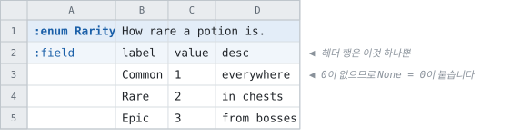
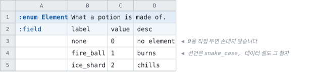

# enum

<!-- 이 파일은 `doc/figures/showcase.py` 가 생성합니다. 손으로 고치지 마십시오 - 다음 실행이 덮어씁니다. -->

> [시트가 코드가 되는 모습으로](../generated-code.md)

---

enum과 상수셋은 컬럼이 정해져 있으므로 **`:field` 줄 하나**로 끝납니다.
`label` 이 이름, `value` 가 값, `desc` 가 설명입니다.

0 항목이 없는 enum입니다.

<!-- tabbit:pair -->



<!-- tabbit:tabs lang -->
<details data-lang="csharp" open>
<summary>C#</summary>

```csharp
namespace Tabbit.Fixtures.DocShowcase
{
    // Generated from test/fixtures/xlsx/doc-showcase/doc-showcase.xlsx : Basics : B2
    /// <summary>
    /// How rare a potion is.
    /// </summary>
    public enum Rarity
    {
        /// <summary>
        /// None (automatically inserted by Tabbit)
        /// </summary>
        None = 0,
        /// <summary>
        /// everywhere
        /// </summary>
        Common = 1,
        /// <summary>
        /// in chests
        /// </summary>
        Rare = 2,
        /// <summary>
        /// from bosses
        /// </summary>
        Epic = 3
    }
} // namespace Tabbit.Fixtures.DocShowcase
```

[Rarity.cs](../../test/fixtures/golden/doc-showcase/csharp/enums/Rarity.cs)

</details>
<details data-lang="typescript">
<summary>TypeScript</summary>

```typescript
/** How rare a potion is. */
export enum Rarity {
  /** None (automatically inserted by Tabbit) */
  None = 0,
  /** everywhere */
  Common = 1,
  /** in chests */
  Rare = 2,
  /** from bosses */
  Epic = 3
}
```

[rarity.ts](../../test/fixtures/golden/doc-showcase/typescript/enums/rarity.ts)

</details>
<details data-lang="cpp">
<summary>C++</summary>

```cpp
#ifndef TABBIT_GENERATED_DOCSHOWCASEACCESSOR_ENUM_RARITY_H
#define TABBIT_GENERATED_DOCSHOWCASEACCESSOR_ENUM_RARITY_H

#include <cstdint>
// Generated from test/fixtures/xlsx/doc-showcase/doc-showcase.xlsx : Basics : B2
/// How rare a potion is.
enum class Rarity : std::int32_t {
  /// None (automatically inserted by Tabbit)
  None = 0,
  /// everywhere
  Common = 1,
  /// in chests
  Rare = 2,
  /// from bosses
  Epic = 3,
};

#endif  // TABBIT_GENERATED_DOCSHOWCASEACCESSOR_ENUM_RARITY_H
```

[DocShowcaseAccessor_enum_rarity.h](../../test/fixtures/golden/doc-showcase/cpp/enums/DocShowcaseAccessor_enum_rarity.h)

</details>
<details data-lang="python">
<summary>Python</summary>

```python
import enum
import os

from . import tabbit


class Rarity(enum.IntEnum):
    """Generated from test/fixtures/xlsx/doc-showcase/doc-showcase.xlsx : Basics : B2.

    How rare a potion is.
    """
    # None (automatically inserted by Tabbit)
    none = 0
    # everywhere
    common = 1
    # in chests
    rare = 2
    # from bosses
    epic = 3

    @classmethod
    def _missing_(cls, value):
        # A value the sheet never declared falls back to the default rather than
        # raising, matching what the other generated readers do with an unknown label.
        return cls(0) if value != 0 else None
```

[enum_rarity.py](../../test/fixtures/golden/doc-showcase/python/doc_showcase_data/enum_rarity.py)

</details>
<details data-lang="c">
<summary>C</summary>

```c
/* ------------------------------------------------------------------------------
 * Generated by Tabbit. DO NOT EDIT.
 *
 * Changes to this file may cause incorrect behavior and will be lost if the code is
 * regenerated.
 * ------------------------------------------------------------------------------
 */

#ifndef DOC_SHOWCASE_ENUM_RARITY_H
#define DOC_SHOWCASE_ENUM_RARITY_H

/* Generated from test/fixtures/xlsx/doc-showcase/doc-showcase.xlsx : Basics : B2
 *
 * How rare a potion is.
 */
typedef enum DocShowcase_Rarity_t {
  /* None (automatically inserted by Tabbit) */
  DOC_SHOWCASE_RARITY_NONE = 0,
  /* everywhere */
  DOC_SHOWCASE_RARITY_COMMON = 1,
  /* in chests */
  DOC_SHOWCASE_RARITY_RARE = 2,
  /* from bosses */
  DOC_SHOWCASE_RARITY_EPIC = 3,
} DocShowcase_Rarity_t;

#endif /* DOC_SHOWCASE_ENUM_RARITY_H */
```

[DocShowcase_EnumRarity.h](../../test/fixtures/golden/doc-showcase/c/enums/DocShowcase_EnumRarity.h)

</details>
<details data-lang="dart">
<summary>Dart</summary>

```dart
part of '../tables.dart';
// Generated from test/fixtures/xlsx/doc-showcase/doc-showcase.xlsx : Basics : B2
/// How rare a potion is.
enum Rarity {
  /// None (automatically inserted by Tabbit)
  none(0),
  /// everywhere
  common(1),
  /// in chests
  rare(2),
  /// from bosses
  epic(3);

  const Rarity(this.value);

  /// The declared value, which is what travels on the wire.
  final int value;

  /// The label with this value, or the default when the sheet declared no such label.
  static Rarity of(int value) {
    for (final candidate in Rarity.values) {
      if (candidate.value == value) return candidate;
    }

    return Rarity.none;
  }
}
```

[rarity.dart](../../test/fixtures/golden/doc-showcase/dart/enums/rarity.dart)

</details>
<details data-lang="go">
<summary>Go</summary>

```go
package docshowcase

import (
	"strconv"
)

// Rarity was generated from test/fixtures/xlsx/doc-showcase/doc-showcase.xlsx : Basics : B2.
// How rare a potion is.
type Rarity int32

const (
	// None (automatically inserted by Tabbit)
	RarityNone Rarity = 0
	// everywhere
	RarityCommon Rarity = 1
	// in chests
	RarityRare Rarity = 2
	// from bosses
	RarityEpic Rarity = 3
)

// String names the label, or renders the number when the value has none.
func (v Rarity) String() string {
	switch v {
	case RarityNone:
		return "None"
	case RarityCommon:
		return "Common"
	case RarityRare:
		return "Rare"
	case RarityEpic:
		return "Epic"
	}

	return strconv.FormatInt(int64(v), 10)
}
```

[enum_rarity.go](../../test/fixtures/golden/doc-showcase/go/enum_rarity.go)

</details>
<details data-lang="java">
<summary>Java</summary>

```java
package tabbit.fixtures.docshowcase;

// Generated from test/fixtures/xlsx/doc-showcase/doc-showcase.xlsx : Basics : B2
/** How rare a potion is. */
public enum Rarity {
    /** None (automatically inserted by Tabbit) */
        NONE(0),
    /** everywhere */
        COMMON(1),
    /** in chests */
        RARE(2),
    /** from bosses */
        EPIC(3);

    private final int value;

        Rarity(int value) {
        this.value = value;
    }

    /** The declared value, which is what travels on the wire. */
    public int value() {
        return value;
    }

    /**
     * The label with this value, or the default when the sheet declared no such label.
     *
     * <p>A fallback rather than a throw, matching what the other generated readers do.
     */
    public static Rarity of(int value) {
        for (Rarity candidate : values()) {
            if (candidate.value == value) {
                return candidate;
            }
        }

        return NONE;
    }
}
```

[Rarity.java](../../test/fixtures/golden/doc-showcase/java/tabbit/fixtures/docshowcase/Rarity.java)

</details>
<details data-lang="kotlin">
<summary>Kotlin</summary>

```kotlin
@file:Suppress("unused", "RedundantVisibilityModifier", "UNUSED_IMPORT")

package tabbit.fixtures.docshowcase

import java.io.File
import tabbit.TcbReader
import tabbit.RecordNotFoundException
import tabbit.Uuid
import tabbit.readAllBytes
import tabbit.open
import tabbit.readTableHeader
import tabbit.checkColumn
import tabbit.checkColumnWithElements
import tabbit.checkBlockEnd
import tabbit.readPresence
import tabbit.readElementPresence
import tabbit.isPresent
import tabbit.TcbException
import tabbit.ColumnCursor
import tabbit.ELEMENT_VARINT
import tabbit.ELEMENT_BOOL
import tabbit.ELEMENT_I32
import tabbit.ELEMENT_I64
import tabbit.ELEMENT_F32
import tabbit.ELEMENT_F64
import tabbit.ELEMENT_STRING
import tabbit.ELEMENT_UUID
import tabbit.KIND_SCALAR
import tabbit.KIND_ARRAY

// Generated from test/fixtures/xlsx/doc-showcase/doc-showcase.xlsx : Basics : B2
/** How rare a potion is. */
enum class Rarity(val value: Int) {
    /** None (automatically inserted by Tabbit) */
    NONE(0),
    /** everywhere */
    COMMON(1),
    /** in chests */
    RARE(2),
    /** from bosses */
    EPIC(3);

    companion object {
        /**
         * The label with this value, or the default when the sheet declared no such label.
         *
         * A fallback rather than a throw, matching the other generated readers.
         */
        fun of(value: Int): Rarity =
            entries.firstOrNull { it.value == value } ?: Rarity.NONE
    }
}
```

[Rarity.kt](../../test/fixtures/golden/doc-showcase/kotlin/tabbit/fixtures/docshowcase/enums/Rarity.kt)

</details>
<details data-lang="lua">
<summary>Lua</summary>

```lua
local _root = (...):match("^(.-)[^%.]+%.[^%.]+$")
local tcb = require(_root .. "tabbit.tcb_reader")

-- Generated from test/fixtures/xlsx/doc-showcase/doc-showcase.xlsx : Basics : B2.
-- How rare a potion is.
---@class Rarity
local Rarity = {
  -- None (automatically inserted by Tabbit)
  none = 0,
  -- everywhere
  common = 1,
  -- in chests
  rare = 2,
  -- from bosses
  epic = 3,
}

return setmetatable(Rarity, tcb.strictType("enum `Rarity`", {}))
```

[enum_rarity.lua](../../test/fixtures/golden/doc-showcase/lua/enums/enum_rarity.lua)

</details>
<details data-lang="php">
<summary>PHP</summary>

```php
<?php

// ------------------------------------------------------------------------------
// Generated by Tabbit. DO NOT EDIT.
//
// Changes to this file may cause incorrect behavior and will be lost if the code is
// regenerated.
// ------------------------------------------------------------------------------

declare(strict_types=1);

namespace Tabbit\Fixtures\DocShowcase;

use Tabbit\TcbReader;
use Tabbit\TcbColumnCursor;
use Tabbit\RecordNotFoundException;
use Tabbit\Uuid;

/**
 * Generated from test/fixtures/xlsx/doc-showcase/doc-showcase.xlsx : Basics : B2
 *
 * How rare a potion is.
 */
enum Rarity: int
{
    /** None (automatically inserted by Tabbit) */
    case None = 0;
    /** everywhere */
    case Common = 1;
    /** in chests */
    case Rare = 2;
    /** from bosses */
    case Epic = 3;
}
```

[Rarity.php](../../test/fixtures/golden/doc-showcase/php/enums/Rarity.php)

</details>
<details data-lang="ruby">
<summary>Ruby</summary>

```ruby
module DocShowcase
  # Generated from test/fixtures/xlsx/doc-showcase/doc-showcase.xlsx : Basics : B2
  # How rare a potion is.
  module Rarity
    # None (automatically inserted by Tabbit)
    NONE = 0
    # everywhere
    COMMON = 1
    # in chests
    RARE = 2
    # from bosses
    EPIC = 3

    # Every declared label, by value.
    NAMES = {
      0 => :none,
      1 => :common,
      2 => :rare,
      3 => :epic,
    }.freeze

    # The label's name, or nil when the sheet declared no such value.
    def self.name_of(value)
      NAMES[value]
    end
  end
end
```

[rarity.rb](../../test/fixtures/golden/doc-showcase/ruby/enums/rarity.rb)

</details>
<details data-lang="rust">
<summary>Rust</summary>

```rust
#[derive(Clone, Copy, Debug, Default, PartialEq, Eq, Hash)]
#[repr(i32)]
pub enum Rarity {
    /// None (automatically inserted by Tabbit)
    #[default]
    None = 0,
    /// everywhere
    Common = 1,
    /// in chests
    Rare = 2,
    /// from bosses
    Epic = 3,
}

impl Rarity {
    /// The label with this value, or None when the sheet declared no such label.
    pub fn from_value(value: i32) -> Option<Self> {
        match value {
            0 => Some(Rarity::None),
            1 => Some(Rarity::Common),
            2 => Some(Rarity::Rare),
            3 => Some(Rarity::Epic),
            _ => None,
        }
    }

    /// The declared value, which is what travels on the wire.
    pub fn value(self) -> i32 {
        self as i32
    }
}
```

[enum_rarity.rs](../../test/fixtures/golden/doc-showcase/rust/src/enum_rarity.rs)

</details>
<details data-lang="swift">
<summary>Swift</summary>

```swift
import Foundation

// Generated from test/fixtures/xlsx/doc-showcase/doc-showcase.xlsx : Basics : B2
/// How rare a potion is.
public enum Rarity: Int32, CaseIterable, Sendable {
    /// None (automatically inserted by Tabbit)
    case none = 0
    /// everywhere
    case common = 1
    /// in chests
    case rare = 2
    /// from bosses
    case epic = 3

    /// The label with this value, or the default when the sheet declared no such label.
    ///
    /// A fallback rather than a thrown error, matching the other generated readers: a value
    /// the sheets no longer declare is data that has moved on, not a broken file.
    public static func of(_ value: Int32) -> Rarity {
        Rarity(rawValue: value) ?? Rarity.none
    }

    /// The declared value, which is what travels on the wire.
    public var value: Int32 { rawValue }
}
```

[Rarity.swift](../../test/fixtures/golden/doc-showcase/swift/enums/Rarity.swift)

</details>
<details data-lang="unreal">
<summary>Unreal</summary>

```cpp
enum class ERarity : uint8
{
    /** None (automatically inserted by Tabbit) */
    None = 0 UMETA(DisplayName = "None"),
    /** everywhere */
    Common = 1 UMETA(DisplayName = "Common"),
    /** in chests */
    Rare = 2 UMETA(DisplayName = "Rare"),
    /** from bosses */
    Epic = 3 UMETA(DisplayName = "Epic"),
};
```

[FDocShowcase.h](../../test/fixtures/golden/doc-showcase/unreal/Source/DocShowcase/Public/FDocShowcase.h)

</details>
<!-- /tabbit:tabs -->

<!-- /tabbit:pair -->

**시트에 없던 `None = 0` 이 붙어 있습니다.**

enum 필드는 값이 대입되기 전에도 무언가를 들고 있는데, 그것이 이름 없는 0이면 디버거에서도
로그에서도 읽을 수 없기 때문입니다. `AutoInsertEnumNoneLabel` 로 끌 수 있습니다.

여기는 선언 파일을 통째로 옮겼습니다. enum은 그 정도로 짧습니다.

---

시트가 0에 이미 값을 두었다면 아무것도 더하지 않습니다. 그리고
**라벨을 어떤 철자로 선언하든 데이터 셀에는 그 철자 그대로 적습니다.**

<!-- tabbit:pair -->



<!-- tabbit:tabs lang -->
<details data-lang="csharp" open>
<summary>C#</summary>

```csharp
namespace Tabbit.Fixtures.DocShowcase
{
    // Generated from test/fixtures/xlsx/doc-showcase/doc-showcase.xlsx : Basics : G2
    /// <summary>
    /// What a potion is made of.
    /// </summary>
    public enum Element
    {
        /// <summary>
        /// no element
        /// </summary>
        None = 0,
        /// <summary>
        /// burns
        /// </summary>
        FireBall = 1,
        /// <summary>
        /// chills
        /// </summary>
        IceShard = 2
    }
} // namespace Tabbit.Fixtures.DocShowcase
```

[Element.cs](../../test/fixtures/golden/doc-showcase/csharp/enums/Element.cs)

</details>
<details data-lang="typescript">
<summary>TypeScript</summary>

```typescript
/** What a potion is made of. */
export enum Element {
  /** no element */
  None = 0,
  /** burns */
  FireBall = 1,
  /** chills */
  IceShard = 2
}
```

[element.ts](../../test/fixtures/golden/doc-showcase/typescript/enums/element.ts)

</details>
<details data-lang="cpp">
<summary>C++</summary>

```cpp
#ifndef TABBIT_GENERATED_DOCSHOWCASEACCESSOR_ENUM_ELEMENT_H
#define TABBIT_GENERATED_DOCSHOWCASEACCESSOR_ENUM_ELEMENT_H

#include <cstdint>
// Generated from test/fixtures/xlsx/doc-showcase/doc-showcase.xlsx : Basics : G2
/// What a potion is made of.
enum class Element : std::int32_t {
  /// no element
  None = 0,
  /// burns
  FireBall = 1,
  /// chills
  IceShard = 2,
};

#endif  // TABBIT_GENERATED_DOCSHOWCASEACCESSOR_ENUM_ELEMENT_H
```

[DocShowcaseAccessor_enum_element.h](../../test/fixtures/golden/doc-showcase/cpp/enums/DocShowcaseAccessor_enum_element.h)

</details>
<details data-lang="python">
<summary>Python</summary>

```python
import enum
import os

from . import tabbit


class Element(enum.IntEnum):
    """Generated from test/fixtures/xlsx/doc-showcase/doc-showcase.xlsx : Basics : G2.

    What a potion is made of.
    """
    # no element
    none = 0
    # burns
    fire_ball = 1
    # chills
    ice_shard = 2

    @classmethod
    def _missing_(cls, value):
        # A value the sheet never declared falls back to the default rather than
        # raising, matching what the other generated readers do with an unknown label.
        return cls(0) if value != 0 else None
```

[enum_element.py](../../test/fixtures/golden/doc-showcase/python/doc_showcase_data/enum_element.py)

</details>
<details data-lang="c">
<summary>C</summary>

```c
/* ------------------------------------------------------------------------------
 * Generated by Tabbit. DO NOT EDIT.
 *
 * Changes to this file may cause incorrect behavior and will be lost if the code is
 * regenerated.
 * ------------------------------------------------------------------------------
 */

#ifndef DOC_SHOWCASE_ENUM_ELEMENT_H
#define DOC_SHOWCASE_ENUM_ELEMENT_H

/* Generated from test/fixtures/xlsx/doc-showcase/doc-showcase.xlsx : Basics : G2
 *
 * What a potion is made of.
 */
typedef enum DocShowcase_Element_t {
  /* no element */
  DOC_SHOWCASE_ELEMENT_NONE = 0,
  /* burns */
  DOC_SHOWCASE_ELEMENT_FIRE_BALL = 1,
  /* chills */
  DOC_SHOWCASE_ELEMENT_ICE_SHARD = 2,
} DocShowcase_Element_t;

#endif /* DOC_SHOWCASE_ENUM_ELEMENT_H */
```

[DocShowcase_EnumElement.h](../../test/fixtures/golden/doc-showcase/c/enums/DocShowcase_EnumElement.h)

</details>
<details data-lang="dart">
<summary>Dart</summary>

```dart
part of '../tables.dart';
// Generated from test/fixtures/xlsx/doc-showcase/doc-showcase.xlsx : Basics : G2
/// What a potion is made of.
enum Element {
  /// no element
  none(0),
  /// burns
  fireBall(1),
  /// chills
  iceShard(2);

  const Element(this.value);

  /// The declared value, which is what travels on the wire.
  final int value;

  /// The label with this value, or the default when the sheet declared no such label.
  static Element of(int value) {
    for (final candidate in Element.values) {
      if (candidate.value == value) return candidate;
    }

    return Element.none;
  }
}
```

[element.dart](../../test/fixtures/golden/doc-showcase/dart/enums/element.dart)

</details>
<details data-lang="go">
<summary>Go</summary>

```go
package docshowcase

import (
	"strconv"
)

// Element was generated from test/fixtures/xlsx/doc-showcase/doc-showcase.xlsx : Basics : G2.
// What a potion is made of.
type Element int32

const (
	// no element
	ElementNone Element = 0
	// burns
	ElementFireBall Element = 1
	// chills
	ElementIceShard Element = 2
)

// String names the label, or renders the number when the value has none.
func (v Element) String() string {
	switch v {
	case ElementNone:
		return "None"
	case ElementFireBall:
		return "FireBall"
	case ElementIceShard:
		return "IceShard"
	}

	return strconv.FormatInt(int64(v), 10)
}
```

[enum_element.go](../../test/fixtures/golden/doc-showcase/go/enum_element.go)

</details>
<details data-lang="java">
<summary>Java</summary>

```java
package tabbit.fixtures.docshowcase;

// Generated from test/fixtures/xlsx/doc-showcase/doc-showcase.xlsx : Basics : G2
/** What a potion is made of. */
public enum Element {
    /** no element */
        NONE(0),
    /** burns */
        FIRE_BALL(1),
    /** chills */
        ICE_SHARD(2);

    private final int value;

        Element(int value) {
        this.value = value;
    }

    /** The declared value, which is what travels on the wire. */
    public int value() {
        return value;
    }

    /**
     * The label with this value, or the default when the sheet declared no such label.
     *
     * <p>A fallback rather than a throw, matching what the other generated readers do.
     */
    public static Element of(int value) {
        for (Element candidate : values()) {
            if (candidate.value == value) {
                return candidate;
            }
        }

        return NONE;
    }
}
```

[Element.java](../../test/fixtures/golden/doc-showcase/java/tabbit/fixtures/docshowcase/Element.java)

</details>
<details data-lang="kotlin">
<summary>Kotlin</summary>

```kotlin
@file:Suppress("unused", "RedundantVisibilityModifier", "UNUSED_IMPORT")

package tabbit.fixtures.docshowcase

import java.io.File
import tabbit.TcbReader
import tabbit.RecordNotFoundException
import tabbit.Uuid
import tabbit.readAllBytes
import tabbit.open
import tabbit.readTableHeader
import tabbit.checkColumn
import tabbit.checkColumnWithElements
import tabbit.checkBlockEnd
import tabbit.readPresence
import tabbit.readElementPresence
import tabbit.isPresent
import tabbit.TcbException
import tabbit.ColumnCursor
import tabbit.ELEMENT_VARINT
import tabbit.ELEMENT_BOOL
import tabbit.ELEMENT_I32
import tabbit.ELEMENT_I64
import tabbit.ELEMENT_F32
import tabbit.ELEMENT_F64
import tabbit.ELEMENT_STRING
import tabbit.ELEMENT_UUID
import tabbit.KIND_SCALAR
import tabbit.KIND_ARRAY

// Generated from test/fixtures/xlsx/doc-showcase/doc-showcase.xlsx : Basics : G2
/** What a potion is made of. */
enum class Element(val value: Int) {
    /** no element */
    NONE(0),
    /** burns */
    FIRE_BALL(1),
    /** chills */
    ICE_SHARD(2);

    companion object {
        /**
         * The label with this value, or the default when the sheet declared no such label.
         *
         * A fallback rather than a throw, matching the other generated readers.
         */
        fun of(value: Int): Element =
            entries.firstOrNull { it.value == value } ?: Element.NONE
    }
}
```

[Element.kt](../../test/fixtures/golden/doc-showcase/kotlin/tabbit/fixtures/docshowcase/enums/Element.kt)

</details>
<details data-lang="lua">
<summary>Lua</summary>

```lua
local _root = (...):match("^(.-)[^%.]+%.[^%.]+$")
local tcb = require(_root .. "tabbit.tcb_reader")

-- Generated from test/fixtures/xlsx/doc-showcase/doc-showcase.xlsx : Basics : G2.
-- What a potion is made of.
---@class Element
local Element = {
  -- no element
  none = 0,
  -- burns
  fireBall = 1,
  -- chills
  iceShard = 2,
}

return setmetatable(Element, tcb.strictType("enum `Element`", {}))
```

[enum_element.lua](../../test/fixtures/golden/doc-showcase/lua/enums/enum_element.lua)

</details>
<details data-lang="php">
<summary>PHP</summary>

```php
<?php

// ------------------------------------------------------------------------------
// Generated by Tabbit. DO NOT EDIT.
//
// Changes to this file may cause incorrect behavior and will be lost if the code is
// regenerated.
// ------------------------------------------------------------------------------

declare(strict_types=1);

namespace Tabbit\Fixtures\DocShowcase;

use Tabbit\TcbReader;
use Tabbit\TcbColumnCursor;
use Tabbit\RecordNotFoundException;
use Tabbit\Uuid;

/**
 * Generated from test/fixtures/xlsx/doc-showcase/doc-showcase.xlsx : Basics : G2
 *
 * What a potion is made of.
 */
enum Element: int
{
    /** no element */
    case None = 0;
    /** burns */
    case FireBall = 1;
    /** chills */
    case IceShard = 2;
}
```

[Element.php](../../test/fixtures/golden/doc-showcase/php/enums/Element.php)

</details>
<details data-lang="ruby">
<summary>Ruby</summary>

```ruby
module DocShowcase
  # Generated from test/fixtures/xlsx/doc-showcase/doc-showcase.xlsx : Basics : G2
  # What a potion is made of.
  module Element
    # no element
    NONE = 0
    # burns
    FIRE_BALL = 1
    # chills
    ICE_SHARD = 2

    # Every declared label, by value.
    NAMES = {
      0 => :none,
      1 => :fire_ball,
      2 => :ice_shard,
    }.freeze

    # The label's name, or nil when the sheet declared no such value.
    def self.name_of(value)
      NAMES[value]
    end
  end
end
```

[element.rb](../../test/fixtures/golden/doc-showcase/ruby/enums/element.rb)

</details>
<details data-lang="rust">
<summary>Rust</summary>

```rust
#[derive(Clone, Copy, Debug, Default, PartialEq, Eq, Hash)]
#[repr(i32)]
pub enum Element {
    /// no element
    #[default]
    None = 0,
    /// burns
    FireBall = 1,
    /// chills
    IceShard = 2,
}

impl Element {
    /// The label with this value, or None when the sheet declared no such label.
    pub fn from_value(value: i32) -> Option<Self> {
        match value {
            0 => Some(Element::None),
            1 => Some(Element::FireBall),
            2 => Some(Element::IceShard),
            _ => None,
        }
    }

    /// The declared value, which is what travels on the wire.
    pub fn value(self) -> i32 {
        self as i32
    }
}
```

[enum_element.rs](../../test/fixtures/golden/doc-showcase/rust/src/enum_element.rs)

</details>
<details data-lang="swift">
<summary>Swift</summary>

```swift
import Foundation

// Generated from test/fixtures/xlsx/doc-showcase/doc-showcase.xlsx : Basics : G2
/// What a potion is made of.
public enum Element: Int32, CaseIterable, Sendable {
    /// no element
    case none = 0
    /// burns
    case fireBall = 1
    /// chills
    case iceShard = 2

    /// The label with this value, or the default when the sheet declared no such label.
    ///
    /// A fallback rather than a thrown error, matching the other generated readers: a value
    /// the sheets no longer declare is data that has moved on, not a broken file.
    public static func of(_ value: Int32) -> Element {
        Element(rawValue: value) ?? Element.none
    }

    /// The declared value, which is what travels on the wire.
    public var value: Int32 { rawValue }
}
```

[Element.swift](../../test/fixtures/golden/doc-showcase/swift/enums/Element.swift)

</details>
<details data-lang="unreal">
<summary>Unreal</summary>

```cpp
enum class EElement : uint8
{
    /** no element */
    None = 0 UMETA(DisplayName = "None"),
    /** burns */
    FireBall = 1 UMETA(DisplayName = "FireBall"),
    /** chills */
    IceShard = 2 UMETA(DisplayName = "IceShard"),
};
```

[FDocShowcase.h](../../test/fixtures/golden/doc-showcase/unreal/Source/DocShowcase/Public/FDocShowcase.h)

</details>
<!-- /tabbit:tabs -->

<!-- /tabbit:pair -->

생성된 타입의 이름은 각 언어의 관례를 따르지만, **시트는 시트의
표기를 지킵니다** — `fire_ball` 이라고 선언했으면 셀에도 `fire_ball` 입니다.
