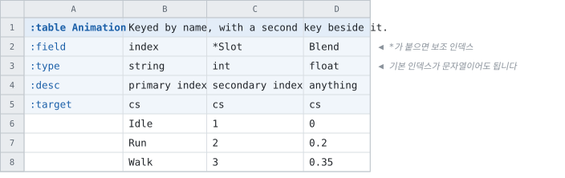
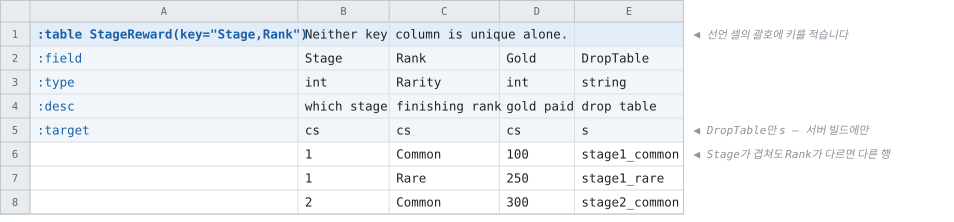

# 행을 찾는 방법

<!-- 이 파일은 `doc/figures/showcase.py` 가 생성합니다. 손으로 고치지 마십시오 - 다음 실행이 덮어씁니다. -->

> [시트가 코드가 되는 모습으로](../generated-code.md)

---

조회 함수는 인덱스마다 셋이 생성되고, **이름은 그 인덱스의 컬럼에서
만들어집니다.**

| 함수 | 없을 때 |
| --- | --- |
| `FindBy…` | 널을 반환합니다 |
| `GetBy…OrThrow` | 예외를 발생시킵니다 |
| `Contains…` | 존재 여부만 확인합니다 |

이름이 동작을 설명하므로, 검사를 빠뜨린 자리가 코드를 읽는 것만으로 드러납니다.

**첫 필드 컬럼이 기본 인덱스**이고, 이름 앞에 `*` 를 붙이면 보조
인덱스가 하나 더 생깁니다.

<!-- tabbit:pair -->



<!-- tabbit:tabs lang -->
<details data-lang="csharp" open>
<summary>C#</summary>

```csharp
[System.Serializable]
public partial class AnimationRecord
{
    #region Values
    /// <summary>
    /// primary index
    /// </summary>
    public string Index => _index;

    /// <summary>
    /// secondary index
    /// </summary>
    public int Slot => _slot;

    /// <summary>
    /// anything
    /// </summary>
    public float Blend => _blend;
    #endregion

    #region Storage
    internal string _index = "";
    internal int _slot;
    internal float _blend;
    #endregion

    #region ToString
    public override string ToString()
    {
        var sb = new StringBuilder("{");
        sb.Append("\"Index\":"); ToStringHelper.ToString(Index, sb);
        sb.Append(",\"Slot\":"); ToStringHelper.ToString(Slot, sb);
        sb.Append(",\"Blend\":"); ToStringHelper.ToString(Blend, sb);
        sb.Append("}");
        return sb.ToString();
    }
    #endregion
}
```

[AnimationTable.cs](../../test/fixtures/golden/doc-showcase/csharp/tables/AnimationTable.cs)

</details>
<details data-lang="typescript">
<summary>TypeScript</summary>

```typescript
// Generated from test/fixtures/xlsx/doc-showcase/doc-showcase.xlsx : Index : B2
/** Keyed by name, with a second key beside it. */
export class AnimationRecord {
  /** Default constructor */
  constructor() {
  }

  /** primary index */
  public get index(): string { return this._index }

  /** secondary index */
  public get slot(): number { return this._slot }

  /** anything */
  public get blend(): number { return this._blend }

  public _index: string = ''
  public _slot: number = 0
  public _blend: number = 0

  /** Populate field values. */
  public populateFieldValues(dataRow: IDataRow): void {
    this._index = dataRow.index
    this._slot = dataRow.slot
    this._blend = Math.fround(dataRow.blend)
  }

  /** Populate field values. */
  public populateFieldValuesCompact(dataRow: any[]): void {
    let offset = 0
    this._index = dataRow[offset++]
    this._slot = dataRow[offset++]
    this._blend = Math.fround(dataRow[offset++])
  }
}
```

[animation.ts](../../test/fixtures/golden/doc-showcase/typescript/tables/animation.ts)

</details>
<details data-lang="cpp">
<summary>C++</summary>

```cpp
// Generated from test/fixtures/xlsx/doc-showcase/doc-showcase.xlsx : Index : B2
/// Keyed by name, with a second key beside it.
struct AnimationRecord {
  /// primary index
  std::string index;
  /// secondary index
  std::int32_t slot = 0;
  /// anything
  float blend = 0.0f;
};
```

[DocShowcaseAccessor_animation.h](../../test/fixtures/golden/doc-showcase/cpp/tables/DocShowcaseAccessor_animation.h)

</details>
<details data-lang="python">
<summary>Python</summary>

```python
class AnimationRecord:
    """Generated from test/fixtures/xlsx/doc-showcase/doc-showcase.xlsx : Index : B2.

    Keyed by name, with a second key beside it.
    """

    __slots__ = ("index", "slot", "blend")

    def __init__(self):
        self.index = ""
        self.slot = 0
        self.blend = 0.0

    def __repr__(self):
        return "AnimationRecord(index=%r, slot=%r, blend=%r)" % (self.index, self.slot, self.blend)
```

[animation_table.py](../../test/fixtures/golden/doc-showcase/python/doc_showcase_data/animation_table.py)

</details>
<details data-lang="c">
<summary>C</summary>

```c
/* Generated from test/fixtures/xlsx/doc-showcase/doc-showcase.xlsx : Index : B2
 *
 * Keyed by name, with a second key beside it.
 */
struct DocShowcase_AnimationRecord_t {
  /* primary index */
  const char* index;
  /* secondary index */
  int32_t slot;
  /* anything */
  float blend;
};
```

[DocShowcase_Animation.h](../../test/fixtures/golden/doc-showcase/c/tables/DocShowcase_Animation.h)

</details>
<details data-lang="dart">
<summary>Dart</summary>

```dart
// Generated from test/fixtures/xlsx/doc-showcase/doc-showcase.xlsx : Index : B2
/// Keyed by name, with a second key beside it.
class AnimationRecord {
  /// primary index
  String index = '';
  /// secondary index
  int slot = 0;
  /// anything
  double blend = 0.0;

}
```

[animation_table.dart](../../test/fixtures/golden/doc-showcase/dart/tables/animation_table.dart)

</details>
<details data-lang="go">
<summary>Go</summary>

```go
// AnimationRecord was generated from test/fixtures/xlsx/doc-showcase/doc-showcase.xlsx : Index : B2.
// Keyed by name, with a second key beside it.
type AnimationRecord struct {
	// primary index
	Index string
	// secondary index
	Slot int32
	// anything
	Blend float32
}
```

[animation_table.go](../../test/fixtures/golden/doc-showcase/go/animation_table.go)

</details>
<details data-lang="java">
<summary>Java</summary>

```java
// Generated from test/fixtures/xlsx/doc-showcase/doc-showcase.xlsx : Index : B2
/** Keyed by name, with a second key beside it. */
public final class AnimationRecord {
    /** primary index */
    public String index = "";
    /** secondary index */
    public int slot;
    /** anything */
    public float blend;

}
```

[AnimationRecord.java](../../test/fixtures/golden/doc-showcase/java/tabbit/fixtures/docshowcase/AnimationRecord.java)

</details>
<details data-lang="kotlin">
<summary>Kotlin</summary>

```kotlin
// Generated from test/fixtures/xlsx/doc-showcase/doc-showcase.xlsx : Index : B2
/** Keyed by name, with a second key beside it. */
class AnimationRecord {
    /** primary index */
    var index: String = ""
    /** secondary index */
    var slot: Int = 0
    /** anything */
    var blend: Float = 0.0f

}
```

[AnimationTable.kt](../../test/fixtures/golden/doc-showcase/kotlin/tabbit/fixtures/docshowcase/tables/AnimationTable.kt)

</details>
<details data-lang="lua">
<summary>Lua</summary>

```lua
-- Generated from test/fixtures/xlsx/doc-showcase/doc-showcase.xlsx : Index : B2.
-- Keyed by name, with a second key beside it.
---@class AnimationRecord
---@field index string
---@field slot integer
---@field blend number
local AnimationRecordMeta = tcb.strictType("a `Animation` row", { "index", "slot", "blend" })
```

[animation_table.lua](../../test/fixtures/golden/doc-showcase/lua/tables/animation_table.lua)

</details>
<details data-lang="php">
<summary>PHP</summary>

```php
/**
 * Generated from test/fixtures/xlsx/doc-showcase/doc-showcase.xlsx : Index : B2
 *
 * Keyed by name, with a second key beside it.
 */
final class AnimationRecord
{
    /** primary index */
    public string $index = '';
    /** secondary index */
    public int $slot = 0;
    /** anything */
    public float $blend = 0.0;
}
```

[AnimationTable.php](../../test/fixtures/golden/doc-showcase/php/tables/AnimationTable.php)

</details>
<details data-lang="ruby">
<summary>Ruby</summary>

```ruby
# Generated from test/fixtures/xlsx/doc-showcase/doc-showcase.xlsx : Index : B2
# Keyed by name, with a second key beside it.
class AnimationRecord
  attr_accessor :index, :slot, :blend

  def initialize
    @index = ''
    @slot = 0
    @blend = 0.0
  end
```

[animation_table.rb](../../test/fixtures/golden/doc-showcase/ruby/tables/animation_table.rb)

</details>
<details data-lang="rust">
<summary>Rust</summary>

```rust
// Generated from test/fixtures/xlsx/doc-showcase/doc-showcase.xlsx : Index : B2
/// Keyed by name, with a second key beside it.
#[derive(Clone, Debug, Default)]
pub struct AnimationRecord {
    /// primary index
    pub index: String,
    /// secondary index
    pub slot: i32,
    /// anything
    pub blend: f32,
}
```

[animation_table.rs](../../test/fixtures/golden/doc-showcase/rust/src/animation_table.rs)

</details>
<details data-lang="swift">
<summary>Swift</summary>

```swift
// Generated from test/fixtures/xlsx/doc-showcase/doc-showcase.xlsx : Index : B2
/// Keyed by name, with a second key beside it.
public final class AnimationRecord {

    public init() {}

    /// primary index
    public var index: String = ""

    /// secondary index
    public var slot: Int32 = 0

    /// anything
    public var blend: Float = 0
}
```

[AnimationTable.swift](../../test/fixtures/golden/doc-showcase/swift/tables/AnimationTable.swift)

</details>
<details data-lang="unreal">
<summary>Unreal</summary>

```cpp
// Generated from test/fixtures/xlsx/doc-showcase/doc-showcase.xlsx : Index : B2
/** Keyed by name, with a second key beside it. */
USTRUCT(BlueprintType)
struct DOCSHOWCASE_API FAnimationRow
{
    GENERATED_BODY()

    /** primary index */
    UPROPERTY(EditAnywhere, BlueprintReadOnly, Category = "Animation")
    FString Index;

    /** secondary index */
    UPROPERTY(EditAnywhere, BlueprintReadOnly, Category = "Animation")
    int32 Slot = 0;

    /** anything */
    UPROPERTY(EditAnywhere, BlueprintReadOnly, Category = "Animation")
    float Blend = 0.0f;

};
```

[FDocShowcase.h](../../test/fixtures/golden/doc-showcase/unreal/Source/DocShowcase/Public/FDocShowcase.h)

</details>
<!-- /tabbit:tabs -->

<!-- /tabbit:pair -->

조회 함수는 레코드가 아니라 테이블에 생깁니다 — 여기 보이는 것은
멤버뿐입니다. `index` 가 문자열이므로 그 테이블의 조회는 문자열을 받고, `*Slot` 때문에
정수로 찾는 조회가 하나 더 생깁니다.

---

어느 컬럼 하나로도 행을 가릴 수 없을 때 **선언 셀의 괄호에 키를
적습니다** — `:table StageReward(key="Stage,Rank")` 입니다.



<!-- tabbit:tabs lang -->
<details data-lang="csharp" open>
<summary>C#</summary>

```csharp
[System.Serializable]
public partial class StageRewardRecord
{
    #region Values
    /// <summary>
    /// which stage
    /// </summary>
    public int Stage => _stage;

    /// <summary>
    /// finishing rank
    /// </summary>
    public global::Tabbit.Fixtures.DocShowcase.Rarity Rank => _rank;

    /// <summary>
    /// gold paid
    /// </summary>
    public int Gold => _gold;

    /// <summary>
    /// drop table
    /// </summary>
    public string DropTable => _dropTable;
    #endregion

    #region Storage
    internal int _stage;
    internal global::Tabbit.Fixtures.DocShowcase.Rarity _rank;
    internal int _gold;
    internal string _dropTable = "";
    #endregion

    #region ToString
    public override string ToString()
    {
        var sb = new StringBuilder("{");
        sb.Append("\"Stage\":"); ToStringHelper.ToString(Stage, sb);
        sb.Append(",\"Rank\":"); ToStringHelper.ToString(Rank, sb);
        sb.Append(",\"Gold\":"); ToStringHelper.ToString(Gold, sb);
        sb.Append(",\"DropTable\":"); ToStringHelper.ToString(DropTable, sb);
        sb.Append("}");
        return sb.ToString();
    }
    #endregion
}
```

[StageRewardTable.cs](../../test/fixtures/golden/doc-showcase/csharp/tables/StageRewardTable.cs)

</details>
<details data-lang="typescript">
<summary>TypeScript</summary>

```typescript
// Generated from test/fixtures/xlsx/doc-showcase/doc-showcase.xlsx : Sides : B2
/** Neither key column is unique alone. */
export class StageRewardRecord {
  /** Default constructor */
  constructor() {
  }

  /** which stage */
  public get stage(): number { return this._stage }

  /** finishing rank */
  public get rank(): Rarity { return this._rank }

  /** gold paid */
  public get gold(): number { return this._gold }

  /** drop table */
  public get dropTable(): string { return this._dropTable }

  public _stage: number = 0
  public _rank: Rarity = 0 as Rarity
  public _gold: number = 0
  public _dropTable: string = ''

  /** Populate field values. */
  public populateFieldValues(dataRow: IDataRow): void {
    this._stage = dataRow.stage
    this._rank = dataRow.rank
    this._gold = dataRow.gold
    this._dropTable = dataRow.dropTable
  }

  /** Populate field values. */
  public populateFieldValuesCompact(dataRow: any[]): void {
    let offset = 0
    this._stage = dataRow[offset++]
    this._rank = dataRow[offset++]
    this._gold = dataRow[offset++]
    this._dropTable = dataRow[offset++]
  }
}
```

[stage-reward.ts](../../test/fixtures/golden/doc-showcase/typescript/tables/stage-reward.ts)

</details>
<details data-lang="cpp">
<summary>C++</summary>

```cpp
// Generated from test/fixtures/xlsx/doc-showcase/doc-showcase.xlsx : Sides : B2
/// Neither key column is unique alone.
struct StageRewardRecord {
  /// which stage
  std::int32_t stage = 0;
  /// finishing rank
  Rarity rank = static_cast<Rarity>(0);
  /// gold paid
  std::int32_t gold = 0;
  /// drop table
  std::string drop_table;
};
```

[DocShowcaseAccessor_stage_reward.h](../../test/fixtures/golden/doc-showcase/cpp/tables/DocShowcaseAccessor_stage_reward.h)

</details>
<details data-lang="python">
<summary>Python</summary>

```python
class StageRewardRecord:
    """Generated from test/fixtures/xlsx/doc-showcase/doc-showcase.xlsx : Sides : B2.

    Neither key column is unique alone.
    """

    __slots__ = ("stage", "rank", "gold", "drop_table")

    def __init__(self):
        self.stage = 0
        self.rank = Rarity(0)
        self.gold = 0
        self.drop_table = ""

    def __repr__(self):
        return "StageRewardRecord(stage=%r, rank=%r, gold=%r, drop_table=%r)" % (self.stage, self.rank, self.gold, self.drop_table)
```

[stage_reward_table.py](../../test/fixtures/golden/doc-showcase/python/doc_showcase_data/stage_reward_table.py)

</details>
<details data-lang="c">
<summary>C</summary>

```c
/* Generated from test/fixtures/xlsx/doc-showcase/doc-showcase.xlsx : Sides : B2
 *
 * Neither key column is unique alone.
 */
struct DocShowcase_StageRewardRecord_t {
  /* which stage */
  int32_t stage;
  /* finishing rank */
  DocShowcase_Rarity_t rank;
  /* gold paid */
  int32_t gold;
  /* drop table */
  const char* drop_table;
};
```

[DocShowcase_StageReward.h](../../test/fixtures/golden/doc-showcase/c/tables/DocShowcase_StageReward.h)

</details>
<details data-lang="dart">
<summary>Dart</summary>

```dart
// Generated from test/fixtures/xlsx/doc-showcase/doc-showcase.xlsx : Sides : B2
/// Neither key column is unique alone.
class StageRewardRecord {
  /// which stage
  int stage = 0;
  /// finishing rank
  Rarity rank = Rarity.of(0);
  /// gold paid
  int gold = 0;
  /// drop table
  String dropTable = '';

}
```

[stage_reward_table.dart](../../test/fixtures/golden/doc-showcase/dart/tables/stage_reward_table.dart)

</details>
<details data-lang="go">
<summary>Go</summary>

```go
// StageRewardRecord was generated from test/fixtures/xlsx/doc-showcase/doc-showcase.xlsx : Sides : B2.
// Neither key column is unique alone.
type StageRewardRecord struct {
	// which stage
	Stage int32
	// finishing rank
	Rank Rarity
	// gold paid
	Gold int32
	// drop table
	DropTable string
}
```

[stage_reward_table.go](../../test/fixtures/golden/doc-showcase/go/stage_reward_table.go)

</details>
<details data-lang="java">
<summary>Java</summary>

```java
// Generated from test/fixtures/xlsx/doc-showcase/doc-showcase.xlsx : Sides : B2
/** Neither key column is unique alone. */
public final class StageRewardRecord {
    /** which stage */
    public int stage;
    /** finishing rank */
    public Rarity rank = Rarity.of(0);
    /** gold paid */
    public int gold;
    /** drop table */
    public String dropTable = "";

}
```

[StageRewardRecord.java](../../test/fixtures/golden/doc-showcase/java/tabbit/fixtures/docshowcase/StageRewardRecord.java)

</details>
<details data-lang="kotlin">
<summary>Kotlin</summary>

```kotlin
// Generated from test/fixtures/xlsx/doc-showcase/doc-showcase.xlsx : Sides : B2
/** Neither key column is unique alone. */
class StageRewardRecord {
    /** which stage */
    var stage: Int = 0
    /** finishing rank */
    var rank: Rarity = Rarity.of(0)
    /** gold paid */
    var gold: Int = 0
    /** drop table */
    var dropTable: String = ""

}
```

[StageRewardTable.kt](../../test/fixtures/golden/doc-showcase/kotlin/tabbit/fixtures/docshowcase/tables/StageRewardTable.kt)

</details>
<details data-lang="lua">
<summary>Lua</summary>

```lua
-- Generated from test/fixtures/xlsx/doc-showcase/doc-showcase.xlsx : Sides : B2.
-- Neither key column is unique alone.
---@class StageRewardRecord
---@field stage integer
---@field rank integer
---@field gold integer
---@field dropTable string
local StageRewardRecordMeta = tcb.strictType("a `StageReward` row", { "stage", "rank", "gold", "dropTable" })
```

[stage_reward_table.lua](../../test/fixtures/golden/doc-showcase/lua/tables/stage_reward_table.lua)

</details>
<details data-lang="php">
<summary>PHP</summary>

```php
/**
 * Generated from test/fixtures/xlsx/doc-showcase/doc-showcase.xlsx : Sides : B2
 *
 * Neither key column is unique alone.
 */
final class StageRewardRecord
{
    /** which stage */
    public int $stage = 0;
    /** finishing rank */
    public Rarity $rank = Rarity::None;
    /** gold paid */
    public int $gold = 0;
    /** drop table */
    public string $dropTable = '';
}
```

[StageRewardTable.php](../../test/fixtures/golden/doc-showcase/php/tables/StageRewardTable.php)

</details>
<details data-lang="ruby">
<summary>Ruby</summary>

```ruby
# Generated from test/fixtures/xlsx/doc-showcase/doc-showcase.xlsx : Sides : B2
# Neither key column is unique alone.
class StageRewardRecord
  attr_accessor :stage, :rank, :gold, :drop_table

  def initialize
    @stage = 0
    @rank = 0
    @gold = 0
    @drop_table = ''
  end
```

[stage_reward_table.rb](../../test/fixtures/golden/doc-showcase/ruby/tables/stage_reward_table.rb)

</details>
<details data-lang="rust">
<summary>Rust</summary>

```rust
// Generated from test/fixtures/xlsx/doc-showcase/doc-showcase.xlsx : Sides : B2
/// Neither key column is unique alone.
#[derive(Clone, Debug, Default)]
pub struct StageRewardRecord {
    /// which stage
    pub stage: i32,
    /// finishing rank
    pub rank: Rarity,
    /// gold paid
    pub gold: i32,
    /// drop table
    pub drop_table: String,
}
```

[stage_reward_table.rs](../../test/fixtures/golden/doc-showcase/rust/src/stage_reward_table.rs)

</details>
<details data-lang="swift">
<summary>Swift</summary>

```swift
// Generated from test/fixtures/xlsx/doc-showcase/doc-showcase.xlsx : Sides : B2
/// Neither key column is unique alone.
public final class StageRewardRecord {

    public init() {}

    /// which stage
    public var stage: Int32 = 0

    /// finishing rank
    public var rank: Rarity = Rarity.of(0)

    /// gold paid
    public var gold: Int32 = 0

    /// drop table
    public var dropTable: String = ""
}
```

[StageRewardTable.swift](../../test/fixtures/golden/doc-showcase/swift/tables/StageRewardTable.swift)

</details>
<details data-lang="unreal">
<summary>Unreal</summary>

```cpp
// Generated from test/fixtures/xlsx/doc-showcase/doc-showcase.xlsx : Sides : B2
/** Neither key column is unique alone. */
USTRUCT(BlueprintType)
struct DOCSHOWCASE_API FStageRewardRow
{
    GENERATED_BODY()

    /** which stage */
    UPROPERTY(EditAnywhere, BlueprintReadOnly, Category = "StageReward")
    int32 Stage = 0;

    /** finishing rank */
    UPROPERTY(EditAnywhere, BlueprintReadOnly, Category = "StageReward")
    ERarity Rank = static_cast<ERarity>(0);

    /** gold paid */
    UPROPERTY(EditAnywhere, BlueprintReadOnly, Category = "StageReward")
    int32 Gold = 0;

    /** drop table */
    UPROPERTY(EditAnywhere, BlueprintReadOnly, Category = "StageReward")
    FString DropTable;

};
```

[FDocShowcase.h](../../test/fixtures/golden/doc-showcase/unreal/Source/DocShowcase/Public/FDocShowcase.h)

</details>
<!-- /tabbit:tabs -->

키가 둘이면 조회 함수의 인자도 둘입니다 —
`FindByStageAndRank(stage, rank)` 처럼 성분마다 하나씩 생깁니다. 이름이 그 인덱스의 컬럼에서
만들어지므로, **키를 바꾸면 함수 이름이 함께 바뀌고 옛 이름을 부르던 자리가 컴파일에서
드러납니다.**
