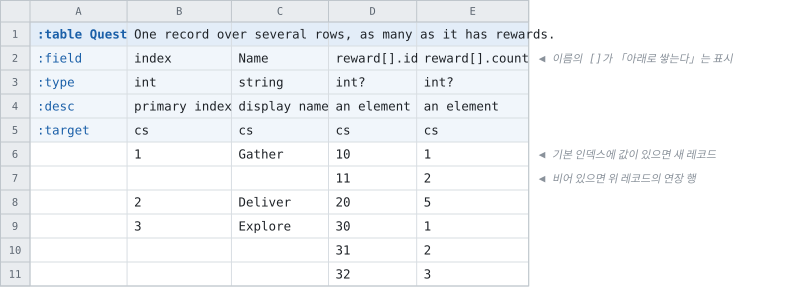

# 행으로 쌓는 배열

<!-- 이 파일은 `doc/figures/showcase.py` 가 생성합니다. 손으로 고치지 마십시오 - 다음 실행이 덮어씁니다. -->

> [시트가 코드가 되는 모습으로](../generated-code.md)

---

원소 수가 행마다 크게 다르면 컬럼을 최대치만큼 늘어놓는 것이 힘듭니다.
**그때는 아래로 쌓습니다.**

이름에 `[]` 를 적으면 그 그룹의 원소는 **옆 컬럼이 아니라 아래 행**에서
옵니다.

- **새 레코드의 시작은 기본 인덱스 칸에 값이 있는 행**입니다
- 그 칸이 빈 행은 **직전 레코드의 연장 행**이고, 거기서 값을 담는 것은 `[]` 컬럼뿐입니다
- **완전히 빈 행은 엔티티를 끝냅니다** — 레코드 사이에 빈 행을 둘 수 없습니다

<!-- tabbit:pair -->



<!-- tabbit:tabs lang -->
<details data-lang="csharp" open>
<summary>C#</summary>

```csharp
[System.Serializable]
public partial class QuestRecord
{
    #region Values
    /// <summary>
    /// primary index
    /// </summary>
    public int Index => _index;

    /// <summary>
    /// display name
    /// </summary>
    public string Name => _name;

    /// <summary>
    /// an element
    /// </summary>
    public RewardEntry[] Reward => _reward;
    #endregion

    /// <summary>One element of <see cref="Reward"/>.</summary>
    [System.Serializable]
    public struct RewardEntry
    {
        /// an element
        public int Id;
        /// an element
        public int Count;

        public override string ToString()
        {
            var sb = new StringBuilder("{");
            sb.Append("\"Id\":"); ToStringHelper.ToString(Id, sb);
            sb.Append(",\"Count\":"); ToStringHelper.ToString(Count, sb);
            sb.Append("}");
            return sb.ToString();
        }
    }

    #region Storage
    internal int _index;
    internal string _name = "";
    internal RewardEntry[] _reward = System.Array.Empty<RewardEntry>();
    #endregion

    #region ToString
    public override string ToString()
    {
        var sb = new StringBuilder("{");
        sb.Append("\"Index\":"); ToStringHelper.ToString(Index, sb);
        sb.Append(",\"Name\":"); ToStringHelper.ToString(Name, sb);
        sb.Append(",\"Reward\":"); ToStringHelper.ToString(Reward, sb);
        sb.Append("}");
        return sb.ToString();
    }
    #endregion
}
```

[QuestTable.cs](../../test/fixtures/golden/doc-showcase/csharp/tables/QuestTable.cs)

</details>
<details data-lang="typescript">
<summary>TypeScript</summary>

```typescript
// Generated from test/fixtures/xlsx/doc-showcase/doc-showcase.xlsx : Quest : B2
/** One record over several rows, as many as it has rewards. */
export class QuestRecord {
  /** Default constructor */
  constructor() {
  }

  /** primary index */
  public get index(): number { return this._index }

  /** display name */
  public get name(): string { return this._name }

  /** an element */
  public get reward(): RewardEntry[] { return this._reward }

  public _index: number = 0
  public _name: string = ''
  public _reward: RewardEntry[] = []

  /** Populate field values. */
  public populateFieldValues(dataRow: IDataRow): void {
    this._index = dataRow.index
    this._name = dataRow.name
    this._reward = dataRow.reward.map(e => ({ id: e.id, count: e.count }))
  }

  /** Populate field values. */
  public populateFieldValuesCompact(dataRow: any[]): void {
    let offset = 0
    this._index = dataRow[offset++]
    this._name = dataRow[offset++]
    const _reward_id = dataRow[offset++] as any[]
    const _reward_count = dataRow[offset++] as any[]
    this._reward = Array.from({ length: _reward_id.length }, (_, k) => ({ id: _reward_id[k], count: _reward_count[k] }))
  }
}
```

[quest.ts](../../test/fixtures/golden/doc-showcase/typescript/tables/quest.ts)

</details>
<details data-lang="cpp">
<summary>C++</summary>

```cpp
/// One record over several rows, as many as it has rewards.
struct QuestRecord {
  /// primary index
  std::int32_t index = 0;
  /// display name
  std::string name;
  /// an element
  std::vector<QuestRecord_reward_entry> reward;
};
```

[DocShowcaseAccessor_quest.h](../../test/fixtures/golden/doc-showcase/cpp/tables/DocShowcaseAccessor_quest.h)

</details>
<details data-lang="python">
<summary>Python</summary>

```python
class QuestRecord:
    """Generated from test/fixtures/xlsx/doc-showcase/doc-showcase.xlsx : Quest : B2.

    One record over several rows, as many as it has rewards.
    """

    __slots__ = ("index", "name", "reward")

    def __init__(self):
        self.index = 0
        self.name = ""
        self.reward = []

    def __repr__(self):
        return "QuestRecord(index=%r, name=%r, reward=%r)" % (self.index, self.name, self.reward)
```

[quest_table.py](../../test/fixtures/golden/doc-showcase/python/doc_showcase_data/quest_table.py)

</details>
<details data-lang="c">
<summary>C</summary>

```c
struct DocShowcase_QuestRecord_t {
  /* primary index */
  int32_t index;
  /* display name */
  const char* name;
  /* an element */
  struct DocShowcase_QuestRecord_t_reward_entry* reward;
  int32_t reward_count;
};
```

[DocShowcase_Quest.h](../../test/fixtures/golden/doc-showcase/c/tables/DocShowcase_Quest.h)

</details>
<details data-lang="dart">
<summary>Dart</summary>

```dart
// Generated from test/fixtures/xlsx/doc-showcase/doc-showcase.xlsx : Quest : B2
/// One record over several rows, as many as it has rewards.
class QuestRecord {
  /// primary index
  int index = 0;
  /// display name
  String name = '';
  /// an element
  List<QuestRewardEntry> reward = [];

}
```

[quest_table.dart](../../test/fixtures/golden/doc-showcase/dart/tables/quest_table.dart)

</details>
<details data-lang="go">
<summary>Go</summary>

```go
// QuestRecord was generated from test/fixtures/xlsx/doc-showcase/doc-showcase.xlsx : Quest : B2.
// One record over several rows, as many as it has rewards.
type QuestRecord struct {
	// primary index
	Index int32
	// display name
	Name string
	// an element
	Reward []QuestRewardEntry
}
```

[quest_table.go](../../test/fixtures/golden/doc-showcase/go/quest_table.go)

</details>
<details data-lang="java">
<summary>Java</summary>

```java
// Generated from test/fixtures/xlsx/doc-showcase/doc-showcase.xlsx : Quest : B2
/** One record over several rows, as many as it has rewards. */
public final class QuestRecord {
    /** primary index */
    public int index;
    /** display name */
    public String name = "";
    /** an element */
    public RewardEntry[] reward = new RewardEntry[0];

    /** One element of reward. */
    public static final class RewardEntry {
        /** an element */
        public int id;
        /** an element */
        public int count;
    }

}
```

[QuestRecord.java](../../test/fixtures/golden/doc-showcase/java/tabbit/fixtures/docshowcase/QuestRecord.java)

</details>
<details data-lang="kotlin">
<summary>Kotlin</summary>

```kotlin
// Generated from test/fixtures/xlsx/doc-showcase/doc-showcase.xlsx : Quest : B2
/** One record over several rows, as many as it has rewards. */
class QuestRecord {
    /** primary index */
    var index: Int = 0
    /** display name */
    var name: String = ""
    /** an element */
    var reward: MutableList<RewardEntry> = ArrayList()

    /** One element of reward. */
    class RewardEntry {
        /** an element */
        var id: Int = 0
        /** an element */
        var count: Int = 0
    }

}
```

[QuestTable.kt](../../test/fixtures/golden/doc-showcase/kotlin/tabbit/fixtures/docshowcase/tables/QuestTable.kt)

</details>
<details data-lang="lua">
<summary>Lua</summary>

```lua
-- Generated from test/fixtures/xlsx/doc-showcase/doc-showcase.xlsx : Quest : B2.
-- One record over several rows, as many as it has rewards.
---@class QuestRecord
---@field index integer
---@field name string
---@field reward QuestRewardEntry[]
local QuestRecordMeta = tcb.strictType("a `Quest` row", { "index", "name", "reward" })
```

[quest_table.lua](../../test/fixtures/golden/doc-showcase/lua/tables/quest_table.lua)

</details>
<details data-lang="php">
<summary>PHP</summary>

```php
/**
 * Generated from test/fixtures/xlsx/doc-showcase/doc-showcase.xlsx : Quest : B2
 *
 * One record over several rows, as many as it has rewards.
 */
final class QuestRecord
{
    /** primary index */
    public int $index = 0;
    /** display name */
    public string $name = '';
    /** an element */
    /** @var list<QuestRewardEntry> */
    public array $reward = [];


    /**
     * A row with its record groups built.
     *
     * They cannot be built at the declaration: a PHP property initializer has to be a
     * constant expression, and `new SlotEntry()` is not one.
     */
    public function __construct()
    {
    }
}
```

[QuestTable.php](../../test/fixtures/golden/doc-showcase/php/tables/QuestTable.php)

</details>
<details data-lang="ruby">
<summary>Ruby</summary>

```ruby
# Generated from test/fixtures/xlsx/doc-showcase/doc-showcase.xlsx : Quest : B2
# One record over several rows, as many as it has rewards.
class QuestRecord
  attr_accessor :index, :name, :reward

  def initialize
    @index = 0
    @name = ''
    @reward = []
  end
```

[quest_table.rb](../../test/fixtures/golden/doc-showcase/ruby/tables/quest_table.rb)

</details>
<details data-lang="rust">
<summary>Rust</summary>

```rust
// Generated from test/fixtures/xlsx/doc-showcase/doc-showcase.xlsx : Quest : B2
/// One record over several rows, as many as it has rewards.
#[derive(Clone, Debug, Default)]
pub struct QuestRecord {
    /// primary index
    pub index: i32,
    /// display name
    pub name: String,
    /// an element
    pub reward: Vec<QuestRewardEntry>,
}
```

[quest_table.rs](../../test/fixtures/golden/doc-showcase/rust/src/quest_table.rs)

</details>
<details data-lang="swift">
<summary>Swift</summary>

```swift
// Generated from test/fixtures/xlsx/doc-showcase/doc-showcase.xlsx : Quest : B2
/// One record over several rows, as many as it has rewards.
public final class QuestRecord {

    public init() {}

    /// primary index
    public var index: Int32 = 0

    /// display name
    public var name: String = ""

    /// an element
    public var reward: [RewardEntry] = []

    /// One element of reward.
    public struct RewardEntry {

        public init() {}

        /// an element
        public var id: Int32 = 0

        /// an element
        public var count: Int32 = 0
    }
}
```

[QuestTable.swift](../../test/fixtures/golden/doc-showcase/swift/tables/QuestTable.swift)

</details>
<details data-lang="unreal">
<summary>Unreal</summary>

```cpp
/** One record over several rows, as many as it has rewards. */
USTRUCT(BlueprintType)
struct DOCSHOWCASE_API FQuestRow
{
    GENERATED_BODY()

    /** primary index */
    UPROPERTY(EditAnywhere, BlueprintReadOnly, Category = "Quest")
    int32 Index = 0;

    /** display name */
    UPROPERTY(EditAnywhere, BlueprintReadOnly, Category = "Quest")
    FString Name;

    /** an element */
    UPROPERTY(EditAnywhere, BlueprintReadOnly, Category = "Quest")
    TArray<FQuestRewardEntry> Reward;

};
```

[FDocShowcase.h](../../test/fixtures/golden/doc-showcase/unreal/Source/DocShowcase/Public/FDocShowcase.h)

</details>
<!-- /tabbit:tabs -->

<!-- /tabbit:pair -->

**생성된 코드는 컬럼으로 적었을 때와 같습니다.** 배열 하나이고, 길이는
그 레코드가 실제로 가진 만큼입니다 — 시트에서 아래로 쌓았다는 사실은 코드에 남지 않습니다.

파일도 같습니다. 같은 데이터를 컬럼으로 적은 시트와 행으로 적은 시트가 **바이트 단위로 같은
파일**을 만듭니다.
