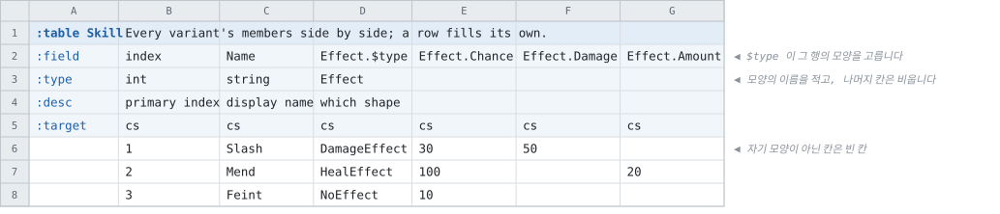

# 행마다 모양이 다른 묶음

<!-- 이 파일은 `doc/figures/showcase.py` 가 생성합니다. 손으로 고치지 마십시오 - 다음 실행이 덮어씁니다. -->

> [시트가 코드가 되는 모습으로](../generated-code.md)

---

「보상은 아이템이거나 화폐이거나 몬스터이다」 같은 데이터입니다. 컬럼 묶음
하나가 **행마다 다른 모양**을 가집니다.

모양의 목록은 시트가 아니라 **선언 파일**에 적습니다.

선언 파일이 먼저입니다. `abstract struct` 가 공통이고, `extends` 가
변형이며, `@1` 같은 번호가 그 변형을 파일에서 가리킵니다.

```
// The declarations the `doc-showcase` workbook's `Skill` table leaves its type cells empty for.
//
// Small on purpose: this file is shown in the documentation beside the sheet that uses it, so
// it has to be readable whole. What it has to carry is the shape - an abstract struct, two
// variants with members of their own, and one with none.

/// Something a skill does to whoever it lands on.
///
/// Abstract: a row says which kind it is in its `$type` cell, and the columns of the group are
/// every variant's members side by side.
abstract struct Effect
    /// How likely it is to land, in percent. Every variant carries it, so it is one column
    /// and every row fills it.
    field chance int (min=0, max=100)

/// Takes health away.
struct DamageEffect extends Effect @1
    /// How much it takes.
    field damage int

/// Gives health back.
struct HealEffect extends Effect @2
    /// How much it gives.
    field amount int

/// Does nothing, and carries no members of its own.
///
/// Here because a variant with no members has to work: what is left is the name, and the
/// discriminator is the whole of what the row carries.
struct NoEffect extends Effect @3
```

[effect.tbs](../../test/fixtures/schemas/doc-showcase/effect.tbs)

시트에는 **모든 변형의 멤버를 나란히** 둡니다. `$type` 칸이 그 행이 어느
모양인지 정하고, **그 행의 모양이 아닌 칸은 빈 칸**입니다 — `-` 가 아닙니다. 없는 값이 아니라
그 변형이 가지지 않은 멤버이기 때문입니다.



<!-- tabbit:tabs lang -->
<details data-lang="csharp" open>
<summary>C#</summary>

```csharp
[System.Serializable]
public partial class SkillRecord
{
    #region Values
    /// <summary>
    /// primary index
    /// </summary>
    public int Index => _index;

    /// <summary>
    /// display name
    /// </summary>
    public string Name => _name;

    /// <summary>
    /// which shape
    /// </summary>
    public Effect Effect
        => _effect_value ?? (_effect_value = BuildEffect());

    private Effect _effect_value;

    private Effect BuildEffect()
    {
        switch (_effect.Type)
        {
            case 1:
                return new DamageEffect
                {
                    Chance = _effect.Chance,
                    Damage = _effect.Damage,
                };
            case 2:
                return new HealEffect
                {
                    Chance = _effect.Chance,
                    Amount = _effect.Amount,
                };
            case 3:
                return new NoEffect
                {
                    Chance = _effect.Chance,
                };
        }

        // A number no variant claims. The conversion refuses one, so reaching this
        // means the file was written by a build that had a variant this code does not
        // - the same shape as a column added after this code was generated.
        return null;
    }
    #endregion

    /// <summary>One element of <see cref="Effect"/>.</summary>
    [System.Serializable]
    public struct EffectEntry
    {
        /// which shape
        public int Type;
        /// How likely it is to land, in percent. Every variant carries it, so it is one column
        /// and every row fills it.
        public int Chance;
        /// How much it takes.
        public int Damage;
        /// How much it gives.
        public int Amount;

        public override string ToString()
        {
            var sb = new StringBuilder("{");
            sb.Append("\"Type\":"); ToStringHelper.ToString(Type, sb);
            sb.Append(",\"Chance\":"); ToStringHelper.ToString(Chance, sb);
            sb.Append(",\"Damage\":"); ToStringHelper.ToString(Damage, sb);
            sb.Append(",\"Amount\":"); ToStringHelper.ToString(Amount, sb);
            sb.Append("}");
            return sb.ToString();
        }
    }

    #region Storage
    internal int _index;
    internal string _name = "";
    internal EffectEntry _effect;
    #endregion

    #region ToString
    public override string ToString()
    {
        var sb = new StringBuilder("{");
        sb.Append("\"Index\":"); ToStringHelper.ToString(Index, sb);
        sb.Append(",\"Name\":"); ToStringHelper.ToString(Name, sb);
        sb.Append(",\"Effect\":"); ToStringHelper.ToString(Effect, sb);
        sb.Append("}");
        return sb.ToString();
    }
    #endregion
}
```

[SkillTable.cs](../../test/fixtures/golden/doc-showcase/csharp/tables/SkillTable.cs)

</details>
<details data-lang="typescript">
<summary>TypeScript</summary>

```typescript
// Generated from test/fixtures/xlsx/doc-showcase/doc-showcase.xlsx : Skill : B2
/** Every variant's members side by side; a row fills its own. */
export class SkillRecord {
  /** Default constructor */
  constructor() {
  }

  /** primary index */
  public get index(): number { return this._index }

  /** display name */
  public get name(): string { return this._name }

  /** which shape */
  public get effect(): Effect {
    return this._effect_value ?? (this._effect_value = buildEffect(this._effect))
  }

  private _effect_value: Effect | null = null

  public _index: number = 0
  public _name: string = ''
  public _effect: EffectEntry = { type: 0, chance: 0, damage: 0, amount: 0 }

  /** Populate field values. */
  public populateFieldValues(dataRow: IDataRow): void {
    this._index = dataRow.index
    this._name = dataRow.name
    this._effect = ((e: any) => ({ type: e.type, chance: e.chance, damage: e.damage, amount: e.amount }))(dataRow.effect)
  }

  /** Populate field values. */
  public populateFieldValuesCompact(dataRow: any[]): void {
    let offset = 0
    this._index = dataRow[offset++]
    this._name = dataRow[offset++]
    this._effect = { type: dataRow[offset++], chance: dataRow[offset++], damage: dataRow[offset++], amount: dataRow[offset++] }
  }
}
```

[skill.ts](../../test/fixtures/golden/doc-showcase/typescript/tables/skill.ts)

</details>
<details data-lang="cpp">
<summary>C++</summary>

```cpp
/// Every variant's members side by side; a row fills its own.
struct SkillRecord {
  /// primary index
  std::int32_t index = 0;
  /// display name
  std::string name;
  /// which shape
  SkillRecord_effect_entry effect;


  /// What this row's Effect is. Narrow it with `dynamic_cast`.
  std::unique_ptr<Effect> effect_of() const {
    return effect_element(effect);
  }

  /// Builds one value from the entry the read filled.
  static std::unique_ptr<Effect> effect_element(
      const SkillRecord_effect_entry& entry) {
    switch (entry.type) {
      case 1: {
        auto built = std::make_unique<DamageEffect>();
        built->chance = entry.chance;
        built->damage = entry.damage;
        return built;
      }
      case 2: {
        auto built = std::make_unique<HealEffect>();
        built->chance = entry.chance;
        built->amount = entry.amount;
        return built;
      }
      case 3: {
        auto built = std::make_unique<NoEffect>();
        built->chance = entry.chance;
        return built;
      }
    }

    throw std::runtime_error(
        "Effect: no variant is numbered "
        + std::to_string(entry.type));
  }
};
```

[DocShowcaseAccessor_skill.h](../../test/fixtures/golden/doc-showcase/cpp/tables/DocShowcaseAccessor_skill.h)

</details>
<details data-lang="python">
<summary>Python</summary>

```python
class SkillRecord:
    """Generated from test/fixtures/xlsx/doc-showcase/doc-showcase.xlsx : Skill : B2.

    Every variant's members side by side; a row fills its own.
    """

    __slots__ = ("index", "name", "effect", "_effect_value")

    def __init__(self):
        self.index = 0
        self.name = ""
        self.effect = SkillEffectEntry()


    def effect_of(self):
        """What this row's Effect is. Narrow it with ``isinstance``."""
        built = getattr(self, "_effect_value", None)
        if built is not None:
            return built

        built = self._effect_element(self.effect)

        self._effect_value = built
        return built

    def _effect_element(self, entry):
        """Builds one value from the entry the read filled."""
        if entry.type_ == 1:
            built = DamageEffect()
            built.chance = entry.chance
            built.damage = entry.damage
        elif entry.type_ == 2:
            built = HealEffect()
            built.chance = entry.chance
            built.amount = entry.amount
        elif entry.type_ == 3:
            built = NoEffect()
            built.chance = entry.chance
        else:
            raise ValueError(
                "Effect: no variant is numbered %r"
                % (entry.type_,))

        return built

    def __repr__(self):
        return "SkillRecord(index=%r, name=%r, effect=%r)" % (self.index, self.name, self.effect)
```

[skill_table.py](../../test/fixtures/golden/doc-showcase/python/doc_showcase_data/skill_table.py)

</details>
<details data-lang="c">
<summary>C</summary>

```c
struct DocShowcase_SkillRecord_t {
  /* primary index */
  int32_t index;
  /* display name */
  const char* name;
  /* which shape */
  struct DocShowcase_SkillRecord_t_effect_entry effect;
};
```

[DocShowcase_Skill.h](../../test/fixtures/golden/doc-showcase/c/tables/DocShowcase_Skill.h)

</details>
<details data-lang="dart">
<summary>Dart</summary>

```dart
// Generated from test/fixtures/xlsx/doc-showcase/doc-showcase.xlsx : Skill : B2
/// Every variant's members side by side; a row fills its own.
class SkillRecord {
  /// primary index
  int index = 0;
  /// display name
  String name = '';
  /// which shape
  SkillEffectEntry effect = SkillEffectEntry();


  Effect? _effectValue;

  /// What this row's [Effect] is. `switch` over it is exhaustive.
  Effect get effectOf {
    final cached = _effectValue;
    if (cached != null) return cached;

    final built = _effectElement(effect);

    _effectValue = built;
    return built;
  }

  /// Builds one value from the entry the read filled.
  static Effect _effectElement(
      SkillEffectEntry entry) {
    final built = switch (entry.type) {
      1 => DamageEffect(
        chance: entry.chance,
        damage: entry.damage,
      ),
      2 => HealEffect(
        chance: entry.chance,
        amount: entry.amount,
      ),
      3 => NoEffect(
        chance: entry.chance,
      ),
      _ => throw StateError(
          'Effect: no variant is numbered ${ entry.type }'),
    };

    return built;
  }

}
```

[skill_table.dart](../../test/fixtures/golden/doc-showcase/dart/tables/skill_table.dart)

</details>
<details data-lang="go">
<summary>Go</summary>

```go
// SkillRecord was generated from test/fixtures/xlsx/doc-showcase/doc-showcase.xlsx : Skill : B2.
// Every variant's members side by side; a row fills its own.
type SkillRecord struct {
	// primary index
	Index int32
	// display name
	Name string
	// which shape
	effect SkillEffectEntry
}
```

[skill_table.go](../../test/fixtures/golden/doc-showcase/go/skill_table.go)

</details>
<details data-lang="java">
<summary>Java</summary>

```java
// Generated from test/fixtures/xlsx/doc-showcase/doc-showcase.xlsx : Skill : B2
/** Every variant's members side by side; a row fills its own. */
public final class SkillRecord {
    /** primary index */
    public int index;
    /** display name */
    public String name = "";
    /** which shape */
    public EffectEntry effect = new EffectEntry();

    /** One element of effect. */
    public static final class EffectEntry {
        /** which shape */
        public int type;
        /** How likely it is to land, in percent. Every variant carries it, so it is one column */
        /** and every row fills it. */
        public int chance;
        /** How much it takes. */
        public int damage;
        /** How much it gives. */
        public int amount;
    }


    private Effect effectValue;

    /**
     * What this row's Effect is. Narrow it with {@code instanceof}.
     */
    public Effect effect() {
        if (effectValue == null) {
            effectValue = effectElement(effect);
        }

        return effectValue;
    }

    /** Builds one value from the entry the read filled. */
    private static Effect effectElement(
            EffectEntry entry) {
        switch (entry.type) {
            case 1: {
                Effect.DamageEffect built =
                    new Effect.DamageEffect();
                built.chance = entry.chance;
                built.damage = entry.damage;
                return built;
            }
            case 2: {
                Effect.HealEffect built =
                    new Effect.HealEffect();
                built.chance = entry.chance;
                built.amount = entry.amount;
                return built;
            }
            case 3: {
                Effect.NoEffect built =
                    new Effect.NoEffect();
                built.chance = entry.chance;
                return built;
            }
        }

        throw new IllegalStateException(
            "Effect: no variant is numbered " + entry.type);
    }
}
```

[SkillRecord.java](../../test/fixtures/golden/doc-showcase/java/tabbit/fixtures/docshowcase/SkillRecord.java)

</details>
<details data-lang="kotlin">
<summary>Kotlin</summary>

```kotlin
// Generated from test/fixtures/xlsx/doc-showcase/doc-showcase.xlsx : Skill : B2
/** Every variant's members side by side; a row fills its own. */
class SkillRecord {
    /** primary index */
    var index: Int = 0
    /** display name */
    var name: String = ""
    /** which shape */
    var effect: EffectEntry = EffectEntry()


    private var effectValue: Effect? = null

    /** What this row's Effect is. `when` over it is exhaustive. */
    val effectOf: Effect
        get() {
            effectValue?.let { return it }

            val built = effectElement(effect)

            effectValue = built
            return built
        }

    /** Builds one value from the entry the read filled. */
    private fun effectElement(entry: EffectEntry): Effect {
            val built = when (entry.type) {
                1 -> DamageEffect(
                    entry.chance,
                    entry.damage,
                )
                2 -> HealEffect(
                    entry.chance,
                    entry.amount,
                )
                3 -> NoEffect(
                    entry.chance,
                )
                else -> throw TcbException(
                    "Effect: no variant is numbered ${ entry.type }")
            }

            return built
    }

    /** One element of effect. */
    class EffectEntry {
        /** which shape */
        var type: Int = 0
        /** How likely it is to land, in percent. Every variant carries it, so it is one column */
        /** and every row fills it. */
        var chance: Int = 0
        /** How much it takes. */
        var damage: Int = 0
        /** How much it gives. */
        var amount: Int = 0
    }

}
```

[SkillTable.kt](../../test/fixtures/golden/doc-showcase/kotlin/tabbit/fixtures/docshowcase/tables/SkillTable.kt)

</details>
<details data-lang="lua">
<summary>Lua</summary>

```lua
-- Generated from test/fixtures/xlsx/doc-showcase/doc-showcase.xlsx : Skill : B2.
-- Every variant's members side by side; a row fills its own.
---@class SkillRecord
---@field index integer
---@field name string
---@field effect SkillEffectEntry
local SkillRecordMeta = tcb.strictType("a `Skill` row", { "index", "name", "effect" })
```

[skill_table.lua](../../test/fixtures/golden/doc-showcase/lua/tables/skill_table.lua)

</details>
<details data-lang="php">
<summary>PHP</summary>

```php
/**
 * Generated from test/fixtures/xlsx/doc-showcase/doc-showcase.xlsx : Skill : B2
 *
 * Every variant's members side by side; a row fills its own.
 */
final class SkillRecord
{
    /** primary index */
    public int $index = 0;
    /** display name */
    public string $name = '';
    /** which shape */
    public SkillEffectEntry $effect;


    private ?Effect $effectValue = null;

    /** What this row's Effect is. Narrow it with `instanceof`. */
    public function effectOf(): Effect
    {
        if ($this->effectValue === null) {
            $this->effectValue = self::effectElement($this->effect);
        }

        return $this->effectValue;
    }

    /** Builds one value from the entry the read filled. */
    private static function effectElement(
        SkillEffectEntry $entry): Effect
    {
        switch ($entry->type) {
            case 1:
                $built = new DamageEffect();
                $built->chance = $entry->chance;
                $built->damage = $entry->damage;
                return $built;
            case 2:
                $built = new HealEffect();
                $built->chance = $entry->chance;
                $built->amount = $entry->amount;
                return $built;
            case 3:
                $built = new NoEffect();
                $built->chance = $entry->chance;
                return $built;
        }

        throw new \RuntimeException(
            'Effect: no variant is numbered '
            . $entry->type);
    }


    /**
     * A row with its record groups built.
     *
     * They cannot be built at the declaration: a PHP property initializer has to be a
     * constant expression, and `new SlotEntry()` is not one.
     */
    public function __construct()
    {
        $this->effect = new SkillEffectEntry();
    }
}
```

[SkillTable.php](../../test/fixtures/golden/doc-showcase/php/tables/SkillTable.php)

</details>
<details data-lang="ruby">
<summary>Ruby</summary>

```ruby
# Generated from test/fixtures/xlsx/doc-showcase/doc-showcase.xlsx : Skill : B2
# Every variant's members side by side; a row fills its own.
class SkillRecord
  attr_accessor :index, :name, :effect

  def initialize
    @index = 0
    @name = ''
    @effect = SkillEffectEntry.new


  # What this row's Effect is. Narrow it with +is_a?+.
  def effect_of
    built = @effect_value
    return built unless built.nil?

    built = effect_element(effect)

    @effect_value = built
    built
  end

  # Builds one value from the entry the read filled.
  def effect_element(entry)
    case entry.type
    when 1
      built = DamageEffect.new
      built.chance = entry.chance
      built.damage = entry.damage
    when 2
      built = HealEffect.new
      built.chance = entry.chance
      built.amount = entry.amount
    when 3
      built = NoEffect.new
      built.chance = entry.chance
    else
      raise TcbError,
            "Effect: no variant is numbered "               "#{ entry.type }"
    end

    built
  end
  end
```

[skill_table.rb](../../test/fixtures/golden/doc-showcase/ruby/tables/skill_table.rb)

</details>
<details data-lang="rust">
<summary>Rust</summary>

```rust
// Generated from test/fixtures/xlsx/doc-showcase/doc-showcase.xlsx : Skill : B2
/// Every variant's members side by side; a row fills its own.
#[derive(Clone, Debug, Default)]
pub struct SkillRecord {
    /// primary index
    pub index: i32,
    /// display name
    pub name: String,
    /// which shape
    pub effect: SkillEffectEntry,
}
```

[skill_table.rs](../../test/fixtures/golden/doc-showcase/rust/src/skill_table.rs)

</details>
<details data-lang="swift">
<summary>Swift</summary>

```swift
// Generated from test/fixtures/xlsx/doc-showcase/doc-showcase.xlsx : Skill : B2
/// Every variant's members side by side; a row fills its own.
public final class SkillRecord {

    public init() {}

    /// primary index
    public var index: Int32 = 0

    /// display name
    public var name: String = ""

    /// which shape
    public var effect: EffectEntry = EffectEntry()


    private var effectValue: Effect?

    /// What this row's Effect is. `switch` over it is exhaustive.
    public var effectOf: Effect {
        get {
            if let built = effectValue { return built }

            let built = Self.effectElement(effect)

            effectValue = built
            return built
        }
    }

    /// Builds one value from the entry the read filled.
    private static func effectElement(
        _ entry: EffectEntry
    ) -> Effect {
            let built: Effect
            switch entry.type {
            case 1:
                built = .damageEffect(DamageEffect(
                    chance: entry.chance,
                    damage: entry.damage,
                ))
            case 2:
                built = .healEffect(HealEffect(
                    chance: entry.chance,
                    amount: entry.amount,
                ))
            case 3:
                built = .noEffect(NoEffect(
                    chance: entry.chance,
                ))
            default:
                fatalError(
                    "Effect: no variant is numbered \(entry.type)")
            }

            return built
    }

    /// One element of effect.
    public struct EffectEntry {

        public init() {}

        /// which shape
        public var type: Int32 = 0

        /// How likely it is to land, in percent. Every variant carries it, so it is one column
        /// and every row fills it.
        public var chance: Int32 = 0

        /// How much it takes.
        public var damage: Int32 = 0

        /// How much it gives.
        public var amount: Int32 = 0
    }
}
```

[SkillTable.swift](../../test/fixtures/golden/doc-showcase/swift/tables/SkillTable.swift)

</details>
<details data-lang="unreal">
<summary>Unreal</summary>

```cpp
/** Every variant's members side by side; a row fills its own. */
USTRUCT(BlueprintType)
struct DOCSHOWCASE_API FSkillRow
{
    GENERATED_BODY()

    /** primary index */
    UPROPERTY(EditAnywhere, BlueprintReadOnly, Category = "Skill")
    int32 Index = 0;

    /** display name */
    UPROPERTY(EditAnywhere, BlueprintReadOnly, Category = "Skill")
    FString Name;

    /** which shape */
    UPROPERTY(EditAnywhere, BlueprintReadOnly, Category = "Skill")
    FSkillEffectEntry Effect;

};
```

[FDocShowcase.h](../../test/fixtures/golden/doc-showcase/unreal/Source/DocShowcase/Public/FDocShowcase.h)

</details>
<!-- /tabbit:tabs -->

**생성된 코드는 변형마다 타입 하나를 냅니다.** 어느 모양인지 확인하는 방법과
그 모양으로 받는 방법이 함께 나오고, 그 방법은 언어마다 다릅니다 — 상속이 있는 언어는 상속으로,
합 타입이 있는 언어는 그것으로 냅니다.

파일은 움직이지 않았습니다. 모든 변형의 멤버가 컬럼으로 있고 각 행이 자기 것만 채우는 것은
이미 있던 저장 방식이므로, **이 기능이 형식에 더한 것은 없습니다.**
