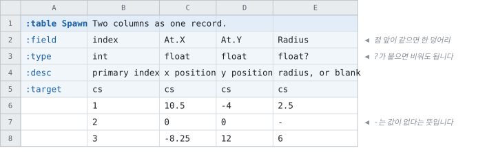
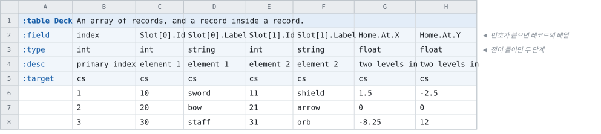

# 컬럼 묶음과 빈 칸

<!-- 이 파일은 `doc/figures/showcase.py` 가 생성합니다. 손으로 고치지 마십시오 - 다음 실행이 덮어씁니다. -->

> [시트가 코드가 되는 모습으로](../generated-code.md)

---

`At.X` · `At.Y` 처럼 **점 앞이 같은 컬럼들은 한 레코드**가 됩니다. 시트에서는
여전히 컬럼 여럿이고, 코드에서는 멤버를 가진 타입 하나입니다.

레코드 하나와, 비워도 되는 값 하나입니다. 타입 뒤의 `?` 가 그 칸을
비워도 된다는 뜻이고, 비우는 방법은 `-` 입니다.

<!-- tabbit:pair -->



<!-- tabbit:tabs lang -->
<details data-lang="csharp" open>
<summary>C#</summary>

```csharp
[System.Serializable]
public partial class SpawnRecord
{
    #region Values
    /// <summary>
    /// primary index
    /// </summary>
    public int Index => _index;

    /// <summary>
    /// x position
    /// </summary>
    public AtEntry At => _at;

    /// <summary>
    /// radius, or blank
    /// </summary>
    public float Radius => _radius;
    /// <summary>Whether this row has a value for <see cref="Radius"/>.</summary>
    public bool HasRadius => _radiusHasValue;
    #endregion

    /// <summary>One element of <see cref="At"/>.</summary>
    [System.Serializable]
    public struct AtEntry
    {
        /// x position
        public float X;
        /// y position
        public float Y;

        public override string ToString()
        {
            var sb = new StringBuilder("{");
            sb.Append("\"X\":"); ToStringHelper.ToString(X, sb);
            sb.Append(",\"Y\":"); ToStringHelper.ToString(Y, sb);
            sb.Append("}");
            return sb.ToString();
        }
    }

    #region Storage
    internal int _index;
    internal AtEntry _at;
    internal float _radius;
    internal bool _radiusHasValue;
    #endregion

    #region ToString
    public override string ToString()
    {
        var sb = new StringBuilder("{");
        sb.Append("\"Index\":"); ToStringHelper.ToString(Index, sb);
        sb.Append(",\"At\":"); ToStringHelper.ToString(At, sb);
        sb.Append(",\"Radius\":"); ToStringHelper.ToString(Radius, sb);
        sb.Append("}");
        return sb.ToString();
    }
    #endregion
}
```

[SpawnTable.cs](../../test/fixtures/golden/doc-showcase/csharp/tables/SpawnTable.cs)

</details>
<details data-lang="typescript">
<summary>TypeScript</summary>

```typescript
// Generated from test/fixtures/xlsx/doc-showcase/doc-showcase.xlsx : Spawn : B2
/** Two columns as one record. */
export class SpawnRecord {
  /** Default constructor */
  constructor() {
  }

  /** primary index */
  public get index(): number { return this._index }

  /** x position */
  public get at(): AtEntry { return this._at }

  /** radius, or blank */
  public get radius(): number { return this._radius }
  /** Whether this row has a value for `radius`. */
  public get hasRadius(): boolean { return this._radiusHasValue }

  public _index: number = 0
  public _at: AtEntry = { x: 0, y: 0 }
  public _radius: number = 0
  public _radiusHasValue: boolean = false

  /** Populate field values. */
  public populateFieldValues(dataRow: IDataRow): void {
    this._index = dataRow.index
    this._at = ((e: any) => ({ x: Math.fround(e.x), y: Math.fround(e.y) }))(dataRow.at)
    this._radiusHasValue = dataRow.radius !== null && dataRow.radius !== undefined; if (this._radiusHasValue) this._radius = Math.fround(dataRow.radius)
  }

  /** Populate field values. */
  public populateFieldValuesCompact(dataRow: any[]): void {
    let offset = 0
    this._index = dataRow[offset++]
    this._at = { x: Math.fround(dataRow[offset++]), y: Math.fround(dataRow[offset++]) }
    const _radius_raw = dataRow[offset++]
    this._radiusHasValue = _radius_raw !== null && _radius_raw !== undefined
    if (this._radiusHasValue) this._radius = Math.fround(_radius_raw)
  }
}
```

[spawn.ts](../../test/fixtures/golden/doc-showcase/typescript/tables/spawn.ts)

</details>
<details data-lang="cpp">
<summary>C++</summary>

```cpp
/// Two columns as one record.
struct SpawnRecord {
  /// primary index
  std::int32_t index = 0;
  /// x position
  SpawnRecord_at_entry at;
  /// radius, or blank
  float radius = 0.0f;
  /// Whether this row has a value for `radius`.
  bool has_radius = false;
};
```

[DocShowcaseAccessor_spawn.h](../../test/fixtures/golden/doc-showcase/cpp/tables/DocShowcaseAccessor_spawn.h)

</details>
<details data-lang="python">
<summary>Python</summary>

```python
class SpawnRecord:
    """Generated from test/fixtures/xlsx/doc-showcase/doc-showcase.xlsx : Spawn : B2.

    Two columns as one record.
    """

    __slots__ = ("index", "at", "radius", "has_radius")

    def __init__(self):
        self.index = 0
        self.at = SpawnAtEntry()
        self.radius = 0.0
        self.has_radius = False

    def __repr__(self):
        return "SpawnRecord(index=%r, at=%r, radius=%r)" % (self.index, self.at, self.radius)
```

[spawn_table.py](../../test/fixtures/golden/doc-showcase/python/doc_showcase_data/spawn_table.py)

</details>
<details data-lang="c">
<summary>C</summary>

```c
struct DocShowcase_SpawnRecord_t {
  /* primary index */
  int32_t index;
  /* x position */
  struct DocShowcase_SpawnRecord_t_at_entry at;
  /* radius, or blank */
  float radius;
  /* Whether this row has a value for radius. The value member keeps its type and
   * holds the type's empty value when the row had none; this says which it was. */
  bool has_radius;
};
```

[DocShowcase_Spawn.h](../../test/fixtures/golden/doc-showcase/c/tables/DocShowcase_Spawn.h)

</details>
<details data-lang="dart">
<summary>Dart</summary>

```dart
// Generated from test/fixtures/xlsx/doc-showcase/doc-showcase.xlsx : Spawn : B2
/// Two columns as one record.
class SpawnRecord {
  /// primary index
  int index = 0;
  /// x position
  SpawnAtEntry at = SpawnAtEntry();
  /// radius, or blank
  double radius = 0.0;
  bool hasRadius = false;

}
```

[spawn_table.dart](../../test/fixtures/golden/doc-showcase/dart/tables/spawn_table.dart)

</details>
<details data-lang="go">
<summary>Go</summary>

```go
// SpawnRecord was generated from test/fixtures/xlsx/doc-showcase/doc-showcase.xlsx : Spawn : B2.
// Two columns as one record.
type SpawnRecord struct {
	// primary index
	Index int32
	// x position
	At SpawnAtEntry
	// radius, or blank
	Radius float32
	// Whether this row has a value for Radius. The value member keeps its type
	// and holds the type's empty value when the row had none; this says which it was.
	HasRadius bool
}
```

[spawn_table.go](../../test/fixtures/golden/doc-showcase/go/spawn_table.go)

</details>
<details data-lang="java">
<summary>Java</summary>

```java
// Generated from test/fixtures/xlsx/doc-showcase/doc-showcase.xlsx : Spawn : B2
/** Two columns as one record. */
public final class SpawnRecord {
    /** primary index */
    public int index;
    /** x position */
    public AtEntry at = new AtEntry();
    /** radius, or blank */
    public float radius;
    /**
     * Whether this row has a value for radius. The value field keeps its type and
     * holds the type's empty value when the row had none; this says which it was.
     */
    public boolean hasRadius;

    /** One element of at. */
    public static final class AtEntry {
        /** x position */
        public float x;
        /** y position */
        public float y;
    }

}
```

[SpawnRecord.java](../../test/fixtures/golden/doc-showcase/java/tabbit/fixtures/docshowcase/SpawnRecord.java)

</details>
<details data-lang="kotlin">
<summary>Kotlin</summary>

```kotlin
// Generated from test/fixtures/xlsx/doc-showcase/doc-showcase.xlsx : Spawn : B2
/** Two columns as one record. */
class SpawnRecord {
    /** primary index */
    var index: Int = 0
    /** x position */
    var at: AtEntry = AtEntry()
    /** radius, or blank */
    var radius: Float = 0.0f
    /**
     * Whether this row has a value for radius. The value property keeps its type
     * and holds the type's empty value when the row had none; this says which it was.
     */
    var hasRadius: Boolean = false

    /** One element of at. */
    class AtEntry {
        /** x position */
        var x: Float = 0.0f
        /** y position */
        var y: Float = 0.0f
    }

}
```

[SpawnTable.kt](../../test/fixtures/golden/doc-showcase/kotlin/tabbit/fixtures/docshowcase/tables/SpawnTable.kt)

</details>
<details data-lang="lua">
<summary>Lua</summary>

```lua
-- Generated from test/fixtures/xlsx/doc-showcase/doc-showcase.xlsx : Spawn : B2.
-- Two columns as one record.
---@class SpawnRecord
---@field index integer
---@field at SpawnAtEntry
---@field radius number
---@field hasRadius boolean
local SpawnRecordMeta = tcb.strictType("a `Spawn` row", { "index", "at", "radius", "hasRadius" })
```

[spawn_table.lua](../../test/fixtures/golden/doc-showcase/lua/tables/spawn_table.lua)

</details>
<details data-lang="php">
<summary>PHP</summary>

```php
/**
 * Generated from test/fixtures/xlsx/doc-showcase/doc-showcase.xlsx : Spawn : B2
 *
 * Two columns as one record.
 */
final class SpawnRecord
{
    /** primary index */
    public int $index = 0;
    /** x position */
    public SpawnAtEntry $at;
    /** radius, or blank */
    public float $radius = 0.0;

    public bool $hasRadius = false;


    /**
     * A row with its record groups built.
     *
     * They cannot be built at the declaration: a PHP property initializer has to be a
     * constant expression, and `new SlotEntry()` is not one.
     */
    public function __construct()
    {
        $this->at = new SpawnAtEntry();
    }
}
```

[SpawnTable.php](../../test/fixtures/golden/doc-showcase/php/tables/SpawnTable.php)

</details>
<details data-lang="ruby">
<summary>Ruby</summary>

```ruby
# Generated from test/fixtures/xlsx/doc-showcase/doc-showcase.xlsx : Spawn : B2
# Two columns as one record.
class SpawnRecord
  attr_accessor :index, :at, :radius, :has_radius

  def initialize
    @index = 0
    @at = SpawnAtEntry.new
    @radius = 0.0
    @has_radius = false
  end
```

[spawn_table.rb](../../test/fixtures/golden/doc-showcase/ruby/tables/spawn_table.rb)

</details>
<details data-lang="rust">
<summary>Rust</summary>

```rust
// Generated from test/fixtures/xlsx/doc-showcase/doc-showcase.xlsx : Spawn : B2
/// Two columns as one record.
#[derive(Clone, Debug, Default)]
pub struct SpawnRecord {
    /// primary index
    pub index: i32,
    /// x position
    pub at: SpawnAtEntry,
    /// radius, or blank
    pub radius: f32,
    /// Whether this row has a value for `radius`. The value member keeps its type
    /// and holds the type's empty value when the row had none; this says which it was.
    pub has_radius: bool,
}
```

[spawn_table.rs](../../test/fixtures/golden/doc-showcase/rust/src/spawn_table.rs)

</details>
<details data-lang="swift">
<summary>Swift</summary>

```swift
// Generated from test/fixtures/xlsx/doc-showcase/doc-showcase.xlsx : Spawn : B2
/// Two columns as one record.
public final class SpawnRecord {

    public init() {}

    /// primary index
    public var index: Int32 = 0

    /// x position
    public var at: AtEntry = AtEntry()

    /// radius, or blank
    public var radius: Float = 0
    /// Whether this row has a value for radius. The value property keeps its type
    /// and holds the type's empty value when the row had none; this says which it was.
    public var hasRadius: Bool = false

    /// One element of at.
    public struct AtEntry {

        public init() {}

        /// x position
        public var x: Float = 0

        /// y position
        public var y: Float = 0
    }
}
```

[SpawnTable.swift](../../test/fixtures/golden/doc-showcase/swift/tables/SpawnTable.swift)

</details>
<details data-lang="unreal">
<summary>Unreal</summary>

```cpp
/** Two columns as one record. */
USTRUCT(BlueprintType)
struct DOCSHOWCASE_API FSpawnRow
{
    GENERATED_BODY()

    /** primary index */
    UPROPERTY(EditAnywhere, BlueprintReadOnly, Category = "Spawn")
    int32 Index = 0;

    /** x position */
    UPROPERTY(EditAnywhere, BlueprintReadOnly, Category = "Spawn")
    FSpawnAtEntry At;

    /** radius, or blank */
    UPROPERTY(EditAnywhere, BlueprintReadOnly, Category = "Spawn")
    float Radius = 0.0f;

    /** Whether this row has a value for Radius. */
    UPROPERTY(EditAnywhere, BlueprintReadOnly, Category = "Spawn")
    bool bHasRadius = false;
};
```

[FDocShowcase.h](../../test/fixtures/golden/doc-showcase/unreal/Source/DocShowcase/Public/FDocShowcase.h)

</details>
<!-- /tabbit:tabs -->

<!-- /tabbit:pair -->

**중첩은 파일에 아무 값도 더하지 않습니다.** 레코드는 멤버마다 컬럼
하나로 저장되므로, `At.X` 와 `At.Y` 를 따로 적었을 때와 파일의 바이트가 같습니다. 달라지는
것은 코드를 읽는 쪽의 모습뿐입니다.

`?` 가 붙은 컬럼은 언어마다 그 언어의 「없음」으로 나옵니다 — 옵셔널 타입이 있는 언어는 그것을
쓰고, 없는 언어는 값이 있는지 확인하는 방법을 따로 냅니다.

---

레코드도 배열이 되고, 레코드 안에 레코드가 옵니다.

- `Slot[0].Id` · `Slot[1].Id` — 레코드의 배열
- `Home.At.X` — 레코드 안의 레코드



<!-- tabbit:tabs lang -->
<details data-lang="csharp" open>
<summary>C#</summary>

```csharp
[System.Serializable]
public partial class DeckRecord
{
    #region Values
    /// <summary>
    /// primary index
    /// </summary>
    public int Index => _index;

    /// <summary>
    /// element 1
    /// </summary>
    public SlotEntry[] Slot => _slot;

    /// <summary>
    /// two levels in
    /// </summary>
    public HomeEntry Home => _home;
    #endregion

    /// <summary>One element of <see cref="Slot"/>.</summary>
    [System.Serializable]
    public struct SlotEntry
    {
        /// element 1
        public int Id;
        /// element 1
        public string Label;

        public override string ToString()
        {
            var sb = new StringBuilder("{");
            sb.Append("\"Id\":"); ToStringHelper.ToString(Id, sb);
            sb.Append(",\"Label\":"); ToStringHelper.ToString(Label, sb);
            sb.Append("}");
            return sb.ToString();
        }
    }

    internal static SlotEntry[] NewSlotEntryArray(int length)
    {
        var result = new SlotEntry[length];
        for (int i = 0; i < result.Length; i++)
        {
            result[i].Label = "";
        }
        return result;
    }

    /// <summary>A record inside <see cref="Home"/>.</summary>
    [System.Serializable]
    public struct HomeAtEntry
    {
        /// two levels in
        public float X;
        /// two levels in
        public float Y;

        public override string ToString()
        {
            var sb = new StringBuilder("{");
            sb.Append("\"X\":"); ToStringHelper.ToString(X, sb);
            sb.Append(",\"Y\":"); ToStringHelper.ToString(Y, sb);
            sb.Append("}");
            return sb.ToString();
        }
    }
    /// <summary>One element of <see cref="Home"/>.</summary>
    [System.Serializable]
    public struct HomeEntry
    {
        /// two levels in
        public HomeAtEntry At;

        public override string ToString()
        {
            var sb = new StringBuilder("{");
            sb.Append("\"At\":"); ToStringHelper.ToString(At, sb);
            sb.Append("}");
            return sb.ToString();
        }
    }

    private static HomeEntry NewHomeEntry()
    {
        var result = default(HomeEntry);
        return result;
    }

    #region Storage
    internal int _index;
    internal SlotEntry[] _slot = System.Array.Empty<SlotEntry>();
    internal HomeEntry _home = NewHomeEntry();
    #endregion

    #region ToString
    public override string ToString()
    {
        var sb = new StringBuilder("{");
        sb.Append("\"Index\":"); ToStringHelper.ToString(Index, sb);
        sb.Append(",\"Slot\":"); ToStringHelper.ToString(Slot, sb);
        sb.Append(",\"Home\":"); ToStringHelper.ToString(Home, sb);
        sb.Append("}");
        return sb.ToString();
    }
    #endregion
}
```

[DeckTable.cs](../../test/fixtures/golden/doc-showcase/csharp/tables/DeckTable.cs)

</details>
<details data-lang="typescript">
<summary>TypeScript</summary>

```typescript
// Generated from test/fixtures/xlsx/doc-showcase/doc-showcase.xlsx : Spawn : G2
/** An array of records, and a record inside a record. */
export class DeckRecord {
  /** Default constructor */
  constructor() {
  }

  /** primary index */
  public get index(): number { return this._index }

  /** element 1 */
  public get slot(): SlotEntry[] { return this._slot }

  /** two levels in */
  public get home(): HomeEntry { return this._home }

  public _index: number = 0
  public _slot: SlotEntry[] = []
  public _home: HomeEntry = { at: { x: 0, y: 0 } }

  /** Populate field values. */
  public populateFieldValues(dataRow: IDataRow): void {
    this._index = dataRow.index
    this._slot = dataRow.slot.map(e => ({ id: e.id, label: e.label }))
    this._home = ((e: any) => ({ at: { x: Math.fround(e.at.x), y: Math.fround(e.at.y) } }))(dataRow.home)
  }

  /** Populate field values. */
  public populateFieldValuesCompact(dataRow: any[]): void {
    let offset = 0
    this._index = dataRow[offset++]
    const _slot_id = dataRow.slice(offset, offset + 2)
    offset += 2
    const _slot_label = dataRow.slice(offset, offset + 2)
    offset += 2
    this._slot = Array.from({ length: 2 }, (_, k) => ({ id: _slot_id[k], label: _slot_label[k] }))
    this._home = { at: { x: Math.fround(dataRow[offset++]), y: Math.fround(dataRow[offset++]) } }
  }
}
```

[deck.ts](../../test/fixtures/golden/doc-showcase/typescript/tables/deck.ts)

</details>
<details data-lang="cpp">
<summary>C++</summary>

```cpp
/// An array of records, and a record inside a record.
struct DeckRecord {
  /// primary index
  std::int32_t index = 0;
  /// element 1
  std::vector<DeckRecord_slot_entry> slot;
  /// two levels in
  DeckRecord_home_entry home;
};
```

[DocShowcaseAccessor_deck.h](../../test/fixtures/golden/doc-showcase/cpp/tables/DocShowcaseAccessor_deck.h)

</details>
<details data-lang="python">
<summary>Python</summary>

```python
class DeckRecord:
    """Generated from test/fixtures/xlsx/doc-showcase/doc-showcase.xlsx : Spawn : G2.

    An array of records, and a record inside a record.
    """

    __slots__ = ("index", "slot", "home")

    def __init__(self):
        self.index = 0
        self.slot = [DeckSlotEntry() for _ in range(2)]
        self.home = DeckHomeEntry()

    def __repr__(self):
        return "DeckRecord(index=%r, slot=%r, home=%r)" % (self.index, self.slot, self.home)
```

[deck_table.py](../../test/fixtures/golden/doc-showcase/python/doc_showcase_data/deck_table.py)

</details>
<details data-lang="c">
<summary>C</summary>

```c
struct DocShowcase_DeckRecord_t {
  /* primary index */
  int32_t index;
  /* element 1 */
  struct DocShowcase_DeckRecord_t_slot_entry* slot;
  int32_t slot_count;
  /* two levels in */
  struct DocShowcase_DeckRecord_t_home_entry home;
};
```

[DocShowcase_Deck.h](../../test/fixtures/golden/doc-showcase/c/tables/DocShowcase_Deck.h)

</details>
<details data-lang="dart">
<summary>Dart</summary>

```dart
// Generated from test/fixtures/xlsx/doc-showcase/doc-showcase.xlsx : Spawn : G2
/// An array of records, and a record inside a record.
class DeckRecord {
  /// primary index
  int index = 0;
  /// element 1
  List<DeckSlotEntry> slot = List.generate(2, (_) => DeckSlotEntry());
  /// two levels in
  DeckHomeEntry home = DeckHomeEntry();

}
```

[deck_table.dart](../../test/fixtures/golden/doc-showcase/dart/tables/deck_table.dart)

</details>
<details data-lang="go">
<summary>Go</summary>

```go
// DeckRecord was generated from test/fixtures/xlsx/doc-showcase/doc-showcase.xlsx : Spawn : G2.
// An array of records, and a record inside a record.
type DeckRecord struct {
	// primary index
	Index int32
	// element 1
	Slot []DeckSlotEntry
	// two levels in
	Home DeckHomeEntry
}
```

[deck_table.go](../../test/fixtures/golden/doc-showcase/go/deck_table.go)

</details>
<details data-lang="java">
<summary>Java</summary>

```java
// Generated from test/fixtures/xlsx/doc-showcase/doc-showcase.xlsx : Spawn : G2
/** An array of records, and a record inside a record. */
public final class DeckRecord {
    /** primary index */
    public int index;
    /** element 1 */
    public SlotEntry[] slot = newSlotEntryArray(2);
    /** two levels in */
    public HomeEntry home = new HomeEntry();

    /** One element of slot. */
    public static final class SlotEntry {
        /** element 1 */
        public int id;
        /** element 1 */
        public String label = "";
    }

    /**
     * A SlotEntry array with its elements constructed.
     *
     * Java fills an array of objects with nulls, and the length here is the sheet's column
     * count - known at generation - so the row can arrive with the elements already there
     * and each member column simply assigns into them.
     */
    private static SlotEntry[] newSlotEntryArray(int length) {
        SlotEntry[] array = new SlotEntry[length];

        for (int i = 0; i < length; i++) {
            array[i] = new SlotEntry();
        }

        return array;
    }

    /** A record inside home. */
    public static final class HomeEntryAt {
        /** two levels in */
        public float x;
        /** two levels in */
        public float y;
    }
    /** One element of home. */
    public static final class HomeEntry {
        /** two levels in */
        public HomeEntryAt at = new HomeEntryAt();
    }

}
```

[DeckRecord.java](../../test/fixtures/golden/doc-showcase/java/tabbit/fixtures/docshowcase/DeckRecord.java)

</details>
<details data-lang="kotlin">
<summary>Kotlin</summary>

```kotlin
// Generated from test/fixtures/xlsx/doc-showcase/doc-showcase.xlsx : Spawn : G2
/** An array of records, and a record inside a record. */
class DeckRecord {
    /** primary index */
    var index: Int = 0
    /** element 1 */
    var slot: MutableList<SlotEntry> = MutableList(2) { SlotEntry() }
    /** two levels in */
    var home: HomeEntry = HomeEntry()

    /** One element of slot. */
    class SlotEntry {
        /** element 1 */
        var id: Int = 0
        /** element 1 */
        var label: String = ""
    }

    /** A record inside home. */
    class HomeEntryAt {
        /** two levels in */
        var x: Float = 0.0f
        /** two levels in */
        var y: Float = 0.0f
    }
    /** One element of home. */
    class HomeEntry {
        /** two levels in */
        var at: HomeEntryAt = HomeEntryAt()
    }

}
```

[DeckTable.kt](../../test/fixtures/golden/doc-showcase/kotlin/tabbit/fixtures/docshowcase/tables/DeckTable.kt)

</details>
<details data-lang="lua">
<summary>Lua</summary>

```lua
-- Generated from test/fixtures/xlsx/doc-showcase/doc-showcase.xlsx : Spawn : G2.
-- An array of records, and a record inside a record.
---@class DeckRecord
---@field index integer
---@field slot DeckSlotEntry[]
---@field home DeckHomeEntry
local DeckRecordMeta = tcb.strictType("a `Deck` row", { "index", "slot", "home" })
```

[deck_table.lua](../../test/fixtures/golden/doc-showcase/lua/tables/deck_table.lua)

</details>
<details data-lang="php">
<summary>PHP</summary>

```php
/**
 * Generated from test/fixtures/xlsx/doc-showcase/doc-showcase.xlsx : Spawn : G2
 *
 * An array of records, and a record inside a record.
 */
final class DeckRecord
{
    /** primary index */
    public int $index = 0;
    /** element 1 */
    /** @var list<DeckSlotEntry> */
    public array $slot = [];
    /** two levels in */
    public DeckHomeEntry $home;


    /**
     * A row with its record groups built.
     *
     * They cannot be built at the declaration: a PHP property initializer has to be a
     * constant expression, and `new SlotEntry()` is not one.
     */
    public function __construct()
    {
        for ($i = 0; $i < 2; $i++) {
            $this->slot[] = new DeckSlotEntry();
        }
        $this->home = new DeckHomeEntry();
    }
}
```

[DeckTable.php](../../test/fixtures/golden/doc-showcase/php/tables/DeckTable.php)

</details>
<details data-lang="ruby">
<summary>Ruby</summary>

```ruby
# Generated from test/fixtures/xlsx/doc-showcase/doc-showcase.xlsx : Spawn : G2
# An array of records, and a record inside a record.
class DeckRecord
  attr_accessor :index, :slot, :home

  def initialize
    @index = 0
    @slot = Array.new(2) { DeckSlotEntry.new }
    @home = DeckHomeEntry.new
  end
```

[deck_table.rb](../../test/fixtures/golden/doc-showcase/ruby/tables/deck_table.rb)

</details>
<details data-lang="rust">
<summary>Rust</summary>

```rust
// Generated from test/fixtures/xlsx/doc-showcase/doc-showcase.xlsx : Spawn : G2
/// An array of records, and a record inside a record.
#[derive(Clone, Debug, Default)]
pub struct DeckRecord {
    /// primary index
    pub index: i32,
    /// element 1
    pub slot: Vec<DeckSlotEntry>,
    /// two levels in
    pub home: DeckHomeEntry,
}
```

[deck_table.rs](../../test/fixtures/golden/doc-showcase/rust/src/deck_table.rs)

</details>
<details data-lang="swift">
<summary>Swift</summary>

```swift
// Generated from test/fixtures/xlsx/doc-showcase/doc-showcase.xlsx : Spawn : G2
/// An array of records, and a record inside a record.
public final class DeckRecord {

    public init() {}

    /// primary index
    public var index: Int32 = 0

    /// element 1
    public var slot: [SlotEntry] = [SlotEntry](repeating: SlotEntry(), count: 2)

    /// two levels in
    public var home: HomeEntry = HomeEntry()

    /// One element of slot.
    public struct SlotEntry {

        public init() {}

        /// element 1
        public var id: Int32 = 0

        /// element 1
        public var label: String = ""
    }

    /// A record inside home.
    public struct HomeEntryAt {

        public init() {}

        /// two levels in
        public var x: Float = 0

        /// two levels in
        public var y: Float = 0
    }
    /// One element of home.
    public struct HomeEntry {

        public init() {}

        /// two levels in
        public var at: HomeEntryAt = HomeEntryAt()
    }
}
```

[DeckTable.swift](../../test/fixtures/golden/doc-showcase/swift/tables/DeckTable.swift)

</details>
<details data-lang="unreal">
<summary>Unreal</summary>

```cpp
/** An array of records, and a record inside a record. */
USTRUCT(BlueprintType)
struct DOCSHOWCASE_API FDeckRow
{
    GENERATED_BODY()

    /** primary index */
    UPROPERTY(EditAnywhere, BlueprintReadOnly, Category = "Deck")
    int32 Index = 0;

    /** element 1 */
    UPROPERTY(EditAnywhere, BlueprintReadOnly, Category = "Deck")
    TArray<FDeckSlotEntry> Slot;

    /** two levels in */
    UPROPERTY(EditAnywhere, BlueprintReadOnly, Category = "Deck")
    FDeckHomeEntry Home;

};
```

[FDocShowcase.h](../../test/fixtures/golden/doc-showcase/unreal/Source/DocShowcase/Public/FDocShowcase.h)

</details>
<!-- /tabbit:tabs -->

**깊이는 파일에 값을 더하지 않습니다.** 몇 단계를 내려가든 저장되는
것은 잎마다 컬럼 하나입니다 — 생성된 코드에 단계마다 타입이 하나씩 생길 뿐입니다.
