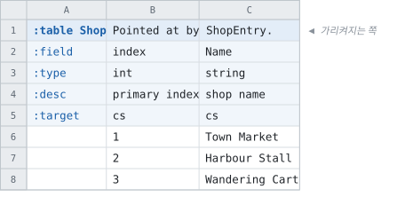
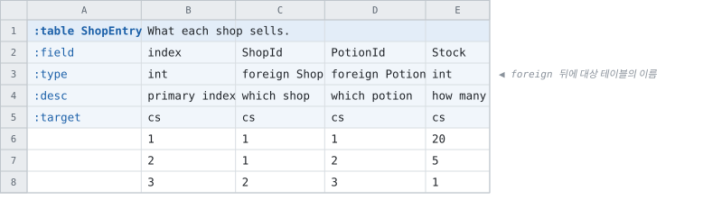
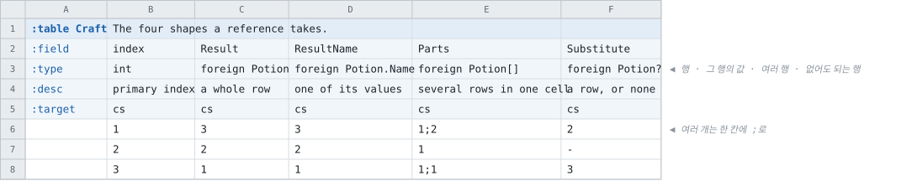

# 다른 테이블 가리키기

<!-- 이 파일은 `doc/figures/showcase.py` 가 생성합니다. 손으로 고치지 마십시오 - 다음 실행이 덮어씁니다. -->

> [시트가 코드가 되는 모습으로](../generated-code.md)

---

`:type` 칸에 `foreign <테이블>` 이라고 적으면 그 컬럼은 숫자가 아니라
**저 테이블의 행**입니다. 셀에는 대상의 키를 적습니다.

가장 단순한 꼴입니다 — 컬럼 하나가 저쪽 테이블의 행 하나를
가리킵니다.

<!-- tabbit:pair -->





<!-- tabbit:tabs lang -->
<details data-lang="csharp" open>
<summary>C#</summary>

```csharp
[System.Serializable]
public partial class ShopEntryRecord
{
    #region Values
    /// <summary>
    /// primary index
    /// </summary>
    public int Index => _index;

    /// <summary>
    /// which shop
    /// </summary>
    public int ShopId => _shopId_Shop_index;
    public ShopRecord ShopByShopId => _shopId;

    /// <summary>
    /// which potion
    /// </summary>
    public int PotionId => _potionId_Potion_index;
    public PotionRecord PotionByPotionId => _potionId;

    /// <summary>
    /// how many
    /// </summary>
    public int Stock => _stock;
    #endregion

    #region Reference wiring
    public void SetReference_ShopId_INTERNAL(ShopRecord value) => _shopId = value;
    public void SetReference_PotionId_INTERNAL(PotionRecord value) => _potionId = value;
    #endregion

    #region Storage
    internal int _index;
    internal ShopRecord _shopId;
    internal int _shopId_Shop_index;
    internal PotionRecord _potionId;
    internal int _potionId_Potion_index;
    internal int _stock;
    #endregion

    #region ToString
    public override string ToString()
    {
        var sb = new StringBuilder("{");
        sb.Append("\"Index\":"); ToStringHelper.ToString(Index, sb);
        sb.Append(",\"ShopId\":"); ToStringHelper.ToString(ShopId, sb);
        sb.Append(",\"PotionId\":"); ToStringHelper.ToString(PotionId, sb);
        sb.Append(",\"Stock\":"); ToStringHelper.ToString(Stock, sb);
        sb.Append("}");
        return sb.ToString();
    }
    #endregion
}
```

[ShopEntryTable.cs](../../test/fixtures/golden/doc-showcase/csharp/tables/ShopEntryTable.cs)

</details>
<details data-lang="typescript">
<summary>TypeScript</summary>

```typescript
// Generated from test/fixtures/xlsx/doc-showcase/doc-showcase.xlsx : Shop : F2
/** What each shop sells. */
export class ShopEntryRecord {
  /** Default constructor */
  constructor() {
  }

  /** primary index */
  public get index(): number { return this._index }

  /** which shop */
  public get shopId(): number { return this._shopId_Shop_index }
  public get shopByShopId(): ShopRecord { return this._shopId }

  /** which potion */
  public get potionId(): number { return this._potionId_Potion_index }
  public get potionByPotionId(): PotionRecord { return this._potionId }

  /** how many */
  public get stock(): number { return this._stock }

  public setReference_shopId_INTERNAL(value: ShopRecord) { this._shopId = value; }
  public setReference_potionId_INTERNAL(value: PotionRecord) { this._potionId = value; }

  public _index: number = 0
  public _shopId: ShopRecord
  public _shopId_Shop_index: number = 0
  public _potionId: PotionRecord
  public _potionId_Potion_index: number = 0
  public _stock: number = 0

  /** Populate field values. */
  public populateFieldValues(dataRow: IDataRow): void {
    this._index = dataRow.index
    this._shopId_Shop_index = dataRow.shopId
    this._potionId_Potion_index = dataRow.potionId
    this._stock = dataRow.stock
  }

  /** Populate field values. */
  public populateFieldValuesCompact(dataRow: any[]): void {
    let offset = 0
    this._index = dataRow[offset++]
    this._shopId_Shop_index = dataRow[offset++]
    this._potionId_Potion_index = dataRow[offset++]
    this._stock = dataRow[offset++]
  }
}
```

[shop-entry.ts](../../test/fixtures/golden/doc-showcase/typescript/tables/shop-entry.ts)

</details>
<details data-lang="cpp">
<summary>C++</summary>

```cpp
// Generated from test/fixtures/xlsx/doc-showcase/doc-showcase.xlsx : Shop : F2
/// What each shop sells.
struct ShopEntryRecord {
  /// primary index
  std::int32_t index = 0;
  /// which shop
  std::int32_t shop_id = 0;
  const ShopRecord* shop_by_shop_id = nullptr;
  /// which potion
  std::int32_t potion_id = 0;
  const PotionRecord* potion_by_potion_id = nullptr;
  /// how many
  std::int32_t stock = 0;
};
```

[DocShowcaseAccessor_shop_entry.h](../../test/fixtures/golden/doc-showcase/cpp/tables/DocShowcaseAccessor_shop_entry.h)

</details>
<details data-lang="python">
<summary>Python</summary>

```python
class ShopEntryRecord:
    """Generated from test/fixtures/xlsx/doc-showcase/doc-showcase.xlsx : Shop : F2.

    What each shop sells.
    """

    __slots__ = ("index", "shop_id", "shop_by_shop_id", "potion_id", "potion_by_potion_id", "stock")

    def __init__(self):
        self.index = 0
        self.shop_id = 0
        self.shop_by_shop_id = None
        self.potion_id = 0
        self.potion_by_potion_id = None
        self.stock = 0

    def __repr__(self):
        return "ShopEntryRecord(index=%r, shop_id=%r, potion_id=%r, stock=%r)" % (self.index, self.shop_id, self.potion_id, self.stock)
```

[shop_entry_table.py](../../test/fixtures/golden/doc-showcase/python/doc_showcase_data/shop_entry_table.py)

</details>
<details data-lang="c">
<summary>C</summary>

```c
/* Generated from test/fixtures/xlsx/doc-showcase/doc-showcase.xlsx : Shop : F2
 *
 * What each shop sells.
 */
struct DocShowcase_ShopEntryRecord_t {
  /* primary index */
  int32_t index;
  /* which shop */
  int32_t shop_id;
  const DocShowcase_ShopRecord_t* shop_by_shop_id;
  /* which potion */
  int32_t potion_id;
  const DocShowcase_PotionRecord_t* potion_by_potion_id;
  /* how many */
  int32_t stock;
};
```

[DocShowcase_ShopEntry.h](../../test/fixtures/golden/doc-showcase/c/tables/DocShowcase_ShopEntry.h)

</details>
<details data-lang="dart">
<summary>Dart</summary>

```dart
// Generated from test/fixtures/xlsx/doc-showcase/doc-showcase.xlsx : Shop : F2
/// What each shop sells.
class ShopEntryRecord {
  /// primary index
  int index = 0;
  /// which shop
  int shopId = 0;
  ShopRecord? shopByShopId;
  /// which potion
  int potionId = 0;
  PotionRecord? potionByPotionId;
  /// how many
  int stock = 0;

}
```

[shop_entry_table.dart](../../test/fixtures/golden/doc-showcase/dart/tables/shop_entry_table.dart)

</details>
<details data-lang="go">
<summary>Go</summary>

```go
// ShopEntryRecord was generated from test/fixtures/xlsx/doc-showcase/doc-showcase.xlsx : Shop : F2.
// What each shop sells.
type ShopEntryRecord struct {
	// primary index
	Index int32
	// which shop
	ShopId       int32
	ShopByShopId *ShopRecord
	// which potion
	PotionId         int32
	PotionByPotionId *PotionRecord
	// how many
	Stock int32
}
```

[shop_entry_table.go](../../test/fixtures/golden/doc-showcase/go/shop_entry_table.go)

</details>
<details data-lang="java">
<summary>Java</summary>

```java
// Generated from test/fixtures/xlsx/doc-showcase/doc-showcase.xlsx : Shop : F2
/** What each shop sells. */
public final class ShopEntryRecord {
    /** primary index */
    public int index;
    /** which shop */
    public int shopId;
    public ShopRecord shopByShopId;
    /** which potion */
    public int potionId;
    public PotionRecord potionByPotionId;
    /** how many */
    public int stock;

}
```

[ShopEntryRecord.java](../../test/fixtures/golden/doc-showcase/java/tabbit/fixtures/docshowcase/ShopEntryRecord.java)

</details>
<details data-lang="kotlin">
<summary>Kotlin</summary>

```kotlin
// Generated from test/fixtures/xlsx/doc-showcase/doc-showcase.xlsx : Shop : F2
/** What each shop sells. */
class ShopEntryRecord {
    /** primary index */
    var index: Int = 0
    /** which shop */
    var shopId: Int = 0
    var shopByShopId: ShopRecord? = null
    /** which potion */
    var potionId: Int = 0
    var potionByPotionId: PotionRecord? = null
    /** how many */
    var stock: Int = 0

}
```

[ShopEntryTable.kt](../../test/fixtures/golden/doc-showcase/kotlin/tabbit/fixtures/docshowcase/tables/ShopEntryTable.kt)

</details>
<details data-lang="lua">
<summary>Lua</summary>

```lua
-- Generated from test/fixtures/xlsx/doc-showcase/doc-showcase.xlsx : Shop : F2.
-- What each shop sells.
---@class ShopEntryRecord
---@field index integer
---@field shopId integer
---@field shopByShopId ShopRecord|nil
---@field potionId integer
---@field potionByPotionId PotionRecord|nil
---@field stock integer
local ShopEntryRecordMeta = tcb.strictType("a `ShopEntry` row", { "index", "shopId", "shopByShopId", "potionId", "potionByPotionId", "stock" })
```

[shop_entry_table.lua](../../test/fixtures/golden/doc-showcase/lua/tables/shop_entry_table.lua)

</details>
<details data-lang="php">
<summary>PHP</summary>

```php
/**
 * Generated from test/fixtures/xlsx/doc-showcase/doc-showcase.xlsx : Shop : F2
 *
 * What each shop sells.
 */
final class ShopEntryRecord
{
    /** primary index */
    public int $index = 0;
    /** which shop */
    public int $shopId = 0;

    public ?ShopRecord $shopByShopId = null;
    /** which potion */
    public int $potionId = 0;

    public ?PotionRecord $potionByPotionId = null;
    /** how many */
    public int $stock = 0;
}
```

[ShopEntryTable.php](../../test/fixtures/golden/doc-showcase/php/tables/ShopEntryTable.php)

</details>
<details data-lang="ruby">
<summary>Ruby</summary>

```ruby
# Generated from test/fixtures/xlsx/doc-showcase/doc-showcase.xlsx : Shop : F2
# What each shop sells.
class ShopEntryRecord
  attr_accessor :index, :shop_id, :shop_by_shop_id, :potion_id, :potion_by_potion_id, :stock

  def initialize
    @index = 0
    @shop_id = 0
    @shop_by_shop_id = nil
    @potion_id = 0
    @potion_by_potion_id = nil
    @stock = 0
  end
```

[shop_entry_table.rb](../../test/fixtures/golden/doc-showcase/ruby/tables/shop_entry_table.rb)

</details>
<details data-lang="rust">
<summary>Rust</summary>

```rust
// Generated from test/fixtures/xlsx/doc-showcase/doc-showcase.xlsx : Shop : F2
/// What each shop sells.
#[derive(Clone, Debug, Default)]
pub struct ShopEntryRecord {
    /// primary index
    pub index: i32,
    /// which shop
    pub shop_id: i32,
    /// which potion
    pub potion_id: i32,
    /// how many
    pub stock: i32,
}
```

[shop_entry_table.rs](../../test/fixtures/golden/doc-showcase/rust/src/shop_entry_table.rs)

</details>
<details data-lang="swift">
<summary>Swift</summary>

```swift
// Generated from test/fixtures/xlsx/doc-showcase/doc-showcase.xlsx : Shop : F2
/// What each shop sells.
public final class ShopEntryRecord {

    public init() {}

    /// primary index
    public var index: Int32 = 0

    /// which shop
    public var shopId: Int32 = 0
    public var shopByShopId: ShopRecord? = nil

    /// which potion
    public var potionId: Int32 = 0
    public var potionByPotionId: PotionRecord? = nil

    /// how many
    public var stock: Int32 = 0
}
```

[ShopEntryTable.swift](../../test/fixtures/golden/doc-showcase/swift/tables/ShopEntryTable.swift)

</details>
<details data-lang="unreal">
<summary>Unreal</summary>

```cpp
// Generated from test/fixtures/xlsx/doc-showcase/doc-showcase.xlsx : Shop : F2
/** What each shop sells. */
USTRUCT(BlueprintType)
struct DOCSHOWCASE_API FShopEntryRow
{
    GENERATED_BODY()

    /** primary index */
    UPROPERTY(EditAnywhere, BlueprintReadOnly, Category = "ShopEntry")
    int32 Index = 0;

    /** which shop */
    UPROPERTY(EditAnywhere, BlueprintReadOnly, Category = "ShopEntry")
    int32 ShopId = 0;

    /** which potion */
    UPROPERTY(EditAnywhere, BlueprintReadOnly, Category = "ShopEntry")
    int32 PotionId = 0;

    /** how many */
    UPROPERTY(EditAnywhere, BlueprintReadOnly, Category = "ShopEntry")
    int32 Stock = 0;

};
```

[FDocShowcase.h](../../test/fixtures/golden/doc-showcase/unreal/Source/DocShowcase/Public/FDocShowcase.h)

</details>
<!-- /tabbit:tabs -->

<!-- /tabbit:pair -->

**컬럼 하나가 멤버 둘이 됩니다.**

- `ShopId` — 셀에 적힌 키 그대로입니다
- `ShopByShopId` — 그 키가 가리키는 행입니다

이름은 `<대상>By<컬럼>` 으로 만들어집니다
([참조가 내는 이름](../../spec/references/reference-surface-naming.md)).

파일에는 키로 저장되고, 모든 테이블을 읽은 뒤에 실제 레코드로 연결됩니다. **그래서 가리킨
행의 값을 쓸 때 조회를 한 번 더 하지 않습니다** — `entry.ShopByShopId.Name` 이 곧 상점
이름입니다.

---

참조가 취하는 꼴은 넷입니다.

| 적는 법 | 뜻 |
| --- | --- |
| `foreign Potion` | 그 테이블의 행 하나 |
| `foreign Potion.Name` | 그 행의 값 하나 — 컬럼의 타입은 저쪽 컬럼의 타입이 됩니다 |
| `foreign Potion[]` | 행 여럿 |
| `foreign Potion?` | 행 하나, 또는 없음 |



<!-- tabbit:tabs lang -->
<details data-lang="csharp" open>
<summary>C#</summary>

```csharp
[System.Serializable]
public partial class CraftRecord
{
    #region Values
    /// <summary>
    /// primary index
    /// </summary>
    public int Index => _index;

    /// <summary>
    /// a whole row
    /// </summary>
    public int Result => _result_Potion_index;
    public PotionRecord PotionByResult => _result;

    /// <summary>
    /// one of its values
    /// </summary>
    public string ResultName => _resultName;

    /// <summary>
    /// several rows in one cell
    /// </summary>
    public int[] Parts => _parts_Potion_index;
    public PotionRecord[] PotionByParts => _parts;

    /// <summary>
    /// a row, or none
    /// </summary>
    public int Substitute => _substitute_Potion_index;
    public PotionRecord PotionBySubstitute => _substitute;
    /// <summary>Whether this row has a value for <see cref="Substitute"/>.</summary>
    public bool HasSubstitute => _substituteHasValue;
    #endregion

    #region Reference wiring
    public void SetReference_Result_INTERNAL(PotionRecord value) => _result = value;
    public void SetReference_ResultName_INTERNAL(string value) => _resultName = value;
    public void SetReference_Parts_INTERNAL(int index, PotionRecord value) => _parts[index] = value;
    public void SetReference_Substitute_INTERNAL(PotionRecord value) => _substitute = value;
    #endregion

    #region Storage
    internal int _index;
    internal PotionRecord _result;
    internal int _result_Potion_index;
    internal string _resultName;
    public int _resultName_Potion_index;
    internal PotionRecord[] _parts = System.Array.Empty<PotionRecord>();
    internal int[] _parts_Potion_index = System.Array.Empty<int>();
    internal PotionRecord _substitute;
    internal int _substitute_Potion_index;
    internal bool _substituteHasValue;
    #endregion

    #region ToString
    public override string ToString()
    {
        var sb = new StringBuilder("{");
        sb.Append("\"Index\":"); ToStringHelper.ToString(Index, sb);
        sb.Append(",\"Result\":"); ToStringHelper.ToString(Result, sb);
        sb.Append(",\"ResultName\":"); ToStringHelper.ToString(ResultName, sb);
        sb.Append(",\"Parts\":"); ToStringHelper.ToString(Parts, sb);
        sb.Append(",\"Substitute\":"); ToStringHelper.ToString(Substitute, sb);
        sb.Append("}");
        return sb.ToString();
    }
    #endregion
}
```

[CraftTable.cs](../../test/fixtures/golden/doc-showcase/csharp/tables/CraftTable.cs)

</details>
<details data-lang="typescript">
<summary>TypeScript</summary>

```typescript
// Generated from test/fixtures/xlsx/doc-showcase/doc-showcase.xlsx : Shop : K2
/** The four shapes a reference takes. */
export class CraftRecord {
  /** Default constructor */
  constructor() {
  }

  /** primary index */
  public get index(): number { return this._index }

  /** a whole row */
  public get result(): number { return this._result_Potion_index }
  public get potionByResult(): PotionRecord { return this._result }

  /** one of its values */
  public get resultName(): string { return this._resultName }

  /** several rows in one cell */
  public get parts(): number[] { return this._parts_Potion_index }
  public get potionByParts(): PotionRecord[] { return this._parts }

  /** a row, or none */
  public get substitute(): number { return this._substitute_Potion_index }
  public get potionBySubstitute(): PotionRecord { return this._substitute }
  /** Whether this row has a value for `substitute`. */
  public get hasSubstitute(): boolean { return this._substituteHasValue }

  public setReference_result_INTERNAL(value: PotionRecord) { this._result = value; }
  public setReference_resultName_INTERNAL(value: string) { this._resultName = value }
  public setReference_parts_INTERNAL(index: number, value: PotionRecord): void { this._parts[index] = value; }
  public setReference_substitute_INTERNAL(value: PotionRecord) { this._substitute = value; }

  public _index: number = 0
  public _result: PotionRecord
  public _result_Potion_index: number = 0
  public _resultName: string
  public _resultName_Potion_index: number = 0
  public _parts: PotionRecord[] = []
  public _parts_Potion_index: number[] = []
  public _substitute: PotionRecord
  public _substitute_Potion_index: number = 0
  public _substituteHasValue: boolean = false

  /** Populate field values. */
  public populateFieldValues(dataRow: IDataRow): void {
    this._index = dataRow.index
    this._result_Potion_index = dataRow.result
    this._resultName_Potion_index = dataRow.resultName
    this._parts_Potion_index = dataRow.parts; this._parts = new Array(this._parts_Potion_index.length).fill(undefined)
    this._substitute_Potion_index = dataRow.substitute
  }

  /** Populate field values. */
  public populateFieldValuesCompact(dataRow: any[]): void {
    let offset = 0
    this._index = dataRow[offset++]
    this._result_Potion_index = dataRow[offset++]
    this._resultName_Potion_index = dataRow[offset++]
    this._parts_Potion_index = dataRow.slice(offset, offset + 1)
    this._parts = new Array(this._parts_Potion_index.length).fill(undefined)
    offset += 1
    this._substitute_Potion_index = dataRow[offset++]
  }
}
```

[craft.ts](../../test/fixtures/golden/doc-showcase/typescript/tables/craft.ts)

</details>
<details data-lang="cpp">
<summary>C++</summary>

```cpp
// Generated from test/fixtures/xlsx/doc-showcase/doc-showcase.xlsx : Shop : K2
/// The four shapes a reference takes.
struct CraftRecord {
  /// primary index
  std::int32_t index = 0;
  /// a whole row
  std::int32_t result = 0;
  const PotionRecord* potion_by_result = nullptr;
  /// one of its values
  std::string result_name_index = 0;
  std::string result_name = std::string();
  /// several rows in one cell
  std::vector<std::int32_t> parts;
  std::vector<const PotionRecord*> potion_by_parts;
  /// a row, or none
  std::int32_t substitute = 0;
  const PotionRecord* potion_by_substitute = nullptr;
  /// Whether this row has a value for `substitute`.
  bool has_substitute = false;
};
```

[DocShowcaseAccessor_craft.h](../../test/fixtures/golden/doc-showcase/cpp/tables/DocShowcaseAccessor_craft.h)

</details>
<details data-lang="python">
<summary>Python</summary>

```python
class CraftRecord:
    """Generated from test/fixtures/xlsx/doc-showcase/doc-showcase.xlsx : Shop : K2.

    The four shapes a reference takes.
    """

    __slots__ = ("index", "result", "potion_by_result", "result_name", "result_name_index", "parts", "potion_by_parts", "substitute", "potion_by_substitute", "has_substitute")

    def __init__(self):
        self.index = 0
        self.result = 0
        self.potion_by_result = None
        self.result_name_index = 0
        self.result_name = None
        self.parts = []
        self.potion_by_parts = []
        self.substitute = 0
        self.potion_by_substitute = None
        self.has_substitute = False

    def __repr__(self):
        return "CraftRecord(index=%r, result=%r, result_name=%r, parts=%r, substitute=%r)" % (self.index, self.result, self.result_name, self.parts, self.substitute)
```

[craft_table.py](../../test/fixtures/golden/doc-showcase/python/doc_showcase_data/craft_table.py)

</details>
<details data-lang="c">
<summary>C</summary>

```c
/* Generated from test/fixtures/xlsx/doc-showcase/doc-showcase.xlsx : Shop : K2
 *
 * The four shapes a reference takes.
 */
struct DocShowcase_CraftRecord_t {
  /* primary index */
  int32_t index;
  /* a whole row */
  int32_t result;
  const DocShowcase_PotionRecord_t* potion_by_result;
  /* one of its values */
  int32_t result_name_index;
  const char* result_name;
  /* several rows in one cell */
  int32_t* parts;
  const DocShowcase_PotionRecord_t** potion_by_parts;
  int32_t parts_count;
  /* a row, or none */
  int32_t substitute;
  const DocShowcase_PotionRecord_t* potion_by_substitute;
  /* Whether this row has a value for substitute. The value member keeps its type and
   * holds the type's empty value when the row had none; this says which it was. */
  bool has_substitute;
};
```

[DocShowcase_Craft.h](../../test/fixtures/golden/doc-showcase/c/tables/DocShowcase_Craft.h)

</details>
<details data-lang="dart">
<summary>Dart</summary>

```dart
// Generated from test/fixtures/xlsx/doc-showcase/doc-showcase.xlsx : Shop : K2
/// The four shapes a reference takes.
class CraftRecord {
  /// primary index
  int index = 0;
  /// a whole row
  int result = 0;
  PotionRecord? potionByResult;
  /// one of its values
  int resultNameIndex = 0;
  String? resultName;
  /// several rows in one cell
  List<int> parts = [];
  List<PotionRecord?> potionByParts = [];
  /// a row, or none
  int substitute = 0;
  PotionRecord? potionBySubstitute;
  bool hasSubstitute = false;

}
```

[craft_table.dart](../../test/fixtures/golden/doc-showcase/dart/tables/craft_table.dart)

</details>
<details data-lang="go">
<summary>Go</summary>

```go
// CraftRecord was generated from test/fixtures/xlsx/doc-showcase/doc-showcase.xlsx : Shop : K2.
// The four shapes a reference takes.
type CraftRecord struct {
	// primary index
	Index int32
	// a whole row
	Result         int32
	PotionByResult *PotionRecord
	// one of its values
	ResultNameIndex int32
	ResultName      string
	// several rows in one cell
	Parts         []int32
	PotionByParts []*PotionRecord
	// a row, or none
	Substitute         int32
	PotionBySubstitute *PotionRecord
	// Whether this row has a value for Substitute. The value member keeps its type
	// and holds the type's empty value when the row had none; this says which it was.
	HasSubstitute bool
}
```

[craft_table.go](../../test/fixtures/golden/doc-showcase/go/craft_table.go)

</details>
<details data-lang="java">
<summary>Java</summary>

```java
// Generated from test/fixtures/xlsx/doc-showcase/doc-showcase.xlsx : Shop : K2
/** The four shapes a reference takes. */
public final class CraftRecord {
    /** primary index */
    public int index;
    /** a whole row */
    public int result;
    public PotionRecord potionByResult;
    /** one of its values */
    public int resultNameIndex;
    public String resultName;
    /** several rows in one cell */
    public int[] parts = new int[0];
    public PotionRecord[] potionByParts = new PotionRecord[0];
    /** a row, or none */
    public int substitute;
    public PotionRecord potionBySubstitute;
    /**
     * Whether this row has a value for substitute. The value field keeps its type and
     * holds the type's empty value when the row had none; this says which it was.
     */
    public boolean hasSubstitute;

}
```

[CraftRecord.java](../../test/fixtures/golden/doc-showcase/java/tabbit/fixtures/docshowcase/CraftRecord.java)

</details>
<details data-lang="kotlin">
<summary>Kotlin</summary>

```kotlin
// Generated from test/fixtures/xlsx/doc-showcase/doc-showcase.xlsx : Shop : K2
/** The four shapes a reference takes. */
class CraftRecord {
    /** primary index */
    var index: Int = 0
    /** a whole row */
    var result: Int = 0
    var potionByResult: PotionRecord? = null
    /** one of its values */
    var resultNameIndex: Int = 0
    var resultName: String? = null
    /** several rows in one cell */
    var parts: MutableList<Int> = ArrayList()
    var potionByParts: MutableList<PotionRecord> = ArrayList()
    /** a row, or none */
    var substitute: Int = 0
    var potionBySubstitute: PotionRecord? = null
    /**
     * Whether this row has a value for substitute. The value property keeps its type
     * and holds the type's empty value when the row had none; this says which it was.
     */
    var hasSubstitute: Boolean = false

}
```

[CraftTable.kt](../../test/fixtures/golden/doc-showcase/kotlin/tabbit/fixtures/docshowcase/tables/CraftTable.kt)

</details>
<details data-lang="lua">
<summary>Lua</summary>

```lua
-- Generated from test/fixtures/xlsx/doc-showcase/doc-showcase.xlsx : Shop : K2.
-- The four shapes a reference takes.
---@class CraftRecord
---@field index integer
---@field result integer
---@field potionByResult PotionRecord|nil
---@field resultNameIndex integer
---@field resultName string
---@field parts integer[]
---@field potionByParts PotionRecord[]
---@field substitute integer
---@field potionBySubstitute PotionRecord|nil
---@field hasSubstitute boolean
local CraftRecordMeta = tcb.strictType("a `Craft` row", { "index", "result", "potionByResult", "resultNameIndex", "resultName", "parts", "potionByParts", "substitute", "potionBySubstitute", "hasSubstitute" })
```

[craft_table.lua](../../test/fixtures/golden/doc-showcase/lua/tables/craft_table.lua)

</details>
<details data-lang="php">
<summary>PHP</summary>

```php
/**
 * Generated from test/fixtures/xlsx/doc-showcase/doc-showcase.xlsx : Shop : K2
 *
 * The four shapes a reference takes.
 */
final class CraftRecord
{
    /** primary index */
    public int $index = 0;
    /** a whole row */
    public int $result = 0;

    public ?PotionRecord $potionByResult = null;
    /** one of its values */
    public int $resultNameIndex = 0;

    public ?string $resultName = null;
    /** several rows in one cell */
    /** @var list<int> */
    public array $parts = [];

    /** @var list<?PotionRecord> */
    public array $potionByParts = [];
    /** a row, or none */
    public int $substitute = 0;

    public ?PotionRecord $potionBySubstitute = null;

    public bool $hasSubstitute = false;
}
```

[CraftTable.php](../../test/fixtures/golden/doc-showcase/php/tables/CraftTable.php)

</details>
<details data-lang="ruby">
<summary>Ruby</summary>

```ruby
# Generated from test/fixtures/xlsx/doc-showcase/doc-showcase.xlsx : Shop : K2
# The four shapes a reference takes.
class CraftRecord
  attr_accessor :index, :result, :potion_by_result, :result_name, :result_name_index, :parts, :potion_by_parts, :substitute, :potion_by_substitute, :has_substitute

  def initialize
    @index = 0
    @result = 0
    @potion_by_result = nil
    @result_name_index = 0
    @result_name = nil
    @parts = []
    @potion_by_parts = []
    @substitute = 0
    @potion_by_substitute = nil
    @has_substitute = false
  end
```

[craft_table.rb](../../test/fixtures/golden/doc-showcase/ruby/tables/craft_table.rb)

</details>
<details data-lang="rust">
<summary>Rust</summary>

```rust
// Generated from test/fixtures/xlsx/doc-showcase/doc-showcase.xlsx : Shop : K2
/// The four shapes a reference takes.
#[derive(Clone, Debug, Default)]
pub struct CraftRecord {
    /// primary index
    pub index: i32,
    /// a whole row
    pub result: i32,
    /// one of its values
    pub result_name: i32,
    /// several rows in one cell
    pub parts: Vec<i32>,
    /// a row, or none
    pub substitute: i32,
    /// Whether this row has a value for `substitute`. The value member keeps its type
    /// and holds the type's empty value when the row had none; this says which it was.
    pub has_substitute: bool,
}
```

[craft_table.rs](../../test/fixtures/golden/doc-showcase/rust/src/craft_table.rs)

</details>
<details data-lang="swift">
<summary>Swift</summary>

```swift
// Generated from test/fixtures/xlsx/doc-showcase/doc-showcase.xlsx : Shop : K2
/// The four shapes a reference takes.
public final class CraftRecord {

    public init() {}

    /// primary index
    public var index: Int32 = 0

    /// a whole row
    public var result: Int32 = 0
    public var potionByResult: PotionRecord? = nil

    /// one of its values
    public var resultNameIndex: Int32 = 0
    public var resultName: String? = nil

    /// several rows in one cell
    public var parts: [Int32] = []
    public var potionByParts: [PotionRecord] = []

    /// a row, or none
    public var substitute: Int32 = 0
    public var potionBySubstitute: PotionRecord? = nil
    /// Whether this row has a value for substitute. The value property keeps its type
    /// and holds the type's empty value when the row had none; this says which it was.
    public var hasSubstitute: Bool = false
}
```

[CraftTable.swift](../../test/fixtures/golden/doc-showcase/swift/tables/CraftTable.swift)

</details>
<details data-lang="unreal">
<summary>Unreal</summary>

```cpp
// Generated from test/fixtures/xlsx/doc-showcase/doc-showcase.xlsx : Shop : K2
/** The four shapes a reference takes. */
USTRUCT(BlueprintType)
struct DOCSHOWCASE_API FCraftRow
{
    GENERATED_BODY()

    /** primary index */
    UPROPERTY(EditAnywhere, BlueprintReadOnly, Category = "Craft")
    int32 Index = 0;

    /** a whole row */
    UPROPERTY(EditAnywhere, BlueprintReadOnly, Category = "Craft")
    int32 Result = 0;

    /** one of its values */
    UPROPERTY(EditAnywhere, BlueprintReadOnly, Category = "Craft")
    int32 ResultName = 0;

    /** several rows in one cell */
    UPROPERTY(EditAnywhere, BlueprintReadOnly, Category = "Craft")
    TArray<int32> Parts;

    /** a row, or none */
    UPROPERTY(EditAnywhere, BlueprintReadOnly, Category = "Craft")
    int32 Substitute = 0;

    /** Whether this row has a value for Substitute. */
    UPROPERTY(EditAnywhere, BlueprintReadOnly, Category = "Craft")
    bool bHasSubstitute = false;
};
```

[FDocShowcase.h](../../test/fixtures/golden/doc-showcase/unreal/Source/DocShowcase/Public/FDocShowcase.h)

</details>
<!-- /tabbit:tabs -->

**`ResultName` 이 문자열인 것이 읽을 자리입니다.** 셀에는 키를
적었지만 타입은 저쪽 컬럼을 따라갑니다 — 가리키는 것이 행이 아니라 그 행의 값이기
때문입니다.

배열도 옵셔널도 같은 규칙으로 이름이 둘씩 생깁니다.
