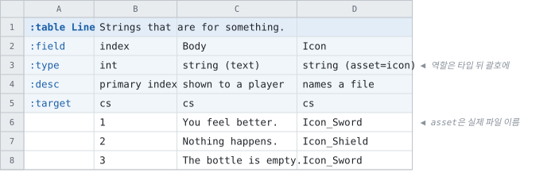

# 문자열의 역할 — text와 asset

<!-- 이 파일은 `doc/figures/showcase.py` 가 생성합니다. 손으로 고치지 마십시오 - 다음 실행이 덮어씁니다. -->

> [시트가 코드가 되는 모습으로](../generated-code.md)

---

둘 다 코드에서는 그냥 문자열입니다. **달라지는 것은 빌드가 그 컬럼에
무엇을 더 하느냐입니다.**

`text` 는 번역을 위해 따로 모이는 문자열이고, `asset` 은 그 이름의
파일이 실제로 있어야 하는 문자열입니다.

<!-- tabbit:pair -->



<!-- tabbit:tabs lang -->
<details data-lang="csharp" open>
<summary>C#</summary>

```csharp
[System.Serializable]
public partial class LineRecord
{
    #region Values
    /// <summary>
    /// primary index
    /// </summary>
    public int Index => _index;

    /// <summary>
    /// shown to a player
    /// </summary>
    public string Body => _body;

    /// <summary>
    /// names a file
    /// </summary>
    public string Icon => _icon;
    #endregion

    #region Storage
    internal int _index;
    internal string _body = "";
    internal string _icon = "";
    #endregion

    #region ToString
    public override string ToString()
    {
        var sb = new StringBuilder("{");
        sb.Append("\"Index\":"); ToStringHelper.ToString(Index, sb);
        sb.Append(",\"Body\":"); ToStringHelper.ToString(Body, sb);
        sb.Append(",\"Icon\":"); ToStringHelper.ToString(Icon, sb);
        sb.Append("}");
        return sb.ToString();
    }
    #endregion
}
```

[LineTable.cs](../../test/fixtures/golden/doc-showcase/csharp/tables/LineTable.cs)

</details>
<details data-lang="typescript">
<summary>TypeScript</summary>

```typescript
// Generated from test/fixtures/xlsx/doc-showcase/doc-showcase.xlsx : Types : X2
/** Strings that are for something. */
export class LineRecord {
  /** Default constructor */
  constructor() {
  }

  /** primary index */
  public get index(): number { return this._index }

  /** shown to a player */
  public get body(): string { return this._body }

  /** names a file */
  public get icon(): string { return this._icon }

  public _index: number = 0
  public _body: string = ''
  public _icon: string = ''

  /** Populate field values. */
  public populateFieldValues(dataRow: IDataRow): void {
    this._index = dataRow.index
    this._body = dataRow.body
    this._icon = dataRow.icon
  }

  /** Populate field values. */
  public populateFieldValuesCompact(dataRow: any[]): void {
    let offset = 0
    this._index = dataRow[offset++]
    this._body = dataRow[offset++]
    this._icon = dataRow[offset++]
  }
}
```

[line.ts](../../test/fixtures/golden/doc-showcase/typescript/tables/line.ts)

</details>
<details data-lang="cpp">
<summary>C++</summary>

```cpp
// Generated from test/fixtures/xlsx/doc-showcase/doc-showcase.xlsx : Types : X2
/// Strings that are for something.
struct LineRecord {
  /// primary index
  std::int32_t index = 0;
  /// shown to a player
  std::string body;
  /// names a file
  std::string icon;
};
```

[DocShowcaseAccessor_line.h](../../test/fixtures/golden/doc-showcase/cpp/tables/DocShowcaseAccessor_line.h)

</details>
<details data-lang="python">
<summary>Python</summary>

```python
class LineRecord:
    """Generated from test/fixtures/xlsx/doc-showcase/doc-showcase.xlsx : Types : X2.

    Strings that are for something.
    """

    __slots__ = ("index", "body", "icon")

    def __init__(self):
        self.index = 0
        self.body = ""
        self.icon = ""

    def __repr__(self):
        return "LineRecord(index=%r, body=%r, icon=%r)" % (self.index, self.body, self.icon)
```

[line_table.py](../../test/fixtures/golden/doc-showcase/python/doc_showcase_data/line_table.py)

</details>
<details data-lang="c">
<summary>C</summary>

```c
/* Generated from test/fixtures/xlsx/doc-showcase/doc-showcase.xlsx : Types : X2
 *
 * Strings that are for something.
 */
struct DocShowcase_LineRecord_t {
  /* primary index */
  int32_t index;
  /* shown to a player */
  const char* body;
  /* names a file */
  const char* icon;
};
```

[DocShowcase_Line.h](../../test/fixtures/golden/doc-showcase/c/tables/DocShowcase_Line.h)

</details>
<details data-lang="dart">
<summary>Dart</summary>

```dart
// Generated from test/fixtures/xlsx/doc-showcase/doc-showcase.xlsx : Types : X2
/// Strings that are for something.
class LineRecord {
  /// primary index
  int index = 0;
  /// shown to a player
  String body = '';
  /// names a file
  String icon = '';

}
```

[line_table.dart](../../test/fixtures/golden/doc-showcase/dart/tables/line_table.dart)

</details>
<details data-lang="go">
<summary>Go</summary>

```go
// LineRecord was generated from test/fixtures/xlsx/doc-showcase/doc-showcase.xlsx : Types : X2.
// Strings that are for something.
type LineRecord struct {
	// primary index
	Index int32
	// shown to a player
	Body string
	// names a file
	Icon string
}
```

[line_table.go](../../test/fixtures/golden/doc-showcase/go/line_table.go)

</details>
<details data-lang="java">
<summary>Java</summary>

```java
// Generated from test/fixtures/xlsx/doc-showcase/doc-showcase.xlsx : Types : X2
/** Strings that are for something. */
public final class LineRecord {
    /** primary index */
    public int index;
    /** shown to a player */
    public String body = "";
    /** names a file */
    public String icon = "";

}
```

[LineRecord.java](../../test/fixtures/golden/doc-showcase/java/tabbit/fixtures/docshowcase/LineRecord.java)

</details>
<details data-lang="kotlin">
<summary>Kotlin</summary>

```kotlin
// Generated from test/fixtures/xlsx/doc-showcase/doc-showcase.xlsx : Types : X2
/** Strings that are for something. */
class LineRecord {
    /** primary index */
    var index: Int = 0
    /** shown to a player */
    var body: String = ""
    /** names a file */
    var icon: String = ""

}
```

[LineTable.kt](../../test/fixtures/golden/doc-showcase/kotlin/tabbit/fixtures/docshowcase/tables/LineTable.kt)

</details>
<details data-lang="lua">
<summary>Lua</summary>

```lua
-- Generated from test/fixtures/xlsx/doc-showcase/doc-showcase.xlsx : Types : X2.
-- Strings that are for something.
---@class LineRecord
---@field index integer
---@field body string
---@field icon string
local LineRecordMeta = tcb.strictType("a `Line` row", { "index", "body", "icon" })
```

[line_table.lua](../../test/fixtures/golden/doc-showcase/lua/tables/line_table.lua)

</details>
<details data-lang="php">
<summary>PHP</summary>

```php
/**
 * Generated from test/fixtures/xlsx/doc-showcase/doc-showcase.xlsx : Types : X2
 *
 * Strings that are for something.
 */
final class LineRecord
{
    /** primary index */
    public int $index = 0;
    /** shown to a player */
    public string $body = '';
    /** names a file */
    public string $icon = '';
}
```

[LineTable.php](../../test/fixtures/golden/doc-showcase/php/tables/LineTable.php)

</details>
<details data-lang="ruby">
<summary>Ruby</summary>

```ruby
# Generated from test/fixtures/xlsx/doc-showcase/doc-showcase.xlsx : Types : X2
# Strings that are for something.
class LineRecord
  attr_accessor :index, :body, :icon

  def initialize
    @index = 0
    @body = ''
    @icon = ''
  end
```

[line_table.rb](../../test/fixtures/golden/doc-showcase/ruby/tables/line_table.rb)

</details>
<details data-lang="rust">
<summary>Rust</summary>

```rust
// Generated from test/fixtures/xlsx/doc-showcase/doc-showcase.xlsx : Types : X2
/// Strings that are for something.
#[derive(Clone, Debug, Default)]
pub struct LineRecord {
    /// primary index
    pub index: i32,
    /// shown to a player
    pub body: String,
    /// names a file
    pub icon: String,
}
```

[line_table.rs](../../test/fixtures/golden/doc-showcase/rust/src/line_table.rs)

</details>
<details data-lang="swift">
<summary>Swift</summary>

```swift
// Generated from test/fixtures/xlsx/doc-showcase/doc-showcase.xlsx : Types : X2
/// Strings that are for something.
public final class LineRecord {

    public init() {}

    /// primary index
    public var index: Int32 = 0

    /// shown to a player
    public var body: String = ""

    /// names a file
    public var icon: String = ""
}
```

[LineTable.swift](../../test/fixtures/golden/doc-showcase/swift/tables/LineTable.swift)

</details>
<details data-lang="unreal">
<summary>Unreal</summary>

```cpp
// Generated from test/fixtures/xlsx/doc-showcase/doc-showcase.xlsx : Types : X2
/** Strings that are for something. */
USTRUCT(BlueprintType)
struct DOCSHOWCASE_API FLineRow
{
    GENERATED_BODY()

    /** primary index */
    UPROPERTY(EditAnywhere, BlueprintReadOnly, Category = "Line")
    int32 Index = 0;

    /** shown to a player */
    UPROPERTY(EditAnywhere, BlueprintReadOnly, Category = "Line")
    FString Body;

    /** names a file */
    UPROPERTY(EditAnywhere, BlueprintReadOnly, Category = "Line")
    FString Icon;

};
```

[FDocShowcase.h](../../test/fixtures/golden/doc-showcase/unreal/Source/DocShowcase/Public/FDocShowcase.h)

</details>
<!-- /tabbit:tabs -->

<!-- /tabbit:pair -->

**생성된 코드에는 역할이 남지 않습니다.** 둘 다 문자열 멤버 하나입니다 —
역할은 빌드 시점에 끝납니다.

- `text` — recipe에 번역 파일 타깃을 더하면 그 값들이 거기로 모입니다 ([내보내기](../exports.md))
- `asset` — recipe가 가리킨 폴더에 그 파일이 있는지 확인하고, 없으면 보고합니다

역할이 산출물의 바이트를 바꾸지 않는다는 것이 이 설계의 요점입니다.
