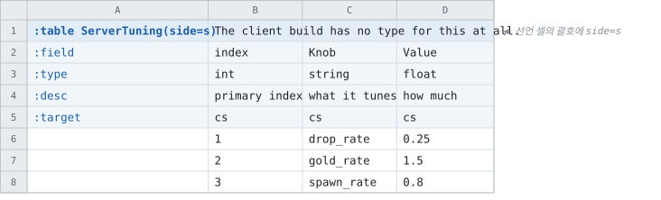

# 서버와 클라이언트에 다른 것 주기

<!-- 이 파일은 `doc/figures/showcase.py` 가 생성합니다. 손으로 고치지 마십시오 - 다음 실행이 덮어씁니다. -->

> [시트가 코드가 되는 모습으로](../generated-code.md)

---

`c` 는 클라이언트, `s` 는 서버, `cs` 는 양쪽(기본)입니다. **적는 자리가
둘인데, 어느 쪽이든 받지 않는 빌드에는 흔적이 남지 않습니다.**

`:target` 줄에 적으면 **그 컬럼 하나**입니다. 위는 서버 빌드에서
생성된 코드입니다.


<!-- tabbit:tabs lang -->
<details data-lang="csharp" open>
<summary>C#</summary>

```csharp
[System.Serializable]
public partial class StageRewardRecord
{
    #region Values
    /// <summary>
    /// which stage
    /// </summary>
    public int Stage => _stage;

    /// <summary>
    /// finishing rank
    /// </summary>
    public global::Tabbit.Fixtures.DocShowcase.Rarity Rank => _rank;

    /// <summary>
    /// gold paid
    /// </summary>
    public int Gold => _gold;

    /// <summary>
    /// drop table
    /// </summary>
    public string DropTable => _dropTable;
    #endregion

    #region Storage
    internal int _stage;
    internal global::Tabbit.Fixtures.DocShowcase.Rarity _rank;
    internal int _gold;
    internal string _dropTable = "";
    #endregion

    #region ToString
    public override string ToString()
    {
        var sb = new StringBuilder("{");
        sb.Append("\"Stage\":"); ToStringHelper.ToString(Stage, sb);
        sb.Append(",\"Rank\":"); ToStringHelper.ToString(Rank, sb);
        sb.Append(",\"Gold\":"); ToStringHelper.ToString(Gold, sb);
        sb.Append(",\"DropTable\":"); ToStringHelper.ToString(DropTable, sb);
        sb.Append("}");
        return sb.ToString();
    }
    #endregion
}
```

[StageRewardTable.cs](../../test/fixtures/golden/doc-showcase/csharp/tables/StageRewardTable.cs)

</details>
<details data-lang="typescript">
<summary>TypeScript</summary>

```typescript
// Generated from test/fixtures/xlsx/doc-showcase/doc-showcase.xlsx : Sides : B2
/** Neither key column is unique alone. */
export class StageRewardRecord {
  /** Default constructor */
  constructor() {
  }

  /** which stage */
  public get stage(): number { return this._stage }

  /** finishing rank */
  public get rank(): Rarity { return this._rank }

  /** gold paid */
  public get gold(): number { return this._gold }

  /** drop table */
  public get dropTable(): string { return this._dropTable }

  public _stage: number = 0
  public _rank: Rarity = 0 as Rarity
  public _gold: number = 0
  public _dropTable: string = ''

  /** Populate field values. */
  public populateFieldValues(dataRow: IDataRow): void {
    this._stage = dataRow.stage
    this._rank = dataRow.rank
    this._gold = dataRow.gold
    this._dropTable = dataRow.dropTable
  }

  /** Populate field values. */
  public populateFieldValuesCompact(dataRow: any[]): void {
    let offset = 0
    this._stage = dataRow[offset++]
    this._rank = dataRow[offset++]
    this._gold = dataRow[offset++]
    this._dropTable = dataRow[offset++]
  }
}
```

[stage-reward.ts](../../test/fixtures/golden/doc-showcase/typescript/tables/stage-reward.ts)

</details>
<details data-lang="cpp">
<summary>C++</summary>

```cpp
// Generated from test/fixtures/xlsx/doc-showcase/doc-showcase.xlsx : Sides : B2
/// Neither key column is unique alone.
struct StageRewardRecord {
  /// which stage
  std::int32_t stage = 0;
  /// finishing rank
  Rarity rank = static_cast<Rarity>(0);
  /// gold paid
  std::int32_t gold = 0;
  /// drop table
  std::string drop_table;
};
```

[DocShowcaseAccessor_stage_reward.h](../../test/fixtures/golden/doc-showcase/cpp/tables/DocShowcaseAccessor_stage_reward.h)

</details>
<details data-lang="python">
<summary>Python</summary>

```python
class StageRewardRecord:
    """Generated from test/fixtures/xlsx/doc-showcase/doc-showcase.xlsx : Sides : B2.

    Neither key column is unique alone.
    """

    __slots__ = ("stage", "rank", "gold", "drop_table")

    def __init__(self):
        self.stage = 0
        self.rank = Rarity(0)
        self.gold = 0
        self.drop_table = ""

    def __repr__(self):
        return "StageRewardRecord(stage=%r, rank=%r, gold=%r, drop_table=%r)" % (self.stage, self.rank, self.gold, self.drop_table)
```

[stage_reward_table.py](../../test/fixtures/golden/doc-showcase/python/doc_showcase_data/stage_reward_table.py)

</details>
<details data-lang="c">
<summary>C</summary>

```c
/* Generated from test/fixtures/xlsx/doc-showcase/doc-showcase.xlsx : Sides : B2
 *
 * Neither key column is unique alone.
 */
struct DocShowcase_StageRewardRecord_t {
  /* which stage */
  int32_t stage;
  /* finishing rank */
  DocShowcase_Rarity_t rank;
  /* gold paid */
  int32_t gold;
  /* drop table */
  const char* drop_table;
};
```

[DocShowcase_StageReward.h](../../test/fixtures/golden/doc-showcase/c/tables/DocShowcase_StageReward.h)

</details>
<details data-lang="dart">
<summary>Dart</summary>

```dart
// Generated from test/fixtures/xlsx/doc-showcase/doc-showcase.xlsx : Sides : B2
/// Neither key column is unique alone.
class StageRewardRecord {
  /// which stage
  int stage = 0;
  /// finishing rank
  Rarity rank = Rarity.of(0);
  /// gold paid
  int gold = 0;
  /// drop table
  String dropTable = '';

}
```

[stage_reward_table.dart](../../test/fixtures/golden/doc-showcase/dart/tables/stage_reward_table.dart)

</details>
<details data-lang="go">
<summary>Go</summary>

```go
// StageRewardRecord was generated from test/fixtures/xlsx/doc-showcase/doc-showcase.xlsx : Sides : B2.
// Neither key column is unique alone.
type StageRewardRecord struct {
	// which stage
	Stage int32
	// finishing rank
	Rank Rarity
	// gold paid
	Gold int32
	// drop table
	DropTable string
}
```

[stage_reward_table.go](../../test/fixtures/golden/doc-showcase/go/stage_reward_table.go)

</details>
<details data-lang="java">
<summary>Java</summary>

```java
// Generated from test/fixtures/xlsx/doc-showcase/doc-showcase.xlsx : Sides : B2
/** Neither key column is unique alone. */
public final class StageRewardRecord {
    /** which stage */
    public int stage;
    /** finishing rank */
    public Rarity rank = Rarity.of(0);
    /** gold paid */
    public int gold;
    /** drop table */
    public String dropTable = "";

}
```

[StageRewardRecord.java](../../test/fixtures/golden/doc-showcase/java/tabbit/fixtures/docshowcase/StageRewardRecord.java)

</details>
<details data-lang="kotlin">
<summary>Kotlin</summary>

```kotlin
// Generated from test/fixtures/xlsx/doc-showcase/doc-showcase.xlsx : Sides : B2
/** Neither key column is unique alone. */
class StageRewardRecord {
    /** which stage */
    var stage: Int = 0
    /** finishing rank */
    var rank: Rarity = Rarity.of(0)
    /** gold paid */
    var gold: Int = 0
    /** drop table */
    var dropTable: String = ""

}
```

[StageRewardTable.kt](../../test/fixtures/golden/doc-showcase/kotlin/tabbit/fixtures/docshowcase/tables/StageRewardTable.kt)

</details>
<details data-lang="lua">
<summary>Lua</summary>

```lua
-- Generated from test/fixtures/xlsx/doc-showcase/doc-showcase.xlsx : Sides : B2.
-- Neither key column is unique alone.
---@class StageRewardRecord
---@field stage integer
---@field rank integer
---@field gold integer
---@field dropTable string
local StageRewardRecordMeta = tcb.strictType("a `StageReward` row", { "stage", "rank", "gold", "dropTable" })
```

[stage_reward_table.lua](../../test/fixtures/golden/doc-showcase/lua/tables/stage_reward_table.lua)

</details>
<details data-lang="php">
<summary>PHP</summary>

```php
/**
 * Generated from test/fixtures/xlsx/doc-showcase/doc-showcase.xlsx : Sides : B2
 *
 * Neither key column is unique alone.
 */
final class StageRewardRecord
{
    /** which stage */
    public int $stage = 0;
    /** finishing rank */
    public Rarity $rank = Rarity::None;
    /** gold paid */
    public int $gold = 0;
    /** drop table */
    public string $dropTable = '';
}
```

[StageRewardTable.php](../../test/fixtures/golden/doc-showcase/php/tables/StageRewardTable.php)

</details>
<details data-lang="ruby">
<summary>Ruby</summary>

```ruby
# Generated from test/fixtures/xlsx/doc-showcase/doc-showcase.xlsx : Sides : B2
# Neither key column is unique alone.
class StageRewardRecord
  attr_accessor :stage, :rank, :gold, :drop_table

  def initialize
    @stage = 0
    @rank = 0
    @gold = 0
    @drop_table = ''
  end
```

[stage_reward_table.rb](../../test/fixtures/golden/doc-showcase/ruby/tables/stage_reward_table.rb)

</details>
<details data-lang="rust">
<summary>Rust</summary>

```rust
// Generated from test/fixtures/xlsx/doc-showcase/doc-showcase.xlsx : Sides : B2
/// Neither key column is unique alone.
#[derive(Clone, Debug, Default)]
pub struct StageRewardRecord {
    /// which stage
    pub stage: i32,
    /// finishing rank
    pub rank: Rarity,
    /// gold paid
    pub gold: i32,
    /// drop table
    pub drop_table: String,
}
```

[stage_reward_table.rs](../../test/fixtures/golden/doc-showcase/rust/src/stage_reward_table.rs)

</details>
<details data-lang="swift">
<summary>Swift</summary>

```swift
// Generated from test/fixtures/xlsx/doc-showcase/doc-showcase.xlsx : Sides : B2
/// Neither key column is unique alone.
public final class StageRewardRecord {

    public init() {}

    /// which stage
    public var stage: Int32 = 0

    /// finishing rank
    public var rank: Rarity = Rarity.of(0)

    /// gold paid
    public var gold: Int32 = 0

    /// drop table
    public var dropTable: String = ""
}
```

[StageRewardTable.swift](../../test/fixtures/golden/doc-showcase/swift/tables/StageRewardTable.swift)

</details>
<details data-lang="unreal">
<summary>Unreal</summary>

```cpp
// Generated from test/fixtures/xlsx/doc-showcase/doc-showcase.xlsx : Sides : B2
/** Neither key column is unique alone. */
USTRUCT(BlueprintType)
struct DOCSHOWCASE_API FStageRewardRow
{
    GENERATED_BODY()

    /** which stage */
    UPROPERTY(EditAnywhere, BlueprintReadOnly, Category = "StageReward")
    int32 Stage = 0;

    /** finishing rank */
    UPROPERTY(EditAnywhere, BlueprintReadOnly, Category = "StageReward")
    ERarity Rank = static_cast<ERarity>(0);

    /** gold paid */
    UPROPERTY(EditAnywhere, BlueprintReadOnly, Category = "StageReward")
    int32 Gold = 0;

    /** drop table */
    UPROPERTY(EditAnywhere, BlueprintReadOnly, Category = "StageReward")
    FString DropTable;

};
```

[FDocShowcase.h](../../test/fixtures/golden/doc-showcase/unreal/Source/DocShowcase/Public/FDocShowcase.h)

</details>
<!-- /tabbit:tabs -->

같은 시트를 클라이언트로 빌드하면 이렇게 됩니다.

```csharp
[System.Serializable]
public partial class StageRewardRecord
{
    #region Values
    /// <summary>
    /// which stage
    /// </summary>
    public int Stage => _stage;

    /// <summary>
    /// finishing rank
    /// </summary>
    public global::Tabbit.Fixtures.DocShowcase.Rarity Rank => _rank;

    /// <summary>
    /// gold paid
    /// </summary>
    public int Gold => _gold;
    #endregion

    #region Storage
    internal int _stage;
    internal global::Tabbit.Fixtures.DocShowcase.Rarity _rank;
    internal int _gold;
    #endregion

    #region ToString
    public override string ToString()
    {
        var sb = new StringBuilder("{");
        sb.Append("\"Stage\":"); ToStringHelper.ToString(Stage, sb);
        sb.Append(",\"Rank\":"); ToStringHelper.ToString(Rank, sb);
        sb.Append(",\"Gold\":"); ToStringHelper.ToString(Gold, sb);
        sb.Append("}");
        return sb.ToString();
    }
    #endregion
}
```

[StageRewardTable.cs](../../test/fixtures/golden/doc-showcase/csharp-client/tables/StageRewardTable.cs)

**컬럼이 없습니다.** 값이 비어 있거나 0으로 채워지는 것이 아니라,
그 컬럼을 읽는 방법 자체가 생성되지 않습니다 — 데이터 파일에도 없습니다.

---

**선언 셀의 괄호**에 적으면 테이블 전체입니다.

<!-- tabbit:pair -->



<!-- tabbit:tabs lang -->
<details data-lang="csharp" open>
<summary>C#</summary>

```csharp
[System.Serializable]
public partial class ServerTuningRecord
{
    #region Values
    /// <summary>
    /// primary index
    /// </summary>
    public int Index => _index;

    /// <summary>
    /// what it tunes
    /// </summary>
    public string Knob => _knob;

    /// <summary>
    /// how much
    /// </summary>
    public float Value => _value;
    #endregion

    #region Storage
    internal int _index;
    internal string _knob = "";
    internal float _value;
    #endregion

    #region ToString
    public override string ToString()
    {
        var sb = new StringBuilder("{");
        sb.Append("\"Index\":"); ToStringHelper.ToString(Index, sb);
        sb.Append(",\"Knob\":"); ToStringHelper.ToString(Knob, sb);
        sb.Append(",\"Value\":"); ToStringHelper.ToString(Value, sb);
        sb.Append("}");
        return sb.ToString();
    }
    #endregion
}
```

[ServerTuningTable.cs](../../test/fixtures/golden/doc-showcase/csharp/tables/ServerTuningTable.cs)

</details>
<details data-lang="typescript">
<summary>TypeScript</summary>

```typescript
// Generated from test/fixtures/xlsx/doc-showcase/doc-showcase.xlsx : Sides : H2
/** The client build has no type for this at all. */
export class ServerTuningRecord {
  /** Default constructor */
  constructor() {
  }

  /** primary index */
  public get index(): number { return this._index }

  /** what it tunes */
  public get knob(): string { return this._knob }

  /** how much */
  public get value(): number { return this._value }

  public _index: number = 0
  public _knob: string = ''
  public _value: number = 0

  /** Populate field values. */
  public populateFieldValues(dataRow: IDataRow): void {
    this._index = dataRow.index
    this._knob = dataRow.knob
    this._value = Math.fround(dataRow.value)
  }

  /** Populate field values. */
  public populateFieldValuesCompact(dataRow: any[]): void {
    let offset = 0
    this._index = dataRow[offset++]
    this._knob = dataRow[offset++]
    this._value = Math.fround(dataRow[offset++])
  }
}
```

[server-tuning.ts](../../test/fixtures/golden/doc-showcase/typescript/tables/server-tuning.ts)

</details>
<details data-lang="cpp">
<summary>C++</summary>

```cpp
// Generated from test/fixtures/xlsx/doc-showcase/doc-showcase.xlsx : Sides : H2
/// The client build has no type for this at all.
struct ServerTuningRecord {
  /// primary index
  std::int32_t index = 0;
  /// what it tunes
  std::string knob;
  /// how much
  float value = 0.0f;
};
```

[DocShowcaseAccessor_server_tuning.h](../../test/fixtures/golden/doc-showcase/cpp/tables/DocShowcaseAccessor_server_tuning.h)

</details>
<details data-lang="python">
<summary>Python</summary>

```python
class ServerTuningRecord:
    """Generated from test/fixtures/xlsx/doc-showcase/doc-showcase.xlsx : Sides : H2.

    The client build has no type for this at all.
    """

    __slots__ = ("index", "knob", "value")

    def __init__(self):
        self.index = 0
        self.knob = ""
        self.value = 0.0

    def __repr__(self):
        return "ServerTuningRecord(index=%r, knob=%r, value=%r)" % (self.index, self.knob, self.value)
```

[server_tuning_table.py](../../test/fixtures/golden/doc-showcase/python/doc_showcase_data/server_tuning_table.py)

</details>
<details data-lang="c">
<summary>C</summary>

```c
/* Generated from test/fixtures/xlsx/doc-showcase/doc-showcase.xlsx : Sides : H2
 *
 * The client build has no type for this at all.
 */
struct DocShowcase_ServerTuningRecord_t {
  /* primary index */
  int32_t index;
  /* what it tunes */
  const char* knob;
  /* how much */
  float value;
};
```

[DocShowcase_ServerTuning.h](../../test/fixtures/golden/doc-showcase/c/tables/DocShowcase_ServerTuning.h)

</details>
<details data-lang="dart">
<summary>Dart</summary>

```dart
// Generated from test/fixtures/xlsx/doc-showcase/doc-showcase.xlsx : Sides : H2
/// The client build has no type for this at all.
class ServerTuningRecord {
  /// primary index
  int index = 0;
  /// what it tunes
  String knob = '';
  /// how much
  double value = 0.0;

}
```

[server_tuning_table.dart](../../test/fixtures/golden/doc-showcase/dart/tables/server_tuning_table.dart)

</details>
<details data-lang="go">
<summary>Go</summary>

```go
// ServerTuningRecord was generated from test/fixtures/xlsx/doc-showcase/doc-showcase.xlsx : Sides : H2.
// The client build has no type for this at all.
type ServerTuningRecord struct {
	// primary index
	Index int32
	// what it tunes
	Knob string
	// how much
	Value float32
}
```

[server_tuning_table.go](../../test/fixtures/golden/doc-showcase/go/server_tuning_table.go)

</details>
<details data-lang="java">
<summary>Java</summary>

```java
// Generated from test/fixtures/xlsx/doc-showcase/doc-showcase.xlsx : Sides : H2
/** The client build has no type for this at all. */
public final class ServerTuningRecord {
    /** primary index */
    public int index;
    /** what it tunes */
    public String knob = "";
    /** how much */
    public float value;

}
```

[ServerTuningRecord.java](../../test/fixtures/golden/doc-showcase/java/tabbit/fixtures/docshowcase/ServerTuningRecord.java)

</details>
<details data-lang="kotlin">
<summary>Kotlin</summary>

```kotlin
// Generated from test/fixtures/xlsx/doc-showcase/doc-showcase.xlsx : Sides : H2
/** The client build has no type for this at all. */
class ServerTuningRecord {
    /** primary index */
    var index: Int = 0
    /** what it tunes */
    var knob: String = ""
    /** how much */
    var value: Float = 0.0f

}
```

[ServerTuningTable.kt](../../test/fixtures/golden/doc-showcase/kotlin/tabbit/fixtures/docshowcase/tables/ServerTuningTable.kt)

</details>
<details data-lang="lua">
<summary>Lua</summary>

```lua
-- Generated from test/fixtures/xlsx/doc-showcase/doc-showcase.xlsx : Sides : H2.
-- The client build has no type for this at all.
---@class ServerTuningRecord
---@field index integer
---@field knob string
---@field value number
local ServerTuningRecordMeta = tcb.strictType("a `ServerTuning` row", { "index", "knob", "value" })
```

[server_tuning_table.lua](../../test/fixtures/golden/doc-showcase/lua/tables/server_tuning_table.lua)

</details>
<details data-lang="php">
<summary>PHP</summary>

```php
/**
 * Generated from test/fixtures/xlsx/doc-showcase/doc-showcase.xlsx : Sides : H2
 *
 * The client build has no type for this at all.
 */
final class ServerTuningRecord
{
    /** primary index */
    public int $index = 0;
    /** what it tunes */
    public string $knob = '';
    /** how much */
    public float $value = 0.0;
}
```

[ServerTuningTable.php](../../test/fixtures/golden/doc-showcase/php/tables/ServerTuningTable.php)

</details>
<details data-lang="ruby">
<summary>Ruby</summary>

```ruby
# Generated from test/fixtures/xlsx/doc-showcase/doc-showcase.xlsx : Sides : H2
# The client build has no type for this at all.
class ServerTuningRecord
  attr_accessor :index, :knob, :value

  def initialize
    @index = 0
    @knob = ''
    @value = 0.0
  end
```

[server_tuning_table.rb](../../test/fixtures/golden/doc-showcase/ruby/tables/server_tuning_table.rb)

</details>
<details data-lang="rust">
<summary>Rust</summary>

```rust
// Generated from test/fixtures/xlsx/doc-showcase/doc-showcase.xlsx : Sides : H2
/// The client build has no type for this at all.
#[derive(Clone, Debug, Default)]
pub struct ServerTuningRecord {
    /// primary index
    pub index: i32,
    /// what it tunes
    pub knob: String,
    /// how much
    pub value: f32,
}
```

[server_tuning_table.rs](../../test/fixtures/golden/doc-showcase/rust/src/server_tuning_table.rs)

</details>
<details data-lang="swift">
<summary>Swift</summary>

```swift
// Generated from test/fixtures/xlsx/doc-showcase/doc-showcase.xlsx : Sides : H2
/// The client build has no type for this at all.
public final class ServerTuningRecord {

    public init() {}

    /// primary index
    public var index: Int32 = 0

    /// what it tunes
    public var knob: String = ""

    /// how much
    public var value: Float = 0
}
```

[ServerTuningTable.swift](../../test/fixtures/golden/doc-showcase/swift/tables/ServerTuningTable.swift)

</details>
<details data-lang="unreal">
<summary>Unreal</summary>

```cpp
// Generated from test/fixtures/xlsx/doc-showcase/doc-showcase.xlsx : Sides : H2
/** The client build has no type for this at all. */
USTRUCT(BlueprintType)
struct DOCSHOWCASE_API FServerTuningRow
{
    GENERATED_BODY()

    /** primary index */
    UPROPERTY(EditAnywhere, BlueprintReadOnly, Category = "ServerTuning")
    int32 Index = 0;

    /** what it tunes */
    UPROPERTY(EditAnywhere, BlueprintReadOnly, Category = "ServerTuning")
    FString Knob;

    /** how much */
    UPROPERTY(EditAnywhere, BlueprintReadOnly, Category = "ServerTuning")
    float Value = 0.0f;

};
```

[FDocShowcase.h](../../test/fixtures/golden/doc-showcase/unreal/Source/DocShowcase/Public/FDocShowcase.h)

</details>
<!-- /tabbit:tabs -->

<!-- /tabbit:pair -->

클라이언트 빌드에는 **이 타입이 아예 없습니다.** 컬럼이 빠지는 것과
달리 파일도 코드도 생성되지 않으므로, 클라이언트가 실수로 읽을 방법이 없습니다.

자세한 것은 [Target Side](../sheets/rules-and-pitfalls.md#target-side-서버클라-분리)에
있습니다.
