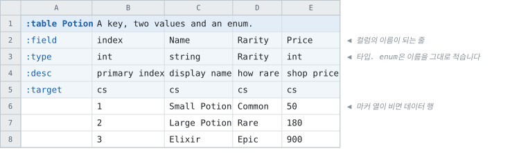

# 테이블 하나

<!-- 이 파일은 `doc/figures/showcase.py` 가 생성합니다. 손으로 고치지 마십시오 - 다음 실행이 덮어씁니다. -->

> [시트가 코드가 되는 모습으로](../generated-code.md)

---

가장 작은 테이블부터 봅니다. 여기서 읽는 것이 나머지 전부의 바탕입니다.

컬럼 넷짜리 테이블입니다. `:field` 가 이름을, `:type` 이 타입을,
`:desc` 가 설명을 정하고, 마커 열이 빈 행부터가 데이터입니다.

**첫 필드 컬럼이 기본 인덱스입니다.** 여기서는 `index` 가 그것입니다.

<!-- tabbit:pair -->



<!-- tabbit:tabs lang -->
<details data-lang="csharp" open>
<summary>C#</summary>

```csharp
[System.Serializable]
public partial class PotionRecord
{
    #region Values
    /// <summary>
    /// primary index
    /// </summary>
    public int Index => _index;

    /// <summary>
    /// display name
    /// </summary>
    public string Name => _name;

    /// <summary>
    /// how rare
    /// </summary>
    public global::Tabbit.Fixtures.DocShowcase.Rarity Rarity => _rarity;

    /// <summary>
    /// shop price
    /// </summary>
    public int Price => _price;
    #endregion

    #region Storage
    internal int _index;
    internal string _name = "";
    internal global::Tabbit.Fixtures.DocShowcase.Rarity _rarity;
    internal int _price;
    #endregion

    #region ToString
    public override string ToString()
    {
        var sb = new StringBuilder("{");
        sb.Append("\"Index\":"); ToStringHelper.ToString(Index, sb);
        sb.Append(",\"Name\":"); ToStringHelper.ToString(Name, sb);
        sb.Append(",\"Rarity\":"); ToStringHelper.ToString(Rarity, sb);
        sb.Append(",\"Price\":"); ToStringHelper.ToString(Price, sb);
        sb.Append("}");
        return sb.ToString();
    }
    #endregion
}
```

[PotionTable.cs](../../test/fixtures/golden/doc-showcase/csharp/tables/PotionTable.cs)

</details>
<details data-lang="typescript">
<summary>TypeScript</summary>

```typescript
// Generated from test/fixtures/xlsx/doc-showcase/doc-showcase.xlsx : Potion : B2
/** A key, two values and an enum. */
export class PotionRecord {
  /** Default constructor */
  constructor() {
  }

  /** primary index */
  public get index(): number { return this._index }

  /** display name */
  public get name(): string { return this._name }

  /** how rare */
  public get rarity(): Rarity { return this._rarity }

  /** shop price */
  public get price(): number { return this._price }

  public _index: number = 0
  public _name: string = ''
  public _rarity: Rarity = 0 as Rarity
  public _price: number = 0

  /** Populate field values. */
  public populateFieldValues(dataRow: IDataRow): void {
    this._index = dataRow.index
    this._name = dataRow.name
    this._rarity = dataRow.rarity
    this._price = dataRow.price
  }

  /** Populate field values. */
  public populateFieldValuesCompact(dataRow: any[]): void {
    let offset = 0
    this._index = dataRow[offset++]
    this._name = dataRow[offset++]
    this._rarity = dataRow[offset++]
    this._price = dataRow[offset++]
  }
}
```

[potion.ts](../../test/fixtures/golden/doc-showcase/typescript/tables/potion.ts)

</details>
<details data-lang="cpp">
<summary>C++</summary>

```cpp
// Generated from test/fixtures/xlsx/doc-showcase/doc-showcase.xlsx : Potion : B2
/// A key, two values and an enum.
struct PotionRecord {
  /// primary index
  std::int32_t index = 0;
  /// display name
  std::string name;
  /// how rare
  Rarity rarity = static_cast<Rarity>(0);
  /// shop price
  std::int32_t price = 0;
};
```

[DocShowcaseAccessor_potion.h](../../test/fixtures/golden/doc-showcase/cpp/tables/DocShowcaseAccessor_potion.h)

</details>
<details data-lang="python">
<summary>Python</summary>

```python
class PotionRecord:
    """Generated from test/fixtures/xlsx/doc-showcase/doc-showcase.xlsx : Potion : B2.

    A key, two values and an enum.
    """

    __slots__ = ("index", "name", "rarity", "price")

    def __init__(self):
        self.index = 0
        self.name = ""
        self.rarity = Rarity(0)
        self.price = 0

    def __repr__(self):
        return "PotionRecord(index=%r, name=%r, rarity=%r, price=%r)" % (self.index, self.name, self.rarity, self.price)
```

[potion_table.py](../../test/fixtures/golden/doc-showcase/python/doc_showcase_data/potion_table.py)

</details>
<details data-lang="c">
<summary>C</summary>

```c
/* Generated from test/fixtures/xlsx/doc-showcase/doc-showcase.xlsx : Potion : B2
 *
 * A key, two values and an enum.
 */
struct DocShowcase_PotionRecord_t {
  /* primary index */
  int32_t index;
  /* display name */
  const char* name;
  /* how rare */
  DocShowcase_Rarity_t rarity;
  /* shop price */
  int32_t price;
};
```

[DocShowcase_Potion.h](../../test/fixtures/golden/doc-showcase/c/tables/DocShowcase_Potion.h)

</details>
<details data-lang="dart">
<summary>Dart</summary>

```dart
// Generated from test/fixtures/xlsx/doc-showcase/doc-showcase.xlsx : Potion : B2
/// A key, two values and an enum.
class PotionRecord {
  /// primary index
  int index = 0;
  /// display name
  String name = '';
  /// how rare
  Rarity rarity = Rarity.of(0);
  /// shop price
  int price = 0;

}
```

[potion_table.dart](../../test/fixtures/golden/doc-showcase/dart/tables/potion_table.dart)

</details>
<details data-lang="go">
<summary>Go</summary>

```go
// PotionRecord was generated from test/fixtures/xlsx/doc-showcase/doc-showcase.xlsx : Potion : B2.
// A key, two values and an enum.
type PotionRecord struct {
	// primary index
	Index int32
	// display name
	Name string
	// how rare
	Rarity Rarity
	// shop price
	Price int32
}
```

[potion_table.go](../../test/fixtures/golden/doc-showcase/go/potion_table.go)

</details>
<details data-lang="java">
<summary>Java</summary>

```java
// Generated from test/fixtures/xlsx/doc-showcase/doc-showcase.xlsx : Potion : B2
/** A key, two values and an enum. */
public final class PotionRecord {
    /** primary index */
    public int index;
    /** display name */
    public String name = "";
    /** how rare */
    public Rarity rarity = Rarity.of(0);
    /** shop price */
    public int price;

}
```

[PotionRecord.java](../../test/fixtures/golden/doc-showcase/java/tabbit/fixtures/docshowcase/PotionRecord.java)

</details>
<details data-lang="kotlin">
<summary>Kotlin</summary>

```kotlin
// Generated from test/fixtures/xlsx/doc-showcase/doc-showcase.xlsx : Potion : B2
/** A key, two values and an enum. */
class PotionRecord {
    /** primary index */
    var index: Int = 0
    /** display name */
    var name: String = ""
    /** how rare */
    var rarity: Rarity = Rarity.of(0)
    /** shop price */
    var price: Int = 0

}
```

[PotionTable.kt](../../test/fixtures/golden/doc-showcase/kotlin/tabbit/fixtures/docshowcase/tables/PotionTable.kt)

</details>
<details data-lang="lua">
<summary>Lua</summary>

```lua
-- Generated from test/fixtures/xlsx/doc-showcase/doc-showcase.xlsx : Potion : B2.
-- A key, two values and an enum.
---@class PotionRecord
---@field index integer
---@field name string
---@field rarity integer
---@field price integer
local PotionRecordMeta = tcb.strictType("a `Potion` row", { "index", "name", "rarity", "price" })
```

[potion_table.lua](../../test/fixtures/golden/doc-showcase/lua/tables/potion_table.lua)

</details>
<details data-lang="php">
<summary>PHP</summary>

```php
/**
 * Generated from test/fixtures/xlsx/doc-showcase/doc-showcase.xlsx : Potion : B2
 *
 * A key, two values and an enum.
 */
final class PotionRecord
{
    /** primary index */
    public int $index = 0;
    /** display name */
    public string $name = '';
    /** how rare */
    public Rarity $rarity = Rarity::None;
    /** shop price */
    public int $price = 0;
}
```

[PotionTable.php](../../test/fixtures/golden/doc-showcase/php/tables/PotionTable.php)

</details>
<details data-lang="ruby">
<summary>Ruby</summary>

```ruby
# Generated from test/fixtures/xlsx/doc-showcase/doc-showcase.xlsx : Potion : B2
# A key, two values and an enum.
class PotionRecord
  attr_accessor :index, :name, :rarity, :price

  def initialize
    @index = 0
    @name = ''
    @rarity = 0
    @price = 0
  end
```

[potion_table.rb](../../test/fixtures/golden/doc-showcase/ruby/tables/potion_table.rb)

</details>
<details data-lang="rust">
<summary>Rust</summary>

```rust
// Generated from test/fixtures/xlsx/doc-showcase/doc-showcase.xlsx : Potion : B2
/// A key, two values and an enum.
#[derive(Clone, Debug, Default)]
pub struct PotionRecord {
    /// primary index
    pub index: i32,
    /// display name
    pub name: String,
    /// how rare
    pub rarity: Rarity,
    /// shop price
    pub price: i32,
}
```

[potion_table.rs](../../test/fixtures/golden/doc-showcase/rust/src/potion_table.rs)

</details>
<details data-lang="swift">
<summary>Swift</summary>

```swift
// Generated from test/fixtures/xlsx/doc-showcase/doc-showcase.xlsx : Potion : B2
/// A key, two values and an enum.
public final class PotionRecord {

    public init() {}

    /// primary index
    public var index: Int32 = 0

    /// display name
    public var name: String = ""

    /// how rare
    public var rarity: Rarity = Rarity.of(0)

    /// shop price
    public var price: Int32 = 0
}
```

[PotionTable.swift](../../test/fixtures/golden/doc-showcase/swift/tables/PotionTable.swift)

</details>
<details data-lang="unreal">
<summary>Unreal</summary>

```cpp
// Generated from test/fixtures/xlsx/doc-showcase/doc-showcase.xlsx : Potion : B2
/** A key, two values and an enum. */
USTRUCT(BlueprintType)
struct DOCSHOWCASE_API FPotionRow
{
    GENERATED_BODY()

    /** primary index */
    UPROPERTY(EditAnywhere, BlueprintReadOnly, Category = "Potion")
    int32 Index = 0;

    /** display name */
    UPROPERTY(EditAnywhere, BlueprintReadOnly, Category = "Potion")
    FString Name;

    /** how rare */
    UPROPERTY(EditAnywhere, BlueprintReadOnly, Category = "Potion")
    ERarity Rarity = static_cast<ERarity>(0);

    /** shop price */
    UPROPERTY(EditAnywhere, BlueprintReadOnly, Category = "Potion")
    int32 Price = 0;

};
```

[FDocShowcase.h](../../test/fixtures/golden/doc-showcase/unreal/Source/DocShowcase/Public/FDocShowcase.h)

</details>
<!-- /tabbit:tabs -->

<!-- /tabbit:pair -->

읽을 것이 셋 있습니다.

- **컬럼 하나가 멤버 하나입니다.** 이름은 각 언어의 관례를 따라 바뀌지만 순서는 시트의 순서
  그대로입니다.
- **`:desc` 에 적은 설명이 doc comment로 나갑니다.** 시트에 적어 두면 IDE의 툴팁까지 갑니다.
- **`Rarity` 컬럼의 타입이 enum 타입입니다.** 정수가 아닙니다 — 시트에 `Common` 이라고 적고
  코드에서도 `Rarity` 로 받습니다.

조회 함수는 여기 없습니다. 레코드는 값이고, 찾는 일은 테이블이 합니다 —
[행을 찾는 방법](keys.md)에 있습니다.
