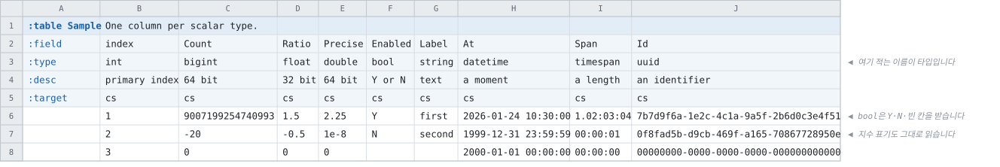

# 적을 수 있는 타입

<!-- 이 파일은 `doc/figures/showcase.py` 가 생성합니다. 손으로 고치지 마십시오 - 다음 실행이 덮어씁니다. -->

> [시트가 코드가 되는 모습으로](../generated-code.md)

---

`:type` 칸에 적을 수 있는 스칼라를 한 테이블에 모았습니다. **타입은 한 칸에
하나씩 적습니다** — 타입과 세부 타입을 두 줄에 나눠 적던 자리가 없습니다.

`int` · `bigint` · `float` · `double` · `bool` · `string` ·
`datetime` · `timespan` · `uuid` 아홉입니다.



<!-- tabbit:tabs lang -->
<details data-lang="csharp" open>
<summary>C#</summary>

```csharp
[System.Serializable]
public partial class SampleRecord
{
    #region Values
    /// <summary>
    /// primary index
    /// </summary>
    public int Index => _index;

    /// <summary>
    /// 64 bit
    /// </summary>
    public long Count => _count;

    /// <summary>
    /// 32 bit
    /// </summary>
    public float Ratio => _ratio;

    /// <summary>
    /// 64 bit
    /// </summary>
    public double Precise => _precise;

    /// <summary>
    /// Y or N
    /// </summary>
    public bool Enabled => _enabled;

    /// <summary>
    /// text
    /// </summary>
    public string Label => _label;

    /// <summary>
    /// a moment
    /// </summary>
    public System.DateTime At => _at;

    /// <summary>
    /// a length
    /// </summary>
    public System.TimeSpan Span => _span;

    /// <summary>
    /// an identifier
    /// </summary>
    public System.Guid Id => _id;
    #endregion

    #region Storage
    internal int _index;
    internal long _count;
    internal float _ratio;
    internal double _precise;
    internal bool _enabled;
    internal string _label = "";
    internal System.DateTime _at;
    internal System.TimeSpan _span;
    internal System.Guid _id;
    #endregion

    #region ToString
    public override string ToString()
    {
        var sb = new StringBuilder("{");
        sb.Append("\"Index\":"); ToStringHelper.ToString(Index, sb);
        sb.Append(",\"Count\":"); ToStringHelper.ToString(Count, sb);
        sb.Append(",\"Ratio\":"); ToStringHelper.ToString(Ratio, sb);
        sb.Append(",\"Precise\":"); ToStringHelper.ToString(Precise, sb);
        sb.Append(",\"Enabled\":"); ToStringHelper.ToString(Enabled, sb);
        sb.Append(",\"Label\":"); ToStringHelper.ToString(Label, sb);
        sb.Append(",\"At\":"); ToStringHelper.ToString(At, sb);
        sb.Append(",\"Span\":"); ToStringHelper.ToString(Span, sb);
        sb.Append(",\"Id\":"); ToStringHelper.ToString(Id, sb);
        sb.Append("}");
        return sb.ToString();
    }
    #endregion
}
```

[SampleTable.cs](../../test/fixtures/golden/doc-showcase/csharp/tables/SampleTable.cs)

</details>
<details data-lang="typescript">
<summary>TypeScript</summary>

```typescript
// Generated from test/fixtures/xlsx/doc-showcase/doc-showcase.xlsx : Types : B2
/** One column per scalar type. */
export class SampleRecord {
  /** Default constructor */
  constructor() {
  }

  /** primary index */
  public get index(): number { return this._index }

  /** 64 bit */
  public get count(): bigint { return this._count }

  /** 32 bit */
  public get ratio(): number { return this._ratio }

  /** 64 bit */
  public get precise(): number { return this._precise }

  /** Y or N */
  public get enabled(): boolean { return this._enabled }

  /** text */
  public get label(): string { return this._label }

  /** a moment */
  public get at(): string { return this._at }

  /** a length */
  public get span(): string { return this._span }

  /** an identifier */
  public get id(): string { return this._id }

  public _index: number = 0
  public _count: bigint = 0n
  public _ratio: number = 0
  public _precise: number = 0
  public _enabled: boolean = false
  public _label: string = ''
  public _at: string = ''
  public _span: string = ''
  public _id: string = ''

  /** Populate field values. */
  public populateFieldValues(dataRow: IDataRow): void {
    this._index = dataRow.index
    this._count = BigInt(dataRow.count)
    this._ratio = Math.fround(dataRow.ratio)
    this._precise = dataRow.precise
    this._enabled = dataRow.enabled
    this._label = dataRow.label
    this._at = dataRow.at
    this._span = dataRow.span
    this._id = dataRow.id
  }

  /** Populate field values. */
  public populateFieldValuesCompact(dataRow: any[]): void {
    let offset = 0
    this._index = dataRow[offset++]
    this._count = BigInt(dataRow[offset++])
    this._ratio = Math.fround(dataRow[offset++])
    this._precise = dataRow[offset++]
    this._enabled = dataRow[offset++]
    this._label = dataRow[offset++]
    this._at = dataRow[offset++]
    this._span = dataRow[offset++]
    this._id = dataRow[offset++]
  }
}
```

[sample.ts](../../test/fixtures/golden/doc-showcase/typescript/tables/sample.ts)

</details>
<details data-lang="cpp">
<summary>C++</summary>

```cpp
// Generated from test/fixtures/xlsx/doc-showcase/doc-showcase.xlsx : Types : B2
/// One column per scalar type.
struct SampleRecord {
  /// primary index
  std::int32_t index = 0;
  /// 64 bit
  std::int64_t count = 0;
  /// 32 bit
  float ratio = 0.0f;
  /// 64 bit
  double precise = 0.0;
  /// Y or N
  bool enabled = false;
  /// text
  std::string label;
  /// a moment
  tabbit::DateTime at;
  /// a length
  tabbit::TimeSpan span;
  /// an identifier
  tabbit::Uuid id;
};
```

[DocShowcaseAccessor_sample.h](../../test/fixtures/golden/doc-showcase/cpp/tables/DocShowcaseAccessor_sample.h)

</details>
<details data-lang="python">
<summary>Python</summary>

```python
class SampleRecord:
    """Generated from test/fixtures/xlsx/doc-showcase/doc-showcase.xlsx : Types : B2.

    One column per scalar type.
    """

    __slots__ = ("index", "count", "ratio", "precise", "enabled", "label", "at", "span", "id")

    def __init__(self):
        self.index = 0
        self.count = 0
        self.ratio = 0.0
        self.precise = 0.0
        self.enabled = False
        self.label = ""
        self.at = 0
        self.span = 0
        self.id = tabbit.Uuid()

    def __repr__(self):
        return "SampleRecord(index=%r, count=%r, ratio=%r, precise=%r, enabled=%r, label=%r, at=%r, span=%r, id=%r)" % (self.index, self.count, self.ratio, self.precise, self.enabled, self.label, self.at, self.span, self.id)
```

[sample_table.py](../../test/fixtures/golden/doc-showcase/python/doc_showcase_data/sample_table.py)

</details>
<details data-lang="c">
<summary>C</summary>

```c
/* Generated from test/fixtures/xlsx/doc-showcase/doc-showcase.xlsx : Types : B2
 *
 * One column per scalar type.
 */
struct DocShowcase_SampleRecord_t {
  /* primary index */
  int32_t index;
  /* 64 bit */
  int64_t count;
  /* 32 bit */
  float ratio;
  /* 64 bit */
  double precise;
  /* Y or N */
  bool enabled;
  /* text */
  const char* label;
  /* a moment */
  int64_t at;
  /* a length */
  int64_t span;
  /* an identifier */
  tb_uuid id;
};
```

[DocShowcase_Sample.h](../../test/fixtures/golden/doc-showcase/c/tables/DocShowcase_Sample.h)

</details>
<details data-lang="dart">
<summary>Dart</summary>

```dart
// Generated from test/fixtures/xlsx/doc-showcase/doc-showcase.xlsx : Types : B2
/// One column per scalar type.
class SampleRecord {
  /// primary index
  int index = 0;
  /// 64 bit
  BigInt count = BigInt.zero;
  /// 32 bit
  double ratio = 0.0;
  /// 64 bit
  double precise = 0.0;
  /// Y or N
  bool enabled = false;
  /// text
  String label = '';
  /// a moment
  BigInt at = BigInt.zero;
  /// a length
  BigInt span = BigInt.zero;
  /// an identifier
  Uuid id = Uuid.empty();

}
```

[sample_table.dart](../../test/fixtures/golden/doc-showcase/dart/tables/sample_table.dart)

</details>
<details data-lang="go">
<summary>Go</summary>

```go
// SampleRecord was generated from test/fixtures/xlsx/doc-showcase/doc-showcase.xlsx : Types : B2.
// One column per scalar type.
type SampleRecord struct {
	// primary index
	Index int32
	// 64 bit
	Count int64
	// 32 bit
	Ratio float32
	// 64 bit
	Precise float64
	// Y or N
	Enabled bool
	// text
	Label string
	// a moment
	At int64
	// a length
	Span int64
	// an identifier
	Id tabbit.UUID
}
```

[sample_table.go](../../test/fixtures/golden/doc-showcase/go/sample_table.go)

</details>
<details data-lang="java">
<summary>Java</summary>

```java
// Generated from test/fixtures/xlsx/doc-showcase/doc-showcase.xlsx : Types : B2
/** One column per scalar type. */
public final class SampleRecord {
    /** primary index */
    public int index;
    /** 64 bit */
    public long count;
    /** 32 bit */
    public float ratio;
    /** 64 bit */
    public double precise;
    /** Y or N */
    public boolean enabled;
    /** text */
    public String label = "";
    /** a moment */
    public long at;
    /** a length */
    public long span;
    /** an identifier */
    public TcbReader.Uuid id = TcbReader.Uuid.empty();

}
```

[SampleRecord.java](../../test/fixtures/golden/doc-showcase/java/tabbit/fixtures/docshowcase/SampleRecord.java)

</details>
<details data-lang="kotlin">
<summary>Kotlin</summary>

```kotlin
// Generated from test/fixtures/xlsx/doc-showcase/doc-showcase.xlsx : Types : B2
/** One column per scalar type. */
class SampleRecord {
    /** primary index */
    var index: Int = 0
    /** 64 bit */
    var count: Long = 0L
    /** 32 bit */
    var ratio: Float = 0.0f
    /** 64 bit */
    var precise: Double = 0.0
    /** Y or N */
    var enabled: Boolean = false
    /** text */
    var label: String = ""
    /** a moment */
    var at: Long = 0L
    /** a length */
    var span: Long = 0L
    /** an identifier */
    var id: Uuid = Uuid()

}
```

[SampleTable.kt](../../test/fixtures/golden/doc-showcase/kotlin/tabbit/fixtures/docshowcase/tables/SampleTable.kt)

</details>
<details data-lang="lua">
<summary>Lua</summary>

```lua
-- Generated from test/fixtures/xlsx/doc-showcase/doc-showcase.xlsx : Types : B2.
-- One column per scalar type.
---@class SampleRecord
---@field index integer
---@field count integer
---@field ratio number
---@field precise number
---@field enabled boolean
---@field label string
---@field at integer
---@field span integer
---@field id string
local SampleRecordMeta = tcb.strictType("a `Sample` row", { "index", "count", "ratio", "precise", "enabled", "label", "at", "span", "id" })
```

[sample_table.lua](../../test/fixtures/golden/doc-showcase/lua/tables/sample_table.lua)

</details>
<details data-lang="php">
<summary>PHP</summary>

```php
/**
 * Generated from test/fixtures/xlsx/doc-showcase/doc-showcase.xlsx : Types : B2
 *
 * One column per scalar type.
 */
final class SampleRecord
{
    /** primary index */
    public int $index = 0;
    /** 64 bit */
    public int $count = 0;
    /** 32 bit */
    public float $ratio = 0.0;
    /** 64 bit */
    public float $precise = 0.0;
    /** Y or N */
    public bool $enabled = false;
    /** text */
    public string $label = '';
    /** a moment */
    public int $at = 0;
    /** a length */
    public int $span = 0;
    /** an identifier */
    public ?Uuid $id = null;
}
```

[SampleTable.php](../../test/fixtures/golden/doc-showcase/php/tables/SampleTable.php)

</details>
<details data-lang="ruby">
<summary>Ruby</summary>

```ruby
# Generated from test/fixtures/xlsx/doc-showcase/doc-showcase.xlsx : Types : B2
# One column per scalar type.
class SampleRecord
  attr_accessor :index, :count, :ratio, :precise, :enabled, :label, :at, :span, :id

  def initialize
    @index = 0
    @count = 0
    @ratio = 0.0
    @precise = 0.0
    @enabled = false
    @label = ''
    @at = 0
    @span = 0
    @id = Tabbit::Uuid.new
  end
```

[sample_table.rb](../../test/fixtures/golden/doc-showcase/ruby/tables/sample_table.rb)

</details>
<details data-lang="rust">
<summary>Rust</summary>

```rust
// Generated from test/fixtures/xlsx/doc-showcase/doc-showcase.xlsx : Types : B2
/// One column per scalar type.
#[derive(Clone, Debug, Default)]
pub struct SampleRecord {
    /// primary index
    pub index: i32,
    /// 64 bit
    pub count: i64,
    /// 32 bit
    pub ratio: f32,
    /// 64 bit
    pub precise: f64,
    /// Y or N
    pub enabled: bool,
    /// text
    pub label: String,
    /// a moment
    pub at: i64,
    /// a length
    pub span: i64,
    /// an identifier
    pub id: tabbit::Uuid,
}
```

[sample_table.rs](../../test/fixtures/golden/doc-showcase/rust/src/sample_table.rs)

</details>
<details data-lang="swift">
<summary>Swift</summary>

```swift
// Generated from test/fixtures/xlsx/doc-showcase/doc-showcase.xlsx : Types : B2
/// One column per scalar type.
public final class SampleRecord {

    public init() {}

    /// primary index
    public var index: Int32 = 0

    /// 64 bit
    public var count: Int64 = 0

    /// 32 bit
    public var ratio: Float = 0

    /// 64 bit
    public var precise: Double = 0

    /// Y or N
    public var enabled: Bool = false

    /// text
    public var label: String = ""

    /// a moment
    public var at: Int64 = 0

    /// a length
    public var span: Int64 = 0

    /// an identifier
    public var id: Tcb.Uuid = Tcb.Uuid()
}
```

[SampleTable.swift](../../test/fixtures/golden/doc-showcase/swift/tables/SampleTable.swift)

</details>
<details data-lang="unreal">
<summary>Unreal</summary>

```cpp
// Generated from test/fixtures/xlsx/doc-showcase/doc-showcase.xlsx : Types : B2
/** One column per scalar type. */
USTRUCT(BlueprintType)
struct DOCSHOWCASE_API FSampleRow
{
    GENERATED_BODY()

    /** primary index */
    UPROPERTY(EditAnywhere, BlueprintReadOnly, Category = "Sample")
    int32 Index = 0;

    /** 64 bit */
    UPROPERTY(EditAnywhere, BlueprintReadOnly, Category = "Sample")
    int64 Count = 0;

    /** 32 bit */
    UPROPERTY(EditAnywhere, BlueprintReadOnly, Category = "Sample")
    float Ratio = 0.0f;

    /** 64 bit */
    // No UPROPERTY: UE4's header tool does not accept a double property.
    double Precise = 0.0;

    /** Y or N */
    UPROPERTY(EditAnywhere, BlueprintReadOnly, Category = "Sample")
    bool bEnabled = false;

    /** text */
    UPROPERTY(EditAnywhere, BlueprintReadOnly, Category = "Sample")
    FString Label;

    /** a moment */
    UPROPERTY(EditAnywhere, BlueprintReadOnly, Category = "Sample")
    FDateTime At;

    /** a length */
    UPROPERTY(EditAnywhere, BlueprintReadOnly, Category = "Sample")
    FTimespan Span;

    /** an identifier */
    UPROPERTY(EditAnywhere, BlueprintReadOnly, Category = "Sample")
    FGuid Id;

};
```

[FDocShowcase.h](../../test/fixtures/golden/doc-showcase/unreal/Source/DocShowcase/Public/FDocShowcase.h)

</details>
<!-- /tabbit:tabs -->

**언어마다 폭을 다르게 부릅니다.** `bigint` 하나가 C#에서는 `long`,
C++에서는 `int64_t`, Rust에서는 `i64` 입니다 — 값은 같고 부르는 이름만 다릅니다.

`datetime` · `timespan` · `uuid` 는 그 언어에 해당하는 타입이 있으면 그것으로, 없으면
그 언어가 쓰는 표현으로 나옵니다.

빈 칸의 뜻은 타입마다 다릅니다 —
[빈 칸의 뜻](../sheets/rules-and-pitfalls.md#빈-칸의-뜻--자리별-총정리)에 자리별로
정리되어 있습니다.
