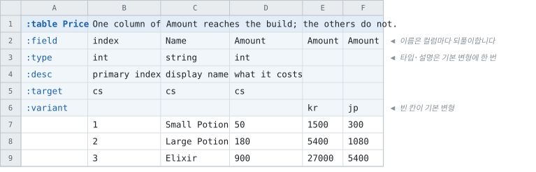

# 같은 필드를 여러 벌 적기

<!-- 이 파일은 `doc/figures/showcase.py` 가 생성합니다. 손으로 고치지 마십시오 - 다음 실행이 덮어씁니다. -->

> [시트가 코드가 되는 모습으로](../generated-code.md)

---

컬럼 하나만 갈리고 나머지가 공유되는 데이터가 있습니다. 테이블을 여러 벌
만들 것도, 컬럼 이름에 지역을 붙일 것도 없습니다 — **같은 이름으로 여러 벌 적고 빌드가 하나를
고릅니다.**

같은 필드 이름을 컬럼 여러 개에 적고 `:variant` 행이 구분합니다.
**빈 칸이 기본 변형**이고, 타입과 설명은 그 컬럼에 한 번만 적습니다.

고르는 것은 recipe의 `"Variants": { "Price.Amount": "kr" }` 또는 CLI의
`--variant Price.Amount=kr` 이고, 명령줄이 recipe를 덮습니다.

<!-- tabbit:pair -->



<!-- tabbit:tabs lang -->
<details data-lang="csharp" open>
<summary>C#</summary>

```csharp
[System.Serializable]
public partial class PriceRecord
{
    #region Values
    /// <summary>
    /// primary index
    /// </summary>
    public int Index => _index;

    /// <summary>
    /// display name
    /// </summary>
    public string Name => _name;

    /// <summary>
    /// what it costs
    /// </summary>
    public int Amount => _amount;
    #endregion

    #region Storage
    internal int _index;
    internal string _name = "";
    internal int _amount;
    #endregion

    #region ToString
    public override string ToString()
    {
        var sb = new StringBuilder("{");
        sb.Append("\"Index\":"); ToStringHelper.ToString(Index, sb);
        sb.Append(",\"Name\":"); ToStringHelper.ToString(Name, sb);
        sb.Append(",\"Amount\":"); ToStringHelper.ToString(Amount, sb);
        sb.Append("}");
        return sb.ToString();
    }
    #endregion
}
```

[PriceTable.cs](../../test/fixtures/golden/doc-showcase/csharp/tables/PriceTable.cs)

</details>
<details data-lang="typescript">
<summary>TypeScript</summary>

```typescript
// Generated from test/fixtures/xlsx/doc-showcase/doc-showcase.xlsx : Price : B2
/** One column of Amount reaches the build; the others do not. */
export class PriceRecord {
  /** Default constructor */
  constructor() {
  }

  /** primary index */
  public get index(): number { return this._index }

  /** display name */
  public get name(): string { return this._name }

  /** what it costs */
  public get amount(): number { return this._amount }

  public _index: number = 0
  public _name: string = ''
  public _amount: number = 0

  /** Populate field values. */
  public populateFieldValues(dataRow: IDataRow): void {
    this._index = dataRow.index
    this._name = dataRow.name
    this._amount = dataRow.amount
  }

  /** Populate field values. */
  public populateFieldValuesCompact(dataRow: any[]): void {
    let offset = 0
    this._index = dataRow[offset++]
    this._name = dataRow[offset++]
    this._amount = dataRow[offset++]
  }
}
```

[price.ts](../../test/fixtures/golden/doc-showcase/typescript/tables/price.ts)

</details>
<details data-lang="cpp">
<summary>C++</summary>

```cpp
// Generated from test/fixtures/xlsx/doc-showcase/doc-showcase.xlsx : Price : B2
/// One column of Amount reaches the build; the others do not.
struct PriceRecord {
  /// primary index
  std::int32_t index = 0;
  /// display name
  std::string name;
  /// what it costs
  std::int32_t amount = 0;
};
```

[DocShowcaseAccessor_price.h](../../test/fixtures/golden/doc-showcase/cpp/tables/DocShowcaseAccessor_price.h)

</details>
<details data-lang="python">
<summary>Python</summary>

```python
class PriceRecord:
    """Generated from test/fixtures/xlsx/doc-showcase/doc-showcase.xlsx : Price : B2.

    One column of Amount reaches the build; the others do not.
    """

    __slots__ = ("index", "name", "amount")

    def __init__(self):
        self.index = 0
        self.name = ""
        self.amount = 0

    def __repr__(self):
        return "PriceRecord(index=%r, name=%r, amount=%r)" % (self.index, self.name, self.amount)
```

[price_table.py](../../test/fixtures/golden/doc-showcase/python/doc_showcase_data/price_table.py)

</details>
<details data-lang="c">
<summary>C</summary>

```c
/* Generated from test/fixtures/xlsx/doc-showcase/doc-showcase.xlsx : Price : B2
 *
 * One column of Amount reaches the build; the others do not.
 */
struct DocShowcase_PriceRecord_t {
  /* primary index */
  int32_t index;
  /* display name */
  const char* name;
  /* what it costs */
  int32_t amount;
};
```

[DocShowcase_Price.h](../../test/fixtures/golden/doc-showcase/c/tables/DocShowcase_Price.h)

</details>
<details data-lang="dart">
<summary>Dart</summary>

```dart
// Generated from test/fixtures/xlsx/doc-showcase/doc-showcase.xlsx : Price : B2
/// One column of Amount reaches the build; the others do not.
class PriceRecord {
  /// primary index
  int index = 0;
  /// display name
  String name = '';
  /// what it costs
  int amount = 0;

}
```

[price_table.dart](../../test/fixtures/golden/doc-showcase/dart/tables/price_table.dart)

</details>
<details data-lang="go">
<summary>Go</summary>

```go
// PriceRecord was generated from test/fixtures/xlsx/doc-showcase/doc-showcase.xlsx : Price : B2.
// One column of Amount reaches the build; the others do not.
type PriceRecord struct {
	// primary index
	Index int32
	// display name
	Name string
	// what it costs
	Amount int32
}
```

[price_table.go](../../test/fixtures/golden/doc-showcase/go/price_table.go)

</details>
<details data-lang="java">
<summary>Java</summary>

```java
// Generated from test/fixtures/xlsx/doc-showcase/doc-showcase.xlsx : Price : B2
/** One column of Amount reaches the build; the others do not. */
public final class PriceRecord {
    /** primary index */
    public int index;
    /** display name */
    public String name = "";
    /** what it costs */
    public int amount;

}
```

[PriceRecord.java](../../test/fixtures/golden/doc-showcase/java/tabbit/fixtures/docshowcase/PriceRecord.java)

</details>
<details data-lang="kotlin">
<summary>Kotlin</summary>

```kotlin
// Generated from test/fixtures/xlsx/doc-showcase/doc-showcase.xlsx : Price : B2
/** One column of Amount reaches the build; the others do not. */
class PriceRecord {
    /** primary index */
    var index: Int = 0
    /** display name */
    var name: String = ""
    /** what it costs */
    var amount: Int = 0

}
```

[PriceTable.kt](../../test/fixtures/golden/doc-showcase/kotlin/tabbit/fixtures/docshowcase/tables/PriceTable.kt)

</details>
<details data-lang="lua">
<summary>Lua</summary>

```lua
-- Generated from test/fixtures/xlsx/doc-showcase/doc-showcase.xlsx : Price : B2.
-- One column of Amount reaches the build; the others do not.
---@class PriceRecord
---@field index integer
---@field name string
---@field amount integer
local PriceRecordMeta = tcb.strictType("a `Price` row", { "index", "name", "amount" })
```

[price_table.lua](../../test/fixtures/golden/doc-showcase/lua/tables/price_table.lua)

</details>
<details data-lang="php">
<summary>PHP</summary>

```php
/**
 * Generated from test/fixtures/xlsx/doc-showcase/doc-showcase.xlsx : Price : B2
 *
 * One column of Amount reaches the build; the others do not.
 */
final class PriceRecord
{
    /** primary index */
    public int $index = 0;
    /** display name */
    public string $name = '';
    /** what it costs */
    public int $amount = 0;
}
```

[PriceTable.php](../../test/fixtures/golden/doc-showcase/php/tables/PriceTable.php)

</details>
<details data-lang="ruby">
<summary>Ruby</summary>

```ruby
# Generated from test/fixtures/xlsx/doc-showcase/doc-showcase.xlsx : Price : B2
# One column of Amount reaches the build; the others do not.
class PriceRecord
  attr_accessor :index, :name, :amount

  def initialize
    @index = 0
    @name = ''
    @amount = 0
  end
```

[price_table.rb](../../test/fixtures/golden/doc-showcase/ruby/tables/price_table.rb)

</details>
<details data-lang="rust">
<summary>Rust</summary>

```rust
// Generated from test/fixtures/xlsx/doc-showcase/doc-showcase.xlsx : Price : B2
/// One column of Amount reaches the build; the others do not.
#[derive(Clone, Debug, Default)]
pub struct PriceRecord {
    /// primary index
    pub index: i32,
    /// display name
    pub name: String,
    /// what it costs
    pub amount: i32,
}
```

[price_table.rs](../../test/fixtures/golden/doc-showcase/rust/src/price_table.rs)

</details>
<details data-lang="swift">
<summary>Swift</summary>

```swift
// Generated from test/fixtures/xlsx/doc-showcase/doc-showcase.xlsx : Price : B2
/// One column of Amount reaches the build; the others do not.
public final class PriceRecord {

    public init() {}

    /// primary index
    public var index: Int32 = 0

    /// display name
    public var name: String = ""

    /// what it costs
    public var amount: Int32 = 0
}
```

[PriceTable.swift](../../test/fixtures/golden/doc-showcase/swift/tables/PriceTable.swift)

</details>
<details data-lang="unreal">
<summary>Unreal</summary>

```cpp
// Generated from test/fixtures/xlsx/doc-showcase/doc-showcase.xlsx : Price : B2
/** One column of Amount reaches the build; the others do not. */
USTRUCT(BlueprintType)
struct DOCSHOWCASE_API FPriceRow
{
    GENERATED_BODY()

    /** primary index */
    UPROPERTY(EditAnywhere, BlueprintReadOnly, Category = "Price")
    int32 Index = 0;

    /** display name */
    UPROPERTY(EditAnywhere, BlueprintReadOnly, Category = "Price")
    FString Name;

    /** what it costs */
    UPROPERTY(EditAnywhere, BlueprintReadOnly, Category = "Price")
    int32 Amount = 0;

};
```

[FDocShowcase.h](../../test/fixtures/golden/doc-showcase/unreal/Source/DocShowcase/Public/FDocShowcase.h)

</details>
<!-- /tabbit:tabs -->

<!-- /tabbit:pair -->

**산출물은 변형을 모릅니다.** `Amount` 멤버 하나뿐이고, 이름에도
타입에도 어느 변형이었는지가 남지 않습니다 — 고른 컬럼 하나가 그 필드가 되고 나머지는 그
빌드에 없습니다.

위는 변형을 지정하지 않은 빌드이므로 기본 변형이 실렸습니다. `--variant Price.Amount=kr` 로
빌드하면 **같은 코드**에 값만 달라집니다.

키 컬럼과 그룹 컬럼에는 변형을 둘 수 없습니다.
