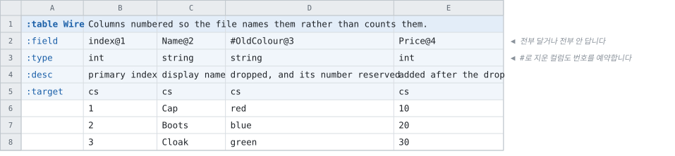

# 컬럼에 번호 달기

<!-- 이 파일은 `doc/figures/showcase.py` 가 생성합니다. 손으로 고치지 마십시오 - 다음 실행이 덮어씁니다. -->

> [시트가 코드가 되는 모습으로](../generated-code.md)

---

이름 뒤에 `@N` 을 달면 바이너리 파일이 컬럼을 **위치가 아니라 번호로**
가리킵니다. 이미 배포된 클라이언트가 컬럼 순서 변경을 견디게 하는 장치입니다.

한 테이블 안에서 **전부 달거나 전부 안 답니다.** 지운 컬럼은
`#이름@N` 으로 남겨 그 번호를 예약합니다.



<!-- tabbit:tabs lang -->
<details data-lang="csharp" open>
<summary>C#</summary>

```csharp
[System.Serializable]
public partial class WireRecord
{
    #region Values
    /// <summary>
    /// primary index
    /// </summary>
    public int Index => _index;

    /// <summary>
    /// display name
    /// </summary>
    public string Name => _name;

    /// <summary>
    /// added after the drop
    /// </summary>
    public int Price => _price;
    #endregion

    #region Storage
    internal int _index;
    internal string _name = "";
    internal int _price;
    #endregion

    #region ToString
    public override string ToString()
    {
        var sb = new StringBuilder("{");
        sb.Append("\"Index\":"); ToStringHelper.ToString(Index, sb);
        sb.Append(",\"Name\":"); ToStringHelper.ToString(Name, sb);
        sb.Append(",\"Price\":"); ToStringHelper.ToString(Price, sb);
        sb.Append("}");
        return sb.ToString();
    }
    #endregion
}
```

[WireTable.cs](../../test/fixtures/golden/doc-showcase/csharp/tables/WireTable.cs)

</details>
<details data-lang="typescript">
<summary>TypeScript</summary>

```typescript
// Generated from test/fixtures/xlsx/doc-showcase/doc-showcase.xlsx : Index : G2
/** Columns numbered so the file names them rather than counts them. */
export class WireRecord {
  /** Default constructor */
  constructor() {
  }

  /** primary index */
  public get index(): number { return this._index }

  /** display name */
  public get name(): string { return this._name }

  /** added after the drop */
  public get price(): number { return this._price }

  public _index: number = 0
  public _name: string = ''
  public _price: number = 0

  /** Populate field values. */
  public populateFieldValues(dataRow: IDataRow): void {
    this._index = dataRow.index
    this._name = dataRow.name
    this._price = dataRow.price
  }

  /** Populate field values. */
  public populateFieldValuesCompact(dataRow: any[]): void {
    let offset = 0
    this._index = dataRow[offset++]
    this._name = dataRow[offset++]
    this._price = dataRow[offset++]
  }
}
```

[wire.ts](../../test/fixtures/golden/doc-showcase/typescript/tables/wire.ts)

</details>
<details data-lang="cpp">
<summary>C++</summary>

```cpp
// Generated from test/fixtures/xlsx/doc-showcase/doc-showcase.xlsx : Index : G2
/// Columns numbered so the file names them rather than counts them.
struct WireRecord {
  /// primary index
  std::int32_t index = 0;
  /// display name
  std::string name;
  /// added after the drop
  std::int32_t price = 0;
};
```

[DocShowcaseAccessor_wire.h](../../test/fixtures/golden/doc-showcase/cpp/tables/DocShowcaseAccessor_wire.h)

</details>
<details data-lang="python">
<summary>Python</summary>

```python
class WireRecord:
    """Generated from test/fixtures/xlsx/doc-showcase/doc-showcase.xlsx : Index : G2.

    Columns numbered so the file names them rather than counts them.
    """

    __slots__ = ("index", "name", "price")

    def __init__(self):
        self.index = 0
        self.name = ""
        self.price = 0

    def __repr__(self):
        return "WireRecord(index=%r, name=%r, price=%r)" % (self.index, self.name, self.price)
```

[wire_table.py](../../test/fixtures/golden/doc-showcase/python/doc_showcase_data/wire_table.py)

</details>
<details data-lang="c">
<summary>C</summary>

```c
/* Generated from test/fixtures/xlsx/doc-showcase/doc-showcase.xlsx : Index : G2
 *
 * Columns numbered so the file names them rather than counts them.
 */
struct DocShowcase_WireRecord_t {
  /* primary index */
  int32_t index;
  /* display name */
  const char* name;
  /* added after the drop */
  int32_t price;
};
```

[DocShowcase_Wire.h](../../test/fixtures/golden/doc-showcase/c/tables/DocShowcase_Wire.h)

</details>
<details data-lang="dart">
<summary>Dart</summary>

```dart
// Generated from test/fixtures/xlsx/doc-showcase/doc-showcase.xlsx : Index : G2
/// Columns numbered so the file names them rather than counts them.
class WireRecord {
  /// primary index
  int index = 0;
  /// display name
  String name = '';
  /// added after the drop
  int price = 0;

}
```

[wire_table.dart](../../test/fixtures/golden/doc-showcase/dart/tables/wire_table.dart)

</details>
<details data-lang="go">
<summary>Go</summary>

```go
// WireRecord was generated from test/fixtures/xlsx/doc-showcase/doc-showcase.xlsx : Index : G2.
// Columns numbered so the file names them rather than counts them.
type WireRecord struct {
	// primary index
	Index int32
	// display name
	Name string
	// added after the drop
	Price int32
}
```

[wire_table.go](../../test/fixtures/golden/doc-showcase/go/wire_table.go)

</details>
<details data-lang="java">
<summary>Java</summary>

```java
// Generated from test/fixtures/xlsx/doc-showcase/doc-showcase.xlsx : Index : G2
/** Columns numbered so the file names them rather than counts them. */
public final class WireRecord {
    /** primary index */
    public int index;
    /** display name */
    public String name = "";
    /** added after the drop */
    public int price;

}
```

[WireRecord.java](../../test/fixtures/golden/doc-showcase/java/tabbit/fixtures/docshowcase/WireRecord.java)

</details>
<details data-lang="kotlin">
<summary>Kotlin</summary>

```kotlin
// Generated from test/fixtures/xlsx/doc-showcase/doc-showcase.xlsx : Index : G2
/** Columns numbered so the file names them rather than counts them. */
class WireRecord {
    /** primary index */
    var index: Int = 0
    /** display name */
    var name: String = ""
    /** added after the drop */
    var price: Int = 0

}
```

[WireTable.kt](../../test/fixtures/golden/doc-showcase/kotlin/tabbit/fixtures/docshowcase/tables/WireTable.kt)

</details>
<details data-lang="lua">
<summary>Lua</summary>

```lua
-- Generated from test/fixtures/xlsx/doc-showcase/doc-showcase.xlsx : Index : G2.
-- Columns numbered so the file names them rather than counts them.
---@class WireRecord
---@field index integer
---@field name string
---@field price integer
local WireRecordMeta = tcb.strictType("a `Wire` row", { "index", "name", "price" })
```

[wire_table.lua](../../test/fixtures/golden/doc-showcase/lua/tables/wire_table.lua)

</details>
<details data-lang="php">
<summary>PHP</summary>

```php
/**
 * Generated from test/fixtures/xlsx/doc-showcase/doc-showcase.xlsx : Index : G2
 *
 * Columns numbered so the file names them rather than counts them.
 */
final class WireRecord
{
    /** primary index */
    public int $index = 0;
    /** display name */
    public string $name = '';
    /** added after the drop */
    public int $price = 0;
}
```

[WireTable.php](../../test/fixtures/golden/doc-showcase/php/tables/WireTable.php)

</details>
<details data-lang="ruby">
<summary>Ruby</summary>

```ruby
# Generated from test/fixtures/xlsx/doc-showcase/doc-showcase.xlsx : Index : G2
# Columns numbered so the file names them rather than counts them.
class WireRecord
  attr_accessor :index, :name, :price

  def initialize
    @index = 0
    @name = ''
    @price = 0
  end
```

[wire_table.rb](../../test/fixtures/golden/doc-showcase/ruby/tables/wire_table.rb)

</details>
<details data-lang="rust">
<summary>Rust</summary>

```rust
// Generated from test/fixtures/xlsx/doc-showcase/doc-showcase.xlsx : Index : G2
/// Columns numbered so the file names them rather than counts them.
#[derive(Clone, Debug, Default)]
pub struct WireRecord {
    /// primary index
    pub index: i32,
    /// display name
    pub name: String,
    /// added after the drop
    pub price: i32,
}
```

[wire_table.rs](../../test/fixtures/golden/doc-showcase/rust/src/wire_table.rs)

</details>
<details data-lang="swift">
<summary>Swift</summary>

```swift
// Generated from test/fixtures/xlsx/doc-showcase/doc-showcase.xlsx : Index : G2
/// Columns numbered so the file names them rather than counts them.
public final class WireRecord {

    public init() {}

    /// primary index
    public var index: Int32 = 0

    /// display name
    public var name: String = ""

    /// added after the drop
    public var price: Int32 = 0
}
```

[WireTable.swift](../../test/fixtures/golden/doc-showcase/swift/tables/WireTable.swift)

</details>
<details data-lang="unreal">
<summary>Unreal</summary>

```cpp
// Generated from test/fixtures/xlsx/doc-showcase/doc-showcase.xlsx : Index : G2
/** Columns numbered so the file names them rather than counts them. */
USTRUCT(BlueprintType)
struct DOCSHOWCASE_API FWireRow
{
    GENERATED_BODY()

    /** primary index */
    UPROPERTY(EditAnywhere, BlueprintReadOnly, Category = "Wire")
    int32 Index = 0;

    /** display name */
    UPROPERTY(EditAnywhere, BlueprintReadOnly, Category = "Wire")
    FString Name;

    /** added after the drop */
    UPROPERTY(EditAnywhere, BlueprintReadOnly, Category = "Wire")
    int32 Price = 0;

};
```

[FDocShowcase.h](../../test/fixtures/golden/doc-showcase/unreal/Source/DocShowcase/Public/FDocShowcase.h)

</details>
<!-- /tabbit:tabs -->

**생성된 코드에 번호는 없습니다.** `@N` 은 파일이 컬럼을 가리키는
방법이고, 코드가 보는 것은 멤버 이름뿐입니다 — `OldColour` 는 아예 없습니다.

한 번 데이터를 실은 번호는 다시 쓸 수 없습니다. 그래서 지울 때 `#이름@N` 을 남깁니다 —
자세한 것은 [바이너리 형식](../binary-format.md)에 있습니다.
