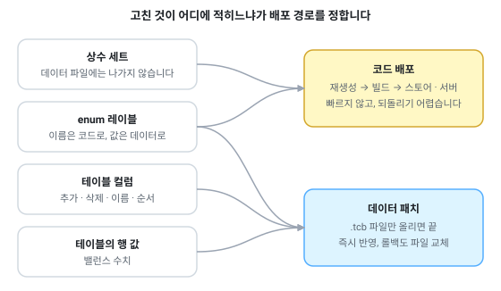
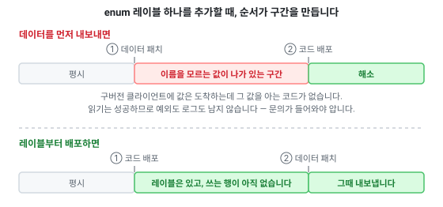

# 언어별 가이드

생성된 코드를 프로젝트에 넣고 쓰는 법. 언어마다 준비물, 배치 방법, 주의사항, 트러블슈팅이 다르므로 문서를 나눠 두었습니다.

> [문서 목록으로](../readme.md)

생성물을 붙이기 전, 변환 자체가 실패한다면 [트러블슈팅](../troubleshooting.md)을 보세요.

---

## 문서 선택 안내

전부 recipe의 `Targets`에 항목 하나로 적고, `Type`이 어느 것인지를 정합니다.

|언어|`Type`|
|--|--|
|[C# / Unity](csharp.md)|`csharp`|
|[TypeScript](typescript.md)|`typescript`|
|[C++](cpp.md)|`cpp`|
|[C](c.md)|`c`|
|[Unreal](unreal.md)|`unreal`|
|[Go](go.md)|`go`|
|[Rust](rust.md)|`rust`|
|[Python](python.md)|`python`|
|[Java](java.md)|`java`|
|[Kotlin](kotlin.md)|`kotlin`|
|[Swift](swift.md)|`swift`|
|[Ruby](ruby.md)|`ruby`|
|[PHP](php.md)|`php`|
|[Dart](dart.md)|`dart`|
|[HTML 문서](html.md)|`html`|

---

## 필요한 버전

|대상|요구사항|비고|
|--|--|--|
|C# / Unity|Unity 6 이상 (C# 9 / netstandard2.1)|**설정할 것이 없습니다.** 유니티 내장 정의(`UNITY_5_3_OR_NEWER` 등)로 스스로 판별하고, UniTask 같은 외부 패키지도 필요 없습니다. 엔진을 아는 파일은 어댑터 하나뿐입니다|
|TypeScript|4.5 이상, 컴파일 타겟 `ES2020` 이상|테이블 리더가 `BigInt`를 씁니다|
|C++|C++17 이상||
|C|C99 이상|헤더는 C++로도 include할 수 있습니다 (`extern "C"`)|
|Unreal|**4.x ~ 5.x**|UE 4.27.2의 실제 UnrealHeaderTool로 검증|
|Go|1.21 이상|생성되는 `go.mod`가 `go 1.21`을 선언합니다. CI는 1.23으로 검증|
|Rust|edition 2021|생성되는 `Cargo.toml`이 선언합니다|
|Python|3.12로 검증|그 아래 버전은 확인하지 않았습니다|
|Java|21로 검증|테이블 리더에 특별한 문법은 없지만 그 아래는 확인하지 않았습니다|
|Kotlin|2.1로 검증||
|Swift|6.1·6.3으로 검증. 5.9 이상|**언어 모드 5와 6 둘 다**로 확인합니다. MAC을 검증할 때만 swift-crypto가 필요하고, 애플 플랫폼은 CryptoKit이 대신합니다 ([자세히](swift.md#mac-검증과-swift-crypto))|
|Ruby|3.2로 검증||
|PHP|8.1 이상|`enum`을 씁니다|
|Dart|3.6 이상|null safety 필요|

> "검증"은 **CI가 매 실행마다 그 버전으로 생성물을 컴파일하거나 실행해서 값을 대조한다**는 뜻입니다. 추측이 아니며, 표에 없는 하위 버전은 될 수도 있지만 확인된 바 없습니다.

## 공통으로 알아둘 것

### 추가 의존성 없음

생성된 코드는 **그 자체로 완결된 패키지 하나**입니다. 프로젝트에 포함시킨다고 해서 새로 설치할 라이브러리나 맞춰야 할 버전이 생기지 않습니다.

**기본값에서 그렇다**는 뜻이고, 옵션을 켜면 세 자리에서 달라집니다 — Rust와 C·C++의 데이터 갱신기, Python의 암호화된 파일 읽기, Swift의 MAC 검증. 셋 다 「직접 구현이 성능에서 크게 불리한 자리는 이미 있는 것을 쓴다」는 같은 판단이고, 무엇이 어디에 적히는지는 [의존 패키지](../dependencies.md#생성된-코드의-의존)에 표로 있습니다.

모든 언어에서 **바이너리 리더가 출력 폴더에 함께 생성됩니다.** 플러그인 설치도, include 경로 설정도 없습니다. 넣으면 그대로 컴파일됩니다. Go는 `go.mod`, Rust는 `Cargo.toml`, 언리얼은 `Build.cs`까지 함께 나옵니다.

테이블 리더를 `lib/`에서 가져다 쓰는 게 아니라 **매번 새로 써 넣는** 이유는, 생성된 코드와 다른 시기의 테이블 리더가 짝지어지는 일을 불가능하게 만들기 위해서입니다. 원본은 임베디드 리소스 하나라 `lib/`와 어긋날 수도 없습니다.

### 타입당 파일 하나

테이블·enum·상수 세트마다 파일이 하나씩 생성됩니다. 시트에서 테이블을 지우면 그 파일도 사라집니다 — **스윕**이 이번 실행이 쓰지 않은 생성 파일을 지웁니다.

지워지는 것은 "쓰지 않은 전부"가 아니라 **헤더에 `Generated by Tabbit`이 적힌 파일 중** 이번에 쓰지 않은 것입니다. 그 마커가 허가증이고, 그것을 쓰는 것은 이 도구뿐이라 남의 소스가 든 폴더를 가리켜도 안전합니다.

생성물을 손으로 고쳐 쓴다면 recipe 항목에 `"Sweep": false`를 넣으세요. 생성 파일을 편집하는 것은 recipe에 한 줄 적을 만한 결정입니다.

### 데이터만 나가도 되는 변경과 코드가 함께 나가야 하는 변경

시트를 고쳤을 때 데이터 파일만 새로 올리면 되는지, 코드까지 다시 배포해야 하는지는 **무엇을 고쳤느냐가 정합니다.**

|바꾼 것|다시 나가야 하는 것|
|--|--|
|테이블의 행 값|데이터만|
|테이블의 컬럼 — 추가·삭제·이름 변경·순서 변경|데이터만 (조건은 아래)|
|테이블 컬럼의 타입, 고정배열 개수|데이터 + 코드|
|**enum** — 레이블을 끝에 추가|코드. 그 값을 쓰는 행을 내보낸다면 데이터도 함께|
|**enum** — 기존 레이블의 값이 밀리는 변경|**데이터 + 코드.** 이미 내보낸 데이터의 숫자가 다른 라벨을 가리키게 됩니다|
|**상수 세트** — 상수 추가·삭제·값 변경|**코드만.** 데이터 파일에는 아무것도 나가지 않습니다|



**enum과 상수 세트는 데이터가 아니라 코드에 적힙니다.** 상수 세트는 생성된 소스의 상수 선언이 전부입니다 — 값을 하나 고쳐도 그 값이 실린 데이터 파일이 없으므로, 코드를 다시 생성해 빌드하기 전에는 아무것도 달라지지 않습니다. enum도 레이블의 이름과 값은 코드에 있고 **데이터에는 숫자만 실립니다.** 그래서 레이블을 새로 추가하고 그 값을 쓰는 행을 내보내면, 이미 배포된 빌드에는 자기가 이름을 모르는 값이 도착합니다.

정리하면 **enum과 상수 세트를 건드리는 변경은 데이터만 패치하는 흐름으로 끝나지 않습니다.** 코드 배포가 함께 있어야 합니다.

> **상수는 특히 조심해야 합니다.** 다른 변경은 적어도 데이터 파일이 바뀌므로 무언가 나갔다는 흔적이 남습니다. 상수는 그 흔적이 **하나도 없습니다** — 변환은 성공하고, 익스포트도 정상이고, 매니페스트 해시까지 그대로라 업데이터가 받을 파일도 없습니다. 값을 고쳐놓고 배포했다고 넘어가기 가장 쉬운 경우이면서, 잘못됐다고 알려주는 신호가 **어디에도 없습니다.** 상수를 고쳤다면 **코드 재생성과 빌드 배포까지가 그 변경의 일부**입니다.

**상수 세트와 enum이 갈리는 지점이 하나 있습니다.** 상수는 데이터에 흔적이 없으니 코드만 나가면 끝이지만, **enum은 그 값이 이미 데이터에 실려 나가 있습니다.** 그래서 기존 레이블의 값이 밀리는 변경은 반대 방향의 의무가 생깁니다 — 코드뿐 아니라 **이미 내보낸 데이터도 전부 다시 내보내야** 합니다. 아래 2번이 그 이야기입니다.

**테이블 컬럼은 반대입니다.** 컬럼은 이름이 아니라 태그로 파일에 실리므로 추가·삭제·이름 변경·순서 변경은 이미 배포된 빌드가 그대로 읽습니다 — 데이터만 올려도 됩니다. 조건은 시트에 태그(`@N`)를 달아두는 것과 지운 컬럼에 tombstone(`#이름@N`)을 남기는 것입니다. 어느 변경이 견디고 어느 변경이 코드와 함께 나가야 하는지는 [바이너리 형식 — 라이브 서비스 시나리오](../binary-format.md#라이브-서비스-시나리오--보장-요약)에 표로 있습니다.

### 로드 후 참조의 자동 연결

`foreign` 필드는 파일에 **인덱스**로 저장되고, `readAll`이 모든 테이블을 읽은 뒤 실제 레코드 참조로 바꿔줍니다. 테이블 하나만 따로 읽으면 그 단계가 없으니 참조는 비어 있습니다.

Rust만 예외로 **참조를 인덱스 그대로 둡니다.** 레코드가 서로를 참조하면 그래프가 되는데 Rust는 그런 소유 구조를 허용하지 않기 때문입니다. `find`로 직접 찾아 쓰면 됩니다.

### 데이터 파일 확장자의 인자 지정

기본값은 recipe의 `BinaryTableFileExtension`이 그대로 들어가므로 보통은 아무것도 넘기지 않으면 됩니다. 넘겨야 하는 경우는 **패키징 과정에서 파일 이름이 바뀔 때**입니다 — 유니티는 확장자가 `.bytes`인 것만 TextAsset으로 포함하고, 엔진마다 이런 제약이 다릅니다.

기본 인자가 있는 언어([C#](csharp.md), [C++](cpp.md), [TypeScript](typescript.md), [Python](python.md), [Ruby](ruby.md), [PHP](php.md), [Dart](dart.md), [Kotlin](kotlin.md), [언리얼](unreal.md))는 두 번째 인자로 받고, 없는 언어는 이름이 다른 짝을 하나 더 냅니다 — [Java](java.md)는 오버로드, [Go](go.md)는 `ReadAllWithExtension`, [Rust](rust.md)는 `read_all_with_extension`, [C](c.md)는 `<Accessor>_LoadAllWithExtension`.

---

## 라이브 서비스에서 실제로 겪는 모습

위 구분이 중요해지는 이유는 **한쪽만 도구가 지켜주기 때문**입니다.

recipe에 `SchemaBaseline`을 켜두면 이미 배포된 빌드가 못 읽을 **컬럼** 변경은 데이터를 쓰기 전에 멈춥니다. 그런데 그 베이스라인이 기록하는 것은 컬럼뿐입니다 — **enum과 상수 세트는 검사 대상이 아닙니다.** 아래 사고들이 변환을 통과해서 라이브까지 가는 이유가 그것이고, 그래서 이쪽은 규율로 막아야 합니다.

이 판정을 손으로 하지 않아도 됩니다 — **[히스토리](../history.md#배포-판정--이-구간을-내보내려면-무엇이-나가야-하나)가 커밋마다, 그리고 두 버전 사이 범위 전체에 대해 데이터 패치·코드 배포 필요 여부를 판정합니다.** 아래 사고들에는 경고가 함께 붙습니다.

### 1. 「등급 하나 추가했는데 데이터만 올렸습니다」

기획자가 enum `Grade`에 `Mythic = 5`를 추가하고 아이템 몇 개를 그 등급으로 바꿔 CDN에 데이터만 올립니다. 아직 업데이트하지 않은 클라이언트에는 `Mythic`이라는 이름이 없습니다.

- **읽기는 실패하지 않습니다.** 값 `5`는 그대로 도착합니다. 로딩은 정상적으로 끝납니다.
- 그 다음이 언어마다 갈립니다. 선언에 없는 값이 오면 **기본 레이블로 떨어지는 쪽**(Java·Kotlin·Dart·Rust·Python·PHP)에서는 그 아이템이 `Common`으로 보이고, **숫자를 그대로 담는 쪽**(C#·C++·C·Go·TypeScript·언리얼·Ruby)에서는 선언에 없는 `5`가 필드에 들어앉습니다.
- 증상은 어느 쪽이든 **예외가 아니라 화면**입니다. `switch`의 어느 가지에도 걸리지 않아 등급 테두리가 안 그려지거나, 엉뚱한 등급으로 보입니다. 로그에 아무것도 남지 않으므로 **문의가 들어와야 압니다.**

순서를 뒤집으면 그 구간이 아예 생기지 않습니다.



> **대처.** 레이블 추가와 그 값을 쓰는 데이터를 **두 번에 나눠** 내보내세요. 먼저 레이블만 추가한 코드를 배포하고, 그 빌드가 충분히 퍼진 뒤에 그 값을 쓰는 행을 내보냅니다. 클라이언트 업데이트를 강제할 수 있는 게임이 아니라면 이 순서가 유일한 안전장치입니다.

### 2. 「레이블을 중간에 하나 끼워넣었습니다」

`Common = 1`, `Rare = 2`, `Epic = 3` 사이에 `Uncommon`을 넣어 `Rare`와 `Epic`이 3, 4로 밀렸다고 합시다. **이미 내보낸 데이터에는 숫자만 실려 있습니다.** 어제 쓴 `3`은 `Epic`이었고, 오늘 코드에서 `3`은 `Rare`입니다.

- **코드만 배포하면 옛 데이터의 등급이 전부 한 칸씩 밀려 읽힙니다.** 이미 내보낸 데이터를 다시 내보내는 것이 선택이 아니라 의무가 되는 유일한 경우입니다.
- 그리고 이것은 **읽기가 성공하는데 값이 잘못 들어오는 경우**입니다. 밀린 값도 전부 선언에 있는 유효한 값이라 1번처럼 "이름 없는 값"으로도 드러나지 않습니다. 컬럼 **태그 재사용**과 정확히 같은 성질이고, 그쪽은 변환기가 원천 차단하지만 enum 값에는 그런 차단이 없습니다.
- 반대로 **그 값을 쓰는 행이 하나도 없었다면 아무 일도 없습니다.** 위험은 밀린 값이 이미 데이터에 실려 있었다는 전제에서만 생깁니다.

이 일이 얼마나 쉽게 벌어지는지는 레이아웃이 정합니다.

|레이아웃|enum 값이 정해지는 방식|
|--|--|
|`tabbit`|시트의 **값 칸에 직접 적습니다.** 레이블을 중간에 추가해도 기존 값은 그대로이므로, 값 칸을 손으로 다시 매기지 않는 한 밀리지 않습니다|
|`rescue`|**등장 순서대로 자동**입니다. 중간에 끼워 넣거나 순서를 바꾸면 뒤가 전부 밀립니다 — [적용 기록](../../samples/rescue/doc/적용-기록.md)에 적어둔 그 이유입니다|

> **대처.** `tabbit` 레이아웃에서는 **레이블을 끝에 붙이고 값 칸을 다시 매기지 마세요.** 표시 순서가 중요하면 정렬은 보여줄 때 하면 됩니다. `rescue`라면 뒤에 붙이는 것 외에 방법이 없고, 그래도 밀렸다면 **데이터 전체를 다시 내보내 코드와 함께** 배포해야 합니다. 이 경우만큼은 데이터만 패치하는 흐름이 성립하지 않습니다.

### 3. 「상수만 고쳤는데 아무것도 안 바뀝니다」

`~~const:Limits~~`의 `MaxPartySize`를 4에서 5로 고치고, 변환을 다시 돌려 데이터를 올렸는데 라이브는 그대로입니다.

당연합니다 — **상수 세트는 `.tcb`에 없습니다.** 생성된 소스의 상수 선언 한 줄이 전부이고 그것은 이미 클라이언트 바이너리 안에 컴파일되어 있습니다. 매니페스트의 해시조차 바뀌지 않으므로 업데이터가 받을 파일도 없습니다.

> **대처.** 상수는 코드 배포입니다. **라이브 중에 조정할 가능성이 있는 수치라면 처음부터 상수 세트가 아니라 테이블 한 행으로 두세요.** 이벤트 배율, 드롭률 상한, 점검 문구 같은 것들이 여기 해당합니다. 상수 세트는 배포 주기 안에서만 바뀌는 값 — 버전 번호, 배열 크기, 프로토콜 상수 — 에 씁니다.

### 4. 「장애 대응으로 데이터만 되돌렸습니다」

신버전 클라이언트가 옛 데이터를 읽는 상황입니다.

- **컬럼**은 안전합니다. 어제 없던 컬럼은 기본값(널이 아닙니다)으로 채워지고 나머지는 그대로 읽힙니다.
- **enum도 레이블을 추가만 해왔다면 안전합니다.** 옛 데이터에 실린 값은 오늘 코드가 전부 아는 값이기 때문입니다.
- 위험한 것은 **레이블을 지운 경우**입니다. 옛 데이터에는 그 값을 쓰는 행이 남아 있는데 오늘 코드에는 이름이 없으니, 롤백하는 순간 1번과 같은 증상이 됩니다. 값이 자동으로 매겨지는 `rescue` 레이아웃이라면 삭제가 뒤의 값을 전부 당기므로 **2번**이 됩니다 — 이쪽이 더 나쁩니다.

> **대처.** **enum 레이블은 지우지 말고 남겨두세요.** 쓰지 않게 된 레이블을 선언에 남기는 비용은 한 줄이고, 지웠을 때 되돌아오는 비용은 롤백이 필요한 그 순간에 옵니다. 컬럼의 tombstone과 같은 발상입니다.

### 5. 「스토어 심사가 사흘 걸립니다」

심사에 올린 빌드는 이미 손댈 수 없는 코드인데, 그동안에도 데이터는 계속 나갑니다.

컬럼을 늘리고 값을 고치는 것은 그 빌드가 견딥니다. 견디지 못하는 것은 **심사 중에 필요해진 enum 레이블과 상수**입니다 — 그 빌드에는 넣을 방법이 없으므로 다음 심사를 기다려야 합니다.

> **대처.** 심사 기간에 쓸 것 같은 레이블은 **미리 선언해서 함께 올리세요.** `#`로 제외한 컬럼이 태그를 예약하는 것과 같이, 값만 예약해 두고 데이터에서 나중에 쓰면 됩니다.

### 6. 서버와 클라이언트의 배포 시점이 다를 때

같은 시트에서 Go 서버와 C# 클라이언트가 각각 코드를 생성한다면, enum 레이블 하나를 추가했을 때 **다시 배포해야 하는 곳이 둘**입니다. 서버만 먼저 나가고 클라이언트가 다음 주에 나간다면, 그 사이 서버가 새 레이블을 값으로 내려보내는 순간부터 클라이언트는 1번 상태입니다.

> **대처.** enum을 고쳤을 때 배포 목록에 무엇이 오르는지는 **recipe의 `Targets`에 적힌 코드 생성 항목의 수만큼**입니다. 데이터 하나만 올리면 되던 습관이 여기서 어긋납니다.

---

## 바이너리 전용의 근거 (TypeScript의 예외)

우연이 아니라 결정입니다.

**다시 읽는 것이 안전합니다.** 이미 로드된 테이블에 `readAll`(또는 테이블 하나의 `read`)을 다시 불러도 됩니다 — 데이터만 패치해서 갈아끼우는 흐름이 그것입니다. 테이블 리더는 새 저장소에 전부 읽고 인덱스와 상호참조까지 만든 다음 **한 번에 교체**합니다. 그래서:

- 읽기가 실패하면(잘린 파일, 이 빌드가 못 읽는 컬럼, 인덱스 중복) **이전 데이터가 그대로** 남고 예외/오류만 옵니다. 빈 테이블이 되지 않습니다.
- 교체 전에 `records`를 잡아둔 쪽은 **그 시점의 한 벌**을 계속 봅니다. 순회 중에 내용이 바뀌지 않습니다.
- 행과 인덱스가 함께 바뀌므로 `find`가 옮겨간 행을 돌려주는 순간이 없습니다.
- C#과 언리얼은 메모리 배리어 뒤에 게시하므로, 다른 스레드는 새 로드 또는 이전 로드만 봅니다.

C는 구조체를 `= {0}`으로 선언해야 하고(첫 호출에서 해제할 것이 없어야 하므로), 교체가 성공한 뒤에는 옛 아레나를 가리키던 포인터를 쓰지 마세요. [C 가이드](c.md)에 적어두었습니다.

## 레코드 조회 — 같은 세 함수, 모든 언어에서 같은 이름

인덱싱된 필드마다 세 개가 나옵니다. 시트의 `index`(기본)와 `*`를 붙인 보조 인덱스 전부입니다. (throw할 것이 없는 C와 Unreal은 두 개입니다 — 아래 참조.)

|함수|없을 때|언제 쓰나|
|--|--|--|
|`FindByIndex(key)`|널·`None`·`nullptr`·`undefined`·`Option::None`|**없는 것이 정상인 경우.** 사용자 입력에서 온 키, 선택적 참조|
|`GetByIndexOrThrow(key)`|**예외.** 메시지에 테이블·필드·키|**있어야만 하는 경우.** 다른 테이블이 가리키는 키, 상수로 고정된 키|
|`ContainsIndex(key)`|`false`|존재만 확인하고 값은 안 쓸 때|

`Index` 자리에는 필드 이름이 들어갑니다 — `*Name` 필드가 있으면 `FindByName` / `GetByNameOrThrow` / `ContainsName`이 함께 나옵니다.

**키 타입은 그 컬럼의 타입입니다.** `*Code`가 `string`이면 `FindByCode(string)`이 나옵니다. `float`·`double` 컬럼은 인덱스가 될 수 없고 변환 단계에서 거부됩니다 — 같아 보이는 두 값이 다른 키가 되어 조회가 **실패하지 않고 빗나가기** 때문입니다.

표기는 언어 관례를 따릅니다.

|표기|언어|
|--|--|
|`FindByIndex`|C# · Go · Unreal|
|`findByIndex`|TypeScript · Java · Kotlin · Dart · PHP|
|`find_by_index`|C++ · Python · Ruby · Rust|
|`<Accessor>_<Table>FindByIndex`|C|

Ruby의 존재 확인만 `contains_index?`입니다. 물음표가 술어 메서드의 표기이기 때문입니다.

**예외가 없는 언어는 이름이 사실대로 바뀝니다.** Go는 `GetByIndexOrError`가 `(*Record, error)`를, Rust는 `get_by_index_or_error`가 `Result`를 돌려줍니다. **C와 Unreal은 `Find`와 `Contains`만 냅니다** — C에는 throw할 것이 없고, 언리얼 모듈은 `Build.cs`가 따로 요청하지 않는 한 **예외 비활성**으로 빌드되므로 `throw`가 프로세스를 끝냅니다. 없으면 안 되는 키는 두 언어에서 `NULL`/`nullptr` 검사로 확인합니다.

**throw하는 쪽은 전용 예외입니다.** 파일이 잘못된 것이 아니라 키가 없는 것이므로, 테이블 리더의 형식 오류와 같은 타입이 아닙니다 — Python `tabbit.RecordNotFoundError`, Ruby `Tabbit::RecordNotFoundError`, Java·Kotlin `RecordNotFoundException`, Dart·PHP `RecordNotFoundException`, C++ `tabbit::RecordNotFound`, Rust `tabbit::Error::RecordNotFound`. C#은 `TabbitException`, TypeScript는 `Error`입니다.

### 긴 이름을 쓰는 이유

`GetByIndexOrThrow`는 `Get`보다 10글자 깁니다. 그 10글자가 사는 이유는 하나입니다 — **호출부만 보고 다음 줄이 무엇이어야 하는지 알 수 있어야 하기 때문**입니다.

```csharp
var name = data.Item.GetByIndex(id).Name;   // 이 줄은 throw하는가? 널을 주는가?
```

이전 이름으로는 정의를 찾아가야 알 수 있었습니다. 그리고 이 코드가 도는 곳은 대개 게임 클라이언트의 로딩 경로이고, 동작이 "throw"인데 감싸지 않았다면 증상은 **크래시 리포트 한 줄**로 옵니다. 반대로 동작이 "널"인데 검사하지 않았다면 그 아래 어딘가에서 널 참조가 됩니다. 어느 쪽이든 **이름 하나로 막을 수 있었던 것**입니다.

```csharp
var found = data.Item.FindByIndex(id);      // 널일 수 있다. 그렇게 쓰여 있다
if (found != null) { ... }

var name = data.Item.GetByIndexOrThrow(id).Name;   // 없으면 throw한다. 그렇게 쓰여 있다
```

**짧은 이름을 남겨두지 않은 것도 같은 이유입니다.** `Get`을 별칭으로 남기면 결국 그것이 쓰이고, 그러면 두 이름 중 하나만 동작을 정확히 말하게 됩니다. 타이핑 몇 글자는 자동완성이 처리하지만, 「이 함수가 예외를 throw하는가」를 확인하러 정의로 이동하는 작업은 읽는 사람이 매번 수행합니다.

이 규칙이 **모든 언어에서 같은 이름**인 것도 의도입니다. 서버는 Go, 클라이언트는 C#, 툴은 Python으로 같은 시트를 읽는 팀에서, 조회 함수의 의미를 언어마다 다시 배울 이유가 없습니다.

**바이너리가 런타임 형식입니다.** 게임 클라이언트와 서버가 데이터를 싣는 형식이고, 작고 파싱이 빠릅니다. 생성되는 테이블 리더는 이것만 읽습니다 — 왜 그런지는 [내보내기](../exports.md#바이너리를-쓰는-이유)에, 형식 자체와 스키마가 바뀌었을 때의 보장은 [바이너리 형식](../binary-format.md)에 적어두었습니다.

**JSON은 런타임 형식이 아니라 산출물입니다.** 두 가지 용도입니다 — 생성 테이블 리더가 없는 쪽에서 데이터를 가져다 쓰는 경우, 그리고 텍스트로 서빙해야 하는 경우. 사람이 데이터를 들여다보는 용도로는 [HTML 문서](html.md)가, "무엇이 언제 바뀌었나"에는 [히스토리](../history.md)가 각각 더 낫습니다.

**TypeScript만 두 경로를 갖는 이유는 웹입니다.** 브라우저로 배포할 때 바이너리 리더를 끼우지 않고 JSON을 그대로 fetch하고 싶은 요구가 실제로 있고, 그게 두 경로가 존재하는 유일한 이유입니다. 두 경로는 **같은 값을 냅니다** — 회귀 스위트가 같은 테이블을 JSON과 바이너리로 각각 읽어 필드 단위로 비교합니다.

**나머지 언어에 JSON 읽기를 넣지 않은 이유는 비용이 아니라 위험입니다.** JSON은 `datetime`을 `"2022-03-01T09:00:00"`으로, `timespan`을 `"10675199.02:48:05"`로, `bigint`를 문자열로, `uuid`를 하이픈 형식으로 씁니다. 되읽으려면 **.NET의 그 텍스트 형식들을 언어마다 손으로 파싱해서 바이너리 경로와 같은 틱·같은 바이트에 도달**해야 합니다. 어긋나면 **실패하지 않고 값이 달라집니다** — 적합성 코퍼스가 존재하는 이유가 바로 그 실패 방식이고, 언어를 추가할 때마다 그 표면이 넓어집니다.

지금은 그 위험이 아예 없습니다. 아무도 JSON을 되읽지 않기 때문입니다.

## 테이블 리더가 어긋나지 않는다는 근거

테이블 리더는 언어마다 **별도 구현**입니다. 포맷을 정의하는 건 익스포터의 writer 하나이고, 각 언어의 테이블 리더는 그 하나를 각자 구현한 것이라 어긋날 수 있습니다.

그래서 **적합성 코퍼스**가 있습니다. `test/fixtures/xlsx/conformance`가 경계값을 담은 테이블 하나입니다 — 2^53+1, float32의 0.1, varint 1~5바이트, 빈 문자열·빈 배열·비ASCII, .NET 바이트 순서의 uuid, 지그재그 enum, 다른 테이블의 행과 필드를 가리키는 참조 두 개. 회귀 스위트가 이것을 **모든 언어로 각각 컴파일·실행해서 읽고** 익스포터 JSON과 필드 단위로 대조합니다.

실제로 이 방식이 `long`을 32비트로 잘라내던 writer 버그를 찾아냈습니다. 언어를 추가하는 비용이 전용 게이트가 아니라 50줄짜리 하네스인 이유이기도 합니다.

값 타입을 새로 추가하면 `CorpusCoverageTests`가 **그 타입의 필드가 코퍼스에 있는지** 요구하며 실패합니다. 코퍼스에 없는 타입은 어느 테이블 리더도 읽어본 적 없는 타입이기 때문입니다.
