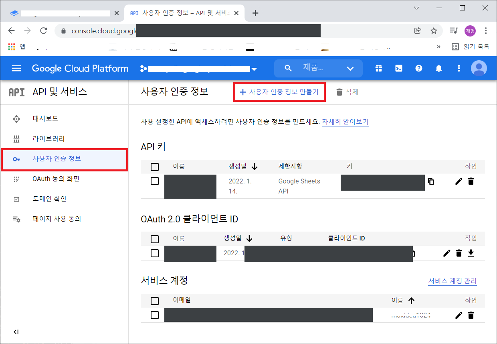
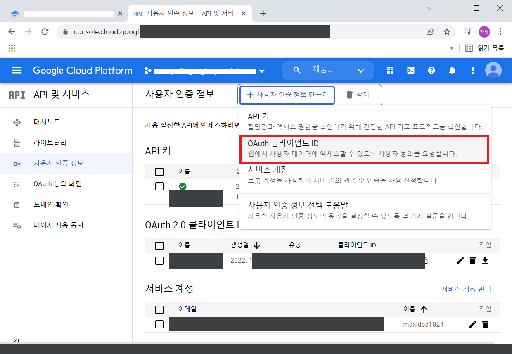
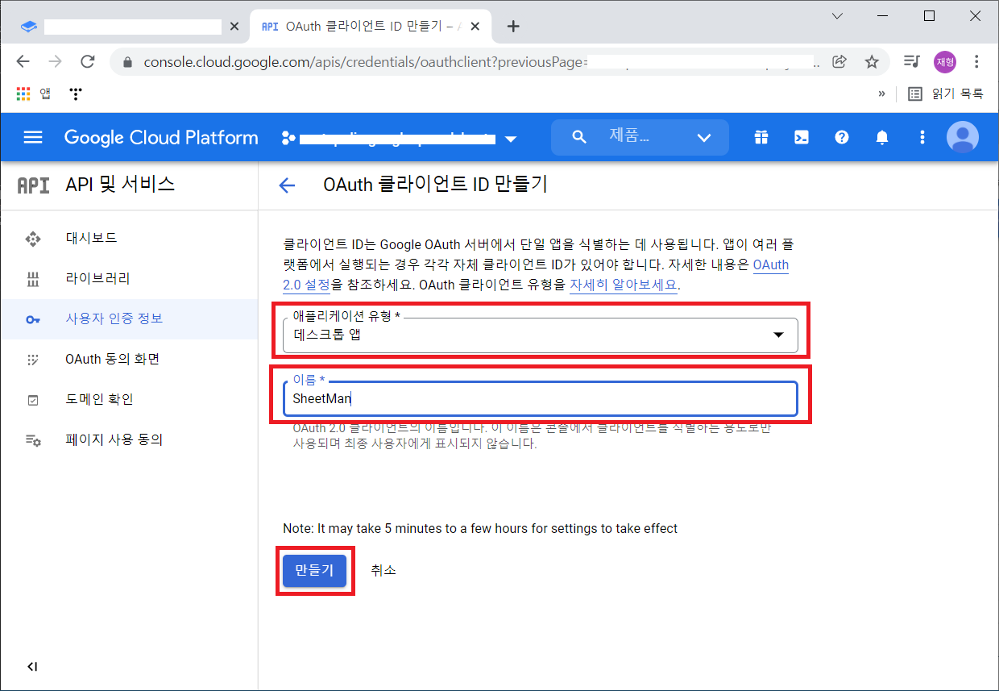
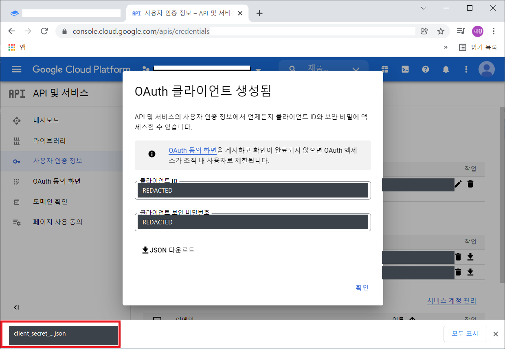
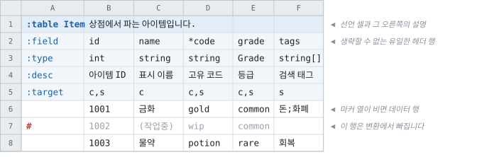
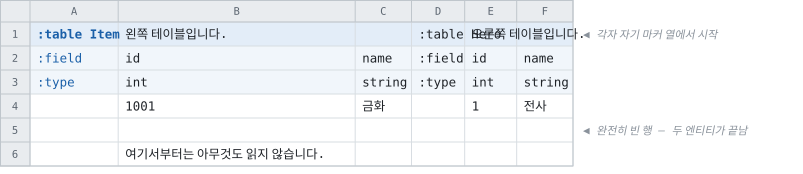
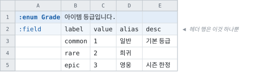
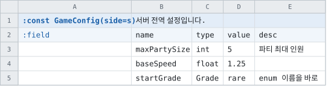

# 시트 작성

> 이 문서가 시트 작성법의 정본입니다. 설계와 그 근거는
> [주 시트 레이아웃](../spec/primary-layout.md)에 있습니다.

엑셀과 구글 스프레드시트에 데이터를 어떻게 배치하고, Tabbit이 그것을 어떻게 읽는지.

> [문서 목록으로](readme.md)

---

## Terminologies

시작하기에 앞서서 몇가지 용어에 대해서 얘기하겠습니다.

|용어|설명|
|--|--|
|워크북|시트들을 담는 파일 단위입니다. 엑셀에서는 `.xlsx` 파일 하나, 구글 스프레드시트에서는 스프레드시트 문서 하나(URL의 ID 하나)가 워크북입니다. 이 문서 전체에서 이 단위를 `워크북`이라고 부릅니다.|
|시트|워크북 안의 개별 탭 하나를 가리킵니다. 엑셀의 워크시트, 구글 스프레드시트의 시트에 해당합니다.|
|Entity|`Tabbit`에서 지원하는 각 정의 요소를 가리킵니다.|
|Recipe 파일|`Tabbit`에서 사용하는 입력 소스 시트 및 출력 옵션등을 설정하기 위한, .json 형식의 파일입니다.|
|Name Case|Camel / Pascal / Snake / Kebab 등의 이름 표기 형식을 얘기합니다.|


## Excel

지정한 폴더 안의 모든 `.xlsx` 파일을 하위 경로까지 포함해 가져옵니다.

사용할 파일과 아닌 파일이 섞여 있으면 기본적으로 전부 대상이 되므로 주의가 필요합니다.
폴더 이름이나 파일 이름 앞에 `#`을 붙이면 대상에서 제외됩니다.

읽을 파일이 엑셀에서 열려 있으면 파일이 잠겨 있어 빌드가 실패할 수 있습니다.

엑셀에는 [여러 파일 확장자](https://support.microsoft.com/ko-kr/office/excel%EC%97%90%EC%84%9C-%EC%A7%80%EC%9B%90%ED%95%98%EB%8A%94-%ED%8C%8C%EC%9D%BC-%ED%98%95%EC%8B%9D-0943ff2c-6014-4e8d-aaea-b83d51d46247)가 있습니다.

이때에는 입력 소스지정에 `FilePatterns`을 지정해주면 가능합니다. 특별히 지정하지 않는 경우에는 와일드 카드(`*`)를 지정하면 됩니다.


## Google Spread Sheets

[구글 개발자 콘솔](https://console.cloud.google.com)에서 프로젝트를 하나 만들어야 하는 것은 같고,
**거기서 무엇을 받는지가 둘로 갈립니다.**

|누가 변환을 돌리나|무엇을 받나|recipe에 적는 것|
|--|--|--|
|**사람** — 개발자의 기계|`OAuth2` 클라이언트 ID|`ClientSecretFilename`|
|**빌드 서버** — CI 잡|**서비스 계정 키**|`ServiceAccountKeyVariable` 또는 `ServiceAccountKeyFile`|

혼자 쓴다면 아래 2번만 보면 됩니다.

CI를 붙이는 시점에 3번이 필요해집니다.

클라이언트 비밀은 빌드를 돌리는 *사람*으로 접속하므로, 그것을 빌드 서버에 두면 파이프라인의
문서 접근 권한이 한 사람의 계정에 종속됩니다.

그 사람이 조직을 떠나거나 권한이 회수되면 빌드가 중단됩니다.

**둘을 함께 적으면 거절합니다.** 서로 다른 신원이라 하나를 말없이 고르면 그 잡이 자기가 아닌
사람으로 문서를 읽게 되고, 산출물의 어디에도 그 사실이 남지 않기 때문입니다.


### 1. 프로젝트 생성

> 작성중


### 2. `OAuth2` 사용자 인증 정보를 획득 — 사람이 돌릴 때

받은 파일은 아무 데나 두고 그 경로를 `recipe`의 `ClientSecretFilename`에 적어주면 됩니다.

처음 한 번은 브라우저가 열리면서 동의를 묻습니다. 그 뒤로는 `~/.credentials/sheets.googleapis.com-tabbit`에 토큰이 남아 다시 묻지 않습니다. 다른 PC에서도 묻지 않게 하려면 이 파일을 같은 경로에 복사해두면 됩니다.

> 이 복사가 **CI에서 쓰던 우회**입니다. 3번이 그것을 대신합니다 — 토큰에는 수명이 있고, 만료되면
> 그때부터 빌드가 멈추는데 그 시점을 아무도 예고받지 않습니다.

<details>
<summary><b>스크린샷을 따라가며 발급받기</b> (펼쳐보기)</summary>

<br>

1. 아래 화면에서 `사용자 인증 정보 만들기`를 클릭합니다.


2. `OAuth 클라이언트 ID`를 선택합니다.


3. `어플리케이션 유형*`은 `데스크톱 앱`으로 설정하고, `이름*`은 `Tabbit`으로 한 후 `만들기` 버튼을 클릭합니다.


4. `JSON 다운로드` 버튼을 클릭해서 인증정보가 담긴 파일을 다운로드합니다.


5. 다운로드한 파일을 임의의 위치에 저장해둡니다.


위에서 저장해둔 파일명을 기억해 두었다가 추후 설명할 `recipe` 파일에 기입해주어야합니다.

</details>

> **이 파일을 저장소에 커밋하지 마십시오.** `.gitignore`가 `**/googlesheets-client-secret.json`을 막고 있지만, 다른 이름으로 저장하면 걸리지 않습니다.
>
> 그리고 **이미 커밋해버렸다면 추적 해제로는 해결되지 않습니다.** 히스토리에 남고, 이미 클론한 사본에서는 히스토리 재작성도 무력합니다. [GCP 콘솔의 사용자 인증 정보 페이지](https://console.cloud.google.com/apis/credentials)에서 **해당 클라이언트를 삭제하고 새로 발급**하는 것이 유일한 조치입니다.
>
> 스크린샷도 확인하십시오. 이 저장소의 위 이미지에는 클라이언트 ID와 보안 비밀번호가 평문으로 찍혀 있었고(현재는 가려둔 상태), 그 자격증명은 아직 폐기되지 않았습니다 — 프로젝트 `crested-photon-338102`.


### 3. 서비스 계정 키 — 빌드 서버가 돌릴 때

**서비스 계정은 사람이 아니라 잡의 신원입니다.** 대화형 동의가 없고, 문서는 동료에게 공유하듯
그 계정의 주소에 공유합니다.

1. GCP 콘솔의 `IAM 및 관리자` → `서비스 계정`에서 서비스 계정을 하나 만듭니다. 프로젝트
   역할은 **주지 않아도 됩니다** — 필요한 권한은 GCP의 역할이 아니라 스프레드시트 쪽 공유입니다.
2. 만든 계정의 `키` 탭 → `키 추가` → `새 키 만들기` → `JSON`으로 키를 내려받습니다.
3. 키 파일 안의 **`client_email`**(`…@….iam.gserviceaccount.com`)을 복사해, 읽을
   **스프레드시트 문서를 그 주소에 `뷰어`로 공유**합니다. 이 단계를 빼먹으면 문서가 없다는
   응답이 옵니다 — 계정은 유효하고 그 문서만 안 보이는 것입니다.
4. 키를 CI의 시크릿 저장소에 넣고, recipe에는 **그 환경 변수의 이름**을 적습니다.

```jsonc
{ "ServiceAccountKeyVariable": "TABBIT_SHEETS_KEY", "SheetsId": "…" }
```

```yaml
# .github/workflows/data.yml
- run: tabbit --recipe recipe.jsonc --env live
  env:
    TABBIT_SHEETS_KEY: ${{ secrets.TABBIT_SHEETS_KEY }}
```

**환경 변수 쪽이 파일보다 낫습니다** — 키가 러너의 디스크에 남지 않고, 저장소에 실수로 들어갈
파일 자체가 생기지 않기 때문입니다. 로컬에서 서비스 계정으로 확인해볼 때만
`ServiceAccountKeyFile`을 씁니다.

> **이 키도 커밋하지 마십시오.** `.gitignore`가 `**/googlesheets-service-account.json`을 막고
> 있지만 다른 이름으로 저장하면 걸리지 않습니다. 커밋해버렸다면 조치는 위와 같습니다 — 추적
> 해제로는 해결되지 않고, 콘솔에서 **그 키를 삭제**해야 합니다. 서비스 계정은 키를 여러 개 가질
> 수 있으므로, 새 키를 먼저 만들어 넣고 옛 키를 지우면 빌드가 멈추지 않습니다.
>
> **클라이언트 비밀 파일을 이 자리에 적으면 그 자리에서 거절합니다.** 구글이 내려주는 두 JSON은
> 바꿔 넣기 쉬운데, 그대로 API로 보내면 권한 오류로 돌아와 문서 공유 문제처럼 읽히기 때문입니다.


## 인식되는 워크북/시트 대상

`recipe`에 적은 엑셀 파일과 구글 스프레드시트는 전부 합쳐서 하나로 봅니다. 파일이 몇 개든, 시트가 몇 장이든 결과는 하나입니다.

나누는 건 어디까지나 편집하기 편하라고 하는 것입니다. 기획자별로 파일을 나누든 콘텐츠별로 나누든, 도구가 보는 것은 합쳐진 하나의 데이터입니다.

### 읽을 워크북과 시트 골라내기

기본은 **전부 포함**입니다. 폴더에 입력이 아닌 워크북(참고용 백업, 테이블로 만들 수 없는 파일)이 있거나 워크북에 데이터 외의 것(참고용 탭, 작업 메모, 만들다 만 표)이 섞여 있다면 recipe의 소스 항목에서 골라낼 수 있습니다.

```jsonc
"Xlsx": [{
  "Path": "./sheets",

  "ExcludeWorkbooks": ["백업/*", "*_참고용*"],   // 워크북 자체를 빼기. 열지도 않습니다

  "IncludeSheets": ["CharacterTable", "ItemTable", "Stage*"],   // 비우면 전부
  "ExcludeSheets": [
    "*참고용*",                    // 모든 워크북에 적용
    "[Items.xlsx]Define"          // 그 워크북에만 적용
  ]
}]
```

- 배열로도, `;`로 이은 문자열로도 쓸 수 있습니다. 목록이 길면 배열이 읽기 좋습니다.
- `*` `?`는 파일 글롭과 같습니다. 대소문자는 구분하지 않습니다.
- 워크북은 `Path` 기준 상대 경로·파일명·확장자를 뗀 이름 중 무엇으로 적어도 됩니다.
- **시트 이름은 워크북마다 겹칩니다.** 한쪽의 `Define`은 테이블이고 다른 쪽의 `Define`은 작업용 탭일 때 `[워크북]시트`로 구분합니다.
- **`IncludeWorkbooks`·`IncludeSheets`에 적었는데 없는 것은 오류입니다.** 적어놓고 표시 없이 빠지면 산출물에서 테이블 하나가 사라진 걸 아무도 모르기 때문입니다. 오류 메시지가 실제로 있는 목록을 같이 보여줍니다.

자세한 것은 [recipe 레퍼런스](recipe.md#읽을-워크북과-시트-골라내기)에 있습니다.

`GoogleSheets` 소스에서도 똑같이 동작하고, 워크북 목록은 문서 제목과 맞춰봅니다.


## 시트에 엔티티를 배치하는 방법

배우는 규칙은 다음 하나로 요약됩니다.

> **`:`가 붙은 것은 데이터가 아니라 레이아웃의 낱말이고, `#`가 붙은 것은 모델에 넣지
> 않습니다.**

새로 배우는 특수문자는 그 둘뿐입니다. `?` · `[]` · `.` · `@N` · `*` · `|` · `-`는 아래에서
설명하는 그대로이고, 셀에 적는 값의 규칙은 표기와 무관합니다.

### 가장 작은 시트



- **A1이 선언 셀**입니다. `:table`로 시작하는 셀이 어디에 있든 그 자리가 테이블의 시작이고,
  **그 셀이 있는 A열이 이 테이블의 마커 열**입니다.
- **선언 셀의 오른쪽 칸이 설명**입니다. 비우면 설명이 없는 것입니다.
- `:field` · `:type` 같은 **헤더 행 키**를 마커 열에 적고, 그 오른쪽이 컬럼입니다.
- 마커 열이 빈 행은 **데이터 행**입니다.
- 첫 필드 컬럼이 **기본 인덱스**입니다.

### 마커 열이 담는 것

마커 열은 테이블의 세로 범위 전체에서 예약됩니다. 담을 수 있는 것은 다음뿐이고, **그 외의
값은 오류**입니다 — 오타가 조용히 지나가지 않게 하기 위해서입니다.

|적는 것|뜻|
|--|--|
|`:table` · `:enum` · `:const`|엔티티 선언. **직전 엔티티의 종료이기도 합니다**|
|`:field` · `:type` · `:desc` · `:target` · `:variant`|헤더 행 키|
|빈 칸|데이터 행|
|`#` 또는 `//`|**그 행을 변환에서 제외.** 데이터 칸을 고치지 않고 빼고 되돌립니다|

### 엔티티의 경계



|축|범위|
|--|--|
|가로|마커 열의 오른쪽부터, **다음 마커 열 직전**까지. 없으면 시트의 마지막 컬럼까지|
|세로|선언 셀의 다음 행부터, **완전히 빈 행** 또는 **다음 선언 셀** 직전까지|

- 「완전히 빈 행」은 **그 엔티티의 컬럼 범위**에서 빈 행이고, 그 범위에는 **마커 열과 메모
  컬럼도 들어갑니다.** 표 아래에 메모를 적으려면 한 줄 띄우십시오.
- 데이터 중간에 여백이 필요하면 마커 열에 **`#`를 적습니다.** 그 행은 빈 행이 아니므로
  엔티티가 계속됩니다.
- 엔티티끼리 옆에 붙여도 됩니다. 옆 엔티티는 자기 마커 열에서 시작하므로 **침범을 걱정할
  필요가 없습니다.**
- **셀 병합은 읽지 않습니다.** 병합 범위의 좌상단만 값을 갖고 나머지는 빈 칸이 되므로,
  헤더를 병합해 두면 그 컬럼이 이름 없는 컬럼으로 읽힙니다.

### 헤더 행 5종

|행 키|적는 것|생략|
|--|--|--|
|`:field`|컬럼의 정체 — 이름 · 경로 · `@N` · `*` · `#`|**불가**|
|`:type`|타입 표현과 괄호 메타|테이블은 불가. enum · 상수셋은 **행 자체가 없습니다**|
|`:desc`|컬럼 설명. 생성 코드의 문서 주석이 됩니다|가능|
|`:target`|대상의 쉼표 목록 — `c` · `s` · `c,s`|가능(생략하면 양쪽)|
|`:variant`|필드 변형의 이름|가능|

**행의 순서는 자유**이고, 데이터 행보다 위에 있어야 합니다. `:field`를 데이터 바로 위에 두는
것을 권합니다 — 엑셀의 정렬·필터 머리글이 데이터와 붙습니다.

> **정렬 사고가 오류로 걸립니다.** 헤더 행까지 선택 범위에 넣고 시트를 정렬하면 헤더가
> 데이터 사이로 흩어지는데, 그때 「데이터 행 아래에 있는 헤더 행」을 그 행과 함께
> 보고합니다.

### `:field` — 컬럼의 이름과 경로

|적는 것|뜻|
|--|--|
|`id`|필드 하나|
|`pos.x`|레코드 `pos`의 멤버 `x`|
|`slot[0].id` · `slot[1].id`|레코드 배열의 원소 — **칸의 수가 정해진 배열**|
|`tag[0]` · `tag[1]`|스칼라 배열을 컬럼으로|
|`grid[0][1]`|**배열의 배열** — 대괄호가 이어지면 안쪽 레벨은 이름이 없습니다|
|`reward[].itemId`|**멀티 로우** — 원소가 컬럼이 아니라 **행**에서 옵니다|
|`cost[]`|스칼라 멀티 로우|
|`price@3`|와이어 태그|
|`*code`|보조 인덱스|
|`#`|**메모 컬럼** — 시트 작성자의 자유 공간|
|`#old@4`|묘비 — 뺀 필드이고 와이어 태그를 예약합니다|

- **원소 번호는 0부터**이고 빠짐없이 이어져야 합니다. `[1]`부터 시작하거나 건너뛰면 그
  자리를 가리켜 오류입니다.
- **이름이 없는 컬럼에 데이터가 있으면 오류**입니다. 자유 기재 공간이 필요하면 `:field`에
  `#`를 적으십시오 — 그렇게 표시한 컬럼은 아무것도 읽지 않습니다.

### `:type` — 접힌 타입 표현

**타입 하나가 셀 하나에 들어갑니다.** 디테일 행은 없습니다.

|무엇|적는 것|
|--|--|
|기본 타입|`int` · `string` · `bool` · `float` · `vec3f` · …|
|enum|`Grade` — enum 이름을 바로|
|참조|`foreign Item`|
|선언한 struct|`Reward`|
|셀 배열|`int[]` · `string[]`|
|옵셔널|`int?` · `int[]?` · `int?[]`|

#### 괄호 메타 — 첫 `(`부터는 언제나 메타

```
int? (min=0, max=100)
string (text)
string (text=Common, namespace=Shared)
string (asset=icon)
int[] (size=1..4)
string (allowed=weapon;armour)
int (refs=Item;Mount)
```

|키|값|뜻|
|--|--|--|
|`text`|플래그 또는 그룹 이름|번역 수집|
|`namespace`|이름|`text` 그룹의 네임스페이스|
|`asset`|종류 이름|자산 존재 확인|
|`min` · `max`|수|범위|
|`allowed`|`a;b;c`|허용값|
|`refs`|`A;B;C`|**값의 출처** — 이 테이블들 중 하나의 행 id인지 검사합니다|
|`regex` · `size` · `notDefault`|—|컬럼 제약|

- **키의 사전은 [STRUCT DSL](../notes/struct-dsl-design.md)과 하나**입니다. 같은 키, 같은
  뜻, 같은 검증입니다.
- **모르는 키는 오류**입니다.
- 쉼표가 항목을 가르므로, 쉼표가 든 값은 따옴표로 감쌉니다.

#### 타입 칸을 비우는 자리

|컬럼의 형태|타입 칸|
|--|--|
|스칼라|그 컬럼에 적습니다|
|인라인 레코드 — `pos.x` · `pos.y`|**멤버마다** 적습니다|
|선언한 struct 그룹 — `reward.itemId` · `reward.count`|**첫 멤버 컬럼에 struct 이름 하나.** 나머지는 비웁니다|
|원소 번호 — `slot[0].id` · `slot[1].id`|**원소 0에만.** 이후는 비웁니다|
|멀티 로우 — `reward[].itemId`|**원소의 타입**을 적습니다. 배열임은 이름의 `[]`가 이미 말했습니다|

### 멀티 로우 — 레코드 하나가 여러 행


- **`[]` 컬럼이 하나라도 있으면 그 테이블은 멀티 로우 모드**입니다.
- **새 레코드의 시작은 기본 인덱스 칸에 값이 있는 행**입니다. 그 칸이 빈 행은 직전
  레코드의 **연장 행**입니다.
- **연장 행에서 값을 담는 것은 `[]` 컬럼뿐**입니다. 그 외 컬럼에 값이 있으면 **그 셀을
  가리켜** 「이 값은 레코드의 첫 행에 적습니다」라고 보고합니다.
- 원소는 **그 그룹의 컬럼 범위에 값이 하나라도 있는 행마다** 하나씩 생깁니다. 전부 비어
  있으면 그 행에는 그 그룹의 원소가 없습니다.
- **`[]` 그룹이 여럿이면 각자 쌓입니다.** 같은 행에 있다고 원소끼리 짝이 되는 것이
  아닙니다 — 짝이 필요하면 한 struct의 멤버로 묶으십시오.
- **완전히 빈 행은 엔티티를 끝냅니다.** 레코드 사이에 빈 행을 둘 수 없고, 여백이 필요하면
  마커 열에 `#`입니다.
- 마커 열의 `#`는 **레코드의 첫 행에 있으면 레코드 전체**를, **연장 행에 있으면 그 행의
  원소만** 뺍니다.
- 기본 인덱스 컬럼은 `[]`일 수 없습니다.

**아직 담지 않는 것 셋**입니다 — `[]` 그룹의 멤버가 또 `[]`인 중첩, `[]`와 원소 번호를 한
경로에 함께 적는 것, 그리고 이름의 `[]`와 타입의 `[]`를 함께 적는 것(행마다 셀 배열)입니다.
셋 다 이름을 대고 거절합니다.

### enum과 상수셋 — 컬럼을 이름으로

**헤더 행은 `:field` 하나뿐입니다.** 컬럼의 뜻이 이름으로 정해져 있고 **순서는 자유**이므로,
다른 행 키는 여기서 말할 것이 없습니다 — 설명은 컬럼이 아니라 라벨의 것이고 그것을 담는
것이 `desc` **컬럼**입니다.





|엔티티|필수 컬럼|생략 가능|
|--|--|--|
|`:enum`|`label` · `value`|`alias` · `desc`|
|`:const`|`name` · `type` · `value`|`desc`|

- `alias`는 데이터 셀에 라벨을 적는 **네 번째 표기**입니다 — 선언 표기 · Pascal 표기 ·
  숫자 · 별칭. **별칭을 바꾸면 그 표기로 적은 데이터 셀도 함께 바뀌어야 합니다.**
- 이미 다른 라벨의 이름인 별칭은 거절합니다. 실제 이름이 먼저 답하므로 그 별칭은 아무것도
  가리키지 못합니다.
- 상수셋의 `type` 칸도 **접힌 타입 표현**이므로 enum 이름을 바로 적습니다.

### 선언 셀의 괄호

|키|값|뜻|
|--|--|--|
|`side`|`c` · `s` · `c,s`(기본)|엔티티의 대상|
|`key`|필드 이름|기본 인덱스를 그 컬럼으로. 생략하면 첫 필드 컬럼입니다|

`:table Item(side=s)`처럼 적습니다. 쉼표가 항목을 가르므로 `side="c,s"`는 따옴표가 필요하고,
붙여 쓴 `cs`도 같은 뜻으로 받습니다. **모르는 키는 아는 키의 목록과 함께 오류**입니다.


`key`가 말하는 것은 「어느 컬럼으로 행을 가리키는가」이고, **컬럼은 움직이지 않습니다** —
그래서 파일에 실리는 것도 그대로입니다. 첫 컬럼은 평범한 필드가 되지만 자기 `*`를 갖고 있으면
보조 인덱스로 남고, 멀티 로우의 레코드 경계도 키와 함께 움직입니다.

**키를 여러 개 두려면 세미콜론입니다** — `key="stage,slot; slot,code"`. SQL처럼 첫 키가
PRIMARY KEY이고 나머지가 UNIQUE 키에 대응하며, 어느 것이든 컬럼 하나이거나 여럿입니다.

|표기|뜻|
|--|--|
|(생략)|첫 필드 컬럼이 기본 인덱스|
|`key=code`|그 컬럼이 기본 인덱스. 첫 컬럼은 평범한 필드가 됩니다|
|`key="stage,slot"`|**조합이 키.** 성분은 각자 반복해도 되고, 유일해야 하는 것은 그 조합입니다|
|`key="stage,slot; slot,code"`|**키 여러 개.** 첫 키가 기본 인덱스이고 나머지는 각자 유일합니다|

- 성분은 **실재하는 최상위 스칼라 필드**여야 하고, 성분마다 인덱스의 기존 규칙이 적용됩니다
  — 인덱스가 될 수 있는 타입 · 옵셔널 불가 · 양쪽 대상.
- 한 키에 같은 성분을 두 번 적거나, 성분 구성이 같은 키를 두 번 선언하면 오류입니다.
  **성분 하나가 여러 키에 들어가는 것은 됩니다** — 위의 `slot`이 그 예입니다.
- 컬럼 하나짜리 키는 `*`와 같은 선언이므로, 둘을 함께 적으면 오류입니다.

- **기본 키가 복합인 테이블은 `foreign`의 대상이 될 수 없고**, 멀티 로우도 될 수 없습니다.
  참조는 키 값 하나를 담는 구조이고, 멀티 로우의 레코드는 기본 키 칸에 값이 있는 곳에서
  시작하는데 컬럼 여럿에 흩어진 조합에는 그런 칸이 없기 때문입니다. 보조 키는 둘 다와
  상관이 없습니다.

**조회는 키마다 하나입니다.** 컬럼 하나짜리 키가 지금 내는 것과 같은 자리에, 성분 수만큼
인자를 받는 것이 하나 더 생깁니다 — 이름은 성분을 `And`로 이은 것입니다.

|시트|C#·Go|Java·Kotlin·Swift·Dart·PHP·Lua|Python·Ruby·Rust·C++|C|
|--|--|--|--|--|
|`key=id`|`FindById(key)`|`findById(key)`|`find_by_id(key)`|`FindById(table, key)`|
|`key="stage,slot"`|`FindByStageAndSlot(…)`|`findByStageAndSlot(…)`|`find_by_stage_and_slot(…)`|`FindByStageAndSlot(table, …)`|

`GetBy…OrThrow`와 `Contains…`도 같은 자리에 같은 인자로 생깁니다. 파라미터 이름은
컬럼 이름에 `Key`를 붙인 것이고 — `stageKey`, `slotKey` — 컬럼 하나짜리 조회가 예전부터
`key`를 받아 온 것과 같은 말을 성분마다 하는 것입니다.

> **맵이 무엇으로 키가 되는지는 생성 코드의 사정입니다.** 지금은 성분마다 길이를 앞에 붙여
> 이은 문자열입니다 — 구분자만 쓰면 `("a b", "c")`와 `("a", "b c")`가 같은 키가 되어 두 행
> 중 하나가 사라지기 때문입니다. 맵 자체는 공개되지 않으므로, 튜플 키가 자연스러운 언어가
> 나중에 그쪽으로 옮겨도 **조회의 모습은 그대로**입니다.

### 필드 변형 — `:variant`

한 필드의 값 컬럼을 여러 벌 적고 빌드가 하나를 고릅니다. 지역별 가격처럼 **컬럼 하나만
갈리고 나머지가 공유되는** 데이터가 대상입니다.


- 같은 필드 이름을 컬럼 여러 개에 적고, `:variant` 행이 구분합니다. **빈 칸이 기본
  변형**입니다.
- 고르는 것은 recipe의 `"Variants": { "Item.Price": "kr" }` 또는 CLI의
  `--variant Item.Price=kr`이고, **명령줄이 recipe를 덮습니다.**
- **산출물은 변형을 모릅니다.** 고른 컬럼 하나가 그 필드가 되고 나머지는 그 빌드에
  없습니다 — 모델·와이어·생성 코드 전부 필드 하나입니다.
- **헤더는 기본 변형 컬럼에 한 번** 적습니다. 다른 변형 컬럼은 비우고, 다르게 적으면
  거절합니다.
- 기본 변형이 없는 필드는 **지정이 필수**이고, 없는 변형을 지정하면 있는 목록과 함께
  오류입니다.
- **키 컬럼과 그룹 컬럼에는 변형을 둘 수 없습니다.**

### `#`의 세 자리

뜻은 「모델에 넣지 않음」 하나이고, **위치가 대상을 정합니다.**


|자리|대상|
|--|--|
|마커 열|그 **행**|
|`:field`에 `#` 하나만|그 **컬럼**(메모 컬럼)|
|`:field`의 이름 앞|그 **필드**(묘비 — 와이어 태그를 예약합니다)|

## Trimming

데이터를 읽을 때 모든 셀의 값을 트리밍합니다. 앞뒤에 공백을 넣어도 제거되므로 주의가 필요합니다.

UI 텍스트를 출력할 때 앞뒤 공백으로 레이아웃을 맞추는 방식은 동작하지 않습니다.

필요하다면 공백 대신 다른 문자를 적고, 그 문자를 공백으로 치환해 처리하세요.


## Naming Rules

모든 엔티티 및 필드 이름은 내부적으로 `Pascal case`로 자동변환 됩니다. 이는 처리의 단순화를 위해서 결정한 사항입니다.

다만, 다음과 같은 부작용이 발생할 수 있으므로 주의해야합니다.

**1. 밑줄 개수로 이름을 구분하지 마세요.**

`x_y`(밑줄 하나)와 `x__y`(밑줄 둘)는 생성 코드에서 둘 다 `Xy`가 되므로, 이름이 겹친 것으로
보고됩니다.

밑줄 개수로 구분하는 작명은 가독성도 떨어집니다.

같은 범위에 없어서 이름이 겹치지 않는 경우에도 연속 밑줄 자체가 보고됩니다.
밑줄 개수의 차이는 생성 코드 어디에도 전달되지 않으므로, 의도라면 전달되지 않고 오타라면
드러나야 하기 때문입니다.

**2. 이름은 길지 않은 선에서 최대한 의미 있게 짓습니다.**

대부분 그대로 코드에 반영되는 요소이므로 함의가 명확할수록 좋습니다.

**3. 예약어와 겹치는 이름은 자동으로 회피됩니다.**

컴파일이 깨지지 않습니다. 다만 생성된 이름이 시트에 적은 것과 달라지므로 알아 두는 편이
좋습니다.

|언어|멤버 표기|회피 방식|예|
|--|--|--|--|
|C#|`PascalCase`|(거의 불필요)|`Class` — C# 예약어는 전부 소문자라 겹치지 않습니다|
|TypeScript|`camelCase`|`{이름}_`|`class` — TS는 예약어를 멤버로 허용합니다. 문제는 `Constructor` → `constructor_`|
|C++|`snake_case`|`tb_{이름}`|`Class` → `tb_class`|
|Go|`PascalCase`|`{이름}_`|`Class` — Go 예약어는 소문자이고 export하려면 대문자여야 하므로 겹치지 않습니다|
|Rust|`snake_case`|`{이름}_`|`Type` → `type_` (`Class`는 Rust 키워드가 아니라 `class` 그대로)|
|Python|`snake_case`|`{이름}_`|`Class` → `class_`|
|Java|`camelCase`|`{이름}_`|`Class` → `class_`|
|Kotlin|`camelCase`|`` `{이름}` ``|`Class` → `` `class` `` — Kotlin은 백틱 이스케이프를 허용합니다|
|Ruby|`snake_case`|`{이름}_`|`Class` → `class_`|
|Dart|`camelCase`|`{이름}_`|`Class` → `class_`, `Int` → `int_` (앞이 아니라 뒤에 붙입니다 — 앞에 `_`를 붙이면 라이브러리 private이 됩니다)|
|Unreal|`PascalCase`|(불필요)|`Class` — UPROPERTY 이름은 C++ 키워드와 겹치지 않습니다|

> 이 표는 추측이 아닙니다. `reserved-words` 픽스처가 예약어로 이름 지은 필드를 담고 있고, 회귀 스위트가 그 산출물을 **지원 언어 전부에서 실제로 컴파일**합니다.
>
> Dart의 `Int` → `int_`가 그렇게 해서 나왔습니다. `int`는 Dart 예약어가 아니라 그냥 타입 이름인데, 같은 이름의 필드가 클래스 안에서 그 타입을 가려버려서 `int int = 0;` 다음 줄부터 컴파일이 깨집니다. 예약어 목록으로는 검출할 수 없는 종류라, 컴파일러에 걸리기 전까지 몰랐습니다.

### 표기를 강제하고 싶을 때

위 1번의 자동 변환은 단어 경계를 입력의 대소문자에서 얻습니다.

그래서 같은 컬럼을 시트마다 `maxHitPoints`, `maxhitpoints`, `maxhitPoints`로 적으면 각각
`MaxHitPoints`, `Maxhitpoints`, `MaxhitPoints`가 됩니다.

생성 코드에 멤버가 세 개 생기고, 소비 코드는 테이블마다 어느 표기인지 기억해야 합니다.

타입 선언이 없는 언어에서는 틀린 표기로 읽어도 오류가 아니라 값 없음이므로, 증상이 조용한 기능
누락으로 나타납니다.

recipe의 `Naming` 섹션이 이것을 검사합니다.

종류별로 따라야 할 표기를 선언하고, 선언이 없어도 한 이름이 여러 표기로 적힌 것과 연속 밑줄은
항상 보고합니다.

값과 도입 절차는 [recipe 파일 — `Naming`](recipe.md#naming--이름의-표기-규약)에 있습니다.

## Supported Entities

지원하는 엔티티는 다음 셋입니다.

|종류|선언 셀|설명|
|--|--|--|
|Enum|`:enum 이름`|열거형 정의|
|ConstantSet|`:const 이름`|상수 정의 묶음|
|Table|`:table 이름`|데이터 테이블 정의 및 데이터|

> **상수 세트를 고르기 전에.** 상수는 **데이터 파일이 아니라 코드로 나갑니다** — 생성된 소스의 선언 한 줄이 전부이고 `.tcb`에는 아무것도 실리지 않습니다. 그래서 값 하나만 고치면 변환은 성공하는데 **데이터 파일은 한 개도 바뀌지 않고**, 코드를 다시 생성해 배포하기 전까지 라이브는 그대로입니다. 라이브 중에 조정할 가능성이 있는 수치라면 상수 세트가 아니라 **테이블 한 행**으로 두세요. [무엇이 코드로 나가고 무엇이 데이터로 나가는가](languages/readme.md#데이터만-나가도-되는-변경과-코드가-함께-나가야-하는-변경)

> **0번 라벨이 없는 enum에는 `None = 0`이 자동으로 들어갑니다.** enum 타입의 필드는 값이 대입되기 전에도 뭔가를 들고 있어야 하는데, 그게 이름 없는 0이면 디버거에서도 로그에서도 읽을 수가 없기 때문입니다. 시트가 0에 이미 뭔가를 두었다면 손대지 않습니다. 시트에 적은 것만 정확히 나오길 원한다면 recipe의 `"AutoInsertEnumNoneLabel": false`로 끄세요.


## Parsing Rules

기본적으로 .NET의 파싱 규칙을 따르지만, 일부 타입은 자체적으로 파싱합니다.

**모든 파싱은 `InvariantCulture`로 수행됩니다.** 변환 결과가 빌드를 돌리는 PC의 지역 설정에 따라 달라지면 안 되기 때문입니다. 소수점은 항상 `.`이고 쉼표는 항상 천단위 구분자입니다.

|타입|파싱|비고|
|---|---|--|
|string|그대로|앞뒤 공백을 제거한 후 읽어옵니다.|
|int|`int.Parse`|천단위 구분자 허용. `1,000,000` 가능. `0x`·`0b` 허용|
|bigint|`long.Parse`|천단위 구분자 허용. `0x`·`0b` 허용|
|bitset|자체 파싱|플래그 묶음. **더 엄격합니다** — 부호·천단위·소수점·지수를 거절합니다. [아래](#bitset--플래그-묶음)|
|float|`float.Parse`|천단위 구분자 허용. `0x`·`0b`는 정확히 표현되는 값만|
|double|`double.Parse`|천단위 구분자 허용. `0x`·`0b`는 정확히 표현되는 값만|
|bool|자체 파싱|아래 참고|
|datetime|`DateTime.Parse`|엑셀의 날짜 셀은 자동으로 인식됩니다. 텍스트로 적을 경우 `2022-01-24 10:30:00` 형식을 권합니다. **어느 시간대의 시각인지는 recipe의 [`TimeZone`](recipe.md#timezone--시트의-날짜를-어느-시간대로-읽을지)이 정하고, 저장되는 값은 UTC입니다** — 셀에 `Z`나 `+09:00`을 직접 적으면 그것이 우선합니다|
|timespan|`TimeSpan.Parse`|`1.02:03:04` (일.시:분:초) 형식. [MSDN 참고](https://learn.microsoft.com/dotnet/api/system.timespan.parse)|
|uuid|`Guid.Parse`|[MSDN 참고](https://learn.microsoft.com/dotnet/api/system.guid.parse)|
|enum|라벨 이름 또는 값|선언된 표기(`fire_ball`), Pascal 표기(`FireBall`), 숫자(`1`) 모두 허용|
|`T[]`|구분자로 분리 후 각 요소 파싱|빈 셀은 빈 배열|

### bool 파싱

|값|결과|
|--|--|
|`Y` `YES` `TRUE` `1`|참|
|`N` `NO` `FALSE` `0`|거짓|
|빈 셀|거짓|
|`-`|값 없음. 컬럼이 `bool?`일 때만 — [빈 칸과 없음](#빈-칸과-없음)|
|그 외 숫자|0이 아니면 참|
|그 외 텍스트|**오류**|

대소문자는 구분하지 않습니다. 빈 셀이 거짓인 것은 의도된 것이지만, 알 수 없는 텍스트는 오류입니다 — `Ture` 같은 오타가 말없이 거짓이 되면 이 도구가 검출해야 할 휴먼 오류가 그대로 데이터에 들어갑니다.

### 엑셀 수식 오류

수식이 `#DIV/0!`, `#REF!` 등으로 평가된 셀은 오류로 보고됩니다. Tabbit은 수식을 직접 평가하지 않고 파일에 캐시된 결과를 읽으므로, 엑셀에서 오류가 보이는 상태로 저장된 셀이 그대로 걸립니다.


## 변환 대상에서 빼기

작성 중이라 아직 완성되지 않은 워크북이나 시트가 있을 수 있습니다. 다른 폴더로 옮기지 않고
이름 앞에 `#` 또는 `//`를 붙이면 대상에서 빠집니다 — 엑셀은 시트 이름에 `//`를 넣을 수
없으므로 거기서는 `#`만 씁니다.

|대상|하는 법|
|--|--|
|워크북|파일 이름(엑셀은 폴더 이름도)에 `#`. 구글 스프레드시트는 ID로 지정하므로 recipe의 그 줄을 주석 처리합니다|
|시트|시트 이름에 `#`|
|엔티티|선언 셀에 `#` — `#:table Item`|
|필드|`:field`의 이름 앞에 `#`. **기본 인덱스는 뺄 수 없습니다**|
|행|**마커 열**에 `#`. 데이터 칸을 고치지 않고 빼고 되돌립니다|

행과 컬럼과 필드의 구분은 [`#`의 세 자리](#의-세-자리)에 그림으로 있습니다.


## 인덱스 필드

### 기본 인덱스

테이블을 정의할 때 필수로 있어야 하는 필드로, 테이블 로우(행)의 기본 인덱스가 됩니다.
**첫 컬럼**이 그것이고 — 선언 셀의 `key`로 옮길 수 있습니다 — 다음 조건을 만족해야
합니다.

- 값들이 `unique` 해야 합니다.
- **옵셔널일 수 없습니다.** `int?`는 거부됩니다 — [옵셔널](#옵셔널--타입-끝의-) 참고.
- `TargetSide`가 양쪽이어야 합니다. 모든 행이 그것으로 식별되므로 한쪽 빌드에만 있을 수 없습니다.
- 타입이 행을 구별할 수 있어야 합니다 — 아래.

**이름은 정해져 있지 않습니다.** `index`라고 쓰는 것이 관례일 뿐이고, `Id`라고 쓰면 생성되는
조회가 `FindById`가 됩니다. 참조 해석도 대상 테이블의 인덱스 이름을 읽어 쓰므로 이름이
무엇이든 같게 풀립니다.

### 인덱스가 될 수 있는 타입

**`int`만도 `int`·`string`만도 아닙니다.** 생성되는 조회는 인덱스 필드 **자신의 타입에 대한
사전**이므로(`Dictionary<string, Record>` · `Map<Guid, Record>`), 타입이 무엇인지는 조회가
성립하는지와 무관합니다. 그래서 규칙은 「어느 타입인가」가 아니라 **「그 값으로 행을 구별할 수
있는가」** 하나이고, 기본 인덱스와 보조 인덱스에 똑같이 적용됩니다.

|됩니다|안 됩니다|왜 안 되는가|
|--|--|--|
|`int` · `bigint` · `string` · `uuid` · `enum`|`bool`|값이 둘뿐이라 행이 두 개를 넘을 수 없습니다|
||`float` · `double`|정확히 비교되지 않아, 같아 보이는 값에서 조회가 **실패 없이 빗나갑니다**|
||`T[]`|한 셀에 값이 여럿인데 키는 하나입니다|
||`datetime` · `timespan`|비교는 정확합니다(틱). **행을 시각으로 찾는 시트가 없어서** 받지 않습니다|

`enum`이 되는 것은 라벨이 작성자가 적은 목록이고, 라벨마다 한 행인 테이블이 실제로 있기
때문입니다. `bool`과 다른 점이 그것입니다.

`datetime`과 `timespan`을 뺀 이유는 카디널리티가 아닙니다.

받으려면 「시각으로 키를 잡은 조회」를 모든 언어에서 보증해야 하는데, 그중 몇 언어는 동등성이
값의 것이 아닌 타입을 시각에 사용합니다.

요구가 없는 것에 그 비용을 쓰지 않습니다.
시각을 들고 싶으면 평범한 컬럼으로 두고 키는 다른 것으로 잡으세요.

### 가리켜질 수 있는 키 — enum 하나만 예외

|무엇|`int` 인덱스|`bigint`·`string`·`uuid`|`enum`|
|--|--|--|--|
|`GetByIndex` / 사전|됩니다|됩니다|됩니다|
|보조 인덱스(`*`)와 함께|됩니다|됩니다|됩니다|
|**다른 테이블이 이 테이블을 참조**|됩니다|**됩니다**|**안 됩니다**|

`foreign` 컬럼은 대상의 인덱스 값을 담고, **그 값의 타입은 대상이 정합니다** — `int`는 그중 한
경우입니다 ([설계](../spec/reference-key-types.md)). 그래서 이름으로 키를 잡은 테이블도 그냥
가리키면 되고, 참조 셀에 그 이름을 적습니다.

**`enum` 키만 남았습니다.** 규칙이 아니라 구멍입니다 — enum 값은 고정 폭이 아니라 지그재그
인코딩으로 실리고, 그 읽기는 언어마다 자기 enum을 쓰므로 공용 읽기 표에 항목이 없습니다. 그
경우 그 셀을 가리켜 거부하고, 대상을 enum의 바탕 `int`로 키 잡으라고 안내합니다.

인덱스를 첫 컬럼이 아닌 곳으로 옮기려면 선언 셀의 `key`입니다 —
[선언 셀의 괄호](#선언-셀의-괄호)에 그림으로 있습니다.

### 보조 인덱스

기본 인덱스 외에 추가로 인덱싱하고 싶은 필드가 있을 수 있습니다.

이름으로 빠르게 찾고 싶다면 아래와 같이 `Name` 필드 앞에 `*`를 붙이면 됩니다.

값이 유니크해야 하고, 기본 인덱스와 같은 이유로 옵셔널일 수 없으며, 될 수 있는 타입도 기본
인덱스와 같습니다.


## 와이어 태그 (`@N`)

바이너리 파일에서 컬럼을 식별하는 번호입니다. 필드 이름 뒤에 `@N`으로 답니다.

```
index@1    Name@2    Price@3    #OldColor@4    *Grade@5
```

**왜 필요한가.** 태그가 있으면 컬럼의 신원이 위치가 아니라 번호입니다. 그래서 컬럼을 지우거나 순서를 바꾸거나 이름을 바꿔도, **이미 배포된 클라이언트가** 나머지 컬럼을 그대로 읽습니다. 데이터만 패치하거나 구버전 클라이언트가 새 데이터를 받는 흐름이 있다면 태그를 다세요.

|규칙|내용|
|--|--|
|전부 또는 전무|한 테이블 안에서 전부 달거나 전부 안 답니다. 섞으면 오류입니다|
|1 이상, 유일|중복이나 0 이하는 오류입니다|
|`#이름@N`|제외된 컬럼도 태그를 **예약**합니다. 지운 컬럼의 묘비이자, 미래를 위해 미리 잡아두는 자리입니다|
|배열|`slot[0]` · `slot[1]`…은 파일에서 컬럼 하나이므로 태그는 **원소 0에만** 답니다. 멀티 로우 그룹은 멤버 컬럼이 곧 와이어 컬럼이므로 멤버마다 답니다|
|안 달면|위치대로 1..N이 배정됩니다. 동작은 같지만 **끝에 추가하는 것만 안전**합니다 — 중간을 지우면 그 뒤 태그가 전부 밀립니다|

한 번 데이터를 실은 태그는 **다시 쓸 수 없습니다.** 지운 컬럼의 태그를 다른 컬럼에 주면, 삭제 전에 만들어진 테이블 리더가 새 컬럼을 옛 필드로 읽고도 성공합니다 — 그것이 태그 방식이 유일하게 못 견디는 변경입니다. 그래서 지울 때 `#이름@N`을 남깁니다.

자세한 것과 타입을 바꿀 때의 규칙은 [바이너리 형식](binary-format.md)에 있습니다.


## Supported Data Types

`Tabbit`에서 지원하는 데이터 타입은 아래와 같습니다.

|Type|Description|Range|
|--|--|--|
|string|A sequence of UTF8 characters| |
|text|`string`이면서, 번역을 위해 수집되는 값. [아래](#text--번역을-위해-수집되는-문자열)| |
|asset|`string`이면서, 그 이름의 파일이 있는지 확인되는 값. [아래](#asset--파일이-있어야-하는-문자열)| |
|int|32-bit signed integer|-2,147,483,648 ~ 2,147,483,647|
|bigint|64-bit signed integer|-9,223,372,036,854,775,808 ~ 9,223,372,036,854,775,807|
|bitset|최대 64개의 플래그. 값이 아니라 비트 패턴|64비트 전부. [아래](#bitset--플래그-묶음)|
|float|32-bit single-precision floating point type|-3.402823e38 ~ 3.402823e38|
|double|64-bit double-precision floating point type|-1.79769313486232e308 ~ 1.79769313486232e308|
|bool|8-bit logical true/false value|true or false|
|datetime|Represents date and time|0:00:00am 1/1/01 ~ 11:59:59pm 12/31/9999|
|timespan|Represents a time interval.|[MSDN 참고](https://docs.microsoft.com/en-us/dotnet/api/system.timespan.parse?view=net-6.0#system-timespan-parse(system-string))|
|uuid|Represents a globally unique identifier (GUID).|[MSDN 참고](https://docs.microsoft.com/en-us/dotnet/api/system.guid?view=net-6.0)|
|enum|자체적으로 선언된 엔티티 enum| |
|foreign|외부 테이블 참조| |
|`vec2i`·`vec3i`·`vec4i`|정수 성분 2~4개. `(111, 222)`|성분마다 `int`. [아래](#합성-값-타입--벡터--회전--색)|
|`vec2f`·`vec3f`·`vec4f`|실수 성분 2~4개|성분마다 `float`|
|`euler`|축마다 각도 하나씩 3개(도)|성분마다 `float`|
|`quat`|회전. `(x, y, z, w)` 또는 `identity`|성분마다 `float`|
|`axisangle`|축과 각도(도). `(0, 1, 0, 90)`|성분마다 `float`|
|`color`|실수 RGBA. HDR 값도 담습니다|성분마다 `float`, 범위 제한 없음|
|`color32`|8비트 RGBA. `#3366CC`·`red`|성분마다 0~255|
|`T[]`|구분자로 구분된 배열. 예: `int[]`, `string[]`, `enum[]`|로우마다 길이가 다를 수 있음|

### 배열 타입

타입 칸에 `int[]`, `string[]`, `enum[]` 처럼 적으면 셀 하나에 여러 값을 넣을 수 있습니다.

|index|Tags|Costs|
|--|--|--|
|`int`|`string[]`|`int[]`|
|1|`red;green;blue`|`10;20;30`|
|2|`solo`|`5`|
|3| | |

- 구분자는 기본 `;`이며 recipe의 `ArrayDelimiter`로 바꿀 수 있습니다. 쉼표가 기본이 아닌 이유는 일반 문장과 숫자 표기에 너무 흔하기 때문입니다.
- 각 요소의 앞뒤 공백은 제거됩니다. `1; 2 ;3`은 `1;2;3`과 같습니다.
- 빈 셀은 오류가 아니라 **빈 배열**입니다. 해당 컬럼에 값이 없는 행은 흔한 경우이기 때문입니다.
- **`foreign Item[]`도 됩니다.** 한 셀에 키를 구분자로 이어 적으면 원소마다 키 하나와 해석 결과 하나를 갖고, 길이는 행마다 다릅니다. 대상이 로우 전체(`Piece`)든 그 로우의 값 하나(`Piece.Tier`)든 같습니다. 원소를 컬럼으로 적어도(`slot[0]`·`slot[1]`을 `foreign`으로) 같은 것이 됩니다 — 셋 다 **참조의 배열**입니다.
- **`foreign`의 대상은 테이블 하나입니다.** 여러 테이블 중 하나여도 되는 값은 참조가 아니라 검사이고, 아래의 `refs=`가 그것을 적습니다.

### 참조가 내는 이름 — 키와 행

`foreign`을 적은 컬럼은 **둘을 냅니다.**

|무엇|이름|
|--|--|
|셀에 적힌 키|**컬럼 이름 그대로**|
|그 키가 가리키는 행|**`<대상>By<컬럼>`**|

```csharp
itemRow.CategoryId                    // int — 셀에 적힌 값
itemRow.ItemCategoryByCategoryId      // ItemCategoryTable.Record
```

- **컬럼 이름이 키의 것입니다.** 셀에 있는 것이 키이고, 행은 이 도구가 로드 시점에 이어 준
  것입니다.
- **같은 테이블을 가리키는 컬럼이 여럿이어도 갈립니다** — `senderId`·`receiverId`가
  `CharacterBySenderId`·`CharacterByReceiverId`입니다.
- **점 표기는 예외입니다.** `foreign Item.Name`은 행이 아니라 값을 돌려주므로 컬럼 이름이
  그 값의 것이고, 두 번째 이름이 없습니다.
- 생성될 이름을 컬럼이 이미 쓰고 있으면 그 셀을 가리켜 **거부**합니다.

> 설계와 근거는 [참조가 내는 이름](../spec/reference-surface-naming.md)에 있습니다.

### 여러 테이블 중 하나여도 되는 값 — `refs=`

한 컬럼의 값이 **어느 한 테이블의 행이면 되는** 경우가 있습니다. 보상 id 하나가 아이템일 수도
있고 선박일 수도 있는 식입니다. **그것은 참조가 아니라 검사입니다** — 참조는 테이블 하나를
지목해 해석하는 것이고, 여러 테이블 중 하나의 id일 수 있는 값에는 해석할 타입이 하나가
없습니다.

```
int (refs=Item;Mount)     값이 Item이나 Mount의 행 id인지 검사합니다
```

|  |`foreign Item`|`(refs=Item;Mount)`|
|--|--|--|
|타입|**대상의 키 타입으로 좁혀집니다**|**그대로** — `int`면 `int`|
|생성 코드|키와 행|**없습니다**|
|와이어|대상 키 타입|**그대로**|
|대상 개수|**하나**|하나 이상|

- **`;`가 목록을 가릅니다.** `allowed=a;b;c`와 같은 구분자입니다.
- **대상끼리 id가 겹쳐도 됩니다.** 「어느 쪽의 것인가」를 묻지 않고 「목록 어딘가에
  있는가」만 보기 때문입니다. 고를 일이 없으므로 겹침이 애매해지지 않습니다.
- **빈 칸은 검사하지 않습니다.** 적히지 않은 값은 찾을 것이 없기 때문입니다 —
  값이 있어야 하는지는 `?`가 붙었는지가 답하는 다른 질문입니다.
- **적힌 테이블이 하나라도 이 빌드에 없으면 그 컬럼을 판정하지 않고 경고합니다.** 넓은 빌드를
  겨냥한 선언 하나가 좁은 빌드를 멈추게 하지 않기 위해서입니다. 더 엄격하게 읽고 싶으면
  `TreatWarningsAsErrors`가 있습니다.
- **이미 참조인 컬럼에는 적을 수 없습니다.** `foreign`이 더 많은 것을 말합니다.

**행에 닿아야 한다면 컬럼을 나눕니다.** `itemId foreign Item`과 `mountId foreign Mount` 두
컬럼이면 각각이 자기 행 접근자를 얻고, 어느 쪽인지는 값이 있는 쪽이 답합니다.

> 설계와 근거는 [참조가 내는 이름](../spec/reference-surface-naming.md)에 있습니다.

### `bitset` — 플래그 묶음

최대 64개의 플래그를 담습니다. 파일에는 64비트 정수로 실리고, 생성되는 코드에서도 `bigint`와 같은 타입입니다 — 이 타입이 `bigint`와 다른 것은 **담는 값이 아니라 받아들이는 표기**입니다.

|index|Perm|
|--|--|
|`int`|`bitset`|
|1|`0b1011`|
|2|`0x1f`|
|3|`123`|
|4|`0xFFFFFFFFFFFFFFFF`|

- **10진수·`0x`·`0b`** 를 받습니다. 대소문자는 가리지 않습니다.
- **`0x`와 `0b`는 64비트 전부에 닿습니다.** 모든 플래그를 켜려면 `0xFFFFFFFFFFFFFFFF`이고, 이것은 부호 있는 64비트의 `-1`과 같은 비트 패턴입니다.
- **10진수는 2^53까지입니다.** 엑셀의 숫자 셀은 double이라 그보다 큰 값은 셀에 적히는 순간 이미 반올림되어 있습니다. 그 위의 값은 `0x`나 `0b`로 적어야 하고, 그렇게 하라는 메시지에 셀 위치가 함께 나옵니다.
- **거절하는 것** — 부호(`-1`), 천단위 구분자(`1,000`), 소수점(`1.5`와 **`1.0` 둘 다**), 지수(`1e3`), 밑줄(`0b1010_1010`). 비트 패턴에 뜻이 없는 표기이고, 애매하게 받아들이는 것보다 오류가 낫기 때문입니다.
- `bitset[]`과 `bitset?`을 쓸 수 있습니다. **빈 칸은 오류입니다** — 비트 패턴에 빈 칸이 뜻할 것이 없기 때문입니다. 플래그가 하나도 없는 것은 `0`이라고 적고, 값이 없는 행은 `bitset?` 컬럼에 `-`라고 적습니다.

> 설계와 근거는 [비트셋](../spec/bitset.md)에 있습니다.

### 합성 값 타입 — 벡터 · 회전 · 색

성분이 여러 개인 값을 **셀 하나**에 적습니다. 컬럼 3개로 적던 좌표가 컬럼 하나가 되고, 타입 행에
그것이 좌표라고 적힙니다.

|index|Pos|Cell|Rot|Tint|Glow|
|--|--|--|--|--|--|
|`int`|`vec3f`|`vec2i`|`quat`|`color32`|`color`|
|1|`(1.5, -2.5, 0)`|`(3, 4)`|`identity`|`#3399CC`|`#33CCFF`|
|2|`one`|`zero`|`(0, 1, 0, 0)`|`cornflowerblue`|`transparent`|
|3|`0,0,0`|`Vector2i.one`|`(1,0,0,0)`|`(255, 0, 0, 128)`|`#FF00FF`|

**생성되는 코드에서는 레코드입니다.** 위의 `Pos`는 `Pos.X`·`Pos.Y`·`Pos.Z`라고 적은 컬럼 3개와
**완전히 같은 것**이 됩니다 — 같은 JSON, 같은 바이트, 같은 구조체.

- **튜플** — 구분자는 쉼표이고 괄호는 생략할 수 있습니다. 성분 개수는 정확히 맞아야 합니다.
- **기호** — `zero`·`one`(벡터), `identity`(`quat`·`axisangle`). `vec2i.one`이나 `Vector2i.one`처럼
  타입 이름을 앞에 붙여도 됩니다. 다른 타입 이름을 붙이면 오류입니다.
- **색** — `#RGB`·`#RRGGBB`·`#RRGGBBAA`·`0xRRGGBB`, CSS 색 이름 148개, `transparent`. 알파를
  생략하면 불투명입니다.
- **팔레트** — recipe의 `Palettes`에 파일을 등록하면 `material.blue.500`처럼 씁니다. 접두 없는
  이름은 언제나 내장 `css`이므로 팔레트를 추가해도 기존 시트의 색이 달라지지 않습니다.
- **`color`와 `color32`** — 표기는 같고 성분이 다릅니다. `color32`는 정수 0~255이고 소수점을
  거절합니다(`(1.0, 1.0, 1.0)`이 흰색인지 3/255인지 갈리기 때문입니다). `color`는 실수이고 1을
  넘는 HDR 값을 받습니다.
- **`?`를 쓸 수 있습니다.** 빈 칸은 성분이 전부 0이고, `quat`은 `(0,0,0,1)`, `axisangle`은
  `(0,0,1,0)`입니다.
- **`up`·`forward`는 없습니다.** 위쪽과 앞쪽이 엔진마다 다르므로(Unity는 `+Y`·`+Z`, Unreal은
  `+Z`·`+X`) 이 도구가 고르지 않습니다. 튜플로 적습니다.
- **쓸 수 없는 자리 셋** — 인덱스(`*`), `@N` 태그, 컬럼 제약. 셋 다 타입 이름과 함께 거절됩니다.
- **엑셀 서식 주의.** 일반 서식 셀에 `(1,234)`를 입력하면 엑셀이 -1234로 바꿉니다. 그런 셀은
  성분이 하나가 되어 오류로 걸리고, 메시지가 서식을 지목합니다. 컬럼 서식을 텍스트로 두세요.

> 설계와 근거는 [합성 값 타입](../spec/composite-value-types.md)에 있습니다.

### 진법 리터럴 — `0x`와 `0b`

`0x`와 `0b`는 `bitset` 전용이 아닙니다. **`int`·`bigint`·`float`·`double`도 받습니다.** 색상값을 `0x5f0300`으로 적는 것이 흔하기 때문입니다.

- **진법은 표기일 뿐 타입의 범위를 넓히지 않습니다.** `0xFFFFFFFF`는 `int` 컬럼에서 오류입니다 — 32비트 마스크를 적으려는 것이라면 그 컬럼은 `bitset`입니다.
- 부호를 붙일 수 있습니다. `-0x10`은 `-16`입니다.
- `float`·`double`은 **정확히 표현되는 값만** 받습니다(각각 2^24·2^53). 그 위는 다시 읽을 때 다른 값이 되므로 거절합니다.

### `text` — 번역을 위해 수집되는 문자열

**`text`는 `string`입니다.** 와이어에서도, 생성된 코드에서도, 내보낸 파일에서도 같은
문자열입니다. 다른 것은 하나뿐입니다 — **그 값들의 목록이 따로 나갑니다.** 번역할 것을
넘기거나, 폰트가 글자를 덮는지 보거나, 문자열 테이블을 만드는 데 쓰는 목록입니다.

|index|Title|ScriptId|
|--|--|--|
|`int`|`text`|`string`|
|1|잃어버린 화물|`quest_lost_cargo`|

`ScriptId`도 사람이 읽을 수 있는 문자열이지만 번역 대상이 아닙니다. **그 구별이 이 타입이
있는 이유입니다** — 타입이 없으면 어느 컬럼이 번역 대상인지는 컬럼 이름을 보고 짐작하는
수밖에 없습니다.

#### 그룹 — 모이는 파일의 단위

기본값은 **테이블 이름**입니다. `Quest` 테이블의 `text` 컬럼들은 `Quest`로 모입니다. 시트가
이미 가지고 있는 묶음이라, 아무것도 적지 않아도 쓸 만한 파일이 나옵니다.

`text`에 그룹을 주면 **테이블을 가로질러 모입니다.** `namespace` 키로 네임스페이스까지
정할 수 있습니다.

|표기|뜻|
|--|--|
|`string (text)`|테이블 이름으로|
|`string (text=Common)`|`Common`으로. 여러 테이블이 같은 이름을 적으면 한 파일로 모입니다|
|`string (text=Common, namespace=Shared)`|거기에 네임스페이스 `Shared`까지|
|`string[] (text=Common)`|배열도 같습니다. **원소마다** 수집합니다 — 합쳐진 셀이 아니라|
|`string? (text=Common)`|`?`는 타입에 붙습니다|

**네임스페이스는 그룹보다 바깥입니다.** 그룹 하나가 파일 하나이고, 그 파일이 네임스페이스
하나에 속합니다. 그래서 컬럼에 적더라도 그것이 정하는 것은 **그 그룹 전체의** 네임스페이스이고,
한 그룹으로 모이는 컬럼들이 서로 다른 것을 적으면 **오류**입니다. 안 적은 컬럼은 이견이 아니라
그룹의 것을 따릅니다 — 보통은 컬럼 하나가 적고 나머지가 따라갑니다.

프로젝트 전체가 같은 값이라면 시트는 그냥 두고 recipe에 한 번 적으면 됩니다(`Namespace`).
**파일마다 하나**면 둘 다 필요 없습니다 — 그건 `{group}`입니다.

**그룹과 네임스페이스는 각자 키입니다** — `string (text=Common, namespace=Shared)`. 타입은
`string`이고, 그 문자열로 무엇을 하는지가 그 옆의 키입니다.

> **키인 이유.** 첫 `(`부터가 메타라는 규칙 하나로 제약과 role이 같은 자리를 씁니다. 그래서
> `text(Common,Shared)`처럼 괄호를 타입에 붙이면 `(Common,Shared)`가 메타로 읽혀 「모르는
> 키」가 됩니다. 같은 키 사전을 [STRUCT DSL](../notes/struct-dsl-design.md)이 씁니다.

#### 수집 규칙

- **같은 문자열은 한 번만.** 손으로 훑을 목록이라 같은 문장이 두 번 있으면 일이 두 번입니다. 그룹이 다르면 별개입니다 — 파일이 둘이면 집합이 둘입니다.
- **빈 칸과 공백뿐인 값은 건너뜁니다.**
- 순서는 테이블 → 로우 → 컬럼, 즉 시트를 훑으면 만나는 순서입니다. 커밋해서 diff를 보는 파일이므로 순서가 실행마다 흔들리면 안 됩니다.
- **`string` 컬럼은 수집되지 않습니다.** 아무리 문장처럼 생겼어도.

#### 내보내기

`text` 타깃이 그룹마다 파일 하나를 씁니다. **형식은 recipe가 정하고, 기본 형식은 없습니다** —
`Format`에 한 줄 패턴을 적습니다.

```json
"Format": "NSLOCTEXT(\"{namespace}\", \"{text}\", \"{text}\")"
```

같은 문자열을 `.textset` · `.csv` · `.tsv` · `.xml` · `.json` 무엇으로도 뽑을 수 있고,
**이스케이프는 확장자가 정합니다.** 자세한 것은 [내보내기](exports.md#수집된-텍스트--text-타깃)에
있습니다.

### `asset` — 파일이 있어야 하는 문자열

**`asset`도 `string`입니다.** `text`와 같은 자리에 있습니다 — 값은 그대로 나가고, 달라지는 것은
변환할 때 **그 이름의 파일이 실제로 있는지 확인한다**는 것 하나입니다.

|index|Icon|Sound|
|--|--|--|
|`int`|`string (asset=icon)`|`string? (asset=sfx)`|
|1|`Icon_Sword`|`Sfx_Hit`|

`asset`의 값은 **종류**입니다. 종류마다 찾는 폴더가 다르기 때문에 있습니다 — `Icon_Sword`는 아이콘
으로는 맞고 사운드로는 틀립니다. 종류가 없으면 그 구별을 할 수 없습니다.

`text`와 같은 규칙들입니다.

- 폴더는 **recipe가 지정합니다** — `Assets.Roots`. 자세한 것은 [recipe 레퍼런스](recipe.md#assets--애셋-폴더)에.
- **배열은 원소마다** 확인합니다. `string[] (asset=icon)`의 셀 하나에 든 이름들이 각각입니다.
- **빈 칸은 없는 파일이 아닙니다.** 넘어갑니다.
- 확장자와 대소문자는 보지 않습니다. 시트는 `Ship_Galleon`이라고 적지 `Ship_Galleon.uasset`이라고 적지 않기 때문입니다.
- **두 번째 이름은 못 붙입니다.** 네임스페이스는 `text`의 것입니다 — 애셋을 어디서 찾을지는 recipe가 종류로 정합니다.

#### 없는 파일 — 기본은 경고

```
  `Item.Icon` names `Icon_Missing`, and no file of that name is in the folders for kind `icon`.
    at Items.xlsx : Asset : D11
```

**변환은 통과하고 데이터는 나갑니다.** 기획자가 오늘 행을 채우고 아이콘은 다음 주에 나오는 것이
정상적인 순서인데, 모든 애셋이 그려질 때까지 변환을 거부하면 데이터 잘못이 아닌 이유로 일이
막힙니다.

**빌드에서 차단하는 것은 recipe 한 줄입니다.**

|무엇|어떻게|
|--|--|
|평소엔 경고, **CI에서만 차단**|`Validation.TreatWarningsAsErrors: true` — 검증 규칙들이 이미 쓰는 스위치입니다. recipe 하나로 양쪽을 씁니다|
|**프로젝트 전체가** 이제 엄격|`Assets.OnMissing: "error"`|
|선언은 해두되 검사는 끄기|`Assets.OnMissing: "ignore"`|
|**아직 폴더를 안 정했음**|`Assets` 섹션을 안 적으면 됩니다. 검사가 꺼지고, 몇 개 컬럼이 검사되지 않았는지 실행이 출력합니다|

> **종류에 해당하는 폴더가 없으면** `OnMissing`과 무관하게 **오류**입니다. `asset=icnos`처럼
> 오타 난 종류가 걸리지 않고 통과하면 그 컬럼은 영영 검사되지 않는데, 그것은 「아직 안 만든 애셋」을
> 허용하는 것과 다른 이야기입니다.

### 빈 칸과 없음

셀이 **비어 있는 것**과 셀이 **값이 없다고 적은 것**은 다릅니다. 적는 방법이 셋입니다.

|셀|뜻|
|--|--|
|**빈 칸**|그 타입이 빈 칸을 읽는 방법 그대로입니다 — `string`은 `""`, `bool`은 `false`, 배열은 빈 배열, 숫자·날짜·`uuid`·enum은 **오류**|
|**`-`**|**값이 없습니다.** 컬럼 타입이 `?`로 끝날 때만 적을 수 있습니다|
|**`\-`**|문자열 `-` 한 글자입니다|


- 5번 행의 `name`은 **빈 문자열**이고, `bonus`는 **값이 없습니다**. 생성된 코드에서
  `HasBonus`가 거짓입니다.
- 6번 행의 `bonus`는 빈 칸인데 그 컬럼은 `int?`입니다 — **`?`가 바꾸는 것은 「`-`를 적을 수
  있다」뿐**이고, 숫자 칸의 빈 칸은 그대로 오류입니다.
- 문자열 `-` 한 글자를 적으려면 `\-`입니다.
- **`-`와 `\-`만 특별합니다.** `-5`·`A-1`·`--`·`\-a`는 적힌 그대로입니다. `-` 문자를
  이스케이프하는 체계가 아니라, 셀 전체가 정확히 그 둘일 때만 다르게 읽는 것입니다.
- 배열 셀도 같습니다. 셀 전체가 `-`면 배열이 없는 것이고, `a;\-;b`의 가운데 원소는 `-`
  한 글자입니다. **원소 자리의 `-`는 오류입니다** — 한 셀에 든 목록의 원소들은 다 있거나 다
  없거나이기 때문입니다.
- 빈 칸을 읽을 방법이 없는 컬럼의 빈 칸을 **타입의 빈 값으로 받고 싶다면** 소스 항목의
  [`OnBlankCell`](recipe.md#onblankcell--빈-칸을-읽을-수-없는-컬럼에서)이 그 설정입니다. 기본은
  엄격하고, 그렇게 읽은 셀은 **값이 있는 셀**입니다 — 없음이 되지 않습니다.

> 설계와 근거는 [빈 칸과 없음](../spec/blank-and-null-cells.md)에 있습니다.

### 옵셔널 — 타입 끝의 `?`

**모든 컬럼은 기본적으로 required입니다.** 타입 끝에 `?`를 붙이면 그 컬럼에 `-`를 적을 수
있습니다 — 즉 **값이 없는 로우가 있을 수 있다**는 선언입니다.

|index|Hp|Bonus|
|--|--|--|
|`int`|`int`|`int?`|
|1|100|5|
|2|100|`-`|
|3|`-`|7|

- 2번 로우의 `Bonus`는 통과하고 값이 없습니다. 3번 로우의 `Hp`는 **오류입니다** — 필수 컬럼은
  없음을 적을 수 없습니다.
- **괄호 뒤의 `?`는 배열, 괄호 앞의 `?`는 원소입니다.** `int[]?`는 배열이 없을 수 있고, `int?[]`는 원소가 없을 수 있으며, `int?[]?`는 둘 다입니다 — C#이 같은 표기를 읽는 방법과 같습니다. 아래 [원소가 없을 수 있는 배열](#원소가-없을-수-있는-배열)을 참고하세요.
- **인덱스에는 붙일 수 없습니다.** 로우를 식별하는 값이라 없음이 뜻할 게 없고, 그대로 두면 없다고 적은 로우들이 전부 인덱스 `0`을 받습니다. 첫 컬럼과 `*` 접두사로 붙인 두 번째 인덱스 모두 거부합니다.
- **빈 칸은 `?`와 무관합니다.** `string?`의 빈 칸은 `""`이고 `int?`의 빈 칸은 여전히 오류입니다.
  위의 [빈 칸과 없음](#빈-칸과-없음)이 그 규칙입니다.

### 원소가 없을 수 있는 배열

배열은 **자기 자신**과 **원소**가 따로 없을 수 있고, `?`를 적는 자리가 그 둘을 가릅니다.

|타입 칸|`-`를 적을 수 있는 곳|
|--|--|
|`int[]`|없습니다|
|`int[]?`|셀 전체. 배열이 없습니다|
|`int?[]`|원소 하나. `1;-;3`은 가운데가 없는 길이 3의 배열입니다|
|`int?[]?`|둘 다|

|index|Costs|
|--|--|
|`int`|`int?[]`|
|1|`10;-;30`|
|2|`10;20`|

- **빈 원소는 없음이 아닙니다.** `a;;b`의 가운데는 빈 문자열이고, 그것은 값입니다 — 셀의 빈 칸과 같은 규칙입니다. 없음은 `-`뿐이고, `\-`는 `-` 한 글자입니다.
- 원소가 필수인 배열(`int[]`·`int[]?`)에서 `-`를 원소로 적으면 **오류**이고, 메시지가 `int?[]`를 안내합니다.
- **모든 언어와 `json`·`binary`가 지원합니다.** 파일은 원소당 1비트의 비트맵을 담고, 생성 코드는 값 옆에 원소별 답을 냅니다 — C#은 `HasCostsAt(i)`, C++는 `has_costs_at(i)`, 나머지는 그 언어의 관용구입니다. `html`·데이터베이스·`summary`·`history`는 **그 타깃과 컬럼의 이름과 함께 거부합니다.** 설계는 [원소가 없을 수 있는 배열](../spec/nullable-array-elements.md)에 있습니다.
- **칸으로 적은 배열(`tag[0]`·`tag[1]`)에서는 그 컬럼의 `?`가 원소의 답입니다.** 칸마다 적는 것이 원소 하나의 타입이므로 그렇습니다 — `tag[1]`에 `-`를 적으면 그 원소만 없고, 앞뒤 원소는 그대로입니다. 배열 전체의 없음은 칸으로 적은 배열에 표기가 없습니다(컬럼이 모든 로우에 있으므로 뜻할 것이 없습니다). 그것이 필요하면 구분자 배열 `T[]?`입니다.

**읽는 쪽은 「없다고 적은 칸」과 「`0`이라고 적은 칸」을 구별할 수 있습니다.** 생성된 코드에
`Has{필드}` 액세서가 하나 늘고, 파일이 로우마다 그것을 담습니다.

```csharp
var r = GameData.Drop.FindByIndex(2);
r.Bonus;      // 0 - 타입의 빈 값
r.HasBonus;   // false - 시트가 `-`라고 적었습니다
```

- **값 액세서는 바뀌지 않습니다.** 값이 없는 로우에서는 타입의 빈 값을 냅니다. 없음에 관심이 없는 소비자는 `?`가 생기기 전과 똑같은 코드를 씁니다.
- `int?` 대신 `HasX`인 이유는 **모든 언어에서 같은 형태인 것이 이것뿐**이기 때문입니다. 특히 `string`은 값 타입이 아니라 언어마다 「없음」을 적는 방법이 갈립니다. [설계](../spec/optional-fields.md#2단계-설계)
- JSON에서는 `null`입니다.
- **레코드의 멤버에는 붙지 않습니다.** 레코드는 하나의 값이고, 「Id는 있는데 Count는 없다」는 그 API에 없는 형태입니다. 레코드 배열이 표현하는 없음은 [원소 개수](#로우마다-길이가-다른-레코드-배열--옵트인)입니다.

> **모든 언어와 `json` · `binary`가 지원합니다.** 남은 것은 `html` · 데이터베이스 · `summary` · `history`이고, 이들은 옵셔널 컬럼을 만나면 **그 이름과 함께 거부**합니다 — 없음을 표현하지 못하는 채로 내보내면 「비었다」와 「0」이 같아 보이고, 그게 바로 이 표기가 없애려는 것이기 때문입니다.
>
> C++는 `has_{필드}`, 언리얼은 `bHas{필드}` 프로퍼티를 냅니다. `std::optional`·`TOptional`이 아닌 이유는 [설계](../spec/optional-fields.md#2단계-설계)에 있습니다 — 언리얼에서는 멤버가 UPROPERTY라 `TOptional`이 애초에 불가능하고, 둘이 갈리면 같은 데이터를 양쪽으로 받는 프로젝트가 두 형태를 함께 다루게 됩니다.


## 배열이 오는 세 자리 — 셀 · 칸 · 행

**`[]`가 이름에 있으면 행이 원소이고, 타입에 있으면 셀 안이 원소입니다.**


|기재|원소가 오는 곳|길이|
|--|--|--|
|`:field` `tags` + `:type` `string[]`|**셀 안** — `사냥;야간`|셀마다 다름|
|`:field` `cost[0]` `cost[1]` + `:type` `int`|**칸** — 컬럼의 수가 정함|컬럼 수|
|`:field` `reward[]` + `:type` `int`|**행** — 연장 행마다 하나|행 수가 정함|

**셋 다 와이어가 같고 생성 코드도 같습니다.** 다른 것은 시트에서 읽는 방법뿐이므로, 고르는
기준은 데이터의 성격입니다.

|성격|고르는 것|
|--|--|
|짧은 목록, 한눈에 보고 싶다|셀 — `string[]`|
|칸의 수가 정해져 있고 셀 단위로 편집하고 싶다|칸 — `cost[0]` · `cost[1]`|
|길이가 로우마다 크게 다르다|행 — `reward[]`|

> **이름의 숫자는 배열이 아닙니다.** `Text1` · `Text2`는 그냥 필드 2개입니다. 배열은 언제나
> 대괄호로 선언되므로, 「이 이름의 숫자가 배열인가」라는 질문 자체가 없습니다.
>
> 예전에는 그 질문을 recipe의 설정 하나가 답했습니다(`FoldSerialFields`). 대괄호가 답하게
> 되면서 그 설정은 없어졌고, 접힌 배열에 붙던 `_array` 접미도 함께 없어졌습니다 — 대괄호가
> 이미 말한 것을 이름이 다시 말할 필요가 없기 때문입니다.


두 방식은 와이어 포맷이 같습니다.

배열의 길이는 어느 쪽이든 행마다 기록됩니다. 칸으로 적은 배열의 길이가 모든 행에서
같더라도 그렇고, 그런 컬럼의 길이 스트림은 런 하나로
접힙니다([TCB v107](../spec/tcb-v107-dynamic-arrays.md)).

> **생성 코드에는 길이가 없습니다.** 컬럼 하나가 배열 하나를 갖는 형태이므로, 한 로우가 원소를
> 몇 개 갖는지는 **파일이 적은 것**이고 읽기가 그것을 따릅니다 — 길이 상수를 공개하면 소비하는
> 쪽이 이 코드를 생성한 시점의 컬럼 수를 붙들게 되고, 시트에 `Text3`이 하나 늘면 그 수는 데이터가
> 더 이상 동의하지 않는 수가 됩니다. 배열의 길이가 답입니다.
>
> 컬럼 **여럿**이 배열 하나를 채우는 형태 — 레코드 그룹, 배열의 배열 — 은 다릅니다. 어느 컬럼도
> 그 배열을 혼자 갖지 않으므로 길이는 컬럼들이 합의한 수이고, 생성 코드가 그것을 알고 있어야
> 합니다. 거기서는 공개하지 않는 상수로 남습니다
> ([설계](../spec/nullable-array-elements.md)).

> **다른 규칙으로 쓰인 시트에는 이 개념이 적용되지 않습니다.** `tabbit` 레이아웃의 관례이므로, 다른 레이아웃은 이 설정을 읽지 않습니다 — 거기서는 연번이 그저 이름의 일부이고, 규칙이 맞을 대상 자체가 없습니다.


## 중첩 필드 — 컬럼 여러 개를 레코드 하나로

컬럼 하나에 값 하나가 아니라 **여러 값을 묶은 것**이 원소일 때는 멤버 이름을 `.`으로
붙입니다.


|시트의 컬럼 이름|나오는 것|
|--|--|
|`pos.x` `pos.y`|`Pos` — 레코드 하나. `record.Pos.X`|
|`slot[0].id` `slot[0].count` `slot[1].id` `slot[1].count`|`Slot` — 레코드의 **배열**, 길이 2. `record.Slot[0].Id`|
|`pos.x[0]` `pos.x[1]` `pos.y[0]` `pos.y[1]`|`Pos` — 레코드 하나인데 **멤버가 배열**, 길이 2. `record.Pos.X[0]`|
|`grid[0][0]` `grid[0][1]` `grid[1][0]` `grid[1][1]`|`Grid` — **배열의 배열**, 2×2. `record.Grid[0][1]`|
|`tag[0]` `tag[1]`|스칼라 배열|

**대괄호를 어디에 두느냐가 형태를 정합니다.**

|번호가|멤버 이름이|나오는 것|
|--|--|--|
|그룹 쪽|있음|레코드의 배열|
|멤버 쪽|있음|레코드 하나, 멤버가 배열|
|**양쪽**|**없음**|배열의 배열|
|어느 쪽에도 없음|있음|레코드 하나|

> **대괄호가 이어지면 레벨이 하나 더 생기고, 안쪽 레벨은 이름이 없습니다** — `grid[0][1]`이
> 배열의 배열입니다. 소비자가 적을 낱말이 없으므로 번호로 가리킵니다.

**세 형태가 컬럼도 파일도 같습니다.** 와이어는 레코드를 원래 멤버마다 한 컬럼으로 싣기
때문입니다 — 달라지는 것은 그 컬럼들을 무엇으로 조립하느냐뿐입니다
([설계](../spec/nested-multi-level.md)).

**타입·주석·target-side는 멤버 컬럼마다 따로 적습니다.** 멤버가 서로 다른 타입일 수 있고,
그것이 배열 대신 레코드를 쓰는 이유입니다.

```
pos.x    pos.y    slot[0].id   slot[0].label   slot[1].id   slot[1].label
float    float    int          string
```

원소 0에만 타입을 적고 그 뒤는 비웁니다 — 그룹의 타입은 그룹의 것이므로 원소마다 다시 적을
것이 없습니다.

```csharp
var r = GameData.Loadout.FindByIndex(1);
r.Pos.X;               // 1.5
r.Slot[0].Label;       // "sword"
r.Slot.Length;         // 2 — 길이 상수는 공개하지 않습니다
```

### 규칙

|규칙|내용|
|--|--|
|중첩은 깊이를 세지 않음|`star[0].pos.x`는 `slot[0].id`와 같은 규칙 한 단계 더입니다|
|이름 없는 레벨은 대괄호로만|`grid[0][1]`이 배열의 배열이고, `grid.[1]`은 오류입니다 — 한 형태를 적는 방법이 둘이 되지 않게|
|모든 원소가 모든 멤버를|`slot[1].label`을 빼먹으면 오류입니다. 아무도 쓰지 않는 값이 기본값처럼 읽히기 때문입니다|
|원소 번호는 0부터 빠짐없이|`[1]`부터 시작하거나 건너뛰면 그 자리를 가리켜 오류입니다|
|target-side는 레코드 단위|멤버끼리 다르면 오류입니다. 반쪽만 든 레코드는 만들 수 없습니다|
|기본 인덱스는 안 됨|`*` 보조 인덱스도 안 됩니다. 인덱스는 값 하나여야 합니다|
|참조는 아직 안 됨|멤버에 `foreign`은 오류입니다. 키를 `int`로 들고 있는 것은 됩니다|

### 지원 타깃

> **모든 언어와 `json` · `binary`가 지원합니다.** 남은 것은 `html` · 데이터베이스 ·
> `summary` · `history`이고, 이들은 레코드를 만나면 **그 이름과 함께 거부**합니다. 조용히 다른
> 형태로 내보내는 것보다 낫기 때문입니다.
>
> ```
> Target `html` does not support nested fields yet.
>   Table `Item` field `Slot` is a record group of 2 member(s).
> ```

**파일 형식은 바뀌지 않았습니다.** 레코드의 배열은 **멤버마다 배열 컬럼 하나**로 저장되므로
(API는 구조체의 배열, 파일은 배열의 구조체), 형식 버전도 그대로이고 멤버마다 컬럼 인코딩이
따로 걸립니다. 멤버를 추가하는 것은 컬럼 태그가 하나 늘는 **가산적 변경**입니다.

> **원소를 추가하는 것도 그렇습니다.** `slot[2].*`을 시트에 더하면 그 로우들이 원소 셋을 싣고,
> **이미 배포된 리더가 그것을 그대로 읽습니다** — 길이는 코드가 아니라 파일이 말합니다. 데이터만
> 배포하는 흐름에서 그룹을 넓힐 수 있다는 뜻이고, 그 설계가
> [TCB v107](../spec/tcb-v107-dynamic-arrays.md)입니다.

> 그래서 **멤버가 배열인 레코드도, 배열의 배열도 형식을 건드리지 않습니다.** 파일이 이미 그
> 형태로 담고 있던 것이고, 세 표기가 같은 컬럼을 다르게 조립할 뿐입니다.

### 로우마다 길이가 다른 레코드 배열 — 옵트인

기본적으로 레코드 배열의 길이는 컬럼 수이고 모든 행이 같습니다.

세 슬롯 중 둘만 적은 행도 세 번째 원소를 갖고, 그 원소는 빈 값으로 찹니다.

읽는 쪽은 적은 것인지 안 적은 것인지 구별할 수 없습니다.
`{Id:0, Count:0}`이 「0개를 주는 슬롯」인지 「슬롯이 없음」인지 알 수 없습니다.

소스 항목에 `"TrimTrailingArrayElements": true`를 적으면 **값이 없는 뒤쪽 원소를 버립니다.**
**레코드 배열과 스칼라 배열 둘 다입니다** — `tag[0]`·`tag[1]`·`tag[2]`도 같은 규칙으로 잘립니다.

|`slot[0].*`|`slot[1].*`|`slot[2].*`|나오는 길이|
|--|--|--|--|
|값|값|값|3|
|값|값|`-`|**2**|
|값|`-`|값|**3** — 가운데는 그대로|
|`-`|`-`|`-`|**0**|

- **가운데는 지우지 않습니다.** 지우면 `slot[2]`에 적은 것이 어떤 로우에서는 `[1]`, 어떤
  로우에서는 `[2]`가 됩니다. 뒤에서만 자르면 **인덱스 `k`는 언제나 `Slot{k+1}`입니다**.
- 「값이 없다」는 **타입에 `?`가 붙은 컬럼에 `-`를 적은 셀**입니다 ([옵셔널](#옵셔널--타입-끝의-)).
  멤버가 required면 `-`는 그 전에 오류가 되므로, 자를 수 있는 레코드의 멤버는 옵셔널입니다.
- **`0`을 적은 셀도 빈 칸도 값입니다.** `-`만 없는 것으로 셉니다 — 값으로 판정하면 작성자가
  적은 `0`을 지우게 되고, 빈 칸으로 판정하면 빈 이름을 적은 원소를 지우게 됩니다.
- **원소는 멤버 전부가 비어야** 비어 있습니다. 하나라도 있으면 그 원소는 남습니다.
- 레코드 **하나**(`Pos.X`/`Pos.Y`)는 자를 것이 없으므로 영향이 없습니다.
- 로우마다 길이가 다르므로 하나의 수로 나타낼 수 없습니다 — 배열의 길이를 봅니다. 켜지 않은
  경우에도 마찬가지입니다: **생성 코드는 길이를 공개하지 않습니다** (아래 참조).

기본이 꺼져 있는 이유는 배열이 짧아지는 것이 조용하기 때문입니다.

배열이 짧아지는 것은 조용하고, 소비하는 쪽에서 `Slot[2]`가 어떤 행에는 있고 어떤 행에는 없게
됩니다.

설계는 [가변 길이 레코드 배열](../spec/variable-length-record-arrays.md)에 있습니다.

> **여기서도 파일 형식은 그대로입니다.** 멤버 컬럼이 고정 배열에서 **가변 배열**로 바뀔
> 뿐이고, 가변 배열은 `int[]` 셀이 v100부터 쓰던 것입니다. 버전도, 리더들도 그대로입니다.
> 대신 길이가 멤버마다 한 번씩 반복됩니다 — 그래야 **컬럼 하나를 혼자 읽을 수 있고**, 그것이
> 모르는 컬럼을 건너뛸 수 있는 근거입니다.


## Null 참조

작성중


## Target Side (서버/클라 분리)

같은 시트로 서버용과 클라이언트용 산출물을 따로 뽑을 수 있습니다. 지정하는 곳이 세 군데입니다 — 시트의 엔티티, 시트의 필드, 그리고 recipe의 출력 항목. 여기에 실행 시점의 `--target-side`가 더해집니다.

**엔티티 단위** — 선언 셀의 `side` 메타:

|선언 셀|의미|
|--|--|
|`:table ServerTuning(side=s)`|서버 빌드에만 포함|
|`:table ClientStrings(side=c)`|클라이언트 빌드에만 포함|
|`:table Item` 또는 `:table Item(side="c,s")`|양쪽 모두|

**필드 단위** — `:target` 행:

|행 키|index|Name|Price|
|--|--|--|--|
|`:type`|`int`|`string`|`int`|
|`:target`|`cs`|`cs`|`s`|

위 예에서 `Price`는 서버 빌드에만 들어갑니다. 기본 인덱스 필드는 모든 행을 식별하는 키이므로 항상 포함되며, `cs`가 아니면 오류입니다.

그리고 recipe의 각 출력 항목에 `TargetSide`를 지정하면 그쪽에 맞는 것만 출력됩니다.

```json
"Targets": [
  { "Type": "csharp", "Path": "./server/generated", "TargetSide": "s" },
  { "Type": "csharp", "Path": "./client/generated", "TargetSide": "c" }
]
```

기본값이 `cs`(전체)이므로, `TargetSide`를 지정하지 않은 기존 recipe의 출력은 달라지지 않습니다.

**실행 시점에 좁히기** — `--target-side`는 recipe를 고치지 않고 실행 전체를 한쪽으로 좁힙니다.

```
tabbit --recipe recipe.json --target-side server
```

두 가지가 함께 일어납니다.

|recipe 항목의 `TargetSide`|`--target-side server` 로 실행하면|
|--|--|
|`s`|그대로 실행 (이미 그만큼 좁음)|
|`c`|**건너뜀** — 이 실행의 산출물이 아님|
|`cs`|실행되지만 **서버 컷만** 출력|

즉 `declared & requested`입니다. 옵션을 주지 않으면 `requested`가 `cs`이므로 각 항목이 선언한 그대로 빌드되고, 옵션이 없던 때와 동일하게 동작합니다.

CI에서 클라이언트 잡과 서버 잡이 같은 recipe를 공유하면서 각자 필요한 것만 만들 때 쓰는 용도입니다. 정적 검증도 좁혀진 쪽만 검사하므로, 서버 빌드가 만들지도 않는 클라이언트 쪽 문제로 실패하지 않습니다.

> 클라이언트 빌드에 남은 테이블이 서버 전용 테이블을 참조하면 변환 단계에서 오류로 보고됩니다. 그대로 두면 생성된 코드가 존재하지 않는 타입을 가리키게 되고, 그 문제는 게임 프로젝트의 컴파일러에서야 드러나기 때문입니다.


## 정적 검증

변환 과정에서 아래를 검사하고, **문제를 모두 모아 한 번에 보고**합니다. 첫 오류에서 멈추면 시트를 고치는 일이 "하나 고치고 다시 돌리기"의 반복이 되기 때문입니다.

- 인덱스 필드(기본 / 보조)의 값이 유니크한지
- 참조 대상 테이블과 필드가 존재하는지
- 참조하는 행이 실제로 존재하는지 (`0`은 "참조 없음"으로 취급)
- 순환 참조
- `TargetSide` 필터링으로 참조가 끊기지 않는지
- **컬럼이 선언한 범위·허용값·필수 여부를 값이 지키는지** — 레이아웃이 그것을 읽어 왔을 때만 ([설계](../spec/column-constraints.md))

```
The workbook did not pass validation. (5 problems)

Details:
  [  1] Field `Shipments.Warehouse` references table `NoSuchTable`, which does not exist.
        at sheets/data.xlsx : Bad : M7
  [  2] Index field `Catalog.Index` repeats the value `1`, first used at sheets/data.xlsx : Bad : B9.
        at sheets/data.xlsx : Bad : B10
  ...
```

---

## 빈 칸의 뜻 — 자리별 총정리

**가장 자주 묻는 질문이 「여기 비워도 되나」입니다.** 자리마다 다르므로 한 표로 정리합니다.

**세 줄 요약.**

1. **빈 칸은 「값 없음」이 아닙니다.** 값 없음은 `-`이고, `?` 컬럼에서만 적을 수 있습니다.
2. **비워도 되는 곳** — 문자열 · bool · 배열의 데이터 칸, 선택 헤더 행의 칸, 정본이 다른
   칸에 있는 헤더 칸.
3. **비우면 안 되는 곳** — 숫자 계열의 데이터 칸, 기본 인덱스, 연장 행의 스칼라 칸, 이름
   없는 컬럼의 데이터 칸.

### 헤더 영역

|자리|빈 칸의 뜻|
|--|--|
|선언 셀의 오른쪽|설명 없음. **허용**|
|`:field` 셀|자리가 없는 컬럼. 그 아래 데이터가 있으면 **오류**|
|`:type` 셀 — 보통의 필드|**오류.** 타입은 생략할 수 없습니다|
|`:type` 셀 — struct 그룹의 2번째 이후 · 원소 1 이후 · 기본이 아닌 변형|**비우는 것이 정본**입니다|
|`:desc` · `:target` · `:variant` 셀|설명 없음 · 양쪽 · 기본 변형. **허용**|
|`:desc` · `:target` · `:variant` **행 자체**|전부 위의 기본값. **허용**|
|메모 컬럼(`#`)의 모든 칸|자유 공간|

### 데이터 영역

|자리|빈 칸의 뜻|
|--|--|
|마커 열|보통의 데이터 행|
|**기본 인덱스 칸**|**오류** — 행의 신원이 없습니다. 예외는 멀티 로우 표이고, 거기서는 연장 행의 신호입니다|
|`string` · `bool` · `T[]` 칸|**값입니다** — `""` · `false` · 빈 배열|
|숫자 · `bitset` · `datetime` · `timespan` · `uuid` · enum 칸|**오류**(기본). 소스의 `OnBlankCell`이 완화합니다|
|참조(`foreign`) 칸|**오류.** 키를 적거나, 옵셔널이면 `-`|
|**옵셔널(`?`) 칸**|**위와 똑같습니다.** `?`가 바꾸는 것은 「`-`를 적을 수 있다」뿐입니다|
|**연장 행의 `[]` 아닌 칸**|**비어 있어야 합니다.** 값이 있으면 그 셀을 가리켜 오류|
|완전히 빈 행|**엔티티의 종료**|
|엔티티 밖의 셀|읽지 않습니다 — 자유|

## 헷갈리는 자리

논리적으로는 정합하지만 **처음 보면 걸리는** 자리들입니다.

|#|헷갈리는 것|안내|
|--|--|--|
|1|`[]`의 두 자리|**이름의 `[]`는 행, 타입의 `[]`는 셀 안**입니다|
|2|원소 번호가 0부터|엑셀 행 번호는 1부터입니다. `[1]`로 시작하면 「`[0]`이 없습니다」로 걸립니다|
|3|인덱스 빈 칸의 뜻이 표에 따라 다름|`[]` 컬럼이 있으면 연장 신호, 없으면 오류입니다. **갈림길은 `[]`의 존재**입니다|
|4|`text(Common)` 옛 습관|첫 `(`부터가 메타이므로 「모르는 키」가 됩니다. `string (text=Common)`입니다|
|5|빈 행이 표를 끝냄|여백은 마커 열 `#`나 메모 컬럼으로|
|6|`*`가 멀티 로우가 아님|`*`는 보조 인덱스이고 멀티 로우는 `[]`입니다. `[]` 컬럼에 `*`를 붙이면 둘을 함께 안내합니다|
|7|타입 칸을 비우는 것|그룹의 정본은 첫 멤버 컬럼입니다. 반복 기재도 되고, 그때는 일치를 검사합니다|
|8|멀티 로우 그룹 2개가 나란히|같은 행의 원소끼리 **짝이 아닙니다.** 짝이 필요하면 한 struct의 멤버로|
|9|`-`와 빈 칸의 구분|`-`가 값 없음이고 빈 칸은 그 타입이 읽는 값입니다|
|10|`#`의 세 자리|뜻은 하나이고 위치가 대상을 정합니다|
|11|이름의 숫자|`Text1`·`Text2`는 필드 둘입니다. 배열은 대괄호로만 만들어집니다|
|12|`:variant`와 [행 세트](../spec/table-row-sets.md)|`:variant`는 **한 필드의 값 컬럼**이 여러 벌, 행 세트는 **행의 집합**이 여러 벌입니다|

## 다른 규칙으로 쓰인 시트

지금까지 설명한 것이 **`tabbit` 레이아웃**이고 기본값입니다.

이미 다른 규칙으로 작성된 시트 한 벌이 있다면 — 마커가 없고 시트 탭 하나가 곧 테이블 하나인 형태 — 시트를 고치지 않고 그대로 읽는 **`rescue` 레이아웃**이 따로 있습니다. 레이아웃은 소스 항목마다 지정하므로 한 recipe에서 섞어 읽어도 됩니다.

```jsonc
"Xlsx": [
  { "Path": "./sheets",       "Layout": "tabbit" },
  { "Path": "./other-sheets", "Layout": "rescue"   }
]
```

**레이아웃 규칙과 실제 적용 기록은 [다른 규칙으로 쓰인 시트 읽기](../samples/rescue/doc/적용-기록.md)에 따로 있습니다.** 기존 시트를 가져올 일이 없다면 읽지 않아도 됩니다.
