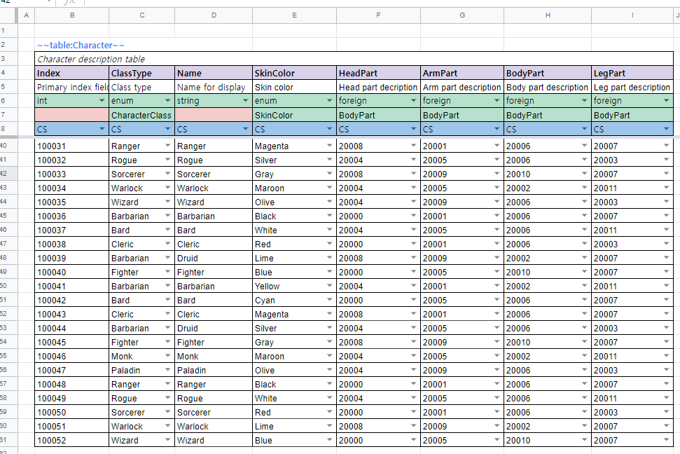
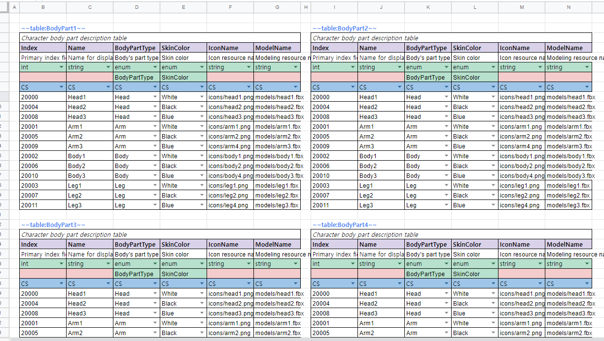
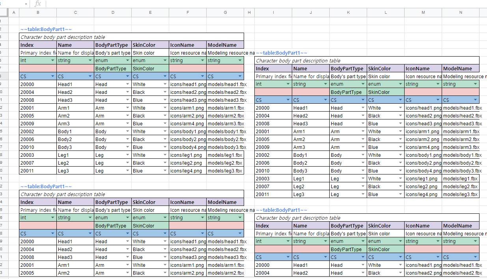
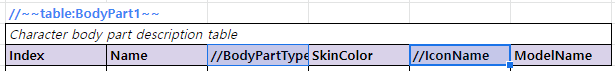
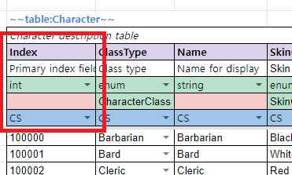
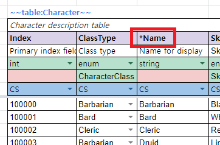

# 시트 작성

엑셀과 구글 스프레드시트에 데이터를 어떻게 배치하고, Tabbit이 그것을 어떻게 읽는지.

> [문서 목록으로](readme.md)

---

## Terminologies

시작하기에 앞서서 몇가지 용어에 대해서 얘기하겠습니다.

|용어|설명|
|--|--|
|워크북|시트들을 담는 파일 단위입니다. 엑셀에서는 `.xlsx` 파일 하나, 구글 스프레드시트에서는 스프레드시트 문서 하나(URL의 ID 하나)가 워크북입니다. 이 문서 전체에서 이 단위를 `워크북`이라고 부릅니다.|
|시트|워크북 안의 개별 탭 하나를 가리킵니다. 엑셀의 워크시트, 구글 스프레드시트의 시트에 해당합니다.|
|Entity|`Tabbit`에서 지원하는 각 정의 요소를 가리킵니다.|
|Recipe 파일|`Tabbit`에서 사용하는 입력 소스 시트 및 출력 옵션등을 설정하기 위한, .json 형식의 파일입니다.|
|Name Case|Camel / Pascal / Snake / Kebab 등의 이름 표기 형식을 얘기합니다.|


## Excel

지정한 폴더안의 모든(하위 경로포함) `.xlsx` 파일을 가져와서 처리하게 됩니다. 단, 이때 사용할 파일과 아닌 파일이 섞여 있는 경우에는 기본적으로 모든 파일이 변환 대상이 되므로 문제가 될수 있습니다. 이때에는 폴더명 및 파일명에 `#`을 앞에 붙여주면 변환대상에서 제외됩니다. 또한, 변환할 파일이 엑셀에서 열려져 있는 경우에는 파일이 잠금이 되어 있어서 변환에 실패할 수 있습니다.

또한 [다양한 엑셀 파일 확장자](https://support.microsoft.com/ko-kr/office/excel%EC%97%90%EC%84%9C-%EC%A7%80%EC%9B%90%ED%95%98%EB%8A%94-%ED%8C%8C%EC%9D%BC-%ED%98%95%EC%8B%9D-0943ff2c-6014-4e8d-aaea-b83d51d46247)들이 있을 수 있습니다.

이때에는 입력 소스지정에 `FilePatterns`을 지정해주면 가능합니다. 특별히 지정하지 않는 경우에는 와일드 카드(`*`)를 지정하면 됩니다.


## Google Spread Sheets

[구글 개발자 콘솔](https://console.cloud.google.com)에서 프로젝트를 하나 만들어야 하는 것은 같고,
**거기서 무엇을 받는지가 둘로 갈립니다.**

|누가 변환을 돌리나|무엇을 받나|recipe에 적는 것|
|--|--|--|
|**사람** — 개발자의 기계|`OAuth2` 클라이언트 ID|`ClientSecretFilename`|
|**빌드 서버** — CI 잡|**서비스 계정 키**|`ServiceAccountKeyVariable` 또는 `ServiceAccountKeyFile`|

혼자 쓴다면 아래 2번만 보면 됩니다. **CI를 붙이는 시점에 3번이 필요해집니다** — 클라이언트
비밀은 변환을 돌리는 *사람*으로 접속하므로, 그것을 빌드 서버에 두면 파이프라인의 문서 접근
권한이 한 사람의 계정에 종속됩니다. 그 사람이 조직을 떠나거나 권한이 회수되면 빌드가
중단됩니다.

**둘을 함께 적으면 거절합니다.** 서로 다른 신원이라 하나를 말없이 고르면 그 잡이 자기가 아닌
사람으로 문서를 읽게 되고, 산출물의 어디에도 그 사실이 남지 않기 때문입니다.


### 1. 프로젝트 생성

> 작성중


### 2. `OAuth2` 사용자 인증 정보를 획득 — 사람이 돌릴 때

받은 파일은 아무 데나 두고 그 경로를 `recipe`의 `ClientSecretFilename`에 적어주면 됩니다.

처음 한 번은 브라우저가 열리면서 동의를 묻습니다. 그 뒤로는 `~/.credentials/sheets.googleapis.com-tabbit`에 토큰이 남아 다시 묻지 않습니다. 다른 PC에서도 묻지 않게 하려면 이 파일을 같은 경로에 복사해두면 됩니다.

> 이 복사가 **CI에서 쓰던 우회**입니다. 3번이 그것을 대신합니다 — 토큰에는 수명이 있고, 만료되면
> 그때부터 빌드가 멈추는데 그 시점을 아무도 예고받지 않습니다.

<details>
<summary><b>스크린샷을 따라가며 발급받기</b> (펼쳐보기)</summary>

<br>

1. 아래 화면에서 `사용자 인증 정보 만들기`를 클릭합니다.


2. `OAuth 클라이언트 ID`를 선택합니다.


3. `어플리케이션 유형*`은 `데스크톱 앱`으로 설정하고, `이름*`은 `Tabbit`으로 한 후 `만들기` 버튼을 클릭합니다.


4. `JSON 다운로드` 버튼을 클릭해서 인증정보가 담긴 파일을 다운로드합니다.


5. 다운로드한 파일을 임의의 위치에 저장해둡니다.


위에서 저장해둔 파일명을 기억해 두었다가 추후 설명할 `recipe` 파일에 기입해주어야합니다.

</details>

> **이 파일을 저장소에 커밋하지 마십시오.** `.gitignore`가 `**/googlesheets-client-secret.json`을 막고 있지만, 다른 이름으로 저장하면 걸리지 않습니다.
>
> 그리고 **이미 커밋해버렸다면 추적 해제로는 해결되지 않습니다.** 히스토리에 남고, 이미 클론한 사본에서는 히스토리 재작성도 무력합니다. [GCP 콘솔의 사용자 인증 정보 페이지](https://console.cloud.google.com/apis/credentials)에서 **해당 클라이언트를 삭제하고 새로 발급**하는 것이 유일한 조치입니다.
>
> 스크린샷도 확인하십시오. 이 저장소의 위 이미지에는 클라이언트 ID와 보안 비밀번호가 평문으로 찍혀 있었고(현재는 가려둔 상태), 그 자격증명은 아직 폐기되지 않았습니다 — 프로젝트 `crested-photon-338102`.


### 3. 서비스 계정 키 — 빌드 서버가 돌릴 때

**서비스 계정은 사람이 아니라 잡의 신원입니다.** 대화형 동의가 없고, 문서는 동료에게 공유하듯
그 계정의 주소에 공유합니다.

1. GCP 콘솔의 `IAM 및 관리자` → `서비스 계정`에서 서비스 계정을 하나 만듭니다. 프로젝트
   역할은 **주지 않아도 됩니다** — 필요한 권한은 GCP의 역할이 아니라 스프레드시트 쪽 공유입니다.
2. 만든 계정의 `키` 탭 → `키 추가` → `새 키 만들기` → `JSON`으로 키를 내려받습니다.
3. 키 파일 안의 **`client_email`**(`…@….iam.gserviceaccount.com`)을 복사해, 읽을
   **스프레드시트 문서를 그 주소에 `뷰어`로 공유**합니다. 이 단계를 빼먹으면 문서가 없다는
   응답이 옵니다 — 계정은 유효하고 그 문서만 안 보이는 것입니다.
4. 키를 CI의 시크릿 저장소에 넣고, recipe에는 **그 환경 변수의 이름**을 적습니다.

```jsonc
{ "ServiceAccountKeyVariable": "TABBIT_SHEETS_KEY", "SheetsId": "…" }
```

```yaml
# .github/workflows/data.yml
- run: tabbit --recipe recipe.jsonc --env live
  env:
    TABBIT_SHEETS_KEY: ${{ secrets.TABBIT_SHEETS_KEY }}
```

**환경 변수 쪽이 파일보다 낫습니다** — 키가 러너의 디스크에 남지 않고, 저장소에 실수로 들어갈
파일 자체가 생기지 않기 때문입니다. 로컬에서 서비스 계정으로 확인해볼 때만
`ServiceAccountKeyFile`을 씁니다.

> **이 키도 커밋하지 마십시오.** `.gitignore`가 `**/googlesheets-service-account.json`을 막고
> 있지만 다른 이름으로 저장하면 걸리지 않습니다. 커밋해버렸다면 조치는 위와 같습니다 — 추적
> 해제로는 해결되지 않고, 콘솔에서 **그 키를 삭제**해야 합니다. 서비스 계정은 키를 여러 개 가질
> 수 있으므로, 새 키를 먼저 만들어 넣고 옛 키를 지우면 빌드가 멈추지 않습니다.
>
> **클라이언트 비밀 파일을 이 자리에 적으면 그 자리에서 거절합니다.** 구글이 내려주는 두 JSON은
> 바꿔 넣기 쉬운데, 그대로 API로 보내면 권한 오류로 돌아와 문서 공유 문제처럼 읽히기 때문입니다.


## 인식되는 워크북/시트 대상

`recipe`에 적은 엑셀 파일과 구글 스프레드시트는 전부 합쳐서 하나로 봅니다. 파일이 몇 개든, 시트가 몇 장이든 결과는 하나입니다.

나누는 건 어디까지나 편집하기 편하라고 하는 것입니다. 기획자별로 파일을 나누든 콘텐츠별로 나누든, 도구가 보는 것은 합쳐진 하나의 데이터입니다.

### 읽을 워크북과 시트 골라내기

기본은 **전부 포함**입니다. 폴더에 입력이 아닌 워크북(참고용 백업, 테이블로 만들 수 없는 파일)이 있거나 워크북에 데이터 외의 것(참고용 탭, 작업 메모, 만들다 만 표)이 섞여 있다면 recipe의 소스 항목에서 골라낼 수 있습니다.

```jsonc
"Xlsx": [{
  "Path": "./sheets",

  "ExcludeWorkbooks": ["백업/*", "*_참고용*"],   // 워크북 자체를 빼기. 열지도 않습니다

  "IncludeSheets": ["CharacterTable", "ItemTable", "Stage*"],   // 비우면 전부
  "ExcludeSheets": [
    "*참고용*",                    // 모든 워크북에 적용
    "[Items.xlsx]Define"          // 그 워크북에만 적용
  ]
}]
```

- 배열로도, `;`로 이은 문자열로도 쓸 수 있습니다. 목록이 길면 배열이 읽기 좋습니다.
- `*` `?`는 파일 글롭과 같습니다. 대소문자는 구분하지 않습니다.
- 워크북은 `Path` 기준 상대 경로·파일명·확장자를 뗀 이름 중 무엇으로 적어도 됩니다.
- **시트 이름은 워크북마다 겹칩니다.** 한쪽의 `Define`은 테이블이고 다른 쪽의 `Define`은 작업용 탭일 때 `[워크북]시트`로 구분합니다.
- **`IncludeWorkbooks`·`IncludeSheets`에 적었는데 없는 것은 오류입니다.** 적어놓고 표시 없이 빠지면 산출물에서 테이블 하나가 사라진 걸 아무도 모르기 때문입니다. 오류 메시지가 실제로 있는 목록을 같이 보여줍니다.

자세한 것은 [recipe 레퍼런스](recipe.md#읽을-워크북과-시트-골라내기)에 있습니다.

`GoogleSheets` 소스에서도 똑같이 동작하고, 워크북 목록은 문서 제목과 맞춰봅니다.


## 시트 공간 사용 방법

시트 하나에 여러개의 엔티티를 정의할수도 있고, 편집 편의성을 위해서 여러개의 시트로 나누어서 작성할수도 있습니다. 특별히 제한을 두지 않는 구조입니다. 또한 하나의 시트에 여러개의 엔티티를 몰아서 정의할때도 빈틈없이 배치해도 아무런 문제가 없습니다. 다만 보기좋게 한칸 정도 공간을 띄워주면 좋을것입니다.

단, 주의해야할 점이 하나 있습니다. 각 엔티티 기본 정의요소 바로 옆에 엔티티가 아닌 부분을 작성하면 엔티티 정의의 일부로 인식될 수 있으므로, 한칸 띄운 곳의 셀에 작성해주셔야 합니다. 엔티티 바로 옆에 다른 엔티티를 정의하는것은 문제가 없으나, 엔티티 정의 바로 옆에 엔티티가 아닌 부분이 오면 문제가 생깁니다.

### 시트 하나에 하나씩 배치
일반적인 배치 방법이며, 데이터가 많을 경우 틀고정을 사용할 수 있는 장점이 있습니다.



### 한칸씩 띄워서 여러개 배치 (다소 복잡하지만 한눈에 확인 가능)



### 빈틈없이 빼곡하게 배치 (알뜰형?)


### 임의 위치로 지그재그로 배치 (일단 모아놓고 보자! 정리는 나중에?)



### 엔티티 영역외에 내용 적기
엔티티 정의 영역외의 부분은 변환과정에 관여하지 않으므로 메모등을 사용해도 좋습니다.

__다만, 한칸 정도 띄우고 사용해야합니다.__


### <font color=red>엔티티들이 맞붙은건 상관없지만, 서로 침범하면 안됨</font>


__위의 배치 방법중 데이터를 작성하거나 보는 사람이 불편함이 없다면, 자유롭게 사용해도 무방합니다. 단,  침범(cross-section)이 발생하면 안됩니다.__


## Entity Marker

|마커종류|설명|
|--|--|
|`~~enum:CharacterClass~~`|enum 정의 시작 표시용 마커|
|`~~const:Constants~~`|상수정의 정의 시작 표시용 마커|
|`~~table:Character~~`|테이블 정의 시작 표시용 마커|


위와 같은 형태를 `Entity Marker`라고 합니다. 각 엔티티 정의의 시작 부분을 나타내기 위해서 사용되어집니다. 아름답지 않게 앞뒤로 `~~` 문자를 식별자로 사용하는 이유는 시트내의 셀들을 좀더 자유롭게 사용할 수 있도록 하기 위함입니다.

마커 태그 표현식은 아래와 같습니다.

`~~` `entity-type` `:` `entity-name` [`:` `target-side`] `~~`

|구분|설명|
|--|--|
|entity-type|정의할 엔티티의 타입을 나타냅니다. (현재는 enum / const / table중 하나를 지정할 수 있습니다.)|
|entity-name|엔티티의 이름을 지정합니다. 엔티티의 이름은 __타입에 상관 없이 유니크__ 해야합니다.|
|target-side|출력 대상을 지정합니다. (선택사항이며, 생략했을 경우 CS(서버/클라 모두)로 지정됩니다.)|

> 마커 태그 사이의 공백은 무시됩니다. `~~   const   :   MyConstants  ~~` 이렇게 해도 상관없습니다. 다만, 공백은 가급적 사용하지 않는것을 권해드립니다.


## Trimming

데이터를 불러올 때 모든 셀의 값을 `Trimming` 한 뒤 불러옵니다. 앞뒤에 공백을 추가해도 제거되므로 주의가 필요합니다. UI 텍스트로 출력할 때 앞뒤 공백으로 레이아웃을 맞추는 방식은 동작하지 않습니다. 필요하다면 공백 대신 다른 문자를 기재하고, 그 문자를 공백으로 치환하는 형태로 처리합니다.


## Naming Rules

모든 엔티티 및 필드 이름은 내부적으로 `Pascal case`로 자동변환 됩니다. 이는 처리의 단순화를 위해서 결정한 사항입니다.

다만, 다음과 같은 부작용이 발생할 수 있으므로 주의해야합니다.

1. `_` (underscore) 의 갯수로 구분 지은 후 다른 이름이라고 생각하면 안됩니다.
예를들어 "x_y" (undersocre 한개) 와 "x__y" (underscore 두개) 는 실제로 프로그램에서는 "Xy"로 인식하게 되므로, 이름이 겹치는 걸로 인식되어 오류 메시지를 표시하게 됩니다.
기본적으로 "_" 의 갯수로 구분지어서 작명하는것은 가독성도 떨어지고 좋은 방법은 아닐것입니다.
2. 이름은 길지 않은 선에서 최대한 의미있게 지어야합니다. 프로그램 코드에 대부분 직접 반영되는 요소이기 때문에 명확한 함의가 있을수록 좋습니다.
3. 예약어와 겹치는 이름은 **자동으로 회피**되므로 컴파일이 깨지지 않습니다. 다만 생성된 이름이 시트에 적은 것과 달라지므로 알아두는 게 좋습니다.

|언어|멤버 표기|회피 방식|예|
|--|--|--|--|
|C#|`PascalCase`|(거의 불필요)|`Class` — C# 예약어는 전부 소문자라 겹치지 않습니다|
|TypeScript|`camelCase`|`{이름}_`|`class` — TS는 예약어를 멤버로 허용합니다. 문제는 `Constructor` → `constructor_`|
|C++|`snake_case`|`tb_{이름}`|`Class` → `tb_class`|
|Go|`PascalCase`|`{이름}_`|`Class` — Go 예약어는 소문자이고 export하려면 대문자여야 하므로 겹치지 않습니다|
|Rust|`snake_case`|`{이름}_`|`Type` → `type_` (`Class`는 Rust 키워드가 아니라 `class` 그대로)|
|Python|`snake_case`|`{이름}_`|`Class` → `class_`|
|Java|`camelCase`|`{이름}_`|`Class` → `class_`|
|Kotlin|`camelCase`|`` `{이름}` ``|`Class` → `` `class` `` — Kotlin은 백틱 이스케이프를 허용합니다|
|Ruby|`snake_case`|`{이름}_`|`Class` → `class_`|
|Dart|`camelCase`|`{이름}_`|`Class` → `class_`, `Int` → `int_` (앞이 아니라 뒤에 붙입니다 — 앞에 `_`를 붙이면 라이브러리 private이 됩니다)|
|Unreal|`PascalCase`|(불필요)|`Class` — UPROPERTY 이름은 C++ 키워드와 겹치지 않습니다|

> 이 표는 추측이 아닙니다. `reserved-words` 픽스처가 예약어로 이름 지은 필드를 담고 있고, 회귀 스위트가 그 산출물을 **12개 언어 전부에서 실제로 컴파일**합니다.
>
> Dart의 `Int` → `int_`가 그렇게 해서 나왔습니다. `int`는 Dart 예약어가 아니라 그냥 타입 이름인데, 같은 이름의 필드가 클래스 안에서 그 타입을 가려버려서 `int int = 0;` 다음 줄부터 컴파일이 깨집니다. 예약어 목록으로는 검출할 수 없는 종류라, 컴파일러에 걸리기 전까지 몰랐습니다.

## Supported Entities

지원하는 엔티티는 다음 셋입니다.

|종류|마커|설명|
|--|--|--|
|Enum|`~~enum:이름~~`|열거형 정의|
|ConstantSet|`~~const:이름~~`|상수 정의 묶음|
|Table|`~~table:이름~~`|데이터 테이블 정의 및 데이터|

> **상수 세트를 고르기 전에.** 상수는 **데이터 파일이 아니라 코드로 나갑니다** — 생성된 소스의 선언 한 줄이 전부이고 `.tcb`에는 아무것도 실리지 않습니다. 그래서 값 하나만 고치면 변환은 성공하는데 **데이터 파일은 한 개도 바뀌지 않고**, 코드를 다시 생성해 배포하기 전까지 라이브는 그대로입니다. 라이브 중에 조정할 가능성이 있는 수치라면 상수 세트가 아니라 **테이블 한 행**으로 두세요. [무엇이 코드로 나가고 무엇이 데이터로 나가는가](languages/readme.md#데이터만-나가도-되는-변경과-코드가-함께-나가야-하는-변경)

> **0번 라벨이 없는 enum에는 `None = 0`이 자동으로 들어갑니다.** enum 타입의 필드는 값이 대입되기 전에도 뭔가를 들고 있어야 하는데, 그게 이름 없는 0이면 디버거에서도 로그에서도 읽을 수가 없기 때문입니다. 시트가 0에 이미 뭔가를 두었다면 손대지 않습니다. 시트에 적은 것만 정확히 나오길 원한다면 recipe의 `"AutoInsertEnumNoneLabel": false`로 끄세요.


## Parsing Rules

기본적으로 .NET의 파싱 규칙을 따르지만, 일부 타입은 자체적으로 파싱합니다.

**모든 파싱은 `InvariantCulture`로 수행됩니다.** 변환 결과가 빌드를 돌리는 PC의 지역 설정에 따라 달라지면 안 되기 때문입니다. 소수점은 항상 `.`이고 쉼표는 항상 천단위 구분자입니다.

|타입|파싱|비고|
|---|---|--|
|string|그대로|앞뒤 공백을 제거한 후 읽어옵니다.|
|int|`int.Parse`|천단위 구분자 허용. `1,000,000` 가능. `0x`·`0b` 허용|
|bigint|`long.Parse`|천단위 구분자 허용. `0x`·`0b` 허용|
|bitset|자체 파싱|플래그 묶음. **더 엄격합니다** — 부호·천단위·소수점·지수를 거절합니다. [아래](#bitset--플래그-묶음)|
|float|`float.Parse`|천단위 구분자 허용. `0x`·`0b`는 정확히 표현되는 값만|
|double|`double.Parse`|천단위 구분자 허용. `0x`·`0b`는 정확히 표현되는 값만|
|bool|자체 파싱|아래 참고|
|datetime|`DateTime.Parse`|엑셀의 날짜 셀은 자동으로 인식됩니다. 텍스트로 적을 경우 `2022-01-24 10:30:00` 형식을 권합니다.|
|timespan|`TimeSpan.Parse`|`1.02:03:04` (일.시:분:초) 형식. [MSDN 참고](https://learn.microsoft.com/dotnet/api/system.timespan.parse)|
|uuid|`Guid.Parse`|[MSDN 참고](https://learn.microsoft.com/dotnet/api/system.guid.parse)|
|enum|라벨 이름 또는 값|선언된 표기(`fire_ball`), Pascal 표기(`FireBall`), 숫자(`1`) 모두 허용|
|`T[]`|구분자로 분리 후 각 요소 파싱|빈 셀은 빈 배열|

### bool 파싱

|값|결과|
|--|--|
|`Y` `YES` `TRUE` `1`|참|
|`N` `NO` `FALSE` `0`|거짓|
|빈 셀|거짓|
|그 외 숫자|0이 아니면 참|
|그 외 텍스트|**오류**|

대소문자는 구분하지 않습니다. 빈 셀이 거짓인 것은 의도된 것이지만, 알 수 없는 텍스트는 오류입니다 — `Ture` 같은 오타가 말없이 거짓이 되면 이 도구가 검출해야 할 휴먼 오류가 그대로 데이터에 들어갑니다.

### 엑셀 수식 오류

수식이 `#DIV/0!`, `#REF!` 등으로 평가된 셀은 오류로 보고됩니다. Tabbit은 수식을 직접 평가하지 않고 파일에 캐시된 결과를 읽으므로, 엑셀에서 오류가 보이는 상태로 저장된 셀이 그대로 걸립니다.


## 작성중인 데이터 임시로 제외하기

데이터 작성도중 아직 완벽하게 작성된 데이터가 아닌 워크북/시트들도 있을것입니다. 이를 변환과정에서 제외하고 싶다면, 다른 폴더로 옮기던지 하는 방법이 있을수 있겠지만, 다소 번거로울 수 있습니다. 이때 파일명 또는 시트명 그리고 필드명, 변수명에 아래와 같이 Prefix를 붙여주면 변환대상에서 제외됩니다.

폴더,워크북,시트,엔티티,필드명 앞에 `#` 또는 `//`를 붙여주게 되면 변환 대상에서 제외됩니다.
단, 엑셀에서는 `//` 문자를 입력할 수 없으므로 `#` 만 사용할 수 있습니다.

### 워크북(엑셀 파일 또는 구글 스프레드시트 문서) 제외하기
파일명(엑셀의 경우 폴더명도 제외 가능)에 `#` 또는 `//`를 붙여줍니다. 다만, 구글 스프레드시트의 경우에는 워크북을 ID로 지정해서 변환 대상으로 삼기 때문에 `recipe` 파일에서 구글시트 ID를 지정하는 부분을 주석처리하면 됩니다.

### 시트 제외하기
시트명 앞에 `#` 또는 `//`를 붙여줍니다.


### 엔티티 제외하기
엔티티 마커 태그 앞에 `#` 또는 `//`를 붙여줍니다.


### 필드 제외하기
필드명 앞에 `#` 또는 `//`를 붙여줍니다. 단, `primary index` 필드는 제외할 수 없습니다.




## 엔티티 정의방법
- enum 정의
- 상수 테이블 정의
- 테이블 정의

각 엔티티 정의 방법을 구체적으로 사용해야함.


## 인덱스 필드

### 기본 인덱스

테이블을 정의할 때 필수로 있어야 하는 필드로, 테이블 로우(행)의 기본 인덱스가 됩니다.
**첫 컬럼**이 그것이고, 다음 조건을 만족해야 합니다.

- 값들이 `unique` 해야 합니다.
- **옵셔널일 수 없습니다.** `int?`는 거부됩니다 — [옵셔널](#옵셔널--타입-끝의-) 참고.
- `TargetSide`가 양쪽이어야 합니다. 모든 행이 그것으로 식별되므로 한쪽 빌드에만 있을 수 없습니다.
- 타입이 행을 구별할 수 있어야 합니다 — 아래.

**이름은 정해져 있지 않습니다.** `index`라고 쓰는 것이 관례일 뿐이고, `Id`라고 쓰면 생성되는
조회가 `FindById`가 됩니다. 참조 해석도 대상 테이블의 인덱스 이름을 읽어 쓰므로 이름이
무엇이든 같게 풀립니다.

### 인덱스가 될 수 있는 타입

**`int`만도 `int`·`string`만도 아닙니다.** 생성되는 조회는 인덱스 필드 **자신의 타입에 대한
사전**이므로(`Dictionary<string, Record>` · `Map<Guid, Record>`), 타입이 무엇인지는 조회가
성립하는지와 무관합니다. 그래서 규칙은 「어느 타입인가」가 아니라 **「그 값으로 행을 구별할 수
있는가」** 하나이고, 기본 인덱스와 보조 인덱스에 똑같이 적용됩니다.

|됩니다|안 됩니다|왜 안 되는가|
|--|--|--|
|`int` · `bigint` · `string` · `uuid` · `enum`|`bool`|값이 둘뿐이라 행이 두 개를 넘을 수 없습니다|
||`float` · `double`|정확히 비교되지 않아, 같아 보이는 값에서 조회가 **실패 없이 빗나갑니다**|
||`T[]`|한 셀에 값이 여럿인데 키는 하나입니다|
||`datetime` · `timespan`|비교는 정확합니다(틱). **행을 시각으로 찾는 시트가 없어서** 받지 않습니다|

`enum`이 되는 것은 라벨이 작성자가 적은 목록이고, 라벨마다 한 행인 테이블이 실제로 있기
때문입니다. `bool`과 다른 점이 그것입니다.

`datetime`·`timespan`을 뺀 이유는 카디널리티가 아닙니다. 받으려면 「시각으로 키를 잡은 조회」를
13개 언어에서 보증해야 하고, 그중 몇 언어는 **동등성이 값의 것이 아닌 타입**을 시각에 씁니다 —
요구가 없는 모양에 그 비용을 쓰지 않습니다. 시각을 들고 싶으면 평범한 컬럼으로 두고 키는 다른
것으로 잡으세요.

### 가리켜질 수 있는 키 — enum 하나만 예외

|무엇|`int` 인덱스|`bigint`·`string`·`uuid`|`enum`|
|--|--|--|--|
|`GetByIndex` / 사전|됩니다|됩니다|됩니다|
|보조 인덱스(`*`)와 함께|됩니다|됩니다|됩니다|
|**다른 테이블이 이 테이블을 참조**|됩니다|**됩니다**|**안 됩니다**|

`foreign` 컬럼은 대상의 인덱스 값을 담고, **그 값의 타입은 대상이 정합니다** — `int`는 그중 한
경우입니다 ([설계](../spec/reference-key-types.md)). 그래서 이름으로 키를 잡은 테이블도 그냥
가리키면 되고, 참조 셀에 그 이름을 적습니다.

**`enum` 키만 남았습니다.** 규칙이 아니라 구멍입니다 — enum 값은 고정 폭이 아니라 지그재그
인코딩으로 실리고, 그 읽기는 언어마다 자기 enum을 쓰므로 공용 읽기 표에 항목이 없습니다. 그
경우 그 셀을 가리켜 거부하고, 대상을 enum의 바탕 `int`로 키 잡으라고 안내합니다.



### 보조 인덱스

기본 인덱스 외에 빠른 검색을 위해 추가로 인덱싱하고 싶은 필드가 있을 수 있습니다. 예를 들어
이름으로 검색을 빠르게 혹은 편하게 하고 싶다면 아래와 같이 `Name` 필드 앞에 `*` 문자를
붙여주면 됩니다. 값들이 `unique` 해야 하고, 기본 인덱스와 같은 이유로 옵셔널일 수 없으며,
**될 수 있는 타입도 기본 인덱스와 같습니다.**




## 와이어 태그 (`@N`)

바이너리 파일에서 컬럼을 식별하는 번호입니다. 필드 이름 뒤에 `@N`으로 답니다.

```
index@1    Name@2    Price@3    #OldColor@4    *Grade@5
```

**왜 필요한가.** 태그가 있으면 컬럼의 신원이 위치가 아니라 번호입니다. 그래서 컬럼을 지우거나 순서를 바꾸거나 이름을 바꿔도, **이미 배포된 클라이언트가** 나머지 컬럼을 그대로 읽습니다. 데이터만 패치하거나 구버전 클라이언트가 새 데이터를 받는 흐름이 있다면 태그를 다세요.

|규칙|내용|
|--|--|
|전부 또는 전무|한 테이블 안에서 전부 달거나 전부 안 답니다. 섞으면 오류입니다|
|1 이상, 유일|중복이나 0 이하는 오류입니다|
|`#이름@N`|제외된 컬럼도 태그를 **예약**합니다. 지운 컬럼의 묘비이자, 미래를 위해 미리 잡아두는 자리입니다|
|serial field|`Slot1`, `Slot2`…는 파일에서 컬럼 하나이므로 태그는 **첫 컬럼에만** 답니다|
|안 달면|위치대로 1..N이 배정됩니다. 동작은 같지만 **끝에 추가하는 것만 안전**합니다 — 중간을 지우면 그 뒤 태그가 전부 밀립니다|

한 번 데이터를 실은 태그는 **다시 쓸 수 없습니다.** 지운 컬럼의 태그를 다른 컬럼에 주면, 삭제 전에 만들어진 테이블 리더가 새 컬럼을 옛 필드로 읽고도 성공합니다 — 그것이 태그 방식이 유일하게 못 견디는 변경입니다. 그래서 지울 때 `#이름@N`을 남깁니다.

자세한 것과 타입을 바꿀 때의 규칙은 [바이너리 형식](binary-format.md)에 있습니다.


## Supported Data Types

`Tabbit`에서 지원하는 데이터 타입은 아래와 같습니다.

|Type|Description|Range|
|--|--|--|
|string|A sequence of UTF8 characters| |
|text|`string`이면서, 번역을 위해 수집되는 값. [아래](#text--번역을-위해-수집되는-문자열)| |
|asset|`string`이면서, 그 이름의 파일이 있는지 확인되는 값. [아래](#asset--파일이-있어야-하는-문자열)| |
|int|32-bit signed integer|-2,147,483,648 ~ 2,147,483,647|
|bigint|64-bit signed integer|-9,223,372,036,854,775,808 ~ 9,223,372,036,854,775,807|
|bitset|최대 64개의 플래그. 값이 아니라 비트 패턴|64비트 전부. [아래](#bitset--플래그-묶음)|
|float|32-bit single-precision floating point type|-3.402823e38 ~ 3.402823e38|
|double|64-bit double-precision floating point type|-1.79769313486232e308 ~ 1.79769313486232e308|
|bool|8-bit logical true/false value|true or false|
|datetime|Represents date and time|0:00:00am 1/1/01 ~ 11:59:59pm 12/31/9999|
|timespan|Represents a time interval.|[MSDN 참고](https://docs.microsoft.com/en-us/dotnet/api/system.timespan.parse?view=net-6.0#system-timespan-parse(system-string))|
|uuid|Represents a globally unique identifier (GUID).|[MSDN 참고](https://docs.microsoft.com/en-us/dotnet/api/system.guid?view=net-6.0)|
|enum|자체적으로 선언된 엔티티 enum| |
|foreign|외부 테이블 참조| |
|`vec2i`·`vec3i`·`vec4i`|정수 성분 2~4개. `(111, 222)`|성분마다 `int`. [아래](#합성-값-타입--벡터--회전--색)|
|`vec2f`·`vec3f`·`vec4f`|실수 성분 2~4개|성분마다 `float`|
|`euler`|축마다 각도 하나씩 3개(도)|성분마다 `float`|
|`quat`|회전. `(x, y, z, w)` 또는 `identity`|성분마다 `float`|
|`axisangle`|축과 각도(도). `(0, 1, 0, 90)`|성분마다 `float`|
|`color`|실수 RGBA. HDR 값도 담습니다|성분마다 `float`, 범위 제한 없음|
|`color32`|8비트 RGBA. `#3366CC`·`red`|성분마다 0~255|
|`T[]`|구분자로 구분된 배열. 예: `int[]`, `string[]`, `enum[]`|로우마다 길이가 다를 수 있음|

### 배열 타입

타입 칸에 `int[]`, `string[]`, `enum[]` 처럼 적으면 셀 하나에 여러 값을 넣을 수 있습니다.

|index|Tags|Costs|
|--|--|--|
|`int`|`string[]`|`int[]`|
|1|`red;green;blue`|`10;20;30`|
|2|`solo`|`5`|
|3| | |

- 구분자는 기본 `;`이며 recipe의 `ArrayDelimiter`로 바꿀 수 있습니다. 쉼표가 기본이 아닌 이유는 일반 문장과 숫자 표기에 너무 흔하기 때문입니다.
- 각 요소의 앞뒤 공백은 제거됩니다. `1; 2 ;3`은 `1;2;3`과 같습니다.
- 빈 셀은 오류가 아니라 **빈 배열**입니다. 해당 컬럼에 값이 없는 행은 흔한 경우이기 때문입니다.
- `foreign[]`은 지원하지 않습니다. 로우마다 가변 개수의 참조를 해석해야 하는데 생성되는 테이블 리더에 그런 형태가 없어서, 해석되지 않는 코드를 말없이 만드는 대신 명시적으로 거부합니다. 고정 개수라면 `SerialField`를 사용하세요.

### `bitset` — 플래그 묶음

최대 64개의 플래그를 담습니다. 파일에는 64비트 정수로 실리고, 생성되는 코드에서도 `bigint`와 같은 타입입니다 — 이 타입이 `bigint`와 다른 것은 **담는 값이 아니라 받아들이는 표기**입니다.

|index|Perm|
|--|--|
|`int`|`bitset`|
|1|`0b1011`|
|2|`0x1f`|
|3|`123`|
|4|`0xFFFFFFFFFFFFFFFF`|

- **10진수·`0x`·`0b`** 를 받습니다. 대소문자는 가리지 않습니다.
- **`0x`와 `0b`는 64비트 전부에 닿습니다.** 모든 플래그를 켜려면 `0xFFFFFFFFFFFFFFFF`이고, 이것은 부호 있는 64비트의 `-1`과 같은 비트 패턴입니다.
- **10진수는 2^53까지입니다.** 엑셀의 숫자 셀은 double이라 그보다 큰 값은 셀에 적히는 순간 이미 반올림되어 있습니다. 그 위의 값은 `0x`나 `0b`로 적어야 하고, 그렇게 하라는 메시지에 셀 위치가 함께 나옵니다.
- **거절하는 것** — 부호(`-1`), 천단위 구분자(`1,000`), 소수점(`1.5`와 **`1.0` 둘 다**), 지수(`1e3`), 밑줄(`0b1010_1010`). 비트 패턴에 뜻이 없는 표기이고, 애매하게 받아들이는 것보다 오류가 낫기 때문입니다.
- `bitset[]`과 `bitset?`을 쓸 수 있습니다. 빈 칸은 플래그가 하나도 없는 것(`0`)입니다.

> 설계와 근거는 [비트셋](../spec/bitset.md)에 있습니다.

### 합성 값 타입 — 벡터 · 회전 · 색

성분이 여러 개인 값을 **셀 하나**에 적습니다. 컬럼 3개로 적던 좌표가 컬럼 하나가 되고, 타입 행에
그것이 좌표라고 적힙니다.

|index|Pos|Cell|Rot|Tint|Glow|
|--|--|--|--|--|--|
|`int`|`vec3f`|`vec2i`|`quat`|`color32`|`color`|
|1|`(1.5, -2.5, 0)`|`(3, 4)`|`identity`|`#3399CC`|`#33CCFF`|
|2|`one`|`zero`|`(0, 1, 0, 0)`|`cornflowerblue`|`transparent`|
|3|`0,0,0`|`Vector2i.one`|`(1,0,0,0)`|`(255, 0, 0, 128)`|`#FF00FF`|

**생성되는 코드에서는 레코드입니다.** 위의 `Pos`는 `Pos.X`·`Pos.Y`·`Pos.Z`라고 적은 컬럼 3개와
**완전히 같은 것**이 됩니다 — 같은 JSON, 같은 바이트, 같은 구조체.

- **튜플** — 구분자는 쉼표이고 괄호는 생략할 수 있습니다. 성분 개수는 정확히 맞아야 합니다.
- **기호** — `zero`·`one`(벡터), `identity`(`quat`·`axisangle`). `vec2i.one`이나 `Vector2i.one`처럼
  타입 이름을 앞에 붙여도 됩니다. 다른 타입 이름을 붙이면 오류입니다.
- **색** — `#RGB`·`#RRGGBB`·`#RRGGBBAA`·`0xRRGGBB`, CSS 색 이름 148개, `transparent`. 알파를
  생략하면 불투명입니다.
- **팔레트** — recipe의 `Palettes`에 파일을 등록하면 `material.blue.500`처럼 씁니다. 접두 없는
  이름은 언제나 내장 `css`이므로 팔레트를 추가해도 기존 시트의 색이 달라지지 않습니다.
- **`color`와 `color32`** — 표기는 같고 성분이 다릅니다. `color32`는 정수 0~255이고 소수점을
  거절합니다(`(1.0, 1.0, 1.0)`이 흰색인지 3/255인지 갈리기 때문입니다). `color`는 실수이고 1을
  넘는 HDR 값을 받습니다.
- **`?`를 쓸 수 있습니다.** 빈 칸은 성분이 전부 0이고, `quat`은 `(0,0,0,1)`, `axisangle`은
  `(0,0,1,0)`입니다.
- **`up`·`forward`는 없습니다.** 위쪽과 앞쪽이 엔진마다 다르므로(Unity는 `+Y`·`+Z`, Unreal은
  `+Z`·`+X`) 이 도구가 고르지 않습니다. 튜플로 적습니다.
- **쓸 수 없는 자리 셋** — 인덱스(`*`), `@N` 태그, 컬럼 제약. 셋 다 타입 이름과 함께 거절됩니다.
- **엑셀 서식 주의.** 일반 서식 셀에 `(1,234)`를 입력하면 엑셀이 -1234로 바꿉니다. 그런 셀은
  성분이 하나가 되어 오류로 걸리고, 메시지가 서식을 지목합니다. 컬럼 서식을 텍스트로 두세요.

> 설계와 근거는 [합성 값 타입](../spec/composite-value-types.md)에 있습니다.

### 진법 리터럴 — `0x`와 `0b`

`0x`와 `0b`는 `bitset` 전용이 아닙니다. **`int`·`bigint`·`float`·`double`도 받습니다.** 색상값을 `0x5f0300`으로 적는 것이 흔하기 때문입니다.

- **진법은 표기일 뿐 타입의 범위를 넓히지 않습니다.** `0xFFFFFFFF`는 `int` 컬럼에서 오류입니다 — 32비트 마스크를 적으려는 것이라면 그 컬럼은 `bitset`입니다.
- 부호를 붙일 수 있습니다. `-0x10`은 `-16`입니다.
- `float`·`double`은 **정확히 표현되는 값만** 받습니다(각각 2^24·2^53). 그 위는 다시 읽을 때 다른 값이 되므로 거절합니다.

### `text` — 번역을 위해 수집되는 문자열

**`text`는 `string`입니다.** 와이어에서도, 생성된 코드에서도, 내보낸 파일에서도 같은
문자열입니다. 다른 것은 하나뿐입니다 — **그 값들의 목록이 따로 나갑니다.** 번역할 것을
넘기거나, 폰트가 글자를 덮는지 보거나, 문자열 테이블을 만드는 데 쓰는 목록입니다.

|index|Title|ScriptId|
|--|--|--|
|`int`|`text`|`string`|
|1|잃어버린 화물|`quest_lost_cargo`|

`ScriptId`도 사람이 읽을 수 있는 문자열이지만 번역 대상이 아닙니다. **그 구별이 이 타입이
있는 이유입니다** — 타입이 없으면 어느 컬럼이 번역 대상인지는 컬럼 이름을 보고 짐작하는
수밖에 없습니다.

#### 그룹 — 어느 파일로 모을 것인가

기본값은 **테이블 이름**입니다. `Quest` 테이블의 `text` 컬럼들은 `Quest`로 모입니다. 시트가
이미 가지고 있는 묶음이라, 아무것도 적지 않아도 쓸 만한 파일이 나옵니다.

괄호로 다른 그룹을 지정하면 **테이블을 가로질러 모입니다.** 쉼표 뒤에 **네임스페이스**를 덧붙일
수 있습니다.

|표기|뜻|
|--|--|
|`text`|테이블 이름으로|
|`text(Common)`|`Common`으로. 여러 테이블이 같은 이름을 적으면 한 파일로 모입니다|
|`text(Common,Shared)`|거기에 네임스페이스 `Shared`까지|
|`text(Common)[]`|배열도 같습니다. **원소마다** 수집합니다 — 합쳐진 셀이 아니라|
|`text(Common)?`|`?`는 언제나 맨 끝입니다|

**네임스페이스는 그룹보다 바깥입니다.** 그룹 하나가 파일 하나이고, 그 파일이 네임스페이스
하나에 속합니다. 그래서 컬럼에 적더라도 그것이 정하는 것은 **그 그룹 전체의** 네임스페이스이고,
한 그룹으로 모이는 컬럼들이 서로 다른 것을 적으면 **오류**입니다. 안 적은 컬럼은 이견이 아니라
그룹의 것을 따릅니다 — 보통은 컬럼 하나가 적고 나머지가 따라갑니다.

프로젝트 전체가 같은 값이라면 시트는 그냥 두고 recipe에 한 번 적으면 됩니다(`Namespace`).
**파일마다 하나**면 둘 다 필요 없습니다 — 그건 `{group}`입니다.

`tabbit` 레이아웃에서는 **detail-type 행에 적어도 됩니다.** enum 이름과 참조 대상이 가는
칸이라, 거기를 먼저 떠올리는 것이 자연스럽기 때문입니다. 표기는 같습니다 — `Common` 또는
`Common,Shared`. 양쪽에 다 적으면 오류입니다.

> **괄호인 이유.** 타입 칸 하나에 모든 것을 적는 레이아웃에서 `:`는 이미 target-side가
> 쓰고 있습니다. `text:c`는 예전부터 뜻하던 것을 그대로 뜻해야 하므로, 그 옆에
> `text(Common,Shared):c`로 붙습니다.

#### 수집 규칙

- **같은 문자열은 한 번만.** 손으로 훑을 목록이라 같은 문장이 두 번 있으면 일이 두 번입니다. 그룹이 다르면 별개입니다 — 파일이 둘이면 집합이 둘입니다.
- **빈 칸과 공백뿐인 값은 건너뜁니다.**
- 순서는 테이블 → 로우 → 컬럼, 즉 시트를 훑으면 만나는 순서입니다. 커밋해서 diff를 보는 파일이므로 순서가 실행마다 흔들리면 안 됩니다.
- **`string` 컬럼은 수집되지 않습니다.** 아무리 문장처럼 생겼어도.

#### 내보내기

`text` 타깃이 그룹마다 파일 하나를 씁니다. **형식은 recipe가 정하고, 기본 형식은 없습니다** —
`Format`에 한 줄 패턴을 적습니다.

```json
"Format": "NSLOCTEXT(\"{namespace}\", \"{text}\", \"{text}\")"
```

같은 문자열을 `.textset` · `.csv` · `.tsv` · `.xml` · `.json` 무엇으로도 뽑을 수 있고,
**이스케이프는 확장자가 정합니다.** 자세한 것은 [내보내기](exports.md#수집된-텍스트--text-타깃)에
있습니다.

### `asset` — 파일이 있어야 하는 문자열

**`asset`도 `string`입니다.** `text`와 같은 자리에 있습니다 — 값은 그대로 나가고, 달라지는 것은
변환할 때 **그 이름의 파일이 실제로 있는지 확인한다**는 것 하나입니다.

|index|Icon|Sound|
|--|--|--|
|`int`|`asset(icon)`|`asset(sfx)?`|
|1|`Icon_Sword`|`Sfx_Hit`|

괄호 안은 **종류**입니다. 종류마다 찾는 폴더가 다르기 때문에 있습니다 — `Icon_Sword`는 아이콘
으로는 맞고 사운드로는 틀립니다. 종류가 없으면 그 구별을 할 수 없습니다.

`text`와 같은 규칙들입니다.

- 폴더는 **recipe가 지정합니다** — `Assets.Roots`. 자세한 것은 [recipe 레퍼런스](recipe.md#assets--애셋-폴더)에.
- **배열은 원소마다** 확인합니다. `asset(icon)[]`의 셀 하나에 든 이름들이 각각입니다.
- **빈 칸은 없는 파일이 아닙니다.** 넘어갑니다.
- `tabbit` 레이아웃에서는 종류를 **detail-type 행**에 적어도 됩니다.
- 확장자와 대소문자는 보지 않습니다. 시트는 `Ship_Galleon`이라고 적지 `Ship_Galleon.uasset`이라고 적지 않기 때문입니다.
- **두 번째 이름은 못 붙입니다.** 네임스페이스는 `text`의 것입니다 — 애셋을 어디서 찾을지는 recipe가 종류로 정합니다.

#### 없는 파일 — 기본은 경고

```
  `Item.Icon` names `Icon_Missing`, and no file of that name is in the folders for kind `icon`.
    at Items.xlsx : Asset : D11
```

**변환은 통과하고 데이터는 나갑니다.** 기획자가 오늘 행을 채우고 아이콘은 다음 주에 나오는 것이
정상적인 순서인데, 모든 애셋이 그려질 때까지 변환을 거부하면 데이터 잘못이 아닌 이유로 일이
막힙니다.

**빌드에서 차단하는 것은 recipe 한 줄입니다.**

|무엇|어떻게|
|--|--|
|평소엔 경고, **CI에서만 차단**|`Validation.TreatWarningsAsErrors: true` — 검증 규칙들이 이미 쓰는 스위치입니다. recipe 하나로 양쪽을 씁니다|
|**프로젝트 전체가** 이제 엄격|`Assets.OnMissing: "error"`|
|선언은 해두되 검사는 끄기|`Assets.OnMissing: "ignore"`|
|**아직 폴더를 안 정했음**|`Assets` 섹션을 안 적으면 됩니다. 검사가 꺼지고, 몇 개 컬럼이 검사되지 않았는지 실행이 출력합니다|

> **종류에 해당하는 폴더가 없으면** `OnMissing`과 무관하게 **오류**입니다. `asset(icnos)`처럼
> 오타 난 종류가 걸리지 않고 통과하면 그 컬럼은 영영 검사되지 않는데, 그것은 「아직 안 만든 애셋」을
> 허용하는 것과 다른 이야기입니다.

### 옵셔널 — 타입 끝의 `?`

**모든 컬럼은 기본적으로 required입니다.** 숫자·날짜·기간·uuid·enum 컬럼의 빈 칸은 오류입니다.
타입 끝에 `?`를 붙이면 그 컬럼의 빈 칸을 허용합니다.

|index|Hp|Bonus|
|--|--|--|
|`int`|`int`|`int?`|
|1|100|5|
|2|100| |
|3| |7|

- 2번 로우의 `Bonus`는 통과하고 `0`으로 읽힙니다. 3번 로우의 `Hp`는 오류입니다.
- **`?`는 배열 괄호 뒤에** 옵니다. `int[]?`는 배열이 옵셔널인 것이고, 원소가 옵셔널인 배열은 없습니다 — 한 셀에 든 목록의 원소들은 다 있거나 다 없거나입니다.
- **인덱스에는 붙일 수 없습니다.** 로우를 식별하는 값이라 빈 것이 뜻할 게 없고, 그대로 두면 빈 로우들이 전부 인덱스 `0`을 받습니다. 첫 컬럼과 `*` 접두사로 붙인 두 번째 인덱스 모두 거부합니다.
- `string`과 `bool`은 `?` 없이도 빈 칸을 `""`와 `false`로 읽습니다. 예전부터 그랬고 그렇게 쓰는 시트가 있어서, 이 기능이 그것을 조용히 바꾸지는 않습니다. 이 둘에 붙인 `?`는 지금은 의도를 적는 것입니다.

**읽는 쪽은 「비어 있던 칸」과 「`0`이라고 적은 칸」을 구별할 수 있습니다.** 생성된 코드에
`Has{필드}` 액세서가 하나 늘고, 파일이 로우마다 그것을 담습니다.

```csharp
var r = GameData.Drop.FindByIndex(2);
r.Bonus;      // 0 - 타입의 빈 값
r.HasBonus;   // false - 시트가 값을 적지 않았습니다
```

- **값 액세서는 바뀌지 않습니다.** 값이 없는 로우에서는 타입의 빈 값을 냅니다. 없음에 관심이 없는 소비자는 `?`가 생기기 전과 똑같은 코드를 씁니다.
- `int?` 대신 `HasX`인 이유는 **13개 언어에서 같은 모양인 것이 이것뿐**이기 때문입니다. 특히 `string`은 값 타입이 아니라 언어마다 「없음」을 적는 방법이 갈립니다. [설계](../spec/optional-fields.md#2단계-설계)
- JSON에서는 `null`입니다.
- **레코드의 멤버에는 붙지 않습니다.** 레코드는 하나의 값이고, 「Id는 있는데 Count는 없다」는 그 API에 없는 모양입니다. 레코드 배열이 표현하는 없음은 [원소 개수](#로우마다-길이가-다른-레코드-배열--옵트인)입니다.

> **13개 언어 전부와 `json` · `binary`가 지원합니다.** 남은 것은 `html` · 데이터베이스 · `summary` · `history`이고, 이들은 옵셔널 컬럼을 만나면 **그 이름과 함께 거부**합니다 — 없음을 표현하지 못하는 채로 내보내면 「비었다」와 「0」이 같아 보이고, 그게 바로 이 표기가 없애려는 것이기 때문입니다.
>
> C++는 `has_{필드}`, 언리얼은 `bHas{필드}` 프로퍼티를 냅니다. `std::optional`·`TOptional`이 아닌 이유는 [설계](../spec/optional-fields.md#2단계-설계)에 있습니다 — 언리얼에서는 멤버가 UPROPERTY라 `TOptional`이 애초에 불가능하고, 둘이 갈리면 같은 데이터를 양쪽으로 받는 프로젝트가 두 모양을 함께 다루게 됩니다.


## Serial Field — 옵트인

`Text1`, `Text2` 처럼 **연번이 붙은 컬럼들을 하나의 배열로 접는** 방식입니다. 컬럼 수가 곧 배열 길이이므로 모든 로우의 길이가 같습니다.

> **기본은 꺼져 있습니다.** 쓰려면 소스 항목에 적어야 합니다.
>
> ```jsonc
> "Xlsx": [{ "Path": "./sheets", "FoldSerialFields": true }]
> ```

### 옵트인으로 둔 이유

**이름의 숫자가 배열을 뜻하는지는 이름으로는 판정할 수 없는 문제입니다.**

`Text1`/`Text2`는 대개 길이 2인 배열 하나입니다. 그런데 실제 프로젝트의 `Condition_1`·`Condition_2`·`Condition_3`은 **서로 다른 enum 3개**였습니다. 그걸 접으면 더 나은 API가 아니라 **틀린 API**가 됩니다.

그리고 틀려도 아무 신호가 없습니다 — 세 필드가 하나가 되고, **시트에 없던 이름**(`Text_array`)이 붙고, 소비자는 작성자가 따로 적은 것을 배열로 읽습니다. 그래서 작성자가 적어야 합니다.

|종류|장점|단점|
|--|--|--|
|Serial Field (`FoldSerialFields`)|배열의 요소를 셀 단위로 편집. 엑셀의 편집 도구를 그대로 활용|로우마다 길이를 다르게 못 함. **켜야 동작**|
|구분자를 통한 배열 (`T[]`)|로우마다 길이를 다르게 가져갈 수 있음|셀 단위 편집이 불편|

두 방식은 **와이어 포맷이 다릅니다**. serial field는 길이가 생성 시점에 알려져 있으므로 바이너리에 길이를 기록하지 않고, 구분자 배열은 로우마다 길이를 기록합니다. 생성되는 테이블 리더가 이를 구분해서 처리합니다.

> **다른 규칙으로 쓰인 시트에는 이 개념이 적용되지 않습니다.** `tabbit` 레이아웃의 관례이므로, 다른 레이아웃은 이 설정을 읽지 않습니다 — 거기서는 연번이 그저 이름의 일부이고, 규칙이 맞을 대상 자체가 없습니다.


## 중첩 필드 — 컬럼 여러 개를 레코드 하나로

`SerialField`와 `T[]`은 둘 다 **원소가 스칼라**입니다. 원소가 여러 값을 묶은 것일 때는
멤버 이름을 `.`으로 붙입니다.

|시트의 컬럼 이름|나오는 것|
|--|--|
|`Pos.X` `Pos.Y`|`Pos` — 레코드 하나. `record.Pos.X`|
|`Slot1.Id` `Slot1.Count` `Slot2.Id` `Slot2.Count`|`Slot` — 레코드의 **배열**, 길이 2. `record.Slot[0].Id`|
|`Pos.X1` `Pos.X2` `Pos.Y1` `Pos.Y2`|`Pos` — 레코드 하나인데 **멤버가 배열**, 길이 2. `record.Pos.X[0]`|
|`Grid1.1` `Grid1.2` `Grid2.1` `Grid2.2`|`Grid` — **배열의 배열**, 2×2. `record.Grid[0][1]`|
|`Slot1` `Slot2`|스칼라 배열 (지금까지와 같음)|

**번호를 어디에 다느냐가 모양을 정합니다.**

|번호가|멤버 이름이|나오는 것|
|--|--|--|
|그룹 쪽|있음|레코드의 배열|
|멤버 쪽|있음|레코드 하나, 멤버가 배열|
|**양쪽**|**없음**|배열의 배열|
|어느 쪽에도 없음|있음|레코드 하나|

> **양쪽에 번호를 달고 멤버에 이름까지 두면 거부합니다** (`Slot1.Id2`). 그건 한 단계 더 깊은
> 것이고, 어느 쪽을 뜻했는지 추측하면 절반의 확률로 드러나지 않게 틀린 API가 나옵니다.

**세 모양이 컬럼도 파일도 같습니다.** 와이어는 레코드를 원래 멤버마다 한 컬럼으로 싣기
때문입니다 — 달라지는 것은 그 컬럼들을 무엇으로 조립하느냐뿐입니다
([설계](../spec/nested-multi-level.md)).

> `FoldSerialFields`와 무관합니다. 저 설정은 `Slot1`·`Slot2`처럼 **멤버 없는** 연번 컬럼을
> 접을지를 정하는 것이고, `Slot1.Id`는 `.`이 이미 「이건 그룹이다」를 나타내므로
> 추측할 것이 없습니다.

**타입·주석·target-side는 멤버 컬럼마다 따로 적습니다.** 멤버가 서로 다른 타입일 수 있고,
그것이 배열 대신 레코드를 쓰는 이유입니다.

```
Pos.X    Pos.Y    Slot1.Id   Slot1.Label   Slot2.Id   Slot2.Label
float    float    int        string        int        string
```

```csharp
var r = GameData.Loadout.FindByIndex(1);
r.Pos.X;               // 1.5
r.Slot[0].Label;       // "sword"
Loadout.Record.Slot_N; // 2
```

### 규칙

|규칙|내용|
|--|--|
|깊이 1까지|멤버가 또 그룹일 수는 없습니다. `Slot1.Inner.Id`는 오류입니다|
|번호를 양쪽에 달면 이름은 없어야|`Slot1.Id2`는 오류이고 `Grid1.2`는 배열의 배열입니다. 번호 둘에 이름까지면 한 단계 더 깊습니다|
|모든 원소가 모든 멤버를|`Slot2.Label`을 빼먹으면 오류입니다. 아무도 쓰지 않는 값이 기본값처럼 읽히기 때문입니다|
|번호가 일관되게|멤버끼리 원소 번호가 다르면 오류입니다 (`Slot1`/`Slot2` 와 `Slot1`/`Slot3`)|
|target-side는 레코드 단위|멤버끼리 다르면 오류입니다. 반쪽만 든 레코드는 만들 수 없습니다|
|기본 인덱스는 안 됨|`*` 보조 인덱스도 안 됩니다. 인덱스는 값 하나여야 합니다|
|참조는 아직 안 됨|멤버에 `foreign`은 오류입니다. 키를 `int`로 들고 있는 것은 됩니다|

### 지원 타깃

> **13개 언어 전부와 `json` · `binary`가 지원합니다.** 남은 것은 `html` · 데이터베이스 ·
> `summary` · `history`이고, 이들은 레코드를 만나면 **그 이름과 함께 거부**합니다. 조용히 다른
> 모양으로 내보내는 것보다 낫기 때문입니다.
>
> ```
> Target `html` does not support nested fields yet.
>   Table `Item` field `Slot` is a record group of 2 member(s).
> ```

**파일 형식은 바뀌지 않았습니다.** 레코드의 배열은 **멤버마다 고정 배열 컬럼 하나**로 저장되므로
(API는 구조체의 배열, 파일은 배열의 구조체), 형식 버전도 그대로이고 멤버마다 컬럼 인코딩이
따로 걸립니다. 멤버를 추가하는 것은 컬럼 태그가 하나 늘는 **가산적 변경**입니다.

> 그래서 **멤버가 배열인 레코드도, 배열의 배열도 형식을 건드리지 않습니다.** 파일이 이미 그
> 모양으로 담고 있던 것이고, 세 표기가 같은 컬럼을 다르게 조립할 뿐입니다.

### 로우마다 길이가 다른 레코드 배열 — 옵트인

기본적으로 레코드 배열의 길이는 **컬럼 수**이고 모든 로우가 같습니다. 세 슬롯 중 둘만 적은
로우도 세 번째 원소를 갖고, 그 원소는 빈 값으로 찹니다 — 읽는 쪽은 **적은 것인지 안 적은
것인지 구별할 수 없습니다.** `{Id:0, Count:0}`이 「0개를 주는 슬롯」인지 「슬롯이 없음」인지
알 수 없습니다.

소스 항목에 `"TrimTrailingArrayElements": true`를 적으면 **값이 없는 뒤쪽 원소를 버립니다.**
**레코드 배열과 스칼라 배열 둘 다입니다** — `Tag1`·`Tag2`·`Tag3`도 같은 규칙으로 잘립니다.

|`Slot1.*`|`Slot2.*`|`Slot3.*`|나오는 길이|
|--|--|--|--|
|값|값|값|3|
|값|값|빈 칸|**2**|
|값|빈 칸|값|**3** — 가운데는 그대로|
|빈 칸|빈 칸|빈 칸|**0**|

- **가운데는 지우지 않습니다.** 지우면 `Slot3`에 적은 것이 어떤 로우에서는 `[1]`, 어떤
  로우에서는 `[2]`가 됩니다. 뒤에서만 자르면 **인덱스 `k`는 언제나 `Slot{k+1}`입니다**.
- 「값이 없다」는 **타입에 `?`가 붙은 컬럼의 빈 칸**입니다 ([옵셔널](#옵셔널--타입-끝의-)).
  멤버가 required면 빈 칸은 그 전에 오류가 되므로, 자를 수 있는 레코드의 멤버는 옵셔널입니다.
- **`0`을 적은 셀은 값입니다.** 빈 칸만 없는 것으로 셉니다 — 값으로 판정하면 작성자가 적은
  `0`을 지우게 됩니다.
- **원소는 멤버 전부가 비어야** 비어 있습니다. 하나라도 있으면 그 원소는 남습니다.
- 레코드 **하나**(`Pos.X`/`Pos.Y`)는 자를 것이 없으므로 영향이 없습니다.
- `_N` 상수가 없어지고 `_MAX_N`(= 컬럼 수)이 그 자리에 옵니다. 길이는 로우마다 다르므로
  하나의 수로 나타낼 수 없습니다.

기본이 끔인 이유는 `FoldSerialFields`와 같습니다 — 배열이 짧아지는 것은 조용하고, 소비하는
쪽에서 `Slot[2]`가 어떤 로우에는 있고 어떤 로우에는 없게 됩니다. 설계는
[가변 길이 레코드 배열](../spec/variable-length-record-arrays.md)에 있습니다.

> **여기서도 파일 형식은 그대로입니다.** 멤버 컬럼이 고정 배열에서 **가변 배열**로 바뀔
> 뿐이고, 가변 배열은 `int[]` 셀이 v100부터 쓰던 것입니다. 버전도, 13개 리더도 그대로입니다.
> 대신 길이가 멤버마다 한 번씩 반복됩니다 — 그래야 **컬럼 하나를 혼자 읽을 수 있고**, 그것이
> 모르는 컬럼을 건너뛸 수 있는 근거입니다.


## Null 참조

작성중


## Target Side (서버/클라 분리)

같은 시트로 서버용과 클라이언트용 산출물을 따로 뽑을 수 있습니다. 지정하는 곳이 세 군데입니다 — 시트의 엔티티, 시트의 필드, 그리고 recipe의 출력 항목. 여기에 실행 시점의 `--target-side`가 더해집니다.

**엔티티 단위** — 마커의 세 번째 항목:

|마커|의미|
|--|--|
|`~~table:ServerTuning:s~~`|서버 빌드에만 포함|
|`~~table:ClientStrings:c~~`|클라이언트 빌드에만 포함|
|`~~table:Item~~` 또는 `~~table:Item:cs~~`|양쪽 모두|

**필드 단위** — 테이블 정의의 `target-side` 행:

|index|Name|Price|
|--|--|--|
|`int`|`string`|`int`|
|`cs`|`cs`|`s`|

위 예에서 `Price`는 서버 빌드에만 들어갑니다. 기본 인덱스 필드는 모든 행을 식별하는 키이므로 항상 포함되며, `cs`가 아니면 오류입니다.

그리고 recipe의 각 출력 항목에 `TargetSide`를 지정하면 그쪽에 맞는 것만 출력됩니다.

```json
"Targets": [
  { "Type": "csharp", "Path": "./server/generated", "TargetSide": "s" },
  { "Type": "csharp", "Path": "./client/generated", "TargetSide": "c" }
]
```

기본값이 `cs`(전체)이므로, `TargetSide`를 지정하지 않은 기존 recipe의 출력은 달라지지 않습니다.

**실행 시점에 좁히기** — `--target-side`는 recipe를 고치지 않고 실행 전체를 한쪽으로 좁힙니다.

```
tabbit --recipe recipe.json --target-side server
```

두 가지가 함께 일어납니다.

|recipe 항목의 `TargetSide`|`--target-side server` 로 실행하면|
|--|--|
|`s`|그대로 실행 (이미 그만큼 좁음)|
|`c`|**건너뜀** — 이 실행의 산출물이 아님|
|`cs`|실행되지만 **서버 컷만** 출력|

즉 `declared & requested`입니다. 옵션을 주지 않으면 `requested`가 `cs`이므로 각 항목이 선언한 그대로 빌드되고, 옵션이 없던 때와 동일하게 동작합니다.

CI에서 클라이언트 잡과 서버 잡이 같은 recipe를 공유하면서 각자 필요한 것만 만들 때 쓰는 용도입니다. 정적 검증도 좁혀진 쪽만 검사하므로, 서버 빌드가 만들지도 않는 클라이언트 쪽 문제로 실패하지 않습니다.

> 클라이언트 빌드에 남은 테이블이 서버 전용 테이블을 참조하면 변환 단계에서 오류로 보고됩니다. 그대로 두면 생성된 코드가 존재하지 않는 타입을 가리키게 되고, 그 문제는 게임 프로젝트의 컴파일러에서야 드러나기 때문입니다.


## 정적 검증

변환 과정에서 아래를 검사하고, **문제를 모두 모아 한 번에 보고**합니다. 첫 오류에서 멈추면 시트를 고치는 일이 "하나 고치고 다시 돌리기"의 반복이 되기 때문입니다.

- 인덱스 필드(기본 / 보조)의 값이 유니크한지
- 참조 대상 테이블과 필드가 존재하는지
- 참조하는 행이 실제로 존재하는지 (`0`은 "참조 없음"으로 취급)
- 순환 참조
- `TargetSide` 필터링으로 참조가 끊기지 않는지
- **컬럼이 선언한 범위·허용값·필수 여부를 값이 지키는지** — 레이아웃이 그것을 읽어 왔을 때만 ([설계](../spec/column-constraints.md))

```
The workbook did not pass validation. (5 problems)

Details:
  [  1] Field `Shipments.Warehouse` references table `NoSuchTable`, which does not exist.
        at sheets/data.xlsx : Bad : M7
  [  2] Index field `Catalog.Index` repeats the value `1`, first used at sheets/data.xlsx : Bad : B9.
        at sheets/data.xlsx : Bad : B10
  ...
```

---

## 다른 규칙으로 쓰인 시트

지금까지 설명한 것이 **`tabbit` 레이아웃**이고 기본값입니다.

이미 다른 규칙으로 작성된 시트 한 벌이 있다면 — 마커가 없고 시트 탭 하나가 곧 테이블 하나인 형태 — 시트를 고치지 않고 그대로 읽는 **`rescue` 레이아웃**이 따로 있습니다. 레이아웃은 소스 항목마다 지정하므로 한 recipe에서 섞어 읽어도 됩니다.

```jsonc
"Xlsx": [
  { "Path": "./sheets",       "Layout": "tabbit" },
  { "Path": "./other-sheets", "Layout": "rescue"   }
]
```

**레이아웃 규칙과 실제 적용 기록은 [다른 규칙으로 쓰인 시트 읽기](../samples/rescue/doc/적용-기록.md)에 따로 있습니다.** 기존 시트를 가져올 일이 없다면 읽지 않아도 됩니다.
