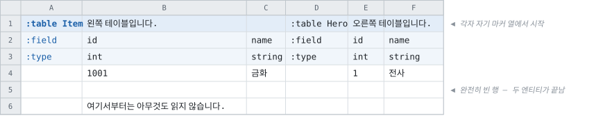
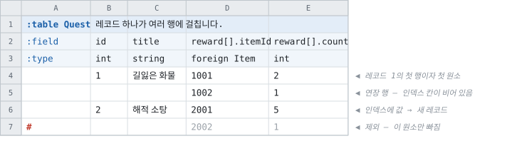
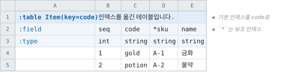
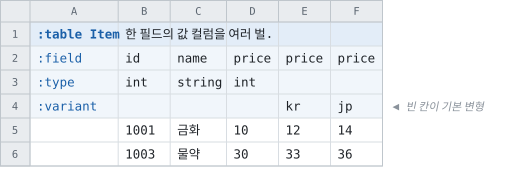

# 시트에 엔티티를 배치하는 방법

> [「시트 작성」으로 돌아가기](../sheets.md)

---

배우는 규칙은 다음 하나로 요약됩니다.

> **`:`가 붙은 것은 데이터가 아니라 레이아웃의 낱말이고, `#`가 붙은 것은 모델에 넣지
> 않습니다.**

새로 배우는 특수문자는 그 둘뿐입니다. `?` · `[]` · `.` · `@N` · `*` · `|` · `-`는 아래에서
설명하는 그대로이고, 셀에 적는 값의 규칙은 표기와 무관합니다.

### 가장 작은 시트


- **A1이 선언 셀**입니다. `:table`로 시작하는 셀이 어디에 있든 그 자리가 테이블의 시작이고,
  **그 셀이 있는 A열이 이 테이블의 마커 열**입니다.
- **선언 셀의 오른쪽 칸이 설명**입니다. 비우면 설명이 없는 것입니다.
- `:field` · `:type` 같은 **헤더 행 키**를 마커 열에 적고, 그 오른쪽이 컬럼입니다.
- 마커 열이 빈 행은 **데이터 행**입니다.
- 첫 필드 컬럼이 **기본 인덱스**입니다.

### 마커 열이 담는 것

마커 열은 테이블의 세로 범위 전체에서 예약됩니다. 담을 수 있는 것은 다음뿐이고, **그 외의
값은 오류**입니다 — 오타가 조용히 지나가지 않게 하기 위해서입니다.

|적는 것|뜻|
|--|--|
|`:table` · `:enum` · `:const`|엔티티 선언. **직전 엔티티의 종료이기도 합니다**|
|`:field` · `:type` · `:desc` · `:target` · `:variant`|헤더 행 키|
|빈 칸|데이터 행|
|`#` 또는 `//`|**그 행을 변환에서 제외.** 데이터 칸을 고치지 않고 빼고 되돌립니다|

### 엔티티의 경계



|축|범위|
|--|--|
|가로|마커 열의 오른쪽부터, **다음 마커 열 직전**까지. 없으면 시트의 마지막 컬럼까지|
|세로|선언 셀의 다음 행부터, **완전히 빈 행** 또는 **다음 선언 셀** 직전까지|

- 「완전히 빈 행」은 **그 엔티티의 컬럼 범위**에서 빈 행이고, 그 범위에는 **마커 열과 메모
  컬럼도 들어갑니다.** 표 아래에 메모를 적으려면 한 줄 띄우십시오.
- 데이터 중간에 여백이 필요하면 마커 열에 **`#`를 적습니다.** 그 행은 빈 행이 아니므로
  엔티티가 계속됩니다.
- 엔티티끼리 옆에 붙여도 됩니다. 옆 엔티티는 자기 마커 열에서 시작하므로 **침범을 걱정할
  필요가 없습니다.**
- **셀 병합은 읽지 않습니다.** 병합 범위의 좌상단만 값을 갖고 나머지는 빈 칸이 되므로,
  헤더를 병합해 두면 그 컬럼이 이름 없는 컬럼으로 읽힙니다.

### 헤더 행 5종

|행 키|적는 것|생략|
|--|--|--|
|`:field`|컬럼의 정체 — 이름 · 경로 · `@N` · `*` · `#`|**불가**|
|`:type`|타입 표현과 괄호 메타|테이블은 불가. enum · 상수셋은 **행 자체가 없습니다**|
|`:desc`|컬럼 설명. 생성 코드의 문서 주석이 됩니다|가능|
|`:target`|대상의 쉼표 목록 — `c` · `s` · `c,s`|가능(생략하면 양쪽)|
|`:variant`|필드 변형의 이름|가능|

**행의 순서는 자유**이고, 데이터 행보다 위에 있어야 합니다. `:field`를 데이터 바로 위에 두는
것을 권합니다 — 엑셀의 정렬·필터 머리글이 데이터와 붙습니다.

> **정렬 사고가 오류로 걸립니다.** 헤더 행까지 선택 범위에 넣고 시트를 정렬하면 헤더가
> 데이터 사이로 흩어지는데, 그때 「데이터 행 아래에 있는 헤더 행」을 그 행과 함께
> 보고합니다.

### `:field` — 컬럼의 이름과 경로

|적는 것|뜻|
|--|--|
|`id`|필드 하나|
|`pos.x`|레코드 `pos`의 멤버 `x`|
|`slot[0].id` · `slot[1].id`|레코드 배열의 원소 — **칸의 수가 정해진 배열**|
|`tag[0]` · `tag[1]`|스칼라 배열을 컬럼으로|
|`grid[0][1]`|**배열의 배열** — 대괄호가 이어지면 안쪽 레벨은 이름이 없습니다|
|`reward[].itemId`|**멀티 로우** — 원소가 컬럼이 아니라 **행**에서 옵니다|
|`cost[]`|스칼라 멀티 로우|
|`price@3`|와이어 태그|
|`*code`|보조 인덱스|
|`#`|**메모 컬럼** — 시트 작성자의 자유 공간|
|`#old@4`|Tombstone — 뺀 필드이고 와이어 태그를 예약합니다|

- **원소 번호는 0부터**이고 빠짐없이 이어져야 합니다. `[1]`부터 시작하거나 건너뛰면 그
  자리를 가리켜 오류입니다.
- **이름이 없는 컬럼에 데이터가 있으면 오류**입니다. 자유 기재 공간이 필요하면 `:field`에
  `#`를 적으십시오 — 그렇게 표시한 컬럼은 아무것도 읽지 않습니다.

### `:type` — 접힌 타입 표현

**타입 하나가 셀 하나에 들어갑니다.** 디테일 행은 없습니다.

|무엇|적는 것|
|--|--|
|기본 타입|`int` · `string` · `bool` · `float` · `vec3f` · …|
|enum|`Grade` — enum 이름을 바로|
|참조|`foreign Item`|
|선언한 struct|`Reward`|
|셀 배열|`int[]` · `string[]`|
|옵셔널|`int?` · `int[]?` · `int?[]`|

#### 괄호 메타 — 첫 `(`부터는 언제나 메타

```
int? (min=0, max=100)
string (text)
string (text=Common, namespace=Shared)
string (asset=icon)
int[] (size=1..4)
string (allowed=weapon;armour)
int (refs=Item;Mount)
```

|키|값|뜻|
|--|--|--|
|`text`|플래그 또는 그룹 이름|번역 수집|
|`namespace`|이름|`text` 그룹의 네임스페이스|
|`asset`|종류 이름|자산 존재 확인|
|`min` · `max`|수|범위|
|`allowed`|`a;b;c`|허용값|
|`refs`|`A;B;C`|**값의 출처** — 이 테이블들 중 하나의 행 id인지 검사합니다|
|`regex` · `size` · `notDefault`|—|컬럼 제약|

- **키의 사전은 [STRUCT DSL](../../notes/struct-dsl-design.md)과 하나**입니다. 같은 키, 같은
  뜻, 같은 검증입니다.
- **모르는 키는 오류**입니다.
- 쉼표가 항목을 가르므로, 쉼표가 든 값은 따옴표로 감쌉니다.

#### 타입 칸을 비우는 자리

|컬럼의 형태|타입 칸|
|--|--|
|스칼라|그 컬럼에 적습니다|
|인라인 레코드 — `pos.x` · `pos.y`|**멤버마다** 적습니다|
|선언한 struct 그룹 — `reward.itemId` · `reward.count`|**첫 멤버 컬럼에 struct 이름 하나.** 나머지는 비웁니다|
|원소 번호 — `slot[0].id` · `slot[1].id`|**원소 0에만.** 이후는 비웁니다|
|멀티 로우 — `reward[].itemId`|**원소의 타입**을 적습니다. 배열임은 이름의 `[]`가 이미 말했습니다|

### 멀티 로우 — 레코드 하나가 여러 행



- **`[]` 컬럼이 하나라도 있으면 그 테이블은 멀티 로우 모드**입니다.
- **새 레코드의 시작은 기본 인덱스 칸에 값이 있는 행**입니다. 그 칸이 빈 행은 직전
  레코드의 **연장 행**입니다.
- **연장 행에서 값을 담는 것은 `[]` 컬럼뿐**입니다. 그 외 컬럼에 값이 있으면 **그 셀을
  가리켜** 「이 값은 레코드의 첫 행에 적습니다」라고 보고합니다.
- 원소는 **그 그룹의 컬럼 범위에 값이 하나라도 있는 행마다** 하나씩 생깁니다. 전부 비어
  있으면 그 행에는 그 그룹의 원소가 없습니다.
- **`[]` 그룹이 여럿이면 각자 쌓입니다.** 같은 행에 있다고 원소끼리 짝이 되는 것이
  아닙니다 — 짝이 필요하면 한 struct의 멤버로 묶으십시오.
- **완전히 빈 행은 엔티티를 끝냅니다.** 레코드 사이에 빈 행을 둘 수 없고, 여백이 필요하면
  마커 열에 `#`입니다.
- 마커 열의 `#`는 **레코드의 첫 행에 있으면 레코드 전체**를, **연장 행에 있으면 그 행의
  원소만** 뺍니다.
- 기본 인덱스 컬럼은 `[]`일 수 없습니다.

**아직 담지 않는 것 셋**입니다 — `[]` 그룹의 멤버가 또 `[]`인 중첩, `[]`와 원소 번호를 한
경로에 함께 적는 것, 그리고 이름의 `[]`와 타입의 `[]`를 함께 적는 것(행마다 셀 배열)입니다.
셋 다 이름을 대고 거절합니다.

### enum과 상수셋 — 컬럼을 이름으로

**헤더 행은 `:field` 하나뿐입니다.** 컬럼의 뜻이 이름으로 정해져 있고 **순서는 자유**이므로,
다른 행 키는 여기서 말할 것이 없습니다 — 설명은 컬럼이 아니라 라벨의 것이고 그것을 담는
것이 `desc` **컬럼**입니다.


|엔티티|필수 컬럼|생략 가능|
|--|--|--|
|`:enum`|`label` · `value`|`alias` · `desc`|
|`:const`|`name` · `type` · `value`|`desc`|

- `alias`는 데이터 셀에 라벨을 적는 **네 번째 표기**입니다 — 선언 표기 · Pascal 표기 ·
  숫자 · 별칭. **별칭을 바꾸면 그 표기로 적은 데이터 셀도 함께 바뀌어야 합니다.**
- 이미 다른 라벨의 이름인 별칭은 거절합니다. 실제 이름이 먼저 답하므로 그 별칭은 아무것도
  가리키지 못합니다.
- 상수셋의 `type` 칸도 **접힌 타입 표현**이므로 enum 이름을 바로 적습니다.

### 선언 셀의 괄호

|키|값|뜻|
|--|--|--|
|`side`|`c` · `s` · `c,s`(기본)|엔티티의 대상|
|`key`|필드 이름|기본 인덱스를 그 컬럼으로. 생략하면 첫 필드 컬럼입니다|

`:table Item(side=s)`처럼 적습니다. 쉼표가 항목을 가르므로 `side="c,s"`는 따옴표가 필요하고,
붙여 쓴 `cs`도 같은 뜻으로 받습니다. **모르는 키는 아는 키의 목록과 함께 오류**입니다.



`key`가 말하는 것은 「어느 컬럼으로 행을 가리키는가」이고, **컬럼은 움직이지 않습니다** —
그래서 파일에 실리는 것도 그대로입니다. 첫 컬럼은 평범한 필드가 되지만 자기 `*`를 갖고 있으면
보조 인덱스로 남고, 멀티 로우의 레코드 경계도 키와 함께 움직입니다.

**키를 여러 개 두려면 세미콜론입니다** — `key="stage,slot; slot,code"`. SQL처럼 첫 키가
PRIMARY KEY이고 나머지가 UNIQUE 키에 대응하며, 어느 것이든 컬럼 하나이거나 여럿입니다.

|표기|뜻|
|--|--|
|(생략)|첫 필드 컬럼이 기본 인덱스|
|`key=code`|그 컬럼이 기본 인덱스. 첫 컬럼은 평범한 필드가 됩니다|
|`key="stage,slot"`|**조합이 키.** 성분은 각자 반복해도 되고, 유일해야 하는 것은 그 조합입니다|
|`key="stage,slot; slot,code"`|**키 여러 개.** 첫 키가 기본 인덱스이고 나머지는 각자 유일합니다|

- 성분은 **실재하는 최상위 스칼라 필드**여야 하고, 성분마다 인덱스의 기존 규칙이 적용됩니다
  — 인덱스가 될 수 있는 타입 · 옵셔널 불가 · 양쪽 대상.
- 한 키에 같은 성분을 두 번 적거나, 성분 구성이 같은 키를 두 번 선언하면 오류입니다.
  **성분 하나가 여러 키에 들어가는 것은 됩니다** — 위의 `slot`이 그 예입니다.
- 컬럼 하나짜리 키는 `*`와 같은 선언이므로, 둘을 함께 적으면 오류입니다.

- **기본 키가 복합인 테이블은 `foreign`의 대상이 될 수 없고**, 멀티 로우도 될 수 없습니다.
  참조는 키 값 하나를 담는 구조이고, 멀티 로우의 레코드는 기본 키 칸에 값이 있는 곳에서
  시작하는데 컬럼 여럿에 흩어진 조합에는 그런 칸이 없기 때문입니다. 보조 키는 둘 다와
  상관이 없습니다.

**조회는 키마다 하나입니다.** 컬럼 하나짜리 키가 지금 내는 것과 같은 자리에, 성분 수만큼
인자를 받는 것이 하나 더 생깁니다 — 이름은 성분을 `And`로 이은 것입니다.

|시트|C#·Go|Java·Kotlin·Swift·Dart·PHP·Lua|Python·Ruby·Rust·C++|C|
|--|--|--|--|--|
|`key=id`|`FindById(key)`|`findById(key)`|`find_by_id(key)`|`FindById(table, key)`|
|`key="stage,slot"`|`FindByStageAndSlot(…)`|`findByStageAndSlot(…)`|`find_by_stage_and_slot(…)`|`FindByStageAndSlot(table, …)`|

`GetBy…OrThrow`와 `Contains…`도 같은 자리에 같은 인자로 생깁니다. 파라미터 이름은
컬럼 이름에 `Key`를 붙인 것이고 — `stageKey`, `slotKey` — 컬럼 하나짜리 조회가 예전부터
`key`를 받아 온 것과 같은 말을 성분마다 하는 것입니다.

> **맵이 무엇으로 키가 되는지는 생성 코드의 사정입니다.** 지금은 성분마다 길이를 앞에 붙여
> 이은 문자열입니다 — 구분자만 쓰면 `("a b", "c")`와 `("a", "b c")`가 같은 키가 되어 두 행
> 중 하나가 사라지기 때문입니다. 맵 자체는 공개되지 않으므로, 튜플 키가 자연스러운 언어가
> 나중에 그쪽으로 옮겨도 **조회의 모습은 그대로**입니다.

### 필드 변형 — `:variant`

한 필드의 값 컬럼을 여러 벌 적고 빌드가 하나를 고릅니다. 지역별 가격처럼 **컬럼 하나만
갈리고 나머지가 공유되는** 데이터가 대상입니다.



- 같은 필드 이름을 컬럼 여러 개에 적고, `:variant` 행이 구분합니다. **빈 칸이 기본
  변형**입니다.
- 고르는 것은 recipe의 `"Variants": { "Item.Price": "kr" }` 또는 CLI의
  `--variant Item.Price=kr`이고, **명령줄이 recipe를 덮습니다.**
- **산출물은 변형을 모릅니다.** 고른 컬럼 하나가 그 필드가 되고 나머지는 그 빌드에
  없습니다 — 모델·와이어·생성 코드 전부 필드 하나입니다.
- **헤더는 기본 변형 컬럼에 한 번** 적습니다. 다른 변형 컬럼은 비우고, 다르게 적으면
  거절합니다.
- 기본 변형이 없는 필드는 **지정이 필수**이고, 없는 변형을 지정하면 있는 목록과 함께
  오류입니다.
- **키 컬럼과 그룹 컬럼에는 변형을 둘 수 없습니다.**

### `#`의 세 자리

뜻은 「모델에 넣지 않음」 하나이고, **위치가 대상을 정합니다.**


|자리|대상|
|--|--|
|마커 열|그 **행**|
|`:field`에 `#` 하나만|그 **컬럼**(메모 컬럼)|
|`:field`의 이름 앞|그 **필드**(Tombstone — 와이어 태그를 예약합니다)|

## Trimming

데이터를 읽을 때 모든 셀의 값을 트리밍합니다. 앞뒤에 공백을 넣어도 제거되므로 주의가 필요합니다.

UI 텍스트를 출력할 때 앞뒤 공백으로 레이아웃을 맞추는 방식은 동작하지 않습니다.

필요하다면 공백 대신 다른 문자를 적고, 그 문자를 공백으로 치환해 처리하세요.


## Supported Entities

지원하는 엔티티는 다음 셋입니다.

|종류|선언 셀|설명|
|--|--|--|
|Enum|`:enum 이름`|열거형 정의|
|ConstantSet|`:const 이름`|상수 정의 묶음|
|Table|`:table 이름`|데이터 테이블 정의 및 데이터|

> **상수 세트를 고르기 전에.** 상수는 **데이터 파일이 아니라 코드로 나갑니다** — 생성된 소스의
> 선언 한 줄이 전부이고 `.tcb`에는 아무것도 실리지 않습니다. 그래서 값 하나만 고치면 변환은
> 성공하는데 **데이터 파일은 한 개도 바뀌지 않고**, 코드를 다시 생성해 배포하기 전까지 라이브는
> 그대로입니다. 라이브 중에 조정할 가능성이 있는 수치라면 상수 세트가 아니라 **테이블 한
> 행**으로 두세요.
> [무엇이 코드로 나가고 무엇이 데이터로 나가는가](../languages/readme.md#데이터만-나가도-되는-변경과-코드가-함께-나가야-하는-변경)

> **0번 라벨이 없는 enum에는 `None = 0`이 자동으로 들어갑니다.** enum 타입의 필드는 값이
> 대입되기 전에도 뭔가를 들고 있어야 하는데, 그게 이름 없는 0이면 디버거에서도 로그에서도 읽을
> 수가 없기 때문입니다. 시트가 0에 이미 뭔가를 두었다면 손대지 않습니다. 시트에 적은 것만
> 정확히 나오길 원한다면 recipe의 `"AutoInsertEnumNoneLabel": false`로 끄세요.


## Parsing Rules

기본적으로 .NET의 파싱 규칙을 따르지만, 일부 타입은 자체적으로 파싱합니다.

**모든 파싱은 `InvariantCulture`로 수행됩니다.** 변환 결과가 빌드를 돌리는 PC의 지역 설정에
따라 달라지면 안 되기 때문입니다. 소수점은 항상 `.`이고 쉼표는 항상 천단위 구분자입니다.

|타입|파싱|비고|
|---|---|--|
|string|그대로|앞뒤 공백을 제거한 후 읽어옵니다.|
|int|`int.Parse`|천단위 구분자 허용. `1,000,000` 가능. `0x`·`0b` 허용|
|bigint|`long.Parse`|천단위 구분자 허용. `0x`·`0b` 허용|
|bitset|자체 파싱|플래그 묶음. **더 엄격합니다** — 부호·천단위·소수점·지수를 거절합니다. [아래](types.md#bitset--플래그-묶음)|
|float|`float.Parse`|천단위 구분자 허용. `0x`·`0b`는 정확히 표현되는 값만|
|double|`double.Parse`|천단위 구분자 허용. `0x`·`0b`는 정확히 표현되는 값만|
|bool|자체 파싱|아래 참고|
|datetime|`DateTime.Parse`|엑셀의 날짜 셀은 자동으로 인식됩니다. 텍스트로 적을 경우 `2022-01-24 10:30:00` 형식을 권합니다. **어느 시간대의 시각인지는 recipe의 [`TimeZone`](../recipe/settings.md#timezone--시트의-날짜를-어느-시간대로-읽을지)이 정하고, 저장되는 값은 UTC입니다** — 셀에 `Z`나 `+09:00`을 직접 적으면 그것이 우선합니다|
|timespan|`TimeSpan.Parse`|`1.02:03:04` (일.시:분:초) 형식. [MSDN 참고](https://learn.microsoft.com/dotnet/api/system.timespan.parse)|
|uuid|`Guid.Parse`|[MSDN 참고](https://learn.microsoft.com/dotnet/api/system.guid.parse)|
|enum|라벨 이름 또는 값|선언된 표기(`fire_ball`), Pascal 표기(`FireBall`), 숫자(`1`) 모두 허용|
|`T[]`|구분자로 분리 후 각 요소 파싱|빈 셀은 빈 배열|

### bool 파싱

|값|결과|
|--|--|
|`Y` `YES` `TRUE` `1`|참|
|`N` `NO` `FALSE` `0`|거짓|
|빈 셀|거짓|
|`-`|값 없음. 컬럼이 `bool?`일 때만 — [빈 칸과 없음](types.md#빈-칸과-없음)|
|그 외 숫자|0이 아니면 참|
|그 외 텍스트|**오류**|

대소문자는 구분하지 않습니다. 빈 셀이 거짓인 것은 의도된 것이지만, 알 수 없는 텍스트는
오류입니다 — `Ture` 같은 오타가 말없이 거짓이 되면 이 도구가 검출해야 할 휴먼 오류가 그대로
데이터에 들어갑니다.

### 엑셀 수식 오류

수식이 `#DIV/0!`, `#REF!` 등으로 평가된 셀은 오류로 보고됩니다. Tabbit은 수식을 직접 평가하지
않고 파일에 캐시된 결과를 읽으므로, 엑셀에서 오류가 보이는 상태로 저장된 셀이 그대로 걸립니다.


## 변환 대상에서 빼기

작성 중이라 아직 완성되지 않은 워크북이나 시트가 있을 수 있습니다. 다른 폴더로 옮기지 않고
이름 앞에 `#` 또는 `//`를 붙이면 대상에서 빠집니다 — 엑셀은 시트 이름에 `//`를 넣을 수
없으므로 거기서는 `#`만 씁니다.

|대상|하는 법|
|--|--|
|워크북|파일 이름(엑셀은 폴더 이름도)에 `#`. 구글 스프레드시트는 ID로 지정하므로 recipe의 그 줄을 주석 처리합니다|
|시트|시트 이름에 `#`|
|엔티티|선언 셀에 `#` — `#:table Item`|
|필드|`:field`의 이름 앞에 `#`. **기본 인덱스는 뺄 수 없습니다**|
|행|**마커 열**에 `#`. 데이터 칸을 고치지 않고 빼고 되돌립니다|

행과 컬럼과 필드의 구분은 [`#`의 세 자리](#의-세-자리)에 그림으로 있습니다.
