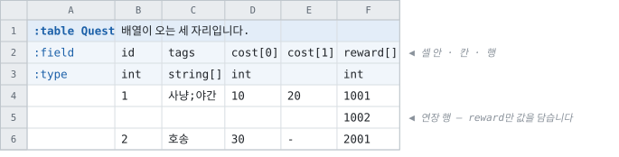
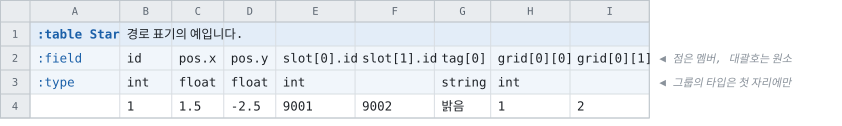

# 값이 여러 개일 때 — 배열과 레코드

> [「시트 작성」으로 돌아가기](../sheets.md)

---

## 배열이 오는 세 자리 — 셀 · 칸 · 행

**`[]`가 이름에 있으면 행이 원소이고, 타입에 있으면 셀 안이 원소입니다.**



|기재|원소가 오는 곳|길이|
|--|--|--|
|`:field` `tags` + `:type` `string[]`|**셀 안** — `사냥;야간`|셀마다 다름|
|`:field` `cost[0]` `cost[1]` + `:type` `int`|**칸** — 컬럼의 수가 정함|컬럼 수|
|`:field` `reward[]` + `:type` `int`|**행** — 연장 행마다 하나|행 수가 정함|

**셋 다 와이어가 같고 생성 코드도 같습니다.** 다른 것은 시트에서 읽는 방법뿐이므로, 고르는
기준은 데이터의 성격입니다.

|성격|고르는 것|
|--|--|
|짧은 목록, 한눈에 보고 싶다|셀 — `string[]`|
|칸의 수가 정해져 있고 셀 단위로 편집하고 싶다|칸 — `cost[0]` · `cost[1]`|
|길이가 로우마다 크게 다르다|행 — `reward[]`|

> **이름의 숫자는 배열이 아닙니다.** `Text1` · `Text2`는 그냥 필드 2개입니다. 배열은 언제나
> 대괄호로 선언되므로, 「이 이름의 숫자가 배열인가」라는 질문 자체가 없습니다.
>
> 예전에는 그것을 recipe의 설정 하나가 정했습니다(`FoldSerialFields`). 대괄호가 정하게
> 되면서 그 설정은 없어졌고, 접힌 배열에 붙던 `_array` 접미도 함께 없어졌습니다 — 대괄호가
> 이미 말한 것을 이름이 다시 말할 필요가 없기 때문입니다.


두 방식은 와이어 포맷이 같습니다.

배열의 길이는 어느 쪽이든 행마다 기록됩니다. 칸으로 적은 배열의 길이가 모든 행에서
같더라도 그렇고, 그런 컬럼의 길이 스트림은 런 하나로
접힙니다([TCB v107](../../spec/wire/tcb-v107-dynamic-arrays.md)).

> **생성 코드에는 길이가 없습니다.** 컬럼 하나가 배열 하나를 갖는 형태이므로, 한 로우가 원소를
> 몇 개 갖는지는 **파일이 적은 것**이고 읽기가 그것을 따릅니다 — 길이 상수를 공개하면 소비하는
> 쪽이 이 코드를 생성한 시점의 컬럼 수를 붙들게 되고, 시트에 `Text3`이 하나 늘면 그 수는 데이터가
> 더 이상 동의하지 않는 수가 됩니다. 배열의 길이가 답입니다.
>
> 컬럼 **여럿**이 배열 하나를 채우는 형태 — 레코드 그룹, 배열의 배열 — 은 다릅니다. 어느 컬럼도
> 그 배열을 혼자 갖지 않으므로 길이는 컬럼들이 합의한 수이고, 생성 코드가 그것을 알고 있어야
> 합니다. 거기서는 공개하지 않는 상수로 남습니다
> ([설계](../../spec/types/nullable-array-elements.md)).

> **다른 규칙으로 쓰인 시트에는 이 개념이 적용되지 않습니다.** `tabbit` 레이아웃의 관례이므로,
> 다른 레이아웃은 이 표기를 읽지 않습니다 — 거기서는 숫자가 그저 이름의 일부이고, 규칙이 맞을
> 대상 자체가 없습니다.


## 중첩 필드 — 컬럼 여러 개를 레코드 하나로

컬럼 하나에 값 하나가 아니라 **여러 값을 묶은 것**이 원소일 때는 멤버 이름을 `.`으로
붙입니다.



|시트의 컬럼 이름|나오는 것|
|--|--|
|`pos.x` `pos.y`|`Pos` — 레코드 하나. `record.Pos.X`|
|`slot[0].id` `slot[0].count` `slot[1].id` `slot[1].count`|`Slot` — 레코드의 **배열**, 길이 2. `record.Slot[0].Id`|
|`pos.x[0]` `pos.x[1]` `pos.y[0]` `pos.y[1]`|`Pos` — 레코드 하나인데 **멤버가 배열**, 길이 2. `record.Pos.X[0]`|
|`grid[0][0]` `grid[0][1]` `grid[1][0]` `grid[1][1]`|`Grid` — **배열의 배열**, 2×2. `record.Grid[0][1]`|
|`tag[0]` `tag[1]`|스칼라 배열|

**대괄호를 어디에 두느냐가 형태를 정합니다.**

|번호가|멤버 이름이|나오는 것|
|--|--|--|
|그룹 쪽|있음|레코드의 배열|
|멤버 쪽|있음|레코드 하나, 멤버가 배열|
|**양쪽**|**없음**|배열의 배열|
|어느 쪽에도 없음|있음|레코드 하나|

> **대괄호가 이어지면 레벨이 하나 더 생기고, 안쪽 레벨은 이름이 없습니다** — `grid[0][1]`이
> 배열의 배열입니다. 소비자가 적을 낱말이 없으므로 번호로 가리킵니다.

**세 형태가 컬럼도 파일도 같습니다.** 와이어는 레코드를 원래 멤버마다 한 컬럼으로 싣기
때문입니다 — 달라지는 것은 그 컬럼들을 무엇으로 조립하느냐뿐입니다
([설계](../../spec/types/nested-multi-level.md)).

**타입·주석·target-side는 멤버 컬럼마다 따로 적습니다.** 멤버가 서로 다른 타입일 수 있고,
그것이 배열 대신 레코드를 쓰는 이유입니다.

```
pos.x    pos.y    slot[0].id   slot[0].label   slot[1].id   slot[1].label
float    float    int          string
```

원소 0에만 타입을 적고 그 뒤는 비웁니다 — 그룹의 타입은 그룹의 것이므로 원소마다 다시 적을
것이 없습니다.

```csharp
var r = GameData.Loadout.FindByIndex(1);
r.Pos.X;               // 1.5
r.Slot[0].Label;       // "sword"
r.Slot.Length;         // 2 — 길이 상수는 공개하지 않습니다
```

### 규칙

|규칙|내용|
|--|--|
|중첩은 깊이를 세지 않음|`star[0].pos.x`는 `slot[0].id`와 같은 규칙 한 단계 더입니다|
|이름 없는 레벨은 대괄호로만|`grid[0][1]`이 배열의 배열이고, `grid.[1]`은 오류입니다 — 한 형태를 적는 방법이 둘이 되지 않게|
|모든 원소가 모든 멤버를|`slot[1].label`을 빼먹으면 오류입니다. 아무도 쓰지 않는 값이 기본값처럼 읽히기 때문입니다|
|원소 번호는 0부터 빠짐없이|`[1]`부터 시작하거나 건너뛰면 그 자리를 가리켜 오류입니다|
|target-side는 레코드 단위|멤버끼리 다르면 오류입니다. 반쪽만 든 레코드는 만들 수 없습니다|
|기본 인덱스는 안 됨|`*` 보조 인덱스도 안 됩니다. 인덱스는 값 하나여야 합니다|
|참조는 아직 안 됨|멤버에 `foreign`은 오류입니다. 키를 `int`로 들고 있는 것은 됩니다|

### 지원 타깃

> **모든 언어와 `json` · `binary`가 지원합니다.** 남은 것은 `html` · 데이터베이스 ·
> `summary` · `history`이고, 이들은 레코드를 만나면 **그 이름과 함께 거부**합니다. 조용히 다른
> 형태로 내보내는 것보다 낫기 때문입니다.
>
> ```
> Target `html` does not support nested fields yet.
>   Table `Item` field `Slot` is a record group of 2 member(s).
> ```

**파일 형식은 바뀌지 않았습니다.** 레코드의 배열은 **멤버마다 배열 컬럼 하나**로 저장되므로
(API는 구조체의 배열, 파일은 배열의 구조체), 형식 버전도 그대로이고 멤버마다 컬럼 인코딩이
따로 걸립니다. 멤버를 추가하는 것은 컬럼 태그가 하나 늘는 **가산적 변경**입니다.

> **원소를 추가하는 것도 그렇습니다.** `slot[2].*`을 시트에 더하면 그 로우들이 원소 셋을 싣고,
> **이미 배포된 리더가 그것을 그대로 읽습니다** — 길이는 코드가 아니라 파일이 정합니다. 데이터만
> 배포하는 흐름에서 그룹을 넓힐 수 있다는 뜻이고, 그 설계가
> [TCB v107](../../spec/wire/tcb-v107-dynamic-arrays.md)입니다.

> 그래서 **멤버가 배열인 레코드도, 배열의 배열도 형식을 건드리지 않습니다.** 파일이 이미 그
> 형태로 담고 있던 것이고, 세 표기가 같은 컬럼을 다르게 조립할 뿐입니다.

### 로우마다 길이가 다른 레코드 배열 — 옵트인

기본적으로 레코드 배열의 길이는 컬럼 수이고 모든 행이 같습니다.

세 슬롯 중 둘만 적은 행도 세 번째 원소를 갖고, 그 원소는 빈 값으로 찹니다.

읽는 쪽은 적은 것인지 안 적은 것인지 구별할 수 없습니다.
`{Id:0, Count:0}`이 「0개를 주는 슬롯」인지 「슬롯이 없음」인지 알 수 없습니다.

소스 항목에 `"TrimTrailingArrayElements": true`를 적으면 **값이 없는 뒤쪽 원소를 버립니다.**
**레코드 배열과 스칼라 배열 둘 다입니다** — `tag[0]`·`tag[1]`·`tag[2]`도 같은 규칙으로 잘립니다.

|`slot[0].*`|`slot[1].*`|`slot[2].*`|나오는 길이|
|--|--|--|--|
|값|값|값|3|
|값|값|`-`|**2**|
|값|`-`|값|**3** — 가운데는 그대로|
|`-`|`-`|`-`|**0**|

- **가운데는 지우지 않습니다.** 지우면 `slot[2]`에 적은 것이 어떤 로우에서는 `[1]`, 어떤
  로우에서는 `[2]`가 됩니다. 뒤에서만 자르면 **인덱스 `k`는 언제나 `Slot{k+1}`입니다**.
- 「값이 없다」는 **타입에 `?`가 붙은 컬럼에 `-`를 적은 셀**입니다 ([옵셔널](types.md#옵셔널--타입-끝의-)).
  멤버가 required면 `-`는 그 전에 오류가 되므로, 자를 수 있는 레코드의 멤버는 옵셔널입니다.
- **`0`을 적은 셀도 빈 칸도 값입니다.** `-`만 없는 것으로 셉니다 — 값으로 판정하면 작성자가
  적은 `0`을 지우게 되고, 빈 칸으로 판정하면 빈 이름을 적은 원소를 지우게 됩니다.
- **원소는 멤버 전부가 비어야** 비어 있습니다. 하나라도 있으면 그 원소는 남습니다.
- 레코드 **하나**(`Pos.X`/`Pos.Y`)는 자를 것이 없으므로 영향이 없습니다.
- 로우마다 길이가 다르므로 하나의 수로 나타낼 수 없습니다 — 배열의 길이를 봅니다. 켜지 않은
  경우에도 마찬가지입니다: **생성 코드는 길이를 공개하지 않습니다** (아래 참조).

기본이 꺼져 있는 이유는 배열이 짧아지는 것이 조용하기 때문입니다.

배열이 짧아지는 것은 조용하고, 소비하는 쪽에서 `Slot[2]`가 어떤 행에는 있고 어떤 행에는 없게
됩니다.

설계는 [가변 길이 레코드 배열](../../spec/types/variable-length-record-arrays.md)에 있습니다.

> **여기서도 파일 형식은 그대로입니다.** 멤버 컬럼이 고정 배열에서 **가변 배열**로 바뀔
> 뿐이고, 가변 배열은 `int[]` 셀이 v100부터 쓰던 것입니다. 버전도, 리더들도 그대로입니다.
> 대신 길이가 멤버마다 한 번씩 반복됩니다 — 그래야 **컬럼 하나를 혼자 읽을 수 있고**, 그것이
> 모르는 컬럼을 건너뛸 수 있는 근거입니다.


## 참조 컬럼의 빈 칸

**참조 컬럼을 비워 두는 것은 「없음」이 아닙니다 — 아무도 채우지 않은 셀입니다.** 필수든
옵셔널이든 거부됩니다.

없음을 뜻하려면 **`-`를 적습니다.** 그 컬럼이 옵셔널일 때만 통과합니다.

|시트에 적힌 것|필수 컬럼|옵셔널 컬럼|
|--|--|--|
|실재하는 id|통과|통과|
|없는 id|거부|거부|
|**`-`**|**거부**|통과 — 없음|
|**빈 칸**|**거부**|**거부**|
|`0`|통과|통과|

`0`이 통과하는 것은 관례로 「아무것도 가리키지 않음」이기 때문입니다. 인덱스는 1부터
시작하므로 실재하는 행과 부딪히지 않습니다.

판정은 값이 아니라 **셀이 채워졌는지**로 합니다. 빈 칸은 파싱하면 `0`이 되어서, 값만 보면
「비워 둔 것」과 「0을 적은 것」이 같아지기 때문입니다.

설계와 그 근거는 [참조의 「없음」](../../spec/references/reference-optionality.md)에,
빈 칸이 자리마다 뜻하는 것은 [빈 칸의 뜻](rules-and-pitfalls.md#빈-칸의-뜻--자리별-총정리)에
있습니다.
