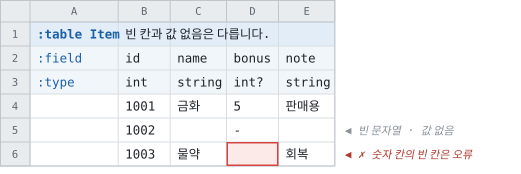

# 컬럼에 적을 수 있는 타입

> [「시트 작성」으로 돌아가기](../sheets.md)

---

## 적을 수 있는 타입

`Tabbit`에서 지원하는 데이터 타입은 아래와 같습니다.

|Type|Description|Range|
|--|--|--|
|string|A sequence of UTF8 characters| |
|text|`string`이면서, 번역을 위해 수집되는 값. [아래](#text--번역을-위해-수집되는-문자열)| |
|asset|`string`이면서, 그 이름의 파일이 있는지 확인되는 값. [아래](#asset--파일이-있어야-하는-문자열)| |
|int|32-bit signed integer|-2,147,483,648 ~ 2,147,483,647|
|bigint|64-bit signed integer|-9,223,372,036,854,775,808 ~ 9,223,372,036,854,775,807|
|bitset|최대 64개의 플래그. 값이 아니라 비트 패턴|64비트 전부. [아래](#bitset--플래그-묶음)|
|float|32-bit single-precision floating point type|-3.402823e38 ~ 3.402823e38|
|double|64-bit double-precision floating point type|-1.79769313486232e308 ~ 1.79769313486232e308|
|bool|8-bit logical true/false value|true or false|
|datetime|Represents date and time|0:00:00am 1/1/01 ~ 11:59:59pm 12/31/9999|
|timespan|Represents a time interval.|[MSDN 참고](https://docs.microsoft.com/en-us/dotnet/api/system.timespan.parse?view=net-6.0#system-timespan-parse(system-string))|
|uuid|Represents a globally unique identifier (GUID).|[MSDN 참고](https://docs.microsoft.com/en-us/dotnet/api/system.guid?view=net-6.0)|
|enum|자체적으로 선언된 엔티티 enum| |
|foreign|외부 테이블 참조| |
|`vec2i`·`vec3i`·`vec4i`|정수 성분 2~4개. `(111, 222)`|성분마다 `int`. [아래](#합성-값-타입--벡터--회전--색)|
|`vec2f`·`vec3f`·`vec4f`|실수 성분 2~4개|성분마다 `float`|
|`euler`|축마다 각도 하나씩 3개(도)|성분마다 `float`|
|`quat`|회전. `(x, y, z, w)` 또는 `identity`|성분마다 `float`|
|`axisangle`|축과 각도(도). `(0, 1, 0, 90)`|성분마다 `float`|
|`color`|실수 RGBA. HDR 값도 담습니다|성분마다 `float`, 범위 제한 없음|
|`color32`|8비트 RGBA. `#3366CC`·`red`|성분마다 0~255|
|`T[]`|구분자로 구분된 배열. 예: `int[]`, `string[]`, `enum[]`|로우마다 길이가 다를 수 있음|

### 배열 타입

타입 칸에 `int[]`, `string[]`, `enum[]` 처럼 적으면 셀 하나에 여러 값을 넣을 수 있습니다.

|index|Tags|Costs|
|--|--|--|
|`int`|`string[]`|`int[]`|
|1|`red;green;blue`|`10;20;30`|
|2|`solo`|`5`|
|3| | |

- 구분자는 기본 `;`이며 recipe의 `ArrayDelimiter`로 바꿀 수 있습니다. 쉼표가 기본이 아닌 이유는
  일반 문장과 숫자 표기에 너무 흔하기 때문입니다.
- 각 요소의 앞뒤 공백은 제거됩니다. `1; 2 ;3`은 `1;2;3`과 같습니다.
- 빈 셀은 오류가 아니라 **빈 배열**입니다. 해당 컬럼에 값이 없는 행은 흔한 경우이기 때문입니다.
- **`foreign Item[]`도 됩니다.** 한 셀에 키를 구분자로 이어 적으면 원소마다 키 하나와 해석 결과
  하나를 갖고, 길이는 행마다 다릅니다. 대상이 로우 전체(`Piece`)든 그 로우의 값
  하나(`Piece.Tier`)든 같습니다. 원소를 컬럼으로 적어도(`slot[0]`·`slot[1]`을 `foreign`으로)
  같은 것이 됩니다 — 셋 다 **참조의 배열**입니다.
- **`foreign`의 대상은 테이블 하나입니다.** 여러 테이블 중 하나여도 되는 값은 참조가 아니라
  검사이고, 아래의 `refs=`가 그것을 적습니다.

### 참조가 내는 이름 — 키와 행

`foreign`을 적은 컬럼은 **둘을 냅니다.**

|무엇|이름|
|--|--|
|셀에 적힌 키|**컬럼 이름 그대로**|
|그 키가 가리키는 행|**`<대상>By<컬럼>`**|

```csharp
itemRow.CategoryId                    // int — 셀에 적힌 값
itemRow.ItemCategoryByCategoryId      // ItemCategoryTable.Record
```

- **컬럼 이름이 키의 것입니다.** 셀에 있는 것이 키이고, 행은 이 도구가 로드 시점에 이어 준
  것입니다.
- **같은 테이블을 가리키는 컬럼이 여럿이어도 갈립니다** — `senderId`·`receiverId`가
  `CharacterBySenderId`·`CharacterByReceiverId`입니다.
- **점 표기는 예외입니다.** `foreign Item.Name`은 행이 아니라 값을 돌려주므로 컬럼 이름이
  그 값의 것이고, 두 번째 이름이 없습니다.
- 생성될 이름을 컬럼이 이미 쓰고 있으면 그 셀을 가리켜 **거부**합니다.

> 설계와 근거는 [참조가 내는 이름](../../spec/references/reference-surface-naming.md)에 있습니다.

### 여러 테이블 중 하나여도 되는 값 — `refs=`

한 컬럼의 값이 **어느 한 테이블의 행이면 되는** 경우가 있습니다. 보상 id 하나가 아이템일 수도
있고 선박일 수도 있는 식입니다. **그것은 참조가 아니라 검사입니다** — 참조는 테이블 하나를
지목해 해석하는 것이고, 여러 테이블 중 하나의 id일 수 있는 값에는 해석할 타입이 하나가
없습니다.

```
int (refs=Item;Mount)     값이 Item이나 Mount의 행 id인지 검사합니다
```

|  |`foreign Item`|`(refs=Item;Mount)`|
|--|--|--|
|타입|**대상의 키 타입으로 좁혀집니다**|**그대로** — `int`면 `int`|
|생성 코드|키와 행|**없습니다**|
|와이어|대상 키 타입|**그대로**|
|대상 개수|**하나**|하나 이상|

- **`;`가 목록을 가릅니다.** `allowed=a;b;c`와 같은 구분자입니다.
- **대상끼리 id가 겹쳐도 됩니다.** 「어느 쪽의 것인가」를 묻지 않고 「목록 어딘가에
  있는가」만 보기 때문입니다. 고를 일이 없으므로 겹침이 애매해지지 않습니다.
- **빈 칸은 검사하지 않습니다.** 적히지 않은 값은 찾을 것이 없기 때문입니다 —
  값이 있어야 하는지는 `?`가 붙었는지가 답하는 다른 질문입니다.
- **적힌 테이블이 하나라도 이 빌드에 없으면 그 컬럼을 판정하지 않고 경고합니다.** 넓은 빌드를
  겨냥한 선언 하나가 좁은 빌드를 멈추게 하지 않기 위해서입니다. 더 엄격하게 읽고 싶으면
  `TreatWarningsAsErrors`가 있습니다.
- **이미 참조인 컬럼에는 적을 수 없습니다.** `foreign`이 더 많은 것을 말합니다.

**행에 닿아야 한다면 컬럼을 나눕니다.** `itemId foreign Item`과 `mountId foreign Mount` 두
컬럼이면 각각이 자기 행 접근자를 얻고, 어느 쪽인지는 값이 있는 쪽이 답합니다.

> 설계와 근거는 [참조가 내는 이름](../../spec/references/reference-surface-naming.md)에 있습니다.

### `bitset` — 플래그 묶음

최대 64개의 플래그를 담습니다. 파일에는 64비트 정수로 실리고, 생성되는 코드에서도 `bigint`와
같은 타입입니다 — 이 타입이 `bigint`와 다른 것은 **담는 값이 아니라 받아들이는 표기**입니다.

|index|Perm|
|--|--|
|`int`|`bitset`|
|1|`0b1011`|
|2|`0x1f`|
|3|`123`|
|4|`0xFFFFFFFFFFFFFFFF`|

- **10진수·`0x`·`0b`** 를 받습니다. 대소문자는 가리지 않습니다.
- **`0x`와 `0b`는 64비트 전부에 닿습니다.** 모든 플래그를 켜려면 `0xFFFFFFFFFFFFFFFF`이고,
  이것은 부호 있는 64비트의 `-1`과 같은 비트 패턴입니다.
- **10진수는 2^53까지입니다.** 엑셀의 숫자 셀은 double이라 그보다 큰 값은 셀에 적히는 순간 이미
  반올림되어 있습니다. 그 위의 값은 `0x`나 `0b`로 적어야 하고, 그렇게 하라는 메시지에 셀 위치가
  함께 나옵니다.
- **거부하는 것** — 부호(`-1`), 천단위 구분자(`1,000`), 소수점(`1.5`와 **`1.0` 둘 다**),
  지수(`1e3`), 밑줄(`0b1010_1010`). 비트 패턴에 뜻이 없는 표기이고, 애매하게 받아들이는 것보다
  오류가 낫기 때문입니다.
- `bitset[]`과 `bitset?`을 쓸 수 있습니다. **빈 칸은 오류입니다** — 비트 패턴에 빈 칸이 뜻할
  것이 없기 때문입니다. 플래그가 하나도 없는 것은 `0`이라고 적고, 값이 없는 행은 `bitset?`
  컬럼에 `-`라고 적습니다.

> 설계와 근거는 [비트셋](../../spec/types/bitset.md)에 있습니다.

### 합성 값 타입 — 벡터 · 회전 · 색

성분이 여러 개인 값을 **셀 하나**에 적습니다. 컬럼 3개로 적던 좌표가 컬럼 하나가 되고, 타입 행에
그것이 좌표라고 적힙니다.

|index|Pos|Cell|Rot|Tint|Glow|
|--|--|--|--|--|--|
|`int`|`vec3f`|`vec2i`|`quat`|`color32`|`color`|
|1|`(1.5, -2.5, 0)`|`(3, 4)`|`identity`|`#3399CC`|`#33CCFF`|
|2|`one`|`zero`|`(0, 1, 0, 0)`|`cornflowerblue`|`transparent`|
|3|`0,0,0`|`Vector2i.one`|`(1,0,0,0)`|`(255, 0, 0, 128)`|`#FF00FF`|

**생성되는 코드에서는 레코드입니다.** 위의 `Pos`는 `Pos.X`·`Pos.Y`·`Pos.Z`라고 적은 컬럼 3개와
**완전히 같은 것**이 됩니다 — 같은 JSON, 같은 바이트, 같은 구조체.

- **튜플** — 구분자는 쉼표이고 괄호는 생략할 수 있습니다. 성분 개수는 정확히 맞아야 합니다.
- **기호** — `zero`·`one`(벡터), `identity`(`quat`·`axisangle`). `vec2i.one`이나 `Vector2i.one`처럼
  타입 이름을 앞에 붙여도 됩니다. 다른 타입 이름을 붙이면 오류입니다.
- **색** — `#RGB`·`#RRGGBB`·`#RRGGBBAA`·`0xRRGGBB`, CSS 색 이름 148개, `transparent`. 알파를
  생략하면 불투명입니다.
- **팔레트** — recipe의 `Palettes`에 파일을 등록하면 `material.blue.500`처럼 씁니다. 접두 없는
  이름은 언제나 내장 `css`이므로 팔레트를 추가해도 기존 시트의 색이 달라지지 않습니다.
- **`color`와 `color32`** — 표기는 같고 성분이 다릅니다. `color32`는 정수 0~255이고 소수점을
  거부합니다(`(1.0, 1.0, 1.0)`이 흰색인지 3/255인지 갈리기 때문입니다). `color`는 실수이고 1을
  넘는 HDR 값을 받습니다.
- **`?`를 쓸 수 있습니다.** 빈 칸은 성분이 전부 0이고, `quat`은 `(0,0,0,1)`, `axisangle`은
  `(0,0,1,0)`입니다.
- **`up`·`forward`는 없습니다.** 위쪽과 앞쪽이 엔진마다 다르므로(Unity는 `+Y`·`+Z`, Unreal은
  `+Z`·`+X`) 이 도구가 고르지 않습니다. 튜플로 적습니다.
- **쓸 수 없는 자리 셋** — 인덱스(`*`), `@N` 태그, 컬럼 제약. 셋 다 타입 이름과 함께 거부됩니다.
- **엑셀 서식 주의.** 일반 서식 셀에 `(1,234)`를 입력하면 엑셀이 -1234로 바꿉니다. 그런 셀은
  성분이 하나가 되어 오류로 걸리고, 메시지가 서식을 지목합니다. 컬럼 서식을 텍스트로 두세요.

> 설계와 근거는 [합성 값 타입](../../spec/types/composite-value-types.md)에 있습니다.

### 진법 리터럴 — `0x`와 `0b`

`0x`와 `0b`는 `bitset` 전용이 아닙니다. **`int`·`bigint`·`float`·`double`도 받습니다.**
색상값을 `0x5f0300`으로 적는 것이 흔하기 때문입니다.

- **진법은 표기일 뿐 타입의 범위를 넓히지 않습니다.** `0xFFFFFFFF`는 `int` 컬럼에서 오류입니다
  — 32비트 마스크를 적으려는 것이라면 그 컬럼은 `bitset`입니다.
- 부호를 붙일 수 있습니다. `-0x10`은 `-16`입니다.
- `float`·`double`은 **정확히 표현되는 값만** 받습니다(각각 2^24·2^53). 그 위는 다시 읽을 때
  다른 값이 되므로 거부합니다.

### `text` — 번역을 위해 수집되는 문자열

**`text`는 `string`입니다.** 와이어에서도, 생성된 코드에서도, 내보낸 파일에서도 같은
문자열입니다. 다른 것은 하나뿐입니다 — **그 값들의 목록이 따로 나갑니다.** 번역할 것을
넘기거나, 폰트가 글자를 덮는지 보거나, 문자열 테이블을 만드는 데 쓰는 목록입니다.

|index|Title|ScriptId|
|--|--|--|
|`int`|`text`|`string`|
|1|잃어버린 화물|`quest_lost_cargo`|

`ScriptId`도 사람이 읽을 수 있는 문자열이지만 번역 대상이 아닙니다. **그 구별이 이 타입이
있는 이유입니다** — 타입이 없으면 어느 컬럼이 번역 대상인지는 컬럼 이름을 보고 짐작하는
수밖에 없습니다.

#### 그룹 — 모이는 파일의 단위

기본값은 **테이블 이름**입니다. `Quest` 테이블의 `text` 컬럼들은 `Quest`로 모입니다. 시트가
이미 가지고 있는 묶음이라, 아무것도 적지 않아도 쓸 만한 파일이 나옵니다.

`text`에 그룹을 주면 **테이블을 가로질러 모입니다.** `namespace` 키로 네임스페이스까지
정할 수 있습니다.

|표기|뜻|
|--|--|
|`string (text)`|테이블 이름으로|
|`string (text=Common)`|`Common`으로. 여러 테이블이 같은 이름을 적으면 한 파일로 모입니다|
|`string (text=Common, namespace=Shared)`|거기에 네임스페이스 `Shared`까지|
|`string[] (text=Common)`|배열도 같습니다. **원소마다** 수집합니다 — 합쳐진 셀이 아니라|
|`string? (text=Common)`|`?`는 타입에 붙습니다|

**네임스페이스는 그룹보다 바깥입니다.** 그룹 하나가 파일 하나이고, 그 파일이 네임스페이스
하나에 속합니다. 그래서 컬럼에 적더라도 그것이 정하는 것은 **그 그룹 전체의** 네임스페이스이고,
한 그룹으로 모이는 컬럼들이 서로 다른 것을 적으면 **오류**입니다. 안 적은 컬럼은 이견이 아니라
그룹의 것을 따릅니다 — 보통은 컬럼 하나가 적고 나머지가 따라갑니다.

프로젝트 전체가 같은 값이라면 시트는 그냥 두고 recipe에 한 번 적으면 됩니다(`Namespace`).
**파일마다 하나**면 둘 다 필요 없습니다 — 그건 `{group}`입니다.

**그룹과 네임스페이스는 각자 키입니다** — `string (text=Common, namespace=Shared)`. 타입은
`string`이고, 그 문자열로 무엇을 하는지가 그 옆의 키입니다.

> **키인 이유.** 첫 `(`부터가 메타라는 규칙 하나로 제약과 role이 같은 자리를 씁니다. 그래서
> `text(Common,Shared)`처럼 괄호를 타입에 붙이면 `(Common,Shared)`가 메타로 읽혀 「모르는
> 키」가 됩니다. 같은 키 사전을 [STRUCT DSL](../../notes/struct-dsl-design.md)이 씁니다.

#### 수집 규칙

- **같은 문자열은 한 번만.** 손으로 훑을 목록이라 같은 문장이 두 번 있으면 일이 두 번입니다.
  그룹이 다르면 별개입니다 — 파일이 둘이면 집합이 둘입니다.
- **빈 칸과 공백뿐인 값은 건너뜁니다.**
- 순서는 테이블 → 로우 → 컬럼, 즉 시트를 훑으면 만나는 순서입니다. 커밋해서 diff를 보는
  파일이므로 순서가 실행마다 흔들리면 안 됩니다.
- **`string` 컬럼은 수집되지 않습니다.** 아무리 문장처럼 생겼어도.

#### 내보내기

`text` 타깃이 그룹마다 파일 하나를 씁니다. **형식은 recipe가 정하고, 기본 형식은 없습니다** —
`Format`에 한 줄 패턴을 적습니다.

```json
"Format": "NSLOCTEXT(\"{namespace}\", \"{text}\", \"{text}\")"
```

같은 문자열을 `.textset` · `.csv` · `.tsv` · `.xml` · `.json` 무엇으로도 뽑을 수 있고,
**이스케이프는 확장자가 정합니다.** 자세한 것은 [내보내기](../exports/text.md)에
있습니다.

### `asset` — 파일이 있어야 하는 문자열

**`asset`도 `string`입니다.** `text`와 같은 자리에 있습니다 — 값은 그대로 나가고, 달라지는 것은
변환할 때 **그 이름의 파일이 실제로 있는지 확인한다**는 것 하나입니다.

|index|Icon|Sound|
|--|--|--|
|`int`|`string (asset=icon)`|`string? (asset=sfx)`|
|1|`Icon_Sword`|`Sfx_Hit`|

`asset`의 값은 **종류**입니다. 종류마다 찾는 폴더가 다르기 때문에 있습니다 — `Icon_Sword`는 아이콘
으로는 맞고 사운드로는 틀립니다. 종류가 없으면 그 구별을 할 수 없습니다.

`text`와 같은 규칙들입니다.

- 폴더는 **recipe가 지정합니다** — `Assets.Roots`. 자세한 것은
  [recipe 레퍼런스](../recipe/targets.md#assets--애셋-폴더)에.
- **배열은 원소마다** 확인합니다. `string[] (asset=icon)`의 셀 하나에 든 이름들이 각각입니다.
- **빈 칸은 없는 파일이 아닙니다.** 넘어갑니다.
- 확장자와 대소문자는 보지 않습니다. 시트는 `Ship_Galleon`이라고 적지
  `Ship_Galleon.uasset`이라고 적지 않기 때문입니다.
- **두 번째 이름은 못 붙입니다.** 네임스페이스는 `text`의 것입니다 — 애셋을 어디서 찾을지는
  recipe가 종류로 정합니다.

#### 없는 파일 — 기본은 경고

```
  `Item.Icon` names `Icon_Missing`, and no file of that name is in the folders for kind `icon`.
    at Items.xlsx : Asset : D11
```

**변환은 통과하고 데이터는 나갑니다.** 기획자가 오늘 행을 채우고 아이콘은 다음 주에 나오는 것이
정상적인 순서인데, 모든 애셋이 그려질 때까지 변환을 거부하면 데이터 잘못이 아닌 이유로 일이
막힙니다.

**빌드에서 차단하는 것은 recipe 한 줄입니다.**

|무엇|어떻게|
|--|--|
|평소엔 경고, **CI에서만 차단**|`Validation.TreatWarningsAsErrors: true` — 검증 규칙들이 이미 쓰는 스위치입니다. recipe 하나로 양쪽을 씁니다|
|**프로젝트 전체가** 이제 엄격|`Assets.OnMissing: "error"`|
|선언은 해두되 검사는 끄기|`Assets.OnMissing: "ignore"`|
|**아직 폴더를 안 정했음**|`Assets` 섹션을 안 적으면 됩니다. 검사가 꺼지고, 몇 개 컬럼이 검사되지 않았는지 실행이 출력합니다|

> **종류에 해당하는 폴더가 없으면** `OnMissing`과 무관하게 **오류**입니다. `asset=icnos`처럼
> 오타 난 종류가 걸리지 않고 통과하면 그 컬럼은 영영 검사되지 않는데, 그것은 「아직 안 만든 애셋」을
> 허용하는 것과 다른 이야기입니다.

### 빈 칸과 없음

셀이 **비어 있는 것**과 셀이 **값이 없다고 적은 것**은 다릅니다. 적는 방법이 셋입니다.

|셀|뜻|
|--|--|
|**빈 칸**|그 타입이 빈 칸을 읽는 방법 그대로입니다 — `string`은 `""`, `bool`은 `false`, 배열은 빈 배열, 숫자·날짜·`uuid`·enum은 **오류**|
|**`-`**|**값이 없습니다.** 컬럼 타입이 `?`로 끝날 때만 적을 수 있습니다|
|**`\-`**|문자열 `-` 한 글자입니다|



- 5번 행의 `name`은 **빈 문자열**이고, `bonus`는 **값이 없습니다**. 생성된 코드에서
  `HasBonus`가 거짓입니다.
- 6번 행의 `bonus`는 빈 칸인데 그 컬럼은 `int?`입니다 — **`?`가 바꾸는 것은 「`-`를 적을 수
  있다」뿐**이고, 숫자 칸의 빈 칸은 그대로 오류입니다.
- 문자열 `-` 한 글자를 적으려면 `\-`입니다.
- **`-`와 `\-`만 특별합니다.** `-5`·`A-1`·`--`·`\-a`는 적힌 그대로입니다. `-` 문자를
  이스케이프하는 체계가 아니라, 셀 전체가 정확히 그 둘일 때만 다르게 읽는 것입니다.
- 배열 셀도 같습니다. 셀 전체가 `-`면 배열이 없는 것이고, `a;\-;b`의 가운데 원소는 `-`
  한 글자입니다. **원소 자리의 `-`는 오류입니다** — 한 셀에 든 목록의 원소들은 다 있거나 다
  없거나이기 때문입니다.
- 빈 칸을 읽을 방법이 없는 컬럼의 빈 칸을 **타입의 빈 값으로 받고 싶다면** 소스 항목의
  [`OnBlankCell`](../recipe/sources.md#onblankcell--빈-칸을-읽을-수-없는-컬럼에서)이 그 설정입니다. 기본은
  엄격하고, 그렇게 읽은 셀은 **값이 있는 셀**입니다 — 없음이 되지 않습니다.

> 설계와 근거는 [빈 칸과 없음](../../spec/types/blank-and-null-cells.md)에 있습니다.

### 옵셔널 — 타입 끝의 `?`

**모든 컬럼은 기본적으로 required입니다.** 타입 끝에 `?`를 붙이면 그 컬럼에 `-`를 적을 수
있습니다 — 즉 **값이 없는 로우가 있을 수 있다**는 선언입니다.

|index|Hp|Bonus|
|--|--|--|
|`int`|`int`|`int?`|
|1|100|5|
|2|100|`-`|
|3|`-`|7|

- 2번 로우의 `Bonus`는 통과하고 값이 없습니다. 3번 로우의 `Hp`는 **오류입니다** — 필수 컬럼은
  없음을 적을 수 없습니다.
- **괄호 뒤의 `?`는 배열, 괄호 앞의 `?`는 원소입니다.** `int[]?`는 배열이 없을 수 있고,
  `int?[]`는 원소가 없을 수 있으며, `int?[]?`는 둘 다입니다 — C#이 같은 표기를 읽는 방법과
  같습니다. 아래 [원소가 없을 수 있는 배열](#원소가-없을-수-있는-배열)을 참고하세요.
- **인덱스에는 붙일 수 없습니다.** 로우를 식별하는 값이라 없음이 뜻할 게 없고, 그대로 두면
  없다고 적은 로우들이 전부 인덱스 `0`을 받습니다. 첫 컬럼과 `*` 접두사로 붙인 두 번째 인덱스
  모두 거부합니다.
- **빈 칸은 `?`와 무관합니다.** `string?`의 빈 칸은 `""`이고 `int?`의 빈 칸은 여전히 오류입니다.
  위의 [빈 칸과 없음](#빈-칸과-없음)이 그 규칙입니다.

### 원소가 없을 수 있는 배열

배열은 **자기 자신**과 **원소**가 따로 없을 수 있고, `?`를 적는 자리가 그 둘을 가릅니다.

|타입 칸|`-`를 적을 수 있는 곳|
|--|--|
|`int[]`|없습니다|
|`int[]?`|셀 전체. 배열이 없습니다|
|`int?[]`|원소 하나. `1;-;3`은 가운데가 없는 길이 3의 배열입니다|
|`int?[]?`|둘 다|

|index|Costs|
|--|--|
|`int`|`int?[]`|
|1|`10;-;30`|
|2|`10;20`|

- **빈 원소는 없음이 아닙니다.** `a;;b`의 가운데는 빈 문자열이고, 그것은 값입니다 — 셀의 빈
  칸과 같은 규칙입니다. 없음은 `-`뿐이고, `\-`는 `-` 한 글자입니다.
- 원소가 필수인 배열(`int[]`·`int[]?`)에서 `-`를 원소로 적으면 **오류**이고, 메시지가 `int?[]`를 안내합니다.
- **모든 언어와 `json`·`binary`가 지원합니다.** 파일은 원소당 1비트의 비트맵을 담고, 생성
  코드는 값 옆에 원소별 답을 냅니다 — C#은 `HasCostsAt(i)`, C++는 `has_costs_at(i)`, 나머지는
  그 언어의 관용구입니다. `html`·데이터베이스·`summary`·`history`는 **그 타깃과 컬럼의 이름과
  함께 거부합니다.** 설계는
  [원소가 없을 수 있는 배열](../../spec/types/nullable-array-elements.md)에 있습니다.
- **칸으로 적은 배열(`tag[0]`·`tag[1]`)에서는 그 컬럼의 `?`가 원소의 답입니다.** 칸마다 적는
  것이 원소 하나의 타입이므로 그렇습니다 — `tag[1]`에 `-`를 적으면 그 원소만 없고, 앞뒤 원소는
  그대로입니다. 배열 전체의 없음은 칸으로 적은 배열에 표기가 없습니다(컬럼이 모든 로우에
  있으므로 뜻할 것이 없습니다). 그것이 필요하면 구분자 배열 `T[]?`입니다.

**읽는 쪽은 「없다고 적은 칸」과 「`0`이라고 적은 칸」을 구별할 수 있습니다.** 생성된 코드에
`Has{필드}` 액세서가 하나 늘고, 파일이 로우마다 그것을 담습니다.

```csharp
var r = GameData.Drop.FindByIndex(2);
r.Bonus;      // 0 - 타입의 빈 값
r.HasBonus;   // false - 시트가 `-`라고 적었습니다
```

- **값 액세서는 바뀌지 않습니다.** 값이 없는 로우에서는 타입의 빈 값을 냅니다. 없음에 관심이
  없는 소비자는 `?`가 생기기 전과 똑같은 코드를 씁니다.
- `int?` 대신 `HasX`인 이유는 **모든 언어에서 같은 형태인 것이 이것뿐**이기 때문입니다. 특히
  `string`은 값 타입이 아니라 언어마다 「없음」을 적는 방법이 갈립니다.
  [설계](../../spec/types/optional-fields.md#2단계-설계)
- JSON에서는 `null`입니다.
- **레코드의 멤버에는 붙지 않습니다.** 레코드는 하나의 값이고, 「Id는 있는데 Count는 없다」는
  그 API에 없는 형태입니다. 레코드 배열이 표현하는 없음은
  [원소 개수](shapes.md#로우마다-길이가-다른-레코드-배열--옵트인)입니다.

> **모든 언어와 `json` · `binary`가 지원합니다.** 남은 것은 `html` · 데이터베이스 · `summary` ·
> `history`이고, 이들은 옵셔널 컬럼을 만나면 **그 이름과 함께 거부**합니다 — 없음을 표현하지
> 못하는 채로 내보내면 「비었다」와 「0」이 같아 보이고, 그게 바로 이 표기가 없애려는 것이기
> 때문입니다.
>
> C++는 `has_{필드}`, 언리얼은 `bHas{필드}` 프로퍼티를 냅니다. `std::optional`·`TOptional`이
> 아닌 이유는 [설계](../../spec/types/optional-fields.md#2단계-설계)에 있습니다 — 언리얼에서는
> 멤버가 UPROPERTY라 `TOptional`이 애초에 불가능하고, 둘이 갈리면 같은 데이터를 양쪽으로 받는
> 프로젝트가 두 형태를 함께 다루게 됩니다.
