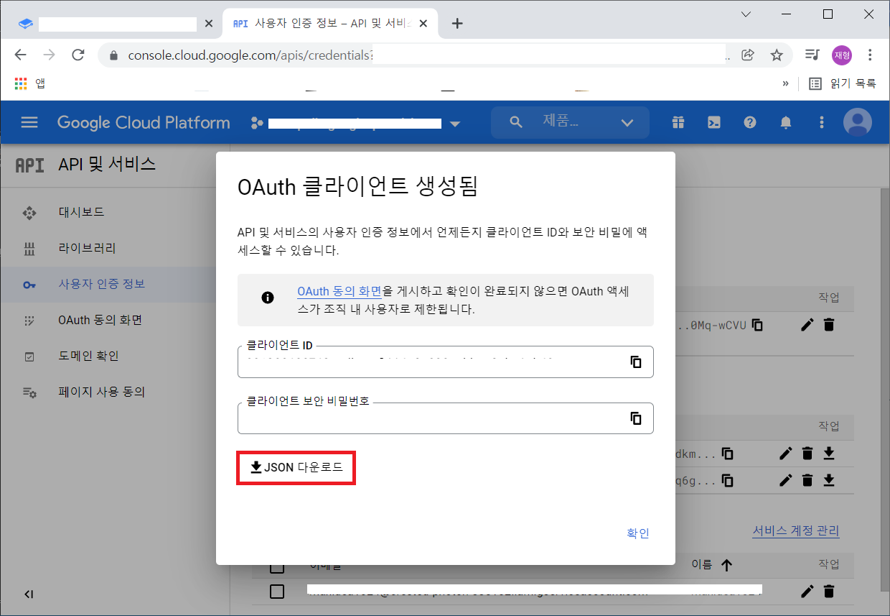

# 워크북과 시트 — 어디서 읽나

> [「시트 작성」으로 돌아가기](../sheets.md)

---

## 엑셀

지정한 폴더 안의 모든 `.xlsx` 파일을 하위 경로까지 포함해 가져옵니다.

사용할 파일과 아닌 파일이 섞여 있으면 기본적으로 전부 대상이 되므로 주의가 필요합니다.
폴더 이름이나 파일 이름 앞에 `#`을 붙이면 대상에서 제외됩니다.

읽을 파일이 엑셀에서 열려 있으면 파일이 잠겨 있어 빌드가 실패할 수 있습니다.

엑셀에는
[여러 파일 확장자](https://support.microsoft.com/ko-kr/office/excel%EC%97%90%EC%84%9C-%EC%A7%80%EC%9B%90%ED%95%98%EB%8A%94-%ED%8C%8C%EC%9D%BC-%ED%98%95%EC%8B%9D-0943ff2c-6014-4e8d-aaea-b83d51d46247)가
있습니다.

이때에는 입력 소스지정에 `FilePatterns`을 지정해주면 가능합니다. 특별히 지정하지 않는 경우에는
와일드 카드(`*`)를 지정하면 됩니다.


## 구글 스프레드시트

[구글 개발자 콘솔](https://console.cloud.google.com)에서 프로젝트를 하나 만들어야 하는 것은 같고,
**거기서 무엇을 받는지가 둘로 갈립니다.**

|누가 변환을 돌리나|무엇을 받나|recipe에 적는 것|
|--|--|--|
|**사람** — 개발자의 기계|`OAuth2` 클라이언트 ID|`ClientSecretFilename`|
|**빌드 서버** — CI 잡|**서비스 계정 키**|`ServiceAccountKeyVariable` 또는 `ServiceAccountKeyFile`|

혼자 쓴다면 아래 2번만 보면 됩니다.

CI를 붙이는 시점에 3번이 필요해집니다.

클라이언트 비밀은 빌드를 돌리는 *사람*으로 접속하므로, 그것을 빌드 서버에 두면 파이프라인의
문서 접근 권한이 한 사람의 계정에 종속됩니다.

그 사람이 조직을 떠나거나 권한이 회수되면 빌드가 중단됩니다.

**둘을 함께 적으면 거부합니다.** 서로 다른 계정이라 하나를 말없이 고르면 그 잡이 자기가 아닌
사람으로 문서를 읽게 되고, 산출물의 어디에도 그 사실이 남지 않기 때문입니다.


### 1. 프로젝트 생성

> 작성중


### 2. `OAuth2` 사용자 인증 정보를 획득 — 사람이 돌릴 때

받은 파일은 아무 데나 두고 그 경로를 `recipe`의 `ClientSecretFilename`에 적어주면 됩니다.

처음 한 번은 브라우저가 열리면서 동의를 묻습니다. 그 뒤로는
`~/.credentials/sheets.googleapis.com-tabbit`에 토큰이 남아 다시 묻지 않습니다. 다른 PC에서도
묻지 않게 하려면 이 파일을 같은 경로에 복사해두면 됩니다.

> 이 복사가 **CI에서 쓰던 우회**입니다. 3번이 그것을 대신합니다 — 토큰에는 수명이 있고, 만료되면
> 그때부터 빌드가 멈추는데 그 시점을 아무도 예고받지 않습니다.

<details>
<summary><b>스크린샷을 따라가며 발급받기</b> (펼쳐보기)</summary>

<br>

1. 아래 화면에서 `사용자 인증 정보 만들기`를 클릭합니다.


2. `OAuth 클라이언트 ID`를 선택합니다.


3. `어플리케이션 유형*`은 `데스크톱 앱`으로 설정하고, `이름*`은 `Tabbit`으로 한 후 `만들기` 버튼을 클릭합니다.


4. `JSON 다운로드` 버튼을 클릭해서 인증정보가 담긴 파일을 다운로드합니다.


5. 다운로드한 파일을 임의의 위치에 저장해둡니다.


위에서 저장해둔 파일명을 기억해 두었다가 추후 설명할 `recipe` 파일에 기입해주어야합니다.

</details>

> **이 파일을 저장소에 커밋하지 마십시오.** `.gitignore`가
> `**/googlesheets-client-secret.json`을 막고 있지만, 다른 이름으로 저장하면 걸리지 않습니다.
>
> 그리고 **이미 커밋해버렸다면 추적 해제로는 해결되지 않습니다.** 히스토리에 남고, 이미 클론한
> 사본에서는 히스토리 재작성도 무력합니다.
> [GCP 콘솔의 사용자 인증 정보 페이지](https://console.cloud.google.com/apis/credentials)에서
> **해당 클라이언트를 삭제하고 새로 발급**하는 것이 유일한 조치입니다.
>
> 스크린샷도 확인하십시오. 이 저장소의 위 이미지에는 클라이언트 ID와 보안 비밀번호가 평문으로
> 찍혀 있었고(현재는 가려둔 상태), 그 자격증명은 아직 폐기되지 않았습니다 — 프로젝트
> `crested-photon-338102`.


### 3. 서비스 계정 키 — 빌드 서버가 돌릴 때

**서비스 계정은 사람이 아니라 잡 자신의 계정입니다.** 대화형 동의가 없고, 문서는 동료에게 공유하듯
그 계정의 주소에 공유합니다.

1. GCP 콘솔의 `IAM 및 관리자` → `서비스 계정`에서 서비스 계정을 하나 만듭니다. 프로젝트
   역할은 **주지 않아도 됩니다** — 필요한 권한은 GCP의 역할이 아니라 스프레드시트 쪽 공유입니다.
2. 만든 계정의 `키` 탭 → `키 추가` → `새 키 만들기` → `JSON`으로 키를 내려받습니다.
3. 키 파일 안의 **`client_email`**(`…@….iam.gserviceaccount.com`)을 복사해, 읽을
   **스프레드시트 문서를 그 주소에 `뷰어`로 공유**합니다. 이 단계를 빼먹으면 문서가 없다는
   응답이 옵니다 — 계정은 유효하고 그 문서만 안 보이는 것입니다.
4. 키를 CI의 시크릿 저장소에 넣고, recipe에는 **그 환경 변수의 이름**을 적습니다.

```jsonc
{ "ServiceAccountKeyVariable": "TABBIT_SHEETS_KEY", "SheetsId": "…" }
```

```yaml
# .github/workflows/data.yml
- run: tabbit --recipe recipe.jsonc --env live
  env:
    TABBIT_SHEETS_KEY: ${{ secrets.TABBIT_SHEETS_KEY }}
```

**환경 변수 쪽이 파일보다 낫습니다** — 키가 러너의 디스크에 남지 않고, 저장소에 실수로 들어갈
파일 자체가 생기지 않기 때문입니다. 로컬에서 서비스 계정으로 확인해볼 때만
`ServiceAccountKeyFile`을 씁니다.

> **이 키도 커밋하지 마십시오.** `.gitignore`가 `**/googlesheets-service-account.json`을 막고
> 있지만 다른 이름으로 저장하면 걸리지 않습니다. 커밋해버렸다면 조치는 위와 같습니다 — 추적
> 해제로는 해결되지 않고, 콘솔에서 **그 키를 삭제**해야 합니다. 서비스 계정은 키를 여러 개 가질
> 수 있으므로, 새 키를 먼저 만들어 넣고 옛 키를 지우면 빌드가 멈추지 않습니다.
>
> **클라이언트 비밀 파일을 이 자리에 적으면 그 자리에서 거부합니다.** 구글이 내려주는 두 JSON은
> 바꿔 넣기 쉬운데, 그대로 API로 보내면 권한 오류로 돌아와 문서 공유 문제처럼 읽히기 때문입니다.


## 인식되는 워크북/시트 대상

`recipe`에 적은 엑셀 파일과 구글 스프레드시트는 전부 합쳐서 하나로 봅니다. 파일이 몇 개든,
시트가 몇 장이든 결과는 하나입니다.

나누는 건 어디까지나 편집하기 편하라고 하는 것입니다. 기획자별로 파일을 나누든 콘텐츠별로
나누든, 도구가 보는 것은 합쳐진 하나의 데이터입니다.

### 읽을 워크북과 시트 골라내기

기본은 **전부 포함**입니다. 폴더에 입력이 아닌 워크북(참고용 백업, 테이블로 만들 수 없는
파일)이 있거나 워크북에 데이터 외의 것(참고용 탭, 작업 메모, 만들다 만 표)이 섞여 있다면
recipe의 소스 항목에서 골라낼 수 있습니다.

```jsonc
"Xlsx": [{
  "Path": "./sheets",

  "ExcludeWorkbooks": ["백업/*", "*_참고용*"],   // 워크북 자체를 빼기. 열지도 않습니다

  "IncludeSheets": ["CharacterTable", "ItemTable", "Stage*"],   // 비우면 전부
  "ExcludeSheets": [
    "*참고용*",                    // 모든 워크북에 적용
    "[Items.xlsx]Define"          // 그 워크북에만 적용
  ]
}]
```

- 배열로도, `;`로 이은 문자열로도 쓸 수 있습니다. 목록이 길면 배열이 읽기 좋습니다.
- `*` `?`는 파일 글롭과 같습니다. 대소문자는 구분하지 않습니다.
- 워크북은 `Path` 기준 상대 경로·파일명·확장자를 뗀 이름 중 무엇으로 적어도 됩니다.
- **시트 이름은 워크북마다 겹칩니다.** 한쪽의 `Define`은 테이블이고 다른 쪽의 `Define`은 작업용
  탭일 때 `[워크북]시트`로 구분합니다.
- **`IncludeWorkbooks`·`IncludeSheets`에 적었는데 없는 것은 오류입니다.** 적어놓고 표시 없이
  빠지면 산출물에서 테이블 하나가 사라진 걸 아무도 모르기 때문입니다. 오류 메시지가 실제로 있는
  목록을 같이 보여줍니다.

자세한 것은 [recipe 레퍼런스](../recipe/sources.md#읽을-워크북과-시트-골라내기)에 있습니다.

`GoogleSheets` 소스에서도 똑같이 동작하고, 워크북 목록은 문서 제목과 맞춰봅니다.
