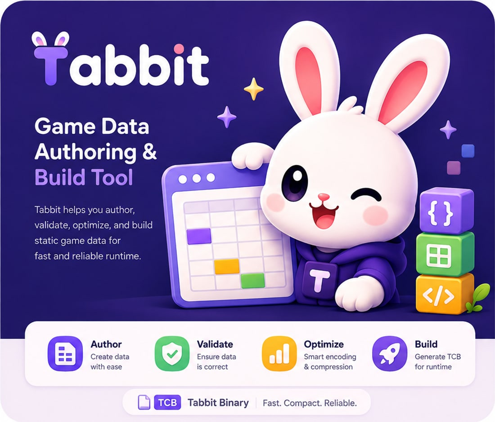
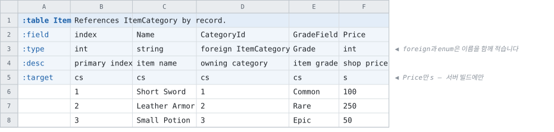

<a href="https://maxidea1024.github.io/tabbit/">
  
</a>

# Tabbit

**Game Data Compiler** — 엑셀과 구글 스프레드시트에 적은 게임 데이터를 검증하고, 런타임이 그대로
싣는 데이터와 그것을 읽는 코드로 빌드합니다.

[](https://github.com/maxidea1024/tabbit/actions/workflows/dotnet.yml)
[](https://maxidea1024.github.io/tabbit/)
[](https://github.com/maxidea1024/tabbit/releases)
[](LICENSE)

엑셀을 읽어 게임 데이터로 만드는 스크립트는 어렵지 않습니다. 아마 이미 있을 것입니다.

어려운 것은 그 뒤입니다. 컬럼이 하나 늘고, 서버가 Go로 가고, 기획자가 빈 칸에 `-`를 적고,
라이브가 시작됩니다. 그때부터 그 스크립트는 누군가의 상시 업무입니다.

**Tabbit이 대신하는 것이 그 상시 업무입니다.** 시트는 그대로 둡니다.

---

## 시트 한 장에서 나오는 코드

규칙은 하나입니다. **`:`가 붙은 셀은 데이터가 아니라 표의 뼈대입니다.**



```bash
tabbit --recipe recipe.json
```

```csharp
await GameData.ReadAllAsync("./data");

var sword = GameData.Item.FindByIndex(1);

sword.Name;                              // Short Sword
sword.ItemCategoryByCategoryId.Name;     // Weapon   ← 조회를 한 번 더 하지 않습니다
sword.GradeField;                        // Grade.Common
```

시트에는 분류 번호만 적혀 있는데 코드에서는 그것이 가리키는 행이 바로 옵니다. 레코드 타입, 조회
함수, 데이터 파일, 그 파일을 읽는 리더가 함께 나옵니다.

C#(.NET과 유니티), TypeScript, C++, C, Go, Rust, Python, Java, Kotlin, Swift, Lua, Ruby, PHP,
Dart, 언리얼 모듈이 **같은 시트에서** 나옵니다 —
[언어마다 나란히 놓은 문서](doc/generated-code.md)에서 자기 언어를 고르면 됩니다.

## 달라지는 것

- 파서도, 직렬화기도, 검증 코드도 손으로 쓰지 않습니다.
- 값이 잘못되면 **어느 파일, 어느 시트, 어느 셀**인지 알려줍니다. 구글 스프레드시트라면 링크를
  눌러 그 셀로 갑니다. 문제가 다섯이면 다섯을 한 번에 알려줍니다.
- 서버와 클라이언트가 같은 시트를 씁니다. 컬럼에 `s` 하나를 적으면 클라이언트가 받는 파일에는
  그 컬럼이 아예 없습니다.
- 데이터만 올려도 되는 변경인지 코드까지 배포해야 하는 변경인지 커밋마다 알려줍니다. enum을
  잘못 내보내면 게임은 크래시하지 않고, 로그에도 아무것도 남지 않습니다.

**그리고 데이터가 작아집니다.** 같은 게임 데이터가 JSON으로 14.08 MB, Tabbit으로 **0.51 MB**입니다.
로드는 45.3 ms에서 **12.6 ms**로 줄고, 로드 중 할당은 절반 이하입니다.

컬럼마다 후보를 전부 인코딩해 보고 가장 작은 것을 고르기 때문입니다. 95,490행짜리 성장 테이블의
컬럼 넷이 파일에서 차지하는 것은 **234바이트**입니다 — 값을 하나도 빠뜨리지 않고
그렇습니다([벤치마크](doc/benchmark.md)).

## 테이블 하나부터

**엑셀은 그대로 쓰시면 됩니다.** 기획자가 새 에디터를 배울 일이 없고, Tabbit의 규칙으로 쓰이지
않은 시트도 읽으므로 시트를 먼저 고칠 필요도 없습니다.

선언 셀을 적은 자리만 읽습니다. 같은 워크북의 다른 시트는 대상이 아닙니다. 테이블 하나를 JSON으로
내보내 지금 쓰는 파일과 비교해 보는 것이 가장 짧은 첫걸음입니다.

빼는 것도 폴더 하나입니다. 생성된 코드는 그 자체로 완결된 패키지이고, 기본값에서는 새로 설치할
라이브러리가 없습니다.

## 시작하기

내려받아 압축을 푸는 것으로 끝납니다. .NET 런타임도 따로 설치하지 않습니다 —
[릴리즈](https://github.com/maxidea1024/tabbit/releases)에 Windows, Linux, macOS의 x64와 arm64가
올라갑니다([설치](doc/install.md)).

```bash
tabbit --new-recipe my-recipe.json --template unity
tabbit --recipe my-recipe.json
```

`--template`은 `unity` · `client-server` · `web` · `server` · `unreal` · `ci` 중에서 고릅니다.
설정마다 무엇을 위한 것이고 언제 바꾸는지 주석이 붙어 있습니다.

|어느 쪽이신가요|어디부터|
|--|--|
|**시트에 데이터를 적는 분**|[기획자용 빠른 시작](doc/quickstart-designer.md) — 알아야 하는 특수문자는 두 개입니다|
|**도구를 붙이는 분**|[개발자용 빠른 시작](doc/quickstart-developer.md) — 설치부터 코드에서 읽기까지|

## 문서

[문서 사이트](https://maxidea1024.github.io/tabbit/)에 전부 있습니다.
저장소에서는 [문서 목록](doc/readme.md)이 같은 자리입니다.

| 문서 | 내용 |
| --- | --- |
| [시트 한 장으로 시작하는 예제](doc/concepts.md) | 시트에 적을 수 있는 세 가지와 그것이 되는 것 |
| [시트 작성](doc/sheets.md) | 데이터 배치, 이름 규칙, 지원 타입 전부 |
| [시트가 코드가 되는 모습](doc/generated-code.md) | 시트 하나와 생성된 코드를 언어마다 나란히 |
| [CLI](doc/cli.md) · [Recipe 파일](doc/recipe.md) | 실행 방법과, 어디서 읽고 어디로 출력할지 |
| [언어별 가이드](doc/languages/readme.md) | 생성된 코드를 프로젝트에 적용하는 방법 |
| [기능](doc/features.md) · [벤치마크](doc/benchmark.md) | 하는 일 전부와, 형식별 크기·로드 비용 |
| [트러블슈팅](doc/troubleshooting.md) | 빌드 실패 시 실제 출력 메시지를 기준으로 |

## 기여하기

버그와 제안은 [이슈](https://github.com/maxidea1024/tabbit/issues)로 알려주세요. 개발과 테스트
방법은 [아키텍처와 개발](doc/architecture.md)에, 보안 문제는 [SECURITY.md](SECURITY.md)의 절차에
있습니다. 변경 내역은 [CHANGELOG.md](CHANGELOG.md)입니다.

## 라이선스

코드와 문서는 [MIT](LICENSE)입니다. 생성된 코드와 테이블 리더도 동일하고, 시트에서 생성된 코드와
데이터의 소유권은 그것을 만든 프로젝트에 있습니다.

**이름과 로고는 다릅니다** — [브랜드 자산의 이용 조건](brand/license.md). 가리키는 데는
마음껏 쓰시고, 후원이나 제휴로 읽힐 자리에는 두지 말아 주십시오.
