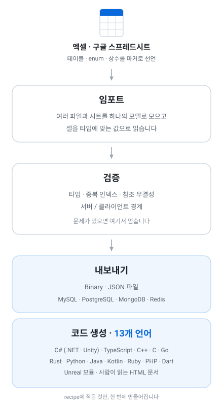

# Tabbit

**Game Data Authoring & Build Tool**

[](https://github.com/maxidea1024/tabbit/actions/workflows/dotnet.yml)
[](https://maxidea1024.github.io/tabbit/)
[](https://github.com/maxidea1024/tabbit/releases)
[](LICENSE)

### **[maxidea1024.github.io/tabbit →](https://maxidea1024.github.io/tabbit/)**

소개와 전체 문서가 있습니다. 검색이 되고, 사이드바로 옮겨 다닐 수 있습니다.

게임 시스템의 근간은 정적 데이터입니다. 아이템·스테이지·밸런스·설정 — 코드보다 자주 바뀌고,
손이 더 많이 타고, 틀렸을 때 가장 늦게 드러납니다.

**Tabbit**(테빗)은 그 데이터를 **짜고, 검증하고, 런타임 데이터로 빌드하는** 도구입니다.

|단계|하는 일|
|--|--|
|**Author**|엑셀·구글 스프레드시트에 테이블·enum·상수셋을 적습니다|
|**Schema**|타입·인덱스·참조·제약을 시트에서 읽어 스키마로 세웁니다|
|**Validate**|타입으로 표현할 수 없는 규칙까지 C#으로 검사합니다. 문제는 **어느 셀인지** 함께 보고합니다|
|**Analyze**|로드된 데이터를 HTML로 펼쳐 보고, 커밋마다 무엇이 바뀌었는지 셀 단위로 남깁니다|
|**Optimize**|컬럼마다 그 값들에 가장 짧은 인코딩을 고릅니다 — 사전·RLE·델타·비트폭 패킹|
|**Build**|런타임 바이너리와, 그것을 읽는 코드를 13개 언어로 냅니다|



엑셀과 구글 스프레드시트는 **입력 수단**입니다. 지금 데이터가 거기 있어서 거기서 읽을 뿐이고,
이 도구의 정체는 무엇을 읽느냐가 아니라 무엇을 내놓느냐에 있습니다.

---

## 빠른 시작

[내려받아 압축을 풀면 끝입니다](doc/install.md) — .NET을 설치하지 않아도 됩니다.

```
tabbit --new-recipe my-recipe.json --template unity   # 상황에 맞는 시작점
tabbit --recipe my-recipe.json                        # 변환
```

무엇을 어디서 읽어 어디로 내보낼지는 recipe 파일에 적습니다. `--template`은 **그 상황에 필요한
설정만, 각각 왜 있는지 주석을 달아** 내놓습니다 — `unity` `client-server` `web` `server`
`unreal` `ci`.

나온 코드는 이렇게 씁니다. **접근자 이름과 표기는 언어마다 그 언어의 관례를 따릅니다.**

```csharp
await GameData.ReadAllAsync("./data");
var sword = GameData.Item.FindByIndex(1);
```

다음 세 문서면 시작할 수 있습니다 — [시트에 무엇을 적을 수 있나](doc/concepts.md) ·
[CLI](doc/cli.md) · [Recipe 파일](doc/recipe.md).

## 무엇이 나오나

|종류|타깃|
|--|--|
|익스포트|`binary` `json`|
|데이터베이스|`mysql` `postgresql` `mongodb` `redis`|
|코드 생성|`csharp` `typescript` `cpp` `c` `unreal` `go` `rust` `python` `java` `kotlin` `ruby` `php` `dart`|
|문서|`html`|
|기록|`summary` `history`|

**따로 설치할 것이 없습니다.** 바이너리를 읽는 코드까지 출력 폴더에 같이 나오므로, 플러그인을
깔거나 include 경로를 잡을 일이 없습니다.

**TCB — Tabbit Compiled Binary.** 빌드의 결과물입니다. 파싱이 없고, 인코딩이 값의 크기에 맞고,
**스키마가 바뀌어도 감지되지 않는 읽기 오류가 되지 않습니다** — 읽을 수 있으면 정확히 읽고,
읽을 수 없으면 필드 이름과 양쪽 타입을 대고 멈춥니다. [바이너리 형식](doc/binary-format.md)

## 왜 이걸 쓰나

- **문제를 게임이 아니라 변환에서 만납니다.** 걸러낼 수 있는 실수는 걸러내고, 남은 것은 **어느 셀인지** 알려줍니다. 구글 시트라면 링크를 눌러 그 자리로 갑니다.
- **시트에 적을 수 없는 규칙은 C#으로 적습니다.** 그 게이트가 모든 타깃보다 앞이라, 실패한 실행은 파일에도 데이터베이스에도 흔적을 남기지 않습니다.
- **중간에 실패해도 이전 결과가 그대로 남습니다.** 쓰는 쪽도, 읽는 쪽도 — 전부 준비한 다음 한 번에 교체합니다.
- **13개 언어가 같은 파일을 읽습니다.** 포맷을 정의하는 것은 writer 하나이고, 13개 리더는 그 하나를 각자 구현한 것입니다. 회귀 스위트가 **하나로 쓰고 13개로 읽어 대조**합니다.
- **이 도구의 규칙으로 쓰이지 않은 시트도 읽습니다.** 시트를 먼저 고치지 않아도 됩니다.

전부 보려면 [기능](doc/features.md)에 있습니다.

## 문서

**[문서 사이트](https://maxidea1024.github.io/tabbit/docs/guide)** — 검색과 사이드바가 있는 쪽입니다.
저장소 안에서 읽는다면 [문서 목록](doc/readme.md)이 같은 내용입니다. 자주 찾는 것만 옮기면,

|문서|내용|
|--|--|
|[시트 작성](doc/sheets.md)|데이터를 배치하는 법, 엔티티 마커, 이름 규칙, 지원 타입, 서버/클라 분리|
|[언어별 가이드](doc/languages/readme.md)|생성된 코드를 프로젝트에 넣고 쓰는 법. 언어마다 준비물과 주의사항이 다릅니다|
|[검증](doc/validation.md)|시트에 적을 수 없는 규칙을 C#으로 — 테이블별·전역·런타임|
|[내보내기](doc/exports.md)|바이너리·JSON 파일과 데이터베이스 적재. **바이너리를 쓰는 이유**|
|[트러블슈팅](doc/troubleshooting.md)|변환이 실패했을 때 어디를 볼 것인가. 도구가 실제로 출력하는 메시지별로|
|[설계 노트](doc/readme.md#설계-노트)|형식과 기능이 **왜 지금의 모양인지** — 무엇을 거절했고, 예측이 어디서 틀렸는지|

## 기여하기

버그와 제안은 [이슈](https://github.com/maxidea1024/tabbit/issues)로 올려 주세요. 무엇을 어떻게
했을 때 그렇게 되는지가 있으면 가장 빠릅니다.

- 개발·테스트하는 법은 [아키텍처와 개발](doc/architecture.md)에 있습니다.
- 생성기나 템플릿을 건드렸다면 골든을 다시 기록하고 diff를 리뷰해 주세요. 방법은 같은 문서에 있습니다.
- 보안 문제는 공개 이슈 대신 [SECURITY.md](SECURITY.md)의 절차를 따라 주세요.

변경 내역은 [CHANGELOG.md](CHANGELOG.md), 쓰는 외부 패키지는 [의존 패키지](doc/dependencies.md)에 있습니다.

## 라이선스

[MIT](LICENSE).

생성된 코드와 함께 나오는 테이블 리더·업데이터도 같은 라이선스입니다. **생성물에 이 저장소의
라이선스를 표시할 의무는 없습니다** — 시트에서 나온 코드와 데이터는 그것을 만든 프로젝트의
것입니다.
