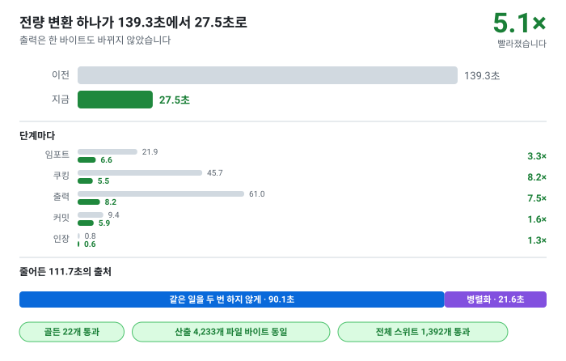

# 전체 변환의 소요 시간 — 어디로 가는지, 무엇을 고치는지

> [문서 목록으로](../doc/readme.md)



전량 변환 하나가 **139초**였습니다. 이 문서는 그 시간이 어디로 갔는지의 실측과, 그것을 줄이는
순서입니다.

[빌드 캐시](build-cache.md)와 목적이 갈립니다. 캐시는 **바뀐 것이 없는 재실행**을 0으로 만드는
장치이고, 이 문서는 **바뀐 것이 있을 때 지불하는 시간** 자체를 줄이는 일입니다. 캐시가 아무리
잘 들어도 시트를 고친 사람은 이 시간을 냅니다.

지금은 **27초**입니다. 읽을 것이 하나 있습니다 — **줄어든 것의 대부분은 「일을 나눠서」가
아니라 「같은 일을 두 번 하지 않아서」입니다.** 139초 중 절반 이상이 알고리즘의 비용이 아니라,
호출마다 정규식을 컴파일하고 4바이트를 비교하려고 64 KB를 할당하는 자리에 있었습니다. 스레드는
그다음이고, 그것도 넷 중 하나는 측정해 보니 느려서 되돌렸습니다(8절). 그리고 스레드를 붙이려고
코드를 들여다보는 과정에서 **다시 「두 번 하던 자리」 셋이 나왔습니다** — 그중 하나는 성능이
아니라 닫지 않은 파일 핸들이었습니다.

그래서 이 문서에서 가장 중요한 절은 설계가 아니라 **1절 — 무엇으로 측정했는가**입니다. 측정하지
않았으면 저 자리들은 보이지 않고, 측정하지 않고 스레드부터 붙였으면 27초짜리 정규식 컴파일을 20개
코어로 나눠 도는 프로그램이 되었을 것입니다.

---

## 1. 무엇으로 측정했는가

**두 가지를 함께 씁니다. 하나로는 답이 나오지 않습니다.**

|계측|답하는 것|답하지 못하는 것|
|--|--|--|
|단계별 시계 ([`RunTimings`](../src/RunTimings.cs))|**어느 단계**에서 몇 초|어느 함수인지 — 로그 카테고리는 그 줄을 쓴 단계를 말하고 실행 중인 단계를 말하지 않습니다|
|`dotnet-trace` CPU 샘플링|**어느 함수**에서 몇 초|블로킹된 I/O — 표본은 실행 중인 스레드에서만 뜹니다|

두 번째의 한계가 실제로 나타났습니다. 최초 측정에서 프로파일이 `json` 익스포트를 12.6초로,
단계 시계는 22.3초로 말했습니다. 차이는 파일을 쓰며 블로킹된 시간이고, 표본에는 잡히지
않습니다. **그래서 단계 합계는 시계를 믿고, 그 안의 배분은 프로파일을 믿습니다.**

수집은 이렇게 합니다.

```
dotnet tool install --global dotnet-trace
dotnet build -c Release src/Tabbit.csproj
dotnet-trace collect --format speedscope -o run.nettrace \
  --providers Microsoft-DotNETCore-SampleProfiler \
  -- <절대경로>\src\bin\Release\net10.0\tabbit.exe --recipe samples/named-range/recipe-all.jsonc --full
```

경로는 절대경로여야 합니다 — 상대경로를 주면 `dotnet-trace`가 프로세스를 시작하지 못하고
**종료 코드 0으로** 끝나므로, 실패한 것을 알아채지 못합니다.

speedscope 파일은 `type: "evented"`이므로 프레임별 자기 시간과 포함 시간은 O/C 이벤트로 스택을
재구성해서 냅니다. 대상은 [`samples/named-range/recipe-all.jsonc`](../samples/named-range/recipe-all.jsonc),
20 논리 코어, `--full`입니다.

## 2. 139초에서 27초로

|단계|원본|같은 일을 두 번 하지 않게 (3·4절)|병렬화 1차|**지금** (5절)|
|--|--:|--:|--:|--:|
|Importing|21.87초|14.35초|5.69초|**6.64초**|
|Cooking|45.66초|9.75초|7.10초|**5.55초**|
|Output|61.04초|16.84초|11.96초|**8.18초**|
|Committing|9.38초|7.30초|6.74초|5.87초|
|Sealing|0.78초|0.69초|0.60초|0.61초|
|**합계**|**139.26초**|**49.17초**|**32.30초**|**27.53초**|

**흔들림을 함께 적습니다. 이 표에서 가장 조심해야 하는 것입니다.**

마지막 열은 연속 네 번 실행의 중앙값입니다 — 26.38 · 27.44 · 27.62 · 27.83초. 그런데 같은
빌드를 한 시간 전에 재었을 때는 22.91 · 24.68 · 25.12 · 26.62초로 **중앙값이 24.90초**였습니다.
2.6초가 코드 때문이 아닙니다.

원인은 측정하는 기계입니다. 이 저장소를 열어 둔 편집기의 C++ 인덱서가 CPU를 상시로 쓰고 있고,
**변환이 돌 때마다 생성된 C++ 500여 개를 다시 쓰므로 인덱싱이 다시 돌아갑니다.** 측정이
측정 대상을 흔드는 형태입니다.

그래서 이 문서의 규칙은 하나입니다. **열 사이의 1~3초 차이는 읽지 말고, 원본과의 차이를
읽습니다.** 139초가 27초가 된 것은 어느 배치로 재도 같고, 어느 한 항목이 2초를 벌었다는 주장은
이 기계에서 한 번의 배치로 뒷받침되지 않습니다 — 그런 항목은 이 문서에서 **「측정되지 않음」**
으로 적었습니다.

전부 동작 보존입니다. 판정이 셋입니다.

|무엇으로|무엇을 확인하는가|
|--|--|
|골든 22개|픽스처의 모든 산출이 바이트 단위로 그대로|
|**산출 트리 4,233개 파일의 해시**|전량 변환에서도 그대로 — 병렬화 전과 후, 그리고 병렬 실행끼리|
|**빌드 리포트의 대조**|보고 항목 29개와 알려진 문제 110개가 순서까지 실행 간 동일하고, 최초 실행의 리포트와도 동일|

세 번째가 병렬화에 필요합니다. 골든은 파일을 보고 리포트를 보지 않으므로, **보고 순서가
스레드 순서로 바뀌는 것**을 잡지 못합니다.

## 3. 같은 일을 두 번 하던 자리 — 139초에서 49초로

이 절의 셋은 알고리즘이 아니라 낭비입니다. 셋 다 한 자리를 고칩니다.

### 3-1. 정규식을 호출마다 컴파일하고 있었습니다 — 쿠킹의 61%

[`StringExtensions.IsValidIdentifier`](../src/Extensions/StringExtensions.cs)가
`new Regex(..., RegexOptions.Compiled)`를 **함수 본문 안에서** 만들고 있었습니다. 그 옵션은
`Reflection.Emit`으로 IL을 뽑으라는 뜻이므로, 호출 하나가 동적 메서드 하나를 만들어 쓰고
버리는 일입니다.

|프레임|시간|
|--|--:|
|`IsValidIdentifier` (메인 스레드)|**27.67초**|
|`DynamicResolver+DestroyScout.Finalize` (파이널라이저 스레드)|83.84초|

쿠킹 전체가 45.66초였고 그중 27.67초입니다. 필드 이름 하나당 1.1 ms — 컴파일 비용 그
자체이고, 정규식이 하는 판정과는 무관합니다. 두 번째 줄은 만든 것을 뒤에서 치우는 비용이며,
이것이 **파이널라이저 스레드가 본체보다 오래 도는** 프로파일의 정체였습니다.

`static readonly`로 올렸습니다. 덧붙여 `identifier.Normalize()`는 이미 정규화된 문자열에도
사본을 만들므로 `IsNormalized()`로 감쌌습니다.

> **여기서 배울 것.** `RegexOptions.Compiled`는 「빠르게 해 달라」는 뜻이 아니라 「이 정규식을
> 많이 쓸 것이니 미리 컴파일해 달라」는 뜻입니다. 인스턴스를 재사용하지 않으면 **옵션을 빼는
> 것보다 느립니다.** 저장소의 다른 `new Regex` 자리는 전부 `static readonly`거나 캐시된
> 것이었고, 이 하나만 아니었습니다.

### 3-2. 4바이트를 비교하려고 64 KB를 할당하고 있었습니다 — `binary`의 68%

[`TcbColumnEncoder.OfferWholeNumbers`](../src/Exporters/TcbColumnEncoder.cs)는 float 컬럼의
값이 정수로 써도 같은 바이트가 되는지를 값마다 확인합니다. 그 확인을 `new TcbWriter()`로 하고
있었고, [`TcbWriter`](../src/Exporters/TcbWriter.cs)의 기본 초기 용량은 **64 KB**입니다. 값
하나마다 64 KB짜리 배열 하나입니다.

|프레임|시간|
|--|--:|
|`OfferWholeNumbers`|**22.4초** (`binary` 32.85초 중)|

스택 버퍼와 `BinaryPrimitives`로 직접 비교하게 바꿨습니다. 쓰는 바이트가
`TcbWriter.Write(float)`·`Write(double)`과 같은 리틀엔디언 비트 패턴이므로 판정이 동일하고,
그것을 골든이 확인합니다.

`stackalloc`은 루프 밖에 둡니다 — 안에 두면 반복마다 프레임이 자라고, 분석기(CA2014)가 그것을
빌드 오류로 잡습니다.

### 3-3. GC가 코어 하나만 쓰고 있었습니다

`ServerGarbageCollection`이 꺼져 있었습니다. 변환은 한 번의 긴 할당 폭주이고 머신에는 코어가
남으므로, 워크스테이션 GC의 수집이 작업 스레드를 멈춰 세우고 있었던 것입니다. csproj 한 줄로
**71.25초 → 54.12초**입니다.

**서버 GC의 통상적인 반론은 메모리를 시간과 바꾼다는 것인데, 여기서는 거의 바꾸지 않습니다.**

|GC|시간|최대 작업 세트|
|--|--:|--:|
|워크스테이션|71.25초|10,284 MB|
|서버|**54.12초**|10,627 MB|

최대치를 정하는 것이 **미수집 쓰레기가 아니라 살아 있는 모델**이기 때문입니다. 그 10 GB 자체가
7절의 주제입니다.

이것이 진짜 절충이 되는 자리는 코어가 적고 메모리가 적은 빌드 에이전트이고, 그래서 숫자를
csproj에 적어 두었습니다 — `DOTNET_gcServer=0`으로 리빌드 없이 끕니다.

## 4. 나머지 낭비 — 일곱 자리

3절의 셋이 큰 것이었고, 이 절의 일곱은 그것을 걷어낸 뒤 프로파일에 남은 것입니다. 아래 초
수는 **71.3초 빌드의 프로파일**에서 측정한 것이고, 이 일곱을 다 하면 49.2초가 되었습니다.

|#|자리|무엇이 문제였는가|측정값|결과|
|--|--|--|--:|--|
|A1|[`Manifest.Add`](../src/Manifest.cs)|파일을 쓰고 나서 **디스크에서 다시 읽어** MD5를 냈습니다. `Items.Find`는 선형 탐색이었습니다|`json` 4.59초 + `binary` 2.37초|**했음**|
|A2|[`JsonExporter.ExportRowSet`](../src/Exporters/JsonExporter.cs)|행마다 `Dictionary`를 용량 없이 만들어 `Resize`가 돌았습니다. `sf.Name.ToCamelCase()`가 **행마다** 다시 계산되었습니다|3.39초 + 1.18초|**했음**|
|A3|[`StagingFiles.WriteToJsonFile`](../src/Helpers/StagingFiles.cs)|`json.Replace` 와 `+ "\n"` 이 문자열 전체를 복사했습니다 — 100 MB 테이블이 사본 셋이 됩니다|LOH 압박|**했음**|
|A4|[`ValidateReferencedKeysExist`](../src/Cooking/ModelCooker.Validation.cs)|참조하는 **컬럼마다** 대상 테이블의 키 HashSet을 처음부터 새로 만들었습니다|2.71초|**했음**|
|A5|[`TcbColumnEncoder`](../src/Exporters/TcbColumnEncoder.cs)|후보 인코딩마다 64 KB로 시작했습니다. 컬럼 하나에 후보가 4~8개이고 컬럼이 약 25,000개입니다|GC 압박|**했음**|
|A6|[`StagingFiles.CommitFiles`](../src/Helpers/StagingFiles.cs)|`File.Delete` 후 `File.Move`가 두 번의 호출이었고, `RegisterStagingFile`의 `.Any()`와 이 루프의 `RemoveAt(0)`은 파일 4,233개에 대해 둘 다 O(n²)였습니다|Delete 1.22초|**했음**|
|A7|[`RawSheet.Optimize`](../src/Models/Raw/RawSheet.cs)|패딩할 행에 용량을 주지 않아 `List`가 자라며 자기 내용을 계속 복사했습니다|0.75초|**했음**|

**A1이 이 표에서 가장 값이 싸고 가장 컸습니다.** `StagingFiles`가 쓰는 시점에 이미 내용을 손에
들고 있으므로, 그때 해시를 내서 넘기면 되읽기가 통째로 없어집니다. 같은 바이트를 **세 번**
읽고 있었습니다 — `Manifest.Add`가 한 번, 마스터 해시가 한 번, 인장의 SHA-256이 한 번. 첫
번째가 없어졌고, 두 번째는 배열로 올리지 않고 흘려 읽게 했습니다.

`Location` 자체는 그대로입니다. A7이 고친 것은 리스트의 성장이고, 셀마다 객체가 둘이라는 사실은
6절입니다.

## 5. 병렬화 — 무엇이 되고 무엇이 안 되었는가

**전제 하나가 이 절 전체를 지배합니다.** 병렬화한 단계는

- 결과를 **인덱스 자리에** 쓰고,
- 진단을 **단위별로 모아 단위 순서로** 병합해야 합니다.

순서가 흔들리면 리팩터링이 아니라 동작 변경입니다. 그리고 그 변경은 **골든으로 잡히지
않습니다** — 골든의 픽스처는 테이블 몇 개짜리라 스레드가 갈릴 일이 별로 없습니다. 그래서
병렬화한 항목은 전부 **전량 변환의 산출 트리 4,233개 파일을 해시해서** 대조했습니다. 병렬화
전과 후, 그리고 병렬 실행끼리 같아야 통과입니다.

|#|자리|한 것|측정값|결과|
|--|--|--|--:|--|
|B2|[`BinaryExporter.Encode`](../src/Exporters/BinaryExporter.cs), 컬럼 단위|`blocks[at]`이 이미 인덱스 자리였고 `EncodeColumn`은 static입니다. `table.WireColumns`를 병렬 구간 밖에서 읽어 지연 캐시 둘을 확정시킵니다|Output 16.8 → 13.2초|**했음**|
|B1|Importing, 워크북 단위|인스턴스 필드 전부를 `WorkbookRead` 하나로 옮겼습니다. 시트는 워크북별로 모아 **recipe가 적은 워크북 순서로** 모델에 붙입니다 — 모델의 시트 순서가 테이블이 쿠킹되고 보고되는 순서를 정하기 때문입니다|**13.6 → 5.8초**|**했음**|
|B6|`ValidateModel`, 테이블 단위|테이블별 `Diagnostics`에 모아 **테이블 순서로** 병합합니다(`Diagnostics.Absorb`). 참조 키 캐시는 `ConcurrentDictionary`로, 커버리지 카운터는 `Interlocked`로|Cooking 9.3 → **7.1초**|**했음**|
|B3|Output, 타깃 단위|스테이징 장부가 **어느 항목이 썼는지를 이름표로** 알게 했습니다. 사이드 투영은 병렬 구간 밖으로, 한 타깃의 항목들은 순차로 — 아래|Output 12.9 → **8.0초**|**했음**|
|B7|`CommitFiles`, 이동 병렬|**역효과. 되돌렸습니다** — 8절|6.2 → **9.5초**|되돌림|
|B4|`json`·`binary`, 테이블 단위|**쓰기 전에 순서를 정합니다** — 계획·쓰기·기록 셋으로 갈라, 예약과 매니페스트는 테이블 순서로, 가운데만 병렬 — 아래|Output 8.0 → **6.0초**|**했음**|
|B5|Cooking `ParseTables`, 테이블 단위|레이아웃 플러그인의 계약이 먼저 — 아래|약 3.4초|보류|

병렬화만이 아니라, 스레드를 붙이는 과정에서 **같은 일을 두 번 하던 자리 셋**이 더 나왔습니다.

|무엇|무엇이 문제였는가|측정값|
|--|--|--:|
|[`SheetGridReader.Dispose`](../src/Importers/Xlsx/SheetGridReader.cs)|**행 복구가 든 두 번째 파일 핸들을 닫지 않았습니다.** 이진 워크북마다 스트림·ZIP·인플레이터가 파이널라이저로 넘어가, 파이널라이저 스레드가 아무도 부탁하지 않은 zlib 핸들 해제에 시간을 쓰고 있었습니다|파이널라이저 17.5초|
|[`TemplateEngine`](../src/CodeGeneration/TemplateEngine.cs)|**템플릿을 파일마다 다시 파싱**했습니다. 생성기 하나가 테이블마다 렌더하므로, 렌더 비용의 큰 쪽이 이미 읽은 텍스트를 다시 읽는 것이었습니다|3.88초 중 **2.41초**|
|[`FileHelper.EnsurePathExists`](../src/Helpers/FileHelper.cs)|**파일마다 디렉터리를 stat**했습니다. 커밋이 4,233번 물어서 수십 개의 같은 사실을 알아냅니다|**측정되지 않음**|

첫 번째는 성능 이야기이기 전에 결함입니다. 아무 메시지도 없고 숫자도 맞으며, 일어나는 일은
관리되지 않는 핸들이 수집이 알아챌 때까지 열려 있는 것입니다.

세 번째는 **효과가 측정되지 않았습니다.** 4,200번의 시스템 호출이 없어진 것은 사실이지만
커밋은 `MoveFileEx`가 정하고 있어서, 커밋 시간은 흔들림 안에서 그대로입니다. 남긴 것은 그것이
옳은 코드이기 때문이고, 시간을 근거로 남긴다고 적지는 않습니다.

### B3을 풀었습니다 — 위치로 알던 장부를 이름으로

**막고 있던 것은 락이 아니라 장부의 형태였습니다.**
[`TargetRegistry.RunAll`](../src/Targets/TargetRegistry.cs)은 한 항목이 무엇을 썼는지를 이렇게
알아냈습니다.

```csharp
int before = StagingFiles.PendingCount;
planned.Descriptor.Target.Run(...);
cache.Wrote(planned.Section!, StagingFiles.PendingSince(before), ...);
```

공유 리스트의 구간입니다. 그 코드의 주석이 왜 그렇게 했는지 말했습니다 — 타깃마다 자기가 쓴
파일 목록을 들게 하면 캐시의 장부가 모든 타깃에 퍼진다는 것이고, 그 판단은 맞습니다. 다만 그
설계는 **한 번에 한 항목만 돈다**는 것을 전제로 했습니다.

거절되었던 대안은 지금도 거절합니다. 셋째 방법을 씁니다 — **부르는 쪽이 항목을 대고, 장부가
도착하는 것에 이름표를 붙입니다.** `StagingFiles.Attributing(section)` 스코프가 그 이름을
`AsyncLocal`에 걸고, `RegisterStagingFile`이 들어오는 파일에 그것을 붙입니다. `AsyncLocal`인
것은 타깃이 안에서 또 갈라지기 때문입니다 — binary는 컬럼을 병렬로 인코딩합니다(B2).

그리고 순서. `cache.Wrote`는 병렬 구간이 **끝난 뒤 recipe가 적은 항목 순서로** 부릅니다. 항목
하나가 자기 파일을 테이블 순서로 스테이징하므로, 인장에 들어가는 목록은 어느 항목이 먼저
끝났는지와 무관합니다.

같이 걸린 것이 셋 더 있었고, 셋 다 스레드를 붙였기 때문에 드러난 것이지 스레드가 만든 것이
아닙니다.

|무엇|왜 문제인가|
|--|--|
|`Model.ProjectTo`|투영된 모델을 `Model.Current`에 걸고 끝나면 되돌립니다 — 정적 필드 하나를 두 스레드가 그렇게 할 수는 없습니다. **사이드마다 한 번씩** 병렬 구간 밖에서 만들어 나눠 줍니다. 항목마다 투영하던 것이 없어지므로 덜 하는 일이기도 합니다|
|`Table.SerialFields`·`WireColumns`|첫 사용에 만들어지는 캐시입니다. `??=`는 읽기·호출·쓰기 셋이라 두 스레드가 같이 만들 수 있고, 게터를 락으로 감싸면 **행마다 읽는 자리**가 전부 그 값을 냅니다. 그래서 병렬 구간 전에 `BuildDerivedColumns()`로 확정시킵니다|
|같은 타깃의 항목 여러 개|타깃은 항목마다 새로 만들어지지 않는 **하나의 객체**이고 매니페스트와 키를 필드로 듭니다. 그래서 **타깃끼리는 병렬, 한 타깃의 항목들은 순차**입니다|

`SerialFields` 게터에는 결함이 하나 있었습니다. 리스트를 필드에 **먼저 대입하고 나서**
요구성을 적용했으므로, 그 사이에 읽은 쪽은 요구성이 적용되지 않은 리스트를 봅니다. 순차
실행에서는 보이지 않던 창이고, 고쳤습니다.

### B4도 풀었습니다 — 순서를 되돌리지 않고, 먼저 정합니다

**막고 있던 것은 두 개의 순서였습니다.** `Manifest.Items`의 순서는 커밋되는 매니페스트 파일의
내용이고, `_stagingFiles`의 순서는 인장에 기록되는 출력 목록의 순서입니다. 둘 다 테이블
순서여야 합니다.

병렬로 쓰고 나서 되돌리는 방법을 찾을 필요가 없었습니다. **쓰기 전에 정하면 됩니다.**

|단계|무엇을|왜 여기인가|
|--|--|--|
|계획|테이블 순서로 파일 이름과 스테이징 경로를 **예약**|스테이징 목록의 순서가 여기서 확정됩니다|
|쓰기|각 테이블을 병렬로 구성해 예약된 자리에 씀|일이 있는 곳이고, 서로 공유하는 것이 없습니다|
|기록|같은 계획 순서로 매니페스트에 넣음|매니페스트 파일의 순서가 여기서 확정됩니다|

예약은 **전부 아니면 전무**입니다(`StagingFiles.ClaimAll`). 시작 전에 두 가지가 참이어야 하고
둘 다 파일 하나씩으로는 확인할 수 없기 때문입니다 — 자기 파일 중 둘이 같은 파일이 아닐 것, 그리고
다른 무엇이 그중 하나를 이미 잡지 않았을 것. 하나라도 아니면 장부는 손대지 않은 채로 남고,
항목은 순차 경로로 갑니다.

**순차 경로를 남긴 이유가 규칙 하나입니다.** 같은 자리를 두 번 잡았을 때 「텍스트가 같으면
통과」인데, 그 비교는 **비교할 파일이 있어야** 성립합니다. 예약만 해 둔 자리에는 아직 파일이
없으므로, 그 규칙은 순차 경로에 두고 병렬 경로에서 다시 유도하지 않습니다.

`binary`에는 축이 하나 더 있어서 정할 것이 있었습니다. 테이블 병렬 안에 컬럼 병렬(B2)이
중첩되면 테이블마다 코어가 없는 팬아웃을 차립니다. **바깥 축이 우선합니다** — 익스포트는 테이블을
가져가고, 검증 파이프라인은 테이블 하나를 인코딩하므로 컬럼을 가져갑니다(`Spread`).

### B5가 마지막인 이유

레이아웃 파서는 [CLAUDE.md](../CLAUDE.md)가 말하는 **플러그인**입니다. 병렬로 돌리려면 코어가
「병렬 파싱에서 파서가 지켜야 하는 것」을 계약으로 정해 줘야 하고, 지금은 그 계약이 없습니다 —
레이아웃 하나를 병렬 안전하게 고쳐도 다음 레이아웃이 같은 함정에 그대로 빠집니다.

함정은 이미 확인되어 있습니다. [`CookingContext`](../src/Cooking/CookingContext.cs)의
`_cellNotices`는 락 없는 `Dictionary`이고, **그 순회 순서가 보고 순서**입니다. 계약이 정해야 할
것이 바로 이런 자리입니다. 계약을 정하는 것이 B5의 본론이고, 9초는 그 부산물입니다.

## 6. 아무도 읽지 않는 것을 읽고 있었습니다 — 셀 노트

3절과 4절은 「같은 일을 두 번」이었습니다. 이것은 **한 번도 필요하지 않았던 일**입니다.

두 임포터가 셀에 붙은 메모를 읽어 `RawCell.Note`에 담고 있었습니다. 레이아웃이 그것을 컬럼의
설명으로 쓸 수 있게 하려던 것이고, **어느 레이아웃도 쓰지 않았습니다.** 이 도구가 대체한 예전
도구에 있던 기능인데, 실제로 쓴 사람이 없었습니다. 이유는 어느 도구의 문제가 아니라
스프레드시트 쪽입니다 — 노트는 쓰기 번거롭고, 마우스를 올리지 않으면 보이지 않고, 한 컬럼을
한눈에 볼 방법이 없습니다. 시트가 컬럼을 설명할 때 쓰는 것은 셀이고, `Field.Comment`는 거기서
옵니다.

읽는 값은 공짜가 아니었습니다.

|무엇|어디에서|
|--|--|
|`xl/comments*.xml` 파트 파싱|시트마다, 워크북마다|
|패키지 항목 목록 훑기|`.xlsb` 워크북마다 — 노트를 읽지도 않는데 「있다」만 알아내려고|
|사전 조회|**셀마다**|
|문자열 참조|**셀마다**, 실행이 끝날 때까지|
|응답 페이로드|구글 시트에서 문서 전체와 함께|

구글 시트 쪽은 걸러내는 것으로 끝내지 않았습니다. **요청에 필드 마스크를 답니다** — 이 임포터가
실제로 읽는 것만 적었으므로, 노트는 애초에 오지 않습니다. 마스크가 없으면 셀마다 수식·유효값·
숫자 서식·테두리가 전부 따라오므로, 노트만이 아니라 응답 자체가 줄어듭니다.

**골든은 한 바이트도 움직이지 않았습니다.** 움직인 것은 리더 게이트의 기록에서 `notes=` 컬럼
하나이고, 픽스처 46개가 전부 `notes=0`이었으므로 값이 아니라 컬럼이 사라졌습니다.

곁가지로 하나 고쳤습니다. 그 기록을 `File.WriteAllLines`로 쓰고 있어서 **기록한 기계의 줄바꿈**이
파일에 들어갔습니다 — 윈도우에서 재기록하면 46줄이 전부 바뀝니다. JSON 내보내기가 줄바꿈을
스스로 정하는 것과 같은 이유로, 이제 LF로 씁니다.

## 7. 구조적으로 남는 것

**최대 작업 세트가 10.6 GB입니다.** 셀 하나가 객체 둘입니다 —
[`RawCell`](../src/Models/Raw/RawCell.cs)과 [`Location`](../src/Models/Location.cs). 그리고
`Location`은 파일명과 시트명을 **셀마다** 참조로 듭니다.

행과 열을 `RawCell`에 접고 파일명·시트명은 시트당 하나를 공유하면, 임포트의 할당이 대략 반이
되고 최대치도 같이 내려갑니다. 4절·5절의 어느 항목보다 큽니다.

그런데 `Location`은 진단·보고서·히스토리·생성 코드의 주석이 전부 읽는 타입이고, `src/Models/`을
건드리는 일입니다. **그래서 이 문서에 견적으로만 적고, 스펙을 따로 씁니다.**

같은 성격으로 하나 더 있습니다. `JsonExporter`는 테이블 전체를
`List<Dictionary<string, object?>>`로 만들고 나서 Newtonsoft에 넘깁니다 — 288 MB 출력에 대해
박싱된 객체 그래프를 한 번 다 만들고 버립니다. `JsonTextWriter`로 바로 흘려 쓰는 것이 A2와 A3를
개별로 고치는 것보다 근본이지만, 면이 넓고 컴팩트 형식까지 같이 봐야 합니다.

## 8. 측정해 보고 하지 않기로 한 것

**커밋을 병렬로 옮기는 것(B7).** 커밋은 같은 볼륨 안의 rename 4,233번이고 바이트를 하나도
읽거나 쓰지 않습니다. 그래서 「작업량이 아니라 파일시스템 대기시간」으로 보이고, 그것은
병렬화가 듣는 형태입니다. **아닙니다** — NTFS는 이 파일들이 공유하는 디렉터리 메타데이터에서
직렬화하므로, 코어를 전부 쓰자 **6.2초가 9.5초가 되었습니다.** 순차 루프가 빠른 쪽입니다.
`CommitFiles`에 숫자와 함께 적어 두었습니다.

그 시도에서 남긴 것은 있습니다. 실패 지점을 「몇 개까지 갔는가」 하나로 셀 수 없다는 것을
생각하다 보니, 부분 실패 후 롤백이 지켜야 하는 불변식이 무엇인지가 분명해졌습니다 — 리스트에
남는 것은 **아직 옮겨지지 않은 파일 정확히 그것**이어야 합니다.

**인코딩 후보를 줄이는 것.** `binary`가 느린 것은
[v102](tcb-v102-column-encoding.md)가 「인코딩 시간은 이 형식이 아끼지 않는 자원」이라고
결정했기 때문이고, 그 결정은 옳습니다 — 실측한 바이트 수는 틀리지 않는 유일한 선택자입니다.
후보를 줄이는 것은 파일을 키우는 것이므로, 여기서의 답은 **같은 후보를 병렬로 재는 것**(B2)
이었습니다.

**생성 언어를 줄이는 것.** 생성기 전체가 5.0초입니다. 언어를 붙이는 것이 느려지는 원인이
아니고, 이것은 [빌드 캐시](build-cache.md)의 측정과도 일치합니다.

**`--full`을 기본에서 빼는 것.** 이 문서의 모든 숫자는 `--full`, 즉 최악의 경우입니다. 평상시의
실행은 캐시가 걸러 냅니다. 그러나 시트를 고친 사람은 이 시간을 내므로, 최악의 경우를 줄이는
것이 이 문서의 대상입니다.

## 9. 순서와 게이트

|단계|하는 것|게이트|상태|
|--|--|--|--|
|1|3-1 · 3-2 · 3-3|골든|끝남|
|2|A1 → A2 → A3 → A4 → A5 → A6 → A7|항목마다 골든|끝남|
|3|B2 → B1 → B6|골든 **+ 산출 트리 해시 + 리포트 대조**, 실행 2회 이상|끝남|
|—|B7|측정해 보고 되돌림|8절|
|4|B3 + 스레드가 드러낸 낭비 셋|골든 + 트리 해시 + 리포트 + **인장 대조**|끝남|
|5|B4|골든 + 트리 해시 + 리포트 + 인장 대조|끝남|
|6|6절 — 셀 노트를 읽지 않기|골든 + 트리 해시, 그리고 **리더 게이트 재기록의 diff가 컬럼 하나뿐인지**|끝남|
|7|B5|**병렬 파싱에서 레이아웃이 지켜야 하는 것**을 먼저 정할 것|보류|
|8|7절 — `Location` 구조 변경|스펙을 먼저|보류|

**골든이 판정 기준이지만, 병렬화에는 골든만으로 부족합니다.** 골든의 픽스처는 작아서 스레드가
갈리지 않습니다. 병렬화한 항목은 전량 변환의 산출 트리를 해시해서 **병렬화 전과 같고 실행끼리
같다**를 확인해야 하고, 이 문서의 B 항목은 전부 그렇게 확인했습니다.

생성기·템플릿·와이어에 닿지 않는 변경이라면 언어 툴체인 게이트에 도달할 경로가 없으므로 작업
중에는 골든만으로 충분하고, 전체 스위트는 병합 전에 한 번 돌립니다.
