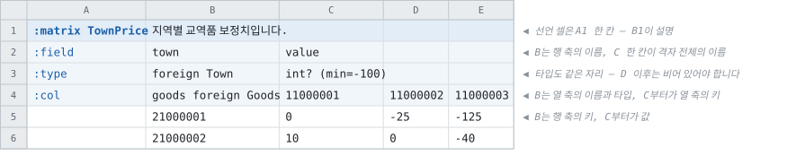
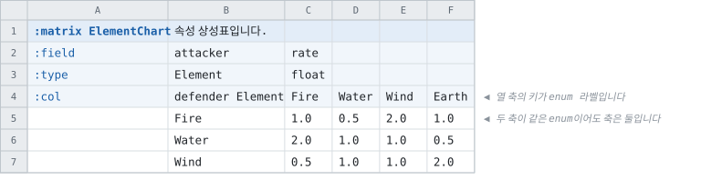

# 매트릭스 선언 — 시트 표기

> [문서 목록으로](../../doc/readme.md)
>
> 그림은 [`primary-layout-figures.py`](primary-layout-figures.py)가 생성합니다 — 예시를 고치면
> 그 파일을 고치고 다시 실행합니다.
>
> 상태: **구현되었습니다.** 주 레이아웃의 파서와 7개 언어의 표면까지이고, 남은 언어는
> 9절에 있습니다. 도입 근거는 [행렬 선언 — 1급 엔티티 검토](../types/matrix-entity.md)입니다.

[주 레이아웃](primary-layout.md)에 다섯 번째 선언 셀 `:matrix`를 두는 표기입니다.

---

## 1. 이 표기가 푸는 문제

지금 격자를 읽는 방법은 [매트릭스 표](matrix-tables.md)의 판독 규칙 하나입니다 — **「이름이
정수인 컬럼이 하나라도 있을 때」**. 격자를 격자로 알아보는 단서가 컬럼 이름의 생김새뿐이므로
따라오는 제약이 둘입니다.

|제약|이 표기에서|
|--|--|
|두 번째 축의 키가 **정수여야** 합니다|축의 타입이 받는 것 전부입니다 — 문자열 · enum 라벨 · 참조|
|격자인지를 **추론**합니다|선언 셀이 말합니다. 추론이 없습니다|

## 2. 형태



**선언 셀은 A1 한 칸입니다.** `:matrix TownPrice` 가 그 한 칸의 내용이고, 오른쪽 B1이 설명입니다 —
`:table` · `:enum` · `:const` 와 같은 규칙입니다.

|셀|무엇|
|--|--|
|**A1**|**선언 셀 하나** — `:matrix <이름>(<메타>)`|
|**B1**|엔티티 설명. 비우면 설명 없음입니다|
|A2 · A3 · A4|행 키 — `:field` · `:type` · `:col`|
|B2 · B3|**행 축**의 이름과 타입|
|C2 · C3|**격자**의 이름과 타입. C칸 하나가 격자 전체의 것입니다|
|B4|**열 축**의 이름과 타입|
|C4부터|**열 축의 키**|
|B5부터|**행 축의 키**|
|C5부터|**값**|

**새로 배우는 것은 `:col` 행 하나입니다.** 나머지는 테이블에서 쓰던 것과 같습니다.

- **A열이 마커 열**입니다. 선언 셀의 열이 마커 열이 되는 규칙은
  [주 레이아웃의 구조](primary-layout/structure.md)와 같습니다.
- **B열이 행 축의 키 컬럼**입니다. `:field` · `:type`의 B칸은 그 컬럼의 이름과 타입이고,
  **테이블에서와 완전히 같은 뜻**입니다.
- **C열부터 끝까지가 격자**이고, 한 그룹입니다. 그래서 `:field` · `:type`의 **C칸 하나**가
  격자 전체의 이름과 타입입니다 — 그룹의 타입을 첫 컬럼에만 적는 것은
  [§4.3](primary-layout/rows.md)의 규칙 그대로입니다. D 이후에 값이 있으면 오류입니다.
- **`:col` 행이 열 축**입니다. B칸이 그 축의 이름과 타입, C칸부터가 그 축의 키입니다.

헤더 행이 최소 3개이고, **테이블의 최소와 같은 수**입니다.

### 2.1 `:col` 행의 B칸

이름과 타입 표현을 한 칸에 적습니다 — `goods foreign Goods`.

열 축에는 자기 컬럼이 없으므로 이름과 타입을 걸어 둘 자리가 `:field` · `:type` 행에 없습니다.
순서는 STRUCT DSL의 `field itemId foreign Item`과 같고, **새 기호가 없습니다.**

|적는 것|뜻|
|--|--|
|`goods foreign Goods`|이름 `goods`, 타입은 `Goods`로의 참조|
|`defender Element`|이름 `defender`, 타입은 enum `Element`|
|`slot int`|이름 `slot`, 타입 `int`|

### 2.2 받는 행 키

|행 키|B 칸|C 칸|D 이후|생략|
|--|--|--|--|--|
|`:field`|행 축의 이름|격자의 이름|**비어야 합니다**|불가|
|`:type`|행 축의 타입 표현|격자의 타입 표현|**비어야 합니다**|불가|
|`:col`|열 축의 이름 + 타입 표현|**열 축의 키**|열 축의 키|불가|
|`:desc`|행 축의 설명|격자의 설명|비어야 합니다|가능|

타입 표현과 괄호 메타는 [§4의 규칙](primary-layout/rows.md)을 그대로 씁니다. 이 표기가 타입
문법을 따로 정의하지 않습니다.

### 2.3 받지 않는 것

|무엇|왜|
|--|--|
|`:variant`|필드 변형은 필드가 여럿일 때의 것입니다|
|`:target`|**칸마다** 대상을 가를 수 없습니다. 엔티티 단위는 선언 셀의 `side=`로 받습니다|
|선언 셀의 `key=`|**행 축이 키**입니다. 지정할 자리가 없습니다|
|`@N` 와이어 태그와 묘비(`#이름@N`)|**축은 스키마가 아니라 데이터입니다.** 3절|
|설명 컬럼|`CombatFaction`처럼 격자에 `name` 컬럼이 붙은 표는 이 선언이 아니라 [매트릭스 표](matrix-tables.md)의 판독 대상입니다. 5절|

### 2.4 마커와 메모

|칸|뜻|
|--|--|
|데이터 행의 A칸에 `#`|그 **행 축 키 하나**를 변환에서 제외합니다|
|`:col` 행에 `#` 하나만 적힌 컬럼|메모 컬럼입니다. 격자에 들어가지 않습니다|
|`:col` 칸이 빈 컬럼|격자에 들어가지 않습니다. **그 아래에 값이 있으면 오류**이고, 키라면 값을 메모라면 `#`를 안내합니다 — 이름 없는 컬럼 아래의 데이터를 테이블이 거절하는 것과 같은 규칙입니다|

### 2.5 복사해서 시작하는 뼈대

칸 하나가 셀 하나입니다.

|A|B|C|D|E|
|--|--|--|--|--|
|`:matrix <이름>`|`<설명>`||||
|`:field`|`<행축이름>`|`<격자이름>`|||
|`:type`|`<행축타입>`|`<격자타입>`|||
|`:col`|`<열축이름> <열축타입>`|`<키1>`|`<키2>`|`<키3>`|
||`<행키1>`|`<값>`|`<값>`|`<값>`|
||`<행키2>`|`<값>`|`<값>`|`<값>`|

## 3. 축이 스키마가 아니라는 것

**컬럼을 하나 더하는 것은 데이터 변경입니다.** 키가 `:col` 행에 실려 나가므로, 생성된 코드에
열의 개수도 열의 이름도 남지 않습니다.

[v107](../wire/tcb-v107-dynamic-arrays.md)이 고정 길이 배열 kind를 형식에서 지운 이유가
그것이었습니다 — 길이가 생성 코드에 상수로 남으면 컬럼 추가가 코드 배포가 됩니다. 이 표기는
**같은 결론을 표기 쪽에서 지킵니다.**

그래서 이 선언에는 `@N`도 묘비도 없습니다. 둘 다 「이름을 데이터로 바꾼다」는 같은 문제를
컬럼 스키마 쪽에서 푸는 장치인데, 여기서는 컬럼 이름이라는 것이 애초에 없습니다.

## 4. 축의 타입이 정수가 아닐 때

이 표기가 새로 되게 하는 것입니다.



두 축이 같은 enum이고, 키 칸에 라벨을 그대로 적습니다. 지금의 판독 규칙으로는 적을 수
없습니다 — `Fire`는 정수가 아니므로 격자로 읽히지 않고, 필드 이름으로 읽혀 값 컬럼이 됩니다.

**두 축이 같은 타입이어도 축은 둘입니다.** 대칭 격자에서 아래 삼각형만 비우는 표기는
`symmetric` 메타로 예약만 하고 지금은 넣지 않습니다 — 빈 칸이 「없음」과 「반대편에 있음」
둘을 겸하게 되므로, [빈 칸과 없음](../types/blank-and-null-cells.md)이 나눈 것을 다시 붙이는
표기가 됩니다.

## 5. 격자를 이 선언으로 적지 않는 경우

|시트|왜|무엇으로|
|--|--|--|
|격자 옆에 설명 컬럼이 있습니다|`name`은 축이 아니라 그 행의 설명입니다|테이블 + [매트릭스 표](matrix-tables.md)의 판독|
|컬럼마다 타입이 다릅니다|한 격자의 칸은 타입 하나입니다|테이블|
|칸이 대부분 비어 있습니다|성긴 격자는 좌표를 값보다 많이 저장합니다|복합 키 테이블|
|열이 16,384개를 넘습니다|엑셀의 컬럼 상한입니다|두 축을 바꿔 적습니다 — 이 표기에 방향 옵션을 두지 않는 이유입니다|

**두 표기는 함께 있습니다.** 선언 셀은 격자를 **적으려는** 사람의 것이고, 판독 규칙은 이미
격자로 적혀 있는 시트를 **받는** 쪽의 것입니다.

## 6. 행 벌

[행 벌](table-row-sets.md)이 있는 격자는 **축의 키로 접습니다.**

|무엇|이 표기에서|지금|
|--|--|--|
|벌의 행을 원본에 맞추기|행 축의 키로 맞습니다|같습니다|
|벌의 열을 원본에 맞추기|**열 축의 키로 맞습니다**|위치로 맞고, 그래서 코어에 「맞출 때 쓰는 이름」이 하나 들어가 있습니다|
|벌에 없는 칸|격자의 타입이 옵셔널이면 「값 없음」입니다|같습니다|

코어의 우회 하나가 없어지는 자리이고, [검토서 5절](../types/matrix-entity.md)이 세는 이득
가운데 하나입니다.

## 7. 다른 레이아웃

|레이아웃|이 선언|
|--|--|
|주 레이아웃|이 문서입니다|
|이름 기반|선언 셀이 없습니다. 정의된 이름 하나가 격자 사각형이므로, **이름 접두어**로 종류를 말하는 지금 방식에 `matrix_`가 더해집니다|
|시트당 테이블|**미정.** 시트 한 장이 격자 한 장이라는 대응은 자연스럽지만, 축의 타입을 적을 자리가 없습니다|

## 8. 생성되는 표면

축의 키에서 자리를 찾는 것이 **생성된 인덱스** 안으로 들어가고, 시트 작성자와 사용하는 쪽
모두 `at`을 보지 않습니다.

```
var rate = Data.ElementChart.At(Element.Fire, Element.Water);   // 1회 조회
var row  = Data.ElementChart.Row(Element.Fire);                 // 그 행 전체
foreach (var key in Data.ElementChart.ColKeys) { … }
```

|이름|무엇|
|--|--|
|`At(rowKey, colKey)`|칸 하나. **던집니다** — 격자의 빈 값은 시트가 적을 수 있는 값이므로, 없는 키를 그것으로 답하면 둘을 가릴 수 없습니다|
|`Row(rowKey)`|한 행. 열 축의 키 순서와 같은 순서이고, 행이 없으면 그 언어의 조회 실패 규약을 따릅니다|
|`RowKeys` · `ColKeys`|축의 키 목록. **데이터에서 옵니다**|
|`HasAt(rowKey, colKey)`|**칸이 옵셔널일 때만** 나옵니다. 빈 칸과 0을 가르는 유일한 방법입니다|
|`LinkColumnAxis(columns)`|축을 넘겨받는 자리. 액세서가 두 파일을 다 읽은 뒤에 부릅니다|

로드할 때 **`ColKeys`의 개수와 값 배열의 길이가 같은지 검사합니다.** 파일에는 테이블 둘로 남으므로 한쪽만 새것으로 배포될 수 있고, 그때 지금은 다른 칸을 읽으면서 아무것도 보고하지 않습니다. 이 검사가 그것을 그 자리의 오류로 바꿉니다 — [검토서 6.4절](../types/matrix-entity.md).

언어별로 확인할 것은 [검토서 4절](../types/matrix-entity.md)에 적어 두었습니다 — C의 2차원
표면, Lua의 1부터 세는 첨자, Unreal의 중첩 `TArray`입니다.

## 9. 남은 결정

### 9.1 정해진 것

|무엇|정한 것|
|--|--|
|`:field`의 C칸|**필수입니다.** 기본값 `value`를 두지 않습니다 — 이 레이아웃의 모든 컬럼이 자기 이름을 시트에 적고, 기본값은 시트에 보이지 않는 이름이 됩니다|
|컬럼 테이블의 이름|`<선언 이름>Column`. 판독 규칙이 만드는 표와 같은 이름이라, 격자의 축은 어느 표기로 적었든 한 이름으로 찾습니다|
|컬럼 테이블의 두 번째 필드|`At`|
|축의 키가 참조일 때|다른 참조와 같습니다 — 대상 테이블에 없는 키는 그 셀을 가리켜 보고됩니다|

### 9.2 남은 것

|무엇|선택지|
|--|--|
|나머지 언어|C# · TypeScript · Python · Go · Java · Kotlin · Dart가 되어 있습니다. 남은 것은 PHP · Ruby · Lua · Rust · Swift · C++ · Unreal · C 와 HTML 문서이고, 뷰 하나와 템플릿 블록 하나를 더하는 같은 일입니다|
|`symmetric`|4절에서 예약만 하였습니다|
|HTML 문서의 표시|격자를 격자로 그릴 것인지, 테이블과 같은 목록으로 둘 것인지|
|이름 기반 레이아웃의 `matrix_` 접두어|7절에 적어 두었고 구현은 없습니다|
