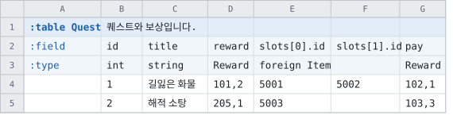
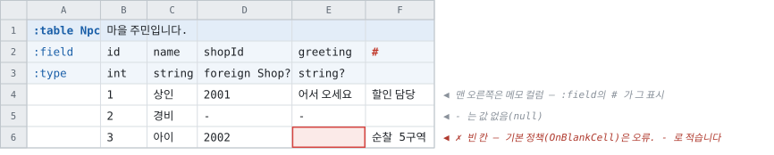
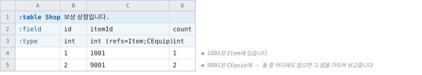
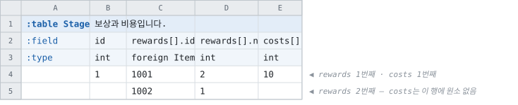
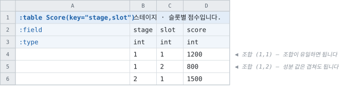

# 엔티티별 레이아웃

> [「주 시트 레이아웃」으로 돌아가기](../primary-layout.md)

---

## 8. 엔티티별 최종 레이아웃

시트 작성 문서에 그대로 옮길 수 있는 형태로 적습니다. 모든 엔티티가 같은 뼈대입니다 —
**선언 셀 | 설명 셀**, 그 아래 `:field` 행, 그 아래 데이터.

### 8.1 테이블 — 기본형


- 1행 — 선언과 설명. 3행 — `Grade`는 enum 이름, `string[]`은 셀 배열입니다.
- 2행 — `@N` 와이어 태그, `*code` 보조 인덱스. 7행 — 마커 열 `#`로 행 제외.

### 8.2 테이블 — struct와 배열의 4가지 표기

DSL에 이렇게 선언되어 있다고 합시다.

```
struct Reward (sep=",")
    field itemId foreign Item
    field count  int (min=1)
```



|표기|컬럼|무엇|
|--|--|--|
|**(가) 인라인 그룹**|`pos.x` `pos.y` `pos.z` — 멤버마다 타입 기재|struct 선언 없이 레코드 하나|
|**(나) DSL struct 그룹**|`reward.itemId` `reward.count` — 첫 컬럼 타입 칸에 `Reward` 하나|반복 기재가 사라집니다|
|**(다) `sep` 한 셀**|`reward` 컬럼 하나, 타입 `Reward`, 셀에 `101,2`|위 예시의 C · G열|
|**원소 번호 칸**|`slots[0].id` `slots[1].id` — 타입은 원소 0에만|칸의 수가 정해진 배열|

### 8.3 테이블 — 멀티 로우


- 5행(연장 행)의 `title` 칸에 값을 적으면 그 셀을 가리켜 오류입니다(§6.1 규칙 3).
- 7행 — 연장 행의 `#`는 그 원소만 제외합니다. 6행에 붙었다면 레코드 2 전체가 빠집니다.
- DSL struct를 쓰면 D열 타입 칸에 `Reward` 하나만 적고 E열은 비웁니다(§4.3).

### 8.4 enum


- `:type` 행이 없습니다 — 컬럼의 뜻이 이름으로 정해져 있습니다. `label`과 `value`는
  필수, `alias`와 `desc`는 생략할 수 있는 컬럼이고 순서는 자유입니다.
- `alias`는 데이터 셀에 적을 수 있는 네 번째 표기입니다(선언 표기 · Pascal 표기 · 숫자 ·
  별칭) — [행 키 레이아웃 §4.1](../../../notes/keyed-layout-superseded.md)의 표시명 분석과 DSL의 `(alias=)`가 같은
  자리이고, 별칭을 바꾸면 그 표기로 적힌 데이터 셀이 함께 바뀌어야 한다는 주의도 그대로
  물려받습니다.
- 0번 라벨이 없으면 `None = 0`이 자동 삽입되는 것도 기존과 같습니다.

### 8.5 상수셋


- `name` · `type` · `value` 필수, `desc` 생략 가능. **`type` 칸도 §4의 접힌 타입
  표현**이므로 6행처럼 enum 이름을 바로 적습니다 — 기존의 (타입 `enum` + 디테일) 5컬럼
  구조가 4컬럼이 됩니다.
- 상수는 코드로 나가고 데이터 파일에는 실리지 않는다는
  [기존 주의](../../../doc/sheets/layout.md#적을-수-있는-엔티티)가 그대로 적용됩니다.
- **배열도 됩니다** — 스칼라 타입들과 **enum**(`Grade[]`)입니다. 상수가 파일에 실리지
  않으므로 여기에 와이어 질문은 없고, 필요한 것은 **그 언어가 상수 자리에서 받아들이는 목록
  표현** 하나입니다. 원소의 표기는 스칼라의 것과 같고 감싸는 방식만 언어마다 갈립니다.
- **대괄호는 컬럼과 같은 순서로 떼어집니다** — 먼저 `[]`를 떼고 남은 이름을 접힌 표현으로
  보고, 그다음에 배열로 감쌉니다. `Grade[]`가 한동안 되지 않았던 것은 상수 경로가 그 순서를
  갖지 않아서 표현 전체를 enum 조회에 넣었기 때문이고, 표기의 문제가 아니었습니다.

|언어|타입|리터럴|
|--|--|--|
|C# · Java|`T[]`|`new T[] { … }`|
|C++|`std::vector<T>`|`{ … }`|
|Go|`[]T`|`[]T{ … }`|
|Rust|**`&'static [T]`**|`&[ … ]` — `const`는 `Vec`이 될 수 없습니다. 그것은 할당이고, 상수는 컴파일러가 끼워 넣는 값입니다|
|Kotlin|**`List<T>`**|`listOf( … )` — 컬럼 멤버의 `MutableList`가 아닙니다. 더할 수 없는 상수는 타입으로 그렇게 말합니다|
|Swift · TypeScript|`[T]` · `T[]`|`[ … ]`|
|Dart|`List<T>`|`<T>[ … ]` — `const` 리터럴이 아닙니다. `const`는 원소 전부가 상수식이어야 하고 `bigint` 원소는 `BigInt.parse(…)`, 즉 호출입니다|
|Python · PHP · Lua · Ruby|(타입 없음)|`[ … ]` · `[ … ]` · `{ … }` · `[ … ].freeze`|
|(enum 원소)|그 enum|**어느 언어도 숫자로 캐스팅하지 않습니다** — 라벨을 이름으로 적으므로 상수 파일이 enum에 의존하게 되고, 그 의존을 타입 그래프가 말하지 않으면 크레이트가 안 섭니다. 적합성 코퍼스의 `Limits`가 그 자리를 지키는 이유입니다|
|C|`const T 이름[]` + `이름_COUNT`|`{ … }` — **이 언어만 표기의 자리가 없습니다.** 배열의 괄호가 이름 뒤에 오고, 길이를 담을 자리가 타입에 없습니다|
|Unreal|`TArray<T>`|`{ … }` — **리플렉션에 올리지 않습니다.** 상수는 생성 코드가 넘겨주는 값이지 편집기에서 고치는 행이 아니고, `UCLASS`의 게터를 두면 집합마다 표면이 둘이 됩니다. `FGuid`는 텍스트 생성자가 없으므로 **리더가 와이어 바이트를 접는 그 네 낱말**로 적습니다 — 상수와 컬럼이 같은 uuid를 같은 값으로 갖는 것이 구성으로 보장됩니다|

- **빈 배열 상수는 쓸 수 없습니다** — 값 칸이 비면 상수 자체가 거부됩니다(그 규칙이
  배열보다 앞섭니다).

### 8.6 표기 사례 모음

기본형 하나로는 드러나지 않는 조합들입니다. 작성 문서의 「이런 것도 됩니다」 절의
씨앗입니다.

#### 8.6.1 배열의 세 자리 — 셀 · 칸 · 행


- 한 테이블 안에서 셋을 섞어도 됩니다. `[]` 컬럼이 있으므로 이 표는 멀티 로우 모드이고,
  `costs` · `slots`는 레코드의 첫 행에만 적습니다.
- 셋의 와이어는 같습니다(§5.1). 고르는 기준은 데이터의 성격입니다 — 짧은 목록은 셀,
  칸의 수가 정해진 것은 `[n]`, 길이가 크게 다른 것은 행.

#### 8.6.2 옵셔널과 값 없음, 메모 컬럼



- `?` 컬럼의 「값 없음」은 `-`로 적습니다. **빈 칸은 값 없음이 아니고**, 기본
  정책(`OnBlankCell: Error`)에서는 오류입니다 — 6행의 붉은 칸이 그 사례입니다.
- F열은 `:field`에 `#`를 적은 메모 컬럼입니다 — 시트 작성자의 공간이라는 표시이고, 무엇을
  적어도 모델에 없습니다. 표시 없이 `:field`가 빈 컬럼에 값을 적으면 오류입니다(§3.3).

#### 8.6.3 인라인 그룹 · 합성 값 타입 · 중첩


- `pos.x` · `pos.y` · `pos.z` 컬럼 셋과 `home`의 `vec3f` 한 칸은 같은 형태의
  레코드입니다([합성 값 타입](../../types/composite-value-types.md)).
- `waypoints[].x`처럼 struct 선언 없는 인라인 그룹도 멀티 로우가 됩니다.

#### 8.6.4 여러 테이블 중 하나여도 되는 값



- **검사입니다.** 컬럼은 타입을 그대로 지키고, 값이 목록의 어느 테이블에도 없으면 그 셀을
  가리켜 보고합니다. 어느 쪽에서 왔는지는 묻지 않으므로 **대상끼리 id가 겹쳐도 됩니다** —
  고를 일이 없기 때문입니다 ([시트 작성](../../../doc/sheets/types.md#여러-테이블-중-하나여도-되는-값--refs)).
- **행에 닿지는 않습니다.** 행이 필요하면 테이블마다 컬럼을 두고 각각 `foreign`으로 적습니다
  ([참조가 내는 이름 §6](../../references/reference-surface-naming.md)).
- 행마다 **형태**가 달라야 한다면 이것이 아니라 다형(§7.1)의 자리입니다.

#### 8.6.5 나란한 멀티 로우 그룹 — 독립 축적



- `rewards[]`와 `costs[]`는 각자 쌓입니다(§6.1 규칙 5). 5행에서 `costs`가 비어 있으므로
  rewards는 2개, costs는 1개입니다 — **같은 행이 짝을 뜻하지 않습니다.**
- 원소끼리 짝이 필요한 데이터는 한 struct의 멤버로 묶습니다(`pair[].reward` ·
  `pair[].cost`).

#### 8.6.6 복합 키



- `key="stage,slot"` 선언으로 두 컬럼의 **조합**이 키가 됩니다(§3.5). 조회는
  `FindByKey(stage, slot)` 형태의 다인자입니다.
- 키를 여러 개 두려면 세미콜론입니다 — `key="stage,slot; slot,code"`. SQL처럼 첫 키가
  PRIMARY KEY, 나머지가 UNIQUE 키에 대응합니다.
- Luban의 `index=a,b`(독립 키 2개)와 뜻이 다릅니다 — 독립 단일 키는 `*` 보조 인덱스로
  적습니다(§12의 12).

#### 8.6.7 필드 변형 — `:variant`


- `price` 컬럼이 3벌이고, `:variant` 행이 구분합니다 — 빈 칸이 기본, `kr` · `jp`가 변형
  이름입니다. 빌드가 recipe의 `Variants`로 하나를 고르고, 나머지 컬럼은 그 빌드에
  없습니다(§3.6).
- `:type` 등 헤더 기재는 기본 변형 컬럼에만 적습니다 — 반복 기재는 일치 검사입니다.

### 8.7 오류가 되는 표기

붉은 칸이 오류입니다. 각 칸이 §15 게이트 4의 오류 픽스처가 되고, 메시지는 표의 안내를
담아야 합니다.

#### 8.7.1 멀티 로우에서 잘못 적기 쉬운 2가지


- 5행 — 연장 행의 스칼라 칸에 값. 「이 값은 레코드의 첫 행에 적습니다」를 그 셀 위치와
  함께 보고합니다(§6.1 규칙 3).
- 6행 — 연장하려던 행에 인덱스를 적으면 새 레코드가 되고, 비어 있는 `title`을 기본
  정책이 검출합니다(§6.2).

#### 8.7.2 헤더에서 잘못 적기 쉬운 3가지


- C열 `slots[1].id` — `[0]` 없이 `[1]`부터 시작했습니다. 원소 번호는 0부터
  연속입니다(§5).
- D열 `*drops[].id` — 배열 컬럼은 보조 인덱스가 될 수 없습니다. Luban의 멀티 로우
  `*` 습관과도 겹치는 자리이므로 메시지가 두 가지를 함께 안내합니다(§2).
- E열 `text(Common)` — 옛 표기입니다. 첫 `(`부터는 메타이므로 `string (text=Common)`으로
  적습니다(§4.2).

---

## 9. 계승 — 바뀌지 않는 것

**데이터 칸의 규칙은 전부 무변경입니다.** 이 레이아웃이 바꾸는 것은 헤더의 표기뿐입니다.

|영역|그대로인 것|
|--|--|
|값 파싱|[파싱 규칙](../../../doc/sheets/layout.md#값을-읽는-규칙) 전부 — bool 어휘 · 진법 리터럴 · InvariantCulture · TimeZone|
|빈 칸과 없음|`-` · `\-` · `OnBlankCell` — [설계](../../types/blank-and-null-cells.md)|
|배열|셀 구분자(`ArrayDelimiter`) · `TrimTrailingArrayElements` · `AllowArrayGaps`|
|합성 값 타입|`vec3f` · `quat` · `color` 계열의 셀 표기 전부|
|옵셔널|`?`의 4형태와 presence 비트맵|
|참조|`foreign`의 해석 · `refs=`의 검사 · 키 타입 규칙|
|와이어 태그|`@N`의 규칙 전부 — 전부 또는 전무 · Tombstone · 재사용 금지|
|이름|Pascal 정규화 · `Naming` 규약 · 예약어 회피|
|target-side|모델의 3값(`ClientOnly` · `ServerOnly` · `Both`). 표기만 쉼표 목록이 정본이 되고 `cs`는 별칭입니다(§3.4)|
|제외|워크북 · 시트 · 엔티티 · 필드 · 행의 `#`|

다른 레이아웃들은 각자의 파서로 그대로 유효합니다. 기존 `tabbit` 레이아웃은
**개발 기간에만 병존합니다** — 게이트 1의 대조군이고, 교체 단계(§16의 6)에서 파서가
삭제되며 이 레이아웃이 id `tabbit`을 승계합니다. 이 레이아웃은 `[TabbitLayout]`
어트리뷰트를 단 파서 파일 하나로 추가되고, **그 파일을 지우면 흔적이 남지 않아야
합니다** — 코어 규칙 그대로입니다.

---
