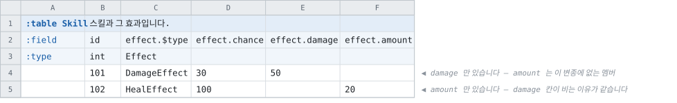

# 다형과 참조 배열

> [문서 목록으로](../doc/readme.md)
>
> 상태: **4단계까지 구현 완료** (2026-08-25) — `$type` 표기 · 모델 · 결합 · 검증 · 판별자
> 정렬, 그리고 **13개 언어의 생성 표면**. 5단계(다형 배열)와 6단계(변종의 묘비)가 남았습니다.
> 형식은 움직이지 않았습니다 — 기존 골든이 한 파일도 안 바뀌었습니다.
>
> **참조 쪽은 되돌렸습니다 — [참조가 내는 이름](reference-surface-naming.md) §6.**
> 참조의 다중 대상은 **선택지 목록**이지 상속이 아니고, 공통 분모가 없어 돌려줄 타입이
> 없습니다. `foreign`의 대상은 테이블 하나이고, 여러 테이블 중 하나여도 되는 값은
> 검사(`refs=A;B`)입니다. 그래서 §3의 다형 참조와 테이블의 `extends=`, §4의
> `foreign A\|B[]`, §11의 2 · 2′ · 3′이 없어졌습니다 — **「아직 거부」가 아니라 표기 자체가
> 없습니다.**
>
> **대상이 하나인 참조 배열(`foreign X[]`)은 그대로 됩니다** — §11의 3이고, 골든 시나리오
> `array-foreign`이 그것입니다. 없어진 것은 원소마다 대상이 갈리는 쪽뿐입니다.
>
> **struct 다형성(§5 · §6)은 그대로 섭니다** — 값 임베딩이고, 거기서는 상속이 실제로
> 있습니다. `abstract struct`도 그쪽 것으로 남습니다.
>
> 상태: **1~3단계 구현됨**, 그리고 **4단계의 착수 조건인 와이어 측정이 끝났습니다**(§6.1) —
> 형식 개정은 필요 없고, 비용에 크게 작용하는 것은 변종의 개수가 아니라 행의 순서였습니다 —
> 그래서 다형 그룹을 가진 테이블은 **판별자로 정렬합니다**(§6.3).
> `$type`은 예약 컬럼으로만 있습니다 ([주 레이아웃 §7](primary-layout.md))

「행마다 형태가 다른 데이터」를 적는 방법이 이 도구에 하나뿐입니다 — [다중 대상
참조](multi-target-accessors.md)이고, 그것은 **키 하나가 어느 카탈로그의 행인가**에만
답합니다. 여기서 정하는 것은 나머지 둘입니다: 그 카탈로그들이 **공통 표면을 공유한다**고
선언하는 자리와, 레코드 자체의 **필드 구성이 행마다 다른** 경우입니다.

---

## 1. 세 가지 질문 — 표기가 갈라야 하는 것

겉모습이 비슷하므로 먼저 표로 고정합니다. [주 레이아웃 §7.1](primary-layout.md)이 앞의 둘을
갈라 두었고, 이 문서가 가운데 하나를 더합니다.

|  |묻는 것|공통 표면|판별자|
|--|--|--|--|
|**다중 대상 참조** `foreign A\|B`|이 키 값이 **어느 테이블**의 행인가|없습니다. A와 B는 서로 무관한 카탈로그입니다|선언마다 enum 하나|
|**다형 참조** `foreign Reward`|이 키 값이 **한 추상 타입의 어느 변종**인가|**있습니다** — 추상 타입이 선언한 필드|**추상 타입마다** enum 하나|
|**다형 레코드** `$type`|이 **레코드 자체**가 어떤 형태인가|기반 struct의 필드|변종 타입. 판별자 타입은 두지 않습니다(7.1)|

앞의 둘은 **와이어가 같습니다** — 키 하나이고, 어느 변종인지는 링킹이 대상들의 인덱스를
조회해 산출합니다([다중 대상 접근자 §7](multi-target-accessors.md)). 분기하는 것은 **선언과
생성 표면**이고, 그래서 다형 참조는 비용이 작습니다. 세 번째만 값이 그 행에 실립니다.

## 2. 지금 서 있는 자리

|무엇|상태|
|--|--|
|~~`foreign A\|B` — 검사 · 승격 · 대상별 접근자~~|**되돌렸습니다.** 검사만 남고 표기는 `refs=`입니다 ([참조가 내는 이름 §6](reference-surface-naming.md))|
|연번 컬럼을 접은 다중 대상 배열|**됨.** `RewardFixed`가 대상 16개 × 원소 20개입니다|
|`foreign X[]` — 셀 안의 참조 배열|**됨**(§11의 3). 원소마다 행 하나로 해석됩니다. `foreign`의 대상이 테이블 하나이므로 원소마다 대상이 갈리는 형태는 **표기가 없습니다**|
|`abstract` · `extends` · 변종의 `@N`|**됨**(§11의 1). 문법 · 변종 집합 · 판별자 번호와 그 거절 9가지. **소비하는 표기는 아직 없습니다** — 유일했던 `foreign Reward`가 되돌아갔고, `$type`은 4단계입니다|
|`$type` · `$key` · `$value`|**예약 컬럼.** 이름만 인식하고 「아직 지원하지 않음」으로 거부합니다|

**막고 있던 것은 와이어 설계의 성립 여부**였습니다([DSL 설계 §8](../notes/struct-dsl-design.md)).
6절이 그것을 정합니다.

## 3. 다형 참조 — 대상 집합에 이름을 부여

`abstract struct`가 **변종들의 공통 표면과 그 집합의 이름**을 선언합니다.

```
abstract struct Reward
    field name  string
    field icon  string (asset=icon)
```

변종은 **테이블 쪽이 선언합니다.** 선언 셀의 메타 키이고, `key` · `side`와 같은 자리입니다
([주 레이아웃 §3.4](primary-layout.md)).

```
Item    (extends=Reward)
CEquip  (extends=Reward)
Ship    (extends=Reward)
```

- **변종 테이블은 추상 타입의 필드를 갖춰야 합니다.** 이름과 타입이 같은 컬럼이 없으면
  거부하고 그 테이블을 가리킵니다. 이 계약이 공통 표면의 근거입니다.
- **필드가 없는 `abstract struct`도 성립합니다.** 그러면 남는 것은 이름과 변종 목록이고,
  공개 표면은 판별자뿐입니다 — 그래도 아래의 「목록의 소유자」가 이동합니다.
- 한 테이블은 **추상 타입 하나**의 변종입니다. 여럿을 받는 것은 10절.

### 목록의 소유자 이동

[다중 대상 접근자 §5](multi-target-accessors.md)가 남긴 자리입니다 — 「목록이 같은 선언들을
하나로 합치지 않습니다. 합치려면 그 목록의 이름을 이 도구가 지어야 하고 그것은 시트에 적혀
있지 않은 것입니다」. **`abstract struct`가 그 이름을 시트 쪽에서 공급합니다.**

|  |`foreign A\|B\|…`|`foreign Reward`|
|--|--|--|
|목록이 기재되는 곳|**선언마다.** 대상 16개인 목록이 4곳에서 되풀이됩니다|**변종 테이블마다 한 번.** 그 컬럼들은 이름 하나만 기재합니다|
|카탈로그를 추가할 때|그 목록을 기재한 선언 전부|**새 시트에 `extends=Reward`** 하나|
|판별 enum|선언마다 하나 — `ShopItemIdTarget`|추상 타입마다 하나 — `RewardTarget`|

## 4. 참조 배열 — 두 해석의 표기

> **이 절이 가른 둘은 이제 하나입니다.** `foreign`의 대상이 테이블 하나이므로 (가)의 세로줄
> 목록도 (나)의 집합 이름도 없습니다. 남은 것은 **대상 하나짜리 참조 배열**이고, 그것이
> §11의 3으로 구현되어 있습니다. 아래는 그 거절을 풀 때의 근거이며, 그 근거는 유효합니다 —
> 없어진 것은 원소마다 대상이 갈리는 쪽입니다.
> [참조가 내는 이름 §6](reference-surface-naming.md)

참조가 배열일 때 뜻이 둘이고, **표기가 그 둘을 가릅니다.**

```
field rewards  foreign Item|CEquip[]     (가) 원소마다 대상이 각각
field rewards  foreign Reward[]          (나) 다형 배열
```

|  |(가) 다중 대상 배열|(나) 다형 배열|
|--|--|--|
|대상 자리|**세로줄 목록**|**이름 하나** — `abstract struct`|
|원소가 뜻하는 것|서로 무관한 카탈로그의 행. 원소마다 독립적으로 판별합니다|한 추상 타입의 값|
|공개 표면|원소마다 판별자 + 변종별 접근자|**추상 타입 하나로 원소를 읽습니다.** 변종별 접근자도 그대로 있습니다|
|변종 테이블의 계약|없습니다|**컬럼 계약**(3절)|
|와이어|키 배열|**같습니다** — 키 배열|

**같은 데이터를 두 표기로 기재할 수 있습니다.** 그것이 이 절의 목적이고, 선택 기준은
「원소들을 **하나의 타입으로** 다룰 일이 있는가」입니다. 보상 목록을 훑으며 아이콘과 이름을
표시하는 코드가 있으면 (나)이고, 원소마다 다른 처리를 하는 코드뿐이면 (가)입니다.

### 셀 배열 거절의 해제

[`foreign X[]`의 거절](../src/Cooking/Layouts/TabbitLayoutParser.cs#L1679)은 「생성 리더에
담을 형태가 없다」였고, **그 형태는 그 뒤에 정해졌습니다** — [다중 대상 접근자
§3](multi-target-accessors.md)의 「키 · 대상 무관 슬롯 하나 · 식별자」입니다. 원소마다 그
셋을 배치하면 됩니다.

- **저장은 원소마다 슬롯 하나입니다.** 대상마다 슬롯을 두는 것은 그 문서가 측정하고
  채택하지 않은 안입니다 — `RewardFixed`에서 64MB 대 8MB였습니다.
- **공개 표면은 원소 첨자를 받는 접근자입니다.** 언어별 형태는 [레코드 안의
  참조](references-in-records.md)가 언어를 통일하지 않기로 한 것과 같은 자리이고, 구현
  단계에서 각 생성기의 기존 형태로 확정합니다.
- 참조 배열이 도달하는 경로는 셋입니다 — 셀 배열 · 연번 컬럼 · 멀티 로우. **연번 컬럼은
  이미 됩니다**(2절). 이 항목이 여는 것은 나머지 둘이고, 세 경로가 모델에서 같은 것이
  됩니다.

### 로드맵의 「하지 않기로 함」과의 관계

`foreign[]`은 [로드맵](../doc/roadmap.md)에 **하지 않기로 함**으로 기재되어 있습니다.
기재된 근거는 「로우마다 개수가 다른 참조를 해석하려면 생성되는 테이블 리더가 로드 후
연결 단계에서 길이가 다른 배열을 다뤄야 하는데, 지원 언어들에 그런 형태가 없습니다」
였습니다.

**그 근거의 두 전제가 그 뒤에 변경되었습니다.**

|당시의 전제|현재|
|--|--|
|배열의 길이가 디스크립터에 한 번 기록됨|**[v107](tcb-v107-dynamic-arrays.md)이 kind를 하나로 정리하였습니다.** 모든 배열이 로우마다 자기 길이를 싣습니다|
|원소마다 해석된 행을 두는 형태가 없음|**[레코드 안의 참조](references-in-records.md)가 그 형태를 세웠습니다.** 원소마다 키 · 해석 플래그 · 행을 나란히 배치하고, 모든 언어에 구현되어 있습니다|

**남는 것은 길이의 출처 하나입니다.** 지금 생성되는 슬롯 배열은 **컬럼 개수로 크기가
고정**됩니다 — C#이라면 `new T[{멤버 컬럼 수}]`이고, 그것이 연번 컬럼에서 성립하는 이유는
개수가 선언에 있기 때문입니다. 셀 배열에서는 그 크기가 **그 로우의 키 배열 길이**가
되어야 하고, 그 값은 로드 시점에 있습니다.

즉 언어마다 필요한 것은 **상수 대신 로드 시점의 길이로 할당하는 것**이고, 형태가 없어서
막혀 있던 것이 아닙니다. 그래도 **모든 언어를 대상으로 하는 작업**이므로 3번 단계의
비용은 그 크기로 산정합니다.

## 5. 다형 레코드 — 값 임베딩

변종의 필드가 그 행의 컬럼으로 전개되는 방식입니다. 참조와 달리 **id를 부여하지 않습니다.**

```
abstract struct Effect
    field chance int (min=0, max=100)

struct DamageEffect extends Effect @1
    field damage int

struct HealEffect extends Effect @2
    field amount int
```

### 5.1 확정하는 세 가지

[DSL 설계 §8](../notes/struct-dsl-design.md)이 문법 확정과 함께 정해야 한다고 기재한
항목들입니다.

|무엇|결정|근거|
|--|--|--|
|**기반 struct의 필드**|**배치합니다**|기반 필드는 와이어에서 **컬럼 하나이고 모든 행에 present**입니다. 변종마다 복제하면 컬럼이 변종 수만큼 증가하고 그중 하나만 채워집니다. 상속이 없는 언어에서 변종 struct에 복제되는 것은 **생성 코드의 사정**이지 형식의 사정이 아닙니다|
|**판별자 값**|**`@N`.** 생략하면 선언 순서로 부여합니다. 묘비는 `#OldEffect@3` — 5.1.1절|[와이어 태그](../doc/sheets.md#와이어-태그-n)와 같은 문제입니다 — 번호가 선언 순서에 고정되면 변종을 재배열·삭제할 때 배포된 리더가 다른 변종으로 읽습니다|
|**시트 표기**|**예약 컬럼 `$type`**|주 레이아웃 §7이 확보해 둔 자리입니다. 기호가 `:`에서 `$`로 바뀐 근거는 [주 레이아웃 §2](primary-layout.md)에 있습니다 — `:type`이 이미 헤더 행 키라서 겹칩니다|

- **1단만입니다.** 변종은 `abstract`일 수 없습니다. 다단으로 하면 `$type` 셀이 잎 변종을
  기재하는지 중간 층을 기재하는지가 분기하고, 「이 행이 어떤 형태인가」의 답이 둘이 됩니다.
- **한 추상 타입의 변종은 전부 테이블이거나 전부 struct입니다.** 혼용하면 그 필드의 값이
  어떤 때는 키이고 어떤 때는 값이 되어 와이어가 둘로 분기합니다. 혼용된 선언은 거부합니다.

### 5.1.1 판별자 번호 `@N` — 무엇이고 왜 필요한가

```
abstract struct Effect
    field chance int

struct DamageEffect extends Effect @1
    field damage int

struct HealEffect   extends Effect @2
    field amount int
```

**`@1`은 「이 변종의 번호는 1이다」입니다.** 파일에 실리는 판별자 값이 그 번호이고, 그것이
`@N`이 하는 일 전부입니다.

**모양이 낯선 것은 `extends Effect` 뒤에 붙기 때문**이고, 자리가 그런 이유는 **번호가 기반
타입이 아니라 변종의 것**이기 때문입니다. `extends Effect`가 「어느 집합에 속하는가」를 말하고
`@1`이 「그 집합 안에서 몇 번인가」를 말합니다 — 시트에서 `price@3`이 「Price 컬럼의 번호는
3」인 것과 같은 자리이고, 같은 표기를 쓰는 것이 그 때문입니다.

#### 왜 필요한가

**번호를 안 적으면 선언 순서가 번호가 되고, 그러면 선언을 건드릴 때마다 이미 배포된 리더가
다른 변종으로 읽습니다.**

`DamageEffect` · `HealEffect` 두 변종이 순서대로 1 · 2를 받은 상태로 데이터를 배포했다고
합니다. 그 뒤에 `DamageEffect`를 지우면 `HealEffect`가 1이 됩니다. 그런데 배포된 클라이언트가
가진 데이터 파일에는 여전히 `1 = DamageEffect`로 쓰인 행들이 있습니다. **리더는 그 행을
`HealEffect`로 읽고 오류 없이 성공합니다** — 판별자 값이 유효한 범위 안에 있기 때문입니다.
값이 깨지는 것이 아니라 **다른 형태로 해석되는 것**이고, 그것이 검출되지 않는 종류의 사고입니다.

`@N`을 적어 두면 `HealEffect`는 `DamageEffect`가 없어져도 계속 2입니다. **번호가 선언 순서와
무관해지는 것**이 이 표기가 사는 이유입니다.

|같은 문제를 같은 방법으로 푸는 자리|
|--|
|**컬럼** — [와이어 태그 `@N`](../doc/sheets.md#와이어-태그-n). 컬럼의 신원을 위치에서 번호로 옮깁니다|
|**변종** — 이 절. 변종의 신원을 선언 순서에서 번호로 옮깁니다|

#### 규칙

|규칙|내용|
|--|--|
|**전부 또는 전무**|한 추상 타입의 변종은 전부 번호를 달거나 전부 안 답니다. 섞으면 오류입니다 — 절반만 고정된 번호는 나머지 절반이 밀리는 것을 막지 못합니다. **하나라도 번호가 있으면 번호를 쓰는 집합입니다**(첫 변종의 것이 아닙니다 — 그렇게 읽으면 `struct A extends E` · `struct B extends E @1`이 둘 다 1이 되고 조용히 지나갑니다)|
|**1 이상, 집합 안에서 유일**|겹치면 오류입니다. 추상 타입이 다르면 같은 번호를 써도 됩니다 — 판별자는 그 집합 안에서만 뜻이 있습니다|
|**안 달면**|선언 순서대로 1..N입니다. 동작은 같지만 **끝에 추가하는 것만 안전**합니다|
|**다시 쓸 수 없습니다**|한 번 데이터를 실은 번호를 다른 변종에 주면, 위의 사고가 그대로 일어납니다|
|**묘비**|**아직 표기가 없습니다.** 컬럼에는 `#이름@N`이 있는데 변종에는 없어서, 지금은 지운 변종의 번호를 예약할 방법이 **주석뿐**입니다 — 11절의 남은 자리입니다|

**컬럼의 `@N`과 다른 점이 하나 있습니다** — 와이어 태그는 테이블 단위로 전부 또는 전무이고,
변종 번호는 **추상 타입 단위**입니다. 와이어 태그를 안 쓰는 테이블에서도 변종 번호는 쓸 수
있고, 그 반대도 됩니다. 두 번호가 서로를 모르기 때문입니다.

#### 이름 — 「태그」라고 부르지 않습니다

**셋을 갈라 부릅니다.** `@N`이 두 자리에 쓰이고, recipe에 `IncludeTags`·`ExcludeTags`가
들어올 예정이라 「태그」 하나로는 어느 것인지 알 수 없습니다.

|무엇|이 저장소에서 부르는 이름|무엇을 정하는가|
|--|--|--|
|컬럼의 `@N`|**와이어 태그** (`Field.WireTag`)|파일 안에서 그 **컬럼**의 신원|
|변종의 `@N`|**판별자** (`PolymorphicVariant.Discriminator`)|파일 안에서 그 **변종**의 신원|
|recipe의 태그|**포함·제외 태그** (예정)|그 빌드가 무엇을 담는가|

셋은 서로를 모릅니다. 같은 표기(`@N`)를 두 자리에서 쓰는 것은 「번호가 위치를 대신한다」는
같은 문제를 같은 방법으로 풀기 때문이고, 같은 것이기 때문이 아닙니다.

### 5.2 시트 — 컬럼의 합집합



|규칙|
|--|
|**다형 그룹의 첫 컬럼은 `<경로>.$type` 하나입니다.** 그 컬럼의 **타입 행**(`:type` 행) 칸에 추상 타입 이름을 기재합니다. 나머지 멤버 컬럼의 타입 칸은 비어 있습니다 — [struct 그룹 표기](primary-layout.md) 그대로입니다|
|**컬럼의 집합은 모든 변종의 합집합**이고, 그 행의 변종에 없는 컬럼은 비웁니다|
|**같은 이름의 멤버는 컬럼 하나를 공유합니다.** 변종마다 타입이 다르면 그 이름을 가리켜 거부합니다|
|멤버 경로에 변종 이름을 포함하지 않습니다 — 위 항목이 성립하는 근거이고, 시트의 폭을 억제합니다|

**`$`로 시작하는 이름은 경로의 마지막 마디에서 판정합니다.** 경로가 없는 컬럼에서는 주
레이아웃 §7의 규칙과 같은 뜻이고, 다형 그룹이 중첩될 때 어느 그룹의 판별자인지를 나타낼 수
있습니다. `$key`도 같은 확장을 받습니다.

**식별자 검사에 예외가 하나 생깁니다** — 경로의 마지막 마디는 `$`로 시작할 수 있습니다.
그 자리 말고는 어디서도 `$`가 이름에 들어가지 않습니다.

### 5.3 가변 개수 다형 배열

멀티 로우와 결합하면 원소가 되는 행마다 `$type` 셀이 그 원소의 변종을 정합니다.


[STRUCT DSL 검토 §5.2](../notes/struct-dsl-review.md)가 참조 경로로 부족할 것으로 예상한 두
자리 중 첫째가 여기서 성립합니다. 둘째인 「id를 부여할 가치가 없는 종속 데이터」는 5절
전체가 담당합니다.

## 6. 와이어 — 형식 무변경

**이 문서의 핵심입니다.** [Luban 대조 §5.2](../notes/luban-comparison.md)는 다형 레코드에
「형식 개정 1회」를 산정하고 「컬럼 지향 인코딩에서 행마다 컬럼 집합이 달라지는 것을 어떻게
담을지가 가장 어려운 자리」라고 기재하였는데, **그 질문은 presence 비트맵이 이미 정하고
있습니다.**

|다형 레코드가 싣는 것|와이어|
|--|--|
|판별자|enum 컬럼 하나. 멀티 로우면 `KindArray`|
|기반 필드|평범한 컬럼. 모든 행에 present입니다|
|변종 멤버|**옵셔널 컬럼** — [v103](tcb-v103-presence-bitmap.md) 비트 6(로우) · [v106](tcb-v106-element-presence.md) 비트 7(원소)|

v103이 「값은 모든 로우에 대해 기록하고, 없는 로우는 타입의 빈 값을 차지한다」로 배치를
정해 두었으므로, 변종 멤버 컬럼은 대부분이 같은 빈 값입니다.
[v104의 RLE 계열](tcb-v104-composed-encodings.md)이 그것을 압축합니다 — **다만 얼마나
압축하는지는 데이터에 달려 있고, 그것이 아래 실측의 결론입니다.**

**새 kind도, 새 와이어 비트도, 새 블록 배치도 없습니다.** 다형 참조는 키 하나이므로 더욱
그렇습니다 — 식별자조차 파일에 실리지 않고 링킹이 산출합니다.

### 6.1 실측 — 형식의 수용과 행 순서의 비용

**구현 없이 쟀습니다.** 이 절이 제안하는 형태 — 판별자 컬럼, 기반 필드, 그리고 모든 변종
멤버를 옵셔널 컬럼으로 펼친 합집합 — 는 **지금 표기로 그대로 적을 수 있는 시트**입니다.
그래서 실제 인코더가 실제 제안을 상대로 낸 수입니다.

같은 데이터 2,000행, 변종당 멤버 6개입니다. 멤버의 값은 **흩어진 값**입니다 — 근거는 아래
「측정을 한 번 다시 한 이유」에 있습니다.

|형태|`.tcb`|참조 대비|
|--|--|--|
|**참조 경로** — 변종 5개가 각자 카탈로그, 그것을 가리키는 테이블 하나|**24,997 B**|1.00배|
|값 임베딩 5 — **변종별로 행이 묶여 있음**|**36,713 B**|**1.47배**|
|값 임베딩 16 — 변종별로 묶여 있음|42,700 B|1.71배|
|값 임베딩 5 — **행마다 변종이 번갈아 나옴**|**70,155 B**|**2.81배**|
|값 임베딩 16 — 행마다 번갈아|86,566 B|3.46배|

**변종의 개수보다 행의 순서가 크게 작용합니다.** 변종을 5개에서 16개로 넓히면 묶인 쪽이
1.16배가 되는데, 같은 5개를 섞어 놓으면 1.91배가 됩니다.

이유는 v103의 배치입니다. 변종 멤버 컬럼은 **없는 행에도 타입의 빈 값을 싣고**, 그 빈 값이
이어져 있을 때만 런이 됩니다. 인코딩 보고서가 i32 멤버 컬럼 하나에 대해 그 셋을 나란히
적습니다.

|그 컬럼이 있는 곳|고른 인코딩|컬럼 하나|
|--|--|--|
|참조 카탈로그 — 400행, 빈 칸 없음|BITPACK|**854 B**|
|값 임베딩, 변종별로 묶임 — 2,000행 중 400행이 present|DELTA_RLE|**1,486 B**|
|값 임베딩, 행마다 번갈아 — 같은 400행|RLE|**2,619 B**|

묶여 있으면 없는 행 1,600개가 런 몇 개로 접히고, 번갈아 나오면 5행마다 런이 끊깁니다.

### 측정을 한 번 다시 한 이유

**처음 잰 수는 틀렸습니다.** 멤버의 정숫값을 등차수열로 만들었더니, 카탈로그에서는 그것이
완전한 등차라 `DELTA_RLE`가 컬럼 하나를 **4바이트**로 접었고, 같은 값이 다른 변종의 행 사이에
놓인 값 임베딩에서는 등차가 아니었습니다. **두 레이아웃을 서로 다른 데이터로 비교한 것**이고,
참조 쪽이 실제보다 좋게 나왔습니다(참조 10,850B · 번갈아 6.06배).

흩어진 값으로 다시 재면 어느 쪽도 그 런을 얻지 못합니다. 방향은 그대로이고 배수가 줄었습니다 —
행 순서가 **4.4배가 아니라 1.9배**입니다.

### 6.2 이 실측이 4단계에 남기는 것

|무엇|결론|
|--|--|
|**형식 개정**|**필요 없습니다.** 위 넷은 전부 지금 인코더가 쓴 평범한 `.tcb`입니다|
|**변종의 폭**|**16개까지 견딥니다.** 상위 문서가 판정 자리로 지목한 곳이고, 묶인 데이터에서 1.71배입니다 — 5개에서 16개로 넓히는 값이 1.16배입니다|
|**행 순서**|**판별자로 정렬합니다.** 6.3절|
|**범용 압축**|**순서를 뒤집습니다.** Deflate 뒤에는 묶인 값 임베딩이 **5,082B**로 참조 경로의 **15,169B**보다 작습니다 — 없는 행이 만드는 긴 런이 압축이 가장 잘 먹는 것이기 때문입니다. 다만 그것은 [모든 런타임에 압축 해제기를 들이는](../doc/roadmap.md) 별건입니다|

**값 임베딩이 확보하는 것은 크기가 아닙니다.** 압축하지 않은 파일에서는 묶인 데이터에서도
참조 경로보다 크고, 그것이 사는 것은 **id를 부여하지 않는 것**입니다(9절).

### 6.3 결정 — 판별자로 정렬

**다형 그룹을 가진 테이블의 행은 판별자 순으로 놓입니다.** 시트에 어떤 차례로 적혀 있든
같은 파일이 나오고, 6.1절의 1.9배가 없어집니다.

|무엇|결정|근거|
|--|--|--|
|**어디서**|**쿠킹에서. 익스포터가 아닙니다**|바이너리만 정렬하면 JSON과 행의 차례가 어긋납니다. 적합성 비교는 생성된 리더가 읽은 것과 JSON 익스포터가 쓴 것을 **행마다** 맞춰 보므로, 둘이 다른 차례를 가질 수 없습니다. 모델이 하나이면 차례도 하나입니다|
|**무엇을 기준으로**|**판별자 값. 안정 정렬입니다**|같은 변종 안에서는 아무것도 움직이지 않습니다 — 작성자의 차례가 그대로 남고, 변종만 모입니다. 런을 얻는 데 필요한 최소가 그것입니다|
|**어느 테이블**|**다형 그룹을 가진 테이블만**|지금 그런 테이블은 하나도 없으므로 **골든이 한 바이트도 움직이지 않습니다.** 뒤에 움직일 수 있는 것은 `$type`을 적어 스스로 들어온 테이블뿐입니다|
|**행 세트**|**세트마다 따로**|세트는 각자 자기 파일이고 자기 행을 가집니다 ([행 세트](table-row-sets.md))|

### 보이게 되는 것과 그대로인 것

|보는 쪽|바뀌는가|
|--|--|
|조회 — `FindByIndex` 등|**아닙니다.** 키로 찾고, 키는 그대로입니다|
|JSON 배열의 차례|**바뀝니다**|
|생성 코드의 `Records` 목록|**바뀝니다**|
|히스토리 diff|**아닙니다.** 스냅샷이 행을 `RowKey`로 식별합니다 — 자리가 아니라 키입니다|

**작성자의 차례가 산출물의 차례가 아니게 되는 것**이 이 결정이 파는 것이고, 그 대가로 시트를
어떻게 적든 같은 파일이 나옵니다. 파는 쪽이 좁은 것은 **다형 그룹을 적은 테이블에 한정되기
때문**입니다 — 그 표기를 쓰지 않은 테이블은 지금과 완전히 같습니다.

### 채택하지 않은 것 — present만 싣는 인코딩

**없는 행의 값을 아예 싣지 않는 인코딩**이 같은 문제를 다른 데서 풉니다. presence 비트맵이
어느 행인지 이미 말하므로, 값 블록이 present인 행만 담으면 됩니다. 6.1절의 i32 멤버 컬럼으로
재면 2,619바이트가 **카탈로그와 같은 854바이트에 비트맵 250바이트**가 되고, **행 순서가
무관해집니다** — 정렬보다 나은 결과입니다.

채택하지 않는 것은 **비용의 등급이 다르기 때문**입니다. 정렬은 쿠커의 패스 하나이고, 이것은
14번째 인코딩을 형식에 더해 15개 리더에 디코드 경로를 하나씩 늘리는 일입니다. v103이 「값은
모든 로우에 대해 기록한다」를 고른 근거가 정확히 그것이었습니다 — 「9종 × 3종의 디코드를 전부
present인 로우만 세면서 다시 쓰게 된다」.

**둘은 배타적이지 않습니다.** 정렬이 뒤에 이 인코딩이 필요로 할 것을 쓰지 않으므로, 값 임베딩이
실제로 쓰이고 나서 그 비트맵이 무거운 것으로 측정되면 그때 더하면 됩니다.

## 7. 생성 표면

**원칙 하나입니다 — 판별자 하나와, 그 언어가 이미 사용하는 합 타입 표현.** 언어마다 새
개념을 도입하지 않습니다.

**구현이 이 표를 셋에서 다섯으로 넓혔습니다.** 아래가 실제로 선 것입니다.

|표현|언어|무엇으로 좁히는가|
|--|--|--|
|기반 타입 + 변종 타입|C# · Java · PHP · Python · Ruby · C++|`is` · `instanceof` · `isinstance` · `is_a?` · `dynamic_cast`|
|**전수 검사되는 합 타입**|Kotlin(`sealed class`) · Swift(`enum`) · Dart(`sealed`) · Rust(`enum`)|`when` · `switch` · `match`. **빠뜨리면 컴파일되지 않습니다**|
|**구조적 합집합**|TypeScript|`kind` 리터럴|
|**봉인 인터페이스**|Go|타입 스위치. 비공개 메서드가 집합을 닫습니다|
|판별자 + 변종별 접근자|C · Unreal · Lua|좁힐 것이 없으므로 판별자를 읽고 그것이 지목한 변종을 요청합니다|

|초판이 틀린 곳|
|--|
|**Python · Ruby · C++를 셋째 갈래에 넣었습니다.** 셋 다 상속이 있으므로 첫째입니다|
|**TypeScript와 Go를 첫째로 뭉갰습니다.** 앞은 구조적 타이핑이라 클래스를 쓸 이유가 없고, 뒤는 상속이 없어 봉인 인터페이스가 됩니다|
|**전수성을 얻는 넷을 「합 타입이 있는 언어(Rust)」 한 줄로 적었습니다.** Kotlin · Swift · Dart도 같은 것을 줍니다 — 변종이 하나 늘면 모든 소비자에서 컴파일 오류가 되는 것이 이 넷의 값입니다|

언어별 배정은 각 생성기의 기존 형태를 따라 구현 단계에서 확정했습니다 — [레코드 안의
참조](references-in-records.md)가 언어를 통일하지 않기로 한 것과 같은 자리입니다.

### 7.1 판별자 enum을 두지 않습니다

**변종이 이미 선언된 타입이므로 타입 자체가 판별자입니다.** 별도의 판별 enum을 모델에 두지
않고, 모델이 드는 것은 **변종 목록과 각자의 `@N`**뿐입니다.

|무엇|이름|
|--|--|
|변종 타입|**변종 선언 이름 그대로.** 시트가 아니라 선언이 정합니다|
|타입이 놓이는 자리|**테이블 수준.** 레코드 안이 아닙니다 — 그룹의 프로퍼티가 추상 타입과 같은 이름이라(`Effect` 둘) 중첩하면 부딪힙니다. C#에서 실제로 `CS0102`로 막혔습니다|
|판별자 컬럼의 프로퍼티|**그룹의 멤버 `type`**입니다 — `effect.$type`은 `effect.type`을 냅니다. 그룹 자체가 `effect`라는 이름을 쓰므로 판별자가 같은 이름을 가질 수 없고, `$`는 사용자 문법의 기호이지 생성 코드의 것이 아닙니다|
|판별자 값|`@N`(5.1.1). **파일 안의 수이고, 대부분의 언어에서 소비자에게 보이지 않습니다**|

> **되돌린 다중 대상은 판별 enum을 합성했고, 그것을 여기로 옮기지 않습니다.** 그쪽에서 enum이
> 필요했던 이유는 **변종이 「컬럼에 이름만 나열된 테이블들」이어서 `is`로 검사할 타입이
> 없었다**는 것입니다. 여기서는 `struct DamageEffect`가 실제 타입이므로 그 이유가 없어집니다.
> 이유가 사라진 해법을 옮기면 한 가지에 이름이 셋 됩니다 — struct 이름 · enum 레이블 · `@N`.
> 정본은 struct 선언 하나입니다.
>
> **와이어는 어느 쪽이든 같습니다** — `@N` 정수 하나입니다(6절). 이것은 형식이 아니라 생성
> 표면의 결정입니다.

### 7.2 읽기 경로는 건드리지 않습니다

**리더는 컬럼 단위로 읽으므로 판별자 컬럼이 오기 전에는 어느 변종인지 모릅니다.** 그래서
변종 객체를 읽으면서 만들지 않고, **평평한 원소 구조를 읽기 대상으로 그대로 두고** 그것에서
변종 객체를 만듭니다.

|얻는 것|
|--|
|**읽기 경로가 무변경입니다.** 컬럼마다 대입 하나, 할당 없음 — 지금 그대로입니다|
|**와이어가 무변경인 이유가 여기서도 한 번 더 섭니다.** 이 결정은 파일에 대한 것이 아닙니다|
|**안 보는 행은 비용이 없습니다.** 처음 읽을 때 한 번 만들고 그 뒤로는 그것을 돌려줍니다|

대가는 **읽는 행마다 객체 하나**입니다. 원소를 struct로 둔 것이 할당을 피하려는 선택이었으므로
(`array[j].Member = x`가 struct 배열에서 되는 것도 그 때문입니다) 이 자리에서만 그것을
포기합니다 — 상속이 있어야 `is`가 성립하고, `is`가 §7이 고른 표면입니다.

**상속도 합 타입도 없는 언어**(C · Lua · Unreal)는 변종 타입으로 분기할 수 없으므로 태그를
읽어야 합니다. 그 세 생성기가 **변종 목록에서 자기 관례대로 상수를 냅니다** — C는 `enum`,
Unreal은 `UENUM`, Lua는 상수 테이블. **모델의 항목이 아니라 그 생성기의 산출물**이고, 위 표의
「언어별 배정은 구현 단계에서 확정합니다」가 가리키는 자리가 이것입니다. 나머지 언어에는
판별자 타입이 생기지 않습니다.

- **다형 멤버에 `Has{필드}`를 내지 않습니다.** 그 필드의 존재 여부는 변종이 이미 정하고,
  와이어의 옵셔널은 형식의 사정입니다. 변종 타입에서 그 필드는 선언대로 필수입니다.
- **Rust와 Unreal은 다형 참조의 접근자를 얻지 않습니다** — 그 둘에 링킹이 없기 때문이고,
  다중 대상에서 이미 그렇습니다. 다형 **레코드**는 값이므로 링킹과 무관하고, 두 언어도
  변종 타입을 얻습니다.

## 8. 검증

|규칙|판정|
|--|--|
|`$type` 셀이 비어 있음|오류|
|`$type` 셀이 모르는 이름|오류. **변종 목록과 함께** 보고합니다|
|그 행의 변종에 없는 멤버 컬럼에 값이 있음|오류. 그 셀을 가리킵니다|
|변종의 `@N`이 겹침|오류|
|변종이 없는 `abstract struct`|오류|
|변종이 테이블과 struct로 혼용됨|오류 (5.1)|
|변종 테이블에 추상 타입의 필드가 없음 · 타입이 다름|오류 (3절)|
|같은 이름의 멤버가 변종마다 타입이 다름|오류 (5.2)|
|다형 참조의 변종끼리 키 겹침|오류. `CheckKeyBandsDoNotOverlap`을 그대로 사용합니다|


**세 번째 항목이 합집합 표기에서 가장 나오기 쉬운 것**입니다. 컬럼이 모든 변종의 합집합이라
그 행에 해당 없는 칸이 늘 비어 있고, 거기에 값이 들어가도 표는 멀쩡해 보입니다. 빈 칸이
「값이 없다」가 아니라 「그 변종에 그 멤버가 없다」를 뜻하는 표이므로, 조용히 지나가면
소비하는 쪽에서 그 값을 볼 방법이 없습니다 — 변종 타입에 그 필드가 없기 때문입니다.

마지막 항목이 다형 참조가 성립하는 근거입니다 — 값이 있으면 그 값은 변종 중 **정확히
하나**의 행 id라는 계약이고, `all` 빌드 전체에서 실측 0건입니다.

## 9. 선택 기준

|데이터의 성질|사용하는 것|
|--|--|
|변종이 카탈로그이고 여러 곳이 같은 것을 가리킴|**테이블마다 컬럼 하나**, 각각 `foreign`. 3절이 이것을 선언 하나로 접으려 했고, 되돌렸습니다|
|값이 어느 테이블의 id이기만 하면 됨 — 행에 닿을 필요가 없음|**검사** `refs=A;B` ([참조가 내는 이름 §6](reference-surface-naming.md))|
|변종이 그 행에만 종속되고 id를 부여할 가치가 없음|**다형 레코드**(5절)|
|원소 개수가 행마다 다르고 각 원소의 형태도 다름|**다형 레코드 + 멀티 로우**(5.3)|

[검토 §5.2](../notes/struct-dsl-review.md)는 **참조 경로로 한 벌 작성해 보고 실측한 다음에
값 임베딩을 판단하는** 순서를 정했습니다. 그 순서는 지켜졌지만 결론이 달라졌습니다 — 실측이
참조 경로를 **되돌리는** 근거가 되었고([참조가 내는 이름 §5](reference-surface-naming.md)),
값 임베딩의 판단은 6.1절이 **구현 없이** 마쳤습니다. 그래서 5절은 3절의 뒤가 아니라
**혼자 섭니다.**

## 10. 담지 않는 것

|무엇|근거|
|--|--|
|`$value` — 변종의 값을 한 셀로 압축|[주 레이아웃 §7](primary-layout.md)의 1차 판정 그대로 거절합니다. `sep` 표기와 중복되는 두 번째 방법이 됩니다|
|다단 상속 · 변종의 변종|5.1|
|한 테이블이 추상 타입 여럿의 변종이 되는 것|`$type`의 답이 여럿이 됩니다. 요구가 실측되면 그때 정합니다|
|다형 레코드의 순환|[DSL §9.2](../notes/struct-dsl-design.md) 그대로 DAG입니다|
|다형 참조와 점 표기(`Table.Field`)의 혼용|다중 대상이 이미 거절하는 자리입니다|
|DB 익스포터의 다형 레코드 매핑|변종마다 컬럼 집합이 다르므로 테이블 매핑을 새로 정해야 합니다. 5절 이후의 별건입니다|

## 11. 단계와 게이트

|#|무엇|형식|생성 코드|
|--|--|--|--|
|1|**`abstract struct`** — 문법 · 모델 · 변종 목록. 필드가 없는 것까지|**됨** — 무변경|**됨** — 무변경|
|~~2~~|~~다형 참조~~ — 되돌렸습니다|—|—|
|~~2′~~|~~추상 타입의 표면~~ — 되돌렸습니다|—|—|
|3|**참조 배열** — `foreign X[]` 거절의 해제. **대상 하나짜리까지**|**됨** — 무변경|**됨** — 생성기 무변경. 접힌 연번 그룹과 같은 그룹으로 도달합니다|
|~~3′~~|~~**대상이 여럿인 배열**~~ — 표기가 없어졌습니다|—|—|
|4|**다형 레코드** — `$type`, 컬럼의 합집합, 그리고 판별자 정렬(§6.3)|**됨 — 무변경.** 기존 골든이 한 파일도 안 움직였습니다|**됨 — 13개 언어 전부.** 7절의 표가 실제로 선 것입니다|
|5|**다형 배열** — 멀티 로우 `effects[].$type`|무변경|—|
|6|**변종의 묘비** — 지운 변종의 `@N`을 예약하는 표기. 컬럼에는 `#이름@N`이 있고 변종에는 없습니다(5.1.1)|무변경|무변경|

**1~3이 형식을 건드리지 않습니다.** 기존 골든이 한 바이트도 변경되지 않아야 하고, 변경되면
그 diff가 검토 대상입니다.

**게이트가 판정한 것.** 상속이나 합 타입이 있는 언어는 **컴파일이 절반 이상**입니다 —
변종 타입은 좁히기가 실제로 각 변종의 고유 멤버에 닿아야 뜻이 있고, 그것은 생성 코드에
대한 주장이라 컴파일러만이 판정합니다. 합집합을 평평하게 내는 생성기는 하네스를 빌드조차
못 합니다. **동적 언어**(Python · Ruby · Lua · PHP)는 그것이 없으므로 파일을 읽고 행마다
클래스 이름을 확인합니다. **Unreal**은 UHT가 리플렉션이 이 타입들을 받아들이는지를
답합니다.

|게이트|확인하는 것|
|--|--|
|기존 골든|**무변경.** 1~3은 새 표기를 추가할 뿐입니다 — 1·2단계에서 24개가 실측으로 무변경입니다|
|~~새 시나리오 `variant-set`~~|**지웠습니다.** 2단계의 것이었고 그 단계가 되돌아갔습니다 ([참조가 내는 이름 §6](reference-surface-naming.md)). 픽스처의 `abstract struct Reward`는 `foreign Reward`가 닿을 집합으로 있던 것이므로, 그 표기가 없어지면서 함께 사라졌습니다|
|**1단계에 남은 게이트**|**단위 테스트뿐입니다** — `SchemaParserTests` · `SchemaDeclarationsTests`. `abstract struct`를 끝에서 끝까지 소비할 표기가 지금 없기 때문이고(`$type`이 4단계입니다), 골든이 서는 것은 4단계와 함께입니다. **1단계를 남겨 둔 이유가 그 4단계**입니다 — 거기서는 상속이 실제로 있습니다|
|시나리오 `array-foreign`|**됨**(3단계) — 거절 픽스처였던 것이 골든 트리가 되었습니다. 원소 3개 · 1개 · 0개인 행과, 참조의 두 형태를 모두|
|**적합성 코퍼스**|**됨.** `owners` 컬럼을 더하고 15개 하네스가 읽습니다. **생성기 결함 둘을 그 자리에서 검출했습니다** — Dart가 해석된 슬롯의 크기를 잡지 않아 로드에서 문제를 일으켰고, Unreal이 키 배열이 아니라 없는 멤버로 읽어 컴파일되지 않았습니다. 둘 다 접힌 연번 그룹에도 있던 것이고, 그쪽 게이트가 헤더만 보기 때문에 남아 있었습니다|
|`rescue`|**무변경.** 이 선언이 없습니다|
|`named-range` 재생성|`RewardFixed`의 대상 16개 목록이 **선언 하나**로 축소되는지|
|와이어 측정|**됨**(§6.1). 형식 개정 없음, 변종 16개까지 견딤, 그리고 행 순서가 1.9배를 가름|
|거절|8절의 9가지가 각각 그 셀 · 그 선언을 가리키는지|
