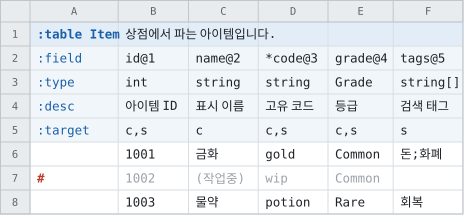
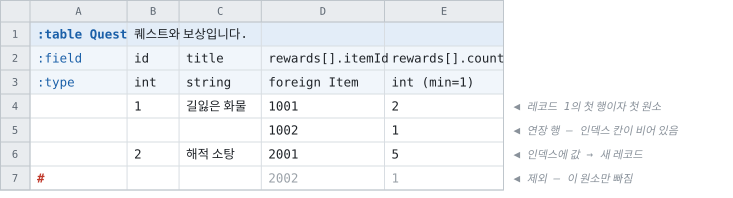
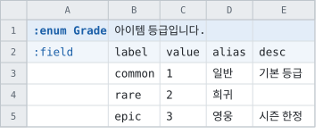
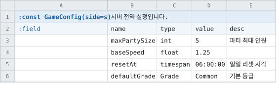
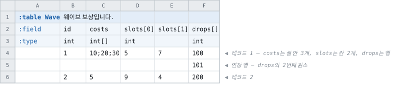
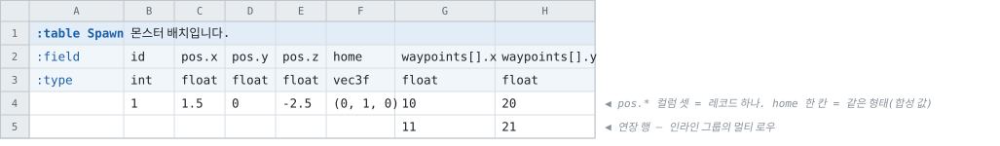
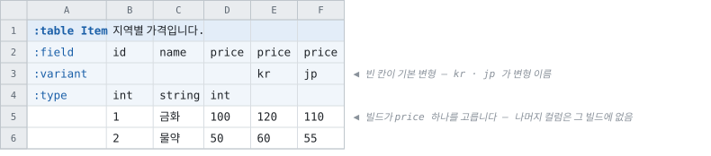
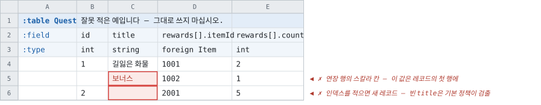
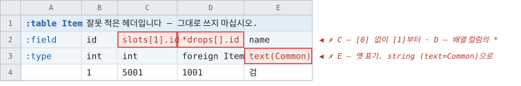

# 주 시트 레이아웃 — 설계

> [문서 목록으로](../doc/readme.md)

Tabbit의 **주 작성 레이아웃**의 설계입니다. STRUCT DSL이 들어오면서 기존 `tabbit`
레이아웃(`~~table:Name~~` 마커, 위치 고정 5행)으로는 임베딩 오브젝트 · 멀티 로우 ·
예약 컬럼을 표현할 자리가 없어, Luban의 시트 구조를 조사해 그 검증된 부분을 차용하고
취약한 부분을 보강한 새 레이아웃을 정의합니다.

**Luban을 그대로 복제하지 않습니다.** 기능 단위로 채택 · 변형 · 거절을 판정하였고(§10),
시트 작성자가 더 직관적으로 쓸 수 있는 형태가 있으면 그쪽을 택했습니다. 조사의 근거는
[Luban 레이아웃 레퍼런스](../notes/luban-layout-reference.md)(문서 · 소스 교차 검증,
커밋 `8f7f4e1`)와 [Luban 기능 대조](../notes/luban-comparison.md)입니다.

> **[행 키 레이아웃](keyed-layout.md)을 대체합니다.** 그 설계의 분석 — 마커 열, 경계 규칙,
> 메모 컬럼, 수식 오류 보고의 지연, 정렬 사고 검출 — 은 이 문서가 계승하고, 표기만 `:` 키로
> 다시 정의합니다. 레이아웃 id는 `tabbit`입니다 — **기존 `tabbit` 레이아웃은 폐기가
> 결정되었고**, 이 레이아웃이 완성되면 그 id를 승계합니다(§16의 6).

---

## 1. 목표

|목표|귀결|
|--|--|
|STRUCT DSL의 시트 결합을 온전히 표현|(나) 타입 이름 그룹 · (다) `sep` 한 셀 · **멀티 로우**(§6) · 예약 컬럼(§7)|
|시트 작성자의 직관|특수문자 어휘 2종(§2) · 자리 하나에 뜻 하나 · 드롭다운 가능성 유지|
|Luban에서 관찰한 취약 사례의 재발 방지|§11의 점검표. 하나하나에 이 설계의 대응을 적었습니다|
|표현의 자유|메모 · 작업용 컬럼 · 수식을 시트 어디에나. 마커 열이 경계를 정하므로 침범 규칙이 필요 없습니다|
|기존 데이터 칸 규칙의 완전 계승|바뀌는 것은 **헤더**뿐입니다. 셀에 적는 값의 규칙은 전부 무변경입니다(§9)|

---

## 2. 표기 어휘 — 특수문자 2종

**레이아웃이 새로 정의하는 특수문자는 `:`와 `#` 둘뿐입니다.**

|기호|뜻|나오는 자리|
|--|--|--|
|`:`|**레이아웃의 낱말** — 데이터가 아니라 구조|선언 `:table Item(…)` · 행 키 `:field` `:type` · 예약 컬럼 `:key` `:value` `:type`|
|`#`|**모델에 넣지 않음**|마커 열의 행 제외 · `:field`의 메모 컬럼(`#` 단독) · `#이름@N` 묘비 · 워크북 · 시트 이름의 제외(기존)|

Luban은 `##` · `*` · `!` · `$` · `[이름…이름]` · `#속성`의 6가지 표기 계열을 씁니다. 이
설계는 그 전부를 위 2종과 기존 어휘로 접습니다 — `$type`은 `:type`으로, `*`(멀티 로우)는
이름의 `[]`로, `!`(빈 칸 금지)는 옵셔널의 반대인 기본값 필수 규칙으로.

**기존 어휘는 그대로 계승합니다.** 새로 배울 것이 아니므로 개수에 넣지 않습니다.

|기호|뜻|근거 문서|
|--|--|--|
|`?`|옵셔널. `int?` · `int[]?` · `int?[]`|[옵셔널](optional-fields.md) · [원소 옵셔널](nullable-array-elements.md)|
|`[]` (타입 칸)|셀 안의 배열. `int[]`|[시트 작성](../doc/sheets.md#배열-타입)|
|`[n]` · `[]` (이름)|원소 번호 · 멀티 로우(§5 · §6)|이 문서|
|`.`|레코드 멤버|[중첩 필드](nested-fields.md)|
|`@N`|와이어 태그|[시트 작성](../doc/sheets.md#와이어-태그-n)|
|`*`|보조 인덱스|[시트 작성](../doc/sheets.md#보조-인덱스)|
|`\|`|다중 대상 참조. `foreign Weapon\|Armour`|[다중 대상 접근자](multi-target-accessors.md)|
|`-` · `\-`|값 없음 · 문자 `-`|[빈 칸과 없음](blank-and-null-cells.md)|

**`$`는 도입하지 않습니다.** Luban의 `$type` · `$key` · `$value`는 전부 `:` 접두로
받습니다(§7). 「`:`가 붙은 것은 데이터가 아니라 레이아웃의 낱말」 — 기억할 규칙이 이
하나가 되게 하기 위해서입니다.

> **주의 — `*`의 뜻이 Luban과 다릅니다.** Luban의 `*이름`은 멀티 로우이고, 이 레이아웃의
> `*이름`은 보조 인덱스(기존 tabbit 어휘)입니다. Luban에서 오는 사용자가 걸리는 지점이므로
> 사용자 문서에 명시하고, 멀티 로우 자리에 적힌 `*`는 `[]`를 안내하며 거절합니다.

---

## 3. 시트의 구조

### 3.1 마커 열과 선언 셀

엔티티는 **선언 셀**로 시작합니다. `:table` · `:enum` · `:const`로 시작하는 셀이 어디에
있든 그 자리가 엔티티의 시작이고, **그 셀의 열이 그 엔티티의 마커 열**입니다.

```
:table Item(side=s)      ← 선언 셀. 이름과 괄호 메타
```

- **선언 셀의 오른쪽 첫 셀이 엔티티의 설명**입니다. 비우면 설명 없음입니다.
  `:table` · `:enum` · `:const` 셋 다 같은 규칙입니다.
- 괄호 메타는 생략할 수 있습니다. 아는 키는 §3.4의 표가 정본이고, **모르는 키는 아는
  키의 목록과 함께 오류**입니다(`RequireKnownOptions`와 같은 정책).
- 이름은 기존 규칙 그대로 Pascal 표기로 정규화되고, 종류와 무관하게 유일해야 합니다.

마커 열은 엔티티의 세로 범위 전체에서 예약됩니다. 담을 수 있는 것은 다음뿐이고, **그 외의
값은 오류**입니다 — Luban이 미지의 `##` 태그를 로그로만 남기는 것과 갈리는 자리입니다.

|마커 열의 셀|뜻|
|--|--|
|`:table …` · `:enum …` · `:const …`|엔티티 선언 (이 엔티티의 종료이기도 합니다)|
|`:field` · `:type` · `:desc` · `:target` · `:variant`|헤더 행 키(§3.3)|
|빈 칸|데이터 행|
|`#` (또는 `//`)|**그 행을 변환에서 제외.** 데이터 칸을 편집하지 않고 제외 · 복원합니다|

### 3.2 경계

|축|범위|
|--|--|
|가로|마커 열의 오른쪽부터, **다음 마커 열 직전**까지. 없으면 시트의 마지막 컬럼까지|
|세로|선언 셀의 다음 행부터, **완전히 빈 행** 또는 **다음 선언 셀** 직전까지|

- 「완전히 빈 행」의 판정 범위는 그 엔티티의 컬럼 범위이고, **마커 열과 메모 컬럼을
  포함**합니다. 데이터 아래에 메모를 적으려면 한 줄 띄우면 됩니다.
- 데이터 중간에 시각적 여백이 필요하면 마커 열에 `#`를 적거나 메모 컬럼에 구분선 문자를
  적습니다 — 그 행은 빈 행이 아니므로 엔티티가 계속됩니다.
- 기존 레이아웃의 「엔티티 간 침범 금지」 규칙은 필요 없습니다 — 옆 엔티티는 자기 마커
  열에서 시작합니다. 엔티티 옆에 자유 기재가 필요하면 메모 컬럼(`#`, §3.3)으로 자리를
  만들거나, 빈 행 하나로 닫힌 아래쪽에 적습니다.
- **셀 병합은 읽지 않습니다.** 병합 범위의 좌상단 셀만 값을 갖고 나머지는 빈 칸의 일반
  규칙(§3.7)으로 읽힙니다. **판정은 경고**이고 대상은 엔티티 범위 안의 병합입니다 —
  메모 컬럼과 엔티티 밖은 자유입니다.

> **경고를 내려면 병합 정보가 먼저 와야 합니다.** 지금은 **병합 여부가 로우 모델에 오지
> 않습니다** — `RawCell`에 그 자리가 없고, 스트리밍 리더(`Sylvan.Data.Excel`)는 행과
> 값만 줍니다. 병합 사각형은 xlsx의 `<mergeCells>` · xlsb의 병합 레코드 · 구글 API의
> `merges`를 따로 읽어야 나오고, 그것은 [정의된 이름](xlsb-defined-names.md)과 같은 등급의
> 임포터 작업입니다. **그래서 이 레이아웃의 일이 아니라 별건이고**, §16의 순서에 넣지
> 않았습니다.
>
> **그때까지 병합 사고가 조용히 지나가지는 않습니다** — 병합에 의존하던 헤더는 좌상단
> 밖이 빈 칸이 되므로 「`:field`가 빈 컬럼에 데이터가 있음」(§3.3)과 「`:type` 셀이 빔」
> (§3.7)이 그 셀을 가리켜 걸립니다. 없는 것은 **「병합입니다」라고 이름을 대는 것**이고,
> 그것이 경고가 더할 값입니다.

### 3.3 헤더 행

|행 키|역할|생략|
|--|--|--|
|`:field`|컬럼의 정체 — 이름 · 경로 · `@N` · `*` · `#`|**불가**|
|`:type`|타입 표현과 괄호 메타(§4)|테이블은 불가. enum · const는 **행 자체가 없습니다**(§8)|
|`:desc`|컬럼 설명. 생성 코드의 doc comment가 됩니다|가능|
|`:target`|**대상의 쉼표 목록** — `c` · `s` · `c,s`. 행 생략과 개별 빈 칸 모두 양쪽입니다|가능|
|`:variant`|필드 변형의 이름(§3.6). 빈 칸은 기본 변형입니다|가능|

- **행의 순서는 자유**이고, 데이터 행보다 위에 있어야 합니다. `:field`를 데이터 바로 위에
  두는 것을 권장 관례로 합니다 — 엑셀의 정렬 · 필터 머리글이 데이터와 인접합니다.
- `:field` 셀에 **`#` 하나만 적은 컬럼은 메모 컬럼**입니다 — 시트 작성자가 자유롭게 적는
  공간이라는 표시이고, 모델에 흔적을 남기지 않습니다. `VLOOKUP` 표시, 계산용 임시 열,
  한국어 라벨이 여기에 해당합니다.
- `:field` 셀이 **빈 컬럼은 자리가 없는 컬럼**입니다. 그 컬럼의 데이터 칸에 값이 있으면
  **오류**이고, 메시지가 「필드라면 이름을, 메모 공간이라면 `#`를」 안내합니다 — 이름 없는
  컬럼의 데이터가 조용히 버려지는 경로를 없애는 자리입니다(§11의 7).
- `#이름@N`은 제외된 필드이고 와이어 태그를 예약합니다(묘비). 메모 컬럼(`#` 단독)과 뜻이
  다릅니다 — [행 키 레이아웃 §2.3](keyed-layout.md)의 구분 그대로입니다.
- 기본 인덱스는 지정이 없으면 **첫 필드 컬럼**입니다. 선언 셀의 `key` 메타로 다른 컬럼을
  지정하거나 **복합 키**를 선언할 수 있습니다(§3.5). 어느 쪽이든 기존 규칙 전부가
  성분마다 적용됩니다 — 유일 · 옵셔널 불가 · 양쪽 대상 필수 ·
  [될 수 있는 타입](../doc/sheets.md#인덱스가-될-수-있는-타입).

### 3.4 선언 셀의 메타 키

|키|값|뜻|
|--|--|--|
|`side`|`c` · `s` · `c,s`(기본)|엔티티의 target-side. 기존 마커의 `:side` 자리|
|`key`|필드 이름, 또는 따옴표 쉼표 목록|기본 인덱스의 지정. 생략하면 첫 필드 컬럼입니다(§3.5)|

단일 행 테이블(`one`) 등은 예약 후보로만 두고 §13에 적었습니다.

**target의 표기는 쉼표 목록입니다** — Luban의 `##group c,s`와 같은 형태이고, 대상이 셋
이상으로 일반화되는 날([기능 대조 §5.3](../notes/luban-comparison.md))에도 표기가 그대로
확장됩니다. 붙여 쓴 `cs`는 `c,s`와 같은 뜻으로 받습니다 — 기존 시트 · recipe · CLI가 쓰는
표기라서입니다. 괄호 메타 안에서는 쉼표가 항목 구분자이므로, 쉼표가 든 값은 DSL의 규칙
그대로 따옴표로 감쌉니다(`side="c,s"`) — 다만 양쪽이 기본값이라 실제로 적을 일이
드뭅니다.

### 3.5 키의 지정 — `key` 메타

**SQL의 키 체계를 따릅니다.** 첫 키가 PRIMARY KEY, 나머지가 UNIQUE 키에 대응하고,
어느 것이든 단일 · 복합이 됩니다. 쉼표가 한 키 안의 성분을, 세미콜론이 키와 키를
가릅니다 — `allowed=a;b;c`와 같은 관례이고 새 기호가 없습니다. 쉼표 · 세미콜론이 들어가는
값은 따옴표로 감쌉니다(§3.4).

|표기|뜻|SQL 대응|
|--|--|--|
|(생략)|**첫 필드 컬럼이 기본 인덱스** — 지금 규칙 그대로|PRIMARY KEY|
|`key=code`|그 이름의 컬럼이 기본 인덱스. 첫 컬럼 강제가 풀리고, 첫 컬럼은 평범한 필드가 됩니다|PRIMARY KEY|
|`key="stage,slot"`|**복합 기본 인덱스.** 조합이 유일해야 하고, 조회가 다인자가 됩니다 — `FindByKey(stage, slot)`|복합 PRIMARY KEY|
|`key="stage,slot; slot,code"`|**키 여러 개.** 첫 키가 기본 인덱스, 나머지는 보조 키입니다 — 각자 유일하고 각자 조회를 얻으며, 개수 제한이 없습니다|PRIMARY KEY + UNIQUE …|

- **첫 키가 기본 인덱스입니다** — 행의 신원 · 참조 대상 · 멀티 로우의 레코드 경계(§6.1)가
  전부 첫 키의 것입니다.
- **`*`는 단일 보조 키의 컬럼 자리 표기입니다** — SQL이 컬럼 자리의 `UNIQUE`와 테이블
  자리의 `UNIQUE (…)`를 둘 다 두는 것에 대응합니다. 컬럼 옆에서 보이는 것이 `*`의
  가치이고, 목록에 적는 것과 뜻이 같습니다. **같은 키를 양쪽에 이중 선언하면
  오류**입니다.
- 성분의 규칙 — `key`에 적힌 이름은 **실재하는 최상위 스칼라 필드**여야 하고(경로 ·
  `[]` · `[n]` 불가), 성분마다 기본 인덱스의 기존 규칙(인덱스 가능 타입 · 옵셔널 불가 ·
  양쪽 대상)이 적용됩니다. 한 키 안에서 같은 성분을 두 번 적거나, 성분 구성이 같은 키를
  두 번 선언하면 오류입니다. **성분 하나가 여러 키에 들어가는 것은 됩니다** — 위 표의
  `slot`이 그 예입니다.
- 복합 키의 성분에 `*`를 따로 붙이는 것도 됩니다 — 「조합도 유일하고 이 성분 혼자서도
  유일하다」는 서로 다른 두 선언입니다.
- **기본 인덱스가 복합인 테이블은 `foreign`의 대상이 될 수 없습니다** — 참조는 키 값
  하나를 담는 구조이므로([설계](reference-key-types.md)) 거부로 시작하고, 요구가
  실측되면 그때 형태를 정합니다. 보조 키는 참조와 무관합니다.
- 와이어는 움직이지 않습니다 — 성분 컬럼이 그대로 실립니다. 움직이는 것은 **생성 코드의
  조회 표면**(키마다 하나, 복합이면 다인자)이고, 모든 언어에 파급되므로 별도
  단계입니다(§16의 8). 그때까지 복합 키는 문법 · 모델 · 유일성 검사까지 받고, 조회
  생성만 이름과 함께 거절합니다. 단일 `key=` 지정은 조회 형태가 지금과 같으므로 1단계에
  포함됩니다.

### 3.6 필드 변형 — `:variant` 행

**한 필드의 값 컬럼을 여러 벌 적고, 빌드가 하나를 고르는** 표기입니다. 지역별 가격처럼
컬럼 하나만 갈리고 나머지가 공유되는 데이터가 대상입니다.

- **같은 필드 이름을 컬럼 여러 개에 그대로 적고**, `:variant` 행이 그것들을 구분합니다.
  `:variant`가 빈 컬럼이 **기본 변형**입니다. 같은 이름 · 같은 변형 이름의 컬럼 둘은
  중복 오류입니다(빈 칸 둘도 마찬가지입니다).
- **선택은 recipe가 합니다** — `"Variants": { "Item.Price": "kr" }` 형태의
  `테이블.필드 → 변형 이름` 맵이고, CLI는 `--variant Item.Price=kr`입니다. 지정이 없으면
  기본 변형이고, 기본 변형이 없는 필드(모든 컬럼에 변형 이름이 있는 필드)는 선택이
  필수입니다. 없는 변형을 지정하면 있는 목록과 함께 오류입니다.
- **산출물은 변형을 모릅니다.** 선택된 컬럼 하나가 그 필드가 되고, 나머지 컬럼은 그
  빌드에 없습니다 — 모델 · 와이어 · 생성 코드 전부 필드 하나이므로 **형식 · 생성 코드
  무변경**입니다. `text` 수집도 선택된 컬럼만 합니다.
- **헤더 기재의 정본은 기본 변형 컬럼**(없으면 첫 변형 컬럼)입니다. `:type` · `:desc` ·
  `:target` · `@N`은 거기에 적고, 다른 변형 컬럼에 반복 기재하면 일치를 검사합니다 —
  §4.3의 그룹 규칙과 같은 형태입니다.
- **키 컬럼(§3.5의 성분 포함)에는 변형을 둘 수 없습니다.** 행의 신원이 빌드마다 달라지면
  참조 · 히스토리 · 배포 판정이 전부 「같은 행」을 말할 수 없게 됩니다.
- 그룹 멤버(`pos.x`) · `[]` · `[n]` 컬럼의 변형은 **1차에서 거절합니다** — 컬럼 집합이
  변형마다 복제되는 형태라, 요구가 실측되면 그때 정합니다.

#### 행 세트와의 구분

[행 세트](table-row-sets.md)(그 문서의 이름은 「행 벌」입니다)와는 둘 다 「여러 벌 중
하나를 고른다」이지만 **고르는 단위가 다릅니다.** 겹치는 기능이 아니므로 어느 쪽도 다른
쪽을 대신하지 않습니다.

|  |`:variant`|행 세트|
|--|--|--|
|여러 벌인 것|**한 필드의 값 컬럼**|**행의 집합**(레코드들)|
|공유되는 것|같은 행의 나머지 필드 전부|테이블의 스키마|
|맞는 요구|지역별 가격 · 난이도별 수치 하나|지역별 상품 구성 · 환경별 데이터 추가 · 교체|

### 3.7 빈 칸의 뜻 — 자리별 총정리

**시트를 작성하는 사람이 가장 자주 묻는 질문이 「여기 비워도 되나」입니다.** 빈 칸의 뜻이
자리마다 다르므로 한 표로 정리합니다 — 이 표가 시트 작성 문서에 그대로 들어가야 합니다.
데이터 칸의 정본 규칙은 [빈 칸과 없음](blank-and-null-cells.md)이고, 이 절은 그 규칙을
이 레이아웃의 자리에 배치한 것입니다.

**세 줄 요약.**

1. **빈 칸은 「값 없음」이 아닙니다.** 값 없음은 `-`이고, `?` 컬럼에서만 적을 수 있습니다.
2. **비워도 되는 곳** — 문자열 · bool · 배열의 데이터 칸(각각 `""` · `false` · 빈 배열이
   됩니다), 선택 헤더 행의 칸, 정본이 다른 칸에 있는 헤더 칸.
3. **비우면 안 되는 곳** — 숫자 계열의 데이터 칸(기본 정책), 기본 인덱스, 연장 행의
   스칼라 칸, 이름 없는 컬럼의 데이터 칸.

#### 헤더 영역

|자리|빈 칸의 뜻|
|--|--|
|선언 셀의 오른쪽(설명)|설명 없음. **허용**|
|`:field` 셀|자리가 없는 컬럼. 그 아래 데이터가 있으면 **오류**(§3.3) — 자유 기재 공간이 필요하면 `#`를 적습니다|
|`:type` 셀 — 보통의 필드 컬럼|**오류.** 타입은 생략할 수 없습니다|
|`:type` 셀 — struct 그룹의 2번째 이후 멤버 · `[n]`의 원소 1 이후 · 기본이 아닌 변형 컬럼|**비우는 것이 정본**입니다(§4.3). 적으면 일치 검사|
|`:desc` 셀|설명 없음. **허용**|
|`:target` 셀|양쪽(`c,s`). **허용**|
|`:variant` 셀|기본 변형. **허용**|
|`:desc` · `:target` · `:variant` **행 자체의 생략**|전부 위의 기본값. **허용**|
|메모 컬럼(`#`)의 모든 칸|자유 공간 — 헤더 행의 칸도 포함합니다|

#### 데이터 영역

|자리|빈 칸의 뜻|
|--|--|
|마커 열|보통의 데이터 행|
|**기본 인덱스 칸**|**오류** — 행의 신원이 없습니다. 예외는 멀티 로우 표 하나이고, 거기서는 연장 행의 신호입니다(§6.1). 복합 키의 성분 일부만 비면 오류|
|`string` · `bool` · `T[]` 칸|**값입니다** — `""` · `false` · 빈 배열. 값 없음이 아닙니다|
|숫자 · `bitset` · `datetime` · `timespan` · `uuid` · enum 칸|**오류**(기본). 소스의 `OnBlankCell: "empty"`가 타입의 빈 값으로 완화하고, 그렇게 읽은 것은 컬럼당 한 번 경고됩니다|
|참조(`foreign`) 칸|**오류.** `OnBlankCell`로도 통과하지 않습니다 — 키를 적거나, 옵셔널 참조면 `-`를 적습니다|
|**옵셔널(`?`) 칸**|**빈 칸의 뜻은 위와 똑같습니다.** `?`가 바꾸는 것은 「`-`를 적을 수 있다」뿐입니다 — `string?`의 빈 칸은 없음이 아니라 `""`입니다|
|`[n]` 원소 칸|`TrimTrailingArrayElements`가 켜져 있으면 값 없는 뒤쪽 원소(`-`)는 배열 밖입니다. 가운데의 빈 원소는 기본 거부입니다(`AllowArrayGaps`)|
|`[]` 그룹의 범위가 전부 빈 행|그 행에 그 그룹의 원소가 없습니다(§6.1 규칙 4)|
|**연장 행의 `[]` 아닌 칸**|**비어 있어야 합니다.** 값이 있으면 그 셀을 가리켜 오류입니다(§6.1 규칙 3)|
|enum의 `label` · `value`, const의 `name` · `type` · `value`|**오류** — 필수 칸입니다|
|enum의 `alias` · `desc`, const의 `desc`|없음. **허용**|
|완전히 빈 행|**엔티티의 종료**(§3.2)|
|엔티티 밖(경계 너머)의 셀|레이아웃이 읽지 않습니다 — 자유|

---

## 4. `:type` 행 — 접힌 타입 표현과 괄호 메타

### 4.1 타입 표현 — 디테일 행의 소멸

기존 레이아웃은 (타입 칸, 디테일 칸) 한 쌍이었습니다 — 타입 `enum` + 디테일 `Element`,
타입 `foreign` + 디테일 `Weapon|Armour`. STRUCT DSL이 그 쌍을 타입 표현 하나로 접었고
([설계 §3](../notes/struct-dsl-design.md)), **이 레이아웃은 그 접힌 표현을 시트에서도
씁니다.** 디테일 행은 없습니다.

|무엇|기존 (타입 + 디테일)|이 레이아웃|
|--|--|--|
|enum|`enum` + `Element`|`Element`|
|참조|`foreign` + `Weapon\|Armour`|`foreign Weapon\|Armour`|
|DSL의 struct|(없었음)|`Reward`|
|그 외|`int` · `string[]` · `vec3f` · …|그대로|

**대안 — 타입과 디테일을 행 둘로 유지.** [행 키 레이아웃 §3.3](keyed-layout.md)이 엑셀
드롭다운 검증을 위해 택하였던 방향입니다. 채택하지 않습니다 — DSL과 시트가 같은 타입 표현을
쓰는 것이 배우는 문법을 하나로 만들고, 자리 둘에 뜻 하나를 나눠 적는 형태가 §11에서
피하려는 것 자체이기 때문입니다. 드롭다운은 이름 카탈로그 산출로 보완하는 방향이고 미결로
남깁니다(§13).

### 4.2 괄호 메타 — 첫 `(`부터는 언제나 메타

타입 칸은 「**타입 표현 + 괄호 메타(선택)**」입니다. 규칙은 하나입니다 — **셀에서 첫
`(`가 나오면 거기서부터 메타**입니다. 타입 표현 자체에는 괄호가 없습니다.

```
int
int? (min=0, max=100)
string (text)
string (text=Common)
string (asset=icon)
foreign Item|CEquip
Reward
int[] (size=1..4)
```

|메타 키|값|뜻|대응|
|--|--|--|--|
|`text`|플래그 또는 그룹 이름|번역 수집. `(text)` · `(text=Common)`|기존 `text` · `text(Common)` 타입|
|`namespace`|이름|`text` 그룹의 네임스페이스|기존 `text(Common,Shared)`의 둘째 자리|
|`asset`|종류 이름|자산 존재 확인. `(asset=icon)`|기존 `asset(icon)` 타입|
|`min` · `max`|수|범위. 스칼라 · 원소|`Field.Constraints`의 `Minimum` · `Maximum`|
|`allowed`|`a;b;c`|허용값|`AllowedValues`|
|`regex` · `size` · `notDefault`|(DSL §6.1과 동일)|컬럼 제약|[Luban 대조 §5.8](../notes/luban-comparison.md)의 도입 항목|

- **키의 사전과 「배열에 붙는가, 원소에 붙는가」는 DSL §6.1의 표가 정본**입니다. 이
  레이아웃이 키를 따로 정의하지 않습니다 — 같은 키, 같은 뜻, 같은 검증입니다.
  `text` · `namespace` · `asset`의 등재는 괄호 메타와 같은 단계입니다(§16의 3).
- DSL이 선언한 struct의 컬럼에 적은 제약은 DSL 제약과의 **교집합**입니다(DSL §6.3).
  완화는 없습니다.
- 모르는 키는 오류입니다.

> **role 키 등재에서 확인해 둔 것 3가지**(§16의 3의 입력입니다).
>
> - **DSL은 `text`를 플래그로만 읽습니다** — `SchemaMetadata.ApplyRole`이 `Has("text")`만
>   보므로 `(text=Common)`은 파싱을 통과하고 **`Common`이 조용히 버려집니다.** 등재가
>   고치는 결함이고, 이 도구가 없애려는 종류 그 자체입니다.
> - **DSL에 `namespace` 키가 없습니다.** 시트의 옛 표기는 `text(Common,Shared)`의 둘째
>   자리로 적었고, `key=value` 형태에는 쉼표 묶음이 필요 없으므로 키를 따로 둡니다 —
>   양쪽이 같은 형태가 되는 것이 등재의 본 효과입니다.
> - **기존 role 오류 문구는 옛 표기 전용입니다** — 「괄호를 열고」 · 「쉼표로 끝나고」 ·
>   `text(Achievement,Quests)`를 안내합니다. `key=value`에 그대로 쓰면 작성자가 쓰지 않은
>   표기를 안내하게 되므로, **규칙은 공유하고 문구는 표기마다 따로 둡니다** —
>   `CookingContext.RequiresRoleGroup`의 판정을 뽑아 쓰고 메시지는 각자입니다.

> **기존 표기와의 단절 하나.** `text(Common)` · `asset(icon)`처럼 괄호가 타입에 붙는
> 표기는 이 레이아웃에 없습니다 — 붙여 적으면 `(Common)`이 메타로 읽혀 「모르는 키」로
> 걸리므로, 그 오류 메시지가 `(text=Common)` 형태를 안내해야 합니다. 기존 `tabbit`
> 레이아웃의 시트는 교체(§16의 6) 전까지 기존 파서로 유효하고, 이관에서 이 표기도 함께
> 고칩니다.

### 4.3 타입 칸을 적는 자리 — 그룹의 정본은 첫 멤버 컬럼

|컬럼의 형태|타입 칸|
|--|--|
|스칼라 컬럼|그 컬럼에 적습니다|
|인라인(익명) 레코드 그룹 — `pos.x` · `pos.y`|**멤버 컬럼마다** 적습니다|
|DSL struct 그룹 — (나)|**그룹의 첫 멤버 컬럼에 struct 이름 하나.** 나머지 멤버 칸은 비웁니다 — 적으면 DSL과의 일치를 검사하고 어긋나면 거부합니다(DSL §7.2)|
|원소 번호 그룹 — `slots[0].id` · `slots[1].id`|**원소 0의 컬럼에만** 적습니다. 이후 원소의 타입 칸은 비웁니다 — 적으면 일치 검사|
|멀티 로우 그룹 — `rewards[].itemId`|위 두 규칙과 같습니다. 타입 칸에 적는 것은 **원소의 타입**입니다 — 배열임은 이름의 `[]`가 이미 말했으므로 타입에 다시 적지 않습니다|

`:desc` · `:target` · 제약 메타도 같은 규칙입니다 — 그룹의 정본은 첫 멤버 컬럼(원소
0)이고, 반복 기재는 일치 검사입니다.

---

## 5. `:field` 행 — 컬럼 경로 표기

**경로의 정본은 대괄호 원소 번호와 점 멤버입니다.** named-range 레이아웃의
`character[0]["Id"]`([UwoColumnPath](../src/Cooking/Layouts/UwoColumnPath.cs))와 기존
tabbit의 `Slot1.Id`가 이 표기 하나로 합류합니다.

|`:field` 셀|뜻|
|--|--|
|`id`|필드 하나|
|`pos.x`|레코드 `pos`의 멤버 `x`|
|`slots[0].id`|레코드 배열 `slots`의 원소 0, 멤버 `id` — **칸의 수가 정해진 배열**|
|`tags[0]` · `tags[1]`|스칼라 배열을 컬럼으로|
|`pos.x[0]`|멤버가 배열인 레코드 ([다중 중첩](nested-multi-level.md)의 `Pos.X1`)|
|`rewards[].itemId`|**멀티 로우** — 원소가 컬럼이 아니라 **행**에서 옵니다(§6)|
|`costs[]`|스칼라 멀티 로우|
|`Price@3` · `*code` · `#old@4`|와이어 태그 · 보조 인덱스 · 묘비 — 기존 그대로|

- **원소 번호는 0부터**이고 빠짐없이 연속해야 합니다. `[1]`부터 시작하거나 건너뛰면 그
  셀을 가리켜 오류입니다.
- **이름의 숫자 접기(`Slot1` · `Slot2` → 배열)는 이 레이아웃에 없습니다.**
  `FoldSerialFields` 옵션도 읽지 않습니다 — `Text1` · `Text2`는 그냥 필드 2개입니다.
  배열은 언제나 `[]` 대괄호로 선언되고, 「이 이름의 숫자가 배열인가」라는 질문 자체가
  없어집니다.
- 중첩 깊이는 세지 않습니다 — `stars[0].pos.x`는 `slots[0].id`와 같은 규칙 한 단계
  더입니다([다중 중첩](nested-multi-level.md)).
- 와이어 태그는 **와이어 컬럼당 하나**입니다. `slots[0].id@4`처럼 원소 0의 멤버 컬럼에
  달고, 이후 원소 컬럼에는 달지 않습니다(기존 serial field 규칙과 동형). 멀티 로우 그룹은
  멤버 컬럼이 곧 와이어 컬럼이므로 `rewards[].itemId@4`처럼 멤버마다 답니다.
- `*` 보조 인덱스는 `[]` · `[n]` 컬럼에 붙을 수 없습니다(배열은 인덱스가 될 수 없다는
  기존 규칙).

### 5.1 `[]`의 두 자리 — 이름과 타입

**`[]`가 이름에 있으면 행이 원소이고, 타입에 있으면 셀 안이 원소입니다.**

|기재|원소가 오는 곳|길이|
|--|--|--|
|`:field` `costs` + `:type` `int[]`|**셀 안** — `10;20;30`|셀마다 다름|
|`:field` `costs[]` + `:type` `int`|**행** — 연장 행마다 하나|행 수가 정함|
|`:field` `costs[0]` `costs[1]` + `:type` `int`|**컬럼** — 칸의 수가 정해짐|컬럼 수. `TrimTrailingArrayElements`로 뒤를 자를 수 있음|

셋 다 와이어는 같습니다 — `KindVarArray` 컬럼
하나([가변 길이 레코드 배열](variable-length-record-arrays.md))이고, 생성 코드도
같습니다. 다른 것은 시트에서 읽는 방법뿐입니다.

`costs[]` + `int[]`처럼 두 자리에 동시에 적는 것(행마다 셀 배열 — 배열의 배열)은 1차에서
거절합니다(§13).

---

## 6. 멀티 로우 — 정밀 규칙

레코드 하나가 여러 행에 걸치는 표기입니다. Luban의 `*` 멀티 로우가 원형이고, 경계 판정을
바꿨습니다(아래 근거).

### 6.1 규칙

|#|규칙|
|--|--|
|1|`:field`에 `[]` 컬럼이 하나라도 있으면 그 테이블은 **멀티 로우 모드**입니다. 없으면 지금처럼 한 행이 한 레코드입니다|
|2|**새 레코드의 시작은 기본 인덱스 칸에 값이 있는 행**입니다(§3.5의 첫 키 — 복합이면 성분 중 하나라도). 그 칸이 전부 빈 행은 직전 레코드의 **연장 행**이고, 복합 키의 성분 일부만 채운 행은 그 빈 성분을 가리켜 오류입니다|
|3|연장 행에서 값이 허용되는 곳은 **`[]` 컬럼뿐**입니다. 그 외 컬럼(스칼라 · `[n]` · 메타가 아닌 것)에 값이 있으면 **그 셀을 가리켜 오류**입니다|
|4|원소의 성립 — 레코드에 속한 각 행(첫 행 포함)에서, 한 `[]` 그룹의 컬럼 범위에 값이 하나라도 있으면 그 행이 그 그룹의 원소 하나입니다. 전부 비어 있으면 그 행에는 그 그룹의 원소가 없습니다|
|5|`[]` 그룹이 여럿이면 **각자 독립적으로** 쌓입니다. 길이가 서로 다를 수 있고, 같은 행에 있다고 원소끼리 짝이 되는 것이 아닙니다|
|6|원소 안의 빈 칸은 일반 규칙입니다 — [빈 칸과 없음](blank-and-null-cells.md)과 `OnBlankCell` 정책 그대로|
|7|**완전히 빈 행은 엔티티의 종료**입니다(§3.2). 레코드 사이에 빈 행을 둘 수 없습니다 — 여백이 필요하면 마커 열 `#`|
|8|마커 열의 `#` — **레코드의 첫 행에 있으면 연장 행까지 레코드 전체**를 제외하고, **연장 행에 있으면 그 행의 원소들만** 제외합니다|
|9|키 컬럼(§3.5)은 `[]`일 수 없습니다 — 배열은 인덱스가 될 수 없다는 기존 규칙 그대로입니다|

### 6.2 경계 판정의 근거 — Luban과 다른 곳

Luban의 연장 판정은 「멀티 로우가 아닌 **모든** 컬럼이 빈 행」입니다. 그 규칙에서는
연장 행에 스칼라 값을 실수로 적으면 그 행이 **새 레코드**가 되고, 오류는 「키가 비었다」로
납니다 — 사용자가 한 실수(잘못된 자리에 값)와 메시지(키 누락)가 서로 다른 곳을 가리킵니다.

이 설계는 신호를 **인덱스 칸 하나**로 좁혔습니다. 인덱스가 비면 연장이고, 연장 행의 스칼라
값은 규칙 3이 「이 값은 첫 행에 있어야 합니다」라고 그 셀을 가리킵니다. 반대 실수 —
연장하려던 행의 인덱스에 값을 적음 — 는 새 레코드가 되지만, 그 행의 스칼라 칸들이 비어
있으므로 기본 정책(`OnBlankCell: Error`)이 검출합니다. 어느 방향의 실수든 조용히 지나가지
않습니다.

### 6.3 담지 않는 것

|무엇|판정|
|--|--|
|**중첩 멀티 로우** — `[]` 그룹의 멤버가 또 `[]`|**1차 거절.** Luban은 임의 깊이를 지원하지만, 안쪽 배열은 셀 배열이나 `[n]` 칸으로 충분히 적습니다. 요구가 실측되면 그때 형태를 정합니다|
|`[]` 그룹의 옵셔널 — `[]?`|**1차 거절.** 원소 0개(빈 배열)로 충분하고, 「배열이 없음」이 필요한 컬럼은 셀 배열 `T[]?`로 적습니다|
|행마다 셀 배열 — `costs[]` + `int[]`|**1차 거절**(§5.1)|

### 6.4 와이어 — 형식 무변경

멀티 로우 그룹의 멤버는 `KindVarArray` 컬럼 하나입니다 —
[가변 길이 레코드 배열](variable-length-record-arrays.md)이 이미 실어 둔 형태이고, 이
레이아웃은 그 배열에 원소를 공급하는 세 번째 방법(행)일 뿐입니다. **형식도 생성 코드도
움직이지 않습니다.** `TrimTrailingArrayElements` · `AllowArrayGaps`는 `[n]` 고정 칸의
질문이므로 멀티 로우에는 해당하지 않습니다 — 원소는 있는 행만큼 생기고, 사이가 빈 원소는
규칙 4가 「원소 없음」으로 읽습니다.

---

## 7. 예약 컬럼 — `:type` · `:key` · `:value`

`:field` 행에서 `:`로 시작하는 이름은 예약 컬럼입니다. Luban의 `$type` · `$key` ·
`$value`에 대응하고, **이번 구현에서는 셋 다 이름을 인식하고 「아직 지원하지 않는다」로
거절합니다** — 자리를 지금 확보해 두면 뒤의 스펙이 문법을 다시 정하지 않습니다.

|예약 컬럼|장래의 역할|선행 스펙|
|--|--|--|
|`:type`|**다형 레코드**의 변종 판별 — 행(원소)마다 변종 이름을 적는 컬럼|다형 와이어 설계([Luban 대조 §5.2](../notes/luban-comparison.md) · DSL §8). 와이어가 성립해야 문법을 확정합니다|
|`:key`|**map**의 키 컬럼 — `prices[]` 그룹에서 키가 들어가는 자리|DSL 5′ (`set` · `map`). 셀 표기(`1:sword;2:shield`)와 컬럼 표기의 확정이 거기입니다|
|`:value`|다형 변종의 값을 한 셀로 압축(Luban `$value`)|다형과 함께. **1차 판정은 거절 쪽**입니다 — (다) `sep` 표기와 겹치는 두 번째 방법이 될 소지가 큽니다|

Luban에서 확인해 둔 것 중 이 자리의 설계에 물려받을 판정 2가지입니다.

- **다형 변종 컬럼의 열 집합은 모든 변종의 합집합**이고, 그 행의 변종에 없는 컬럼은
  비웁니다 — 멀티 로우와 결합하면 원소가 되는 행마다 `:type` 셀이 변종을 정합니다.
- **옵셔널이지만 다형이 아닌 레코드에까지 판별 컬럼을 강제하는 것**(Luban의 `null` ·
  `{}` 규칙)은 따라가지 않습니다. tabbit의 레코드 멤버 옵셔널은
  [별도 설계](record-member-optionality.md)가 이미 있습니다.

### 7.1 다중 대상 참조와 다형 — 섞이면 안 되는 두 가지

겉모습이 비슷해서 혼동하기 쉽지만 **다른 층의 다른 질문**입니다. 이 구분이 흐려지면 같은
요구가 두 문법으로 적히게 되므로, 표로 박아 둡니다.

|  |다중 대상 참조 `foreign A\|B`|다형 레코드 (`:type`)|
|--|--|--|
|질문|이 **키 값**이 어느 테이블의 행인가|이 **레코드 자체**가 어떤 형태인가|
|컬럼이 담는 것|키 하나. 컬럼의 형태는 행마다 같습니다|행마다 다른 멤버 집합|
|답이 정해지는 곳|값을 대상들의 인덱스에서 찾아서|`:type` 셀에 적힌 이름으로|
|tabbit의 현재|**있습니다** — 판별 enum과 대상별 접근자까지 ([설계](multi-target-accessors.md))|**없습니다** — 와이어 설계 선행|
|Luban의 대응물|`ref=`의 다중 테이블(검사만)|`$type`|

「보상이 아이템일 수도 장비일 수도 있다」는 참조의 문제이고 지금 문법(`foreign
Item|CEquip`)으로 적습니다. 「효과 레코드의 필드 구성이 행마다 다르다」가 다형의
문제이고, 그때까지는 다중 대상 참조로 우회하는 것이 기존
판정([Luban 대조 §5.2](../notes/luban-comparison.md))입니다.

---

## 8. 엔티티별 최종 레이아웃

시트 작성 문서에 그대로 옮길 수 있는 형태로 적습니다. 모든 엔티티가 같은 뼈대입니다 —
**선언 셀 | 설명 셀**, 그 아래 `:field` 행, 그 아래 데이터.

### 8.1 테이블 — 기본형



- 1행 — 선언과 설명. 3행 — `Grade`는 enum 이름, `string[]`은 셀 배열입니다.
- 2행 — `@N` 와이어 태그, `*code` 보조 인덱스. 7행 — 마커 열 `#`로 행 제외.

### 8.2 테이블 — struct와 배열의 4가지 표기

DSL에 이렇게 선언되어 있다고 합시다.

```
struct Reward (sep=",")
    field itemId foreign Item
    field count  int (min=1)
```


|표기|컬럼|무엇|
|--|--|--|
|**(가) 인라인 그룹**|`pos.x` `pos.y` `pos.z` — 멤버마다 타입 기재|struct 선언 없이 레코드 하나|
|**(나) DSL struct 그룹**|`reward.itemId` `reward.count` — 첫 컬럼 타입 칸에 `Reward` 하나|반복 기재가 사라집니다|
|**(다) `sep` 한 셀**|`reward` 컬럼 하나, 타입 `Reward`, 셀에 `101,2`|위 예시의 C · G열|
|**원소 번호 칸**|`slots[0].id` `slots[1].id` — 타입은 원소 0에만|칸의 수가 정해진 배열|

### 8.3 테이블 — 멀티 로우



- 5행(연장 행)의 `title` 칸에 값을 적으면 그 셀을 가리켜 오류입니다(§6.1 규칙 3).
- 7행 — 연장 행의 `#`는 그 원소만 제외합니다. 6행에 붙었다면 레코드 2 전체가 빠집니다.
- DSL struct를 쓰면 D열 타입 칸에 `Reward` 하나만 적고 E열은 비웁니다(§4.3).

### 8.4 enum



- `:type` 행이 없습니다 — 컬럼의 뜻이 이름으로 정해져 있습니다. `label`과 `value`는
  필수, `alias`와 `desc`는 생략할 수 있는 컬럼이고 순서는 자유입니다.
- `alias`는 데이터 셀에 적을 수 있는 네 번째 표기입니다(선언 표기 · Pascal 표기 · 숫자 ·
  별칭) — [행 키 레이아웃 §4.1](keyed-layout.md)의 표시명 분석과 DSL의 `(alias=)`가 같은
  자리이고, 별칭을 바꾸면 그 표기로 적힌 데이터 셀이 함께 바뀌어야 한다는 주의도 그대로
  물려받습니다.
- 0번 라벨이 없으면 `None = 0`이 자동 삽입되는 것도 기존과 같습니다.

### 8.5 상수셋



- `name` · `type` · `value` 필수, `desc` 생략 가능. **`type` 칸도 §4의 접힌 타입
  표현**이므로 6행처럼 enum 이름을 바로 적습니다 — 기존의 (타입 `enum` + 디테일) 5컬럼
  구조가 4컬럼이 됩니다.
- 상수는 코드로 나가고 데이터 파일에는 실리지 않는다는
  [기존 주의](../doc/sheets.md#supported-entities)가 그대로 적용됩니다.

### 8.6 표기 사례 모음

기본형 하나로는 드러나지 않는 조합들입니다. 작성 문서의 「이런 것도 됩니다」 절의
씨앗입니다.

#### 8.6.1 배열의 세 자리 — 셀 · 칸 · 행



- 한 테이블 안에서 셋을 섞어도 됩니다. `[]` 컬럼이 있으므로 이 표는 멀티 로우 모드이고,
  `costs` · `slots`는 레코드의 첫 행에만 적습니다.
- 셋의 와이어는 같습니다(§5.1). 고르는 기준은 데이터의 성격입니다 — 짧은 목록은 셀,
  칸의 수가 정해진 것은 `[n]`, 길이가 크게 다른 것은 행.

#### 8.6.2 옵셔널과 값 없음, 메모 컬럼


- `?` 컬럼의 「값 없음」은 `-`로 적습니다. **빈 칸은 값 없음이 아니고**, 기본
  정책(`OnBlankCell: Error`)에서는 오류입니다 — 6행의 붉은 칸이 그 사례입니다.
- F열은 `:field`에 `#`를 적은 메모 컬럼입니다 — 시트 작성자의 공간이라는 표시이고, 무엇을
  적어도 모델에 없습니다. 표시 없이 `:field`가 빈 컬럼에 값을 적으면 오류입니다(§3.3).

#### 8.6.3 인라인 그룹 · 합성 값 타입 · 중첩



- `pos.x` · `pos.y` · `pos.z` 컬럼 셋과 `home`의 `vec3f` 한 칸은 같은 형태의
  레코드입니다([합성 값 타입](composite-value-types.md)).
- `waypoints[].x`처럼 struct 선언 없는 인라인 그룹도 멀티 로우가 됩니다.

#### 8.6.4 다중 대상 참조


- 컬럼은 키 하나를 들고, 어느 테이블의 행인지는 **값이** 정합니다. 대상끼리 id가 겹치면
  거부되는 것 등 규칙 전부가 [기존 그대로](../doc/sheets.md#여러-테이블-중-하나를-가리키기--weaponarmour)입니다.
- 행마다 **형태**가 달라야 한다면 이것이 아니라 다형(§7.1)의 자리입니다.

#### 8.6.5 나란한 멀티 로우 그룹 — 독립 축적


- `rewards[]`와 `costs[]`는 각자 쌓입니다(§6.1 규칙 5). 5행에서 `costs`가 비어 있으므로
  rewards는 2개, costs는 1개입니다 — **같은 행이 짝을 뜻하지 않습니다.**
- 원소끼리 짝이 필요한 데이터는 한 struct의 멤버로 묶습니다(`pair[].reward` ·
  `pair[].cost`).

#### 8.6.6 복합 키


- `key="stage,slot"` 선언으로 두 컬럼의 **조합**이 키가 됩니다(§3.5). 조회는
  `FindByKey(stage, slot)` 형태의 다인자입니다.
- 키를 여러 개 두려면 세미콜론입니다 — `key="stage,slot; slot,code"`. SQL처럼 첫 키가
  PRIMARY KEY, 나머지가 UNIQUE 키에 대응합니다.
- Luban의 `index=a,b`(독립 키 2개)와 뜻이 다릅니다 — 독립 단일 키는 `*` 보조 인덱스로
  적습니다(§12의 12).

#### 8.6.7 필드 변형 — `:variant`



- `price` 컬럼이 3벌이고, `:variant` 행이 구분합니다 — 빈 칸이 기본, `kr` · `jp`가 변형
  이름입니다. 빌드가 recipe의 `Variants`로 하나를 고르고, 나머지 컬럼은 그 빌드에
  없습니다(§3.6).
- `:type` 등 헤더 기재는 기본 변형 컬럼에만 적습니다 — 반복 기재는 일치 검사입니다.

### 8.7 오류가 되는 표기

붉은 칸이 오류입니다. 각 칸이 §15 게이트 4의 오류 픽스처가 되고, 메시지는 표의 안내를
담아야 합니다.

#### 8.7.1 멀티 로우에서 잘못 적기 쉬운 2가지



- 5행 — 연장 행의 스칼라 칸에 값. 「이 값은 레코드의 첫 행에 적습니다」를 그 셀 위치와
  함께 보고합니다(§6.1 규칙 3).
- 6행 — 연장하려던 행에 인덱스를 적으면 새 레코드가 되고, 비어 있는 `title`을 기본
  정책이 검출합니다(§6.2).

#### 8.7.2 헤더에서 잘못 적기 쉬운 3가지



- C열 `slots[1].id` — `[0]` 없이 `[1]`부터 시작했습니다. 원소 번호는 0부터
  연속입니다(§5).
- D열 `*drops[].id` — 배열 컬럼은 보조 인덱스가 될 수 없습니다. Luban의 멀티 로우
  `*` 습관과도 겹치는 자리이므로 메시지가 두 가지를 함께 안내합니다(§2).
- E열 `text(Common)` — 옛 표기입니다. 첫 `(`부터는 메타이므로 `string (text=Common)`으로
  적습니다(§4.2).

---

## 9. 계승 — 바뀌지 않는 것

**데이터 칸의 규칙은 전부 무변경입니다.** 이 레이아웃이 바꾸는 것은 헤더의 표기뿐입니다.

|영역|그대로인 것|
|--|--|
|값 파싱|[파싱 규칙](../doc/sheets.md#parsing-rules) 전부 — bool 어휘 · 진법 리터럴 · InvariantCulture · TimeZone|
|빈 칸과 없음|`-` · `\-` · `OnBlankCell` — [설계](blank-and-null-cells.md)|
|배열|셀 구분자(`ArrayDelimiter`) · `TrimTrailingArrayElements` · `AllowArrayGaps`|
|합성 값 타입|`vec3f` · `quat` · `color` 계열의 셀 표기 전부|
|옵셔널|`?`의 4형태와 presence 비트맵|
|참조|`foreign`의 해석 · 다중 대상 · 키 타입 규칙|
|와이어 태그|`@N`의 규칙 전부 — 전부 또는 전무 · 묘비 · 재사용 금지|
|이름|Pascal 정규화 · `Naming` 규약 · 예약어 회피|
|target-side|모델의 3값(`ClientOnly` · `ServerOnly` · `Both`). 표기만 쉼표 목록이 정본이 되고 `cs`는 별칭입니다(§3.4)|
|제외|워크북 · 시트 · 엔티티 · 필드 · 행의 `#`|

`rescue` · `named-range` 레이아웃은 각자의 파서로 그대로 유효합니다. 기존 `tabbit` 레이아웃은
**개발 기간에만 병존합니다** — 게이트 1의 대조군이고, 교체 단계(§16의 6)에서 파서가
삭제되며 이 레이아웃이 id `tabbit`을 승계합니다. 이 레이아웃은 `[TabbitLayout]`
어트리뷰트를 단 파서 파일 하나로 추가되고, **그 파일을 지우면 흔적이 남지 않아야
합니다** — 코어 규칙 그대로입니다.

---

## 10. Luban 대조 — 채택 · 변형 · 거절 총괄

레이아웃 규칙의 상세는 [레퍼런스](../notes/luban-layout-reference.md)에 있고, 여기는
판정만 적습니다.

### 10.1 구조

|Luban|판정|이 설계|
|--|--|--|
|A1 `##` 메타 셀이 시트 선별|**변형**|선언 셀 스캔. 시트 무시는 명시적 `#`와 recipe|
|`##var` · `##type` 등 헤더 행|**채택 · 변형**|`:field` · `:type` — 행 키를 마커 열에|
|헤더 행 순서 자유|**채택**|§3.3|
|`##desc` 계열 3순위 폴백|**변형**|`:desc` 하나|
|`##group` 필드 그룹 (`c,s`)|**채택**|`:target` 행 — 같은 쉼표 목록 표기(§3.4). 이름 있는 그룹의 일반화는 보류 그대로|
|세로표(`##column` 전치)|**거절**|상수는 `:const`가, 단일 행은 §13의 예약이 자리입니다|
|병합 셀 · `[이름…이름]`으로 열 범위|**거절**|경로 이름(`reward.itemId`)이 범위를 대신합니다. 병합 불필요|
|다단 `##var` 재귀 헤더|**거절**|경로 표기 한 행|

### 10.2 필드와 값

|Luban|판정|이 설계|
|--|--|--|
|`*이름` 멀티 로우|**채택 · 변형**|이름의 `[]`. 경계 판정은 인덱스 신호로(§6.2)|
|`!이름` 빈 칸 금지|**다른 방식**|옵셔널이 아닌 컬럼의 빈 칸 정책(`OnBlankCell`)이 이미 그 자리입니다|
|첫 필드 자동 non_empty|**다른 방식**|기본 인덱스의 빈 칸 금지는 명시 규칙으로 이미 있습니다|
|이름 속성 5종 + 타입 속성(자리 이원화)|**변형**|타입 칸 괄호 하나(§4.2)|
|`default=`|**거절**|기본값은 시트가 아니라 DSL 4단계의 선언입니다(DSL §11.2)|
|`format=json/lua/lite` 셀 표기|**거절**|(다) `sep`이 그 자리이고, 검증이 닿지 않는 자유 표기는 이 도구가 제거하려는 것입니다|
|스트림 모드(이름 없는 열 범위 순서 소비)|**거절**|성분 개수 정확 일치(합성 값 타입의 판정)만 받습니다. `}` 종료 토큰도 없습니다|
|열 한정 list(열 이름 `0` `1` …)|**변형**|`[n]` 원소 번호 — 이름이 아니라 경로 문법|
|map 열 한정(컬럼 이름 = 키)|**거절**|[매트릭스 표](matrix-tables.md)가 그 자리입니다|
|`$type` · `$key` · `$value`|**예약**|`:type` · `:key` · `:value`(§7)|
|enum 항목별 체크박스 열(flags)|**보류**|`bitset`과의 경계 결정이 선행입니다(§13)|
|alias(필드 · enum 항목)|**채택**|enum의 `alias` 컬럼(§8.4). 필드 alias는 담지 않습니다 — 이름이 둘이면 검색이 둘입니다|
|`ref=` `path=` `range=` `set=` `size=` `index=` validator|**있음 · 계승**|`foreign` · `asset` · `min/max` · `allowed` · `size` — [기능 대조 §4.5](../notes/luban-comparison.md)|

### 10.3 선언과 운영

|Luban|판정|이 설계|
|--|--|--|
|`__tables__` 시트(mode · index · input)|**다른 방식**|선언 셀 + recipe. 시트가 스키마라는 전제 유지|
|`mode=one` 단일 행|**예약**|[기능 대조 §5.4](../notes/luban-comparison.md)의 도입 권고와 연결. 메타 키는 그 스펙에서|
|`index=a+b` 복합 키|**채택 · 변형**|`key="a,b"`(§3.5). `+`를 들여오지 않습니다|
|`index=a,b` 독립 다중 키|**채택 · 변형**|`key`의 세미콜론 목록 또는 `*`(§3.5) — SQL의 PRIMARY KEY + UNIQUE 체계|
|`__beans__` · `__enums__`|**다른 방식**|struct와 enum은 DSL이, 시트 enum은 `:enum`이 선언합니다|
|define_from_file(시트가 스키마)|**이미 그렇습니다**|tabbit은 처음부터 시트가 스키마입니다|
|A열 레코드 태그 + include/exclude|**예약**|1차는 `#`만. 행 단위 태그는 [기능 대조 §5.1](../notes/luban-comparison.md)의 스펙에서|
|`unchecked` 태그|**거절**|검사를 선별로 끄는 자리를 두지 않습니다 — 우회는 행 제외|
|`sheet@file` · 다중 파일 · 디렉터리|**있음**|recipe의 소스 항목이 담당|
|variant(`필드@변형` 열, `--variant`)|**채택 · 변형**|`:variant` 행(§3.6). 이름 접미 `@변형`은 `@N` 와이어 태그와 충돌해 들여오지 않습니다. 행 세트와는 단위가 다릅니다 — §3.6의 대비표|

---

## 11. 취약 사례 점검표 — 같은 사례에서 이 레이아웃의 동작

목적은 Luban의 지적이 아니라 **참고**입니다 — 실사용에서 관찰된 취약 사례를 수집했으니,
같은 사례를 이 레이아웃에 하나씩 넣어 보고 결함 없이 동작하는지를 설계 시점에
확인합니다. 각 행이 구현 시 테스트 픽스처 하나가 됩니다.

|#|사례 (Luban에서의 결과)|이 레이아웃의 동작|
|--|--|--|
|1|헤더 태그 오타 `##vra` — 오류 로그만 남고 진행|마커 열의 미지 키는 **오류**(§3.1). 메타 괄호의 미지 키도 오류(§3.4 · §4.2)|
|2|빈 셀의 뜻이 읽기 모드에 따라 다름 — 열 한정은 기본값, 스트림은 건너뜀(필드 밀림)|빈 칸 정책은 [하나](blank-and-null-cells.md)이고 레이아웃 무관. 스트림 모드 자체가 없습니다|
|3|연장 행에 스칼라 값을 적음 — 새 레코드로 읽혀 「키 누락」으로 보고(실수와 메시지가 어긋남)|규칙 3이 **그 셀**을 가리켜 「이 값은 레코드의 첫 행에」라고 보고(§6.2)|
|4|연장하려던 행의 인덱스에 값을 적음 — 조용히 새 레코드|새 레코드가 되지만 스칼라 칸이 비어 있으므로 기본 정책 `OnBlankCell: Error`가 검출(§6.2)|
|5|열 한정 list의 중간 원소를 비움 — **원소가 앞으로 당겨짐**(문서가 함정으로 명시)|`[n]` 칸의 가운데 빈칸은 기본 **거부**([AllowArrayGaps](variable-length-record-arrays.md))|
|6|A1 셀이 `##`이 아니면 시트 통째 무시 — 조용한 소실|무시는 명시적 `#` 접두뿐이고, `IncludeSheets`에 적힌 것이 없으면 오류(기존)|
|7|주석 열(`#` · 빈 이름)에 데이터가 차 있어도 조용히 버려짐|메모 공간은 **명시적 `#` 표시**입니다(§3.3). 표시도 이름도 없는 컬럼에 데이터가 있으면 오류 — 조용히 버려지는 경로가 없습니다|
|8|같은 속성을 적는 자리가 둘(`##var` 5종 vs `##type`) — 자리를 틀리면 예외 메시지로 안내|자리가 하나(타입 칸 괄호)이므로 질문 자체가 없습니다|
|9|다단 헤더가 병합 셀에 의존 — 병합이 풀리면 구조가 바뀌고, 원소 순서가 흐트러지는 결함 주석이 소스에 남아 있음|병합을 읽지 않습니다. 구조는 경로 이름에 있고, 정렬해도 유지됩니다|
|10|시트 전체 정렬로 헤더가 데이터에 혼입|마커 열이 흐트러지므로 「데이터 행 위치에 `:field`」를 지목하는 오류([행 키 레이아웃 §5](keyed-layout.md)의 검출 그대로)|
|11|바이너리 산출이 위치 기반 — 컬럼을 지우면 배포된 리더가 어긋남|`@N` 와이어 태그(기존)|
|12|완전 빈 행이 경계가 아님 — 표가 시트 끝까지 이어지고, 빈 행 수백 개는 성능 경고만|빈 행이 엔티티를 닫습니다(§3.2). 표 아래 메모가 표에 편입되는 사고도 함께 사라집니다|
|13|중복 키가 사전 삽입 예외로 보고 — 위치 없는 메시지|인덱스 유일성은 셀 위치와 함께 보고(기존 ValidateModel)|
|14|`&` 구식 구분자 · `table=` 폐기 문법의 흔적이 오류 메시지에 잔존|물려받을 이력이 없습니다. 다만 §12의 이관 안내(옛 표기 → 새 표기)는 같은 종류의 배려입니다|
|15|다형 리스트의 변종별 빈 컬럼이 「의도된 빈 칸」과 구분되지 않음|다형은 와이어 설계와 함께 확정(§7). 이 문제가 그 스펙의 입력입니다|

---

## 12. 시트 작성자가 헷갈릴 수 있는 지점

설계 안에서 논리적으로는 정합하지만 **처음 보는 사람이 걸릴 것으로 예상되는 자리**입니다.
작성 문서에 눈에 띄게 적어야 하고, 오류 메시지가 이 표의 오른쪽을 안내해야 합니다.

|#|헷갈리는 것|안내|
|--|--|--|
|1|`[]`의 두 자리 — `costs` + `int[]` vs `costs[]` + `int`|「**이름의 `[]`는 행, 타입의 `[]`는 셀 안**」 한 줄. §5.1의 표를 작성 문서에 그대로|
|2|`:type`이 두 곳에 — 마커 열의 행 키, `:field` 안의 예약 컬럼(다형)|위치가 가릅니다. 다형이 들어오기 전까지는 예약 컬럼 쪽이 「아직 지원 안 함」으로 거절되므로 실제 혼동은 유예됩니다|
|3|원소 번호가 0부터 — 엑셀 행 번호는 1부터, 기존 `Slot1`도 1부터|`[1]`로 시작하면 「`[0]`이 없습니다」로 지목. 옛 습관이 표기 오류로 조용히 살아남지 않습니다|
|4|인덱스 빈 칸의 뜻이 테이블에 따라 다름 — 멀티 로우 없는 표에서는 오류, 있는 표에서는 연장 신호|`[]` 컬럼의 존재가 갈림길임을 작성 문서에 명시. 오류 메시지도 두 경우를 구분해야 합니다|
|5|`text(Common)` 옛 습관 — 이 레이아웃에서는 미지 메타 키가 됨|오류 메시지가 `(text=Common)`을 직접 안내(§4.2)|
|6|빈 행이 표를 끝냄 — Luban에서는 아니었음|여백은 마커 열 `#`나 메모 컬럼 구분선으로. §3.2|
|7|`*`가 Luban의 멀티 로우가 아니라 보조 인덱스|`[]` 컬럼에 `*`가 붙으면 「멀티 로우는 `[]`, 인덱스는 배열 불가」 두 가지를 함께 안내(§2)|
|8|(나)에서 타입 칸을 비우는 것 — 「타입을 안 적었는데 왜 되지?」|첫 멤버 컬럼의 struct 이름이 정본이라는 규칙(§4.3). 반복 기재를 허용(일치 검사)하므로 적어도 틀리지 않습니다|
|9|멀티 로우 그룹 2개가 나란히 — 같은 행의 원소끼리 짝이 아님(§6.1 규칙 5)|짝이 필요한 데이터는 한 struct의 멤버로 묶으라고 안내|
|10|`-`(값 없음)와 빈 칸의 구분 — 기존 규칙이지만 새 문서로 유입되는 사용자에게는 처음|[빈 칸과 없음](blank-and-null-cells.md)을 작성 문서 앞부분에|
|11|`#`의 세 자리 — 마커 열(행 제외) · `:field` 단독(메모 컬럼) · `:field` 이름 앞(묘비)|뜻은 「모델에 넣지 않음」 하나이고, 위치가 대상(행 · 컬럼 · 필드)을 정합니다. 작성 문서에 한 표로|
|12|Luban의 `index=a,b`는 **독립 키 2개**, 이 레이아웃의 `key="a,b"`는 **복합 키 하나**|독립 단일 키는 `*`, 키 여러 개는 세미콜론(§3.5). Luban에서 오는 사용자용 주의|
|13|`:variant`(필드의 값 컬럼 여러 벌)와 행 세트(행 집합 여러 벌)|§3.6의 대비표를 작성 문서에. 「지역별」이라는 말이 양쪽 모두에 걸리므로 예시로 갈라야 합니다|

---

## 13. 미결 항목

착수를 막던 셋은 결정되었습니다 — 레이아웃 id는 `tabbit`(기존 레이아웃 폐기 · 승계,
§16의 6), role 메타 키는 DSL §6.1에 등재해 통일(§4.2), 셀 병합은 경고(§3.2)입니다.

|항목|성격|
|--|--|
|**드롭다운 전략**|접힌 타입 표현은 셀 하나에 목록을 걸 수 없습니다. 이름 카탈로그 타깃(변환마다 enum · 테이블 · 타입 이름을 한 열짜리 목록으로 산출)이 대안이고, [행 키 레이아웃 §6.1](keyed-layout.md)의 분석이 입력입니다|
|**행 단위 태그**|마커 열은 지금 `#`와 빈 칸만 받습니다. [기능 대조 §5.1](../notes/luban-comparison.md)의 태그가 들어오면 그 자리가 마커 열입니다 — 필터 위치 · 히스토리와의 관계가 그 스펙의 결정 사항|
|**단일 행 테이블**|선언 메타의 예약 후보. [기능 대조 §5.4](../notes/luban-comparison.md)|
|**중첩 멀티 로우 · `[]?` · 행마다 셀 배열**|1차 거절(§6.3 · §5.1). 요구 실측 후 재판정|
|**enum flags 체크박스 열**|직관적이지만 `bitset`과 경계가 겹칩니다([기능 대조 §5.10](../notes/luban-comparison.md))|
|**map의 시트 표기 확정**|`:key` · `:value`의 실제 규칙. DSL 5′와 함께|
|**다형의 시트 표기 확정**|`:type`의 실제 규칙. 다형 와이어 스펙과 함께|
|**`Variants`와 `--env`의 결합**|환경 라벨이 변형 선택을 이미 함의하는 경우(라이브 = kr)의 recipe 형태. §3.6은 선택 기구만 정합니다|
|**구글 스프레드시트의 숨긴 행**|[행 키 레이아웃 §9](keyed-layout.md)에서 이월|

---

## 14. 코어 변경 범위

### 14.1 레이아웃 파일 안에서 끝나는 것

선언 셀 스캔, 행 키 인식, 경계 판정, 메모 컬럼, 경로 파싱(`[]` · `[n]` · `.`), 접힌 타입
표현의 분해(기존 타입 칸 + 디테일 칸으로), 괄호 메타의 `Field.Constraints` 대입, 멀티
로우의 레코드 분할과 원소 구성, enum `alias`의 라벨 환원, 예약 컬럼의 인식과 거절 —
전부 `[TabbitLayout]` 파서 파일 하나입니다. **그 파일을 지우면 빌드도 코어도 흔적이
없어야 합니다.**

### 14.2 코어에 필요한 변경 — 0건

**수식 오류 보고의 지연은 이미 되어 있습니다.** 이 문서를 쓸 때는 남은 일로 적었는데,
그 사이에 [수식 오류](formula-errors.md)가 별도 스펙으로 구현되었습니다 — 임포터는
`RawCell.FormulaError`에 기록만 하고(`XlsxImporter`), 정책은 레이아웃이 필드로 읽는
셀에서 `ReadCell`이 적용합니다. 메모 컬럼을 자유 공간으로 선언한 이 설계의 전제 조건이
선행 작업 없이 이미 성립합니다.

**따라서 이 레이아웃은 코어를 건드리지 않습니다** — 예외는 필드 변형의 recipe 항목
하나(`Variants`, §3.6)이고, 그것은 어느 레이아웃인지 몰라도 찾을 수 있어야 하는 설정이라
정식 프로퍼티의 자리입니다.

**코어에 걸리지만 이 레이아웃의 일이 아닌 것 1건.** 셀 병합의 경고는 병합 사각형이 로우
모델까지 와야 성립하고, 그것은 임포터 3종의 작업입니다(§3.2). 이 레이아웃은 그것 없이
완성되고, 병합 사고는 그때까지 증상으로 걸립니다.

---

## 15. 게이트

|#|무엇|기준|
|--|--|--|
|1|**표기 동치** — 같은 데이터를 기존 `tabbit` 레이아웃과 이 레이아웃으로 적은 픽스처 2벌|모델이 동일하고 **골든 산출물이 한 바이트도 다르지 않아야** 합니다. [행 키 레이아웃 §10](keyed-layout.md)의 방식이고, 파서 결함이 곧 산출물 차이로 드러나므로 픽스처 신설보다 강한 검증입니다. 교체 단계(§16의 6)에서 이 게이트가 **픽스처 전체로 확장**됩니다 — 이관한 모든 시트에서 골든 무변경입니다|
|2|**멀티 로우 동치** — 같은 배열 데이터를 `[n]` 고정 칸(+`TrimTrailingArrayElements`)과 `[]` 멀티 로우로 적은 픽스처 2벌|`.tcb` **바이트 동일**. 합성 값 타입과 STRUCT DSL이 세운 게이트 방식 그대로입니다|
|3|**기존 무변경** — 기존 픽스처 전체|변환 골든 무변경(33초 게이트). 이 작업은 생성기 · 템플릿 · 와이어에 닿지 않으므로 골든이 움직이면 그 자체가 결함입니다|
|4|**§11의 취약 사례**|점검표의 각 행이 오류 픽스처 하나 — 지목하는 셀과 메시지까지 검사합니다|

---

## 16. 구현 순서

|순서|무엇|게이트|
|--|--|--|
|0|**이 스펙의 확정** — **됨.** 레이아웃 id는 `tabbit`(기존 레이아웃 폐기 · 승계, 6번), role 메타 키는 통일(등재는 괄호 메타와 같은 3번), 셀 병합은 경고(§3.2)|—|
|1|**파서 뼈대** — 선언 셀 · 행 키 · 경계 · 메모 컬럼 · 경로(`[n]` · `.`) · 접힌 타입 표현 · enum · const. 새 파서는 **임시 id `tabbit-next`로 등록**합니다(메시지 접두어와 카탈로그 파일 이름도 같이) — `tabbit` 승계는 6번입니다|게이트 1 · 3|
|2|**멀티 로우** — `[]` 경로, 레코드 분할, §6의 규칙 전부|게이트 2와 §11의 3 · 4번 사례|
|3|**괄호 메타** — 제약 키의 `Field.Constraints` 대입, DSL 제약과의 교집합 확인, **role 키 3종(`text` · `namespace` · `asset`)의 DSL 등재**(§4.2)|게이트 3 (형식 · 생성 코드 무변경) + role 키의 양쪽 표기 픽스처|
|3′|**필드 변형** — `:variant` 행과 recipe `Variants` · CLI `--variant`|게이트 3 무변경 + 같은 시트를 변형 둘로 각각 변환한 픽스처 짝|
|4|**예약 컬럼의 거절 자리** — `:type` · `:key` · `:value`|오류 픽스처|
|5|**수식 오류 지연**(코어, §14.2)|기존 스위트 + 메모 컬럼 수식 픽스처|
|6|**교체와 이관** — 기존 `tabbit` 파서 · 메시지 · 카탈로그의 삭제, 새 파서의 id를 `tabbit-next`에서 `tabbit`으로, 옛 표기 픽스처 · 쇼케이스 시트의 헤더 이관. 바뀌는 것은 헤더뿐이므로(§9) 데이터 칸은 그대로입니다|이관한 픽스처 전체의 골든 **바이트 무변경** — 게이트 1의 전면 확장입니다|

**병존 기간에 기존 쪽을 건드리지 않는 이유.** 레지스트리가 id 중복을 거부하므로(`LayoutRegistry.Discover`) 한쪽은 임시 id여야 하고, 그 임시 이름을 **새 파서**가 답니다. 기존 `tabbit`은 `SheetSourceRecipe.Layout`의 기본값이라 레이아웃을 명시하지 않은 픽스처 전부가 그것으로 읽힙니다 — 기존 쪽의 id를 바꾸면 그 기본값과 메시지 카탈로그까지 함께 움직이고, 스위트 전체가 개발 기간 내내 그 위에 놓입니다. 새 픽스처만 `tabbit-next`를 명시하면 기존 픽스처는 한 줄도 바뀌지 않습니다.
|7|**작성 문서** — §8을 씨앗으로 `doc/`에. §12의 표가 필수 수록 항목이고, 옛 헤더 표기를 서술하던 절의 대체와 이관 안내(옛 표기 → 새 표기)를 포함합니다|—|
|8|**복합 키 조회** — `key="a,b"`의 다인자 조회를 모든 언어에(§3.5). 그때까지 복합 키는 문법 · 유일성 검사까지 받고 조회 생성만 거절합니다|적합성 코퍼스 — 모든 언어의 컴파일 · 되읽기. **골든이 움직입니다**|

1~6은 형식도 생성 코드도 건드리지 않습니다 — 골든이 판정 기준인 변경들입니다.
8은 모든 언어의 조회 표면이 움직이는 별도 등급이고, 와이어는 그때도 무변경입니다.
