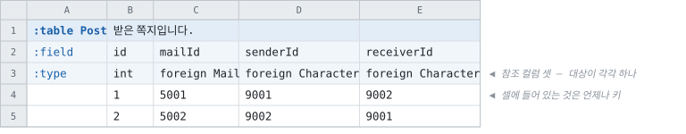
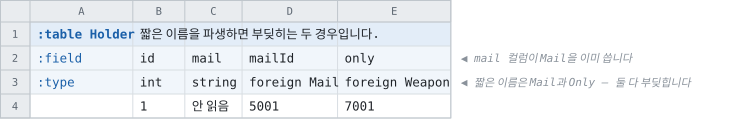
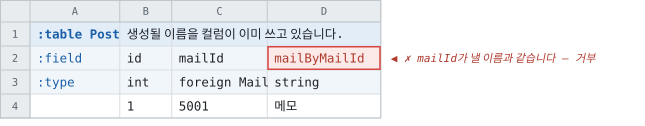
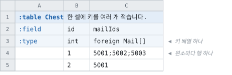
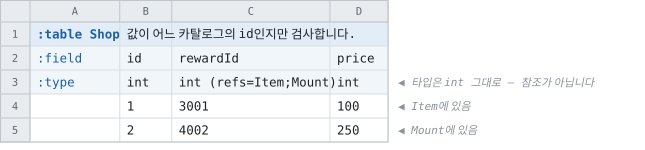

# 참조가 내는 이름

> [문서 목록으로](../../doc/readme.md)
>
> 1절이 인용하는 `multi-target` 골든은 **이 개정이 지운 것**입니다 — 커밋 `7148a6b0`에
> 있습니다.
>
> 상태: **구현 완료** (2026-08-25) — 세 단계 전부. `refs=`가 섰고, 다중 대상 참조를 걷어냈고,
> 이름 규칙이 전 언어에 들어갔습니다. 근거 조사 2026-08-25 (`multi-target` 골든 전 언어 실측 ·
> 타 도구 대조)
>
> **이 문서는 다중 대상 참조를 되돌리고 그 자리에 검사 표기 `refs=`를 둡니다** — 6절.
> [다중 대상 접근자](multi-target-accessors.md) · [다중 대상 참조 §8](multi-target-references.md) ·
> [다형과 참조 배열 §3](../types/polymorphism.md)이 함께 개정 대상입니다

시트에 이렇게 적혀 있습니다.

```
:field   id     mailId
:type    int    foreign Mail
```

**컬럼 이름은 「id」라고 말하고 타입 칸은 「행」이라고 말합니다.** 소비하는 쪽이 받는
프로퍼티가 그중 어느 쪽이어야 하는지가 정해져 있지 않고, 지금 이 도구는 **언어마다 다른 답**을
내고 있습니다.

---

## 1. 문제 — 한 질문에 답이 셋

### 1.1 단일 대상, 대부분의 언어

`only`라는 컬럼에 `foreign Weapon`을 적은 골든입니다
(`multi-target` 골든의 `go/holder_table.go`, 커밋 `7148a6b0` 시점).

```go
Only      *WeaponRecord     // 컬럼 이름이 행에게 갔습니다
OnlyIndex int32             // 키는 이름을 지어 받았습니다
```

### 1.2 단일 대상, C#과 TypeScript

같은 컬럼입니다
(같은 골든의 `csharp/tables/HolderTable.cs`).

```csharp
public WeaponTable.Record Only => _only;     // 행 — 여기까지는 같습니다
public int _only_Weapon_index;               // 키 — 밑줄로 시작하는 이름입니다
```

**키가 공개 표면에 없습니다.** 밑줄로 시작하는 이름은 「읽지 마십시오」라고 말하는 이름이고,
문서에도 없습니다.

### 1.3 다중 대상, 전 언어

같은 파일의 다른 컬럼입니다 — `pick`에 `foreign Weapon|Armour`를 적었습니다
(같은 파일).

```csharp
public int Pick => _pick;                          // 컬럼 이름이 키에게 갔습니다
public HolderPickTarget PickTarget => _pickTarget; // 판별자
public WeaponTable.Record WeaponByPick => ...;     // 행은 이름을 지어 받았습니다
```

**1.1의 정반대입니다.**

### 1.4 셋을 나란히

|  |컬럼 이름이 가는 곳|다른 쪽이 받는 이름|
|--|--|--|
|단일 대상 — Go·Java·Kotlin·Dart·Swift·PHP·Python·Ruby·Lua·C·C++·Rust·Unreal|**행**|키가 `<컬럼>Index`|
|단일 대상 — C#·TypeScript|**행**|키에 **공개 이름이 없음**|
|다중 대상 — 전 언어|**키**|행이 `<대상>By<컬럼>`|

한 도구가 같은 질문에 세 가지로 답하고 있고, **저자는 어느 답을 받을지 시트만 보고 알 수
없습니다.** `mailId`에 1.1을 적용하면 `MailId`가 행을 돌려주고 키의 이름이 `MailIdIndex`가
됩니다.

**셋째 줄이 나머지 둘과 다른 이유가 다중 대상입니다.** 6절이 그것을 되돌리고, 그러면 답이
하나가 됩니다.

---

## 2. 결정 — 규칙 둘과 거부 하나

|#|규칙|
|--|--|
|**1**|**컬럼 이름은 키의 것입니다.**|
|**2**|**행 이름은 `<대상>By<컬럼>`입니다.**|
|**거부**|생성될 이름을 **컬럼이 이미 쓰고 있으면 거부**합니다. 되돌리지 않습니다|

|타입 칸|키|행|
|--|--|--|
|`foreign Mail`|`MailId`|`MailByMailId`|
|`foreign Mail[]`|`MailIds`|`MailByMailIds`|

**`foreign`의 대상은 테이블 하나입니다.** 판별자도, 대상별 접근자도, 대상 목록도 없습니다.
「여러 테이블 중 하나」는 참조가 아니라 **검사**이고, 그 표기가 `refs=`입니다(6절).

`<대상>By<컬럼>`은 **이미 배포된 형태입니다.** 지금 다중 대상이 그것을 쓰고 있고, 이 문서는
단일 대상을 그 형태로 맞춥니다.

### 링킹이 없는 언어

Rust와 Unreal은 참조를 로드 시점에 잇지 않습니다. 그러면 **행이 없으므로 이름도 없습니다** —
그 두 언어의 참조 컬럼은 키 하나이고, 그 키가 컬럼의 이름을 씁니다. 규칙 2는 낼 행이 있는
언어에만 걸립니다.

### 점 표기는 규칙 밖입니다

`foreign Item.Name`은 행이 아니라 **값**을 돌려줍니다. 그러면 컬럼의 이름은 그 값의 것이고,
키가 지어진 이름을 받습니다 — 규칙 2가 뒤집힌 셈입니다. 낼 행이 없으므로 `<대상>By<컬럼>`을
줄 자리가 없고, 키는 그 언어가 쓰던 `<컬럼>Index`를 그대로 씁니다(1절 · 9절).

### 누가 읽는가

|무엇|읽는 사람|
|--|--|
|타입 칸 · 컬럼 이름|**시트를 적는 사람**|
|키 · 행|**생성 코드를 쓰는 사람**|

**참조가 내는 이름은 프로그래머의 것입니다.** 시트가 적는 것은 「이 값이 어느 카탈로그의
id인가」이고, 그 사실로 행에 닿는 것은 소비하는 쪽입니다. 길이의 대가를 프로그래머가
지므로, 형태를 고르는 기준도 그쪽입니다(5절).

---

## 3. 사례

그림은 [reference-surface-figures.py](reference-surface-figures.py)가 냅니다. 생성 코드는
**C# 기준**이고, 다른 언어는 각자의 표기 통로를 지납니다
([이름 표기 규약](../targets/naming-conventions.md)).

### 3.1 단일 대상



```csharp
postRow.MailId                  // int                — 셀에 적힌 값
postRow.MailByMailId            // MailTable.Record

postRow.SenderId                // int
postRow.CharacterBySenderId     // CharacterTable.Record
postRow.ReceiverId              // int
postRow.CharacterByReceiverId   // CharacterTable.Record
```

**`senderId`와 `receiverId`가 같은 테이블을 가리키는데 이름이 갈립니다.** 이름에 컬럼이
들어 있기 때문이고, 이것이 이 형태가 사는 자리입니다.

> **지금 이 시트가 내는 것과 비교하십시오.** `MailId`가 `MailTable.Record`를 돌려주고,
> 키는 Go·Java 계열에서 `MailIdIndex`, C#·TypeScript에서는 `_mailId_Mail_index`입니다(1절).

### 3.2 짧은 이름을 파생하지 않는 이유



`mailId`에서 `Id`를 떼어 `Mail`을 내는 안을 먼저 검토하였습니다. **이 시트가 그것을
막습니다.**

|컬럼|짧은 이름|무엇과 부딪힙니까|
|--|--|--|
|`mailId`|`Mail`|**`mail` 컬럼**이 그 이름을 이미 씁니다|
|`only`|`Only`|자기 **키**와 같습니다 — 뗄 id 낱말이 없습니다|

부딪힐 때 `<대상>By<컬럼>`으로 되돌리는 안도 검토하였고, **그것이 이름을 이웃 컬럼에 매답니다** —
나중에 `mail` 컬럼 하나를 더하면 이미 쓰이던 `Mail`이 `MailByMailId`로 **조용히 개명**됩니다.

**그래서 파생을 두지 않습니다.** 이름이 그 컬럼 하나로 정해지고, 이웃이 무엇이든 안 바뀝니다.
검토하고 버린 다른 안들과 타 도구의 결과는 5절에 있습니다.

### 3.3 유일한 거부



`<대상>By<컬럼>`은 컬럼 이름을 담고 있으므로 **생성 이름끼리는 부딪힐 수 없습니다.** 남는
경우는 컬럼이 그 이름을 손으로 적은 것 하나입니다.

**되돌리지 않고 거부합니다.** 그 셀을 가리키고 컬럼 이름을 바꾸라고 안내합니다 — 되돌리면
3.2가 말한 개명이 되기 때문입니다. 손으로 적을 이름이 아니므로 실수로 생기지 않고, 생기면
그때 한 번 고칩니다.

### 3.4 참조 배열



```csharp
chestRow.MailIds            // int[]               — 셀에 적힌 키들
chestRow.MailByMailIds      // MailTable.Record[]  — 원소마다 행 하나
```

**이름 규칙이 스칼라와 같습니다.** 배열이라고 달라지는 것은 타입뿐입니다.

---

## 4. 규칙 1 — 컬럼 이름은 키의 것

1.4의 세 답을 하나로 만듭니다. 근거가 셋입니다.

- **셀에 있는 것이 키입니다.** 행은 이 도구가 로드 시점에 이어 준 것이고 시트에 없습니다.
  시트가 적은 이름은 시트에 있는 것에게 갑니다.
- **1.3이 이미 그렇게 하고 있습니다.** 그쪽이 없어져도 그 선택은 남습니다 — 두 표면에 각각
  이름이 있어야 하고, 하나는 시트가 적은 것을 씁니다.
- **키에 공개 이름이 생깁니다.** 저장·전송·로그에 id가 필요한 자리가 C#과 TypeScript에서
  지금 밑줄 필드밖에 없습니다. 그리고 `<컬럼>Index`라는 지어진 이름이 없어집니다.

## 5. 규칙 2 — 행 이름은 `<대상>By<컬럼>`

**파생 규칙이 없습니다.** 이름이 그 컬럼 하나로 정해지고, 낱말 목록도 측정도 예외도 없습니다.

|무엇|이 규칙에서|
|--|--|
|이름의 출처|**컬럼 이름과 대상 이름.** 둘 다 시트에 적혀 있습니다|
|이웃 컬럼이 바뀌면|**안 바뀝니다**|
|실패하는 경우|**없습니다.** 부딪히는 컬럼이 있으면 거부이고(3.3), 그것은 이름 규칙의 실패가 아니라 그 컬럼의 문제입니다|

### 검토하고 채택하지 않은 것

|안|`mailId`가 내는 이름|버린 이유|
|--|--|--|
|**id 낱말 절단**|`Mail`|**이웃 컬럼에 이름이 달립니다** (3.2)|
|절단 + 뗄 것이 없으면 **대상 이름**|`only`는 `Weapon`|같은 대상을 가리키는 컬럼 둘이 같은 이름을 냅니다 — `attacker` · `defender`가 둘 다 `Character`|
|절단 + `as=` **지정 수단**|`Mail`|이름의 출처가 둘이 됩니다. 지정하지 않은 시트에는 절단의 문제가 그대로 남습니다|
|**접미 표지** `<컬럼>Ref`|`MailIdRef`|부딪히지 않는 성질은 같고, 배포된 형태를 두고 새 형태를 하나 더 만드는 일입니다|
|**래퍼 타입** `MetaRef<T>` 식|`MailId.Ref` · `MailId.KeyObject`|이름 문제가 통째로 없어지는 대신 **제네릭 래퍼를 모든 언어에** 둬야 합니다. C에 제네릭이 없고, 접근이 한 단 깊어집니다|

### 타 도구가 어디에 도달했는지

|도구|참조가 내는 것|여러 테이블|
|--|--|--|
|[Luban](https://github.com/focus-creative-games/luban/wiki/define)|`ref`는 **검사만** 합니다 — 「이 필드가 어느 테이블의 유효한 id인지」|`refgroup` — **검사할 대상 목록의 이름.** 타입이 아닙니다|
|[Metaplay](https://docs.metaplay.io/feature-cookbooks/game-configs/game-config-item-references)|`MetaRef<T>` 래퍼 하나 — `.KeyObject`가 키, `.Ref`가 행|없습니다|
|[EF Core 스캐폴딩](https://learn.microsoft.com/en-us/ef/core/modeling/relationships/conventions)|FK 이름에서 **`Id`를 떼어** 내비게이션 프로퍼티|없습니다|
|[Rails 다형 연관](https://samuelmullen.com/articles/naming_conventions_for_polymorphic_associations)|관계 이름이 먼저 — `commentable`에서 `commentable_id`·`commentable_type`이 나옵니다|판별자 컬럼 하나, 접근자 하나 (동적 타입)|

**EF Core가 절단을 실제로 하고, 실제로 걸립니다.** `IdSensor` 컬럼은 `Sensor`가 아니라
**`IdSensorNavigation`** 이 됩니다 — 절단이 안 되면 접미사를 붙이는 것이고, 위 표의 네 번째
안으로 결국 갑니다. 그리고 두 테이블 사이에 관계가 여럿이면 **테이블 이름 대신 FK 컬럼
이름**을 쓰는데, 그것이 3.1의 `senderId` · `receiverId`를 푸는 방법과 같습니다. 이 명명은
[efcore#13475](https://github.com/dotnet/efcore/issues/13475) ·
[#16711](https://github.com/dotnet/efcore/issues/16711)로 아직 열려 있습니다.

**타입이 있는 대상별 접근자를 내는 곳은 넷 중 하나도 없습니다.** 6절이 그것을 되돌리는
근거이기도 합니다.

### 대가

**흔한 경우에 깁니다.** `postRow.MailByMailId.Title`이고, 승격된 단일 대상 선언이 `named-range`에서
621개입니다 ([다중 대상 참조](multi-target-references.md)).

받아들이는 근거는 **지금이 더 나쁘다**는 것입니다 — 지금 그 621개는 `MailId`라는 이름으로
행을 돌려주고 키는 밑줄 필드에 있습니다(1.2).

## 6. 다중 대상은 참조가 아니라 검사입니다 — `refs=`

**`foreign`의 대상은 테이블 하나입니다.** 「이 컬럼이 A나 B를 가리킬 수 있다」는 참조로
표현하지 않고, **검사로** 표현합니다.



```
int (refs=Item;Mount)     값이 Item이나 Mount의 행 id인지 검사합니다
int (refs=Item)           하나만 적어도 같습니다 — 검사입니다
foreign Mail              참조 — 값이 행이 되고 접근자가 나옵니다
```

|  |`foreign Mail`|`(refs=Item;Mount)`|
|--|--|--|
|타입|**대상의 키 타입으로 좁혀집니다**|**그대로** — `int`면 `int`|
|생성 코드|키와 행|**없습니다**|
|와이어|대상 키 타입|**그대로**|
|대상 개수|하나|**하나 이상**|
|이 빌드에 대상이 없으면|거부|판정하지 않고 경고 ([컬럼 제약](../layout/column-constraints.md))|

### 새로 만드는 것이 거의 없습니다

|필요한 것|지금|
|--|--|
|괄호 메타 자리|**있습니다** — `min` · `max` · `asset` · `allowed`가 그 자리입니다|
|목록의 구분자|**있습니다** — `allowed=a;b;c` · `key=a,b;c`가 `;`를 씁니다 ([TabbitLayoutParser.cs:1908](../../src/Cooking/Layouts/TabbitLayoutParser.cs#L1908))|
|모델 항목|**있습니다** — [`ColumnConstraints.ReferencedTables`](../../src/Models/ColumnConstraints.cs#L89)|
|검사 패스|**있습니다** — 실측에서 컬럼 273개 · 132만 행 · 위반 0건|

**`refs=`는 이미 있는 모델 항목을 코어 표기로 채우는 것**입니다. `allowed`가 **값의 목록**이면
이것은 **값의 출처 목록**이고, 자리도 구분자도 그것과 같습니다.

### 게이트가 서는 자리가 생깁니다

[다중 대상 접근자 §4](multi-target-accessors.md)가 「코어가 표현할 수 있는 것을 코어 표기가
적을 수 없다 — 그러면 이 기능의 판정 기준이 프로젝트 하나의 워크북이 된다」고 적었고, 그것을
`foreign A|B`로 풀었습니다. **`refs=`가 같은 문제를 검사 쪽에서 풉니다** — 골든 시나리오가
코어 레이아웃으로 이 검사를 적을 수 있게 되므로, 프로젝트 워크북 없이 게이트가 돕니다.

### 왜 참조를 되돌리는가

- **셀렉터는 공통 분모가 없습니다.** A와 B가 무엇을 공유하는지 아무것도 말하지 않으므로
  돌려줄 타입이 없고, 그래서 대상별 접근자와 판별자와 대상 무관 슬롯이 필요해집니다. **표면
  하나를 못 내는 대신 셋을 내는 구조**입니다.
- **컬럼을 나누면 간단합니다.** `itemId foreign Item`과 `mountId foreign Mount` 두 컬럼이면
  각각이 규칙 1·2를 그대로 받고, 어느 쪽인지는 값이 있는 쪽이 답합니다. 판별자도 슬롯도
  캐스트도 없습니다.
- **선례가 없습니다.** 5절의 네 도구 중 **타입이 있는 대상별 접근자를 내는 곳이 없습니다.**
  [Luban](https://github.com/focus-creative-games/luban/wiki/define)이 검사에서 멈추는 것은
  코드 생성이 없어서가 아닙니다 — 그쪽에도 있습니다 — 셀렉터에 낼 표면이 없기 때문입니다.

### 없어지는 것 — 실측

|무엇|얼마|
|--|--|
|`MultiTargetColumns.cs`|**86줄, 통째로**|
|다중 대상을 아는 소스 파일|**33개**|
|대상별 접근자를 내는 자리|**13개 생성기·뷰의 43곳**|
|진단 메시지|4개|
|골든 시나리오 `multi-target` · `variant-set`|**지웠습니다.** `refs=`의 게이트는 `TabbitLayoutTests`와 `ReferencedTableTests`에 있습니다|
|코어 표기 `\|`|없어집니다 — 그 자리를 `refs=`가 받습니다|
|판별 enum · 대상 무관 슬롯 · 식별자 · 승격 패스|없어집니다|

그리고 **이 브랜치의 다형 참조가 함께 없어집니다** — `foreign Reward`, 테이블의 `extends=`,
`foreign A\|B[]`입니다([다형성 §11](../types/polymorphism.md)의 2 · 2′ · 3′). `main`에 없으므로 지금이
되돌리는 비용이 가장 작은 시점이었습니다.

**남는 것.** `abstract struct`는 남습니다 — struct 다형성(`:type`,
[다형성 §5](../types/polymorphism.md))의 것이고 거기서는 상속이 실제로 있습니다. `foreign X[]`도
남습니다 — 대상이 하나인 배열입니다.

## 7. 모델이 받는 것

|없어지는 것|무엇|
|--|--|
|[`Field.RefTableNames`](../../src/Models/Field.cs#L271) · [`IsMultiRef`](../../src/Models/Field.cs#L280)|대상이 하나이므로 `RefTableName` 하나면 됩니다|
|[`members.Count == 1` 분기](../../src/Cooking/ModelCooker.cs#L306)|목록이 없습니다|
|`Table.VariantOf`|테이블이 목록 소속을 들지 않습니다|
|`PromoteReferencedTablesToReferences`|6절 — `refs=`는 참조가 되지 않습니다|
|`CheckKeyBandsDoNotOverlap`|대상이 하나면 겹칠 것이 없습니다. 검사 쪽은 「어느 하나에 있으면 통과」이므로 겹침을 묻지 않습니다|

|남는 것|무엇|
|--|--|
|[`ColumnConstraints.ReferencedTables`](../../src/Models/ColumnConstraints.cs#L89)|`refs=`가 채웁니다. **레이아웃 하나만 채우던 것을 코어 표기도 채웁니다**|
|`ValidateReferencedTables`|그대로 돕니다|

[`IsRef`](../../src/Models/Field.cs#L357)의 뜻은 바뀌지 않습니다 — 오히려 「정확히 한 레코드로
풀린다」가 **모든 참조에 대해** 참이 됩니다.

## 8. 담지 않는 것

|무엇|근거|
|--|--|
|와이어와 형식|**무변경입니다.** 실리는 것은 키이고 이 문서는 이름만 정합니다|
|struct 다형성|값 임베딩이고 참조가 아닙니다. [다형성 §5](../types/polymorphism.md)|
|점 표기(`Table.Field`)의 이름|그 컬럼은 행이 아니라 **값**을 돌려줍니다. 지금 그대로입니다|
|레코드 타입 이름(`ItemRecord` · `ItemTable.Record`)|[이름 체계](../targets/generated-naming.md)가 현행 유지로 정한 축입니다|
|`refs=` 목록에 이름 붙이기|Luban의 `refgroup` 같은 것. 같은 목록이 되풀이되는 것이 실제로 부담인지부터 셉니다|
|이름을 짧게 하는 수단|5절. 짧은 이름은 컬럼 이름을 빼야 하고, 빼면 부딪힙니다|

## 9. 파급

- **단일 대상 참조 전부의 공개 이름이 바뀝니다.** 621개입니다.
- **승격되었던 다중 대상 컬럼이 검사로 돌아갑니다.** 그 컬럼의 와이어가 대상 키 타입에서
  원래 폭으로 돌아가므로 **`named-range` 샘플의 커밋된 출력이 움직입니다.** 미리 재고 diff를 봅니다.
- **전 언어 골든 · 비교본 · 샘플 재기록**입니다.
- **문서 개정** — [다중 대상 참조](multi-target-references.md) ·
  [다중 대상 접근자](multi-target-accessors.md) · [다형과 참조 배열](../types/polymorphism.md) ·
  `doc/sheets.md`의 다중 대상 절.

## 10. 단계와 게이트

|#|무엇|골든|
|--|--|--|
|1|**`refs=`** — 괄호 메타 하나. 모델 항목과 검사 패스는 있습니다|**무변경** — 새 표기를 더할 뿐입니다|
|2|**되돌리기** — 다중 대상 참조를 걷어냅니다. 모델 · 승격 · 생성기 · `\|` 표기|**`multi-target`·`variant-set` 시나리오를 지웠습니다**|
|3|**이름** — 규칙 1·2를 전 생성기에|**전 언어 재기록.** 값은 한 바이트도 안 바뀌고 이름만|

|게이트|확인하는 것|
|--|--|
|단일 대상|`mailId`가 `MailId`(키) · `MailByMailId`(행)로|
|같은 대상을 둘이 가리킴|`senderId` · `receiverId`가 두 이름으로 갈리는지|
|거부|`mailByMailId` 컬럼이 **그 셀을 가리켜 거부**되는지|
|배열|`foreign Mail[]`|
|`foreign A\|B`|**거부**되고, `refs=`나 컬럼 나누기를 안내하는지|
|`refs=`|`int (refs=Item;Mount)`가 검사되고 **타입도 와이어도 안 바뀌는지**|
|`refs=`의 오타|없는 테이블을 적으면 그 셀을 가리켜 보고하는지|
|검사|제약 행의 대조가 **그대로 도는지** — 컬럼 수와 행 수를 함께 셉니다|
|`rescue`|**무변경.** 이 선언이 없습니다|
|`named-range` 재생성|이름이 바뀌고 **값이 안 바뀌는지.** 승격이 풀린 컬럼은 폭이 되돌아갑니다|

## 11. 결정 대기

|무엇|어떻게 정합니까|
|--|--|
|`refs=` 목록에 이름을 붙일지|[Luban의 `refgroup`](https://github.com/focus-creative-games/luban/wiki/define) 같은 것입니다. 같은 목록이 되풀이되는 것이 실제로 부담인지부터 셉니다|

**[다형성](../types/polymorphism.md)의 개정은 끝났습니다** — §1 · §3과 §11의 2 · 2′ · 3′이 되돌림
표시를 달았고, 대상 하나짜리 참조 배열(§11의 3)은 그대로 섭니다. struct 다형성(§5 · §6)도
그대로입니다.
