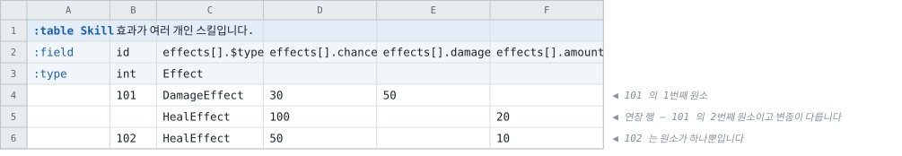

# 표기 — 시트에 무엇을 적는가

> [「다형과 참조 배열」로 돌아가기](../polymorphism.md)

---

## 3. 다형 참조 — 되돌렸습니다

한때 `abstract struct` 로 변종 집합의 이름을 선언하고 테이블이 `extends=` 로 거기 참여하게
해서, `foreign Reward` 가 「이 키가 그 집합의 어느 변종인가」에 답하게 하려 했습니다.

**되돌렸습니다.** 참조의 다중 대상은 **선택지 목록이지 상속이 아닙니다.** 서로 무관한
카탈로그에는 공통 분모가 없고, 공통 분모가 없으면 셀렉터가 돌려줄 타입이 없습니다. 그 자리는
검사 표기 `refs=` 가 받습니다 —
[다중 대상은 참조가 아니라 검사입니다](../../references/reference-surface-naming.md).

**`abstract struct` 자체는 남습니다.** 값 임베딩(§5)에서는 상속이 실제로 있기 때문입니다.

## 4. 참조 배열

**참조가 배열일 때 남은 형태는 하나입니다** — 대상이 테이블 하나인 배열입니다.

```
field rewards  foreign Item[]
```

한 셀에 구분자로 이어 적으면 원소마다 행 하나로 해석되고, 길이는 행마다 다릅니다. 와이어는
키 배열이고, 생성기는 접힌 연번 그룹과 같은 경로로 도달하므로 한 줄도 바뀌지 않았습니다.

> **원소마다 대상이 갈리는 형태는 표기가 없습니다.** `foreign` 의 대상이 테이블 하나이기
> 때문이고, 그것이 3절에서 되돌린 것과 같은 결정입니다. 아래는 셀 배열 자체의 거부를 풀 때의
> 근거이며, 그 근거는 유효합니다.

### 셀 배열 거부의 해제

[`foreign X[]`의 거부](../../../src/Cooking/Layouts/TabbitLayoutParser.cs#L1679)은 「생성 리더에
담을 형태가 없다」였고, **그 형태는 그 뒤에 정해졌습니다** — [다중 대상 접근자
§3](../../references/multi-target-accessors.md)의 「키 · 대상 무관 슬롯 하나 · 식별자」입니다. 원소마다 그
셋을 배치하면 됩니다.

- **저장은 원소마다 슬롯 하나입니다.** 대상마다 슬롯을 두는 것은 그 문서가 측정하고
  채택하지 않은 안입니다 — `RewardFixed`에서 64MB 대 8MB였습니다.
- **공개 표면은 원소 첨자를 받는 접근자입니다.** 언어별 형태는 [레코드 안의
  참조](../../references/references-in-records.md)가 언어를 통일하지 않기로 한 것과 같은 자리이고, 구현
  단계에서 각 생성기의 기존 형태로 확정합니다.
- 참조 배열이 도달하는 경로는 셋입니다 — 셀 배열 · 연번 컬럼 · 멀티 로우. **연번 컬럼은
  이미 됩니다**(2절). 이 항목이 여는 것은 나머지 둘이고, 세 경로가 모델에서 같은 것이
  됩니다.

### 로드맵의 「하지 않기로 함」과의 관계

`foreign[]`은 [로드맵](../../../doc/roadmap.md)에 **하지 않기로 함**으로 기재되어 있습니다.
기재된 근거는 「로우마다 개수가 다른 참조를 해석하려면 생성되는 테이블 리더가 로드 후
연결 단계에서 길이가 다른 배열을 다뤄야 하는데, 지원 언어들에 그런 형태가 없습니다」
였습니다.

**그 근거의 두 전제가 그 뒤에 변경되었습니다.**

|당시의 전제|현재|
|--|--|
|배열의 길이가 디스크립터에 한 번 기록됨|**[v107](../../wire/tcb-v107-dynamic-arrays.md)이 kind를 하나로 정리하였습니다.** 모든 배열이 로우마다 자기 길이를 싣습니다|
|원소마다 해석된 행을 두는 형태가 없음|**[레코드 안의 참조](../../references/references-in-records.md)가 그 형태를 세웠습니다.** 원소마다 키 · 해석 플래그 · 행을 나란히 배치하고, 모든 언어에 구현되어 있습니다|

**남는 것은 길이의 출처 하나입니다.** 지금 생성되는 슬롯 배열은 **컬럼 개수로 크기가
고정**됩니다 — C#이라면 `new T[{멤버 컬럼 수}]`이고, 그것이 연번 컬럼에서 성립하는 이유는
개수가 선언에 있기 때문입니다. 셀 배열에서는 그 크기가 **그 로우의 키 배열 길이**가
되어야 하고, 그 값은 로드 시점에 있습니다.

즉 언어마다 필요한 것은 **상수 대신 로드 시점의 길이로 할당하는 것**이고, 형태가 없어서
막혀 있던 것이 아닙니다. 그래도 **모든 언어를 대상으로 하는 작업**이므로 3번 단계의
비용은 그 크기로 산정합니다.

## 5. 다형 레코드 — 값 임베딩

변종의 필드가 그 행의 컬럼으로 전개되는 방식입니다. 참조와 달리 **id를 부여하지 않습니다.**

```
abstract struct Effect
    field chance int (min=0, max=100)

struct DamageEffect extends Effect @1
    field damage int

struct HealEffect extends Effect @2
    field amount int
```

### 5.1 확정하는 세 가지

[DSL 설계 §8](../../../notes/struct-dsl-design.md)이 문법 확정과 함께 정해야 한다고 기재한
항목들입니다.

|무엇|결정|근거|
|--|--|--|
|**기반 struct의 필드**|**배치합니다**|기반 필드는 와이어에서 **컬럼 하나이고 모든 행에 present**입니다. 변종마다 복제하면 컬럼이 변종 수만큼 증가하고 그중 하나만 채워집니다. 상속이 없는 언어에서 변종 struct에 복제되는 것은 **생성 코드의 사정**이지 형식의 사정이 아닙니다|
|**판별자 값**|**`@N`.** 생략하면 선언 순서로 부여합니다. Tombstone은 `(removed)` — 5.1.1절|[와이어 태그](../../../doc/sheets/naming.md#와이어-태그-n)와 같은 문제입니다 — 번호가 선언 순서에 고정되면 변종을 재배열·삭제할 때 배포된 리더가 다른 변종으로 읽습니다|
|**시트 표기**|**예약 컬럼 `$type`**|주 레이아웃 §7이 확보해 둔 자리입니다. 기호가 `:`에서 `$`로 바뀐 근거는 [주 레이아웃 §2](../../layout/primary-layout.md)에 있습니다 — `:type`이 이미 헤더 행 키라서 겹칩니다|

- **1단만입니다.** 변종은 `abstract`일 수 없습니다. 다단으로 하면 `$type` 셀이 잎 변종을
  기재하는지 중간 층을 기재하는지가 분기하고, 「이 행이 어떤 형태인가」의 답이 둘이 됩니다.
- **한 추상 타입의 변종은 전부 테이블이거나 전부 struct입니다.** 혼용하면 그 필드의 값이
  어떤 때는 키이고 어떤 때는 값이 되어 와이어가 둘로 분기합니다. 혼용된 선언은 거부합니다.

### 5.1.1 판별자 번호 `@N` — 무엇이고 왜 필요한가

```
abstract struct Effect
    field chance int

struct DamageEffect extends Effect @1
    field damage int

struct HealEffect   extends Effect @2
    field amount int
```

**`@1`은 「이 변종의 번호는 1이다」입니다.** 파일에 실리는 판별자 값이 그 번호이고, 그것이
`@N`이 하는 일 전부입니다.

**모양이 낯선 것은 `extends Effect` 뒤에 붙기 때문**이고, 자리가 그런 이유는 **번호가 기반
타입이 아니라 변종의 것**이기 때문입니다. `extends Effect`가 「어느 집합에 속하는가」를 말하고
`@1`이 「그 집합 안에서 몇 번인가」를 말합니다 — 시트에서 `price@3`이 「Price 컬럼의 번호는
3」인 것과 같은 자리이고, 같은 표기를 쓰는 것이 그 때문입니다.

#### 왜 필요한가

**번호를 안 적으면 선언 순서가 번호가 되고, 그러면 선언을 건드릴 때마다 이미 배포된 리더가
다른 변종으로 읽습니다.**

`DamageEffect` · `HealEffect` 두 변종이 순서대로 1 · 2를 받은 상태로 데이터를 배포했다고
합니다. 그 뒤에 `DamageEffect`를 지우면 `HealEffect`가 1이 됩니다. 그런데 배포된 클라이언트가
가진 데이터 파일에는 여전히 `1 = DamageEffect`로 쓰인 행들이 있습니다. **리더는 그 행을
`HealEffect`로 읽고 오류 없이 성공합니다** — 판별자 값이 유효한 범위 안에 있기 때문입니다.
값이 깨지는 것이 아니라 **다른 형태로 해석되는 것**이고, 그것이 검출되지 않는 종류의 사고입니다.

`@N`을 적어 두면 `HealEffect`는 `DamageEffect`가 없어져도 계속 2입니다. **번호가 선언 순서와
무관해지는 것**이 이 표기가 사는 이유입니다.

|같은 문제를 같은 방법으로 푸는 자리|
|--|
|**컬럼** — [와이어 태그 `@N`](../../../doc/sheets/naming.md#와이어-태그-n). 컬럼의 신원을 위치에서 번호로 옮깁니다|
|**변종** — 이 절. 변종의 신원을 선언 순서에서 번호로 옮깁니다|

#### 규칙

|규칙|내용|
|--|--|
|**전부 또는 전무**|한 추상 타입의 변종은 전부 번호를 달거나 전부 안 답니다. 섞으면 오류입니다 — 절반만 고정된 번호는 나머지 절반이 밀리는 것을 막지 못합니다. **하나라도 번호가 있으면 번호를 쓰는 집합입니다**(첫 변종의 것이 아닙니다 — 그렇게 읽으면 `struct A extends E` · `struct B extends E @1`이 둘 다 1이 되고 조용히 지나갑니다)|
|**1 이상, 집합 안에서 유일**|겹치면 오류입니다. 추상 타입이 다르면 같은 번호를 써도 됩니다 — 판별자는 그 집합 안에서만 뜻이 있습니다|
|**안 달면**|선언 순서대로 1..N입니다. 동작은 같지만 **끝에 추가하는 것만 안전**합니다|
|**다시 쓸 수 없습니다**|한 번 데이터를 실은 번호를 다른 변종에 주면, 위의 사고가 그대로 일어납니다|
|**Tombstone**|`struct BurnEffect extends Effect @4 (removed)`. 지운 변종을 그 줄에 `(removed)`만 달아 남겨 두면 그 번호는 다른 변종에 가지 않습니다 — **멤버의 Tombstone과 같은 표기**이고(`field x int (removed)`), 같은 것이 한 단 위에 있는 것이기 때문입니다. Tombstone은 타입이 아닙니다: 어느 컬럼도 담을 수 없고, 생성되는 코드가 없고, 집합의 원소도 아니고, **남은 `field` 줄은 해석조차 되지 않습니다** — 그래서 지운 변종이 쓰던 타입이 함께 없어져도 그 줄을 지울 필요가 없습니다. 잡아 두는 것은 번호 하나입니다|

**컬럼의 `@N`과 다른 점이 하나 있습니다** — 와이어 태그는 테이블 단위로 전부 또는 전무이고,
변종 번호는 **추상 타입 단위**입니다. 와이어 태그를 안 쓰는 테이블에서도 변종 번호는 쓸 수
있고, 그 반대도 됩니다. 두 번호가 서로를 모르기 때문입니다.

#### 이름 — 「태그」라고 부르지 않습니다

**셋을 갈라 부릅니다.** `@N`이 두 자리에 쓰이고, recipe에 `IncludeTags`·`ExcludeTags`가
들어올 예정이라 「태그」 하나로는 어느 것인지 알 수 없습니다.

|무엇|이 저장소에서 부르는 이름|무엇을 정하는가|
|--|--|--|
|컬럼의 `@N`|**와이어 태그** (`Field.WireTag`)|파일 안에서 그 **컬럼**의 신원|
|변종의 `@N`|**판별자** (`PolymorphicVariant.Discriminator`)|파일 안에서 그 **변종**의 신원|
|recipe의 태그|**포함·제외 태그** (예정)|그 빌드가 무엇을 담는가|

셋은 서로를 모릅니다. 같은 표기(`@N`)를 두 자리에서 쓰는 것은 「번호가 위치를 대신한다」는
같은 문제를 같은 방법으로 풀기 때문이고, 같은 것이기 때문이 아닙니다.

### 5.2 시트 — 컬럼의 합집합


|규칙|
|--|
|**다형 그룹의 첫 컬럼은 `<경로>.$type` 하나입니다.** 그 컬럼의 **타입 행**(`:type` 행) 칸에 추상 타입 이름을 기재합니다. 나머지 멤버 컬럼의 타입 칸은 비어 있습니다 — [struct 그룹 표기](../../layout/primary-layout.md) 그대로입니다|
|**컬럼의 집합은 모든 변종의 합집합**이고, 그 행의 변종에 없는 컬럼은 비웁니다|
|**같은 이름의 멤버는 컬럼 하나를 공유합니다.** 변종마다 타입이 다르면 그 이름을 가리켜 거부합니다|
|멤버 경로에 변종 이름을 포함하지 않습니다 — 위 항목이 성립하는 근거이고, 시트의 폭을 억제합니다|

**`$`로 시작하는 이름은 경로의 마지막 마디에서 판정합니다.** 경로가 없는 컬럼에서는 주
레이아웃 §7의 규칙과 같은 뜻이고, 다형 그룹이 중첩될 때 어느 그룹의 판별자인지를 나타낼 수
있습니다. `$key`도 같은 확장을 받습니다.

**식별자 검사에 예외가 하나 생깁니다** — 경로의 마지막 마디는 `$`로 시작할 수 있습니다.
그 자리 말고는 어디서도 `$`가 이름에 들어가지 않습니다.

### 5.3 가변 개수 다형 배열

멀티 로우와 결합하면 원소가 되는 행마다 `$type` 셀이 그 원소의 변종을 정합니다.



[STRUCT DSL 검토 §5.2](../../../notes/struct-dsl-review.md)가 참조 경로로 부족할 것으로 예상한 두
자리 중 첫째가 여기서 성립합니다. 둘째인 「id를 부여할 가치가 없는 종속 데이터」는 5절
전체가 담당합니다.
