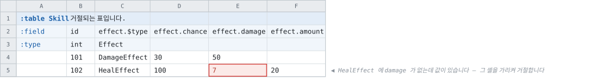

# 와이어와 생성 표면

> [「다형과 참조 배열」로 돌아가기](../polymorphism.md)

---

## 6. 와이어 — 형식 무변경

**이 문서의 핵심입니다.** [Luban 대조 §5.2](../../../notes/luban-comparison.md)는 다형 레코드에
「형식 개정 1회」를 산정하고 「컬럼 지향 인코딩에서 행마다 컬럼 집합이 달라지는 것을 어떻게
담을지가 가장 어려운 자리」라고 기재하였는데, **그 질문은 presence 비트맵이 이미 정하고
있습니다.**

|다형 레코드가 싣는 것|와이어|
|--|--|
|판별자|enum 컬럼 하나. 멀티 로우면 `KindArray`|
|기반 필드|평범한 컬럼. 모든 행에 present입니다|
|변종 멤버|**옵셔널 컬럼** — [v103](../../wire/tcb-v103-presence-bitmap.md) 비트 6(로우) · [v106](../../wire/tcb-v106-element-presence.md) 비트 7(원소)|

v103이 「값은 모든 로우에 대해 기록하고, 없는 로우는 타입의 빈 값을 차지한다」로 배치를
정해 두었으므로, 변종 멤버 컬럼은 대부분이 같은 빈 값입니다.
[v104의 RLE 계열](../../wire/tcb-v104-composed-encodings.md)이 그것을 압축합니다 — **다만 얼마나
압축하는지는 데이터에 달려 있고, 그것이 아래 실측의 결론입니다.**

**새 kind도, 새 와이어 비트도, 새 블록 배치도 없습니다.** 다형 참조는 키 하나이므로 더욱
그렇습니다 — 식별자조차 파일에 실리지 않고 링킹이 산출합니다.

### 6.1 실측 — 형식의 수용과 행 순서의 비용

**구현 없이 쟀습니다.** 이 절이 제안하는 형태 — 판별자 컬럼, 기반 필드, 그리고 모든 변종
멤버를 옵셔널 컬럼으로 펼친 합집합 — 는 **지금 표기로 그대로 적을 수 있는 시트**입니다.
그래서 실제 인코더가 실제 제안을 상대로 낸 수입니다.

같은 데이터 2,000행, 변종당 멤버 6개입니다. 멤버의 값은 **흩어진 값**입니다 — 근거는 아래
「측정을 한 번 다시 한 이유」에 있습니다.

|형태|`.tcb`|참조 대비|
|--|--|--|
|**참조 경로** — 변종 5개가 각자 카탈로그, 그것을 가리키는 테이블 하나|**24,997 B**|1.00배|
|값 임베딩 5 — **변종별로 행이 묶여 있음**|**36,713 B**|**1.47배**|
|값 임베딩 16 — 변종별로 묶여 있음|42,700 B|1.71배|
|값 임베딩 5 — **행마다 변종이 번갈아 나옴**|**70,155 B**|**2.81배**|
|값 임베딩 16 — 행마다 번갈아|86,566 B|3.46배|

**변종의 개수보다 행의 순서가 크게 작용합니다.** 변종을 5개에서 16개로 넓히면 묶인 쪽이
1.16배가 되는데, 같은 5개를 섞어 놓으면 1.91배가 됩니다.

이유는 v103의 배치입니다. 변종 멤버 컬럼은 **없는 행에도 타입의 빈 값을 싣고**, 그 빈 값이
이어져 있을 때만 런이 됩니다. 인코딩 보고서가 i32 멤버 컬럼 하나에 대해 그 셋을 나란히
적습니다.

|그 컬럼이 있는 곳|고른 인코딩|컬럼 하나|
|--|--|--|
|참조 카탈로그 — 400행, 빈 칸 없음|BITPACK|**854 B**|
|값 임베딩, 변종별로 묶임 — 2,000행 중 400행이 present|DELTA_RLE|**1,486 B**|
|값 임베딩, 행마다 번갈아 — 같은 400행|RLE|**2,619 B**|

묶여 있으면 없는 행 1,600개가 런 몇 개로 접히고, 번갈아 나오면 5행마다 런이 끊깁니다.

### 측정을 한 번 다시 한 이유

**처음 잰 수는 틀렸습니다.** 멤버의 정숫값을 등차수열로 만들었더니, 카탈로그에서는 그것이
완전한 등차라 `DELTA_RLE`가 컬럼 하나를 **4바이트**로 접었고, 같은 값이 다른 변종의 행 사이에
놓인 값 임베딩에서는 등차가 아니었습니다. **두 레이아웃을 서로 다른 데이터로 비교한 것**이고,
참조 쪽이 실제보다 좋게 나왔습니다(참조 10,850B · 번갈아 6.06배).

흩어진 값으로 다시 재면 어느 쪽도 그 런을 얻지 못합니다. 방향은 그대로이고 배수가 줄었습니다 —
행 순서가 **4.4배가 아니라 1.9배**입니다.

### 6.2 이 실측이 4단계에 남기는 것

|무엇|결론|
|--|--|
|**형식 개정**|**필요 없습니다.** 위 넷은 전부 지금 인코더가 쓴 평범한 `.tcb`입니다|
|**변종의 폭**|**16개까지 견딥니다.** 상위 문서가 판정 자리로 지목한 곳이고, 묶인 데이터에서 1.71배입니다 — 5개에서 16개로 넓히는 값이 1.16배입니다|
|**행 순서**|**판별자로 정렬합니다.** 6.3절|
|**범용 압축**|**순서를 뒤집습니다.** Deflate 뒤에는 묶인 값 임베딩이 **5,082B**로 참조 경로의 **15,169B**보다 작습니다 — 없는 행이 만드는 긴 런이 압축이 가장 잘 먹는 것이기 때문입니다. 다만 그것은 [모든 런타임에 압축 해제기를 들이는](../../../doc/roadmap.md) 별건입니다|

**값 임베딩이 확보하는 것은 크기가 아닙니다.** 압축하지 않은 파일에서는 묶인 데이터에서도
참조 경로보다 크고, 그것이 사는 것은 **id를 부여하지 않는 것**입니다(9절).

### 6.3 결정 — 판별자로 정렬

**다형 그룹을 가진 테이블의 행은 판별자 순으로 놓입니다.** 시트에 어떤 차례로 적혀 있든
같은 파일이 나오고, 6.1절의 1.9배가 없어집니다.

|무엇|결정|근거|
|--|--|--|
|**어디서**|**쿠킹에서. 익스포터가 아닙니다**|바이너리만 정렬하면 JSON과 행의 차례가 어긋납니다. 적합성 비교는 생성된 리더가 읽은 것과 JSON 익스포터가 쓴 것을 **행마다** 맞춰 보므로, 둘이 다른 차례를 가질 수 없습니다. 모델이 하나이면 차례도 하나입니다|
|**무엇을 기준으로**|**판별자 값. 안정 정렬입니다**|같은 변종 안에서는 아무것도 움직이지 않습니다 — 작성자의 차례가 그대로 남고, 변종만 모입니다. 런을 얻는 데 필요한 최소가 그것입니다|
|**어느 테이블**|**다형 그룹을 가진 테이블만**|지금 그런 테이블은 하나도 없으므로 **골든이 한 바이트도 움직이지 않습니다.** 뒤에 움직일 수 있는 것은 `$type`을 적어 스스로 들어온 테이블뿐입니다|
|**행 세트**|**세트마다 따로**|세트는 각자 자기 파일이고 자기 행을 가집니다 ([행 세트](../../layout/table-row-sets.md))|

### 보이게 되는 것과 그대로인 것

|보는 쪽|바뀌는가|
|--|--|
|조회 — `FindByIndex` 등|**아닙니다.** 키로 찾고, 키는 그대로입니다|
|JSON 배열의 차례|**바뀝니다**|
|생성 코드의 `Records` 목록|**바뀝니다**|
|히스토리 diff|**아닙니다.** 스냅샷이 행을 `RowKey`로 식별합니다 — 자리가 아니라 키입니다|

**작성자의 차례가 산출물의 차례가 아니게 되는 것**이 이 결정이 파는 것이고, 그 대가로 시트를
어떻게 적든 같은 파일이 나옵니다. 파는 쪽이 좁은 것은 **다형 그룹을 적은 테이블에 한정되기
때문**입니다 — 그 표기를 쓰지 않은 테이블은 지금과 완전히 같습니다.

### 채택하지 않은 것 — present만 싣는 인코딩

**없는 행의 값을 아예 싣지 않는 인코딩**이 같은 문제를 다른 데서 풉니다. presence 비트맵이
어느 행인지 이미 말하므로, 값 블록이 present인 행만 담으면 됩니다. 6.1절의 i32 멤버 컬럼으로
재면 2,619바이트가 **카탈로그와 같은 854바이트에 비트맵 250바이트**가 되고, **행 순서가
무관해집니다** — 정렬보다 나은 결과입니다.

채택하지 않는 것은 **비용의 등급이 다르기 때문**입니다. 정렬은 쿠커의 패스 하나이고, 이것은
14번째 인코딩을 형식에 더해 15개 리더에 디코드 경로를 하나씩 늘리는 일입니다. v103이 「값은
모든 로우에 대해 기록한다」를 고른 근거가 정확히 그것이었습니다 — 「9종 × 3종의 디코드를 전부
present인 로우만 세면서 다시 쓰게 된다」.

**둘은 배타적이지 않습니다.** 정렬이 뒤에 이 인코딩이 필요로 할 것을 쓰지 않으므로, 값 임베딩이
실제로 쓰이고 나서 그 비트맵이 무거운 것으로 측정되면 그때 더하면 됩니다.

## 7. 생성 표면

**원칙 하나입니다 — 판별자 하나와, 그 언어가 이미 사용하는 합 타입 표현.** 언어마다 새
개념을 도입하지 않습니다.

**구현이 이 표를 셋에서 다섯으로 넓혔습니다.** 아래가 실제로 선 것입니다.

|표현|언어|무엇으로 좁히는가|
|--|--|--|
|기반 타입 + 변종 타입|C# · Java · PHP · Python · Ruby · C++|`is` · `instanceof` · `isinstance` · `is_a?` · `dynamic_cast`|
|**전수 검사되는 합 타입**|Kotlin(`sealed class`) · Swift(`enum`) · Dart(`sealed`) · Rust(`enum`)|`when` · `switch` · `match`. **빠뜨리면 컴파일되지 않습니다**|
|**구조적 합집합**|TypeScript|`kind` 리터럴|
|**봉인 인터페이스**|Go|타입 스위치. 비공개 메서드가 집합을 닫습니다|
|판별자 + 변종별 접근자|C · Unreal · Lua|좁힐 것이 없으므로 판별자를 읽고 그것이 지목한 변종을 요청합니다|

|초판이 틀린 곳|
|--|
|**Python · Ruby · C++를 셋째 갈래에 넣었습니다.** 셋 다 상속이 있으므로 첫째입니다|
|**TypeScript와 Go를 첫째로 뭉갰습니다.** 앞은 구조적 타이핑이라 클래스를 쓸 이유가 없고, 뒤는 상속이 없어 봉인 인터페이스가 됩니다|
|**전수성을 얻는 넷을 「합 타입이 있는 언어(Rust)」 한 줄로 적었습니다.** Kotlin · Swift · Dart도 같은 것을 줍니다 — 변종이 하나 늘면 모든 소비자에서 컴파일 오류가 되는 것이 이 넷의 값입니다|

언어별 배정은 각 생성기의 기존 형태를 따라 구현 단계에서 확정했습니다 — [레코드 안의
참조](../../references/references-in-records.md)가 언어를 통일하지 않기로 한 것과 같은 자리입니다.

### 7.1 판별자 enum을 두지 않습니다

**변종이 이미 선언된 타입이므로 타입 자체가 판별자입니다.** 별도의 판별 enum을 모델에 두지
않고, 모델이 드는 것은 **변종 목록과 각자의 `@N`**뿐입니다.

|무엇|이름|
|--|--|
|변종 타입|**변종 선언 이름 그대로.** 시트가 아니라 선언이 정합니다|
|타입이 놓이는 자리|**테이블 수준.** 레코드 안이 아닙니다 — 그룹의 프로퍼티가 추상 타입과 같은 이름이라(`Effect` 둘) 중첩하면 부딪힙니다. C#에서 실제로 `CS0102`로 막혔습니다|
|판별자 컬럼의 프로퍼티|**그룹의 멤버 `type`**입니다 — `effect.$type`은 `effect.type`을 냅니다. 그룹 자체가 `effect`라는 이름을 쓰므로 판별자가 같은 이름을 가질 수 없고, `$`는 사용자 문법의 기호이지 생성 코드의 것이 아닙니다|
|판별자 값|`@N`(5.1.1). **파일 안의 수이고, 대부분의 언어에서 소비자에게 보이지 않습니다**|

> **되돌린 다중 대상은 판별 enum을 합성했고, 그것을 여기로 옮기지 않습니다.** 그쪽에서 enum이
> 필요했던 이유는 **변종이 「컬럼에 이름만 나열된 테이블들」이어서 `is`로 검사할 타입이
> 없었다**는 것입니다. 여기서는 `struct DamageEffect`가 실제 타입이므로 그 이유가 없어집니다.
> 이유가 사라진 해법을 옮기면 한 가지에 이름이 셋 됩니다 — struct 이름 · enum 레이블 · `@N`.
> 정본은 struct 선언 하나입니다.
>
> **와이어는 어느 쪽이든 같습니다** — `@N` 정수 하나입니다(6절). 이것은 형식이 아니라 생성
> 표면의 결정입니다.

### 7.2 읽기 경로는 건드리지 않습니다

**리더는 컬럼 단위로 읽으므로 판별자 컬럼이 오기 전에는 어느 변종인지 모릅니다.** 그래서
변종 객체를 읽으면서 만들지 않고, **평평한 원소 구조를 읽기 대상으로 그대로 두고** 그것에서
변종 객체를 만듭니다.

|얻는 것|
|--|
|**읽기 경로가 무변경입니다.** 컬럼마다 대입 하나, 할당 없음 — 지금 그대로입니다|
|**와이어가 무변경인 이유가 여기서도 한 번 더 섭니다.** 이 결정은 파일에 대한 것이 아닙니다|
|**안 보는 행은 비용이 없습니다.** 처음 읽을 때 한 번 만들고 그 뒤로는 그것을 돌려줍니다|

대가는 **읽는 행마다 객체 하나**입니다. 원소를 struct로 둔 것이 할당을 피하려는 선택이었으므로
(`array[j].Member = x`가 struct 배열에서 되는 것도 그 때문입니다) 이 자리에서만 그것을
포기합니다 — 상속이 있어야 `is`가 성립하고, `is`가 §7이 고른 표면입니다.

**상속도 합 타입도 없는 언어**(C · Lua · Unreal)는 변종 타입으로 분기할 수 없으므로 태그를
읽어야 합니다. 그 세 생성기가 **변종 목록에서 자기 관례대로 상수를 냅니다** — C는 `enum`,
Unreal은 `UENUM`, Lua는 상수 테이블. **모델의 항목이 아니라 그 생성기의 산출물**이고, 위 표의
「언어별 배정은 구현 단계에서 확정합니다」가 가리키는 자리가 이것입니다. 나머지 언어에는
판별자 타입이 생기지 않습니다.

- **다형 멤버에 `Has{필드}`를 내지 않습니다.** 그 필드의 존재 여부는 변종이 이미 정하고,
  와이어의 옵셔널은 형식의 사정입니다. 변종 타입에서 그 필드는 선언대로 필수입니다.
- **Rust와 Unreal은 다형 참조의 접근자를 얻지 않습니다** — 그 둘에 링킹이 없기 때문이고,
  다중 대상에서 이미 그렇습니다. 다형 **레코드**는 값이므로 링킹과 무관하고, 두 언어도
  변종 타입을 얻습니다.

## 8. 검증

|규칙|판정|
|--|--|
|`$type` 셀이 비어 있음|오류|
|`$type` 셀이 모르는 이름|오류. **변종 목록과 함께** 보고합니다|
|그 행의 변종에 없는 멤버 컬럼에 값이 있음|오류. 그 셀을 가리킵니다|
|변종의 `@N`이 겹침|오류|
|변종이 Tombstone이 잡고 있는 `@N`을 씀|오류. **Tombstone을 이름으로** 가리킵니다|
|`(removed)`인데 `extends`가 없음 · `@N`이 없음|오류. 둘 중 하나만 없어도 잡아 두는 것이 없습니다|
|`abstract struct`에 `(removed)`|오류. 집합 자체에는 잡아 둘 번호가 없습니다|
|변종이 없는 `abstract struct`|오류|
|변종이 테이블과 struct로 혼용됨|오류 (5.1)|
|변종 테이블에 추상 타입의 필드가 없음 · 타입이 다름|오류 (3절)|
|같은 이름의 멤버가 변종마다 타입이 다름|오류 (5.2)|
|다형 참조의 변종끼리 키 겹침|오류. `CheckKeyBandsDoNotOverlap`을 그대로 사용합니다|

**세 번째 항목이 합집합 표기에서 가장 나오기 쉬운 것**입니다. 컬럼이 모든 변종의 합집합이라
그 행에 해당 없는 칸이 늘 비어 있고, 거기에 값이 들어가도 표는 멀쩡해 보입니다. 빈 칸이
「값이 없다」가 아니라 「그 변종에 그 멤버가 없다」를 뜻하는 표이므로, 조용히 지나가면
소비하는 쪽에서 그 값을 볼 방법이 없습니다 — 변종 타입에 그 필드가 없기 때문입니다.

마지막 항목이 다형 참조가 성립하는 근거입니다 — 값이 있으면 그 값은 변종 중 **정확히
하나**의 행 id라는 계약이고, `all` 빌드 전체에서 실측 0건입니다.
