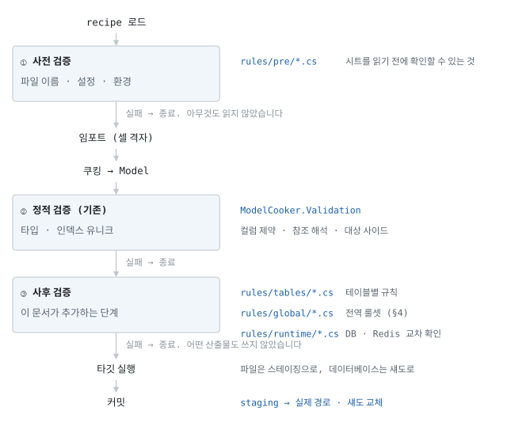

# 검증 파이프라인 — 시트로 나타낼 수 없는 규칙

> 상태: **구현 완료** · 사용법은 [검증](../../doc/validation.md)에 있습니다 ·
> [문서 목록으로](../../doc/readme.md)

테이블 안에 적을 수 있는 제약(필수·범위·허용값)은 [컬럼 제약](../layout/column-constraints.md)이 이미
변환 단계에서 검사합니다. 이 문서는 그것으로 **표현할 수 없는 규칙**을 다룹니다 —
「type이 36인 아이템의 buffId가 가리키는 WorldBuff는 대상이 선단이나 함대여야 한다」처럼
여러 컬럼과 여러 테이블에 걸치고, 때로는 시트 밖(파일 시스템·데이터베이스)까지 봐야 하는
규칙입니다. 지금까지 이런 규칙은 익스포트가 끝난 JSON을 별도의 Lua 도구가 사후에 훑었습니다.
그 자리를 변환기 안의 **C# 스크립트 파이프라인**으로 옮깁니다.

---

## 1. 파이프라인 전체 — 구조 먼저

|단계|보는 것|스크립트 위치|실패 시점의 비용|
|--|--|--|--|
|① 사전|recipe · 소스 파일 목록 · 환경|`pre/`|0 — 아무것도 읽지 않았습니다|
|② 정적|Model (기존, 코어 내장)|없음 — 코드|임포트 비용만|
|③ 사후|Model 전체 (+ 외부 저장소)|`tables/` · `global/` · `runtime/`|임포트·쿠킹 비용만|

**③이 타깃 실행보다 앞인 이유.** 요구는 「사후 검증까지 통과해야 staging → commit」인데,
파일 타깃과 달리 **데이터베이스 타깃은 실행 중에 섀도를 교체합니다** — 타깃을 먼저 돌리면
검증 실패 시점에 이미 데이터베이스가 바뀌어 있습니다. 그리고 모든 산출물은 Model의 결정적
사영이므로, **Model을 검증하는 것이 곧 산출물을 검증하는 것입니다.** 그래서 게이트를 타깃
앞에 둡니다 — 실패한 실행은 파일에도 데이터베이스에도 아무 흔적을 남기지 않고, 이는 지금
스테이징이 파일에 주는 보장을 데이터베이스까지 넓힌 것입니다.

## 2. 기존 Lua 검증의 분석 — 가져오는 것과 두고 오는 것

기존 검증은 141개 Lua 파일입니다: 오케스트레이터(`main.lua`, 511줄) · 공용 헬퍼
(`globals.lua`, 373줄) · 스키마 행 해석기(`validator.lua`, 229줄) · 테이블별 스크립트
119개(`Perform(tables)` 시그니처) · 공용 모듈 몇 개(`LootKindValidator` ·
`validator_shape`). 헬퍼 사용 빈도가 설계의 근거입니다.

|헬퍼|사용 횟수|이 설계에서의 자리|
|--|--|--|
|`Log:Error`|513|`Error(...)` — 컨텍스트의 1급 기능|
|`ReadJson` (JSON 파일 읽기)|170|테이블이면 `Tables.<이름>` — 이미 메모리에 있는 Model에서. 테이블이 아닌 일반 JSON은 `Json(path)` 헬퍼로|
|`BinaryCode` (KR/GL/CN 분기)|30|`Option("...")` — 자유 키/값, 코어는 로케일을 모릅니다|
|`IsServer` 분기|27|`Field.TargetSide` — 모델이 이미 알고 있습니다|
|`UAssetFilemap` 등 파일맵 7종|35|`Files(root, pattern)` — 범용 파일맵 헬퍼|
|`CheckLink`/`CheckRequired` 등 6종|39|**옮길 것이 없었습니다** — 정적 검증과 타입 액세서가 이미 처리합니다|
|**`Log:Trace`**|**87**|**`Info(...)`** — 판정이 아니라 기록. 두 번째로 많이 쓰인 것이고, 이 자리가 없으면 스크립트가 남길 말이 없어집니다|
|`Log:Warn`|6|`Warn(...)` — 커밋을 막지 않는 보고|

**가져오는 것** — 구조가 검증된 관례들입니다.

- **파일명 = 테이블명 바인딩.** `tables/ItemRules.cs`는 `Item` 테이블을 받습니다. 119개
  스크립트가 이 관례로 유지되었고, 「이 테이블의 검증이 어디 있는지」를 찾는 방법이 파일 목록
  그 자체가 됩니다.
- **공용 모듈.** `LootKindValidator`를 7개 스크립트가 공유했습니다. `shared/`가 같은
  자리이고, 결합은 호스트가 합니다 — 지시자를 적지 않습니다.
- **헬퍼 집합.** 위 표가 정한 범위 그대로입니다 — 다만 검사 유틸 6종은 구현하면서 **필요가
  없어졌습니다.** 필수·범위·허용값·참조는 정적 검증이 셀 위치와 함께 이미 검사하고, 남는 조건부
  규칙은 `if` 한 줄이라 헬퍼가 오히려 한 겹입니다.

**두고 오는 것** — 그 도구의 사정이었지 규칙이 아니었던 것들입니다.

|Lua의 것|왜 두고 오나|
|--|--|
|산출물 JSON을 다시 읽기|검증이 변환기 안이므로 Model이 이미 손에 있습니다. 보고도 「`Item.json`의 1,847번째」가 아니라 **셀 위치**(`워크북 : 시트 : AF12`)입니다|
|로케일 3 × 사이드 2 = 최대 6패스와 중복 스킵 장치|`main.lua`의 절반이 이 장치였습니다(내용 동일 파일 건너뛰기, `IsServer` 사용 스크립트 자동 감지). Model 1회 검증으로 대체됩니다 — 사이드는 필드가 알고, 로케일 변종(`_BC`)의 모델 표현은 당시 미정이라 그것이 정해지면 검증도 그 축을 따릅니다|
|`:min` `:max` `:enum` `:link` `:required` 스키마 행|[컬럼 제약](../layout/column-constraints.md)과 참조 해석이 이미 정적 단계에서 셀 위치와 함께 검사합니다|
|`:asset` 검사 자체|시트를 읽는 쪽이 판정할 문제가 아니라는 [판단](../layout/column-constraints.md#에셋-존재-검사--제외했다가-되돌린-것)은 유지합니다. 대신 **범용 파일맵 헬퍼**를 두어, 무엇을 확인할지는 프로젝트의 스크립트가 정합니다 — 코어는 `.uasset`이라는 확장자를 모릅니다|

## 이 문서의 나머지

|무엇|어디|
|--|--|
|[3. 스크립트 모델 — 프로젝트 없는 `.cs`](validation-pipeline/script-model.md)|규칙을 프로젝트 없이 `.cs` 로 쓰게 하는 모델|
|[검증의 범위와 실행](validation-pipeline/scope.md)|전역 룰셋 · recipe 설정 · 런타임 검증 · 실행 · 코어와의 경계|
|[남은 것과 다시 볼 조건](validation-pipeline/open.md)|구현 순서, 알고 있는 취약점, 그리고 이 결정을 다시 볼 조건|
